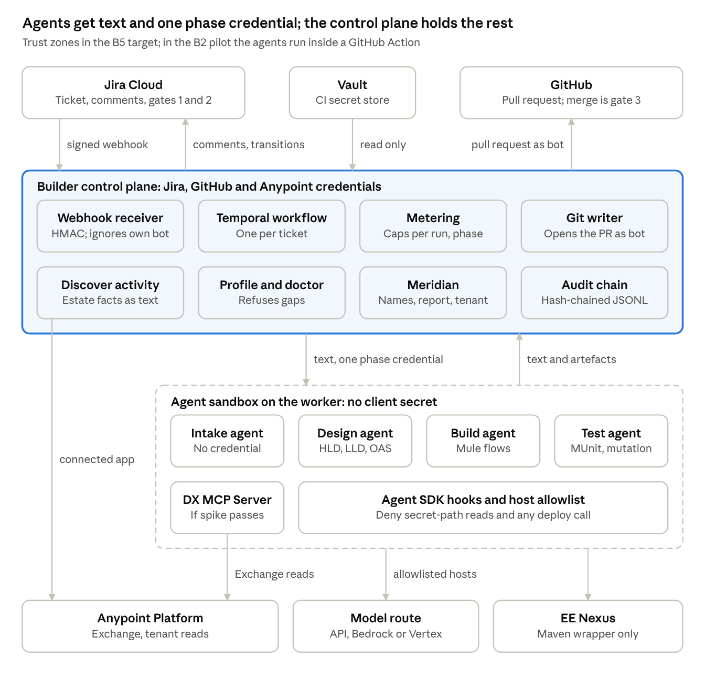
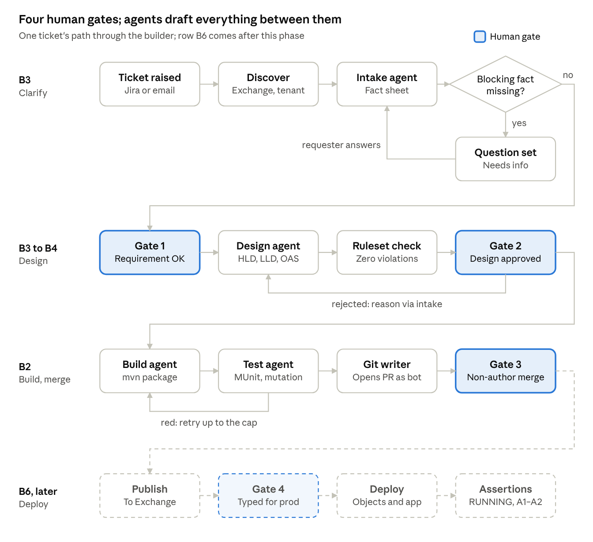
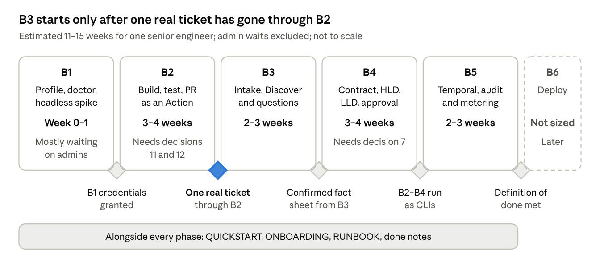

# Project Ultima — AI Builder High-Level Design

Oct 8, 2026 · Vikas Hegde · Exported from the [live doc](https://claude.ai/code/artifact/079f03ac-c7a6-4776-989d-83eb47cf297b); edit there and re-export.

## Overview

The builder is a self-hosted agent service that turns one Jira Cloud ticket into a GitHub pull request for a Mule 4.9 application. Agents draft every artefact; four human signatures gate the run. It is a product for several client organisations, built beside Meridian, which it imports and runs as CLIs. This phase ends at the pull request; deploy (B6) is only sketched.

**Goals**

- Clarify a requirement on its own ticket, then design, build and test it and open a pull request, unattended between gates.
- Run for days with nobody watching, and trace every artefact to who, what, when and how much.
- Isolate each client by its own profile, vault and connected app (decision 3) and its own model route (decision 1).
- Measure value in reviewer minutes and acceptance, not tokens. On the research's estimate the token bill, about $40–60 for a medium integration with rework, is one to two percent of the developer days it displaces; only the UK £650 day rate behind that is verified.

**The four human gates**

| # | Gate | Recommended signer (decision 6) | Where it is signed | Phase |
| --- | --- | --- | --- | --- |
| 1 | Requirement confirmed complete | One architect, named per client in the profile | Jira transition out of *Requirement review* | B3 |
| 2 | Design approved | The same architect | Jira transition out of *Design review* | B4 |
| 3 | Pull request merged by a non-author | A developer who is not the author | GitHub branch protection | B2 |
| 4 | Deploy approved, typed for production | Release owner | Typed production confirmation, before the write | B6, later |

Until decision 6 is answered, the owner signs all four for the pilot, which the plan calls honest for one ticket and wrong for the second. Decision 10's outbound rule is a fifth human touch: nothing reaches anyone but the requester, on the ticket, without a human sending it.

**Design principles**

- **The ticket is the spine and the state.** One ticket per integration; email enters only through Jira's mail handler, so there is one conversation.
- **Untrusted text never meets a credential.** The intake agent holds none; no agent holds a client secret, only one short-lived credential for its phase. The plan implements a narrower rule than it states; see [Design gaps](#design-gaps-and-proposed-resolutions).
- **A test that cannot fail proves nothing.** A separate agent writes MUnit with concrete expected values, coverage is enforced, the processor under test is never mocked, and a mutation check must go red.
- **The per-client profile is the first object.** Nothing runs on a profile that is not whole.
- **Parity.** Every phase is a CLI; the GitHub Action, the workflow and a terminal run the same command.
- **Silence is an error.** Exit codes are Meridian's: 0 nothing owed, 1 findings, 2 error; a check that could not run says INCOMPLETE.
- **Versions come from Exchange and the pom**, never model memory; secrets are placeholders only.
- **Provenance on every artefact:** ticket, model and provider, prompt hash, region and signing reviewer.

**Not in this phase:** deploy, the Exchange publish that goes with it, and any deploy-capable credential; hosted agents (the plan recommends revisiting after beta) and a direct mailbox (not returning); MuleSoft-hosted flow generation, and Vibes as a pipeline component; Jira Data Center, Bitbucket and Azure DevOps; a UI; integrations that are themselves MCP servers, and Agent Fabric governance; several tickets sharing one worker, or several integrations from one ticket; any zero-data-retention or EU-residency promise the model route does not itself make; encrypting secrets; signing the audit chain.

## Architecture at a glance

The builder has three trust zones: hosts where humans sign, a control plane that holds the Jira, GitHub and Anypoint credentials and does every exchange, and an agent sandbox that holds no client secret.

In the B5 target, Jira and GitHub talk only to the control plane; in the B2 pilot the agent run is itself a GitHub Action woken by the listed bots. Agents receive text and at most one short-lived credential for their phase. Discover reads Anypoint under the client's connected app, outside the sandbox; agents read Exchange through the DX MCP Server, a local process, if the spike passes, and otherwise through the Anypoint CLI or the Developer Hub APIs; connector operations come from describe-connector either way. The EE Nexus credential sits in a Maven settings file outside the agent's working tree.

**Alternatives rejected.** Hosted agents are ruled out for this phase for three reasons: vault substitution is outbound-only, so a client-credentials exchange returns the bearer credential into the sandbox unless the control plane does it; the sandbox ships JDK 21 where Mule 4.9 needs 17; MuleSoft's Maven hosts are not on its default allowlist. The plan recommends revisiting after beta with those three as the test. This HLD's reading, beyond the plan: only the last two separate the options, since control-plane exchange is required either way. A direct mailbox is rejected for good: weeks of tenant-admin consent and a second conversation state.

## Components

Thirteen builder components in three kinds: agents that read and write text, control-plane code that holds credentials and does every write, and the stores and guards around them. Only control-plane code posts to Jira, opens pull requests or exchanges Anypoint credentials; agents may read Exchange through their tools with the phase credential.

| Component | Kind | Responsibility | Credential it holds | Phase |
| --- | --- | --- | --- | --- |
| Control plane | Builder code | Fetches tickets, posts comments and transitions, does every credential exchange, hands an agent at most one short-lived credential for one phase | Jira bot, Anypoint connected app, read from the vault | B2–B5 |
| Discover activity | Control-plane activity | Exchange search, `describe-connector`, `meridian tenant discover`; `tenant infer --repos` and `validate` offline; output handed to the intake and design agents as text | Connected app; Exchange Contributor is the only grant this phase | B3 |
| Intake agent | Agent SDK session | Turns ticket text plus Discover output into the fact sheet (each fact known, assumed or missing) and one numbered question set | None; starts with an empty environment | B3 |
| Design agent | Agent SDK session | Applies the client's ruleset, skills file and pattern decision table; writes the contract, HLD and LLD | One short-lived phase credential; no platform write, no publish | B4 |
| Build agent | Agent SDK session | Scaffolds a Mule 4.9.x LTS project on JDK 17; writes the APIkit router, flows and DataWeave with the builder's own model; runs `mvn clean package` | Phase credential; reads the confirmed fact sheet file, never the ticket | B2 |
| Test agent | Separate Agent SDK session | Writes MUnit 3.7.4 with concrete expected values, turns coverage on with `failBuild`, never mocks the processor under test, runs the mutation check | Phase credential | B2 |
| Git writer | Control-plane code | Opens the pull request from the bot identity with design, test evidence and provenance; posts the link on the ticket | GitHub bot | B2 |
| Workflow engine and workers | Temporal (MIT) on owner-run workers | One workflow per ticket, one activity per phase, one signal per gate | Worker exports the phase's connected-app pair for Meridian's CLIs | B5 |
| Agent SDK hooks | Guard code | Deny secret-path reads, any deploy call and listed commands such as `mvn help:effective-settings`; route approvals to a Jira comment | None | B5 |
| Client profile and `builder doctor` | Config plus checker | Loads a whole profile or refuses it; names every missing onboarding item by number; checks connected apps' scope and expiry | Not stated; the profile names the vault scope | B1 |
| Metering | Control-plane code | Prices tokens by route against per-run and per-phase caps; records cache hit rate, loops and rework per run | None | Caps from B2; full metering B5 |
| Audit chain | Store | Meridian `runlog.RunLog`: append-only JSONL with a SHA-256 chain, verified by `meridian runs --verify` | None | B2 imports it; B5 makes it durable |
| Meridian | Imported names plus CLIs; a pinned wheel under decision 5's default | `naming`, `grammar.Grammar.render`, `report --fail-on CRITICAL`, `prepare`, tenant commands | Runs under the phase's connected app | B1–B5 |

**Design inputs and pattern selection.** The client's standards (decision 7) reach the design agent as things it can apply: a governance ruleset, a skills file and a pattern decision table. The table is data with a test per row; it chooses from the confirmed facts (synchronous or MQ, scatter-gather, batch, reliability, saga), so each choice is explained by the row that fired. When two rows fire, the design names both and asks. Reuse found in Exchange is listed before a new layer is justified, and the default is the fewest layers that give reuse, not three-layer API-led by mandate. Most clients' standards are prose, so B4's first week per client is the client architect converting them.

**B1 spike and fallbacks.** The spike takes one day: run `mulesoft-mcp-server` on a runner with no VS Code, authenticate as the connected app, call what B2 needs, and record which tools answer either way. Until then every DX MCP Server mention reads *if the spike passes*.

| Need | If the spike passes | Fallback |
| --- | --- | --- |
| Scaffold | DX MCP Server | `dx:mule:project:create` from the Anypoint CLI DX plugin, `--mule-version` always passed because it defaults to 4.4.0 |
| Connector versions | DX MCP Server `search_asset` | Anypoint CLI or Developer Hub APIs; no other headless Exchange search was found |
| Connector operations | `describe-connector` | `describe-connector` |
| APIkit router and flows | Builder's own model; `implement_api_spec` is read as IDE-only | Builder's own model |
| Exchange publish (B6) | DX MCP Server publish | `exchange:asset:upload` from the Anypoint CLI |

**External systems**

| System | Used for | How the builder connects |
| --- | --- | --- |
| Jira Cloud | Intake, conversation, gates 1 and 2, run state | HMAC-signed webhook in; REST under a bot account out |
| GitHub | Repository, pull request, gate 3, pilot runner | Bot identity behind branch protection; `claude-code-action` for the pilot |
| Anypoint Platform | Exchange search, `describe-connector`, tenant reads, ruleset validation | Per-client connected apps, one per agent, in the target business group; non-production; expiry set |
| DX MCP Server | Scaffold, Exchange and DataWeave tools; publish and deploy only in B6 | Local npm process on the worker, only if the spike passes |
| Model route | Every agent session | Claude API, Bedrock or Vertex with its region, per client; the model per phase (decision 1) |
| Vault | Per-client secrets | The CI secret store's per-client scope, read by the control plane only |
| MuleSoft EE Nexus | EE runtime, which most applications need to run MUnit | Maven settings outside the agent's tree, read only by a permitted Maven wrapper |

## Ticket lifecycle

A ticket passes three agent stretches, each closed by a human gate, and every loop returns to an agent rather than past a gate. Jira statuses carry the state: *Needs info*, *Requirement review*, *Design review*.

The intake agent asks one numbered question set per round and never re-asks an answered fact; a contradicted answer is kept with both dates and the next question says so. The ticket returns to *Needs info* only while a blocking fact is missing. The fact-sheet threshold starts strict: too low and B4 designs on assumptions, too high and the requester is interrogated; the measurement moves it. A design rejection returns to Design, never to Build. A red build or suite loops to Build until the retry cap, then the run stops and says so on the ticket. Under B5 each gate's transition raises a Temporal signal; in the B2 pilot the confirmed fact sheet is pasted by hand.

**Comparator.** GitHub Copilot for Jira (GA 25 June 2026) already clarifies inside Jira; per the research's critic, the fact-sheet threshold is what nobody sells. Ten fixture tickets go through both, counting questions asked and facts still missing after one round.

## Data objects

The fact sheet is the hinge: the intake agent writes it from untrusted text, a human confirms it at gate 1, and downstream agents read that confirmed copy, never the raw ticket. Everything else is per-client configuration or evidence carried by the pull request and the audit chain.

| Object | Written by | Read by | Contents | Kept in |
| --- | --- | --- | --- | --- |
| Client profile | Onboarding: Meridian `init` plus `builder.yaml` | Loader, doctor, every phase | Meridian's `tenant.yaml`, `environments.yaml`, `compare.yaml`, `.env`; model route and caps, data rules, bots, vault scope, design standards, gate owners | Per-client directory, gitignored |
| Discover findings | Discover activity | Intake agent as text, design agent | Exchange search, connector operations, tenant facts | Handed over per run |
| Fact sheet | Intake agent, as text | Gate 1 signer, design, build and test agents | Source, target, trigger, volume, SLA, error handling, security, mapping, environments; each known, assumed or missing, with the source of each known fact; an assumed fact is never promoted | A file per ticket |
| Question set | Intake agent, as text | Requester | One numbered set per round, only facts still missing | One Jira comment, ticket moved to *Needs info* |
| Answer ledger | B3's intake loop; the plan names no writer | Intake agent, design agent | Answers keyed on ticket and fact; a contradicted fact kept twice, marked *changed* with both dates | Not specified |
| Contract | Design agent | Ruleset check, gate 2 signer, build agent | OAS 3.0 or RAML at zero ruleset violations | The pull request; published to Exchange only in B6 |
| HLD | Design agent | Gate 2 signer, reviewer | The pattern, the decision-table rows that chose it, the layers and why that many | The pull request |
| LLD | Design agent | Gate 2 signer, build agent | Flows, error handling, names rendered by the client grammar and parsed back, property keys per environment | The pull request; keys also in `tenant.yaml` `deployment_properties:` |
| Mule project and MUnit suite | Build agent, test agent | Maven, `meridian report`, reviewer | Application, placeholders, tests, coverage and mutation results | Pull request branch |
| Pull request | Git writer | Gate 3 reviewer | Code, design, test evidence, provenance line | GitHub |
| Audit chain | Control plane via `runlog.RunLog` | `meridian runs --verify` | One JSONL record per event, SHA-256 chained, with provenance and the agent definition's hash | `MERIDIAN_STATE_DIR` on durable storage, copied to Meridian's action log |
| Run measurements | Metering, pilot ticket fields | Owner | Tokens per run and phase; cache hit rate, loops, rework per run; *accepted* and reviewer minutes | Ticket fields and run records |

**The LLD's key list is a contract.** Its per-environment property keys go into the profile's `deployment_properties:`, so `meridian report` resolves them by the profile layer; the runtime-collection layer says *not checked* until the first collection. A key the LLD did not name and no file defines stays CRITICAL and fails the phase. The list must equal what `report` finds in the generated code, and it is exactly what Meridian's `prepare` checklist will later hold the config file to.

**Measurement.** Every run records two numbers in ticket fields. *Accepted*: merged by a non-author, with the count of change requests and whether any flow or mapping was rewritten by hand. *Reviewer minutes*: from opening the pull request to merge, every round included. A pilot that cannot record the minutes has not run.

## Trust boundaries and security

**Data-flow posture.** Meridian's `docs/DATA-FLOW.md` says nothing leaves the machine; the builder reverses that: client data leaves the machine by design, under the client's rules. The profile says which route is used and what may be sent, and the doctor refuses a route the rules forbid. This phase promises no zero-data-retention or EU residency beyond what the route itself makes.

The control plane holds the Jira and Anypoint credentials, its git writer holds the GitHub bot credential, and it does every credential exchange. An agent gets at most one short-lived credential for one phase, the intake agent gets none, and nothing built in B1–B5 can deploy. The rule exists because ticket text hijacked coding agents in GitHub Actions into exfiltrating credentials in April 2026.

| Credential | Held by | Must never reach | Enforced by |
| --- | --- | --- | --- |
| Jira bot | Control plane | Any agent | Test lists the intake and build agents' starting environments |
| GitHub bot | Git writer | Any model | The pull request is opened by code, not an agent |
| Anypoint connected app | Control plane, which exchanges it for a short-lived phase credential | Any agent as a client secret; any production environment | Loader refuses a production environment for any agent; doctor refuses a production-scoped or non-expiring app; B3 and B5 tests capture agents' starting environments |
| EE Nexus | Maven settings outside the agent's working tree | Agent environment, worker image | Hooks deny secret paths; `mvn help:effective-settings` is denied; a transcript asked for the password yields a refusal |
| Deploy-capable credential | Nothing in B1–B5 | Everything in this phase | The doctor refuses one |
| Encryption key for `ENCRYPT` marks | The client's key holder | Any agent | Marks are left for the key holder |
| Mail credential | Nothing | — | Direct mailbox rejected; email enters only through Jira's mail handler (decision 10) |

**Untrusted text path.** The control plane fetches the ticket and hands the intake agent text; the agent returns text; the control plane posts it. The build agent sees only the human-confirmed fact sheet. An instruction planted in a comment is quoted back on the ticket and acted on by nobody.

**Inbound events.** A webhook with a wrong HMAC signature is dropped and logged. Events whose actor is the builder's own bot are ignored, so the pipeline never answers itself. A signal for a gate not yet reached, or from the wrong actor, is refused.

**Agent sandbox.** Agent SDK hooks deny secret-path reads and any deploy call, and route every approval to a Jira comment rather than a keyboard. Each worker has an outbound host allowlist; a run under an EU-pinned profile is asserted to call no other host. An injection corpus runs through every phase's tool log and must produce no credential read and no call outside the allowlist. EU residency exists only through Bedrock or Vertex, and Fable 5.1 is unavailable under zero-data-retention.

**Generated code.** Every environment-specific or secret value is a `${MERIDIAN_SET_<ENV>}` or `${MERIDIAN_ENCRYPT_<ENV>}` mark that Mule refuses to start on. `meridian report --fail-on CRITICAL` runs over the generated repository, and a secret scanner runs before any commit. No client detail or requirement text enters the builder's own repository; a per-client deny-list and tripwire check every commit.

**Merge integrity.** The pull request sits behind branch protection, and the bot's own review never satisfies a gate. The research did not find GitHub stating whether a bot's review satisfies a required review, so each repository carries its own proof: a bot-only approval shown blocked. *Approve and run workflows* is locked on and its state recorded; the Jira and GitHub bots are listed in `allowed_bots`, held by a test.

**Provenance.** Every artefact carries ticket, model and provider, prompt hash, region and signing reviewer, in the pull request and in the audit chain.

## Runtime and non-functional design

The pilot runs as a GitHub Action with the ticket as its only state; B5 moves the same CLIs under Temporal so a run can wait days between gates. Because every phase is a CLI, the move changes the runner, not the phases. B2–B4 take their briefs as files, unchanged in shape under B5, or B2's measurement stops meaning anything.

|  | Pilot (GitHub Action, B2–B4) | Target (B5) |
| --- | --- | --- |
| Runner | `claude-code-action` | One Temporal workflow per ticket on owner-run workers |
| State | The Jira ticket | The Jira ticket, with a durable workflow waiting on gate signals |
| Waiting | No durable wait; six-hour ceiling | Survives worker restarts; resumes on the gate's signal without repeating a write |
| Trigger | Ticket transition; bots listed in `allowed_bots` | Jira webhook raises one signal per gate |
| Unit of work | A CLI call per phase | An activity per phase, the same CLI call |

**Worker.** A container with JDK 17, Maven, Node, the CLIs and, if the spike passes, the DX MCP Server. Each workflow loads its client's profile in a fresh process, because import-time settings have cost Meridian three bugs. Per workflow the worker exports the client's `MERIDIAN_*` paths, `MERIDIAN_ENV_ALLOWLIST` set to non-production, `MERIDIAN_AUTH_MODE=connected_app` explicitly, and the phase's `ANYPOINT_CLIENT_ID` and `ANYPOINT_CLIENT_SECRET`. A test holds that no path in the worker reaches browser SSO.

| Concern | Design response |
| --- | --- |
| Durability | Temporal workflow per ticket; signals per gate; no repeated writes on resume |
| Cost | Dollar cap per run and per phase in every profile from B2's first run; a capped run stops and says where and what it spent |
| Build cost | Maven runs only on the ticket's transition, never on push, never on Windows runners |
| Prompt cache | Stable prefix kept warm, or the one-hour window bought at twice the write cost, since a cold Maven run outlasts the five-minute default |
| Jira rate limit | Points-based, 65,000 points an hour by default; Automation rules metered in steps; a ticket is read once per wake |
| Observability | Tokens per run and per phase; cache hit rate, compile-test loops and rework rate per run; reviewer minutes and acceptance as ticket fields |
| Auditability | Hash chain under `MERIDIAN_STATE_DIR` on durable storage, copied into Meridian's action log, checked by `meridian runs --verify` |
| Tenant isolation | Profile, vault scope and connected app per client; fresh process per workflow; environment allowlist per client |
| Residency | Route set in the profile; EU only through Bedrock or Vertex; the doctor refuses a route the data rules forbid |

**Failure handling.**

- A red build or suite loops back to Build up to the profile's retry cap, then stops and says so on the ticket.
- A run that reaches its cap stops, posts one line saying where and what it had spent, and exits 2 if no pull request was opened, 1 if one was and the cap stopped the test agent.
- A phase exiting 2 fails the workflow instead of retrying for ever.
- A run that opens no pull request, or a webhook that produces no comment, transition or ledger write, is an error.
- A missing coverage report shows INCOMPLETE where the number would be.
- A design rejection returns through the intake agent to Design, never to Build.

**Technology baseline.**

| Item | Version or choice |
| --- | --- |
| Mule runtime | 4.9.x LTS at its current patch, never bare 4.9.0, on JDK 17 |
| MUnit | 3.7.4, coverage threshold on with `failBuild` |
| API contract | OAS 3.0 by default, RAML where the profile says (decision 7's default) |
| Governance ruleset | Anypoint Best Practices, 1.6.5 at research time, zero violations |
| Scaffolding | DX MCP Server, 1.3.10 at research time, if the spike passes; else the Anypoint CLI DX plugin |
| Orchestration | Temporal (MIT) with the Anthropic Agent SDK |
| Logging in generated apps | Core Logger with MDC, since the JSON Logger is archived (decision 7's default) |

If AsyncAPI is ever used, it is 2.6 on Mule 4.6 and later; there is no 3.x.

## Delivery roadmap

The plan sizes this phase at 11–15 weeks of engineering for one senior engineer with a part-time MuleSoft architect, run in dependency order B1 to B5, which is not the ticket's order: build, test and merge (B2) are proven before intake (B3) and design (B4). The sizes are the research's estimates with no evidence behind them; the first real ticket corrects them.

B1 can start now but mostly waits on admins; each item is dated asked and answered:

- A connected app with B1's permission set, in the target business group, non-production, with a secret expiry
- Enterprise Nexus credentials from MuleSoft Support, since most applications need the EE runtime to run MUnit
- A Jira bot account and a GitHub bot identity
- The account team's written answers on Einstein-backed generation's cost and on `license.lic`

A trial org is not a test bed: it has no generative feature, and no MUnit for most applications unless Support issues EE Nexus credentials. B2 builds from a hand-confirmed fact sheet first, so the expensive part is proven on one real ticket before intake and design are automated. QUICKSTART, ONBOARDING (whose numbered items the doctor cites) and RUNBOOK are written alongside each phase.

## Open decisions

Decisions 1–4 are answered: model route per client, with hosted agents ruled out for this phase; the builder's own model writes every flow; a multi-client product; Jira Cloud plus GitHub. Eight remain open with defaults. The plan says 7 blocks B4 and 11 and 12 are needed before B2's first real run; the other *Needed by* entries are this HLD's inference.

| # | Decision | Default if not decided | Needed by |
| --- | --- | --- | --- |
| 5 | Repository shape | New repository importing Meridian as a version-pinned wheel; a test holds the imported names and the CLIs' exit codes and output shapes. Meridian's tree carries the nothing-leaves-the-machine posture, and the builder's Node, JDK, Maven and SDK dependencies do not belong in its lock | Not stated; B1 starts on the default |
| 6 | Gate signers and turnaround | Owner signs all four for the pilot; recommended: one architect for gates 1–2, a non-author developer for 3, the release owner for 4; two business days, a reminder at one; per client in the profile | B3's first ticket (inferred: the default is wrong from the second) |
| 7 | Mandatory design artefacts | OAS 3.0 contract-first, ruleset at zero violations, fewest layers that give reuse, core Logger with MDC; per client in the profile | B4 |
| 8 | Deploy route | Hand the artefact to the client's own pipeline and confirm RUNNING with Meridian's assertions; a registered CloudHub 2.0 write under the capture gate only for a client with no pipeline | B6 (inferred) |
| 9 | Product name | *The builder*; nothing costly to rename embeds it | Never blocking |
| 10 | Outbound messages | Post only to the requester, on the ticket; nothing external, and nothing by email, without a human sending it; a *Draft* status in B3 for clients who want every comment read first | B3's first ticket (inferred) |
| 11 | Dollar cap | Three times the medium estimate as the meter measures it, about $170 per run (3 × $33 × 1.3 rework × 1.3 tokenizer), and half that per phase; adjusted from the meter, never removed | B2's first real run |
| 12 | Pilot acceptance target | Merged on the first real ticket with both numbers recorded; by the third, no mapping rewritten by hand and under 90 reviewer minutes, a chosen target the first three tickets replace | B2's first real run |

## Design gaps and proposed resolutions

An independent architect review found 31 gaps in the plan; each was checked against the plan text: 14 confirmed, 17 partly confirmed, none refuted. The proposals below go beyond the plan: they are this HLD's recommendations, and each needs the owner's yes. Rows marked for B2's first real ticket should land before any real ticket runs.

| # | Area | Gap in the plan | Proposed resolution | Before |
| --- | --- | --- | --- | --- |
| 1 | Credentials | The worker exports the connected-app secret for Meridian's CLIs, yet B5 requires an agent to start with one short-lived credential only; the short-lived phase credential has no stated scope, lifetime or refresh | Split each activity into a control-plane process that alone holds the secret and runs credentialed CLIs and Exchange lookups, and a sandbox started with a scrubbed environment; publish a per-phase credential matrix; add bearer-credential auth to the spike's pass criteria | B2's first real ticket |
| 2 | Model access | Every agent needs model-route credentials, which the credential model omits, so the empty-environment tests cannot hold | A control-plane model gateway holds route credentials, pins the region, meters tokens and enforces caps; agents get a per-session token that grants nothing else | B2's first real ticket |
| 3 | Untrusted text | Requester text still reaches credentialed agents through the fact sheet's free text, Discover output and rejection reasons | Treat every credentialed agent as injectable: read-only least-privilege credentials, egress allowlists, all writes through the control plane, a typed fact sheet with bounded free text quoted as data; state the residual risk | B2, typed sheet in B3 |
| 4 | Pilot exposure | B2 runs real tickets in an Action before B5's hooks, Maven wrapper, allowlist and injection corpus exist; its environment test checks only for a Jira credential | Before the first real ticket: separate agent and control-plane jobs, a scrubbed agent environment, the hook deny-list, an egress allowlist, an environment test over every credential name; synthetic `acme-*` tickets until then | B2's first real ticket |
| 5 | Maven | The Maven wrapper runs agent-written poms and tests with the Nexus credential in reach; B2 names no mechanism at all | A control-plane repository proxy adds Nexus auth on the way out; generated poms inherit a pinned parent; a pre-build check rejects unlisted plugins and repositories | B2's first real ticket |
| 6 | Control plane and vault | The control plane is never designed as a component (where it runs before B5, tenancy, availability); "vault" has two definitions | A component spec: process boundary, per-client identity, an Action job plus webhook service before B5 and a separate worker pool under Temporal; one vault definition with a concrete per-client store | B2 |
| 7 | Gate integrity | Gate signals are not tied to the approved artefact's version; any human satisfies "non-author"; the design has no review surface at gate 2, because the PR opens after build | Record a digest of what was approved with each gate; a changed fact reopens the earliest affected gate; approver lists per gate in the profile; the git writer opens a draft PR at B4 for design review | B4 |
| 8 | Re-verification | Branch protection requires review only, so reviewer edits merge without re-running tests, `report` or the scanner | A required status check on the PR head commit, started by a review-ready label to save CI minutes; evidence records the commit it was produced on | B2 |
| 9 | Placeholders | Marks Mule refuses to start on conflict with running MUnit and with `report`'s MARKER\_LEFT; no step between merge and deploy fills SET marks; only ENCRYPT marks have an owner, the key holder | Per-environment mark files plus a test file of fixture values; MARKER\_LEFT scoped to non-test environments; a key-holder step after merge | B2 |
| 10 | Exchange and connected apps | Exchange Contributor can write, and "no publish" is shown by a tool log, not a permission; the plan says both one app per agent and one per client | Test whether a read-only Exchange role suffices; make B4's guard a refused-publish test; fix one model, recommended one app per client per Anypoint-using phase | B1 |
| 11 | Repositories | Where generated applications live, and whose runner executes the Action, is unstated | Builder code in its own repository with `acme-*` fixtures only; generated apps in the client's GitHub organisation, onboarded per repository and checked by the doctor | B1 |
| 12 | Runtime before B5 | B3 needs a webhook receiver and the ledger before Temporal exists; no rule says which store wins when a person reopens or closes a ticket off-path | A minimal control-plane service from B3; Jira holds human-visible state, the ledger facts, Temporal execution, the chain audit; close cancels, reopen re-enters at Discover | B3 |
| 13 | Tenancy | Nexus settings, Maven repository, DX MCP state, Temporal namespaces, allowlists and webhook secrets are not stated per client | One ephemeral worker per workflow that never switches clients; per-client Maven settings, allowlist from the profile, Temporal namespace or queue and webhook secret; a cross-tenant isolation test | Second client |
| 14 | Residency | Residency is governed only by the model route and a per-worker egress allowlist; the regions of Jira, GitHub, the runners, Anypoint's control plane and the Maven hosts are not inventoried | A per-hop data-flow table with regions; allowlist derived from the profile; a client statement of which hops sit outside the guarantee | B2's first real ticket |
| 15 | Cost | "Run" is undefined across multi-day loops; caps checked at phase boundaries cannot stop overspend inside a phase; no per-client ceiling | A run is a ticket workflow's lifetime with sub-caps per phase attempt, metered per model call; per-client monthly ceilings, an intake rate limit and a kill switch | B2 |
| 16 | Approvals | Hooks route approvals to Jira comments, which the plan classes as untrusted input | No mid-phase approvals: an "ask" is a logged deny that stops the phase; any approval is a transition by a named gate owner, checked by actor id | B5 |
| 17 | Outcomes | Exit 1 covers waiting, rejection and partial success with no workflow mapping; a PR can open after the cap stopped the test agent | Typed phase outcomes for the workflow; an untested PR opens only as a draft marked INCOMPLETE and is excluded from measurement | B5 |
| 18 | Measurement | Reviewer minutes read as elapsed time, which a two-day turnaround pushes past the 90-minute target; gates 1 and 2 are unmeasured | Record active minutes and elapsed wait separately at every gate; state decision 12's target as active minutes | B2 |
| 19 | Operations | Temporal hosting, state-directory backup, on-call and a second operator are undesigned | An operations view: hosting choice with backups, a tested restore, RUNBOOK ownership, a second operator before the second client | B5 |

**Lower severity, also confirmed.**

- The audit chain resists partial edits but not a full rewrite by whoever runs its storage; write the chain-head digest into the PR and a Jira comment at each gate.
- Branch rules and the Actions setting can be switched off; fix the GitHub bot's role at write, and have the doctor check repository settings before each run.
- The webhook receiver lacks a replay window, delivery dedup and per-client secrets; add them, and let a no-op event exit 0.
- Each client's Jira setup (statuses, fields, mail handler, webhook, bot permissions) is missing from the profile; add a `jira:` block with numbered doctor checks.
- The suite's own author picks the one mutation; let control-plane code pick several from the LLD's mapping list.
- Meridian's dependency surface (environment variables, profile files, runlog and database schemas) is wider than decision 5's contract test; extend the tests to cover it.
- Control-plane exchange is required for hosted agents and self-hosting alike, so the post-beta revisit should test JDK 17 and Maven-host reachability only.

## Risks and assumptions

The plan carries its own low-confidence claims as clauses; none is settled yet, and each has a named step that settles it. Every number here is an estimate until B5's meter and the first real ticket replace it.

| Assumption or risk | Confidence | What settles it |
| --- | --- | --- |
| The DX MCP Server runs headless, without VS Code | Untested; source not public | B1's one-day spike; fallbacks above |
| Exact scope names a deploy-only connected app needs | Never enumerated | B6 confirms them against the platform before any deploy credential exists |
| A premium connector's MUnit needs `license.lic` | Unknown | Account team's written answer; the doctor reports it |
| MuleSoft Support issues EE Nexus credentials for a trial org | Not stated anywhere found | Asked in writing |
| Token and cost figures: about $33 for a medium integration, $40–60 with rework, $170 cap | Estimates; $33 and $40–60 predate the \~30% tokenizer uplift of later Claude models, while the $170 cap (3 × $33 × 1.3 rework × 1.3 tokenizer) already allows for it | B5's per-run metering |
| 11–15 weeks of engineering | No evidence behind it; excludes admin waits and the first ticket's review rounds | Each done note says by how much the first real ticket corrected it |
| Day rates behind the value case | Only the UK £650 median is verified | Reviewer minutes measured per run |
| MuleSoft's \~90% and \~80% quality figures | Self-reported and contradicted by its own "60% uplift" page | Not relied on |
| Anypoint at $2,000 a month; Vibes' price | A US-page *from* figure; unknown | Never quoted as the price |
| A bot's review cannot satisfy a required review | Not found stated by GitHub | Per-repository proof, re-run per repository |
| Meridian's module interfaces stay stable | Not a published contract | Contract tests against the pinned version |
| Client design standards are machine-applicable | Most are prose | The client architect converts them in B4's first week |
| GitHub Copilot for Jira makes B3 redundant | Open | The ten-ticket comparison counts questions and facts still missing |

## Deploy sketch (B6, not in this phase)

B6 is sketched only so nothing in B1–B5 forecloses it, and the deploy credential is held by nothing built before it.

1. Publish the approved contract to Exchange, only after gate 2, so a rejected design leaves no asset version. This write sits outside Meridian's register, with no capture proof.
2. Gate 4: the typed production confirmation.
3. Platform objects through Meridian's `runner.py`, fail-safe per item; the application deploy by decision 8's route.
4. Assertions: the application is RUNNING (A9) and its API instance exists at the intended asset version (A1–A2); then the API security baseline over an `estate apimanager` collection.

Two questions stay open. **Captures:** Meridian blocks a registered write until a human has captured a real request on that machine, so an ephemeral worker stays blocked; B6 needs a long-lived per-client machine or a capture store that travels. This HLD proposes a separate deploy worker class on a per-client task queue, which keeps both answers open. **Config:** Meridian reconciles from inventory CSVs and A10 asserts the config is byte-identical to its template; either B4's LLD emits inventory rows, or B6 calls the platform clients directly and skips A10, saying so.

## Definition of done

1. A per-client profile is loaded per workflow; the doctor names every missing item by number and refuses a connected app scoped to production or without an expiry; two fixture clients with different routes and grammars turn one fixture ticket into two pull requests whose names parse under their own grammar. *(B1, proved once B2 exists)*
2. A confirmed fact sheet reaches a pull request unattended, and the merge stays human; measured on one real ticket against decision 12. *(B2)*
3. A ticket missing facts gets one question set and waits; an answered fact is never asked again; the bot never answers itself. *(B3)*
4. A design is a contract at zero violations plus an HLD and LLD whose key list the generated code later agrees with. *(B4)*
5. A workflow survives a worker restart and resumes on the gate's transition; every artefact is in the chain; a run stops at its cap and says so; the injection corpus produces no credential read and no call outside the allowlist; nothing holds a credential that can deploy. *(B5)*
6. Every guard has a test in both directions, the suite is green, the tripwire is clean on every commit, each week-zero item is dated asked and answered, and the spike's result is written down either way.
7. Somebody who has never seen the builder raises a ticket and reaches a merged pull request without asking the engineer a question; carried until it happens, and marked honestly either way.
