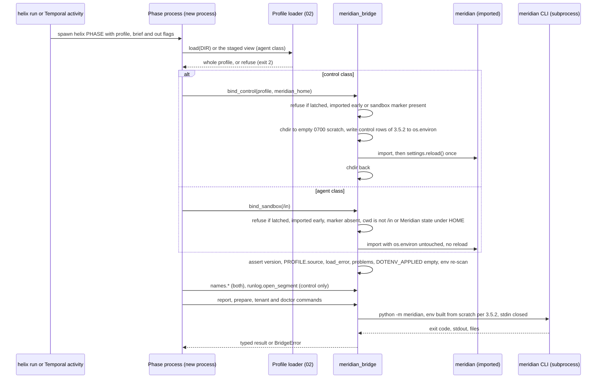
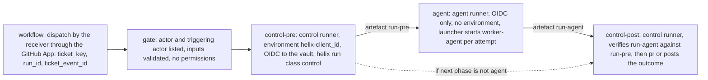
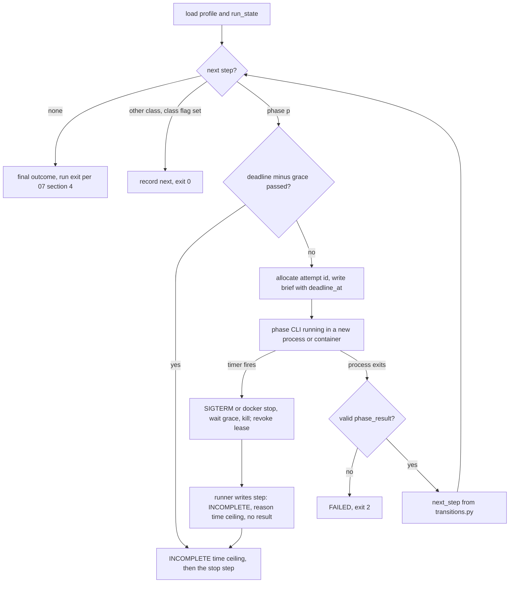

# 01 — Repository and runtime

## 1. Purpose and scope

This file is the foundation every other LLD file builds on. It covers Helix's own repository: its layout, packaging and pins; how a process gets its configuration and binds to one client; the three container images; the B2 pilot as a GitHub Action; `helix run`, the runner that keeps a terminal, the Action and Temporal in parity; `meridian_bridge`, the only code that touches Meridian, with the contract tests that hold it to the pinned version; Helix's own CI policy; and the documents. The repository scaffold, packaging, configuration, bridge and contract suite land in **B1**. The images, the pilot workflow and `helix run` land in **B2**. The worker images are reused unchanged by **B5**. Nothing here is specific to **B6**, but nothing forecloses it.

Names, enums, the CLI surface, `PhaseOutcome`, storage paths, schema owners, process classes, credentials and the sandbox environment allowlist are defined in `00-conventions.md`, and this file only references them. Meridian source citations are `path:line` in the Meridian tree at v1.8.1 (`meridian/__init__.py:15`).

## 2. Traceability

| Source | What this file implements |
| --- | --- |
| Plan §1 | CI on demand only, because minutes are billed |
| Plan §3.1 | Per-workflow `MERIDIAN_*` exports, `MERIDIAN_AUTH_MODE=connected_app` |
| Plan §3.2 | Pilot as a GitHub Action, `allowed_bots`, six-hour ceiling; a hand-confirmed fact sheet read as a file, never the ticket; Meridian's three imported names and five CLIs; Maven recorded and run live on demand; never on push, never Windows |
| Plan §3.5 | Worker containers (JDK 17, Maven, Node, CLIs); Nexus credential never in the image; `detect_mode()` trap; profile loaded per workflow in a fresh process |
| Plan §3.7 | QUICKSTART, ONBOARDING, RUNBOOK, done notes, `## Unreleased` sections; ONBOARDING and doctor held in step by a test; Meridian's docs gain a paragraph |
| Plan §4 decisions 5 and 9 | New repository, Meridian as a version-pinned wheel, contract test; rename-safe package name |
| Plan §6 | Verify by running it; no client detail; parity; tripwire |
| HLD *Components* (Meridian row), *Runtime and non-functional design* | Pilot versus target table; worker paragraph |
| HLD-P#1, #2 | Meridian credentials only in a control-plane subprocess; sandbox env per 00 §9 |
| HLD-P#4 | Separate control and agent jobs; minimum isolation set before a real ticket |
| HLD-P#5 | No Nexus credential in any image or worker; Maven settings name only the proxy |
| HLD-P#6 | Where the control plane runs in the pilot |
| HLD-P#11 | Helix repository versus generated-app repositories; where the workflow lives and whose runner runs it |
| HLD-P#13 | Per-client pilot repository; ephemeral per-attempt Maven repository; one client per process |
| HLD-P#14 | Pilot runners are self-hosted in the client's region, so the runner hop stays inside the residency guarantee |
| HLD-P#15 | One `run_id` per ticket lifetime, so attempt numbers come from the control-plane store, not from one Action run |
| HLD-P#17 | `helix run` branches on `PhaseOutcome`, not exit codes |
| HLD lower bullets | Meridian dependency surface (contract tests widened); hosted-agents revisit test (image smoke test) |
| Review item 19 | Meridian version recorded per state directory |
| Files 02, 03, 04, 05, 06, 07, 09, 10 | The `meridian_bridge` interface each of them calls (§3.5); the pilot's runners, trigger and jobs, which 01 owns and 03's services serve (§3.8; 03 §1 names 01 as their owner); 04's sandbox user model and naming bind (§3.5.2, §3.7); 09's chain segments (§3.5.5); 10's tripwire secret (§3.10) |

## 3. Design

### 3.1 Repository layout `[PLAN-DEFAULT 5]` `[LLD]`

This expands 00 §3. Owner is the LLD file that defines the module's behaviour.

| Path | Responsibility | Owner | Lands |
| --- | --- | --- | --- |
| `pyproject.toml`, `uv.lock` | Packaging and the exact environment (§3.2) | 01 | B1 |
| `vendor/meridian-1.8.1-py3-none-any.whl`, `vendor/meridian-1.8.1-requirements.lock`, `vendor/SHA256SUMS` | The pinned Meridian wheel (hash also in `uv.lock`) and Meridian's tested dependency lock at the same tag, used as a constraints file (§3.2) | 01 | B1 |
| `src/helix/__init__.py` | `__version__`, written in one place only (Meridian's rule, `meridian/__init__.py:8-15`) | 01 | B1 |
| `src/helix/__main__.py` | `python -m helix` → `cli.main.main` | 01 | B1 |
| `src/helix/config.py` | `RuntimeConfig.from_env()`: the `HELIX_*` variables, read at call time (§3.3) | 01 | B1 |
| `src/helix/runtime_identity.py` | `process_nonce()`: a UUIDv4 made on the first call in an interpreter and cached, so two `main()` calls in one process return the same value (§3.9, G26) | 01 | B2 |
| `src/helix/cli/main.py` | argparse root; exit discipline 0, 1, 2; an uncaught exception prints one line and exits 2 | 01 | B1 |
| `src/helix/cli/{profile,doctor,discover,intake,design,build,test,pr,run,serve,worker,audit,meter}.py` | One thin module per 00 §4 command; parses flags, calls the owning package, writes `phase_result.v1` | per 00 §4 | B1–B5 |
| `src/helix/profile/` | `helix_profile.v1` schema, loader, doctor and its numbered check registry | 02 | B1 |
| `src/helix/controlplane/webhook/` | Receiver, HMAC, dedup, routing. In B2 it records deliveries, maps only the move into `building`, and dispatches the pilot workflow through the GitHub App (03 §3.2, "Receiver mappings on"; §3.8 here) | 03 | B2 (pilot mappings), B3 (all mappings) |
| `src/helix/controlplane/jira/` | Jira REST client, status mapping, comment templates | 03 | B2 |
| `src/helix/controlplane/gitwriter/` | GitHub App client; PR assembly is 07's | 03, 07 | B2 |
| `src/helix/controlplane/{broker,gateway,mavenproxy,vault}/` | Credential broker, model gateway, Maven proxy, vault adapter | 03 | B2 |
| `src/helix/agents/runner.py`, `hooks.py`, `definitions/{intake,design,build,test}/` | Agent SDK session runner, PreToolUse policy, per-agent definitions | 04 | B2 |
| `src/helix/phases/{discover,intake,design,build,test,pr}.py` | One module per phase CLI | 05, 06, 07 | B2–B4 |
| `src/helix/orchestration/transitions.py` | `next_step(state, result) -> Step`: the one outcome-to-next-phase table, used by both runners | 01 defines, 08 uses | B2 |
| `src/helix/orchestration/local.py` | `helix run` (§3.9) | 01 | B2 |
| `src/helix/orchestration/{workflow,activities,worker}.py` | Temporal workflow, activities, worker bootstrap | 08 | B5 |
| `src/helix/audit/` | Chain records through the bridge, anchoring | 09 | B2 |
| `src/helix/metering/` | Meter events, pricing, caps | 09 | B2 |
| `src/helix/meridian_bridge/` | The only package that imports `meridian`. Modules `_bind`, `env`, `_cli`, `names`, `estate`, `references`, `report`, `prepare`, `tenant_cli`, `doctor_cli`, `runlog`, `clientdata` (module map in §3.5) | 01 (the bridge and its contract suite); each consumer file owns how it uses its module | B1 (core), B2–B4 (modules as consumers land) |
| `src/helix/data/images.lock` | Package-data copy of `containers/images.lock`, written by the build backend at wheel build time, so an installed Helix can read it (§3.3) | 01 | B2 |
| `src/helix/store/` | PostgreSQL engine, sessions, Alembic migrations for the Helix store; tables are owned by 03, 05, 08, 09 | 01 | B2 |
| `src/helix/pilot/{render,lint}.py` | Renders and lints the pilot workflow (§3.8) | 01 | B2 |
| `src/helix/schemas/*.schema.json` | 00 §8 schemas plus `run_state.v1` (§3.9) | per 00 §8 | B1–B5 |
| `skills/` | Skills files, mounted read-only at `/opt/helix/skills/` | 04, 06 | B2 |
| `templates/` | Golden parent pom and property files (07), PR body (07), integration HLD and LLD (06), `github/helix-pilot.yml` (01) | mixed | B2 |
| `containers/` | Three Dockerfiles, `images.lock`, `smoke.sh` (§3.7) | 01 | B2 |
| `scripts/check_client_data.py` | The tripwire, on Meridian's model (Meridian `CLAUDE.md`, *Conventions*) | 01 | B1 |
| `tests/unit/`, `tests/contract/`, `tests/guards/`, `tests/integration/` | Fast, Meridian contract, two-direction guards, fakes plus recorded Maven | all | B1 |
| `tests/fixtures/acme-a/`, `acme-b/`, `acme-broken/`, `acme-order-sapi/` | Two fixture clients with different routes and grammars, one unusable profile, the golden project | 01, 07 | B1 |
| `docs/` | `QUICKSTART.md`, `ONBOARDING.md`, `RUNBOOK.md`, `PLAN.md` (with done notes), `lld/` | 01 | B1 |
| `CHANGELOG.md` | One `## Unreleased — <headline>` section per sub-phase | 01 | B1 |
| `.github/workflows/ci.yml`, `images.yml` | Helix's own CI, on demand (§3.10) | 01 | B1 |

Rules `[LLD]`: the product name appears only in the places listed here, and each is set in one file. The package root (`pyproject.toml`, `src/helix/`) is changed by one `git mv` plus a search-and-replace on imports. The console script lives in `pyproject.toml`. Image names live in `containers/images.lock`. The `HELIX_*` prefix lives in `config.py`. `/opt/helix` and `/etc/helix` live in the Dockerfiles. The pilot workflow, the `helix-{client_id}` environment and the branch prefix (00 §6) live in the pilot template and 00. The last two also exist as state in client organisations, which keep their old names until a client is re-onboarded (decision 9). Generated Mule applications never live here `[HLD-P#11]`.

### 3.2 Packaging and dependency pins

| Item | Choice | Tag |
| --- | --- | --- |
| Build backend | `hatchling`, `src/` layout, version read from `src/helix/__init__.py` | `[LLD]` |
| Python | `==3.12.*` (Meridian accepts `>=3.9`, `pyproject.toml` `requires-python`) | `[LLD]` |
| Resolver and lock | `uv`; `uv.lock` committed; images and CI install with a frozen sync | `[LLD]`; exact flags `[VERIFY]` |
| Meridian | `meridian==1.8.1` exactly; the wheel is vendored in `vendor/` and referenced as a path source, so builds need no access to Meridian's repository | `[PLAN-DEFAULT 5]` pin, `[LLD]` vendoring; `tool.uv.sources` syntax `[VERIFY]` |
| Meridian's own dependencies | Resolved by Helix's lock, with Meridian's `requirements.lock` used as a constraints file where the two overlap, so Meridian runs on the set it was tested on. The wheel does not carry that lock: it declares only the `>=` floors of `requirements.txt` (Meridian `pyproject.toml` `dependencies = {file = ["requirements.txt"]}`; `docs/RELEASE.md`, "To install the tested set, install the lock first"). So the lock is vendored as `vendor/meridian-1.8.1-requirements.lock`, copied from Meridian's `v1.8.1` tag, with its SHA-256 in `vendor/SHA256SUMS`, and named in the uv constraint configuration. Builds need no access to Meridian's repository. Meridian's lock is a `pip freeze` of the environment its suite is green in, with a header restored by hand (`docs/RELEASE.md`, "Regenerating the lock"), and Meridian supports Python `>=3.9`, so a pin there may not install on 3.12. Where it does not, Helix's lock wins, the pair is listed in `tests/contract/expected/lock_overrides.txt` with a reason, and the contract suite is the proof | `[LLD]`; uv constraints syntax `[VERIFY]` |
| Excluded Meridian dependencies | `streamlit`, `fastapi`, `uvicorn`, `playwright` are not installed. The package imports none of them at module level; `playwright` is imported only inside `platform/authn/browser_sso.py:217,1143`. Without it the browser sign-in cannot start: a third layer under the no-browser guard (§3.5.2) | `[LLD]`; uv exclusion mechanism `[VERIFY]` |
| `claude-agent-sdk`, `temporalio` | No floor in `pyproject.toml`; exact versions are whatever is current at B1 start, recorded in `uv.lock` | `[PLAN]` packages, `[LLD]` pinning |
| `anthropic` | The model gateway's client library (00 §2). Pinned the same way | `[HLD-P#2]` package, `[LLD]` pinning |
| Other runtime | `jsonschema`, `PyYAML`, `httpx`, `SQLAlchemy`, `alembic`, `psycopg`; one shared version of SQLAlchemy and PyYAML with Meridian, proven by the contract suite | `[LLD]` |
| Console script | `helix = "helix.cli.main:main"` | `[LLD]` |

```toml
[project]
name = "helix"                  # decision 9: the product is Helix
dynamic = ["version"]
requires-python = "==3.12.*"
dependencies = [
  "meridian==1.8.1",             # exact; vendor/meridian-1.8.1-py3-none-any.whl
  "anthropic", "claude-agent-sdk", "temporalio",
  "jsonschema", "PyYAML", "httpx", "SQLAlchemy", "alembic", "psycopg",
]
[project.scripts]
helix = "helix.cli.main:main"
```

**Upgrading the Meridian pin** `[LLD]`, a RUNBOOK procedure: build or download the new wheel (Meridian `docs/RELEASE.md` step 9), replace it in `vendor/` together with `requirements.lock` from the same tag, update both lines of `vendor/SHA256SUMS`, change the pin, relock, run `tests/contract/`, update the expected-surface files in `tests/contract/expected/` only for changes that were read and accepted, add a `CHANGELOG.md` line naming the old and new versions, then let the next writer migrate each client's state directory (§3.5.5).

### 3.3 Runtime configuration `[LLD]`

Helix reads no configuration file of its own and no `.env`. Precedence is command-line flag, then environment variable, then default. Every value is read when used, through `RuntimeConfig.from_env()`, never at module import. Meridian has paid for import-time binding three times (Meridian `CLAUDE.md`, *Traps*), and a guard holds Helix to it (G19).

| Variable | Read by | Required | Default | Meaning |
| --- | --- | --- | --- | --- |
| `HELIX_PROFILES_ROOT` | Control-plane processes | Yes, for any command taking a client by id | none | Parent of `{client_id}/` profile directories (00 §7) |
| `HELIX_STATE_ROOT` | Control-plane processes | Yes | none | Durable root; per client `meridian/` and `runs/` (00 §7) |
| `HELIX_WORK_ROOT` | Control-plane processes and `helix run`; never set in the sandbox, where the default applies (00 §9 is exhaustive) | No | `/work` | Ephemeral attempt directories `{root}/{phase_attempt_id}/` (00 §7) |
| `HELIX_DATABASE_URL` | Control-plane services, `helix run` | Services only | none | PostgreSQL DSN **without a password**; credentials come from the vault adapter (03) |
| `HELIX_CONTROLPLANE_URL` | `helix run`, pilot jobs | When phases are split across hosts | none | Base URL of the gateway, broker and Maven proxy service (03) |
| `HELIX_IMAGE_LOCK` | `helix run` | No | `helix/data/images.lock` in the installed package (`importlib.resources`), copied from `containers/images.lock` at wheel build time (§3.1) | Image digests used to start sandboxes |
| `HELIX_LOG_FORMAT` | Control-plane processes and `helix run`; never set in the sandbox, where the default applies | No | `text` | `text` or `json` |
| `HELIX_MAVEN_LIVE` | `tests/integration/` only | No | unset | `1` runs real Maven instead of recordings (§3.10) |
| `HELIX_RUN_ID`, `HELIX_PHASE`, `HELIX_PHASE_ATTEMPT_ID` | Sandbox | Set by the runner | — | 00 §9 |
| `HELIX_TEMPORAL_*` | Temporal workers | B5 | — | Defined by 08 |

No `HELIX_*` variable ever carries a secret: a guard refuses any name ending `_SECRET`, `_TOKEN`, `_PASSWORD` or `_KEY` (G19). The profile directory is always given as `--profile DIR`; its basename is the `client_id` (00 §6), and the loader refuses a mismatch with `helix.yaml` (02).

### 3.4 One client per process `[PLAN]` `[LLD]`

The plan's trap (§3.5) says a worker that switches clients runs the second under the first's guards unless `settings.reload()` and every `refresh()` are called, so the profile is loaded per workflow in a fresh process. The Meridian source shows that `reload()` alone is not enough:

| Meridian value | Bound at | Refreshed by `settings.reload()`? | Source |
| --- | --- | --- | --- |
| `tenant.PROFILE`, `settings.TENANT` | import | Yes | `settings.py:459-464`, `tenant.py:928` |
| `ENVIRONMENTS`, `ENV_ORDER`, `TOKEN_TO_ENV`, `BRANCH_TO_ENV` | import | Yes, in place | `settings.py:466-484` |
| `naming.NAMING`, `REPO_NAME_RE`, `DEPLOYED_NAME_RE` | import | Yes, through `naming.refresh()` | `settings.py:504-511`, `naming.py:45-53` |
| `settings.STATE_DIR`, `RUN_LOG_DIR`, `TOKEN_CACHE_PATH` | import | **No** | `settings.py:568-570` |
| `runlog`'s `RUN_LOG_DIR` | import, by value | **No** | `runlog.py:25` |
| `platform.authn`'s `STATE_DIR` (token cache directory) | import, by value | **No** | `platform/authn/__init__.py:30`, `build_provider` |
| `settings.DOTENV_APPLIED` (the working directory's `.env`) | import | **No** | `settings.py:415` |

So a process that has imported Meridian for one client keeps the first client's paths for everything resolved from those snapshots: a `RunLog` opened without a directory, the `runs` listing, the connected-app token cache. Only the database location follows a changed `MERIDIAN_HOME`, because `db/engine.py:46-59` resolves it at call time. Half-switched state is worse than either, so the rule is structural:

- **Every phase is its own process.** `helix run` and the Temporal activities start each phase CLI as a new subprocess `[PLAN]` parity. Long-running services (webhook, gateway, broker, Maven proxy) import at most `meridian_bridge.clientdata`. That module imports only `meridian.clientdata`, which imports only the standard library (`clientdata.py:34-39`) and holds no tenant state, and `meridian/__init__.py` imports nothing (`meridian/__init__.py:6-20`), so it needs no bind (03 §3.1 rule 3). Any other bridge module in a service process is refused (G1).
- **The bridge binds once, in one of two modes** `[PLAN]` trap, `[HLD-P#1]` placement, `[LLD]` mechanism. A process latch holds the mode and the `client_id`. Every bind refuses when the latch is already set, or when `meridian` is already in `sys.modules` (`TenantSwitchError`, a subclass of the `BridgeError` that file 10 names).

| | `bind_control(profile, *, meridian_home, overlay=None)` | `bind_sandbox(staged_root)` |
| --- | --- | --- |
| Allowed in | Control-class processes only (00 §9): `discover`, `pr`, the doctor, the control steps of `helix run`. Refused when `/etc/helix/sandbox-class` exists (§3.7). `helix audit verify` needs no bind (§3.5.4, `runlog.runs_verify`) | Agent-class processes only: the runner's preflight before `query()` (04 §3.9.2, which 06 §3.9 adopts unchanged), and 07's phase and `verify` processes. Refused when that marker is absent |
| How Meridian finds the profile | `MERIDIAN_TENANT_PROFILE` (the profile's `tenant.yaml`, or 02's run overlay when `overlay` is given), `MERIDIAN_ENVIRONMENT_MAP`, `MERIDIAN_COMPARE_CONFIG`: the control-class rows of §3.5.2 | No variable. The working directory is `staged_root`, so `discover()` finds `{staged_root}/config/tenant.yaml` before `~/.meridian/` (`tenant.py:907-926`; `fsutil.py:111-140`, working directory first) |
| Working directory at import | An empty scratch directory the bridge creates with mode 0700. The bridge `chdir`s into it before the first import and back after `settings.reload()` returns | `staged_root` (`/in`), read-only, set by `helix-sandbox-init` (04 §3.12). The bridge checks it and never changes it |
| `os.environ` | The control-class rows of §3.5.2 are written **before** the first import | **Never written.** No `MERIDIAN_*` or `MULEGOV_*` variable exists before or after |
| `settings.reload()` | Called once after import, still inside the scratch directory: the plan's second layer | **Never called.** It re-runs `discover()` (`settings.py:445-511`), and by then the agent may have written under `HOME` (04 §3.9.2 step 5) |
| `RunLog` | `meridian_bridge.runlog.open_segment` allowed (§3.5.5) | Never constructed. `meridian_bridge.runlog` raises `BridgeError("chain is control-plane only")`: no agent writes the chain (09 §3.1) |
| Extra proof | After import: `PROFILE.source` equals the `tenant.yaml` or overlay path given | Before import: none of `$HOME/.meridian`, `$HOME/.meridian-*` and `$HOME/.mulegov` exists (04 §3.9.2 step 3, `MERIDIAN_STATE_PRESENT`). The bridge repeats 04's check, because importing `meridian.settings` already calls `env_setting` (`settings.py:552,562`), which reads a `meridian.db` under `_state_dir()` (`settings.py:60-105,192-268`). After import: `PROFILE.configured` is true and `PROFILE.source` equals `{staged_root}/config/tenant.yaml` (04 §3.9.2 step 4) |

There is no separate naming process: 06 binds in the runner's own preflight (06 §3.9). So the process that launches the Agent SDK is the one that binds, and `bind_sandbox` never changes its `os.environ`. 00 §9's "exactly these variables" therefore holds at agent start (G30).

- **The bridge proves what loaded.** After import, in both modes, it checks: `meridian.__version__ == "1.8.1"`; `PROFILE.load_error` is empty and `PROFILE.problems` is empty; `settings.DOTENV_APPLIED == []`, so no `.env` in the working directory reached `os.environ` (`settings.py:388-415`); and a re-scan of `os.environ` finds none of §3.5.2's never-present names. The mode-specific checks in the table follow. A profile Meridian cannot read does not raise: it falls back to built-in defaults whose prefix is `acme` (`tenant.py:824-860`, `_unusable`; `tenant.py:329`, `NamingConvention.prefix`). For that reason fixture tenants use the prefixes `acmea` and `acmeb`, never `acme`, so a silent fallback cannot pass a test by accident (G5).
- **Why the scratch directory matters** `[LLD]`. Importing `meridian.settings` runs `load_dotenv_settings()` against `./.env` (`settings.py:388-415`). Its allowlist holds `MERIDIAN_DATABASE_URL`, `MERIDIAN_HOME` and the `MERIDIAN_SSO_*` switches (`settings.py:333-359`), and `db/engine.py:46-59` prefers `MERIDIAN_DATABASE_URL` over the state directory. A phase started from an operator's checkout for terminal parity could otherwise redirect the action-log copy. 08 §3.14 sets the working directory of activities for the same reason.



### 3.5 `meridian_bridge` `[PLAN-DEFAULT 5]`

#### 3.5.0 Module map `[PLAN-DEFAULT 5]` package, `[LLD]` split

`meridian_bridge/__init__.py` is empty, so importing one module never imports another. Each module imports `meridian` lazily, inside its functions, after a bind, except `clientdata`. The functions are in §3.5.4.

| Module | Process class | Bind needed | Consumers | Reaches Meridian through |
| --- | --- | --- | --- | --- |
| `_bind` | both | — | every module below | `meridian.settings`, `meridian.tenant`, `meridian.__version__` in process |
| `env` | both | yes, except for `runs --verify` (§3.5.2) | `_cli` | Nothing: builds subprocess environments (§3.5.2) and parses the profile's `.env` text itself |
| `_cli` | both | yes, except for `runlog.runs_verify` | `report`, `prepare`, `tenant_cli`, `doctor_cli`, `runlog` | `python -m meridian` subprocesses (§3.5.3) |
| `names` | both; in the sandbox, after the runner's preflight bind (04 §3.9.2; 06 §3.9), or in 07's phase and `verify` processes | yes | 04 `toolserver.py`, 06, 07 | `meridian.naming`, `meridian.grammar`, `meridian.settings.env_spec`, `meridian.tenant.PROFILE` (with its `config_files` shapes) in process |
| `estate` | both; in the sandbox, after the runner's preflight bind (06 §3.9) | yes | 06 | `meridian.estate.mq_names`, `meridian.estate.client_inventory` in process |
| `references` | both; in the sandbox, 07's verify stage | yes | 06 `keys.py` (`key_list_diff`), 07 | `meridian.references` in process |
| `report` | sandbox (07 decides: the verify stage) | yes | 07 | `meridian report` CLI only |
| `prepare` | sandbox (07) | yes | 07 | `meridian prepare` CLI only |
| `tenant_cli` | control only | `bind_control` | 05, 02 | `meridian tenant discover/validate/infer` CLIs only |
| `doctor_cli` | control only | `bind_control` | 02 (ONB-02 to ONB-04) | `meridian doctor --json` CLI only |
| `runlog` | control only; `runs_verify` anywhere (00 §4), except in a sandbox-bound process | `bind_control`; none for `runs_verify` | 09 `ChainWriter`; `helix audit verify` (09 §3.7) | `meridian.runlog.RunLog` in process; `runs_verify` only through the `meridian runs --verify` CLI, never an in-process import |
| `clientdata` | any, including long-running services | no | 03 outbound scan, 10 tripwire and output scanner (10 §3.13) | `meridian.clientdata` in process (standard library only) |

#### 3.5.1 What it imports

The plan names three imports: `naming.parse_any_name`, `grammar.Grammar.render` and `runlog.RunLog`. The consumer files call more than that, so this table is the union of what they need. It is also the content of `tests/contract/expected/imported_names.txt`. Contract tests may import anything; `src/` may import only this table (G2). Every row beyond the plan's three widens decision 5's surface, so each has a contract row (§3.6) and is `[HLD-P lower]` (Meridian surface) unless marked otherwise.

| Name | Used for (consumer) | Source | Tag |
| --- | --- | --- | --- |
| `meridian.naming.parse_any_name(name) -> AppName` | Parse a repository name or a deployed base name (06, 07). It raises `NamingError` (a `ValueError`). It does **not** accept a deployed name with its environment suffix, because `DEPLOYED_NAME_RE` excludes the env part | `naming.py:123-143`, `tenant.py:366-372` | `[PLAN]` |
| `meridian.naming.NAMING.grammar` | The `Grammar` instance in force, read as a module attribute at call time (rebound by `refresh()`) | `naming.py:38,45-53`; never `None` after `NamingConvention.__post_init__` (`tenant.py:350-358`) | `[LLD]` access path |
| `meridian.naming.REPO_NAME_RE`, `meridian.naming.DEPLOYED_NAME_RE` | The two forms' regexes, read as module attributes at call time (rebound by `refresh()`). 04's `render_names` and `parse_name` tools match them and keep every named group, `scope` included, which `parse_any_name` drops (04 §3.9.1) | `naming.py:39-40,45-53,123` | `[HLD-P lower]` |
| `Grammar.render(form, values, exclude=()) -> str` | Render a name (06, 07). `form` is `"repository"` or `"deployed"`. Raises `GrammarError` (`ValueError`) for a missing mandatory part | `grammar.py:59-60,104-121,496-526` | `[PLAN]` |
| `Grammar.parse(text, env_tokens=(), form=None) -> dict[str, str]` | Parse a deployed name that carries its environment suffix (04, 06) | `grammar.py:393-395` | `[HLD-P lower]` |
| `meridian.grammar.FORM_REPOSITORY`, `FORM_DEPLOYED`, `GrammarError` | Constants and the error | `grammar.py:59-60,104` | `[LLD]` |
| `meridian.naming.AppName` (with `deployed_name_in(env_key)`), `NamingError` | Parsed fields `prefix`, `region`, `name`, `layer`, `version`, `extra`; deployed name per environment (06) | `naming.py:64-121`, `naming.py:110` | `[LLD]`; `deployed_name_in` `[HLD-P lower]` |
| `meridian.naming.config_file_path(env_key, secure=False) -> str` | Repository-relative property file path per environment (06, 07). Reads `CONFIG_DIR_IN_REPO` and `TENANT.config_files` | `naming.py:329-335`, `settings.py:633-643` | `[HLD-P lower]` |
| `meridian.tenant.PROFILE.config_files[0]` (a `meridian.config_files.FileShape`: `.render(token, secure=False, env_prefix="")`, `.has_secure_form`) and `PROFILE.naming.environment_name_prefix` | The config file name for a token that is not an environment key, such as `munit` for the test files (07 §3.11, `names.config_file_for_token`) | `config_files.py:130-146`, `tenant.py:340,529` | `[HLD-P lower]` |
| `meridian.naming.mq_destination_name`, `client_application_name`, `api_instance_label` | Platform object names (06) | `naming.py:153-160`, `naming.py:295`, `naming.py:319` | `[HLD-P lower]` |
| `meridian.settings.env_spec(key) -> EnvSpec`, `meridian.settings.ENVIRONMENTS` | In-scope environments and their tokens (04, 06). `env_spec` raises `KeyError` for an unknown key | `settings.py:858-863`, `settings.py:656` | `[HLD-P lower]` |
| `meridian.estate.mq_names.parse_destination_name(raw, declared_kind="", observed_env=None)` | Parse back an MQ destination (06). Its module imports `settings.ALL_ENVIRONMENTS` at import, so it needs a bind | `estate/mq_names.py:61,260-262` | `[HLD-P lower]` |
| `meridian.estate.client_inventory.split_env_suffix(name, env_tokens, aliases=None)` | Parse back a client application name (06). Its module imports `meridian.platform` and `settings.STATE_DIR` at import (`estate/client_inventory.py:47-52`), so it needs a bind and loads the platform client module without calling it | `estate/client_inventory.py:148-149` | `[HLD-P lower]` |
| `meridian.references.scan_application(repo_dir, app="", config_dir=None)`, `runtime_provided(key)` | Key-list difference (06 `keys.py`, used by 07) | `references.py:235-236`, `references.py:537` | `[HLD-P lower]` |
| `meridian.clientdata`: `load_denylist`, `denied`, `internal_host`, `scrub_line`, `synthetic_uuid`, `UUID`, `EMAIL`, `DISTINCT_MIN` | Deny-list and shape rules (03 outbound scan, 10 tripwire, the eight names 10 §3.13 lists). Imports only the standard library | `clientdata.py:34-39,45,52,99,145,158,200,248,286` | `[HLD-P lower]`; owner approval is 10's open item 2 |
| `meridian.runlog.RunLog` | The chain writer, through 09's `ChainWriter` (§3.5.5) | `runlog.py:88-271` | `[PLAN]` |
| `meridian.settings.reload` | Second layer after `bind_control` only | `settings.py:445-511` | `[PLAN]` trap |
| `meridian.settings.DOTENV_APPLIED`, `meridian.settings.state_dir` | Post-import proofs (§3.4) | `settings.py:415`, `settings.py:106-116` | `[LLD]` |
| `meridian.tenant.PROFILE` (`.source`, `.load_error`, `.problems`, `.configured`, `.env_tokens()`) | Post-import proof; environment tokens for parsing (04, 06) | `tenant.py:511-560,561-563,631,928` | `[LLD]`; `env_tokens` `[HLD-P lower]` |
| `meridian.platform.authn.detect_mode` | Preflight in control-class binds: the mode in force is `connected_app` | `platform/authn/__init__.py:201-222` | `[PLAN]` trap |
| `meridian.__version__` | Pin check | `meridian/__init__.py:15` | `[LLD]` |

Adding a name is a change to this table, to `expected/imported_names.txt` and to G2, made on purpose and reviewed.

#### 3.5.2 The environment Meridian sees `[PLAN]` exports, `[HLD-P#1]` placement, `[LLD]` the rest

The bridge never passes the parent's environment. Each Meridian subprocess gets an environment built from scratch: exactly the rows below for its command and class. It is passed only as the subprocess's `env`, never written to `os.environ`. `stdin` is closed, so `CredentialStore` cannot prompt (`platform/authn/store.py:200-209`). The working directory is an empty scratch directory with no `config/` and no `.env`, so Meridian's working-directory searches find nothing (`fsutil.py:111-140`, `settings.py:388-415`). `bind_control` writes the rows marked in the first column into `os.environ`; `bind_sandbox` writes nothing (§3.4).

| Variable | Value | `bind_control` (`os.environ`) | Offline CLI subprocess: `report`, `prepare` (sandbox, 07); `tenant validate/infer`, `doctor` (control) | `tenant discover` | `runs --verify` (no bind; 09 §3.7 step 2) | Source in Meridian |
| --- | --- | --- | --- | --- | --- | --- |
| `MERIDIAN_TENANT_PROFILE` | Control: `{profile}/tenant.yaml`. `report` and `prepare` (sandbox): `/in/meridian/tenant.overlay.yaml`, 02 §3.10's run overlay (`runs/{ticket_key}/tenant.overlay.yaml`, written by 06), staged by 07 (07 §3.4.4) | yes | yes | yes | no | `tenant.py:907-910` |
| `MERIDIAN_ENVIRONMENT_MAP` | `{profile}/environments.yaml`; sandbox: `/in/meridian/environments.yaml` | yes | yes | yes | no | `runtime/envmap.py:62` |
| `MERIDIAN_COMPARE_CONFIG` | Control: `{profile}/compare.yaml`. `report` and `prepare`: the same staged rulebook the call passes with `--rules` (§3.5.3; 07 §3.4.4). `--rules` decides the comparison (`rules.load(args.rules)`, `cli.py:367,911`), but Meridian's own path-less loads read the variable (`history.py:692`, `readiness.py:346`), so both name one file | yes | yes | yes | no | `rules.py:881-920` |
| `MERIDIAN_HOME` | Durable `{state_root}/{client_id}/meridian/` (00 §7) for `bind_control` (09's chain writer: the database copy resolves it at call time, `db/engine.py:46-59`). For `runs --verify`, the state directory being checked: the durable one, or a copy such as a restored backup (09 §3.7). Otherwise a fresh scratch directory, mode 0700, owned by the calling uid: per call in the control plane, deleted after it; in the sandbox, a fresh directory under `/work/{id}/`, discarded with the attempt (07 §3.4.4) | durable | scratch | scratch | the checked directory | `settings.py:74-76` |
| `MERIDIAN_ENV_ALLOWLIST` | The profile's non-production environment keys, comma-separated; **presence** is the assertion | yes | yes | yes | no | `settings.py:177`, `platform/guards.py:64-77` |
| `MERIDIAN_READ_ONLY` | `1`: nothing in B1–B5 writes to the platform | yes | yes | yes | no | `settings.py:541-548` |
| `MERIDIAN_AUTH_MODE` | `connected_app`, explicitly, so a `.env` or a stored setting saying `browser` cannot win | yes | yes | yes | no | `platform/authn/__init__.py:174-222` |
| `MERIDIAN_BROWSER_SSO` | `0` | yes | yes | yes | no | `platform/authn/browser_sso.py:246-256` |
| `MERIDIAN_ACTOR` | The value file 09 defines: `helix:{run_id}` (09 §3.3, the value 08 §3.14 also sets); 09 owns it. Becomes `signed_in` on `run_start` and `performed_by` in the copy | yes | control class only; never in a sandbox subprocess, whose scratch history is discarded | yes | no: verify writes nothing | `runlog.py:280-283` |
| `ANYPOINT_CLIENT_ID`, `ANYPOINT_CLIENT_SECRET` | From the broker, for this call only | **never** | **never** | yes | never | `platform/authn/__init__.py:102-103` |
| `ANYPOINT_BASE_URL`, `REQUESTS_CA_BUNDLE`, `SSL_CERT_FILE`, `CURL_CA_BUNDLE`, `HTTPS_PROXY`, `HTTP_PROXY`, `NO_PROXY`, `MERIDIAN_MQ_REGION` | Copied from the profile's `.env` if present there | no | no | yes | no | the non-secret part of `settings.py:333-359` |
| `HOME` | Scratch, so `~/.meridian/tenant.yaml` is never found (`tenant.py:924-925`) | unchanged | yes | yes | yes | — |
| `PATH`, `LANG`, `TMPDIR`, `USER=helix` | Process-local; `USER` is a fixed label for `run_start.operator`, not the uid name | unchanged | yes | yes | `PATH` and `LANG` only | `runlog.py:293-301` |
| `PYTHON_KEYRING_BACKEND` | The `keyring` null backend, so no keychain supplies a credential or a secure key (`store.py:248-270`, `secure.py` keys) | yes | yes | yes | yes | `[VERIFY]` the variable and backend name |

**The sandbox subprocess exception** `[HLD-P#1]` `[LLD]`. 07 runs `report` and `prepare` inside the agent sandbox, as children of the phase process or of `verify` (uid `runner`), only while no agent process exists: before the session starts, after its process group has exited, or with no session at all (07 §3.4.4). Those two subprocesses receive the non-credential `MERIDIAN_*` rows above in their own `env`. No sandbox process's `os.environ` ever holds one, so 04's `assert_process_env()` and the agent's 00 §9 environment are unchanged. 00 §9 says Meridian's exports are set only in control-plane processes that run credentialed CLIs, so this is proposed as an amendment to 00 §9 (§6), as 07 §6 also asks. 07 §3.4.4 builds these two environments as this table's offline column, with its staged paths, and with `MERIDIAN_COMPARE_CONFIG` naming the rulebook the call passes with `--rules`; G7 holds the result.

Never present, and refused by the bridge if they appear (G7, G29): `MERIDIAN_INSTALL`, `MERIDIAN_DATABASE_URL`, `MERIDIAN_STATE_DIR`, `MERIDIAN_CLASSIFICATION_RULES` (a deprecated name for the rulebook, `rules.py:881-882`), `MERIDIAN_REPO_ROOT`, `MERIDIAN_OUTPUT_DIR`, `MERIDIAN_INVENTORY_DIR`, `MERIDIAN_TEMPLATE_DIR` (flags are used instead), any `MULEGOV_*` (Meridian still honours the legacy prefix, `settings.py:285-303`), any `MERIDIAN_SECURE_KEY_*` (`secure.py:49`; no agent holds a key, plan §5), `MERIDIAN_ASSUME_YES`, `MERIDIAN_ALLOW_PASSWORD_AUTH`.

**Settings composed at runtime** `[LLD]`. Most Meridian settings are read through `env_setting(name)`, `env_name(name)` or `env_origin(name)`, which try `MERIDIAN_{name}` then `MULEGOV_{name}` (and the bare name for `UNPREFIXED_SETTINGS`), so the full variable name never appears as a literal (`settings.py:271-303`, `306-315`, `514-537`). The contract suite collects every first argument of those calls (§3.6). Each resulting name is classified here:

| Setting suffix (as `MERIDIAN_` and `MULEGOV_`) | Bridge treatment |
| --- | --- |
| `READ_ONLY`, `ENV_ALLOWLIST` (`ENV_PRESENCE_SETTINGS`, `settings.py:177`), `AUTH_MODE`, `BROWSER_SSO` | Set, per the table above (`MERIDIAN_` only) |
| `ANYPOINT_BASE_URL` (unprefixed, `settings.py:186`), `MQ_REGION` | Copied from the profile's `.env`, `tenant discover` only |
| `ACTOR` (env-only: `ENV_ONLY_SETTINGS`; read directly by `runlog.py:280-283`) | Set in control-class environments only |
| `REPO_ROOT`, `OUTPUT_DIR`, `INVENTORY_DIR`, `TEMPLATE_DIR` (read at `Settings` construction, `settings.py:699-702`; `YAML_SHADOWED`, `settings.py:785-791`) | Forbidden. The bridge passes `--repo-root`, `--output-dir`, `--inventory-dir` instead (`cli.py:5139-5142`) |
| `ASSUME_YES`, `ALLOW_PASSWORD_AUTH`, `INSTALL`, `DATABASE_URL`, `UI_PORT`, `API_PORT` (`ENV_ONLY_SETTINGS`, `settings.py:159-161`, which also holds `HOME` and `ACTOR`) | Forbidden. `HOME`, and `ACTOR` in the control class, are the only env-only settings the bridge sets |
| `MAX_UNPARSED_SHARE`, `SECONDS_PER_ITEM`, `LEARN_ENDPOINTS`, `APIM_LIST_KEY`, `SSO_TIMEOUT`, `SSO_BROWSER`, `SSO_RENEW_MINUTES`, `SSO_PREWARM`, `SSO_PREWARM_MINUTES`, `SSO_LOGIN_URL` | Never set: Meridian's default applies. A built environment holding one is refused |
| Literal names outside `env_setting`: `CLASSIFICATION_RULES` (`rules.py:881-882`), `CLIENT_DENYLIST` (`clientdata.py:114`), `PROFILE_UI` (`db/engine.py:100`), `RPS` (`platform/http.py:78`), `SERVER_PROCESS` (`platform/authn/browser_sso.py:1426`, `jobs.py:512`) | `CLASSIFICATION_RULES` is forbidden, because it would choose the rulebook. The other four are never set. A built environment holding any of them is refused |

The literal scan also finds names that are not settings. `MERIDIAN_SET_`, `MERIDIAN_ENCRYPT_` and `MERIDIAN_PROPOSED_` are placeholder marks inside configuration values, not variables (examples such as `MERIDIAN_SET_PREPROD` appear in docstrings). `MERIDIAN_SECURE_KEY_` is a key-variable prefix, forbidden above (`secure.py:49`). `MULEGOV_AUTHMODE` and `MULEGOV_ENV_ALLOW_LIST` are misspellings Meridian warns about (`settings.py:366-378`). `expected/env_vars.txt` records each with its class, so none is mistaken for a setting.

**Stored settings** `[LLD]`. `env_setting` falls back to the `setting` table of `{MERIDIAN_HOME}/meridian.db` for any name the environment leaves empty that is not env-only (`settings.py:192-268`, `294-302`). Scratch homes start with no database. The durable home is used only by `bind_control` and `runs --verify`, both offline. Three rules hold this. Nothing Helix runs writes a `setting` row: the RUNBOOK forbids running Meridian's Settings screen against a durable home. Every name that changes `bind_control`'s behaviour is exported, and the environment wins (`settings.py:294-298`), or is env-only; `runs --verify` reads only the segment file and `action_log` (`cli.py:2659-2681`), so no stored row changes it (09 §3.7). The contract suite plants `AUTH_MODE=browser` as a stored row in a durable-home fixture and proves `detect_mode()` still returns `connected_app` under the bridge environment (§3.6).

**`MERIDIAN_STATE_DIR`.** The plan names it; 00 §7 already records that Meridian 1.8.1 reads only `MERIDIAN_HOME` (`settings.py:60-116`) and that Helix never sets `MERIDIAN_STATE_DIR`. The bridge follows 00.

**The profile's `.env`** `[LLD]`: the bridge parses it itself and copies only the eight transport keys in the table. Its schema is Meridian's: the keys of `settings._ENV_ALLOWLIST` (`settings.py:333-359`) plus Meridian's credential names, `onboarding.CREDENTIAL_KEYS` (`ANYPOINT_TOKEN`, `ANYPOINT_PAT`, `ANYPOINT_PASSWORD`, `ANYPOINT_CLIENT_SECRET`, `ANYPOINT_USERNAME`, `ANYPOINT_CLIENT_ID`; `onboarding.py:2385-2387`), which Meridian's `.env` template also offers (`platform/authn/store.py:395-407`). Every other allowlisted key in that file, under either prefix (for example `AUTH_MODE`, `ENV_ALLOWLIST`, `READ_ONLY`, `HOME`, `INSTALL`, `DATABASE_URL`, `SECONDS_PER_ITEM`, the two ports, `BROWSER_SSO` and the `SSO_*` switches), is ignored with a warning, because the bridge sets or forbids it. Any credential name above, or any credential-shaped name (`*_SECRET`, `*_TOKEN`, `*_PASSWORD`, `*_PAT`), makes the bridge refuse. This is a second layer: 02's loader refuses the same keys first (02 §3.6, rules L13 and L14, ONB-05). Meridian's `init` writes no credential there (Meridian `CLAUDE.md`, `onboarding.py` row).

**Profile material in the sandbox** `[HLD-P#1]`. One view of the profile exists for binding in the sandbox, and file 04 owns it. A second set of files exists only as subprocess inputs for 07's `report` and `prepare`, and 07 owns their staging. Neither holds `.env` or `helix.yaml`. Both sit under `/in`, mode 0500, owner `runner`, unreadable by uid `agent` (04 §3.12; 07 §3.4.4). In the pilot, `control-pre` writes both into `{run-dir}/profile-view/`, and the launcher stages that directory as `/in` content.

| Material | Path in the sandbox | Contents | Owner | Read by |
| --- | --- | --- | --- | --- |
| Naming profile (the sandbox view) | `/in/config/tenant.yaml` | Five sections of `tenant.yaml` (04 §3.4, §3.9.2 step 2): `schema_version`, `naming`, `environments`, and `config_dir_in_repo` and `config_files`, which 06 §3.9 asked for because `names.config_file_path` reads them (`naming.py:329-335`, `settings.py:633-643`) and would otherwise give Meridian's default paths. Nothing else: no `deployment_properties`, no organisation or business-group names or ids | 04 | `bind_sandbox`, in process |
| Report inputs (build, test and `verify` only) | `/in/meridian/tenant.overlay.yaml`, `/in/meridian/environments.yaml`, `/in/meridian/compare.yaml`, `/in/meridian/compare.gate.yaml` | 02 §3.10's run overlay; the profile's `environments.yaml` and `compare.yaml`, byte for byte (the client rulebook, for 07's advisory checklist only); the gate rulebook that `report.gate_rulebook` renders from the approved key list (07 §3.4.4) | 07 (staging); 02 and 06 (overlay) | `report` and `prepare` subprocesses only, by path in their own `env` and through `--rules` |

The contract suite proves Meridian loads each with no `problems`, and that the naming profile renders and parses every fixture name exactly as the full profile does (G5).

#### 3.5.3 Meridian CLIs run

All are invoked as `[sys.executable, "-m", "meridian", ...]` (`pyproject.toml` `[project.scripts]` comment; `meridian/__main__.py`). Exit codes are Meridian's: `EXIT_OK=0`, `EXIT_FINDINGS=1`, `EXIT_ERROR=2`, `EXIT_PREFLIGHT=3` (`cli.py:53-56`). Timeouts are `[LLD]` estimates, tuned from B2's first runs.

| Command (flags the bridge uses) | Class | Exit codes (source) | Output read by the bridge | Timeout |
| --- | --- | --- | --- | --- |
| `--version` | any | 0; prints `meridian 1.8.1` (`cli.py:5387-5389`) | stdout | 10 s |
| `report --repo-root R --output-dir O --inventory-dir N --environments E1,E2,... --rules F --fail-on CRITICAL --csv` | sandbox: 07's phase and `verify` processes (07 §3.4.4). `F` is the gate rulebook (`cli.py:5420`) | 0 none at or above CRITICAL; 1 findings, or the pack or history could not be recorded, or unparsed share above `max_unparsed_share`; 2 no rulebook, fewer than two environments, unknown environment, nothing extracted, or every name unparsed (`cli.py:363-680,1178-1210`) | `O/drift_exceptions.csv` with columns `analyze.DRIFT_EXCEPTION_COLUMNS` (`analyze.py:187-192`); `exception_type` among `REFERENCED_NOT_DEFINED`, `SECRET_PLAINTEXT`, `MARKER_LEFT` and the rest (`analyze.py:32-56`); `severity` among `CRITICAL`, `MAJOR`, `MINOR`, `ADVISORY` | 600 s |
| `prepare --repo-root R --inventory-dir N --app A --source S --target T --rules F [--write] --json` | sandbox (07). `F` is the gate rulebook with `--write`, the client rulebook for the advisory checklist (07 §3.4.4; `cli.py:5445`) | 0 target exists and READY; 1 otherwise; 2 no rulebook or `PrepareError` (`cli.py:901-973`). `prepare` reads the application from `settings.repo_root` and `settings.inventory_dir` (`cli.py:929-933`), whose defaults are `./repos` and `./inventory` (`settings.py:699-700`); from the empty scratch directory those hold nothing, and `prepare.py:597` raises `PrepareError` ("no config files for ... under ..."), so both flags are always passed. `R` holds `{repository name}/` as for `report`; `N` is a path that does not exist | JSON keys `app`, `source`, `target`, `scanned`, `checklist[]`, `drafts[]` (`path`, `mode`, `marks`, `proposals`, `changes`, `written`), `verdict` (`ready`, `summary`, `findings[]`, `passed`) or null, `notes` | 120 s |
| `tenant validate [--against R] [--names F] [--form any\|deployed\|repository] [--from-cache P] --json` | control plane (05, 02) | 0 no problems; 1 problems or unparsed share too high; 2 nothing to judge (`cli.py:1890-1918`, `onboarding.py:123-160`) | JSON: the validation facts plus `problems`, `notes`, `fatal`, `coverage[]`, `verdict`, `exit_code` | 120 s |
| `tenant infer [--names F] [--form ...] [--repos R] [--from-cache P] --json` | control plane (05) | 0 every name parses and evidence enough; 1 some do not or evidence thin; 2 nothing read or no convention fits (`cli.py:1922-1940`, `onboarding.py:1309-1330`) | JSON keys include `separator`, `segments`, `primary_region`, `environments`, `config_dir_in_repo`, `config_files`, `names[]`, `counts`, `seen`, `parsed`; the full key set is pinned by the contract test | 120 s |
| `tenant discover [--business-groups CSV] [--limit N] --json` | **control plane only** | 0 every group answered and nothing disagrees; 1 a group unreadable, token scoped to one group, namesakes, production flag disagrees; 2 no token, no visible group, wrong tenant (`cli.py:5712-5737`, `2022-2081`) | JSON keys `collected_at`, `base_url`, `identity`, `root_org_id`, `root_org_name`, `groups`, `ids_by_name`, `namesakes`, `declared_groups`, `environments[]`, `environment_name_prefix`, `findings`, `notes`, `blocks`, `exit_code` (`onboarding.py:767-806`) | 300 s |
| `doctor --json` | **control plane only** (02, ONB-02 to ONB-04) | 0 healthy, warnings allowed; 1 a check failed; 2 a check could not run (`cli.py:1843-1854`, `doctor.py:885-893`) | JSON from `doctor.as_dict` (`doctor.py:951`); the check names 02 reads are pinned by the contract test | 60 s |
| `runs --verify <absolute path to chain file>` | anywhere, with no bind (09 §3.7) | 0 valid and copy not `broken` or `differs`; 1 chain invalid or copy `broken` or `differs`; 2 no file (`cli.py:2649-2682`) | JSON `valid`, `records`, `broken_at`, `reason`?, `action_log` {`state` in `identical`, `incomplete`, `absent`, `broken`, `differs`, `unavailable`; `records`; `reason`?} (`runlog.py:195-245`, `db/audit.py:32-78`) | 60 s |

Parsing rules `[LLD]`:

- **JSON may follow a banner.** `prepare --json` prints the rulebook banner first (`cli.py:926`); `tenant discover --json` prints `Control plane: <url>` first (`cli.py:2042`). The bridge parses from the first line that starts with `{`. A command whose stdout has no such line, or whose JSON fails to parse, raises `MeridianOutputError`.
- **The CSV is read, never the human summary.** `report` writes fixed file names with `--csv` (`cli.py:599-605`).
- **Exit 2 means the check could not run.** The bridge returns `ran=False` with the last stderr line as the reason, and the phase maps that to `INCOMPLETE` (00 §5). Exit 3 or any other code raises `MeridianExitError` (`FAILED`).
- `--output-dir` and `--inventory-dir` always point inside the attempt's scratch directory, the second at a path that does not exist, so `report` skips inventory attribution (`cli.py:455-466`). `--repo-root` is a directory holding one subdirectory per application **named by its repository name**, because `report` exits 2 when every name is unparsed. `prepare` gets the same `--repo-root` and `--inventory-dir`. No path-valued setting ever comes from the environment (§3.5.2).
- **The rulebook is always named twice, the same way.** `report` and `prepare` always get `--rules` with one of 07's staged rulebooks, and `MERIDIAN_COMPARE_CONFIG` names the same file for Meridian's path-less loads (§3.5.2). So neither a search of the working directory nor Meridian's committed example can choose the gate's rules (07 §3.4.4, "Gate rulebook"). The bridge refuses a call where the two name different files (G7).
- `report` registers its workbook and records a history run in the database under `MERIDIAN_HOME` (`cli.py:571-597`). The scratch home keeps those records of unmerged generated code out of the client's Meridian history, and keeps the connected-app token cache (`token_cache_connected_app.json`, `platform/authn/__init__.py:250-253`) off durable storage `[LLD]`.

#### 3.5.4 Python interface

Every function except `_bind.*`, `clientdata.*` and `runlog.runs_verify` requires a bind first; otherwise it raises `BridgeError("not bound")`. A function marked *control* raises `BridgeError("control class only")` under `bind_sandbox`. The names are the ones the consumer files call. Meridian's own `NamingError` and `GrammarError` are re-exported as `names.NamingError` and `names.GrammarError`, so a consumer catches them without importing `meridian` (G1). Every bridge error is a `BridgeError`; `TenantSwitchError`, `MeridianExitError`, `MeridianOutputError`, `MeridianTimeout`, `ReportUnavailable`, `BridgeNameError` and `RenderError` are its subclasses.

| Function | Inputs | Output | Errors | Consumer |
| --- | --- | --- | --- | --- |
| `_bind.bind_control(profile, *, meridian_home, overlay=None)` | Loaded profile (02); durable state path; optional overlay path (02 §3.10) | None; latch set to (`control`, `client_id`) | `TenantSwitchError` (latched, or `meridian` imported early); `BridgeError` (sandbox marker present, version mismatch, `load_error`, `problems`, `DOTENV_APPLIED` not empty, forbidden variable present, credential in `.env`, `detect_mode()` not `connected_app`) | every control-class caller |
| `_bind.bind_sandbox(staged_root)` | `/in` (04) | None; latch set to (`sandbox`, `client_id` read from the staged brief) | As above, plus marker absent, working directory not `staged_root`, a Meridian state directory under `HOME` before import (04's `MERIDIAN_STATE_PRESENT`), `PROFILE.configured` false | 04 runner preflight (which 06 §3.9 uses); 07's phase and `verify` processes |
| `names.parse_app_name(name) -> AppName` | Repository name or deployed base name | Meridian's `AppName` (`prefix`, `region`, `name`, `layer`, `version`, `extra`) | `names.NamingError` | 06, 07 |
| `names.render_name(form, values, *, exclude=()) -> str` | `"repository"` or `"deployed"`; part values | Name string | `names.GrammarError` | 06, 07 |
| `names.round_trip_name(form, values) -> str` | As above | The rendered name, after `parse_app_name` returned the same well-known parts; the deployed form is checked without its env part | `BridgeNameError("does not parse back: ...")` | 06 |
| `names.parse_with_env(name, form="deployed") -> dict[str, str]` | A deployed name with its environment suffix | Part name to segment, through `NAMING.grammar.parse(name, PROFILE.env_tokens(), form)` | `names.GrammarError` | 04 toolserver, 06 |
| `names.match_name(name, form) -> dict[str, str] or None` | A name; `"repository"` or `"deployed"` | The non-null named groups of `REPO_NAME_RE` or `DEPLOYED_NAME_RE`, `scope` included; `None` when the name does not match that form | — | 04 toolserver (`render_names`, `parse_name`, 04 §3.9.1) |
| `names.deployed_name_in(app, env_key)`, `names.mq_destination_name(domain, entity, purpose, qualifier=None, env=None, dead_letter=False)`, `names.client_application_name(consumer, env_key, layer=None)`, `names.api_instance_label(app, env_key)` | As Meridian's functions | Name string | `KeyError` for an unknown environment; `names.GrammarError` | 06 |
| `names.config_file_path(env, secure=False) -> str` | Environment key | Repository-relative path | `KeyError` for an unknown environment (`settings.py:858-863`) | 06, 07 |
| `names.config_file_for_token(token, secure=False) -> str` | A token that is not an environment key, such as `munit` | `PROFILE.config_files[0].render(token, secure=secure, env_prefix=PROFILE.naming.environment_name_prefix)`, as `EnvSpec.config_filename` does for environments (`settings.py:633-643`) | `RenderError` unless `config_files[0].has_secure_form` | 07 |
| `names.grammar_parts() -> list[str]`, `names.environments() -> list[EnvView]` | — | The grammar's part names; in-scope environments with `key`, `name_suffix`, `is_production` | — | 06 |
| `estate.parse_destination_name(raw, declared_kind="")`, `estate.split_env_suffix(name)` | Name; the second uses `PROFILE.env_tokens()` | Meridian's `MqName`; `(base, env_token)` | `ValueError` from Meridian | 06 |
| `references.scan_application(repo_dir, app="", config_dir=None)`, `references.runtime_provided(key) -> bool` | As Meridian's | Meridian's `SourceScan` or `None`; boolean | — | 06 `keys.py`, 07 |
| `report.run(*, repo_root, output_dir, environments, rules, work) -> ReportResult` | §3.5.3 flags | `exit_code`, `ran`, `reason`, `csv_path`, `rows` | `MeridianExitError`, `MeridianOutputError`, `MeridianTimeout` | `report.verdict` |
| `report.gate_rulebook(bundle) -> str` | `design_bundle.v1` | The gate `compare.yaml` text: one exact entry per key of the primary application, and a `severity:` block pinning the gating types to `CRITICAL` (07 §3.4.4, "Gate rulebook"). No Meridian import: `report` and `prepare` read the text through `--rules`, and 07's G21 pins its syntax | `RenderError` | 07 |
| `report.verdict(project_dir, bundle, staging) -> ReportVerdict` | Generated project, `design_bundle.v1`, the staged report inputs (07 §3.4.4) | `{verdict, codes, rows, exit_code, csv_sha256}`; the verdict rules are 07's | `ReportUnavailable` when `run` gives `ran=False`, times out or cannot start | 07 |
| `prepare.run(*, repo_root, app, source, target, rules, write=False, work) -> PrepareResult` | §3.5.3 flags; `--inventory-dir` is always a path that does not exist | Parsed JSON body plus `exit_code`, `ran`, `reason` | As `report.run` | `prepare.checklist`, `prepare.write_higher` |
| `prepare.write_higher(project_dir, app, envs) -> PrepareWrites` | Project, application, the in-scope environments in order | One `prepare.run(..., write=True)` per adjacent pair with the gate rulebook; the written files and any PROPOSED cells | `ReportUnavailable` | 07 |
| `prepare.checklist(project_dir, app, pairs) -> list[ChecklistRow]` | Project, application, `(source, target)` environment pairs | Rows of the checklist, one `prepare.run` per pair with the client rulebook | `ReportUnavailable` | 07 |
| `tenant_cli.discover(*, credential, business_groups=None, limit=0, work)` | `credential`: the broker-issued connected-app pair for this call | `TenantDiscoverResult` | As `report.run`; *control* | 05 |
| `tenant_cli.validate(...)`, `tenant_cli.infer(...)` | §3.5.3 flags | `TenantValidateResult`, `TenantInferResult` | As `report.run`; *control* | 05, 02 |
| `doctor_cli.run(*, work) -> DoctorResult` | — | Parsed checks, `exit_code` | As `report.run`; *control* | 02 |
| `runlog.open_segment(segment_id, *, directory) -> RunLog` | 09's segment id (`{run_id}.s{NNNN}`), passed by `ChainWriter.open` step 8 (09 §3.3); the durable `{MERIDIAN_HOME}/runs` | A new `RunLog(run_id=segment_id, directory=directory)` | `BridgeError` if `{directory}/{segment_id}.jsonl` exists; *control* | 09 `ChainWriter` |
| `runlog.chain_head(path) -> str` | Segment file | Last record's `hash` | `BridgeError` if empty or unreadable; *control* | 09 |
| `runlog.runs_verify(*, chain_file) -> ChainVerdict` | Absolute path of a segment under `{MERIDIAN_HOME}/runs/` (09 §3.3); the subprocess's `MERIDIAN_HOME` is that folder's parent | `valid, records, broken_at, reason, action_log_state` | As `report.run`. Needs no bind and imports nothing from `meridian` in process: one `runs --verify` subprocess with §3.5.2's column; refused in a process bound with `bind_sandbox` | 09 `helix audit verify`, anywhere (00 §4) |
| `clientdata.load_denylist(path)`, `denied(text, denylist)`, `internal_host(host, follows)`, `scrub_line(text, denylist)`, `synthetic_uuid(value)` | As Meridian's | As Meridian's | — | 03, 10 |
| `clientdata.rules() -> ClientdataRules` | — | One namespace holding the eight names of §3.5.1's `clientdata` row. 10 §3.13 calls this accessor `meridian_bridge.clientdata_rules()`; it lives in the module here, because the package `__init__.py` stays empty (§3.5.0, §6) | — | 10 tripwire and output scanner, 03 |

`key_list_diff` is 06's function, in `phases/design/keys.py` (06 §3.10), not the bridge's: it holds a design rule and reaches Meridian only through `references.scan_application`. Every caller, 07's `verify` included, imports it from 06's module.

`tenant_cli.discover` never writes the pair into `os.environ`. It is passed only in the subprocess's `env` (G8) `[HLD-P#1]`. Redacting Meridian output before any model reads it is file 05's per-profile rule (review item 19); the bridge returns typed fields so 05 can drop them.

#### 3.5.5 The chain handle and state directory

Source facts that shape the design:

- A `RunLog` always starts its chain at `"0" * 64` (`runlog.py:97`). Opening a second `RunLog` on an existing file would append a record whose `prev` breaks the chain at that line. A run spans days and many processes. File 09 owns the chain's layout: a run's chain is a sequence of **segments**, `{MERIDIAN_HOME}/runs/{run_id}.s{NNNN}.jsonl`, each one `RunLog` written by one control-plane process through 09's `ChainWriter`, linked by `prev_segment_head` (09 §3.3). The bridge's part is narrow: `runlog.open_segment` takes 09's segment id (09 §3.3, "Opening a segment", step 8), is callable only under `bind_control`, and refuses an existing file (G13). Segment numbering, the lock and the index are 09's.
- No sandbox process constructs a `RunLog`: under `bind_sandbox`, `meridian_bridge.runlog` refuses every call (§3.4; 09 §3.1, "No agent writes the chain").
- `RunLog` resolves its directory at import when none is passed (`runlog.py:25,93`), so the bridge always passes `directory` explicitly.
- Every record is mirrored into Meridian's `action_log` through `db.audit.mirror_run_record`, which migrates the database (`db/audit.py:19-29`). This is the plan's "writers migrate". `runs --verify` holds the copy against the file (`db/audit.py:32-75`).
- The chain cannot see records cut from the end of a file (`runlog.py:211-212`), which is one reason 09 anchors the chain head outside the store (HLD lower bullet).

**Version record** `[HLD-P lower]` (review item 19): on first durable use the bridge writes `{MERIDIAN_HOME}/meridian-version.json`, `{"meridian": "1.8.1", "alembic_head": "0014", "written_at": "2026-10-08T12:00:00Z"}`. A later bind under a different pinned version refuses until the RUNBOOK pin-upgrade procedure has run.

**State root in the pilot** `[HLD-P#6]` `[LLD]`. The layout is 00 §7's in every runner: `{state_root}/{client_id}/meridian/`. `$RUNNER_TEMP` is never a state root, because `control-pre` and `control-post` are separate jobs on fresh ephemeral runners: a state root there would lose the segments, `meridian.db` and `meridian-version.json` between the two, and `runs --verify` in `control-post` would report `absent` (exit 0, not a finding, `db/audit.py:55-59,78`).

- The control jobs run on self-hosted ephemeral runners (§3.8). 01 asks 03 to host them as ephemeral containers on 03's always-on pilot host (03 §3.2, "Always-on services"), with `$HELIX_STATE_ROOT` bind-mounted from that host's local block storage. Then both control jobs, and every later dispatch of the ticket, see the same state, and 09's storage rule 1 (one host writes a client's state directory, 09 §3.3) holds in B2 as it does under 08's driver and in B5.
- The RUNBOOK writes a marker file `{state_root}/.helix-state-root` when it provisions that storage. `bind_control` refuses a durable bind when the marker is absent (exit 2, "state root is not durable").
- If the state root cannot be mounted, the marker is absent, every durable bind is refused, and the pilot runs synthetic `acme-*` tickets only.
- No artefact carries the chain between the control jobs; 09 §3.3's B2 row is this mount. If the owner rejects self-hosted runners (§6), the fallback is an artefact carry: each control job restores the run's segment files and `meridian.db` before its first chain write and uploads exactly those files after its last, never the token cache, and G31 runs against the restored copy.
- B5 uses the same layout on 08's storage. SQLite in WAL mode does not work on network file systems `[VERIFY]`, so the state root is local block storage in both (08).
- The test is G31: `control-post`'s `runs --verify` over a segment that `control-pre` wrote reports `identical`, not `absent`.

### 3.6 Meridian contract-test suite `[PLAN-DEFAULT 5]`, widened `[HLD-P lower]`

`tests/contract/` runs against the vendored wheel, as installed by the lock. Expected values live in `tests/contract/expected/*.txt` or `*.json`, so a change is a reviewed diff. Credentialed commands run against a local fake Anypoint server that serves TLS with a test certificate authority through `REQUESTS_CA_BUNDLE`. Its token path is read from `platform/authn/providers.py:64` (`/accounts/api/v2/oauth2/token`).

| Surface | What the test holds | Source |
| --- | --- | --- |
| Version | `meridian.__version__`, the pin in `pyproject.toml` and the wheel's `METADATA` agree; `vendor/SHA256SUMS` matches the vendored wheel and the vendored lock. The lock's digest in `SHA256SUMS` is that of the file at Meridian's `v1.8.1` tag, so it ties the lock to 1.8.1 whatever its hand-kept header says (`docs/RELEASE.md`, "Regenerating the lock"). Every package that both Meridian's lock and `uv.lock` name has the same version, or is listed in `expected/lock_overrides.txt` with a reason | `meridian/__init__.py:15`; Meridian `docs/RELEASE.md` |
| Imported names | Every row of §3.5.1 exists with the expected signature (`inspect.signature`); the set equals `expected/imported_names.txt`, one line per name with its source line | §3.5.1 |
| Name behaviour | For each fixture grammar (`acmea`, `acmeb`): render, then parse back, gives the same parts; a deployed name **with** env suffix is refused by `parse_any_name` and parsed by `Grammar.parse` with `PROFILE.env_tokens()`; `config_file_path` gives the expected path per environment; each platform-object name from 06's list parses back through `estate.*` | `naming.py:110-143,153-335`; `grammar.py:393`; `estate/mq_names.py:260`; `estate/client_inventory.py:148` |
| Environment variables | Two passes over the installed package. (1) A static scan for `MERIDIAN_[A-Z_]+` and `ANYPOINT_[A-Z_]+` literals. (2) An AST pass that collects the first string argument of every `env_setting`, `env_name` and `env_origin` call and expands it to `MERIDIAN_{name}` and `MULEGOV_{name}`, plus the bare name for `UNPREFIXED_SETTINGS`. The union equals `expected/env_vars.txt`. `ENV_ONLY_SETTINGS`, `ENV_PRESENCE_SETTINGS`, `UNPREFIXED_SETTINGS`, `_ENV_ALLOWLIST` and `YAML_SHADOWED` each equal their own expected file. A new name fails the test until §3.5.2 classifies it as set, copied, forbidden, never set, or not a setting (a mark, a prefix or a misspelling) | `settings.py:159-186,271-315,333-359,366-378,514-537,785-791` |
| Presence semantics | An exported empty `MERIDIAN_ENV_ALLOWLIST` permits nothing | `settings.py:163-177` |
| Auth mode | Under the bridge environment, `detect_mode()` returns `("connected_app", "MERIDIAN_AUTH_MODE=connected_app")` | `platform/authn/__init__.py:174-222` |
| Stored settings | A durable-home fixture whose `meridian.db` holds a `setting` row `AUTH_MODE=browser`: under the bridge environment `detect_mode()` still returns `connected_app`, because the environment wins (`settings.py:294-298`). The same fixture without the export gives `browser`, proving the row is read | `settings.py:192-302`; `platform/authn/__init__.py:174-199` |
| Profile files | `tenant.PROFILE_KEYS`, `NAMING_KEYS`, `ENVIRONMENT_KEYS` and `SUPPORTED_SCHEMA_VERSION == 1` equal the expected lists that 02's validator mirrors; the key sets Meridian's loaders accept for `environments.yaml` and `compare.yaml` equal `expected/environments_keys.txt` and `expected/compare_keys.txt`; fixture `environments.yaml` and `compare.yaml` load through Meridian's own loaders with no warnings; the `.env` schema (§3.5.2: `_ENV_ALLOWLIST` plus `onboarding.CREDENTIAL_KEYS`) equals `expected/dotenv_keys.txt`, which 02's L13, L14 and ONB-05 and the bridge's eight-key copy all read; 02's run overlay and the five-section sandbox naming profile (§3.5.2) each load with no `problems`; `tenant validate --json` exits 0 on each fixture profile | `tenant.py:124-160`; `runtime/envmap.py`; `rules.py:881-920`; `settings.py:333-359`; `onboarding.py:2385-2387` |
| Run-log records | Record keys per `type` (`run_start`: `type, run_id, mode, envs, operator, signed_in, host, platform, python, tool_version, context, ts, prev, hash`; `note`; `item`; `run_end`) and the digest rule `sha256(prev + json.dumps(record_without_hash, sort_keys=True, default=str, separators=(",", ":")))`; Helix's independent verifier (09) agrees with `RunLog.verify` | `runlog.py:109-124,156-182,195-245` |
| Action-log schema | Alembic head is `0014` and `action_log` has `run_ref, seq, record_type, performed_by, os_user, at` with the expected types | `db/migrations/versions/0014_a_digest_is_recorded.py:18`, `db/models.py:546-583` |
| CLI exit codes and shapes | Each §3.5.3 command against fixtures reproduces one passing and one failing exit code, and its JSON or CSV key set equals the expected file | §3.5.3 |
| Excluded dependencies | Every bridged command runs with `streamlit`, `fastapi`, `uvicorn`, `playwright` absent | §3.2 |

### 3.7 Container images `[PLAN]` contents, `[HLD-P#5]` `[HLD-P#13]` `[LLD]` layout

| Image | Base | Contents | Runs | Never contains |
| --- | --- | --- | --- | --- |
| `helix-controlplane` | Python 3.12 slim, by digest | Helix and Meridian (frozen sync), Node 20 LTS, Anypoint CLI v4 with the DX plugin for Exchange search and `describe-connector`, `git` | Services (03), control-class phase CLIs (`discover`, `pr`), the launcher in the pilot's agent job | Maven, Claude Code runtime, any credential; a JDK only if `describe-connector` needs one (below) |
| `helix-worker-build` | Eclipse Temurin JDK 17, by digest | JDK 17, Maven 3.9.x (exact patch, checksum verified), Node 20 LTS, Anypoint CLI v4 with the DX plugin, the DX MCP Server **only if the spike passes** (pinned version), `git`, Python 3.12 with Helix and Meridian, `/opt/helix/bin/mvn-helix` wrapper | No job starts it: it is the base layer of `worker-agent`. 07 runs every Maven pass over agent-written code as uid `maven` (07 §3.6), which only `worker-agent` provides, so `verify --stage head` runs in `worker-agent`, as 08 §3.4 does, and the mutation runs stay inside the test attempt (07 §3.5.3) | Agent runtime, any credential, any Maven settings with a server entry |
| `helix-worker-agent` | `FROM helix-worker-build`, by digest | Adds what 04 §3.12 requires: the pinned Claude Code CLI, **2.1.242 or later** (the one-hour cache TTL of 00 §10 needs it), `claude-agent-sdk`, `bashlex`, `setpriv` (util-linux), `/usr/local/sbin/helix-sandbox-init`, the `cli_path` wrapper `/opt/helix/bin/claude-agent`, the agent definitions, and the users of the next rule | Agent-class phases, one container per attempt (00 §9); `verify --stage head` with no agent session (07 §3.2) | Any credential; skills (mounted, not baked); `sudo` |

Rules:

- **No secret is baked in** `[PLAN]`. `images.yml` exports each image's filesystem and runs `scripts/check_client_data.py` plus a secret scanner over it and over the build history. A hit fails the build (G17).
- **Users, per image** `[LLD]`. 04 §3.12 owns the sandbox's user model; this table is how the Dockerfiles build it. Uid 10001 is named `runner` in all three images, as 04 §3.12, the owner of the sandbox user model, names it. The kernel checks only the number, so where another file calls uid 10001 `helix` (07's module table and `verified_as.uid`), it means this uid, and §6 asks that file to use one name. No image has `sudo`. Every image has a read-only root filesystem with `/work` and `/tmp` writable.

| Image | Users and groups | Dockerfile `USER` | Capabilities at run time | Entrypoint |
| --- | --- | --- | --- | --- |
| `helix-controlplane` | `runner` 10001 | `10001` | None: `--cap-drop ALL` | The command given |
| `helix-worker-build` | `runner` 10001 | `10001` | Never started by a job (the base of `worker-agent`) | None of its own; `worker-agent` sets `helix-sandbox-init` |
| `helix-worker-agent` | `runner` 10001, `agent` 10002, `maven` 10003, all in group `sandbox` 10000, none with a login shell (04 §3.12) | `10001`. The launcher starts this one image with `--user 0:0`, so only `helix-sandbox-init` runs as root (04 §3.12, "Start"). Started any other way, the image runs as 10001 and `helix-sandbox-init` refuses, because it requires uid 0 with only `CAP_SETUID` and `CAP_SETGID` | `--user 0:0 --cap-drop ALL --cap-add SETUID --cap-add SETGID` (04 §3.12). `helix-sandbox-init` checks the environment, then starts the phase CLI as `runner` with ambient `CAP_SETUID` and `CAP_SETGID` only. The wrapper and the `maven` tool drop to `agent` and `maven` with `setpriv ... --no-new-privs --inh-caps=-all --bounding-set=-all` | `helix-sandbox-init` |

`HOME=/work/{attempt}/home` in the sandbox (04 §3.12).
- **Class marker** `[LLD]`: `/etc/helix/sandbox-class` holds `build` or `agent`. `helix run --sandbox host` refuses to run an agent phase unless it finds `agent` (G25).
- **Maven settings outside the tree** `[PLAN]` `[HLD-P#5]`: the image has no `settings.xml`. Per attempt, the runner writes one naming only the client's proxy URL (03) as a mirror, with no `<server>` block, and mounts it read-only at `/etc/helix/maven/settings.xml`, outside `/work`. `MAVEN_SETTINGS` points at it (00 §9). The Nexus credential lives at the proxy, so the plan's "readable only by a Maven wrapper the hook permits" has nothing left to protect. The wrapper still forces `-s "$MAVEN_SETTINGS"` and `-Dmaven.repo.local=/work/{attempt}/m2` and refuses `help:effective-settings` as a second layer behind 04's hook.
- **No shared Maven cache** `[HLD-P#13]`: the local repository is per attempt and destroyed with it, so one ticket cannot poison the next. Warm reads come from the proxy's server-side cache (03).
- **Pins**: base images by digest; tool versions as Dockerfile `ARG`s with checksums; resulting image digests in `containers/images.lock`, which `helix run` (through the package-data copy, §3.3) and the pilot template read `[LLD]`. Package names and install commands for the Anypoint CLI v4, its DX plugin and the DX MCP Server are `[VERIFY]`, as is whether `describe-connector` needs a JDK.
- **Registry and pulls** `[LLD]`. `images.yml` pushes the three images to the GitHub Container Registry in the owner's organisation, private `[VERIFY]` naming and visibility. No pilot job pulls with its own token. The pilot's runner hosts are the owner's (§3.8, "Runners"), and the RUNBOOK gives each runner host's Docker configuration a read-only pull credential for that registry. Jobs reference images by digest only. So no job declares `packages: read` or `container.credentials`, and the credential never reaches a job or a container (lint L2, L9, L11). The runner's own pull behaviour for job containers is `[VERIFY]`. This credential is the owner's, not a client's; it is proposed as a row for 00 §9 (§6).
- **Smoke test** `containers/smoke.sh` `[LLD]`: `java -version` reports 17, `mvn -v` reports the pinned 3.9 patch, `node -v` reports 20, the Anypoint CLI answers, `python -m meridian --version` prints `meridian 1.8.1`, and the proxy URL resolves. In `worker-agent` it also checks: `claude --version` is 2.1.242 or later `[VERIFY]` the version command; `python -c "import bashlex, claude_agent_sdk"` succeeds; `setpriv --version` answers; `helix-sandbox-init` and `/opt/helix/bin/claude-agent` exist and are owned by root with mode 0755; users 10001, 10002 and 10003 and group 10000 exist. The same script is the hosted-agents revisit test (JDK 17 present, Maven hosts reachable) `[HLD-P lower]`.

### 3.8 The B2 pilot as a GitHub Action

01 owns the pilot workflow, its jobs, its runners and its trigger; 03 §1 names 01 as their owner. File 03 owns the services the jobs call (receiver, broker, gateway, Maven proxy, vault) and the always-on host they run on (03 §3.2, HLD-P#6). Where 03's or 02's current text differs from this section, §6 lists the change.

**Where it lives** `[HLD-P#11]` `[HLD-P#13]` `[LLD]`. One **pilot repository per client** in that client's GitHub organisation, the plan's term, which 03 §3.2 also uses. 02's `github.pilot.repository` names it, and `github.pilot.workflow_path` names the file, by default `.github/workflows/helix-pilot.yml` (02 §3.4). The repository holds only the workflow, rendered from `templates/github/helix-pilot.yml` with the Helix version, image digests, runner labels and the bot and operator lists. It holds no code, no profile file and no secret. The control jobs reach the vault with GitHub OIDC JWT auth, bound to the pilot repository and the `helix-{client_id}` environment (03 §3.3) `[VERIFY]`. Not the Helix repository, because per-client environments in one repository would mix tenants. Not each generated-app repository, because that multiplies identities per integration; those repositories carry no workflow file, only the `helix/verify` check the App posts (07 §3.8.7). The doctor compares the committed file byte for byte with the rendered template (02, ONB-30).

**Runners** `[HLD-P#4]` `[HLD-P#14]` `[LLD]`, 01's decision as their owner. All jobs run on **self-hosted ephemeral runners** that the owner operates in the client's region; this design uses no GitHub-hosted runner. The control jobs (`gate`, `control-pre`, `control-post`) use the label set `[self-hosted, helix-{client_id}-control]`, on 03's pilot host in the control-plane network (§3.5.5). The `agent` job uses `[self-hosted, helix-{client_id}-agent]` on a separate agent host in the sandbox network, as 08 §3.2 keeps agent work off the control-plane host. The labels are rendered from 02's `github.pilot.runner_labels.control` and `.agent` (02 §3.4). Four reasons:

- An egress allowlist enforced by a network the owner controls, not only by a guard on a runner VM the owner does not.
- Residency: a GitHub-hosted runner sits outside the guarantee for the agent session and the code (10 §3.4, hop `actions_runner`: "outside if hosted"; HLD-P#14). The doctor's residency item lists the `actions_runner` hop with the runners' region (02, ONB-12).
- The durable state root is mounted from the pilot host, so the chain survives between the control jobs (§3.5.5).
- The broker, gateway, Maven proxy and vault paths of 03 §3.2.1 need not face the internet; only the webhook paths do.

03 §3.2 follows this choice. The alternative, GitHub-hosted runners, is the owner's to choose (§6). It would expose the paths 03 §3.2.1 lists, every client statement would list 10's `actions_runner` hop as outside the guarantee, and lint rule L5 would change. In this design, L5 refuses any GitHub-hosted label.

**Why not `claude-code-action`** `[HLD-P#4]` `[HLD-P#1]`. This **contradicts a `[PLAN]` fact**: the plan names the pilot runner "a GitHub Action (`claude-code-action`)" (plan §3.2; HLD *Runtime* table). An owner decision is required (§6). Two reasons drive it. HLD-P#4 requires separate agent and control-plane jobs, a scrubbed agent environment and an environment test over every credential name. 00 §9 `[HLD-P#1]` requires the agent to start with an exhaustive environment, and `claude-code-action` runs its agent inside the job's own environment `[VERIFY]`. Parity `[PLAN]` also asks the Action to run the same `helix build` and `helix test` CLIs as a terminal. Each property the plan relies on is replaced as follows:

| Property the plan relies on | In `claude-code-action` | Replacement here | Held by |
| --- | --- | --- | --- |
| A bot actor runs nothing unless listed in `allowed_bots` | An action input `[VERIFY]` semantics: exact login match or wildcard | The gate job compares the actor with a literal list rendered from `github.pilot.allowed_bots` into the workflow file; `helix run` re-checks | L8, L10, G16; 02 ONB-30; 07 GH6 and G18; 10 G-B2-14 |
| Human actors are filtered | The action checks the triggering user's repository permission `[VERIFY]` | A separate literal list rendered from `github.pilot.allowed_operators` (02 §3.4); both `github.actor` and `github.triggering_actor` must be listed | L10, G16 |
| The six-hour ceiling | The job limit `[VERIFY]` | Job timeouts summing to at most 360 minutes, and the in-phase deadline of §3.9 | L6, G22 |
| The agent runs in the Action | The action starts Claude Code in the job | `helix run --class agent` starts one `worker-agent` container per attempt (04 §3.12) | G20, G30 |

`[VERIFY]` at B2 start: the gate job matches `claude-code-action`'s `allowed_bots` semantics for the plan's purpose. G16 holds the list either way.

**Jobs** `[HLD-P#4]`:



| Job | Runner and image | Identity and secrets | Does | `timeout-minutes` |
| --- | --- | --- | --- | --- |
| `gate` | Control label set, no container | `permissions: {}`; no environment | Fails unless `github.actor` **and** `github.triggering_actor` `[VERIFY]` are each in the rendered bot or operator list; validates `ticket_key` against 00 §6's regex, `run_id` equal to `{client_id}.{ticket_key}`, and `ticket_event_id` against 03's format; every value passes through `env:` only | 5 |
| `control-pre` | Control label set; container `helix-controlplane@digest`, mounting `{profiles_root}/{client_id}` read-only and `{state_root}/{client_id}` read-write from the pilot host (§3.5.5) | `permissions: {id-token: write}`; `environment: helix-{client_id}`; vault through OIDC JWT auth (03 §3.3) | `helix run --class control`: re-checks both actors against `github.pilot.allowed_bots` ∪ `github.pilot.allowed_operators`; loads the profile; fetches the fact sheet and the design bundle, or for a `pr_reverify` event exports the PR head (§3.9); allocates attempt ids from the control-plane store (§3.9); runs control phases until the next is agent-class; writes `run_state.config` and `{run-dir}/profile-view/` (§3.5.2); registers the planned agent attempts with the broker and records `run_state.json`'s SHA-256 there (03); uploads `run-pre` | 30 |
| `agent` | Agent label set; the launcher is `helix-controlplane` with the Docker socket and **no** secret | `permissions: {id-token: write}`; no `environment`, no `secrets.*` | `helix run --class agent --sandbox container`: one `worker-agent` container per attempt on the per-client network `helix-sbx-{client_id}`, whose only routes are 03's egress allowlist (04 §3.12). The launcher redeems each attempt's lease with the job's OIDC token (03 §3.6.2) `[VERIFY]` claim names; uploads `run-agent` | 300 |
| `control-post` | As `control-pre` | As `control-pre` | `if: always() && needs.control-pre.result == 'success'`. Downloads `run-pre` and `run-agent` into separate directories; `helix run --class control --resume` verifies `run-agent` against `run-pre` (§3.9, "Resume after the agent stage"), then runs the `pr` phase or the stop step (07; §3.9 step 4), posts `helix/verify` after a head re-verification (07 §3.8.7), or posts the outcome line on the ticket; seals the run's chain segment (09) | 20 |

The sum is 355 minutes, under the six-hour ceiling `[PLAN]`. The agent stage gets `--deadline-at` set to its job start plus 285 minutes, and `helix run` enforces it inside a running phase (§3.9, step 5), so a long phase ends as `INCOMPLETE` rather than being killed silently by `timeout-minutes`. Whether self-hosted runners would lift the ceiling is moot: the design keeps every job within six hours `[VERIFY]` limits.

Excerpt of `templates/github/helix-pilot.yml` (`{{ }}` are render-time values, `${{ }}` are GitHub expressions). The bot and operator lists are literals in the file, so the doctor's byte comparison covers them:

```yaml
name: helix-pilot
on:
  workflow_dispatch:
    inputs:
      ticket_key:      { required: true, type: string }
      run_id:          { required: true, type: string }
      ticket_event_id: { required: true, type: string }
permissions: {}
concurrency: { group: "helix-${{ inputs.ticket_key }}", cancel-in-progress: false }
jobs:
  gate:
    runs-on: {{ control_labels }}          # e.g. [self-hosted, helix-acme-a-control]
    timeout-minutes: 5
    env:
      PILOT_ALLOWED_BOTS: "{{ allowed_bots }}"            # github.pilot.allowed_bots, space-separated
      PILOT_ALLOWED_OPERATORS: "{{ allowed_operators }}"  # github.pilot.allowed_operators
    outputs: { ticket_key: "${{ steps.v.outputs.ticket_key }}", run_id: "${{ steps.v.outputs.run_id }}" }
    steps:
      - id: v
        env:
          ACTOR: "${{ github.actor }}"
          TRIGGERING: "${{ github.triggering_actor }}"
          RAW_KEY: "${{ inputs.ticket_key }}"
          RAW_RUN: "${{ inputs.run_id }}"
          RAW_EVENT: "${{ inputs.ticket_event_id }}"
        run: |
          allowed=" $PILOT_ALLOWED_BOTS $PILOT_ALLOWED_OPERATORS "
          [[ "$allowed" == *" $ACTOR "* && "$allowed" == *" $TRIGGERING "* ]] || { echo "refused: actor"; exit 2; }
          [[ "$RAW_KEY" =~ ^[A-Z][A-Z0-9]+-[0-9]+$ ]] || { echo "refused: ticket key"; exit 2; }
          [[ "$RAW_RUN" == "{{ client_id }}.$RAW_KEY" ]] || { echo "refused: run id"; exit 2; }
          [[ "$RAW_EVENT" =~ {{ ticket_event_id_regex }} ]] || { echo "refused: event id"; exit 2; }   # 03's format
          echo "ticket_key=$RAW_KEY" >> "$GITHUB_OUTPUT"; echo "run_id=$RAW_RUN" >> "$GITHUB_OUTPUT"
  control-pre:
    needs: gate
    runs-on: {{ control_labels }}
    environment: helix-{{ client_id }}
    permissions: { id-token: write }
    timeout-minutes: 30
    container:
      image: "{{ controlplane_image }}"    # by digest, from images.lock
      volumes: ["{{ profiles_root }}/{{ client_id }}:/profile:ro", "{{ state_root }}/{{ client_id }}:/state/{{ client_id }}"]
    outputs: { next_class: "${{ steps.run.outputs.next_class }}" }
    steps:
      - id: run
        env:
          TICKET: "${{ needs.gate.outputs.ticket_key }}"
          DISPATCH_ACTOR: "${{ github.actor }}"
          TRIGGER_ACTOR: "${{ github.triggering_actor }}"
          EVENT: "${{ inputs.ticket_event_id }}"
        run: >
          helix run --class control --profile /profile --ticket "$TICKET" --run-dir run
          --dispatch-actor "$DISPATCH_ACTOR" --trigger-actor "$TRIGGER_ACTOR" --ticket-event-id "$EVENT"
          --outcome-file "$GITHUB_OUTPUT"
      - uses: actions/upload-artifact@{{ pinned_sha }}
        with: { name: "run-${{ github.run_id }}-pre", path: run, retention-days: 1 }
  agent:
    needs: [gate, control-pre]
    if: needs.control-pre.outputs.next_class == 'agent'
    runs-on: {{ agent_labels }}            # e.g. [self-hosted, helix-acme-a-agent]
    timeout-minutes: 300
    permissions: { id-token: write }
    steps:
      - uses: actions/download-artifact@{{ pinned_sha }}
        with: { name: "run-${{ github.run_id }}-pre", path: run }
      - id: run
        env: { TICKET: "${{ needs.gate.outputs.ticket_key }}" }
        run: >
          docker run --rm -v /var/run/docker.sock:/var/run/docker.sock -v "$PWD/run:/run-dir"
          -e ACTIONS_ID_TOKEN_REQUEST_URL -e ACTIONS_ID_TOKEN_REQUEST_TOKEN
          {{ controlplane_image }} helix run --class agent --sandbox container
          --profile /run-dir/profile-view --resume
          --ticket "$TICKET" --run-dir /run-dir --host-run-dir "$PWD/run"
          --deadline-at "$(date -u -d '+285 min' +%FT%TZ)" --outcome-file /run-dir/outcome.env
          || [ $? -eq 1 ]
      - uses: actions/upload-artifact@{{ pinned_sha }}
        if: always()
        with: { name: "run-${{ github.run_id }}-agent", path: run, retention-days: 1 }
```

The launcher passes `ACTIONS_ID_TOKEN_REQUEST_URL` and `ACTIONS_ID_TOKEN_REQUEST_TOKEN` `[VERIFY]` names to itself only. They never reach a `worker-agent` container, whose environment is 04's allowlist; G25's environment check lists both names.

**Triggers** `[PLAN]` ticket transition, never push; `[LLD]` mechanism. In B2 only, the webhook receiver records the delivery, maps the move into the building status (03 §3.2, "Receiver mappings on") and calls `workflow_dispatch` on the pilot workflow through the GitHub App, with `ticket_key`, `run_id` and `ticket_event_id` as inputs `[VERIFY]`. The receiver has already verified the webhook and recorded `ticket_event_id` (03 §3.4), which `control-pre` uses to accept the fact sheet and the design bundle (§3.9). A `pr_reverify` event (03 §3.4.6) is dispatched the same way, with that event's `ticket_event_id`, and `helix run` turns it into a head re-verification (§3.9, "Re-verify dispatch"; 07 §3.8.7); the inputs, the gate job and L1 are unchanged. There is no Jira Automation rule and no machine-user token, so the trigger stores no new credential anywhere. From B3 a new ticket runs under 08's driver, not the pilot; a ticket already on the pilot keeps being dispatched to it until it ends (08 §3.16, `action` rows). `workflow_dispatch` cannot change repository content `[VERIFY]`.

**The App's reach** `[LLD]`. The App's installation must include the pilot repository, with the `actions` permission at write `[VERIFY]` permission name. 00 §9 scopes the App to generated-app repositories, so this is a proposed amendment to 00 §9 (§6). An installation's permissions apply to every repository it selects `[VERIFY]`, so `actions` write would also reach the generated-app repositories, where a client's own workflow could deploy (02 §6). Two controls hold that:

- For each dispatch, the receiver requests an installation token narrowed to the pilot repository and to `actions: write` only (the token request takes a repository list and a permission set `[VERIFY]`), so the token that dispatches cannot reach a generated-app repository.
- The doctor allows `actions` write only when `github.pilot` is set (02, ONB-28 and ONB-34).

The owner may instead choose a second App installed only on the pilot repository, or a machine-user fine-grained token held in the vault (§6). The machine-user route stores a credential, so it would need its own 00 §9 row: held in the vault and resolved only by the receiver; scope Actions write on the pilot repository only; a mandatory expiry; rotation by a RUNBOOK procedure; a doctor check of its scope and expiry that warns within 02's `expiry_warning_days`; reaches an agent never.

So `github.actor` on a normal run is the App's `{slug}[bot]` login, 02's `bot_login`. `github.pilot.allowed_bots` holds exactly that login and `github.pilot.jira_actor_login`, as the plan requires ("the Jira and GitHub bots" `[PLAN]`) and 02 §3.4 fixes, although only the App dispatches in this design. Operators are listed separately in `github.pilot.allowed_operators`; an operator may dispatch or re-run by hand. The trigger cannot choose the mode: it comes from `github.pilot.mode` (02 §3.4), and `--mode` can only lower it.

**Real tickets** `[HLD-P#4]`. `helix run` accepts only synthetic tickets on `acme-*` fixture profiles, and exits 2 for a real one (G25), until all of these hold:

1. Every lint rule below passes.
2. 02's pilot doctor checks pass: repository settings, the App's installation on the pilot repository, `allowed_bots`, egress proxy reachable, hook deny-list present.
3. **The environment test over every credential name** (HLD-P#4's last item). For every agent attempt of the newest synthetic run under `{state_root}/{client_id}/runs/`, 04's capture `attempts/{phase_attempt_id}/env-at-start.json` (`env_snapshot.v1`, 04 §3.12) has `equal: true`; its keys equal 00 §9's rows for that phase plus 04's pinned `SDK_ADDED` list; and none of its keys is in `tests/fixtures/credential_names.txt`. That file lists every variable name under which a 00 §9 credential or a runner token can travel, for example `ANYPOINT_CLIENT_ID`, `ANYPOINT_CLIENT_SECRET`, `ANYPOINT_TOKEN`, `ANYPOINT_PAT`, `ANTHROPIC_API_KEY`, `JIRA_API_TOKEN`, `GITHUB_TOKEN`, `GH_TOKEN`, `ACTIONS_ID_TOKEN_REQUEST_TOKEN`, `ACTIONS_RUNTIME_TOKEN`, and any `MERIDIAN_*`. 02 runs the same test under ONB-30 when `github.pilot.mode` is `real`.

**Workflow lint** (`helix.pilot.lint`, used by the doctor and by G15) `[LLD]`:

| Rule | Passes when |
| --- | --- |
| L1 | `on:` is only `workflow_dispatch`: no `push`, `pull_request`, `pull_request_target`, `issue_comment` |
| L2 | Top-level `permissions: {}`; `gate` has none; `control-pre`, `control-post` and `agent` each have exactly `{id-token: write}`, which 03's OIDC vault login and lease redemption need; no job has `packages`, `contents` or any write permission |
| L3 | `agent` has no `environment:` and no `secrets.` reference anywhere in the job; the control jobs' environment is exactly `helix-{client_id}` |
| L4 | No `${{ github.event.* }}` or `${{ inputs.* }}` inside any `run:`; values pass through `env:` `[VERIFY]` GitHub's injection guidance |
| L5 | Every `runs-on` is the rendered self-hosted label set for its job class: never a GitHub-hosted label `[HLD-P#14]`, never Windows `[PLAN]` |
| L6 | Every job has `timeout-minutes`; the sum is ≤ 360 |
| L7 | Every `uses:` is pinned to a full commit SHA; any checkout sets `persist-credentials: false` |
| L8 | `jobs.gate.env.PILOT_ALLOWED_BOTS` equals `github.pilot.allowed_bots` and `PILOT_ALLOWED_OPERATORS` equals `github.pilot.allowed_operators` (02), as sets |
| L9 | Image references equal `containers/images.lock` digests |
| L10 | The gate step tests both `github.actor` and `github.triggering_actor`, and `control-pre` passes both to `helix run` |
| L11 | No job declares `container.credentials`, and no step runs `docker login` (§3.7, "Registry and pulls") |

### 3.9 `helix run` — the parity runner `[PLAN]` parity, `[HLD-P#17]` outcomes, `[LLD]` interface

```
helix run --profile DIR --ticket KEY --run-dir DIR
            [--from PHASE] [--to PHASE] [--class {control,agent,all}] [--resume]
            [--sandbox {container,host}] [--host-run-dir DIR] [--mode {synthetic,real}]
            [--deadline-at ISO8601] [--outcome-file FILE] [--fact-sheet FILE] [--design-bundle FILE]
            [--dispatch-actor LOGIN] [--trigger-actor LOGIN] [--ticket-event-id ID]
            [--pre-dir DIR --agent-dir DIR]
```

| Flag | Default | Meaning |
| --- | --- | --- |
| `--from`, `--to` | B2: `build` to `pr` | First and last phase; 00 §6 names |
| `--class` | `all` | Run only consecutive phases of that process class, then hand off |
| `--resume` | off | Continue from `run_state.json` in `--run-dir` |
| `--sandbox` | `container` | `container`: each agent-class attempt in a new `worker-agent` container. `host`: run it as a subprocess, allowed only inside an `agent`-marked image |
| `--mode` | `github.pilot.mode` (02 §3.4: enum `synthetic` or `real`, default `synthetic`). A profile without `github.pilot` gives `synthetic` | May lower `real` to `synthetic`, never raise it: a real run needs the profile to allow it and the pilot gate to pass |
| `--deadline-at` | none | Wall-clock stop, enforced inside a running phase (step 5); reaching it gives `INCOMPLETE` |
| `--outcome-file` | none | Appends `final_outcome=...`, `next_class=...` lines (GitHub output format) |
| `--host-run-dir` | same as `--run-dir` | The run directory's path on the Docker host, for bind mounts when the launcher itself runs in a container |
| `--fact-sheet` | none | Terminal parity only: a hand-confirmed `fact_sheet.v1` file given by the operator. In the pilot, `control-pre` fetches the sheet instead (below). Refused with `--class agent` |
| `--design-bundle` | none | Terminal parity only: a hand-made `design_bundle.v1` file, with its member files (contract, HLD, LLD) beside it under the last segment of each `path`. In the pilot, `control-pre` fetches the bundle instead (below). Refused with `--class agent` |
| `--dispatch-actor`, `--trigger-actor` | none | The Action's `github.actor` and `github.triggering_actor` `[VERIFY]`. Each must be in `github.pilot.allowed_bots` ∪ `github.pilot.allowed_operators` (02), or `helix run` exits 2. Required for a real ticket; a terminal synthetic run may omit them |
| `--ticket-event-id` | none | The `ticket_event_id` the receiver dispatched with (03). `control-pre` reads that event's transition actor from 03's `ticket_event` record to accept the fact sheet and the bundle (below); an event of kind `pr_reverify` selects the re-verify dispatch (below). Required for a real ticket in the pilot |
| `--pre-dir`, `--agent-dir` | none | `control-post` only: the downloaded `run-pre` and `run-agent` artefacts, kept apart ("Resume after the agent stage", below) |

With `--class agent`, `--profile` names `{run-dir}/profile-view/`, which the first control stage wrote: 04's naming profile and 07's report inputs (§3.5.2, "Profile material in the sandbox"). The loader accepts a view only for agent-class runs (02). Everything else an agent-class step needs comes from `run_state.config`, so the agent job holds no profile file beyond the view and no secret. In the pilot, the launcher redeems each attempt's lease with the job's OIDC token (03 §3.6.2). The variable names `ACTIONS_ID_TOKEN_REQUEST_URL` and `ACTIONS_ID_TOKEN_REQUEST_TOKEN` are `[VERIFY]`.

**The fact sheet and the design bundle enter the run** `[PLAN]` "a fact sheet confirmed by hand (pasted, until B3 makes it), as a file — never the ticket", and B2 builds from B4's contract; `[HLD-P#7]` digest; `[LLD]` mechanism. The confirmed sheet is `fact-sheet.confirmed.json`, the one file downstream agents read (05 §3.12; 07 §3.3). Build also needs the gate-2-approved `design_bundle.v1` and its member files (07 §3.3, S1), which B4 does not yet make, so the pilot takes a hand-made bundle by the same route, as 07 §3.11.1 proposes. In B2 both digests live in `run_state.gates[]`, the pilot's gate record, because 08's `gate_approval` table does not exist before B3 (08 §3.16; 09 §3.4, where B2's `gate_approval_id` is null).

| Runner | Where the file comes from | Accepted when | Recorded |
| --- | --- | --- | --- |
| Pilot (`control-pre`), fact sheet | The ticket's attachment named `fact-sheet.confirmed.json`, read through the control-plane Jira client (03) `[VERIFY]` attachment API. The description and comments are never read | The attachment's author and the actor of the transition that woke the run (03's `ticket_event_id`) are both gate-1 approvers (02 `gates.gate1_requirement.approvers`, matched by `people.*.jira_account_id`); the file validates as `fact_sheet.v1` (05 §3.7) with `status: in_review` and `verdict.ready_for_review: true`, as a sheet presented at gate 1 is. `fact_sheet.v1` has no `confirmed` status: confirmation is the gate record | `{run-dir}/fact-sheet.confirmed.json`, the attachment's bytes unchanged; `run_state.inputs.fact_sheet`; and a `run_state.gates[]` entry for `gate1_requirement`, made as 07's `helix gate record` makes one: `digest` = the file's SHA-256 (08 §3.9's definition), `signer` = the transition's actor as a 02 person key, plus a chain record (09) |
| Terminal (`--fact-sheet FILE`) | The operator's file | It validates as above, and the store holds a live `gate1_requirement` `gate_approval` row (08 §3.9) whose `decided_digest` equals the file's SHA-256, recorded by `control-pre`'s attachment route (07 §3.11.1); otherwise `INPUT_NOT_CONFIRMED` | As above, with `source: operator_file` |
| Pilot (`control-pre`), design bundle | The ticket's attachment `design-bundle.json`, and one attachment per member file the bundle lists (`contract`, `documents.hld`, `documents.lld`, when not null), named by the last segment of its `path`; read as above | The attachments' author and the same transition's actor are both gate-2 approvers (02 `gates.gate2_design.approvers`); the bundle validates as `design_bundle.v1` (06 §3.13) with `status: complete`; each member file's SHA-256 equals the bundle's entry | `{run-dir}/design/design-bundle.json` and the member files beside it, bytes unchanged; `run_state.inputs.design_bundle`; and a `run_state.gates[]` entry for `gate2_design` whose `digest` is the bundle file's SHA-256 (06 §3.13: the bundle has no digest field), with the same `signer` rule and a chain record |
| Terminal (`--design-bundle FILE`) | The operator's file and its member files | As `--fact-sheet`, with a `gate2_design` entry of the same digest | As above, with `source: operator_file` |
| From B3 (sheet) and B4 (bundle) | 05 makes the sheet and 06 the bundle; 08's gate signals record the digests in `gate_approval`. The attachment route and `gates[]` are retired | — | — |

Every build and test brief's `inputs` carries both files as 07 §3.11.1 lays out: on the two fact-sheet entries, `source_sha256` (the staged file's SHA-256) and `gate1_digest`; on the two design-bundle entries, `source_sha256` and `gate2_digest`. `helix run` copies each gate digest from `run_state.gates[]` and refuses to write a brief where a pair differs; the member files are staged runner-only under `/in/design/` (07 §3.3). 07's S1 refuses a pair that is absent or differs (`INPUT_NOT_CONFIRMED`), and `control-post` checks the digests again. An altered sheet or bundle is `FAILED`, exit 2 (G32).

**Attempt numbers** `[HLD-P#15]` `[LLD]`. `run_id` is one per ticket lifetime (00 §6), so a `phase_attempt_id` must be unique across every dispatch of the ticket, not within one Action run. A second dispatch of `ACME-101` (a re-run after `INCOMPLETE`, or a later build loop) must get `build.2`, never `build.1` again, because gateway sessions, leases, meter rows and chain records are keyed on it.

- `n` comes from one allocator in the control-plane store: the next free `n` for `(run_id, phase)`, under a unique key on `(run_id, phase, n)`. 03 owns the table and its endpoint, for example `POST /v1/attempts {run_id, phase} -> {phase_attempt_id}` on the broker; 01 asks 03 for it (§6).
- Control-class steps: `control-pre` and `control-post` allocate before each spawn.
- Agent-class steps: `control-pre` allocates and registers the first planned agent attempt. A lease lives at most 10 minutes (03 §3.6.2), so a lease for an attempt that starts later (`test` after a `build` of 41 minutes, as in the example below, or a `RETRY_BUILD` loop) cannot be issued at `control-pre`. For those, the launcher asks the broker for the next attempt and its lease with the job's OIDC token when the attempt starts (requested of 03, §6).
- The broker refuses a `phase_attempt_id` it has already issued for this run (409, "duplicate attempt"). `run_state.next.phase_attempt_id` holds the allocated id. Tests use 03's fake broker.
- B5's activities use the same allocator (08).

Behaviour:

1. Load the profile (02). Refuse a real ticket when the pilot gate fails (§3.8). Refuse when `--dispatch-actor` or `--trigger-actor` is given and is in neither list.
2. For each step, allocate its `phase_attempt_id` (above), write `phase_brief.v1` (04) with `deadline_at`, start the phase CLI as a **new process** with the class's environment (00 §9; for the agent class the env file holds only the allowlist), wait, then validate `phase_result.v1`. A missing or invalid result is `FAILED`: silence is an error `[PLAN]`.
3. Choose the next step with `orchestration.transitions.next_step`, the same function 08's workflow calls (G21). The runner never branches on exit codes. It never retries a `FAILED` phase. It counts `RETRY_BUILD` loops against the profile's retry cap and stops with `CAPPED` at the cap (00 §5).
4. Stop on a class boundary (exit 0, `next` recorded), on `AWAITING_*` or `READY_FOR_REVIEW` (exit 1), or on `FAILED` (exit 2). After `CAPPED` or `INCOMPLETE` from design onward, `next_step` gives the stop step, `helix pr --mode stop --reason CODE` (07 §3.8.4; 08 §3.7), a control step that `control-post` runs in the pilot. The run then exits as 07 §4 says: `final_exit_code` 1 when the stop step's `pr_provenance.v1.pull_number` is set, 2 when it is null; `final_outcome` stays the `CAPPED` or `INCOMPLETE` that stopped the run (G37). The pilot step treats exit 1 as completed. A later step fails the job when `final_outcome` is `INCOMPLETE` or `CAPPED`, so it shows red.
5. **The deadline inside a phase** `[PLAN]` six-hour ceiling, `[LLD]` mechanism. When `--deadline-at` is set, the runner arms a timer for `deadline_at` minus a grace period of 5 minutes (an estimate). No new phase starts after that moment, other than the stop step (step 4). If a phase is running when it fires, the runner sends SIGTERM to the phase process (`host`) or stops the container with that grace period (`container`, `docker stop --time 300` `[VERIFY]`), then kills it if it is still running. It then writes the step itself: outcome `INCOMPLETE`, `exit_code` 1, `reason` "time ceiling", `result_sha256` null, and no result file. It revokes the attempt's lease and gateway session (03 §3.6.2, `POST /v1/leases/{id}/revoke`). `deadline_at` is also in `phase_brief.v1`, so the session can stop cleanly before the timer; adding the field is requested of 04 (§6).



**Resume after the agent stage** `[HLD-P#4]` `[LLD]`. `control-post` holds the client's secrets, and `run-agent` was written on the injection-exposed side. So `control-post` never trusts `run-agent`'s `run_state.json`:

1. It loads `run_state.json` from `--pre-dir` (written by `control-pre`) and checks its SHA-256 against the digest `control-pre` recorded with the broker (03). A mismatch is `FAILED`.
2. It loads `run_state.json` from `--agent-dir`. It refuses, `FAILED`, exit 2, "agent artefact altered", unless `schema`, `run_id`, `client_id`, `ticket_key`, `mode`, `config`, `inputs`, `gates` and `deadline_at` equal `run-pre`'s (canonical JSON), and `run-pre`'s `steps[]` are an unchanged prefix.
3. Every new step must be `class: agent`, with a `phase_attempt_id` the broker issued for this run. Its brief's SHA-256 equals `brief_sha256`. The brief's `run_id`, `client_id`, `caps` and `model` equal `run-pre`'s `config` for that phase, and each `inputs` digest is either an input `control-pre` staged or an output of an earlier accepted step. Its result's SHA-256 equals `result_sha256`, the result validates as `phase_result.v1`, and every path in `outputs` exists with the SHA-256 listed.
4. Only those briefs, results and listed output files are copied into the control run directory. Nothing else in `run-agent` is read.
5. `next` is recomputed with `transitions.next_step` from the accepted steps. `run-agent`'s `next`, `final_outcome` and `final_exit_code` are ignored.

Two limits stay, and other files cover them. Spend is metered at the gateway (09), so a forged `usage` hides nothing. A claimed `DONE` on code that does not build is caught by 07's `helix/verify` check on the head commit, which runs in a fresh no-secret job (07 §3.2). G33 holds steps 1 to 5.

**Re-verify dispatch** `[HLD-P#8]` `[LLD]`, 07 §3.8.7's pilot path. When 03's `ticket_event` record for `--ticket-event-id` has `kind` `pr_reverify` (03 §3.4.7), `helix run` runs no phase and reads no attachment. `control-pre` refuses, `FAILED`, exit 2, unless the event's `actor_class` is neither `own_bot` nor `automation` (03 §3.4.5) and its `pr.repo` and `pr.number` are this ticket's pull request from `helix/{ticket_key}`. It exports the tree of `pr.head_sha` as an archive through the git writer (`get_pr`), takes the last passing `build_report.v1` and `test_report.v1` and the approved bundle from the ticket's run artefacts under the state root (00 §7), allocates a `verify_attempt_id` (`{run_id}.verify.{n}`, 00 §6) from the allocator above, and opens a `verify`-class lease: Maven access only, no `caps.usd` (03 §3.6.2). The agent job runs `helix verify --stage head` with `--project`, `--evidence` and `--head-sha` (07 §3.11) in a `worker-agent` container with no agent session and no gateway token. `control-post` accepts its reports through steps 1 to 5 above, then applies 07 §3.8.7's hand-off: it re-reads the PR and posts `helix/verify` on `head_sha` with `post_check` only when that commit is still on the PR and its tree equals the reports' `tree_sha`; otherwise it posts nothing and the check stays pending (`VERIFY_HEAD_MISMATCH`). G36 holds this.

**`run_state.v1`** `[LLD]`, a new schema owned here, at `{run-dir}/run_state.json`:

| Field | Type | Constraint |
| --- | --- | --- |
| `schema` | string | `"run_state.v1"` |
| `run_id`, `client_id`, `ticket_key` | string | 00 §6 formats |
| `mode` | string | `synthetic` or `real` |
| `config` | object | Written by the first control stage; non-secret only: `caps` per phase (`usd`, `max_turns`), `model` per phase, `retry_cap` (integer ≥ 0), `gateway_url`, `maven_proxy_url`, `egress_allowlist[]` (host names). A guard refuses any key or value that looks like a credential (G7). Never changed after `control-pre` (G33) |
| `inputs` | object | `{fact_sheet: {path, sha256, source, attachment_id, author_account_id}, design_bundle: {path, sha256, source, attachment_id, author_account_id, members[] {path, sha256}}}`; each `path` relative to the run directory (`fact-sheet.confirmed.json`, `design/design-bundle.json`, `design/{file}`); `sha256` 64 hex; `source` is `jira_attachment` or `operator_file`; `attachment_id` and `author_account_id` are null for `operator_file`; `members[]` holds the bundle's contract, HLD and LLD files that are not null |
| `gates[]` | array | A mirror of the live `gate_approval` rows (08 §3.9) this run's briefs were bound to: `{gate, approval_id, decided_digest, recorded_at}`. `gate` is `gate1_requirement` or `gate2_design`; `decided_digest` is 64 hex, the SHA-256 of the approved file's bytes. Written by `control-pre` after it records or reads the row (07 §3.11.1); informational only, since every brief binds to the store row; never changed after `control-pre` (G33). An approval is always a Jira transition by a listed approver; there is no `helix gate record` command |
| `steps[]` | array | Append-only |
| `steps[].phase_attempt_id`, `.phase`, `.class` | string | `phase_attempt_id` from the control-plane allocator (above); `class` is `control` or `agent` |
| `steps[].step_seq` | integer | ≥ 1: one more than the highest `step_seq` in the run's `audit_event_key` rows when the step starts, so the step's chain event keys are `{run_id}/s{step_seq:05d}/...` (09 §3.3.2). A resumed step reuses it |
| `steps[].brief_sha256`, `.result_sha256` | string; string or null | 64 hex characters; `result_sha256` is null only for a step the runner wrote at the deadline |
| `steps[].outcome`, `.exit_code`, `.reason` | string, integer, string or null | `PhaseOutcome`; 0, 1 or 2; `reason` is set when the runner wrote the step itself ("time ceiling") |
| `steps[].process_nonce` | string | A UUIDv4 created **once per interpreter**, on the first call of `helix.runtime_identity.process_nonce()` (§3.1), and written by the phase into `phase_result.v1` (defined in 04 §3.5). Two `main()` calls in one process share it. It replaces a process id, which repeats across containers with their own PID namespaces (04 §3.12 runs each container with `--init`) |
| `steps[].container_id` | string or null | The `worker-agent` container's id in `container` mode, read from Docker's cid file; null in `host` mode and for control steps |
| `steps[].started_at`, `.ended_at` | string | RFC 3339 UTC |
| `next` | object or null | `{phase, attempt, phase_attempt_id, class}`; `attempt` is the allocated `n` |
| `final_outcome`, `final_exit_code` | string or null, integer or null | Set when the run stops |
| `deadline_at` | string or null | RFC 3339 UTC |

```json
{"schema":"run_state.v1","run_id":"acme-a.ACME-101","client_id":"acme-a","ticket_key":"ACME-101","mode":"synthetic",
 "config":{"caps":{"build":{"usd":85.0,"max_turns":200},"test":{"usd":85.0,"max_turns":200}},
   "model":{"build":"claude-opus-5-5","test":"claude-opus-5-5"},"retry_cap":2,
   "gateway_url":"https://gateway.acme-a.example.test","maven_proxy_url":"https://maven.acme-a.example.test/acme-a/",
   "egress_allowlist":["gateway.acme-a.example.test","maven.acme-a.example.test"]},
 "inputs":{"fact_sheet":{"path":"fact-sheet.confirmed.json","sha256":"1f3a…","source":"jira_attachment",
   "attachment_id":"10001","author_account_id":"acme-a-user-0001"},
   "design_bundle":{"path":"design/design-bundle.json","sha256":"7b2c…","source":"jira_attachment",
   "attachment_id":"10002","author_account_id":"acme-a-user-0001",
   "members":[{"path":"design/acme-order-sapi.yaml","sha256":"c41d…"},{"path":"design/hld.md","sha256":"5e90…"},{"path":"design/lld.md","sha256":"a8f2…"}]}},
 "gates":[{"gate":"gate1_requirement","digest":"1f3a…","signer":"owner","recorded_at":"2026-10-08T08:55:00Z"},
   {"gate":"gate2_design","digest":"7b2c…","signer":"owner","recorded_at":"2026-10-08T08:55:00Z"}],
 "steps":[{"phase_attempt_id":"acme-a.ACME-101.build.2","phase":"build","class":"agent","step_seq":4,"brief_sha256":"3f…","result_sha256":"9c…",
   "outcome":"DONE","exit_code":0,"reason":null,"process_nonce":"6f1c2d0e-8a4b-4c5d-9e7f-0a1b2c3d4e5f",
   "container_id":"b7e1…","started_at":"2026-10-08T09:00:00Z","ended_at":"2026-10-08T09:41:10Z"}],
 "next":{"phase":"test","attempt":1,"phase_attempt_id":"acme-a.ACME-101.test.1","class":"agent"},
 "final_outcome":null,"final_exit_code":null,"deadline_at":"2026-10-08T13:45:00Z"}
```

The example's values are the `acme-a` fixture's: a second dispatch of `ACME-101`, so its build attempt is `build.2`. The per-phase `usd` is half of decision 11's default of about $170 per run, an estimate; `retry_cap` and `max_turns` are fixture choices, not recommendations.

Artefact names carry `github.run_id`, so two dispatches of one ticket never share an artefact. Attempt ids are unique across dispatches through the allocator above; chain segment ids are 09's.

### 3.10 CI policy for this repository `[PLAN]` minutes are money, `[LLD]` the mechanics

| Trigger | Runs | Runner |
| --- | --- | --- |
| Local, before every commit | `tests/unit`, `tests/guards`, `tests/contract`, then `scripts/check_client_data.py` after `git add`, exit status checked `[PLAN]` | Developer machine, free |
| `workflow_dispatch` on `ci.yml`, input `suite` | One of `unit`, `contract`, `guards`, `integration` (recorded Maven) or `all` | `ubuntu-24.04` only |
| Push to `test` branch (release gate, Meridian's model, `docs/RELEASE.md` step 7) | `all` | `ubuntu-24.04` only |
| `workflow_dispatch` with `maven_live: true`, environment `maven-live` | `tests/integration/maven` with `HELIX_MAVEN_LIVE=1` against `acme-order-sapi`, through a Maven proxy holding the **owner's** EE Nexus credential | `ubuntu-24.04` |
| `workflow_dispatch` on `images.yml` | Build, scan, smoke-test, push the three images, update `images.lock` in a PR | `ubuntu-24.04` |

- Never on `push` to other branches, never on `pull_request`, never on Windows `[PLAN]`. A guard lints `ci.yml` (G28).
- **Maven** `[PLAN]`: the suite replays recordings in `tests/integration/maven/recordings/*.json` (command, exit code, MUnit and coverage summaries) through a fake `mvn` on `PATH`. The live run happens at least once per sub-phase. Its date, commit and result go in that sub-phase's done note, and a docs test checks the line is present for every closed sub-phase (G23).
- **Deny-list** `[PLAN]` a deny-list per client, never committed; `[LLD]` the union and the CI secret. The tripwire reads the union of per-client deny-lists from `$HELIX_PROFILES_ROOT/*/denylist.txt` locally, and from the `HELIX_CLIENT_DENYLIST` secret in this repository's CI (10 §3.13 names it). Holding every client's asset names in one owner-held secret is this LLD's choice, not the plan's. What the tripwire does without a list is 10 §3.13's rule.
- CI minutes per suite are recorded after the first run of each; no estimate is given here.

### 3.11 Documents `[PLAN]` §3.7

| File | Content | Held by |
| --- | --- | --- |
| `docs/QUICKSTART.md` | Install (`uv sync` or the images); the `acme-a` fixture profile; `helix profile validate`, `helix doctor`, `helix run` (synthetic by default on a fixture profile) on `acme-order-sapi` with the expected output | G24: every `helix ...` line parses with the real argument parser |
| `docs/ONBOARDING.md` | One numbering only: 02's `ONB-01` to `ONB-38` (02 §3.8), where each check number is the item number, one heading per item (`## 24. Jira statuses and transitions`, 02 §3.9). Meridian's own pack (Meridian `docs/ONBOARDING.md`) is cited from inside Helix items that rest on it, for example ONB-02 to ONB-04 (02), never as a second set of numbers. Topics: Meridian's files, connected apps, EE Nexus, Jira setup, GitHub organisation and pilot repository, model route, vault scope, gate owners, design standards, data rules, deny-list. Ends with a *Day one: what the doctor says* table like Meridian's, one row per ONB number | G23 |
| `docs/RUNBOOK.md` | Onboard a client; render and install the pilot workflow; rotate each credential (03); run the Maven live run; upgrade the Meridian pin (§3.2); back up and restore state (08); what to do on each `PhaseOutcome` | Reviewed per sub-phase |
| `docs/PLAN.md` | The plan, moved here at B1 start, with each sub-phase's **done note**: what shipped, the first real ticket, the two numbers, what is carried, the Maven live run, and for B2 the three GitHub records (bot-only approval blocked, approve-and-run state, `allowed_bots`) | G23 field check |
| `CHANGELOG.md` | One `## Unreleased — <headline>` per sub-phase, collapsed at release as Meridian does (`docs/RELEASE.md` step 2) | — |
| Meridian's docs | One paragraph on what Helix imports and runs, generated from §3.5.1 and §3.5.3 and opened as a PR on Meridian by the owner `[PLAN]` | — |

**ONBOARDING and doctor in step** `[PLAN]`. 02 owns the test, `tests/unit/test_onboarding_numbers.py`, against its `CATALOGUE` (one `CheckSpec` per ONB number; 02 §3.1, §3.9), on Meridian's model (Meridian `CLAUDE.md`, the onboarding-pack test). 01 owns the document it reads. The test holds three things, each with its own failing fixture in G23:

1. Every ONB number in `CATALOGUE` has a `## nn.` heading in `ONBOARDING.md`.
2. Every `## nn.` heading has a `CheckSpec`.
3. The *Day one* table has one row per ONB number, and each row's title and mode equal that `CheckSpec`'s.

02's test also checks that each check's action text cites its own item number, and that every `CheckSpec.meridian_items` entry is a heading in the pinned wheel's `docs/ONBOARDING.md` (02 §3.9); those cases have 02's fixtures.

## 4. Errors and exits

What is posted on the ticket is posted by control-plane code (03) using 03's templates. This table gives the content. The Exit column is the step's own code; after `CAPPED` or `INCOMPLETE`, the run's exit is 07 §4's: the stop step runs, then 1 when a pull request exists, 2 when none does (§3.9 step 4).

| Failure | Where | PhaseOutcome | Exit | Posted on the ticket |
| --- | --- | --- | --- | --- |
| Profile not whole | Any phase start | `FAILED` | 2 | The doctor item numbers missing (02) |
| `meridian` imported before a bind | Bridge | `FAILED` | 2 | "Internal error: profile bound late"; no client detail |
| Process already bound to another client (`TenantSwitchError`) | Bridge | `FAILED` | 2 | Same line; the two `client_id`s go to the operator log only, never to either client's ticket |
| Wrong bind mode for the process class (sandbox marker present for `bind_control`, absent for `bind_sandbox`), or a control-only function called under `bind_sandbox` | Bridge | `FAILED` | 2 | "Internal error: wrong process class" |
| `settings.DOTENV_APPLIED` not empty after import, or a forbidden variable found by the re-scan | Bridge | `FAILED` | 2 | Which key name, never its value |
| `bind_sandbox` sees no staged naming profile, the wrong `PROFILE.source`, or a `meridian.db` under the state directory | Bridge | `FAILED` | 2 | 04's `NAMING_PROFILE_NOT_LOADED` line |
| Durable bind without the state-root marker | Bridge | `FAILED` | 2 | "State storage is not durable; real tickets refused" |
| Meridian version or Alembic head differs from the pin or `meridian-version.json` | Bridge | `FAILED` | 2 | "Meridian version mismatch; RUNBOOK pin upgrade needed" |
| `PROFILE.load_error` or `problems` not empty | Bridge | `FAILED` | 2 | "tenant.yaml could not be used", with Meridian's reason |
| Credential-shaped key in the profile's `.env`, or a forbidden variable in a built environment | Bridge | `FAILED` | 2 | Which key name, never its value |
| `detect_mode()` is not `connected_app` | Bridge preflight | `FAILED` | 2 | "Anypoint auth mode is not connected_app" |
| Meridian CLI exit 2 | Bridge returns `ran=False` | `INCOMPLETE` (phase decides) | 1 | "Check could not run: `meridian <cmd>`: <reason>" |
| Meridian CLI exit 3 or other; unparseable output | Bridge | `FAILED` | 2 | "Meridian returned an unexpected result" |
| Meridian CLI timeout | Bridge | `INCOMPLETE` | 1 | "`meridian <cmd>` did not finish in <timeout>" |
| `runlog.open_segment` on an existing file | Bridge | `FAILED` | 2 | Nothing; audit alarm to the operator (09) |
| Phase wrote no `phase_result.v1`, or an invalid one | `helix run` | `FAILED` | 2 | "Phase <p> ended without a result" |
| Retry cap reached | `helix run` | `CAPPED` | 2 | The stop step's one line: where it stopped and what was spent (07 §3.8.4; 09) |
| Deadline reached, between phases or inside one (§3.9 step 5) | `helix run` | `INCOMPLETE` | 1 | "Stopped at the six-hour ceiling during <phase>" |
| Real ticket while the pilot gate fails | `helix run` | `FAILED` | 2 | "Real tickets refused until the pilot isolation checks pass: <rule ids>" |
| Dispatch or triggering actor in neither list | `helix run` | `FAILED` | 2 | Nothing; the operator log names the login |
| Fact sheet or design bundle missing, not from that gate's approvers, invalid (a sheet not `in_review` and ready for review, a bundle not `complete`, or a member file whose SHA-256 differs from the bundle's), or its SHA-256 differs from that gate's digest | `helix run` | `FAILED` | 2 | "The fact sheet (or design) does not match the one approved at gate 1 (or gate 2)" |
| Attempt id already issued (broker 409) | `helix run` | `FAILED` | 2 | Nothing; operator alarm |
| `pr_reverify` event raised by the App or an automation account, or not for this ticket's pull request (§3.9, "Re-verify dispatch") | `control-pre` | `FAILED` | 2 | Nothing; the operator log names the event; no check is posted |
| `run-pre` digest differs from the broker's record, or `run-agent` changed a fixed field, an earlier step, a brief or an output digest | `control-post` | `FAILED` | 2 | "Agent artefact altered; the run was stopped". The detail goes to the operator log and the chain (09) |
| `--sandbox host` outside an `agent` image | `helix run` | `FAILED` | 2 | Nothing; terminal only |
| Gate job refuses the actor, triggering actor, key or run id | Workflow | — | job failed | Nothing (an untrusted trigger gets no reply); the run is visible in Actions |
| Agent job lost (timeout, runner loss) | `control-post` | `INCOMPLETE` | 1 | "Agent job ended without a result" |
| Image scan finds a secret | `images.yml` | — | build fails | Not ticket-related |

## 5. Guards and tests

Each guard is a pair: it passes on the good fixture and fails on the bad one. Fixtures live under `tests/fixtures/`.

| # | Guard | Passing case | Failing case (fixture) |
| --- | --- | --- | --- |
| G1 | Only `meridian_bridge` imports `meridian`; services import at most `meridian_bridge.clientdata` | AST scan of `src/` is clean; a service started in a test has `meridian.clientdata` and no `meridian.settings` in `sys.modules` | `guards/import_leak/bad_module.py` with `from meridian import naming`; `guards/import_leak/service_names.py`, a service module importing `meridian_bridge.names` |
| G2 | Bridge imports only §3.5.1 | Scan matches `expected/imported_names.txt`, the union of what 02, 03, 04, 05, 06, 07, 09 and 10 call | `guards/bridge_extra/` importing `meridian.runner` |
| G3 | Bind before import | Subprocess: `bind_control(acme-a)` then `names.parse_app_name` succeeds | Subprocess imports `meridian` first, then `bind_control` raises `TenantSwitchError` |
| G4 | One client per process; why reload is not enough | `bind_control(acme-a)` then `acme-a` names parse | `bind_control(acme-a)` then `bind_control(acme-b)` raises `TenantSwitchError`. A companion test shows `settings.reload()` alone leaves `runlog.RUN_LOG_DIR` at the first client's path |
| G5 | The profile that loaded is the one asked for | `acme-a` binds with `PROFILE.source` equal to its path; the five-section naming profile for `acme-a` (§3.5.2) renders and parses every fixture name identically to the full profile, and gives the same `config_file_path` and `config_file_for_token("munit")` | `acme-broken/tenant.yaml` (tab-indented) gives `load_error`, and the bind refuses; a view of a fixture with a non-default `config_dir_in_repo` that drops `config_dir_in_repo` and `config_files` gives a different `config_file_path`, so the test names the missing keys; fixture prefixes are never `acme` |
| G6 | No path reaches browser sign-in | `detect_mode()` gives `connected_app` with and without a connected-app pair; `import playwright` fails in every image | Scratch directory with a `.env` saying `MERIDIAN_AUTH_MODE=browser` and the bridge's variable removed: `detect_mode()` gives `browser` and the preflight refuses |
| G7 | Meridian subprocess environment is exactly §3.5.2, per command and class | A fake `python -m meridian` shim records its environment; it equals the table for each command, including `MERIDIAN_TENANT_PROFILE` pointing at the staged overlay for `report` and `prepare`, `MERIDIAN_COMPARE_CONFIG` naming the same file as the call's `--rules`, no `MERIDIAN_ACTOR` in a sandbox `report`, and, for `runs --verify` called with no bind, only `MERIDIAN_HOME`, `HOME`, `PATH`, `LANG` and `PYTHON_KEYRING_BACKEND` | Inject `MULEGOV_ENV_ALLOWLIST`, `MERIDIAN_SECURE_KEY_UAT`, `MERIDIAN_REPO_ROOT`, `MERIDIAN_CLASSIFICATION_RULES` or `ANYPOINT_CLIENT_SECRET` into a `report` call: refused; a `report` call whose `MERIDIAN_COMPARE_CONFIG` names a different file from its `--rules`: refused |
| G8 | The connected-app secret never enters a process environment | During `tenant_cli.discover` the phase process's `os.environ` has no `ANYPOINT_*`; only the subprocess env does | The secret pre-placed in `os.environ`: the bridge refuses before running |
| G9 | Version pin | Wheel metadata, `pyproject.toml` and `meridian.__version__` agree on 1.8.1; `vendor/SHA256SUMS` matches the wheel and the vendored `requirements.lock` | `contract/pins/lock-1.8.0.toml`: the test names both versions; a vendored lock with one pin edited: the digest check names the file |
| G10 | CLI shapes | Each §3.5.3 command against `acme-a` gives the expected exit codes and key sets; `prepare` is called with `--repo-root` and `--inventory-dir` and exits 0 or 1 | `meridian-drift/drift_exceptions-missing-column.csv` and `prepare-no-json.txt`: parser raises `MeridianOutputError`; `prepare` without `--repo-root` from an empty directory exits 2 (`PrepareError`), and the bridge reports `ran=False` |
| G11 | Environment variable surface | Literal scan plus the `env_setting` / `env_name` / `env_origin` AST pass equals `expected/env_vars.txt`; the five settings tuples equal their expected files | `contract/fake_meridian_pkg/` with an extra `MERIDIAN_NEW_SWITCH` literal; the same package with a new `env_setting("NEW_PATH")` call and no literal: the AST pass names `MERIDIAN_NEW_PATH` |
| G12 | Chain is tamper-evident (plan B5 guard, at the bridge) | Three records written, `runs --verify` exits 0 with `action_log.state == "identical"` | One record altered: exit 1 with `broken_at` at that record, and the independent verifier agrees |
| G13 | No segment is resumed; no sandbox chain | `runlog.open_segment` on a new 09 segment id under `bind_control` | `open_segment` on an existing `{segment_id}.jsonl` raises; any `runlog` call under `bind_sandbox` raises |
| G14 | Action-log schema | Head `0014`, columns as expected | `contract/expected-head-0015.txt` swapped in: fails naming the revision |
| G15 | Pilot workflow lint L1–L11 | Rendered template for `acme-a` passes all eleven | `pilot/bad-*.yml`, one per rule: `push` trigger; `control-pre` without `id-token: write` or `agent` with `packages: read`; agent with `environment:`; `${{ inputs.ticket_key }}` in `run:`; `ubuntu-24.04` or `windows-latest` in `runs-on`; missing timeout; tag-pinned action or persisted checkout credentials; extra bot; wrong digest; a gate that tests `github.actor` alone; a `container.credentials` block |
| G16 | `allowed_bots` held `[PLAN]`; operators admitted, strangers refused | The workflow's `PILOT_ALLOWED_BOTS` equals `github.pilot.allowed_bots` (both bots); a run dispatched by the App bot and a run dispatched by a listed operator (`acme-a-owner`) both pass the gate and `helix run`'s re-check | `acme-a` workflow with one extra bot, or without the Jira bot: L8 fails; a run dispatched by `acme-a-stranger`, in neither list: the gate fails and `helix run --dispatch-actor acme-a-stranger` exits 2; a bot-dispatched run re-run by `acme-a-stranger` (`triggering_actor`): refused; a run dispatched by `acme-a-owner` under the `acme-a/operators-empty` profile variant, where `allowed_operators` is empty: the gate fails and `helix run` exits 2 |
| G17 | No secret in an image | Scan of each built image is clean | `containers/test/Dockerfile.leak` copying a `settings.xml` with a `<password>` |
| G18 | Each image's user model is as §3.7 says | `docker inspect` and the launcher's run flags match the per-image table: `controlplane` runs as 10001 with no capabilities; `worker-build` declares `USER 10001` and no job starts it; a `verify --stage head` container is a `worker-agent` started like any attempt; `worker-agent` declares `USER 10001`, the launcher starts it with exactly `--user 0:0 --cap-drop ALL --cap-add SETUID --cap-add SETGID`, `helix-sandbox-init` is the entrypoint, and the phase process runs as 10001 | `containers/test/Dockerfile.root`: a `controlplane` build without `USER`; `containers/test/run-agent-without-launcher.sh`: `worker-agent` started as its declared user, where `helix-sandbox-init` refuses; `containers/test/Dockerfile.sudo`: a `worker-build` with `sudo` installed; `containers/test/launcher-extra-cap.json`: `worker-agent` run flags adding `SYS_ADMIN`; `containers/test/Dockerfile.agent-entrypoint`: `worker-agent` whose entrypoint is not `helix-sandbox-init`; `containers/test/launcher-no-setuid.json`: run flags without `SETUID`, where `setpriv` fails and the attempt stops before `query()` |
| G19 | Runtime config read at call time; no secret-named `HELIX_*` | AST scan finds no module-level `os.environ` read in `src/`; names clean | `guards/import_time/bad_config.py`; a variable named `HELIX_JIRA_TOKEN` |
| G20 | Parity: split and unsplit runs agree | `helix run --class all` and the control/agent/control split on `acme-a` / `ACME-101` give the same outcomes and output digests (timestamps ignored) | Agent stage handed a brief with a changed input digest: mismatch reported |
| G21 | One transition table | `workflow.py` and `local.py` both call `transitions.next_step`; no other `PhaseOutcome`-to-phase mapping in `src/` | `guards/transitions/dup_mapping.py` |
| G22 | Deadline, inside a phase | Fake phase finishing before the deadline: its own outcome | Fake phase sleeping past the deadline, in `host` and in `container` mode: the runner stops it within the grace period and writes `INCOMPLETE`, exit 1, reason "time ceiling", `result_sha256` null; the fake broker shows the lease revoked |
| G23 | Documents in step | `ONBOARDING.md` and 02's `CATALOGUE` agree in all three ways of §3.11; every closed sub-phase's done note has its required fields | `docs-fixtures/ONBOARDING-extra-heading.md` (a `## 99.` heading with no check; 99 is a number 02 does not use); `docs-fixtures/catalogue-extra-check.py` (an `ONB-99` `CheckSpec` with no heading); `docs-fixtures/ONBOARDING-dayone-mode.md` (a *Day one* row whose mode differs from its `CheckSpec`); a done note without its Maven live line. Each fails naming the number |
| G24 | QUICKSTART commands are real | Every `helix ...` line parses | `docs-fixtures/QUICKSTART-bad-flag.md` |
| G25 | Real tickets refused until the pilot gate passes; `host` sandbox only in agent images | Synthetic `ACME-101` runs; a real-mode fixture whose newest synthetic run's `env-at-start.json` captures equal 00 §9 plus `SDK_ADDED` and hold no credential name: the gate passes; `--sandbox host` inside `worker-agent` runs | Profile mode `real` with lint rule L3 failing: exit 2; `pilot/env-at-start-leak.json`, a capture that includes `ANYPOINT_CLIENT_SECRET`: `helix run` refuses the real ticket, exit 2; the same with `JIRA_API_TOKEN` or `ACTIONS_ID_TOKEN_REQUEST_TOKEN`: refused; `--sandbox host` on a machine without the marker: exit 2 |
| G26 | Fresh process per phase | `run_state.steps[].process_nonce` are all distinct and none equals the runner's own nonce, in `host` and `container` mode | A test harness calling two phase `main()`s in one process with different profiles: the second is refused (latch), and the two results carry the same nonce |
| G27 | Tripwire | A clean commit passes | A staged file containing a token from `tests/fixtures/denylist.txt` exits non-zero |
| G28 | CI policy | `ci.yml` has only `workflow_dispatch` and the `test` branch push, Ubuntu only | `ci/bad-ci.yml` with `on: push` to all branches |
| G29 | No secure key reaches Meridian | No `MERIDIAN_SECURE_KEY_*` in any built environment | Same injection as G7 |
| G30 | Sandbox bind leaves the agent's environment exact `[HLD-P#1]` | After `bind_sandbox(/in)` in the runner, the environment captured at agent start (04's `env-at-start.json`) equals 00 §9's rows for the phase plus `SDK_ADDED`, with no `MERIDIAN_*` or `MULEGOV_*` | `guards/bind/env_bind_harness.py` binds through the control mechanism (writing `MERIDIAN_TENANT_PROFILE` and the rest into `os.environ`) before starting a fake SDK: the capture holds `MERIDIAN_*` names and the test fails |
| G31 | State survives between the pilot's control jobs `[HLD-P#6]` | `control-pre` writes a segment under the mounted state root; `control-post`, a separate process with a fresh working directory, runs `runs --verify` on it: `action_log.state == "identical"` | The same with the state root under a per-job temporary directory: `absent`, and the test fails; a state root without `.helix-state-root`: `bind_control` refuses |
| G32 | The fact sheet and the bundle are the ones approved at gates 1 and 2 `[PLAN]` `[HLD-P#7]` | `acme-a` / `ACME-101` with `fact-sheet.confirmed.json` (`status: in_review`, ready for review) and `design/design-bundle.json` (`status: complete`) whose SHA-256 equal the gate-1 and gate-2 entries in `run_state.gates[]`: the briefs carry both digest pairs and the run proceeds | Either file with one byte changed after its entry was recorded: `FAILED`, exit 2; an attachment authored by a non-approver of its gate: `FAILED`; a sheet with `status: open`, or a member file whose SHA-256 differs from the bundle's entry: `FAILED`; a `run-agent` whose `gates[]` differs from `run-pre`'s: `FAILED` (G33) |
| G33 | `control-post` trusts nothing from `run-agent` it cannot check `[HLD-P#4]` | An unmodified `run-agent` from the `acme-a` split run: accepted, and the `pr` phase starts | `pilot/run-agent-gateway-url.json` (`config.gateway_url` changed), `pilot/run-agent-mode.json` (`mode` raised to `real`), `pilot/run-agent-step-rewritten.json` (an earlier step's outcome changed), and a result whose output digest differs from the file: each refused, `FAILED`, exit 2, "agent artefact altered" |
| G34 | Attempt ids are unique per ticket lifetime `[HLD-P#15]` | Two dispatches of `ACME-101` against the fake broker give `acme-a.ACME-101.build.1` then `build.2` | A harness that restarts the counter and asks for `build.1` again: the broker returns 409 "duplicate attempt", and `helix run` exits 2 |
| G35 | The bind ignores the starting directory | `bind_control` started from an empty directory: `DOTENV_APPLIED == []` and the bind succeeds | `bind_control` started from `guards/bind/dotenv_dir/`, whose `.env` sets `MERIDIAN_DATABASE_URL`: the bridge's `chdir` keeps it out; the same fixture with the `chdir` disabled raises `BridgeError` naming `MERIDIAN_DATABASE_URL` |
| G36 | A re-verify dispatch runs only `verify --stage head` and posts only on the verified head `[HLD-P#8]` | A `pr_reverify` event for the pull request of `acme-a` / `ACME-101`: `control-pre` exports the head and plans one `verify` step; the agent job runs it in `worker-agent` with no gateway token; `control-post` posts `helix/verify` on that head through the fake GitHub | `pilot/reverify-other-pr.json` (`pr.number` is not the ticket's): `helix run` exits 2 and nothing is posted; `pilot/reverify-head-moved.json` (a new head after the reports): nothing is posted and the check stays pending |
| G37 | Run-level exit after a stop `[PLAN]` | `acme-a` / `ACME-101` with `test` `CAPPED` after a passing build report: `control-post` runs `helix pr --mode stop`, a draft pull request exists, `final_exit_code` 1; the same run with `build` `CAPPED` before any passing build report: no pull request, `final_exit_code` 2 | `guards/run/no_stop_step.py`, a runner variant that ends on `CAPPED` without the stop step: the test fails, naming the missing step |

## 6. Open items

| Item | Kind | Owner or check |
| --- | --- | --- |
| Add to 00 §3's layout: `config.py`, `runtime_identity.py`, `store/`, `pilot/`, `orchestration/transitions.py` and `local.py`, `data/` (the `images.lock` copy), `vendor/`, `scripts/` | Addition to 00 | Owner of 00 |
| Amend 00 §9 so that uncredentialed Meridian CLI subprocesses (`report`, `prepare`) in the sandbox may receive the non-credential `MERIDIAN_*` rows of §3.5.2 in their own `env`, never in any process's `os.environ`; 07 §6 asks the same | Proposed amendment to 00 | Owner of 00 |
| Amend 00 §9's GitHub App row: the installation also covers the pilot repository with `actions` write, and the receiver dispatches with an installation token narrowed to that repository and that permission (§3.8, "The App's reach") `[VERIFY]` permission name and token narrowing | Proposed amendment to 00 | Owner of 00 |
| Add to 00 §9 the owner's read-only registry pull credential, held by each pilot runner host's Docker configuration; reaches agent: never (§3.7) | Proposed amendment to 00 | Owner of 00 |
| Replace `claude-code-action` with plain workflow steps running `helix run` (§3.8). This **contradicts the plan's `[PLAN]` runner name**; it rests on HLD-P#4 and HLD-P#1 | Owner decision required | Owner |
| Pilot repository in the client's organisation, and self-hosted runners operated by the owner in the client's region (§3.8). Alternatives: the owner's organisation; GitHub-hosted runners, which put the `actions_runner` hop outside the residency guarantee, expose 03 §3.2.1's paths and need §3.5.5's artefact carry for the chain | Owner decision (HLD-P#11, HLD-P#14) | Owner |
| How the pilot is dispatched: through the App with a narrowed token (this design), through a second App installed only on the pilot repository, or with a machine-user token held in the vault, which needs its own 00 §9 row (§3.8, "The App's reach"; 02 §6) | Owner decision | Owner |
| Vendor the Meridian wheel and its `requirements.lock` in this repository; exclude `streamlit`, `fastapi`, `uvicorn`, `playwright` | `[LLD]`, reversible | Owner |
| Move the plan into `docs/PLAN.md` for done notes; Meridian's copy becomes a pointer | `[LLD]` | Owner |
| Add `meridian init` to §3.5.3, as 02 §6 asks (02 §3.3 runs `init --answers F --project P --client-profile`), with its exit codes read from `cli.py`; until then 02's contract test owns it | Open in 01 | 01, 02 |
| 02: in the `munit/license_lic` row, a `verify`-class container is a `worker-agent` container with no agent session (§3.7), not `helix-worker-build` | Depends on 02 | 02 |
| 03: in §3.9.1, install the App on the pilot repository with `actions` write and dispatch with a narrowed token (§3.8), as 03 §3.2's trigger row says; GH6 reads `jobs.gate.env.PILOT_ALLOWED_BOTS` in the workflow file, as 02's ONB-30 does, not a repository variable; host the control runners as ephemeral containers on the pilot host with `$HELIX_STATE_ROOT` and `$HELIX_PROFILES_ROOT` mounted (§3.5.5); the attempt allocator with a unique `(run_id, phase, n)` key and a duplicate refusal (§3.9); a just-in-time lease the agent launcher requests with its OIDC token for attempts that start after `control-pre`; recording `run-pre`'s `run_state.json` digest | Depends on 03 | 03 |
| 04: add `deadline_at` and `process_nonce` to `phase_brief.v1` and `phase_result.v1` (§3.9) | Depends on 04 | 04 |
| 07: one name for uid 10001, `runner`, as 04 §3.12 has it; 07's module table and `verified_as.uid` say `helix` (§3.7) | Depends on 07 | 07 |
| 07: §3.11.1's B2 paragraph has `control-pre` record gates 1 and 2 as `gate_approval` rows; in the pilot they are `run_state.gates[]` entries (§3.9), because 08's table does not exist before B3 (08 §3.16; 09 §3.4), and `helix run` writes the brief pairs from them | Depends on 07 | 07 |
| 08: use the attempt allocator in B5 (§3.9) | Depends on 08 | 08 |
| 10: the bind-free `clientdata` accessor is `meridian_bridge.clientdata.rules()`, not `meridian_bridge.clientdata_rules()`, because the package `__init__.py` stays empty (§3.5.4) | Depends on 10 | 10 |
| GitHub: job time limits, OIDC claim names, `github.triggering_actor` on re-runs, environment scoping for OIDC, artefact retention and overwrite, `workflow_dispatch` by an App installation token, narrowing an installation token to one repository and one permission, whether an App's permissions apply to every repository its installation selects, injection guidance, job-container volumes and pulls on self-hosted runners | `[VERIFY]` | B2 start |
| `claude-code-action`'s `allowed_bots` and actor-permission semantics, to confirm the gate job matches them | `[VERIFY]` | B2 start |
| Jira attachment read API for `fact-sheet.confirmed.json` and the design bundle's attachments | `[VERIFY]` | B2 start |
| GitHub Container Registry visibility and pull from the owner's organisation | `[VERIFY]` | B2 start |
| `uv` path sources, frozen sync and package exclusion syntax | `[VERIFY]` | B1 start |
| `PYTHON_KEYRING_BACKEND` and the null backend's name | `[VERIFY]` | B1 start |
| Anypoint CLI v4, DX plugin and DX MCP Server package names; whether `describe-connector` needs a JDK | `[VERIFY]` | B1 spike |
| SQLite (Meridian's action log) on the B5 state storage: block storage, not a network file system | `[VERIFY]` | 08 |
| Timeouts in §3.5.3 and job timeouts in §3.8 | `[LLD]` estimates | B2's first runs |
