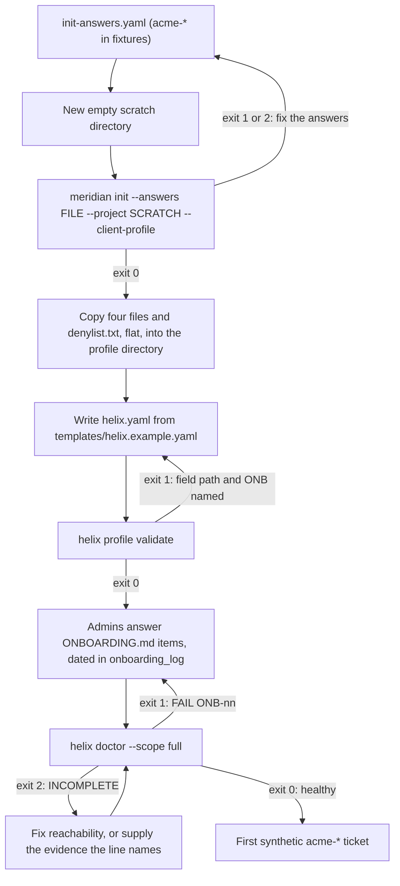
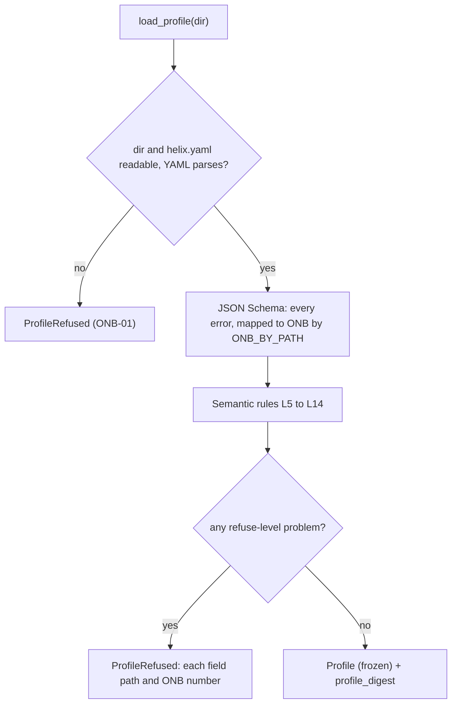

# 02 — Client profile and doctor

## 1. Purpose and scope

This file designs the per-client `helix.yaml` profile and `helix doctor`, the first object of sub-phase **B1**. The profile is one directory per client, has no required companion product files, and holds only non-secret configuration plus references to approved standards material. The loader refuses an incomplete profile and names the invalid field. The doctor runs offline structural and policy checks; connected-service checks are explicitly deferred. B1 never writes Anypoint, Jira, GitHub, or the profile. Names, enums, exit codes, storage paths and the credential model come from `00-conventions.md` and are not redefined.

## 2. Traceability

| Source | What this file implements |
| --- | --- |
| Plan §1 (week zero) | Admin answers dated asked and answered; the account team's answers on `license.lic` (ONB-20) and on Einstein-backed generation's cost (ONB-37) |
| Standalone B1 contract | Profile directory, `helix.yaml` contents, loader refusals, offline `helix doctor`, approved standards reference, and naming contract validation |
| Plan §3.2 | `deployment_properties:` handling (section 3.10, a timing deviation awaiting the owner); bot-only approval shown blocked, approve-and-run setting, `allowed_bots` (ONB-29 to ONB-31) |
| Plan §3.3, §3.5 traps | Jira points budget; `MERIDIAN_AUTH_MODE=connected_app`; fresh process per workflow; Fable 5.1 under zero-data-retention; EU only through Bedrock or Vertex; doctor refuses a forbidden route |
| Plan §4 decisions 1, 3, 6, 7, 10, 11 | Model route; one profile per client; gate owners; design standards; Draft status; caps |
| Files 01, 03, 05, 06, 07, 08, 09 | The profile keys they read (section 3.4, *Blocks other files define* and *Canonical key names*); 05's proposed ONB-35 and ONB-36; 01's pilot keys; 03's secret catalogue |
| Plan §3.7, §7 items 1 and 6 | Doctor cites `ONBOARDING.md` by number, a test holds them in step; admin items dated asked and answered |
| HLD *Components* row "Client profile and `helix doctor`" | Whole module |
| HLD gaps | #1 spike passes only with bearer auth (`toolchain.dx_mcp_spike`); #2 model route credential; #5 EE Nexus via proxy; #6 one vault; #7 approver lists and separation of duties; #8 required checks; #10 one connected app per Anypoint-using activity, checked as distinct apps; #11 generated-app repositories; #13 per-client scope and Temporal namespace; #14 residency hops; #15 caps, monthly ceiling, rate limit, kill switch; #16 approvals only as gate transitions (`jira.gates`); #17 preflight outcomes; #18 per-gate active and elapsed minutes fields |
| HLD *Lower severity* | Jira onboarding block (`[HLD-P lower: Jira]`); GitHub settings and bot role, read with an installation token narrowed to read permissions (`[HLD-P lower: GitHub]`, review item 25); per-client webhook secret (`[HLD-P lower: webhook]`); Meridian dependency surface (`[HLD-P lower: Meridian]`) |
| Review items not in the HLD table | Item 6: requester policy, Draft for email-originated requesters, deny-list on outbound comments (`[LLD]`, review item 6). Item 11: the DX MCP spike's evidence (`[LLD]`, review item 11) |

## 3. Design

### 3.1 Modules

| Module (under `src/helix/`) | Responsibility | Tag |
| --- | --- | --- |
| `schemas/helix_profile.v1.json` | JSON Schema (draft 2020-12) for `helix.yaml`; `additionalProperties: false` on every object | `[LLD]` |
| `profile/loader.py` | `load_profile()`: schema validation, semantic rules L1–L14, the frozen `Profile`, `profile_digest` | `[LLD]` |
| `profile/onb.py` | `ONB_BY_PATH`: field-path prefix to ONB number, so every refusal names its item | `[LLD]` |
| `profile/doctor/catalogue.py` | `CATALOGUE`: one `CheckSpec` per ONB number: `title`, `parts[]` (each `name`, `mode`, `depends_on`, `function`), `scopes`, `meridian_items` (citations of Meridian's own ONBOARDING items, section 3.9) | `[LLD]` |
| `profile/doctor/checks_*.py` | Check functions grouped by area: files, route, anypoint, jira, github, governance | `[LLD]` |
| `profile/doctor/report.py` | Text rendering, `doctor_report.v1`, verdict, exit code | `[LLD]` |
| `profile/deployment_keys.py` | `append(profile_dir, keys, *, run_id) -> AppendResult`: the gate-3 write of section 3.10 | `[LLD]` |
| `cli/profile.py`, `cli/doctor.py` | `helix profile validate`, `helix doctor` (conventions §4) | `[PLAN]` CLI parity |

The implemented B1 doctor is offline and read-only: it reads only `helix.yaml`, validates the policy, secret tripwire, non-production scope, and standalone naming contract, and reports deferred checks. Later connected-service checks must use explicit adapters and do not alter this offline boundary. The doctor never imports Meridian, reads a vault, loads `.env`, or makes a network call.

### 3.2 The profile directory `[PLAN]` layout, `[LLD]` additions

`$HELIX_PROFILES_ROOT/{client_id}/` (conventions §7). The directory is the portable unit: it lives outside every repository and is moved between machines by hand, as Meridian's `client-profile/` is (`meridian/CLAUDE.md`, "portable copies") `[PLAN]`.

| File | Written by | Schema owner | Tag |
| --- | --- | --- | --- |
| `helix.yaml` | Operator, from `templates/helix.example.yaml` | This file (`helix_profile.v1`) | `[PLAN]` |
| `tenant.yaml` | `meridian init` (its `config/tenant.yaml`) | Meridian `tenant.py` (`PROFILE_KEYS`, `ENVIRONMENT_KEYS`) | `[PLAN]` |
| `environments.yaml` | `meridian init` (its `config/environments.yaml`) | Meridian `runtime/envmap` | `[PLAN]` |
| `compare.yaml` | `meridian init` (its `config/compare.yaml`, the example unchanged) | Meridian `rules.py` | `[PLAN]` |
| `.env` | `meridian init` (its `.env`, from `env.example`) | Meridian `settings.py` `_ENV_ALLOWLIST` | `[PLAN]` |
| `denylist.txt` | `meridian init --client-profile` (its `client-profile/denylist.txt`) plus tokens the operator appends | Meridian `onboarding.denylist_tokens`; parsed by `clientdata.load_denylist` | `[PLAN]` deny-list, `[LLD]` fixed location and only copy (section 3.4, *The deny-list*) |
| `init-answers.yaml` | Operator; the answers `meridian init --answers` replayed | Meridian `onboarding.check_answers` | `[LLD]`, optional |
| `standards/skills.md`, `standards/decision-table.json` | Client architect (decision 7) | Skills: free text; table: `decision_table.v1` (file 06) | `[PLAN-DEFAULT 7]` content, `[LLD]` location |
| `evidence/anypoint-grants.json` | Platform owner's dated export of each connected app's grants, used only when the platform's grant read is unavailable (ONB-18) | This file: `{exported_on: date, exported_by: string, apps: [{client_id, grants: [{scope, business_group, environment: string or null}]}]}`; export format `[VERIFY]` | `[LLD]`, optional |

`denylist.txt`, `init-answers.yaml`, `standards/` and `evidence/` are not in conventions §7's list; section 6 asks for that list to be amended. The profile holds no secret and no vault path: the secrets it needs are named by 03's catalogue (03 §3.3; section 3.4, *Secrets*).

### 3.3 Meridian's four files, as `init` writes them

Grounded in `meridian/onboarding.py` (`INIT_TARGETS`, `init()`, `render_tenant_yaml`, `render_environments_yaml`, `render_env_file`, `CREDENTIAL_KEYS`, `denylist_tokens`) and `meridian/cli.py` (the `init` sub-parser).

| Fact | Source |
| --- | --- |
| `meridian init --answers FILE --project DIR [--client-profile]` writes `DIR/config/tenant.yaml`, `DIR/config/environments.yaml`, `DIR/config/compare.yaml` and `DIR/.env`, each the shipped example with the answers put in and every comment kept | `onboarding.py` `INIT_TARGETS`; `cli.py` `init` description |
| `--client-profile` also writes `client-profile/tenant.yaml`, `client-profile/environments.yaml` (byte copies) and `client-profile/denylist.txt` | `onboarding.py` `CLIENT_PROFILE_TARGETS` |
| It refuses, writing nothing, when any target exists ("there is no --force") or the answers are wrong | `onboarding.init()` |
| Exit 0: written and valid. 1: written, with problems `tenant validate` names. 2: either refused with nothing written (a target exists, or the answers are wrong), or written but `tenant validate` returned a code other than 0 or 1 (nothing to judge) | `cli.py` `init` description; `onboarding.InitResult.exit_code` |
| `.env` never carries a credential: `ANYPOINT_TOKEN`, `ANYPOINT_PAT`, `ANYPOINT_PASSWORD`, `ANYPOINT_CLIENT_SECRET`, `ANYPOINT_USERNAME`, `ANYPOINT_CLIENT_ID` are refused in the answers | `onboarding.py` `CREDENTIAL_KEYS`, `check_answers` |
| The shipped `.env` example keeps blank credential lines and sets `MERIDIAN_ENV_ALLOWLIST=DEV` and `ANYPOINT_BASE_URL` | `meridian/examples/env.example` |
| `tenant.yaml` keys: `schema_version`, `name`, `captured_on`, `naming`, `environments`, `business_groups`, `business_group_ids`, `root_org_name`, `root_org_id`, `session_token_lifetime_seconds`, `mq_region`, `config_dir_in_repo`, `config_files`, `deployment_properties`, `secure_properties` | `tenant.py` `PROFILE_KEYS` |
| Environment entries: `key`, `branch`, `display`, `rank`, `is_production`, `colour`, `in_scope`, `note`, `runtime_app_name_suffix`, `runtime_environment_name`, `git_repo_config_name_prefix` | `tenant.py` `ENVIRONMENT_KEYS`; `onboarding.ENVIRONMENT_ANSWER_KEYS` |
| `captured_on` defaults to today when not answered, so fixtures set it | `render_tenant_yaml` |

**Onboarding procedure** `[LLD]`: in a new, empty scratch directory, run `meridian init --answers init-answers.yaml --project <scratch> --client-profile`; on exit 0, copy `config/tenant.yaml`, `config/environments.yaml`, `config/compare.yaml`, `.env` and `client-profile/denylist.txt` byte for byte, flat, into the profile directory. `init` refuses any existing target ("there is no --force", `onboarding.init`), so every retry starts in a new scratch directory. Helix adds no command for this: parity means Meridian's own `init` is run, by the operator (plan §6). The tests run it as a subprocess through the bridge's runner (section 5); 01 §3.5.3 does not yet list `init`, so this file's contract test owns its surface until it does (section 6).



**How Meridian is pointed at the profile** `[PLAN]` exports, owned by 01. `meridian_bridge` builds every Meridian subprocess environment from scratch (01 §3.5.2). The working directory is an empty scratch directory with no `.env`, so Meridian never reads the profile's `.env` itself. `MERIDIAN_HOME` is a scratch directory for every subprocess except `runs --verify`, so `tenant discover`'s token cache (`token_cache_connected_app.json`) never reaches durable storage. The bridge also sets `MERIDIAN_AUTH_MODE=connected_app`, `MERIDIAN_READ_ONLY=1`, `MERIDIAN_BROWSER_SSO=0`, a scratch `HOME` and the null keyring backend, and refuses the names it forbids. Helix sets `MERIDIAN_HOME` and never sets `MERIDIAN_STATE_DIR` (conventions §7). This file does not redefine any of it.

`Profile.meridian_inputs()` returns only the non-secret inputs the bridge needs. The connected-app pair is never part of the profile: the broker hands it out per call (conventions §9, file 03).

| Field | Value | The bridge uses it for |
| --- | --- | --- |
| `tenant_profile` | `{dir}/tenant.yaml`, or the run overlay (section 3.10) | `MERIDIAN_TENANT_PROFILE` |
| `environment_map`, `compare_config` | `{dir}/environments.yaml`, `{dir}/compare.yaml` | `MERIDIAN_ENVIRONMENT_MAP`, `MERIDIAN_COMPARE_CONFIG` |
| `non_production` | `meridian.non_production_environments` | `MERIDIAN_ENV_ALLOWLIST`, comma-joined |
| `transport` | The `.env` values of the eight transport keys of 01 §3.5.2 (`ANYPOINT_BASE_URL`, the three CA-bundle names, the three proxy names, `MERIDIAN_MQ_REGION`), as parsed by the loader | Copied into `tenant discover` only |
| `durable_home` | `$HELIX_STATE_ROOT/{client_id}/meridian` (conventions §7) | `MERIDIAN_HOME` for the control-class bind and `runs --verify` only |

### 3.4 `helix_profile.v1` — field reference

Types: `date` is `YYYY-MM-DD`. `person` is a key of `people`. `env_key` is an environment `key` in `tenant.yaml`, as Meridian reads it (section 3.6). `logical_state` is a conventions §6 logical ticket state. The profile holds no secret value and no vault path `[HLD-P#6]`: each secret it needs has a fixed name in 03's catalogue (03 §3.3), under `helix/{client_id}/`, derived from the profile (*Secrets* below), so no field can point at another client's scope `[HLD-P#13]`. The **ONB** column is the item a missing or wrong value is reported under. Conditional requirements ("cond.") are JSON Schema `if`/`then` clauses, so the loader names them like any other missing field (L3).

**Top level**

| Field | Type and constraints | Req | ONB | Tag |
| --- | --- | --- | --- | --- |
| `schema` | const `helix_profile.v1` | yes | 01 | `[LLD]` |
| `client_id` | `^[a-z0-9-]{2,32}$`; equals the directory name | yes | 01 | conventions §6 |
| `display_name` | string, 1–64 characters | no | 01 | `[LLD]` |
| `doctor.reuse_hours` | integer ≥ 1: how old a `full` report's ONB-17 and ONB-18 results may be and still serve the `run` scope (section 3.7) | yes | 01 | `[LLD]` |
| `toolchain.dx_mcp_route` | bool, default `false`; `true` only after the B1 spike passes | no | 15 | `[PLAN]` spike |
| `toolchain.dx_mcp_spike` | `{recorded_on: date, server_version: ^\d+\.\d+\.\d+$, command: string, args: [string], auth_mode: enum bearer or client_credentials, headless: const true, tools_hidable: bool, dx_tools_all: [string], at least 1, dx_tools: [string], a subset of dx_tools_all, hosts: [hostname], at least 1}`: the spike's record, which 04 §3.7 reads: the `dx` launcher's `command` and `args`, every tool the pinned server offers (`dx_tools_all`), the allowlist (`dx_tools`), and whether the non-allowlisted tools can be hidden from the model (`tools_hidable`). Required when `dx_mcp_route` is `true`, and then `auth_mode` must be `bearer` and `tools_hidable` `true` (04 §3.7) | cond. | 15 | `[HLD-P#1]` bearer auth; `[LLD]` review item 11 (stated auth mode, pinned version, recorded hosts, tool lists) |
| `onboarding_log` | list, at least 1, of requests `{request: ^[a-z0-9-]+$ (unique), asked_of: string, items: [ONB-nn] (at least 1), asked_on: date, answered_on: date or null, note: string ≤ 200 characters or null}`. Every item whose *Who answers* (section 3.8) names anyone other than the operator or the owner must be listed in a request | yes | each item listed | `[PLAN]` §1, §7 item 6 |

**`meridian`**

| Field | Type and constraints | Req | ONB | Tag |
| --- | --- | --- | --- | --- |
| `meridian.version` | Meridian wheel version, `^\d+\.\d+\.\d+$` | yes | 07 | `[HLD-P lower: Meridian]` |
| `meridian.non_production_environments` | list of `env_key`, at least 1, each `in_scope` and not `is_production` | yes | 06 | `[PLAN]` |

**`model_route`** — decision 1 `[PLAN]`

| Field | Type and constraints | Req | ONB | Tag |
| --- | --- | --- | --- | --- |
| `provider` | enum `anthropic`, `bedrock`, `vertex` | yes | 10 | `[PLAN]` |
| `region` | bedrock: an AWS region; vertex: `global`, `us`, `eu` or a region; anthropic: inference geography `global` or `us` | yes | 10 | `[PLAN]` region, `[VERIFY]` value sets |
| `gcp_project_id` | string; required when `provider: vertex` | cond. | 10 | `[LLD]` |
| `zero_data_retention` | bool: the provider organisation behind this route is under zero-data-retention | yes | 10 | `[PLAN]` |
| `models.{intake,design,build,test}` | bare model id known to the Helix release (`claude-opus-5-5` default); the gateway adds the `anthropic.` prefix on Bedrock | yes, all four | 10 | `[PLAN]` per phase, `[LLD]` bare ids |
| `background_model` | bare model id, or absent: the one extra model a session may call for the small requests Claude Code makes on its own (03 §3.7.3); held to rules R1–R7 like a phase model | no | 10, 11 | `[LLD]`; which ids Claude Code requests is `[VERIFY]` |

The route credential (API key, AWS role or GCP service account) is the vault secret `model_route/credential`, held by the gateway only `[HLD-P#2]`.

**`data_handling`** — the plan's "data-handling rules" `[PLAN]`; the fields that express them are this LLD's `[LLD]`

| Field | Type and constraints | Req | ONB | Tag |
| --- | --- | --- | --- | --- |
| `residency` | enum `none`, `eu`, `us` | yes | 11 | `[LLD]` implementing `[PLAN]` data rules |
| `requires_zero_data_retention` | bool: the client's rule (the route's flag must then be `true`) | yes | 11 | `[LLD]` implementing `[PLAN]` data rules |
| `allowed_providers` | list of `provider`, at least 1 | yes | 11 | `[LLD]` implementing `[PLAN]` data rules |
| `allowed_regions` | list of region strings, at least 1 | yes | 11 | `[LLD]` implementing `[PLAN]` data rules |
| `forbidden_models` | list of bare model ids | no | 11 | `[LLD]` implementing `[PLAN]` data rules |
| `redact_before_model` | list of regular expressions applied to Meridian and Discover output before any model sees it | no | 12 | `[HLD-P lower: Meridian]` |
| `hops[]` | `{hop: enum, hosts: [hostname], region: string, data: string, inside_guarantee: bool}` | yes | 12 | `[HLD-P#14]` |
| `hops[].hop` | `model_route`, `jira_cloud`, `github`, `actions_runner`, `anypoint_control_plane`, `maven_nexus`, `dx_mcp_server`, `helix_control_plane`, `helix_workers` | — | 12 | `[HLD-P#14]` |
| `client_statement` | `{signed_by: string, signed_on: date}`; required when `residency` is not `none` and any hop has `inside_guarantee: false` | cond. | 12 | `[HLD-P#14]` |

**`caps`** — ONB-13 for every row

| Field | Type and constraints | Req | Tag |
| --- | --- | --- | --- |
| `run_usd` | number > 0; a run is one ticket workflow's lifetime (conventions §6 `run_id`) | yes | `[PLAN-DEFAULT 11]` default about $170; `[HLD-P#15]` what a run is |
| `phase_attempt_usd` | number > 0 and ≤ `run_usd` | yes | `[PLAN-DEFAULT 11]` half the run cap; `[HLD-P#15]` per attempt |
| `client_monthly_usd` | number ≥ `run_usd` | yes | `[HLD-P#15]` |
| `client_daily_usd` | number ≥ `phase_attempt_usd` and ≤ `client_monthly_usd` | no | `[HLD-P#15]` |
| `max_turns.{intake,design,build,test}` | integer ≥ 1; becomes `phase_brief.v1` `caps.max_turns` | yes | `[LLD]` |
| `build_retry_cap` | integer ≥ 0 (plan §3.2 "the profile's retry cap"; no number is given) | yes | `[PLAN]` |
| `intake_rate_limit` | `{tickets_per_requester_per_day: int ≥ 1, tickets_per_client_per_day: int ≥ 1}`; enforced by the webhook receiver (file 03) | yes | `[HLD-P#15]` |
| `kill_switch` | bool; `true` stops every phase start and every gateway call for the client | yes | `[HLD-P#15]` |

**`anypoint`, `maven`** — one connected app per Anypoint-using activity `[HLD-P#10]`; non-production, expiry set `[PLAN]`

| Field | Type and constraints | Req | ONB | Tag |
| --- | --- | --- | --- | --- |
| `connected_apps` | map keyed by activity: `discover`, `design`, `build`; all three required. Each app's id and secret are the vault secrets `anypoint/{app}/client_id` and `anypoint/{app}/client_secret`, held by the broker; ONB-16 checks that the three apps are distinct | yes | 15 | `[HLD-P#10]` |
| `connected_apps.*.business_group` | string; one of `tenant.yaml` `business_groups` | yes | 15 | `[PLAN]` |
| `connected_apps.*.environments` | list of `env_key`, subset of `meridian.non_production_environments` | yes | 15, 18 | `[PLAN]` |
| `connected_apps.*.exchange_role` | enum `viewer`, `contributor`. If the owner rejects HLD-P#10, every app is `contributor`, as the plan grants, and no evidence is required | yes | 18 | `[HLD-P#10]` |
| `connected_apps.*.contributor_evidence` | string naming the B1 test that showed Viewer is not enough; required when `contributor` | cond. | 18 | `[HLD-P#10]` |
| `connected_apps.*.scopes_expected` | list of scope names exactly as the tenant spells them | yes | 18 | `[PLAN]`, `[VERIFY]` strings |
| `connected_apps.*.secret_expires_on` | date, in the future: the expiry the platform owner set | yes | 19 | `[PLAN]` |
| `expiry_warning_days` | integer ≥ 1 | yes | 19 | `[LLD]` |
| `license_lic.needed` | enum `yes`, `no`, `unknown`; dates live in `onboarding_log`. When `yes`, the vault secret `munit/license_lic` must resolve, and only `verify`-class containers receive it (*Secrets* below) | yes | 20 | `[PLAN]` question, `[LLD]` mechanism |
| `maven.extra_upstreams` | list of hosts, each on 03's operator-reviewed list (03 §3.8); default empty. The EE Nexus credential is the vault secret `maven/nexus_ee`, held by the Maven proxy `[HLD-P#5]` | no | 21 | `[LLD]` |

The control plane's address is the `.env` value `ANYPOINT_BASE_URL`, the one place it is written (ONB-05, ONB-12).

**`jira`** — `[HLD-P lower: Jira]` unless marked

| Field | Type and constraints | Req | ONB | Tag |
| --- | --- | --- | --- | --- |
| `site` | `https://` URL of the Jira Cloud site | yes | 22 | |
| `project_key` | `^[A-Z][A-Z0-9]+$` | yes | 22 | |
| `issue_types` | list of issue type names Helix handles, at least 1 (03 §3.4.6) | yes | 22 | |
| `bot.account_id`, `bot.email` | strings. The API token is the vault secret `jira/bot_token`, held by the Jira client (basic auth with email and API token `[VERIFY]`) | yes | 22 | |
| `points_per_hour` | integer ≥ 1, default 65,000 points an hour (Jira's default) | no | 22 | `[PLAN]` §3.3 |
| `points_reserve` | number ≥ 0 and < 1, default 0.2 (03 §3.5.3) | no | 22 | `[LLD]` |
| `states.{new,needs_info,requirement_review,design_review,building,in_review,done,cancelled}` | `{status: string, transition_id: string}`; status names unique; `transition_id` required for the states the bot enters (`needs_info`, `requirement_review`, `design_review`, `in_review`, `draft`) | yes | 24 | conventions §6 |
| `states.draft` | same shape; required when Draft is used (below) | cond. | 27 | `[PLAN-DEFAULT 10]` |
| `gates.{gate1_requirement,gate2_design}.approve_transitions`, `.reject_transitions` | each a list, at least 1, of `{transition_id: string, to_state: logical_state}`. The from-state is the gate's review state (`requirement_review`, `design_review`). Approve and reject sets name different `to_state`s. The template carries 03's default table (03 §3.4.6): approve to `building`; gate-1 reject to `needs_info`; gate-2 reject to `requirement_review` | yes | 24 | `[HLD-P#16]` approval only as a transition; `[LLD]` keys (08 §3.17) |
| `onboarding_issue_key` | ticket key of the walk issue (ONB-24) | yes | 24 | `[LLD]` |
| `onboarding_walk_label` | Jira label the walk issue carries, default `helix-onboarding-walk`; the receiver excludes an issue with this label or key from runs (section 3.11) | no | 24 | `[LLD]` |
| `fields.{accepted,change_requests,hand_rewrite,pr_url}` | `^customfield_[0-9]+$` | yes | 25 | `[PLAN]` §3.2 for the first three; `[LLD]` `pr_url`, the PR link 07 writes (07 §3.8.2) |
| `fields.gate{1,2,3}_active_minutes`, `fields.gate{1,2,3}_wait_minutes` | `^customfield_[0-9]+$`; active minutes typed by the reviewer, elapsed wait written by Helix (03 §3.5.7, 09 §3.13) | yes | 25 | `[HLD-P#18]` |
| `fields.gate1_redundant_facts`, `fields.gate1_return_facts` | `^customfield_[0-9]+$`; 05's fact-id measurement fields | no | 25 | `[LLD]` (05 §3.10) |
| `fields.hand_rewritten_self_report` | `^customfield_[0-9]+$`: the merger's own answer on hand rewrites; absent, no self-report is read | no | 25 | `[LLD]` (09 §3.16) |
| `webhook.id`, `webhook.receiver_url`, `webhook.registered_on` | string; `https://` URL whose path ends in `/hooks/jira/{client_id}` (03 §3.4.1); date. The HMAC secret is the vault secret `webhook/jira_hmac` (`current` and `previous` keys, 03 §3.3) | yes | 26 | `[HLD-P lower: webhook]` |
| `requester_policy` | enum `internal_only` (only an internal reporter gets a run), `external_draft` (every reporter gets a run; every comment to an external audience is held for Draft), `all_draft` (every comment is held, decision 10's opt-in Draft). The meanings are 03 §3.5.5's table. An email-originated reporter is never internal (03 §3.5.5) | yes | 27 | `[LLD]` review item 6; `all_draft` `[PLAN-DEFAULT 10]` |
| `internal_groups` | list of Jira group names, at least 1; a reporter in one of them is internal | yes | 27 | `[LLD]` review item 6 |
| `extra_answerers` | list of `person`, default empty: people besides the reporter whose comments may answer questions (05) | no | 32 | `[LLD]` (05) |
| `mail_handler` | `{enabled: bool, address: email or null, marker: string or null}`; `address` and `marker` (the label the handler sets on issues it creates `[VERIFY]`) required when `enabled` | yes | 27 | `[HLD-P lower: Jira]`, `[LLD]` marker (05) |
| `draft_visibility` | `{kind: enum role, group; name: string}`: who may read a held comment; required when Draft is used | cond. | 27 | `[LLD]` review item 6 |

**Draft is used** when `requester_policy` is `external_draft` or `all_draft`, or when `mail_handler.enabled` is `true`. Jira notification email carries a public comment to an email-originated requester, which counts as "by email" under decision 10 (review item 6), so email intake always needs Draft. Then `states.draft` and `draft_visibility` are required, and the Draft releasers are `gates.draft_reviewers`, which defaults to the gate-1 approvers, so a releaser always exists `[LLD]` review item 6. Under `internal_only` an email-originated reporter gets no run at all (03 §3.5.5), so a mail handler there is a WARN under ONB-27, not a FAIL.

**`github`** — `[HLD-P#11]` repositories, `[HLD-P lower: GitHub]` settings and role

| Field | Type and constraints | Req | ONB | Tag |
| --- | --- | --- | --- | --- |
| `org` | the client's GitHub organisation | yes | 28 | |
| `app.app_id`, `app.installation_id` | strings. The private key is the vault secret `github/app_private_key`, held by the git writer; the App's webhook secret is `webhook/github_hmac` | yes | 28 | |
| `bot_login` | the App's bot login, `^[a-z0-9-]+\[bot\]$` | yes | 28 | |
| `bot_user_id` | integer: the bot's numeric GitHub id, which 03's receiver ignores as its own actor | yes | 28 | `[LLD]` (03) |
| `repo_convention` | enum `per_integration` (name from the grammar's repository form) or `client_defined` | yes | 29 | |
| `default_branch` | string | yes | 29 | |
| `required_checks` | list of status-check names, at least 1, holding `helix/verify` | yes | 29 | `[HLD-P#8]` |
| `repositories[]` | `{name, onboarded_on: date, bot_approval_proof: {pull_request: int, recorded_on: date}}`; at least 1 | yes | 29, 31 | |
| `pilot` | the B2 pilot (01 §3.8); required while the Action runs | cond. | 30 | `[PLAN]` pilot, `[HLD-P#11]` repository |
| `pilot.repository` | the pilot repository in `org`; it holds only the pilot workflow (01 §3.8) | yes, in `pilot` | 30 | `[LLD]` (01) |
| `pilot.workflow_path` | repository-relative path, default `.github/workflows/helix-pilot.yml` | no | 30 | `[LLD]` (01 §3.8) |
| `pilot.runner_labels.control`, `.agent` | lists of runner labels, each at least 1, holding `self-hosted` and no GitHub-hosted label (01 lint L5); rendered into the workflow's `runs-on` | yes, in `pilot` | 30 | `[HLD-P#4]` `[HLD-P#14]` (01 §3.8) |
| `pilot.mode` | enum `synthetic`, `real`, default `synthetic`; `helix run --mode` may lower it, never raise it (01 §3.9) | no | 30 | `[HLD-P#4]` |
| `pilot.jira_actor_login` | the GitHub login that stands for the Jira side in `allowed_bots`, as the plan requires. Under 01 §3.8 and 03 §3.2 only the App dispatches the pilot, so this login triggers nothing unless the owner picks a machine-user trigger (01 §6) | yes, in `pilot` | 30 | `[LLD]` |
| `pilot.allowed_bots` | list of logins: exactly `jira_actor_login` and `bot_login`. Whether an entry carries the `[bot]` suffix follows what `github.actor` reports `[VERIFY]` | yes, in `pilot` | 30 | `[PLAN]` "the Jira and GitHub bots" |
| `pilot.allowed_operators` | list of logins, default empty | no | 30 | `[LLD]` (01) |

There is no separate settings-reader credential: the settings check uses the git writer's installation token narrowed to administration read and metadata read (03 §3.9.1, §3.9.4), never the token that writes `[LLD]` `[HLD-P lower: GitHub]`. 03 §3.9.1 and 07 §3.8 read settings the same way.

**`people`, `gates`, `design_standards`**

| Field | Type and constraints | Req | ONB | Tag |
| --- | --- | --- | --- | --- |
| `people.{key}` | `{jira_account_id: string, github_login: string, github_user_id: integer, optional}`; key `^[a-z0-9-]+$`. `github_user_id` lets 08 match a GitHub actor by numeric id rather than by login (08 §3.9.3, §3.17) | yes, ≥1 | 32 | `[HLD-P#7]`; `github_user_id` `[LLD]` (08) |
| `gates.{gate1_requirement,gate2_design,gate3_merge}.approvers` | list of `person`, at least 1 | yes | 32 | `[PLAN-DEFAULT 6]`, `[HLD-P#7]` |
| `gates.*.turnaround_business_days`, `.reminder_after_business_days` | integers ≥ 1; when absent, 2 and 1 | no | 32 | `[LLD]` defaults taken from decision 6's recommendation; decision 6's default concerns only who signs |
| `gates.draft_reviewers` | list of `person`, at least 1: who may release a held comment by moving the ticket out of `draft` (03 §3.5.5, 05 §3.11); when absent, the gate-1 approvers | no | 27 | `[LLD]` review item 6 |
| `gates.waiver` | `{reason: string, recorded_on: date, max_tickets: 1}` or absent; waives separation of duties for the pilot | no | 32 | `[HLD-P#7]` |
| `gates.gate4_deploy` | must be absent in B1–B5 | — | 34 | `[PLAN]` |
| `design_standards.contract_format` | enum `oas30`, `raml10` | yes | 33 | `[PLAN-DEFAULT 7]` |
| `design_standards.ruleset` | `{group_id: string, asset_id: string, version: ^\d+\.\d+\.\d+$}`: the Exchange coordinates of the ruleset; the Best Practices ruleset's group id and asset id are `[VERIFY]` | yes | 33 | `[PLAN-DEFAULT 7]` |
| `design_standards.max_ruleset_violations` | const `0` | yes | 33 | `[PLAN-DEFAULT 7]` |
| `design_standards.layers_policy` | enum `fewest_with_reuse`, `api_led_three_layer` | yes | 33 | `[PLAN-DEFAULT 7]` |
| `design_standards.logging` | enum `json_logger_module` | yes | 33 | Client standards bundle decision; requires the approved Exchange logger module |
| `design_standards.skills_file`, `.decision_table` | relative paths inside the profile directory | yes | 33 | `[PLAN-DEFAULT 7]`, `[LLD]` location |

**`orchestration`** — names and defaults are file 08's (08 §3.17); ONB-38

| Field | Type and constraints | Req | Tag |
| --- | --- | --- | --- |
| `orchestration.driver` | enum `controlplane`, `draining`, `temporal`; default `controlplane` until B5 | no | `[HLD-P#12]` |
| `orchestration.namespace` | string, default `helix-{client_id}` | no | `[HLD-P#13]` |
| `orchestration.max_parallel_agents` | integer ≥ 1, default 2 (08's choice) | no | `[LLD]` |
| `orchestration.profile_hold_hours` | integer ≥ 1, default 72 (08's choice, 08 §3.7) | no | `[LLD]` |

**Secrets the profile needs** `[HLD-P#6]` `[HLD-P#13]`. Every name is fixed by 03's catalogue (03 §3.3), under `helix/{client_id}/`, and derived from the profile; `Profile.secret_names()` returns the list. No profile field names a vault path (L8), so one client's profile cannot point at another client's secret, and 03's `CrossClientRef` refuses a name with `..`, a leading `/`, `_system/` or `deploy/` as a second layer.

| Secret name | Needed when | Read by role (03 §3.3) | Used by |
| --- | --- | --- | --- |
| `jira/bot_token` | always | `receiver`, `control` | Jira client |
| `github/app_private_key` | always | `receiver`, `control` | git writer |
| `webhook/jira_hmac`, `webhook/github_hmac` | always | `receiver` | webhook receiver |
| `anypoint/{app}/client_id`, `anypoint/{app}/client_secret`, for `app` in `discover`, `design`, `build` | always | `broker` | credential broker |
| `model_route/credential` | always | `gateway` | model gateway |
| `maven/nexus_ee` | always | `mavenproxy` | Maven proxy |
| `munit/license_lic` | `anypoint.license_lic.needed: yes` | `control` | Mounted read-only, outside `/work`, only into containers of class `verify` (03 §3.6.1: 07's `verify` with no agent session, `helix-worker-build`, 01 §3.7), never into an agent-class container. Agent-session MUnit runs skip the suites that need it, and 07 then runs its `test` evidence stage in a `verify` container rather than in the agent's container after the session `[LLD]` (section 6) |

**The deny-list** `[PLAN]` per client, never committed; `[LLD]` location and uses. One copy only: `denylist.txt` in the profile directory, at that fixed path, parsed by Meridian's `clientdata.load_denylist`. No `helix.yaml` key names it, so a profile cannot point the scan at another client's file, and there is no vault copy. 03 §3.3 and §3.5.5, 05 §3.14 and 10 §3.13 read it at that path. Its uses are the targets below; they replace the earlier `denylist.apply_to` key.

| Target | What is scanned | Against | On a hit | Owner |
| --- | --- | --- | --- | --- |
| `helix_repo_tripwire` | Commits to Helix's own repository | The union of every client's list (`$HELIX_PROFILES_ROOT/*/denylist.txt`) | The commit is refused | 01 (G27), 10 §3.13 |
| Generated-app commits | The tree the git writer pushes | Other clients' lists only. This client's own tokens belong in its own code: names render the grammar's prefix, and `denylist_tokens` adds environment keys and suffixes (`onboarding.denylist_tokens`) | Push refused, `FAILED` | 03 §3.9.2 `sync` (07's `push_tree`), 10 §3.13 |
| `outbound_comments` | Every Jira comment before it is posted | Every client's list | Another client's token: blocked, `comment_withheld`, `FAILED` (03 §3.5.5 check 2). This client's token: counted on the hold and in the chain, never blocking (03 §3.5.5 check 3), because an internal audience may read its own estate's names and an external audience is held for Draft anyway | 03, 05 |

**Blocks other files define** `[LLD]`. `helix_profile.v1` includes these blocks by reference. Their fields are exactly the owning file's table, compiled into the schema's `$defs` with `additionalProperties: false`, so the loader refuses an unknown key in them as in any other block. A key there that duplicates a canonical key of this file is left out, and the owner reads the canonical one.

| Block | Fields defined in | ONB |
| --- | --- | --- |
| `discover` | 05 §3.14 | 35 |
| `intake` | 05 §3.14 | 36 |
| `build`, `test` | 07 §3.12 | 21 |
| `metering` | 09 §3.16 | 13 |
| `measurement` | 09 §3.16 | 25 |
| `design_standards` additions | 06 §3.16: `async_contract`, `standards_trace`, `ruleset_files[]`, `pins`, `layer_words`, `max_attempts`, `validation_route`, `repository_wait_business_days`. The fields in the `design_standards` table above stay this file's | 33 |

**Canonical key names and their consumers** `[LLD]`. 02 owns `helix_profile.v1` (conventions §8). The other files read every key under this file's names, including the keys they proposed and this file adopted: `jira.gates.*` (08), `jira.points_reserve`, `model_route.background_model`, `maven.extra_upstreams`, `github.bot_user_id` and the walk keys (03), `jira.internal_groups`, `jira.mail_handler`, `jira.draft_visibility`, `jira.extra_answerers`, `gates.draft_reviewers` and the two fact-id fields (05), `jira.fields.pr_url` (07), `jira.fields.hand_rewritten_self_report` (09), `github.pilot.repository`, `.workflow_path`, `.runner_labels`, `.mode` and `.allowed_operators` (01), `people.{key}.github_user_id` and `orchestration.profile_hold_hours` (08), and the blocks above. These names still differ; each listed file renames to the canonical key (section 6).

| Canonical (this file) | Name used elsewhere | File |
| --- | --- | --- |
| `jira.requester_policy` | `data_handling.requester_trust`, `jira.draft_all_comments` | 04 §3.8, block 2 (04 §6 item 7 waits for this name) |
| `jira.fields.hand_rewrite`, `jira.fields.gate{1,2,3}_wait_minutes` | `hand_rewritten`, `gate{1,2,3}_elapsed_minutes` | 09 §3.16 (03 §6 item 15 asks the same) |
| No label key: label names are fixed (03 §3.9.3, 07 §3.8) | `github.labels.reverify` | 10 G-P08-b; 11 §3.10 |

### 3.5 Complete annotated example (`tests/fixtures/acme-b/profile/helix.yaml`)

Every value is synthetic. Values marked *fixture value* are test data, not recommendations; the owner sets the real numbers. The fixture also carries the blocks other files define (section 3.4, *Blocks other files define*); they are not repeated here.

```yaml
schema: helix_profile.v1
client_id: acme-b                      # equals the directory name (ONB-01)
display_name: "Acme EU (fixture)"
doctor: {reuse_hours: 24}              # fixture value (ONB-01, section 3.7)

meridian:
  version: "1.8.1"                     # the pinned wheel this profile was checked under (ONB-07)
  non_production_environments: [DEV, SIT]   # the bridge exports them as MERIDIAN_ENV_ALLOWLIST; none is_production (ONB-06)

model_route:                           # decision 1 (ONB-10); credential: vault model_route/credential
  provider: bedrock
  region: eu-central-1
  zero_data_retention: true            # so claude-fable-5-1 is refused (ONB-11)
  models: {intake: claude-opus-5-5, design: claude-opus-5-5, build: claude-opus-5-5, test: claude-opus-5-5}
  # background_model absent: a session may call the phase model only (03 §3.7.3)

data_handling:
  residency: eu                        # EU only through Bedrock or Vertex (ONB-11, R6)
  requires_zero_data_retention: true
  allowed_providers: [bedrock, vertex]
  allowed_regions: [eu-central-1, eu-west-1]
  forbidden_models: [claude-fable-5-1]
  redact_before_model: ['\b10\.\d{1,3}\.\d{1,3}\.\d{1,3}\b']   # internal addresses in Meridian output
  hops:                                # one row per hop data crosses (ONB-12)
    - {hop: model_route, hosts: [bedrock-runtime.eu-central-1.amazonaws.com], region: eu-central-1, data: "prompts, fact sheet, code", inside_guarantee: true}   # [VERIFY] Mantle host
    - {hop: jira_cloud, hosts: [jira-b.acme.test], region: eu, data: "ticket text, comments", inside_guarantee: true}   # [VERIFY] the site's data residency
    - {hop: github, hosts: [api.github.com], region: us, data: "generated code, PR body", inside_guarantee: false}
    - {hop: actions_runner, hosts: [runners.acme-b.test], region: eu-central-1, data: "pilot job workspace", inside_guarantee: true}
    - {hop: anypoint_control_plane, hosts: [eu1.anypoint.mulesoft.com], region: eu, data: "tenant reads, Exchange search", inside_guarantee: true}
    - {hop: maven_nexus, hosts: [repository.mulesoft.org], region: unknown, data: "artefact coordinates only", inside_guarantee: false}   # [VERIFY] EE Nexus host
    - {hop: helix_control_plane, hosts: [helix.acme-b.test], region: eu-central-1, data: "everything above", inside_guarantee: true}
    - {hop: helix_workers, hosts: [workers.acme-b.test], region: eu-central-1, data: "fact sheet, code", inside_guarantee: true}
  client_statement: {signed_by: "Acme EU data protection (fixture)", signed_on: 2026-10-01}

caps:                                  # ONB-13
  run_usd: 170                         # estimate: 3 x $33 x 1.3 rework x 1.3 tokenizer (decision 11 default)
  phase_attempt_usd: 85                # half the run cap (decision 11 default)
  client_monthly_usd: 1700             # fixture value
  max_turns: {intake: 40, design: 80, build: 150, test: 120}   # fixture values
  build_retry_cap: 3                   # fixture value
  intake_rate_limit: {tickets_per_requester_per_day: 5, tickets_per_client_per_day: 20}   # fixture values
  kill_switch: false

anypoint:
  connected_apps:                      # one app per activity (ONB-15 to ONB-19); secrets: vault anypoint/{app}/client_id and client_secret
    discover:
      business_group: "Acme Core"
      environments: [DEV, SIT]
      exchange_role: viewer
      scopes_expected: ["Exchange Viewer", "Environment Viewer", "View APIs Configuration", "Read Applications"]   # [VERIFY] tenant spelling
      secret_expires_on: 2027-03-31
    design:
      business_group: "Acme Core"
      environments: [DEV]
      exchange_role: viewer
      scopes_expected: ["Exchange Viewer"]
      secret_expires_on: 2027-03-31
    build:
      business_group: "Acme Core"
      environments: [DEV]
      exchange_role: viewer
      scopes_expected: ["Exchange Viewer"]
      secret_expires_on: 2027-03-31
  expiry_warning_days: 30              # fixture value
  license_lic: {needed: "no"}          # dates in onboarding_log (ONB-20)

toolchain: {dx_mcp_route: false}       # until the B1 spike passes; then dx_mcp_spike is required (ONB-15)

jira:                                  # ONB-22 to ONB-27; bot token: vault jira/bot_token
  site: https://jira-b.acme.test
  project_key: ACME
  issue_types: [Integration]
  bot: {account_id: "acme-b-bot-0001", email: helix-bot@acme-b.test}
  states:
    new:                {status: "Open"}
    needs_info:         {status: "Needs info", transition_id: "21"}
    requirement_review: {status: "Requirement review", transition_id: "31"}
    design_review:      {status: "Design review", transition_id: "41"}
    building:           {status: "Building"}
    in_review:          {status: "In review", transition_id: "61"}
    done:               {status: "Done"}
    cancelled:          {status: "Cancelled"}
    draft:              {status: "Draft", transition_id: "71"}   # Draft is used (external_draft, mail handler on)
  gates:                               # human gate transitions, 03's default table (ONB-24)
    gate1_requirement:
      approve_transitions: [{transition_id: "51", to_state: building}]
      reject_transitions:  [{transition_id: "52", to_state: needs_info}]
    gate2_design:
      approve_transitions: [{transition_id: "53", to_state: building}]
      reject_transitions:  [{transition_id: "54", to_state: requirement_review}]
  onboarding_issue_key: ACME-1
  onboarding_walk_label: helix-onboarding-walk
  fields:                              # 10 fields (ONB-25)
    accepted: customfield_10101
    change_requests: customfield_10102
    hand_rewrite: customfield_10103
    pr_url: customfield_10104
    gate1_active_minutes: customfield_10111
    gate1_wait_minutes: customfield_10112
    gate2_active_minutes: customfield_10113
    gate2_wait_minutes: customfield_10114
    gate3_active_minutes: customfield_10115
    gate3_wait_minutes: customfield_10116
  webhook: {id: "7", receiver_url: "https://helix.acme-b.test/hooks/jira/acme-b", registered_on: 2026-10-02}   # HMAC: vault webhook/jira_hmac
  requester_policy: external_draft     # review item 6 (ONB-27); Draft is therefore used
  internal_groups: [acme-b-staff]
  mail_handler: {enabled: true, address: integrations@acme-b.test, marker: acme-b-mail-intake}   # [VERIFY] the handler sets a label
  draft_visibility: {kind: role, name: "Helix reviewers"}

github:                                # ONB-28 to ONB-31; App key: vault github/app_private_key
  org: acme-b-apps
  app: {app_id: "100001", installation_id: "200001"}
  bot_login: acme-b-helix[bot]
  bot_user_id: 300001
  repo_convention: per_integration
  default_branch: main
  required_checks: [helix/verify]
  repositories:
    - {name: acmeb-sapi-order-v1, onboarded_on: 2026-10-03, bot_approval_proof: {pull_request: 1, recorded_on: 2026-10-03}}   # ACME-101's repository name for acme-b (10 §3.11); it parses only under this fixture's grammar, prefix acmeb
  pilot:
    repository: acme-b-helix-pilot
    # workflow_path absent: .github/workflows/helix-pilot.yml
    runner_labels: {control: [self-hosted, helix-acme-b-control], agent: [self-hosted, helix-acme-b-agent]}
    mode: synthetic
    jira_actor_login: acme-b-jira-bot
    allowed_bots: [acme-b-jira-bot, "acme-b-helix[bot]"]   # [VERIFY] the [bot] suffix
    allowed_operators: [acme-b-owner]

people:
  owner: {jira_account_id: "acme-b-user-0001", github_login: acme-b-owner}
  dana:  {jira_account_id: "acme-b-user-0002", github_login: acme-b-dana}

gates:                                 # decision 6 default plus separation of duties (ONB-32)
  gate1_requirement: {approvers: [owner]}   # turnaround 2, reminder 1 business days by default
  gate2_design:      {approvers: [owner]}
  gate3_merge:       {approvers: [dana]}
  # draft_reviewers absent: the gate-1 approvers release a held comment (ONB-27)

design_standards:                      # decision 7 default (ONB-33)
  contract_format: oas30
  ruleset: {group_id: "00000000-0000-0000-0000-000000000000", asset_id: "acme-fixture-best-practices", version: "1.6.5"}   # fixture placeholders; real group id and asset id [VERIFY]; 1.6.5 at research time
  max_ruleset_violations: 0
  layers_policy: fewest_with_reuse
  logging: json_logger_module
  skills_file: standards/skills.md
  decision_table: standards/decision-table.json

orchestration: {driver: temporal, namespace: helix-acme-b}   # a B5 client in this fixture (ONB-38)

onboarding_log:                        # plan §7 item 6: every item answered outside the operator and owner
  - {request: platform-owner-anypoint, asked_of: "platform owner", items: [ONB-02, ONB-06, ONB-15, ONB-16, ONB-17, ONB-18, ONB-19], asked_on: 2026-09-20, answered_on: 2026-09-27, note: null}
  - {request: client-data-protection, asked_of: "client data protection", items: [ONB-10, ONB-11, ONB-12], asked_on: 2026-09-20, answered_on: 2026-10-01, note: null}
  - {request: account-team-license, asked_of: "account team", items: [ONB-20], asked_on: 2026-09-20, answered_on: 2026-09-28, note: "not needed for the fixture connectors"}
  - {request: account-team-einstein, asked_of: "account team", items: [ONB-37], asked_on: 2026-09-20, answered_on: 2026-09-30, note: "fixture answer; generation unused (decision 2)"}
  - {request: mulesoft-support-nexus, asked_of: "MuleSoft Support", items: [ONB-21], asked_on: 2026-09-20, answered_on: 2026-09-29, note: null}
  - {request: jira-admin, asked_of: "Jira admin", items: [ONB-22, ONB-23, ONB-24, ONB-25, ONB-26, ONB-27], asked_on: 2026-09-22, answered_on: 2026-10-02, note: null}
  - {request: github-org-admin, asked_of: "GitHub org admin", items: [ONB-28, ONB-29, ONB-30, ONB-31], asked_on: 2026-09-22, answered_on: 2026-10-03, note: null}
  - {request: client-architect-standards, asked_of: "client architect", items: [ONB-33], asked_on: 2026-09-22, answered_on: 2026-10-01, note: null}
```

The second fixture, `tests/fixtures/acme-a/profile/`, differs where plan §7 item 1 needs it: `provider: anthropic`, `region: us`, `zero_data_retention: false`, `residency: us`, `allowed_regions: [us]`, a different naming grammar in `tenant.yaml` (Meridian's built-in shape with prefix `acmea`, where `acme-b` declares `segments:` with prefix `acmeb`, so a silent fallback to Meridian's default prefix `acme` parses neither; 10 §3.11, 01 G5). It also covers the other branches: `requester_policy: internal_only`, `mail_handler.enabled: false` and no `states.draft` or `draft_visibility` (Draft unused), no `github.pilot` and no `actions_runner` hop, and `orchestration.driver: controlplane`, so ONB-38 is not applicable.

### 3.6 The loader

**Interface** `[LLD]`. `load_profile(profile_dir: Path, *, purpose: "phase" | "doctor" | "validate", phase: str | None = None) -> Profile`. With `purpose: "phase"` it raises `ProfileRefused(problems: list[ProfileProblem])`, where `ProfileProblem = {onb: "ONB-nn", path: "jira.states.design_review", message: str, level: "refuse" | "warn", blocked_by: "ONB-nn" | None}`. With `"doctor"` or `"validate"` it returns `LoadResult(profile: Profile | None, problems: list[ProfileProblem])` instead, so each problem lands under its own ONB line and unaffected checks still run. Every problem is collected; the first is never the only one.

`ONB_BY_PATH` maps a field path to its item by the longest matching pattern, so `anypoint.connected_apps.design.secret_expires_on` reports under ONB-19, not ONB-15, and `gates.draft_reviewers` under ONB-27, not ONB-32. A schema error with no path (an unknown top-level key) reports under ONB-01. A schema error inside an `onboarding_log` request reports under every item that request lists. Any key named `*_ref` reports under ONB-09 (L8).

**When a profile file is missing** (L6), every problem another rule finds because of it is reported with `blocked_by` set to the missing file's item, and the doctor shows that item as BLOCKED, not FAIL. For example, with `tenant.yaml` deleted, L7's "DEV is not in tenant.yaml" is ONB-06 BLOCKED by ONB-02 `[LLD]`.

`Profile` is a frozen dataclass mirroring the schema, plus:

| Member | What it is |
| --- | --- |
| `directory` | The profile directory |
| `profile_digest` | SHA-256 over the sorted `name:sha256(bytes)` lines of every profile file. It changes when section 3.10's gate-3 append rewrites `tenant.yaml` |
| `environments` | `key` → `is_production`, `in_scope`, read from `tenant.yaml` by Meridian's rules (below) |
| `meridian_inputs()` | The non-secret inputs of section 3.3 |
| `secret_names()` | The vault names of section 3.4, *Secrets* |
| `draft_used` | Section 3.4's rule |

It is loaded fresh in each phase CLI process and never cached at import, because import-time values have cost Meridian three bugs (plan §3.5) `[PLAN]`.

**Environments are read by Meridian's rules** (`tenant.py:656-698`, `TenantProfile.from_mapping`), copied exactly so that `helix profile validate` needs no subprocess, and held to Meridian by a contract test (section 5) `[HLD-P lower: Meridian]`:

| Rule | Meridian source |
| --- | --- |
| The suffix is read under any accepted spelling: `runtime_app_name_suffix`, `name_suffix` or `token` | `tenant.KEY_ALIASES`, `config_value` |
| An entry with no suffix under any spelling is dropped, and Meridian records a problem; its key is then "not in `tenant.yaml`" for L7 | `tenant.py:660-672` |
| `key` is the entry's `key`, or else its suffix, stripped and upper-cased | `tenant.py:673` |
| `is_production` defaults to `false`; `in_scope` defaults to `true` | `tenant.py:684,686` |
| No usable entry at all: Meridian's five built-in generic environments apply; Helix treats that as no environments (ONB-02 fails on Meridian's problem; L7 finds no key) | `tenant.py:690-698` |



| Rule | Refuses when | ONB | Tag |
| --- | --- | --- | --- |
| L1 | Profile directory or `helix.yaml` missing, unreadable or not YAML | 01 | `[PLAN]` |
| L2 | `schema` is not `helix_profile.v1` | 01 | `[LLD]` |
| L3 | Any required field missing, including a conditional one; the message names its full path | per path | `[PLAN]` |
| L4 | Any unknown key, with a did-you-mean suggestion (as Meridian's `tenant.unknown_keys` does) | per path | `[LLD]` |
| L5 | `client_id` differs from the directory name | 01 | `[LLD]` |
| L6 | Any of `tenant.yaml`, `environments.yaml`, `compare.yaml`, `.env` missing; problems that follow from it are BLOCKED (above) | 02–05 | `[PLAN]` |
| L7 | **A production environment for any agent**: a key in `meridian.non_production_environments` or any `connected_apps.*.environments` is `is_production: true`, not `in_scope`, or not in `tenant.yaml`, as Meridian reads it | 06 | `[PLAN]` |
| L8 | Any key named `*_ref`, or any string value starting `vault://`: the profile never names a vault path, because secret names are derived (section 3.4, *Secrets*). So `vault://acme-b/../acme-a/jira/bot_token` can never be written | 09 | `[HLD-P#13]` |
| L9 | The route breaks the data rules (ONB-11 rules R1–R7) | 11 | `[LLD]` rules implementing `[PLAN]` data rules; refuse, not warn |
| L10 | Caps out of order (`phase_attempt_usd` > `run_usd`, `client_monthly_usd` < `run_usd`) | 13 | `[HLD-P#15]` |
| L11 | `caps.kill_switch: true` and `purpose: "phase"` | 13 | `[HLD-P#15]` |
| L12 | `gates.gate4_deploy`, or any key naming deploy, is present | 34 | `[PLAN]` |
| L13 | `.env` carries a value for any Meridian `CREDENTIAL_KEYS` name (`onboarding.CREDENTIAL_KEYS`) or any credential-shaped name (`*_SECRET`, `*_TOKEN`, `*_PASSWORD`, `*_PAT`, as 01 §3.5.2) | 05 | `[LLD]` from Meridian's `CREDENTIAL_KEYS`, `[HLD-P#1]` |
| L14 | `.env` holds anything beyond what `meridian init` writes plus transport settings. Allowed with a value: the eight transport keys of 01 §3.5.2; `MERIDIAN_AUTH_MODE` blank, `auto`, `detect`, `detected` (Meridian `platform/authn` `MODE_DETECT_WORDS`) or `connected_app`; `MERIDIAN_ENV_ALLOWLIST` holding only keys of `meridian.non_production_environments`; `MERIDIAN_READ_ONLY` and `MERIDIAN_ASSUME_YES` blank, `0` or `1` (`examples/env.example` writes both). Every other key with a value is refused, including every `MULEGOV_*`, `MERIDIAN_HOME`, `MERIDIAN_STATE_DIR`, `MERIDIAN_INSTALL`, `MERIDIAN_DATABASE_URL`, `MERIDIAN_SECURE_KEY_*` and the SSO switches: Meridian's own `.env` loader honours several of them (`settings._ENV_ALLOWLIST`, `settings.py:333-359`), so the profile may not carry them even though the bridge never lets Meridian read the file | 05 | `[PLAN]` §3.5 trap for the auth mode; `[LLD]` the rest |

**One `.env` rule** `[LLD]`: the loader refuses what L13 and L14 name, so a loaded profile's `.env` holds only init's keys and transport settings. The bridge's own handling (01 §3.5.2: copy the eight transport keys, ignore the rest with a warning, refuse credential names) is then a second layer. A loaded profile never trips its refusal; its warning fires only for init's own `MERIDIAN_AUTH_MODE`, `MERIDIAN_ENV_ALLOWLIST` and `MERIDIAN_READ_ONLY` lines, whose values the bridge sets itself. 01 §3.5.2 says the same.

`helix profile validate --profile DIR [--json]` runs the loader with `purpose: "validate"` and nothing else: no subprocess, no vault, no network. It prints one line per problem, `ONB-24 jira.states.design_review: required field missing`. Exit **0** no problems; **1** problems named; **2** the directory itself is missing or unreadable `[PLAN]` exit codes.

### 3.7 The doctor

**Interface.** `helix doctor --profile DIR [--scope full|offline|run|pr] [--repo NAME] [--only ONB-nn[,ONB-nn]] [--json] [--out FILE]`. Default scope `full`. `--repo` is required with `--scope pr`. `--out` writes `doctor_report.v1`. Every `full` run also stores its report at `$HELIX_STATE_ROOT/{client_id}/doctor/{started_at}.json`, for the `run` scope's reuse (below). In code: `doctor.run(profile_dir, *, scope, repo=None, only=None, clients: DoctorClients) -> DoctorReport`, where `DoctorClients` bundles the vault adapter, broker, gateway, Maven proxy, Jira, GitHub, store and Temporal clients so tests inject fakes `[LLD]`.

**Statuses** `[LLD]`, modelled on Meridian's doctor (`meridian/doctor.py`: `ok`, `warn`, `fail`, `error`):

| Status | Meaning | Exit contribution |
| --- | --- | --- |
| `OK` | Checked and right | 0 |
| `WARN` | Right, with a fact to know (kill switch on, expiry near, waiver in force, evidence declared but not read from the platform) | 0 |
| `FAIL` | Checked and wrong; the line names the field or setting and the ONB item | 1 |
| `BLOCKED` | Not run because an item it depends on is FAIL; names that item | 1 (never alone: its cause is reported too) |
| `INCOMPLETE` | Could not run: a network error, an unexpected response, a check that raised, missing evidence the item names, or an item it depends on is INCOMPLETE (named) | 2 |
| `N/A` | The profile does not use what the item checks; the line says why (ONB-38 before B5) | 0 |
| `NOT_RUN` | Outside the requested scope; listed in the verdict, never silently dropped | — |

**Exit code** `[PLAN]` Meridian's codes: **2** if any check is INCOMPLETE, or nothing was checked (every item in scope is `NOT_RUN` or `N/A`); else **1** if any FAIL or BLOCKED; else **0**. A check that raises becomes INCOMPLETE and the others still run, as `meridian/doctor.run()` does.

**Read-only.** The doctor writes nothing to Anypoint, Jira, GitHub, the vault, Temporal or the profile. Toward those systems, Nexus and the model route, the only HTTP methods are GET and HEAD, plus two POSTs that change nothing: the client-credentials token exchange (made by the broker, and by Meridian inside `tenant discover`) and the route's `count_tokens` call (made by the gateway). The doctor's own calls to the broker, the gateway and the Maven proxy are requests to Helix's internal services (section 3.11). Its one write is its own report file, under the state root.

**Text output** (stable shape; additions go at the end):

```
helix doctor  client acme-b  profile /srv/helix/profiles/acme-b  digest 3f9a1c0e  helix 0.1.0  meridian 1.8.1
  OK       ONB-06 non-production set     DEV, SIT; none is production
  FAIL     ONB-24 statuses and transitions  jira.states.design_review: required field missing
           -> docs/ONBOARDING.md item 24: ask the Jira admin for the status name and its transition id
  BLOCKED  ONB-25 measurement fields  needs ONB-24
38 checks: 36 ok, 1 failed, 1 blocked -- acme-b is NOT healthy (ONB-24)
```

A healthy run ends `38 checks: 38 ok -- acme-b is healthy`, or, with an inapplicable item, `38 checks: 37 ok, 1 n/a -- acme-a is healthy`. Secret values are never printed; a secret is printed by its vault name only.

**`doctor_report.v1`** `[LLD]` (owned here):

| Field | Type | Example |
| --- | --- | --- |
| `schema` | const `doctor_report.v1` | `"doctor_report.v1"` |
| `client_id`, `profile_digest` | string, hex SHA-256 | `"acme-b"`, `"3f9a1c0e…"` |
| `helix_version`, `meridian_version` | string | `"0.1.0"`, `"1.8.1"` |
| `scope`, `repo` | enum, string or null | `"full"`, `null` |
| `started_at`, `ended_at` | RFC 3339 UTC | `"2026-10-08T09:00:00Z"` |
| `checks[]` | `{number: "ONB-nn", title, status, detail, action, blocked_by: [ONB-nn], parts: [{name, mode, status}], reused_from: RFC 3339 or null, duration_ms}` | see output above |
| `actions_approval` | list of `{repo, state: on or off, read_at}`: the approve-and-run state the plan asks to record (ONB-30) | `[{"repo":"acmeb-sapi-order-v1","state":"on","read_at":"2026-10-08T09:00:12Z"}]` |
| `verdict` | string | `"38 checks: 38 ok -- acme-b is healthy"` |
| `exit_code` | 0, 1 or 2 | `0` |

**Parts and dependencies** `[LLD]`. A check has one or more parts, each with its own mode and `depends_on`. A part whose dependency FAILed is BLOCKED; one whose dependency was INCOMPLETE is INCOMPLETE. The check's status is the worst of its parts that ran. A part outside the scope is reported in the detail ("Anypoint part not in scope") and does not change the status. A dependency on ONB-09 is per secret, and one on ONB-16 is per app: a part is affected only when a secret it uses did not resolve, or the app it uses did not authenticate. The dependency table is at the end of section 3.8.

**Scopes** `[LLD]`. Callers: files 01 and 08 (`run`), 03 and 07 (`pr`). The dependency closure is computed from the catalogue and held by a test (section 5):

| Scope | Asked for | Pulled in by dependencies | Parts not run | Reused |
| --- | --- | --- | --- | --- |
| `full` | All 38 | — | — | — |
| `offline` | Every item's offline and local-CLI parts | — | Vault, REST, store and credentialed parts: `NOT_RUN` | — |
| `run` (before a ticket's first phase) | 01, 05, 06, 07, 09, 10, 11, 13, 19, 23, 32, 34 | 02, 03, 15, 16, 17, 18, 22, 28 | — | ONB-17 and ONB-18, from the newest stored `full` report whose `profile_digest` equals the current one and which ended within `doctor.reuse_hours`; the detail says "reused from {ended_at}". Otherwise they run |
| `pr` (`--repo`; before a push or PR write, and before the merge signal is accepted) | 01, 09, 28, 29, 30, 31, 34 | — | ONB-34's Anypoint part | — |

So `pr` makes no Anypoint call: an Anypoint outage at merge time cannot make the GitHub preflight INCOMPLETE. `run` reuses ONB-17's `tenant discover` walk (timeout 300 s, 01 §3.5.3) rather than repeating it before every ticket. The `pr` scope is `[HLD-P lower: GitHub]`.

```mermaid
sequenceDiagram
  autonumber
  participant Op as Operator or workflow
  participant D as helix doctor
  participant MB as meridian_bridge
  participant V as Vault adapter
  participant G as Model gateway
  participant B as Credential broker
  participant AP as Anypoint
  participant MP as Maven proxy
  participant J as Jira Cloud
  participant S as the Helix store
  participant GH as GitHub
  participant T as Temporal
  Op->>D: helix doctor --profile DIR --scope full
  D->>D: load_profile(purpose="doctor"): ONB-01, 05, 06, 10-13, 15, 20, 27, 32, 35-37 structure
  D->>MB: doctor_cli.run, tenant_cli.validate (scratch MERIDIAN_HOME)
  MB-->>D: ONB-02 to ONB-04
  D->>V: metadata(name) for every derived secret name, never the value (ONB-09, 19)
  D->>G: POST /internal/doctor/probe: count_tokens, no session, no spend (ONB-14)
  D->>B: POST /v1/doctor/anypoint per app, fixed probe list
  B->>AP: token exchange, /me, grant read, deployments read, Exchange reads
  B-->>D: organisation id, app client id, grants, probe statuses; never a token (ONB-08, 16, 18, 19, 33)
  D->>B: POST /v1/meridian-env, purpose discover, doctor caller
  D->>MB: tenant_cli.discover(credential, work): fresh exchange, scratch home (ONB-17)
  MB->>AP: Meridian's own token exchange and reads
  D->>MP: HEAD /m2/{client_id}/{probe path}, mTLS (ONB-21)
  D->>J: GET myself, mypermissions, statuses, walk changelog, fields, editmeta, groups, roles (ONB-22 to 27)
  D->>S: onboarding_evidence, waiver use (ONB-26, 32)
  D->>GH: installation (App JWT); rules, Actions settings, pilot file, proof PR (narrowed read tokens) (ONB-28 to 31)
  D->>T: describe namespace (ONB-38)
  D-->>Op: one line per ONB item, verdict, exit 0, 1 or 2
```

### 3.8 Check catalogue

Mode: **offline** (files only), **local CLI** (Meridian subprocess through the bridge, offline), **credentialed CLI** (Meridian subprocess with a broker-issued pair), **vault** (metadata read), **REST** (read-only call), **store** (Helix database read). Every FAIL exits 1 and every INCOMPLETE exits 2 (section 3.7). Every external endpoint below that is not in Meridian's register is `[VERIFY]`.

**Week-zero dates** `[PLAN]` §1, §7 item 6. Every item whose *Who answers* (dependency table below) names anyone other than the operator or the owner has an extra offline part: it must be listed in an `onboarding_log` request. Not listed: FAIL under that item (a request without `asked_on` is already refused by the schema, L3). Listed, but every request that lists it has `answered_on: null`: WARN naming the request. Items with this part: 02, 06, 10, 11, 12, 15–31, 33, 37.

**A. Profile files**

| ONB | Checks | How | OK prints | FAIL prints | INCOMPLETE when |
| --- | --- | --- | --- | --- | --- |
| 01 | **helix.yaml**: present, YAML, `helix_profile.v1`, `client_id` = directory, no unknown top-level key, no profile file tracked by git | offline (L1–L5; `git ls-files` when inside a work tree) | `helix_profile.v1, client_id acme-b` | `helix.yaml: missing` / `unknown key 'jria' (did you mean 'jira'?)` | — |
| 02 | **tenant.yaml and its grammar**: Meridian loads it with no `problems`, and `tenant validate` exits 0. Runs after ONB-03, because `tenant validate` cross-checks the two files | local CLI through the bridge: `doctor_cli.run` (01 §3.5.4), check `tenant profile` is `ok` or `warn`; `tenant_cli.validate` (0 no problems, 1 problems, 2 nothing to judge; `cli.py:1890-1918`). Meridian's own doctor exit code is not read, because its other checks (`git credentials`, `ports`) do not concern Helix. When `tenant.yaml` is missing, L6's FAIL stands and these CLI parts do not run, so `tenant validate`'s exit 2 for an absent profile never turns that FAIL into INCOMPLETE | Meridian's summary line | Meridian's detail, quoted | the JSON lacks the `tenant profile` check, or `tenant validate` exits 2 |
| 03 | **environments.yaml** loads and agrees with `tenant.yaml` about every suffix | local CLI: `doctor_cli.run`, check `environment map` | Meridian's summary | Meridian's detail (`the two files disagree …`) | check missing from the JSON |
| 04 | **compare.yaml** loads with at least one rule | local CLI: `doctor_cli.run`, check `rulebook` | `rulebook … N rules` | Meridian's detail | check missing |
| 05 | **.env**: holds only `meridian init`'s keys and transport settings (L13, L14); `ANYPOINT_BASE_URL` present and `https://` | offline parse | `.env holds init's keys and transport settings only` | `.env: MULEGOV_DATABASE_URL is set; the profile may not redirect Meridian's database` / `.env: ANYPOINT_CLIENT_SECRET has a value; secrets live in the vault` (value never shown) | — |
| 06 | **Non-production set**: L7, with environments read by Meridian's rules (section 3.6) | offline | `DEV, SIT; none is production` | `PROD is is_production: true in tenant.yaml; no agent may reach it` | — |
| 07 | **Meridian version and state directory**: installed wheel equals `meridian.version`; `meridian --version` agrees; `$HELIX_STATE_ROOT/{client_id}/meridian` exists and is writable (`os.access`, no write); its `meridian-version.json` (01 §3.5.5) has `meridian` equal to the pin and `alembic_head` equal to the head 01's contract test pins for that version. An absent file means first durable use, and is OK | local CLI and offline | `meridian 1.8.1; state directory ready; version record matches` / `…; first durable use` | `profile pins 1.8.0, worker has 1.8.1` / `meridian-version.json: alembic_head 0013, pinned wheel expects 0014; run the RUNBOOK pin upgrade` | `meridian --version` fails to run |
| 08 | **Deny-list**: `denylist.txt` present; every token at least 3 characters (`onboarding.DENYLIST_MIN_LENGTH`); holds `tenant.yaml` `name`, every business group, the organisation ids when set, the GitHub org, every onboarded repository, the pilot repository, the Jira project key, the Jira site's first label; and every Exchange asset name the discover app sees in the client's business groups (plan §6) | offline; asset names through the broker's `exchange_assets` probe (section 3.11; listing endpoint `[VERIFY]`) | `denylist.txt: 31 tokens; 12 asset names covered` | `denylist.txt lacks business group 'Acme Core'` / `lacks asset 'acme-order-sapi'` | asset listing errors |
| 09 | **Vault secrets**: every name in section 3.4, *Secrets*, resolves under `helix/{client_id}/`; no `*_ref` key or `vault://` value (L8) | vault: `ClientVault.metadata(name)` (03 §3.3) under a metadata-only doctor role (section 3.11), never the value | `12 secrets resolve under helix/acme-b/` | `jira/bot_token: not found` / `jira.bot.token_ref: the profile names no vault path` | vault unreachable |

**B. Model route and data handling**

| ONB | Checks | How | OK prints | FAIL prints | INCOMPLETE when |
| --- | --- | --- | --- | --- | --- |
| 10 | **Route declared**: provider, region, project (Vertex), all four phase models and any background model known to the release | offline | `bedrock eu-central-1, ZDR; opus-5-5 for all phases` | `model_route.models.test: required field missing` | — |
| 11 | **Route allowed by the data rules**, for every phase model and the background model: R1 provider in `allowed_providers`; R2 region in `allowed_regions`; R3 no model in `forbidden_models`; R4 `requires_zero_data_retention` implies route `zero_data_retention: true`; R5 a route under zero-data-retention uses no `claude-fable-5-1` (it needs 30-day retention); R6 `residency: eu` needs provider `bedrock` or `vertex` and an EU region; R7 `residency: us` needs a US region: anthropic `us`, bedrock `us-*`, vertex `us` or `us-*` (`[VERIFY]` value sets) | offline (L9) | `route allowed: bedrock eu-central-1 under ZDR` | `models.design is claude-fable-5-1, unavailable under zero-data-retention` / `residency us, but route anthropic global (R7)` | — |
| 12 | **Residency hops**: every hop in use is listed (`actions_runner` when `github.pilot` is set; `dx_mcp_server` when `dx_mcp_route`); the `dx_mcp_server` hop's hosts are a subset of `toolchain.dx_mcp_spike.hosts`; the `model_route` hop's region equals the route's; the `anypoint_control_plane` hop's host equals the host of `.env` `ANYPOINT_BASE_URL` (US is `anypoint.mulesoft.com`, EU `eu1.anypoint.mulesoft.com`, per `examples/env.example`); a hop outside the guarantee has a `client_statement`; the union of hosts is the control plane's egress allowlist for this client (files 03, 10) | offline | `8 hops; 2 outside the guarantee, statement signed 2026-10-01` | `hop 'github' not listed` / `anypoint hop says eu1, .env says anypoint.mulesoft.com` / `dx_mcp_server host x.test not recorded by the spike` | — |
| 13 | **Caps**: all present, positive and ordered (L10); kill switch state; the `metering` block (09) | offline | `run $170, attempt $85, month $1700; kill switch off` | `caps.client_monthly_usd: required field missing` | — (kill switch on is WARN) |
| 14 | **Route answers**: the gateway's doctor probe sends one `count_tokens` request for a fixed one-line text on the client's route, region and intake model. It opens no session and writes no meter row | REST: `POST /internal/doctor/probe` on the gateway (section 3.11). Whether token counting is offered on each route through the Anthropic SDK clients (`Anthropic`, `AnthropicBedrockMantle`, `AnthropicVertex`) is `[VERIFY]`, as is its cost on Bedrock and Vertex | `route answered from eu-central-1 in 412 ms` | `gateway: route credential refused (403)` | gateway unreachable; the route has no token counting (the gateway answers 404, 03 §3.7.1) |

**C. Anypoint** — `[PLAN]` non-production and expiry, `[HLD-P#10]` one app per activity. Every Anypoint call goes through the broker's doctor probe (section 3.11), which returns results and never a token.

| ONB | Checks | How | OK prints | FAIL prints | INCOMPLETE when |
| --- | --- | --- | --- | --- | --- |
| 15 | **Apps declared**: `discover`, `design`, `build` present, business group in `tenant.yaml`, environments within the non-production set. When `toolchain.dx_mcp_route` is `true`, `toolchain.dx_mcp_spike` records bearer auth, a headless run, a pinned server version, the launcher command and arguments, the server's tools with an allowlist drawn from them, that the non-allowlisted tools can be hidden, and the hosts the server called (`[HLD-P#1]`; `[LLD]` review item 11; 04 §3.7) | offline | `3 apps: discover, design, build; DX MCP route off` | `anypoint.connected_apps.design: required field missing` / `toolchain.dx_mcp_spike: required while dx_mcp_route is true` | — |
| 16 | **Each app authenticates in the right organisation, and the three apps are distinct**: the `identity` probe succeeds for each app; `/me` organisation id equals `business_group_ids[business_group]`, or `root_org_id` when that is the one declared (WARN when both are blank: wrong-tenant detection off); the three apps report three different client ids, else FAIL naming the pair `[HLD-P#10]` | REST through the broker: `POST /accounts/api/v2/oauth2/token`, `GET /accounts/api/me` (both VERIFIED in `meridian/platform/endpoints.py`). The client id is not a secret: Meridian logs it as the identity (`providers.py` `ConnectedAppProvider.identity`) | `discover, design, build authenticate in Acme Core as 3 distinct apps` | `build: token exchange refused (401)` / `design and build are the same app (client id acme-b-ca-0002)` | broker or network error |
| 17 | **Tenant read agrees**: Meridian's discover under the discover app | credentialed CLI: `meridian_bridge.tenant_cli.discover(credential=…, work=…)` (01 §3.5.4), with the pair from the broker's `POST /v1/meridian-env` (section 3.11). The bridge gives it a scratch `MERIDIAN_HOME` (01 §3.5.2), so no cached token is reused and every run proves a fresh exchange. Exit 0: OK. Exit 1: FAIL (a group unreadable, token scoped to one group, namesakes, a production flag disagrees). Exit 2: INCOMPLETE, except FAIL when stderr carries `the organisation ids reported by the platform do not match` (wrong tenant) or `no business groups are visible` (`cli.py:2022-2081`); the contract test pins both strings | `2 groups, 5 environments; production flags agree` | Meridian's line, quoted | exit 2 without either string (no authenticated client, `could not list business groups`), or the bridge's timeout |
| 18 | **Grants and environments**: no grant in a production environment; Exchange role as declared, `contributor` only with `contributor_evidence`; every `scopes_expected` entry is granted, and no scope outside it other than those ONB-34 classifies. For `discover`, `scopes_expected` holds the least privilege under which `tenant discover` lists groups and environments, which the B1 spike records (05 §3.2) `[VERIFY]`. Evidence, in order: (1) the platform's grant read, the broker's `grants` probe (`[VERIFY]` endpoint and the privilege it needs); (2) otherwise `evidence/anypoint-grants.json`, the platform owner's dated export, listed in an `onboarding_log` request for ONB-18; (3) neither: INCOMPLETE. Negative probes run in every case: a deployments read (`ch2_list_deployments`, `meridian/platform/endpoints.py:691-705`) in each production environment ONB-17 found, through the broker's `deployments_read` probe. 401 or 403 is the expected refusal (`[VERIFY]` the codes for an environment the app has no grant in); 200 with any body, an empty list included, means the read is permitted: FAIL; 404 or anything else: INCOMPLETE | REST through the broker; the export offline | `discover: Exchange Viewer, DEV and SIT only; production refused`; from the export, WARN `grants from the export dated 2026-09-27, not read from the platform` | `build: granted in PROD` / `build: deployments in PROD readable (200)` / `design: Exchange Contributor without evidence` | no grant source; a probe answers 404 or errors |
| 19 | **Secret expiry**, per app, from three sources: the platform (the broker's `secret_expiry` probe, when the platform exposes it `[VERIFY]`), the vault (`metadata("anypoint/{app}/client_secret").expires_at`: KV version 2 has no expiry field, so this is the custom-metadata `expires_on` that the RUNBOOK's rotation step sets, null when absent, 03 §3.3) and the declared `secret_expires_on`. FAIL when any source shows the secret expired, when the platform shows no expiry set, or when two sources that give a date disagree. WARN within `expiry_warning_days`, or when neither the platform nor the vault gives a date ("declared, not verified"). OK otherwise | REST through the broker; vault metadata; offline | `all secrets expire 2027-03-31 (platform, vault and profile agree)` | `design: platform shows no expiry` / `discover: expired 2026-09-30` / `build: vault says 2027-01-31, profile says 2027-03-31` | broker or vault error |
| 20 | **license.lic answer** (plan §1 open question): `needed` set; `yes` needs `munit/license_lic` to resolve (ONB-09); `unknown` is WARN naming the open question | offline (+ vault through ONB-09) | `license.lic not needed (answered 2026-09-28)` | `anypoint.license_lic: required field missing` | — |
| 21 | **EE Nexus through the proxy**: the Maven proxy fetches the probe artefact from EE Nexus with this client's credential (`maven/nexus_ee`); the `build` and `test` blocks (07) validate | REST: `HEAD {proxy}/m2/{client_id}/{probe path}` (03 §3.8), authenticated by the doctor's mTLS certificate in place of a per-attempt Maven access token; the probe coordinates are control-plane configuration `[VERIFY]` | `EE Nexus reachable via proxy (200)` | `upstream refused the credential (401)` | proxy unreachable |

**D. Jira** — `[HLD-P lower: Jira]`; every call runs as the bot, so it proves the bot's own access; `[VERIFY]` endpoints

| ONB | Checks | How | OK prints | FAIL prints | INCOMPLETE when |
| --- | --- | --- | --- | --- | --- |
| 22 | **Site, project, bot**: token works; `accountId` equals `bot.account_id`; the project and every `issue_types` entry exist | REST: `GET /rest/api/3/myself`, `GET /rest/api/3/project/{key}` | `bot acme-b-bot-0001 on ACME (Integration)` | `token belongs to another account` | network error |
| 23 | **Bot permissions**: browse, add comments, transition and edit in the project; no project administration; the bot sees no other project (plan: "Helix's project only") | REST: `GET /rest/api/3/mypermissions?projectKey=…`, `GET /rest/api/3/project/search` | `browse, comment, transition, edit; 1 project visible` | `TRANSITION_ISSUES not granted` / `bot can browse 12 projects` | network error |
| 24 | **Statuses and transitions**: every mapped status exists for each handled issue type; a move into every status the bot enters, and every gate approve and reject transition, is proven; the walk issue carries `onboarding_walk_label` | REST: `GET /rest/api/3/project/{key}/statuses`; the workflow read when the bot may read it; otherwise the **walk** (below), read from `GET /rest/api/3/issue/{walk}/changelog` (status items: from, to, author). A transition id is matched when the workflow read or the changelog carries it; otherwise WARN "path proven, transition id declared", and 03's client falls back to the target status at run time (03 §3.5.6) | `9 states mapped; 5 bot and 4 gate transitions proven` | `jira.gates.gate2_design.reject_transitions: no move from Design review to Requirement review in the walk` / `transition 41 ends at 'Building', not 'Design review'` | statuses or changelog read errors |
| 25 | **Measurement fields**: each id exists, has a type that fits its use (number, option or text), and is editable on the walk issue; the `measurement` block (09) validates | REST: `GET /rest/api/3/field`, `GET /rest/api/3/issue/{walk}/editmeta` | `10 fields present and editable` | `fields.gate3_active_minutes: required field missing` | network error |
| 26 | **Webhook**: `receiver_url` path ends in `/hooks/jira/{client_id}` (03 §3.4.1); `webhook/jira_hmac` resolves (ONB-09); for each event type Helix needs (`jira:issue_created`, `jira:issue_updated`, `comment_created`; `[VERIFY]` names), a verified delivery for the walk issue is recorded since `registered_on` | offline; store: `onboarding_evidence` (below), which does not expire, unlike `webhook_delivery` (30 days, 03 §3.4.3) | `webhook 7: created, updated and comment deliveries verified (last 2026-10-02)` | `no verified comment_created delivery since registration` | store unreachable |
| 27 | **Requester policy, mail handler and Draft** (review item 6): `requester_policy` set; every `internal_groups` entry exists; when Draft is used (section 3.4), `states.draft` is among ONB-24's statuses, `draft_visibility` names an existing project role or group, every Draft releaser resolves, and every gate approver and Draft releaser is in that role or group (08 §3.8 posts restricted reminders there); `mail_handler.enabled` needs `address` and `marker`, and makes Draft used. A mail handler under `internal_only` is WARN: every email-originated reporter is refused (03 §3.5.5) | offline; REST: group and project-role reads (`GET /rest/api/3/group/member?groupname=…`, `GET /rest/api/3/project/{key}/role`; `[VERIFY]` both) | `external_draft; mail via integrations@…; held comments visible to role 'Helix reviewers'` | `mail handler on, no Draft status` / `draft_visibility role 'Helix reviewers' not found` | network error |

**The walk** `[LLD]`. After registering the webhook, the Jira admin creates one issue in `project_key` with a handled issue type and the label `onboarding_walk_label`, adds one comment, and moves it through every bot transition and every gate approve and reject transition. The operator records its key in `onboarding_issue_key`. 03's receiver recognises the issue by its label or key and never starts a run for it: the disposition is `ignored_onboarding_walk`, and the verified delivery's event type goes to `onboarding_evidence` (section 3.11). The label covers the creation delivery, which arrives before the key is in the profile.

**`onboarding_evidence`** `[LLD]` (owned here; written by 03's receiver; read by ONB-26). One row per client and event type, updated on each verified walk delivery, never deleted by a retention job.

```sql
CREATE TABLE onboarding_evidence (
  client_id      text        NOT NULL CHECK (client_id ~ '^[a-z0-9-]{2,32}$'),
  source         text        NOT NULL CHECK (source IN ('jira')),
  event_type     text        NOT NULL CHECK (length(event_type) <= 64),   -- e.g. jira:issue_created
  ticket_key     text        NOT NULL CHECK (ticket_key ~ '^[A-Z][A-Z0-9]+-[0-9]+$'),
  delivery_id    text        NOT NULL CHECK (length(delivery_id) <= 200), -- the latest verified delivery
  secret_slot    text        NOT NULL CHECK (secret_slot IN ('current','previous')),
  first_seen_at  timestamptz NOT NULL,
  last_seen_at   timestamptz NOT NULL,
  PRIMARY KEY (client_id, source, event_type)
);
ALTER TABLE onboarding_evidence ENABLE ROW LEVEL SECURITY;   -- the per_client policy of 03 §3.4.3
```

Example row: `('acme-b','jira','comment_created','ACME-1','6f0c…e1','current','2026-10-02T09:12:00Z','2026-10-02T09:12:00Z')`.

**E. GitHub** — `[HLD-P#11]`, `[HLD-P lower: GitHub]`; `[VERIFY]` endpoints and the permission each needs. Every call goes through 03's git-writer client: installation reads with the App's JWT, everything else with the App's installation token narrowed to the read the call needs (administration read for settings, contents read for the pilot file, pull-requests read for the proof PR; 03 §3.9.1, §3.9.4)

| ONB | Checks | How | OK prints | FAIL prints | INCOMPLETE when |
| --- | --- | --- | --- | --- | --- |
| 28 | **App installation**: installed on `org`; its permissions equal the App permission list below, no more and no fewer; repository selection covers the onboarded repositories and, with `github.pilot`, the pilot repository (WARN when "all"); `bot_user_id` is the bot's id | REST: App JWT, `GET /app/installations/{id}`, `GET /users/{bot_login}` | `installed on acme-b-apps; permissions as listed` | `installation holds administration: write` / `actions: write without github.pilot` / `checks: write missing` | network error |
| 29 | **Branch rules per repository** (`--repo`, or every listed one): at least one onboarded repository; the default branch requires an approving review, approval of the most recent push by someone other than its pusher and dismissal of stale approvals, and the rules apply to administrators (GH3); neither the App nor the bot is in a bypass list, and the bot's repository role is `write` where GitHub gives an App a role `[VERIFY]` (GH2); required status checks hold every `required_checks` name, and `helix/verify` accepts only this client's App as its source `[VERIFY]` (GH4) | REST with the installation token narrowed to administration read and metadata read (03 §3.9.1): branch rules and branch protection reads, `GET /repos/{o}/{r}/collaborators/{bot}/permission` | `acmeb-sapi-order-v1: non-pusher review, helix/verify from the App only, admins included, no bypass` | `required check helix/verify missing` / `helix/verify accepts any source` / `last-push approval not required` | network error |
| 30 | **Actions settings and the pilot**: for every onboarded repository, the approve-and-run-workflows setting is on, and its state goes into the report's `actions_approval` (GH5). With `github.pilot`: the pilot repository exists and the App is installed on it (01 §3.8's dispatch); the file at `pilot.workflow_path` equals 01's template rendered from this profile (Helix version, image digests, `runner_labels`, both login lists) byte for byte, and passes 01's workflow lint L1–L11; `pilot.allowed_bots` holds exactly `pilot.jira_actor_login` and `bot_login`, and the workflow's `jobs.gate.env.PILOT_ALLOWED_BOTS` lists the same logins (01 lint L8; GH6), which the byte comparison covers. With `pilot.mode: real`: 01 §3.8's environment test over the newest synthetic run's captures passes | REST: Actions permissions read with the token narrowed to administration read; `GET /repos/{o}/{pilot}/contents/{workflow_path}` with the token narrowed to contents read; offline read of the captures under the state root (`attempts/*/env-at-start.json`, 04 §3.12) | `approval on in 1 repository; pilot workflow matches the template; allowed_bots holds both bots` | `approve-and-run is off in acmeb-sapi-order-v1` / `pilot workflow differs from the rendered template at line 12` / `pilot.allowed_bots lacks acme-b-jira-bot` / `real mode, but no synthetic run's captures under the state root` | network error |
| 31 | **Bot-approval proof per repository** (plan §3.2, GH7): the recorded pull request exists, is open and not merged, its only approval is the bot's, and GitHub reports it blocked now (`mergeable_state: blocked` `[VERIFY]`). Any other state (for example `clean`) is FAIL; a closed proof PR is FAIL ("re-run the proof"). The proof PR therefore stays open as a standing proof (07 §3.8.8, step P5) | REST with the App's token narrowed to pull-requests read: `GET /repos/{o}/{r}/pulls/{n}` and its reviews; a `mergeable_state` of `unknown` is read once more | `acmeb-sapi-order-v1: proof PR 1 blocked now; recorded 2026-10-03` | `acmeb-sapi-order-v1: proof PR 1 is mergeable (clean); protection does not block a bot-only approval` | network error; still `unknown` after the second read |

**The App permission list** `[LLD]`, the one list 03 §3.9.1 and 07 GH1 cite. Permission names are `[VERIFY]`. GitHub App permissions apply to every repository the installation selects `[VERIFY]`; the git writer narrows each installation token to one repository and the permissions its call needs (03 §3.9.1).

| Permission | Level | Used for | Present when |
| --- | --- | --- | --- |
| `contents` | write | Push `helix/{ticket_key}` (03 §3.9.2 `sync`, 07's `push_tree`); read the pilot workflow (ONB-30) | always |
| `pull_requests` | write | Open, update and label pull requests; read the proof PR (ONB-31) | always |
| `checks` | write | The `helix/verify` check run (03 §3.9.1; 07 §3.8's `post_check`). Whether branch protection can require a check from this App only is `[VERIFY]` (GH4) | always |
| `metadata` | read | Required by GitHub | always |
| `administration` | read | The settings check, always through a token narrowed to administration read and metadata read, never the token that writes (ONB-29, ONB-30; 03 §3.9.1) | always |
| `actions` | write | The receiver's dispatch of the pilot workflow through the App, on the pilot repository (01 §3.8, 03 §3.2) | only with `github.pilot`; dropped if the owner gives the pilot its own App or a machine-user token (01 §6, section 6) |
| Anything else | none | No administration write; no statuses, workflows, variables, deployments, environments or organisation permission. `variables` read is not needed: the pilot's bot list is a literal in the workflow file (01 lint L8; GH6) | — |

**Settings-check items mapped to ONB numbers**. The checks are 07 §3.8.1's GH1–GH7, which 03 §3.9.4 runs under the same ids, so the doctor and the git writer report the same number.

| Check (07 §3.8.1) | What it holds | ONB |
| --- | --- | --- |
| GH1 | Repository onboarded; App installed on it with ONB-28's permission list | 28 |
| GH2 | No permission beyond that list (ONB-28's half); the App in no bypass list and the bot's role `write` (ONB-29's half). 03 §3.9.4 maps GH2 to 29 only | 28, 29 |
| GH3 | Approving review, stale approvals dismissed, latest push approved by someone other than its pusher, rules applied to administrators | 29 |
| GH4 | `helix/verify` required, from this client's App only | 29 |
| GH5 | Approve-and-run locked on; its state recorded | 30 |
| GH6 | Pilot `allowed_bots` holds both bots, and the pilot workflow lists the same logins | 30 |
| GH7 | Bot-only-approval proof recorded, and blocked now | 31 |

**F. Gates, standards, prohibitions, week zero and orchestration**

| ONB | Checks | How | OK prints | FAIL prints | INCOMPLETE when |
| --- | --- | --- | --- | --- | --- |
| 32 | **Gate owners and separation of duties** `[HLD-P#7]`: each gate has an approver; every person (approvers, Draft releasers, `extra_answerers`) resolves in Jira and GitHub; neither bot is an approver (plan §6); gate 3 has an approver who is in neither gate 1 nor gate 2; otherwise a `waiver` (WARN) whose `max_tickets` is 1 and not yet used up (runs counted in the store) | offline; REST `GET /rest/api/3/user?accountId=…`, `GET /users/{login}`; store | `gate 3 signer independent of gates 1 and 2` | `gate3_merge approvers all sign gate 1; no waiver` / `waiver used by 2 runs; it covers 1` | network error |
| 33 | **Design standards** (decision 7): skills file present and non-empty; decision table validates as `decision_table.v1` (file 06); the ruleset `{group_id, asset_id, version}` exists in Exchange. 404: FAIL. 401 or 403: FAIL ("the design app cannot read Exchange") | offline; REST through the broker's `exchange_asset` probe under the design app: `/exchange/api/v2/assets/{groupId}/{assetId}/{version}`, built from the three fields (Meridian's register, `endpoints.py` `exchange_asset`) | `oas30; ruleset 1.6.5 found; table 14 rows` | `standards/decision-table.json: not decision_table.v1` / `ruleset {group_id}/{asset_id}/1.6.5 not found (404)` | Exchange errors |
| 34 | **No deploy-capable credential** `[PLAN]`, in three parts. *Profile* (L12): no `gates.gate4_deploy`, no deploy key. *Anypoint*, from ONB-18's evidence: no app holds a deploy-capable scope (Runtime Manager create or deploy, API Manager manage, MQ manage, Design Center developer; exact strings `[VERIFY]` and kept in one list), and `create:generations` is absent (decision 2). *GitHub*, from ONB-28: the App holds no administration write, no workflows, deployments or environments permission, and `actions` write only with `github.pilot` | offline; the results of ONB-18 and ONB-28 | `no credential in scope can deploy` | `build: holds 'Create Applications'` | a part's source item was INCOMPLETE |
| 35 | **Discover settings**: the `discover` block (05 §3.14) validates; every `discover.business_groups` entry is a `tenant.yaml` business group; every source in `discover.required_sources` has a configured route; `discover.repos_root`, when set, is a readable directory (`ONBOARDING.md` item 35 says how that mirror is fetched and refreshed) | offline | `4 required sources configured` | `discover.required_sources: exchange_search has no route` | — |
| 36 | **Intake threshold and wording**: the `intake` block (05 §3.14) validates; every fact id in `intake.blocking_facts` and `intake.assumed_allowed` is a conventions §6 fact id or an `intake.facts_extra` id; every `intake.threshold_history` entry has `reason` and `evidence` (05 §3.10) | offline | `9 blocking facts; history 0 entries` | `intake.threshold_history[1]: evidence missing` | — |
| 37 | **Einstein-backed generation cost** (plan §1 week-zero question): an `onboarding_log` request lists ONB-37 with `asked_on`; `answered_on: null` is WARN naming the open question; the `note` holds the answer's summary | offline | `answered 2026-09-30: generation unused (decision 2)` | `ONB-37: not in onboarding_log` | — |
| 38 | **Temporal namespace** `[HLD-P#13]`: with `orchestration.driver` `draining` or `temporal`, namespace `orchestration.namespace` exists (08 §3.3). With `controlplane`, `N/A` | Temporal namespace describe through 08's client `[VERIFY]` call name | `namespace helix-acme-b exists` | `namespace helix-acme-b not found` | Temporal unreachable |

**Dependencies and who answers**

| ONB | Depends on | Who answers (`ONBOARDING.md`) |
| --- | --- | --- |
| 01 | — | Operator |
| 02 | 03 | Platform owner (Meridian items 1, 3, 4, 9), through the operator |
| 03, 04, 05 | — | Operator, from `meridian init` |
| 06 | 01, 02 | Platform owner |
| 07 | 01 | Operator |
| 08 | 01, 02; asset-name part 16 | Operator |
| 09 | 01 | Operator (vault) |
| 10, 11 | 01 (11 also 10) | Owner and client data protection |
| 12 | 01, 05 | Client data protection |
| 13 | 01 | Owner |
| 14 | 09, 10, 11 | Operator |
| 15 | 01, 06 | Platform owner |
| 16 | 09, 15 | Platform owner |
| 17 | 02, 03, 16 | Platform owner |
| 18 | 16, 17 | Platform owner |
| 19 | 09, 15; platform part 16 | Platform owner |
| 20 | 01; vault part 09 | Account team, through the owner |
| 21 | 09 | MuleSoft Support, through the owner |
| 22 | 09 | Jira admin |
| 23, 24 | 22 | Jira admin |
| 25 | 22, 24 | Jira admin |
| 26 | 09, 22 | Jira admin |
| 27 | 01, 22, 24 | Owner (decision 10) and Jira admin |
| 28 | 09 | GitHub org admin |
| 29, 30, 31 | 28 | GitHub org admin |
| 32 | 22, 28 | Owner (decision 6) |
| 33 | 01; Exchange part 16 | Client architect |
| 34 | profile part 01; Anypoint part 18; GitHub part 28 | Operator |
| 35 | 01, 02 | Operator |
| 36 | 01 | Owner |
| 37 | 01 | Account team, through the owner |
| 38 | 01 | Operator (08 creates the namespace at onboarding) |

### 3.9 Doctor numbers and `ONBOARDING.md` `[PLAN]`

One numbering only: each ONB number is the item number of Helix's `docs/ONBOARDING.md` (01 §3.11 owns the document). The file has one heading per item, `## 24. Jira statuses and transitions`, and each section says what to ask for, who answers, how the answer must be spelled and how you know it is right (`helix doctor` prints `OK ONB-24`), on Meridian's model (`meridian/docs/ONBOARDING.md`). Every doctor action line ends `docs/ONBOARDING.md item N`. A closing *Day one* table maps each doctor FAIL line to its item, as Meridian's does. The admin requests of plan §1 are these items grouped by who answers; each request gets `asked_on` and `answered_on` in `onboarding_log`.

Meridian's own pack is never a second set of numbers. A Helix item that rests on it cites Meridian's items in its text, and its `CheckSpec.meridian_items` lists them, so the test below can check the citations exist:

| Meridian `docs/ONBOARDING.md` item | Cited by |
| --- | --- |
| 1 Business groups; 3 naming convention; 4 configuration files | ONB-02 |
| 2 Environments | ONB-03, ONB-06 |
| 9 The rest of the profile (rulebook, MQ) | ONB-02 (MQ region), ONB-04 (rulebook) |
| 6 Anypoint access (control plane, TLS, connected-app roles) | ONB-05, ONB-15 to ONB-18 |
| 7 The deny-list | ONB-08 |
| 8 Install identity | ONB-05: refused, because Helix keeps one client per profile directory and sets the state location itself (L14) |
| 5 Git read access | None: B1–B5 fetch no repository through Meridian |

`tests/unit/test_onboarding_numbers.py` holds the two in step in both directions `[PLAN]`: the set of `## N.` headings equals the set of `CATALOGUE` numbers; each check's action text cites its own item number; every ONB number in `ONB_BY_PATH` and in the *Day one* table exists in both; each *Day one* row's title and mode equal its `CheckSpec`'s; every `meridian_items` entry is a heading in the pinned wheel's `docs/ONBOARDING.md`. Meridian keeps the same kind of test for its pack (`onboarding.py`, comment on `QUESTIONS`).

### 3.10 `deployment_properties` handling — a timing deviation from `[PLAN]`, awaiting the owner

**What the plan says** `[PLAN]` (plan §3.2 traps; HLD *Data objects*): the LLD's deployment-property keys are written into the profile's `tenant.yaml` `deployment_properties:`, so `meridian report` resolves them by the profile layer (`tenant.py`: properties supplied at deployment time, exact names or globs).

**What this LLD changes** (a deviation the owner must approve, section 6): only when the durable write happens. Files 06 and 07 already design it this way, and this file supplies the profile side. Two reasons: two tickets of one client would otherwise race on one file, and an unmerged or rejected design's keys would satisfy another application's references and hide a `REFERENCED_NOT_DEFINED`. If the owner rejects the deviation, the same append runs when the design is approved at gate 2 instead of at gate 3, and no overlay is needed.

| Step | When | What | Owner |
| --- | --- | --- | --- |
| Overlay | From the design phase until merge | `runs/{ticket_key}/tenant.overlay.yaml`: the profile's `tenant.yaml` with the keys appended by the edit rules below. `report` and `prepare` read it as `MERIDIAN_TENANT_PROFILE` through the bridge (01 §3.5.2). A contract test holds that Meridian loads it with no `problems` | 06 writes it, 07 stages it |
| Durable append | Gate 3, in `helix pr --mode record-merge` (07) | `profile.deployment_keys.append(profile_dir, keys, *, run_id) -> AppendResult(added, skipped, old_sha256, new_sha256, backup_path)` | This file's function; 07 calls it |

**Edit rules for the durable append** `[LLD]`:

1. Take the client's exclusive lock, `$HELIX_STATE_ROOT/{client_id}/locks/profile.lock` (`flock`). It waits no longer than the calling activity's timeout (07, 08).
2. Back up `tenant.yaml` to `$HELIX_STATE_ROOT/{client_id}/profile-backups/tenant.yaml.{run_id}.{UTC timestamp}`.
3. Edit with a round-trip YAML library that keeps comments, key order and quoting (`ruamel.yaml` round-trip mode `[VERIFY]`; a new pin for 01 §3.2).
4. Handle each shape of the key as in the table below, as Meridian reads it (`tenant._string_list`: a list, or one bare name; anything else is a problem). Names already present, exactly, are skipped; new names keep the bundle's order.
5. Validate: `load_profile(purpose="validate")` passes, and `meridian_bridge.tenant_cli.validate` exits 0 on the edited file.
6. On any failure, restore the backup and release the lock; 07 maps the error to `INCOMPLETE` (07 §3.4.4, §3.9).
7. On success, file 09's audit writer records the event `profile_keys_appended` (09 §3.4): the run, the added names, and the old and new SHA-256 of `tenant.yaml`.

| Shape found | What the append does |
| --- | --- |
| Key absent, or `null` | Adds `deployment_properties:` as a block list at the end of the file, after a comment `# added by the helix for {run_id}` |
| Block list | Appends the new names as items |
| Flow list (`[a, b]`) | Appends inside the flow list; the style is kept |
| One bare name | Becomes a block list holding that name and the new ones |
| A mapping or any other type | Refused (`DeploymentKeysRefused`); nothing is written |

**After the write**, `profile_digest` changes. Approvals recorded against the old digest (08) stay valid for the run that merged. The next phase start of any ticket of this client loads the new digest, and the `run` scope's reuse of ONB-17 and ONB-18 (section 3.7) lapses, because the stored report's digest no longer matches. The profile directory is carried between machines by hand (section 3.2), so RUNBOOK tells the operator to carry the updated `tenant.yaml`. This append is Helix's only write to the profile; 07 §3.8.8 proposes a second, which section 6 records.

### 3.11 What the doctor needs from other files `[LLD]`

The doctor calls only interfaces its owners define. The **State** column says whether the owner's file defines it yet; section 6 records each open one as an item on its owner.

| Need | Interface | Inputs | Outputs | Errors | Owner, state |
| --- | --- | --- | --- | --- | --- |
| Anypoint facts without a token in the doctor | Broker doctor purpose `POST /v1/doctor/anypoint` (mTLS, control plane only; audited like other broker actions) | `client_id`, `app` (`discover`, `design`, `build`), `probes[]` from a fixed list: `identity`; `grants`; `secret_expiry`; `deployments_read {env_id}`; `exchange_asset {group_id, asset_id, version}`; `exchange_assets` (names in the app's business group) | Per probe: HTTP status and the parsed result (organisation id, the app's client id, grants, expiry date, item count, asset names). Never a token or secret. An expired secret is reported, not refused, so ONB-19 owns the finding | 403 unknown probe; 424 secret missing; 502 exchange failed; 503 vault down | 03 §3.6.2, defined |
| The discover pair for ONB-17 | `POST /v1/meridian-env`, purpose `discover`, with a doctor caller: `doctor_run_id` in place of `phase_attempt_id` | `client_id`, `doctor_run_id`, `purpose` | The child-environment pair of 03 §3.6.4 | As 03 | 03 §3.6.2, defined |
| A route probe with no spend | Gateway `POST /internal/doctor/probe` (mTLS): one `count_tokens` call, no session token, no meter row, no dollar cap | `client_id` | `route`, `region`, `model`, `status`, `latency_ms` | 404 when the route has no token counting (ONB-14 then INCOMPLETE); 502 when the route credential is refused | 03 §3.7.1, defined |
| EE Nexus without an attempt | Maven proxy `HEAD /m2/{client_id}/{probe path}`, authenticated by the doctor's mTLS certificate | Probe path | Upstream status | 401 or 403 from the upstream; 502 upstream unreachable | 03 §3.8, defined |
| Walk exclusion and evidence | Receiver disposition `ignored_onboarding_walk` for an issue with `onboarding_walk_label` or key `onboarding_issue_key`, plus an upsert into `onboarding_evidence` for each verified walk delivery | The verified delivery | No run, no signal; one evidence row | — | 03 §3.4.3, §3.4.4, defined |
| Secret metadata for every name | `ClientVault.metadata(name)` (03 §3.3), called under a `doctor` role that may read metadata, and never a value, for every name of section 3.4, *Secrets*. 03's roles each read only their own rows | A name from section 3.4, *Secrets* | `version`, `created_at`, `updated_at`, `expires_at` (the custom-metadata `expires_on`, or null) | `VaultNotFound`, `VaultForbidden`, `VaultUnavailable`, `CrossClientRef` | 03 §3.3; the `doctor` role is open |
| Namespace describe | A read of `orchestration.namespace` | Namespace name | Exists or not | Unreachable | 08; open |
| `init` surface | `init --answers FILE --project DIR --client-profile` in 01's command table (tests and onboarding only) | — | Exit codes of section 3.3 | — | 01 §3.5.3; open (01 §6 agrees) |

## 4. Errors and exits

| Failure | Detected by | Outcome | Exit | Posted on the ticket |
| --- | --- | --- | --- | --- |
| Profile refused at a phase start: any L-rule problem, unless L11 is the only one | Loader in the phase CLI | `FAILED` | 2 | "Helix's setup for this client is incomplete (ONB-24); the operator has the detail." With L11 among the problems, the line also says the kill switch is on. Field paths go to the operator log and the chain, not the ticket (review item 6) |
| Kill switch on (L11), and it is the only problem | Loader | `CAPPED` | 2 | "Stopped: this client's kill switch is on. Spent on this run: $X." |
| Monthly or daily ceiling reached | Phase start, from the meter (file 09) | `CAPPED` | 2 | Where and what was spent (conventions §5) |
| `run` preflight has a FAIL or BLOCKED | `helix run` (01), workflow start (08) | `FAILED` | 2 | The ONB numbers only |
| `pr` preflight has a FAIL, BLOCKED or INCOMPLETE before a push or PR write | The git writer's `preflight` (03 §3.9.4), called by `helix pr` (07) | `INCOMPLETE`: nothing is written to GitHub; excluded from measurement. This is the outcome 07 §3.8.1 and §4 give, as the owner of `helix pr`, and 03 §3.9.4 cites it | 1 | 07's `b2.stopped` comment, with the reason code and the ONB item number |
| `pr` preflight has a FAIL, BLOCKED or INCOMPLETE at the merge signal | 08's `verify_gate_decision`, through the git writer (03 §3.9.4) | `INCOMPLETE`: 08 records `gate3_merge` with `accepted = false` (`repo_settings_changed`, 08 §3.9.3), so the merge is not accepted as gate 3; excluded from measurement | 1 | 03's `incomplete` template, with the GH and ONB numbers |
| `run` preflight has an INCOMPLETE | Caller | `INCOMPLETE` | 1 | "A required check could not run (ONB-17)"; run excluded from measurement |
| The gate-3 deployment-key append is refused or fails validation (section 3.10) | `helix pr --mode record-merge` (07) | `INCOMPLETE` (07); the backup is restored | 1 | 07's template, with the reason |
| `helix profile validate` | — | — | 0 none, 1 problems, 2 directory unreadable | — |
| `helix doctor` | — | — | 0 healthy, 1 FAIL or BLOCKED, 2 INCOMPLETE or nothing checked | — |
| A doctor check raises | Doctor | that check `INCOMPLETE`; its dependants INCOMPLETE, naming it | 2 | — |
| Meridian's JSON lacks an expected check name, or an exit code outside 0–2 | ONB-02 to 04, 17 | `INCOMPLETE`, and the contract test fails | 2 | — |

## 5. Guards and tests

**Fixtures** `[LLD]`. `tests/fixtures/acme-b/profile/` and `tests/fixtures/acme-a/profile/` (complete; section 3.5), each with `init-answers.yaml`, `evidence/` and fake responses under `tests/fixtures/acme-*/fakes/`.

- Helix's own clients (vault, broker, gateway, Maven proxy, Jira, GitHub, store, Temporal) are fakes injected through `DoctorClients`.
- Meridian runs for real from the pinned wheel, as a subprocess, so it cannot be faked at a client transport. Its network goes to a local fake Anypoint HTTPS server, as 01's contract suite does (01 §3.6). The test copy's `.env` sets `ANYPOINT_BASE_URL` to that server and `REQUESTS_CA_BUNDLE` to the test CA (both transport keys the bridge copies, 01 §3.5.2). The same helper rewrites the copy's `anypoint_control_plane` hop to that host, so ONB-12 compares like with like. The committed fixture keeps the real host, which the byte-for-byte `init` guard needs. The fake server refuses any path it was not given and records every method it receives.
- The broker's fake answers its doctor probes from the same fake data, so both views of Anypoint agree.
- Mutations are applied to a temporary copy by a helper `mutate(copy, path, operation)`.

**Guard pairs**

| Guard | Passing case | Failing case | Test |
| --- | --- | --- | --- |
| Complete profile prints healthy `[PLAN]` | `acme-b`: exit 0, verdict exactly `38 checks: 38 ok -- acme-b is healthy`. `acme-a`: exit 0, verdict exactly `38 checks: 37 ok, 1 n/a -- acme-a is healthy` (ONB-38, driver `controlplane`) | `acme-b` with `kill_switch: true`: exit 0 but verdict `37 ok, 1 warn`; the guard asserts the exact verdict, so any drift from OK to WARN or FAIL fails it. The omission matrix below is the other direction | `tests/guards/test_doctor_healthy.py` |
| Each single omission names its number `[PLAN]` | as above | each row of the matrix below: the FAIL set is exactly that ONB number, every BLOCKED names a failed prerequisite, exit 1 | `tests/guards/test_doctor_omissions.py` (parametrised) |
| Loader names the missing field `[PLAN]` | `acme-b` loads | `jira.states.design_review` removed: `ProfileRefused` with that path and ONB-24; three fields removed: all three named | `tests/guards/test_profile_loader.py` |
| A missing file blocks, it does not multiply | `acme-b` loads | `tenant.yaml` deleted: ONB-02 FAIL, not INCOMPLETE (its CLI parts do not run); L7's problems are ONB-06 BLOCKED by ONB-02, never FAIL | same |
| No production environment for any agent `[PLAN]` | `[DEV, SIT]` | `[DEV, PROD]` in `non_production_environments`; or `PROD` in `connected_apps.build.environments`: refused, ONB-06 | same |
| Environments are read as Meridian reads them `[HLD-P lower: Meridian]` | For each fixture `tenant.yaml` and each of `tests/fixtures/tenant-variants/*.yaml` (key omitted; suffix spelt `name_suffix`; suffix spelt `token`; `in_scope` omitted; one entry with no suffix), `Profile.environments` equals Meridian's `TenantProfile.from_mapping(...).environments` on key, `is_production` and `in_scope` | A loader that reads `key` literally: the key-omitted variant differs and the test fails | `tests/contract/test_meridian_profile_surface.py` |
| Connected app scoped to production or without expiry `[PLAN]` | Fake grant read: DEV and SIT only; production deployments probe 403; expiry 2027-03-31 from the platform, the vault and the profile | Grant read lists PROD for `build`: FAIL ONB-18. Probe returns 200 with an empty list: FAIL ONB-18. Grant read unsupported and no export: INCOMPLETE ONB-18 and ONB-34, exit 2. Declaration removed: refused (L3), ONB-19. Platform and vault give no date: WARN ONB-19 "declared, not verified". Platform shows no expiry set: FAIL ONB-19. Vault date differs from the declaration: FAIL ONB-19 | `test_doctor_omissions.py` |
| Grant evidence from an export | Grant read unsupported; `evidence/anypoint-grants.json` dated and logged: WARN ONB-18 "from the export" | The same export listing PROD for `build`: FAIL ONB-18 | same |
| One app per activity `[HLD-P#10]` | Three distinct client ids: ONB-16 OK | `design` and `build` report the same client id: FAIL ONB-16 naming `design` and `build` | same |
| Route versus data rules `[PLAN]` | `acme-a` (no ZDR) with `models.design: claude-fable-5-1`: OK. `acme-a` (`residency: us`, anthropic `us`): OK | `acme-b` (ZDR) with the same model: FAIL ONB-11 (R5). `acme-b` with `provider: anthropic`: FAIL ONB-11 (R1, R6). `acme-a` with region `global`: FAIL ONB-11 (R7). `acme-b` with `background_model: claude-fable-5-1`: FAIL ONB-11 (R5) | `tests/guards/test_route_rules.py` |
| No deploy-capable credential `[PLAN]` | Fake grants Exchange Viewer only; App permissions as listed | `build` gains "Create Applications": FAIL ONB-34 only. App gains `deployments: write`: FAIL ONB-28, ONB-34 BLOCKED | `test_doctor_omissions.py` |
| Clients cannot reach each other `[HLD-P#13]` | `acme-b` derives its 12 secret names under `helix/acme-b/`, and all resolve | `jira.bot.token_ref: "vault://acme-b/../acme-a/jira/bot_token"` added: refused, ONB-09 (L8). Any other string starting `vault://` added anywhere: refused, ONB-09 (L8). The `acme-a` profile copied into a directory named `acme-b`: refused, ONB-01 (L5) | `test_profile_loader.py` |
| `.env` holds only init's keys `[PLAN]` trap | The fixture `.env` as `init` wrote it, plus the test CA and base URL lines | `MULEGOV_DATABASE_URL=…`, `MERIDIAN_HOME=…` or `MERIDIAN_AUTH_MODE=browser` added: each refused, ONB-05 | same |
| Email intake needs Draft (review item 6) | `acme-b`: mail handler on, `external_draft`, Draft status and visibility set, gate-1 approvers as releasers: ONB-27 OK. `acme-a`: mail handler off, `internal_only`, no Draft: OK | `acme-a` with `mail_handler.enabled: true` and no `states.draft`: refused, ONB-27. `acme-a` with `requester_policy: all_draft` and no `states.draft`: refused, ONB-27 | same |
| DX MCP route needs the spike's evidence (review item 11) | `dx_mcp_route: false`, no spike record: OK. Route on, spike record with bearer auth and hosts, `dx_mcp_server` hop within those hosts: OK | Route on with no spike record, or with `auth_mode: client_credentials` or `tools_hidable: false`: refused, ONB-15. Hop host not among the recorded hosts: FAIL ONB-12 | `test_doctor_omissions.py` |
| Tenant read: exit 2 is INCOMPLETE `[PLAN]` exit codes | Fake Anypoint answers: Meridian exit 0, ONB-17 OK | Fake server refuses connections: Meridian exit 2 ("could not list business groups"), ONB-17 INCOMPLETE, exit 2. Fake reports another organisation id: Meridian's wrong-tenant line, ONB-17 FAIL | same |
| Gate transitions are proven | The fake changelog shows every bot move and every gate approve and reject move: ONB-24 OK | The gate-2 reject move missing: FAIL ONB-24 | same |
| Pilot workflow is the rendered template | Committed file equals 01's render for `acme-b`: ONB-30 OK | One byte changed: FAIL ONB-30, naming the line | same |
| Real pilot mode needs the environment test (01 §3.8) | `pilot.mode: real` and a synthetic run whose captures pass 01's environment test: ONB-30 OK | `pilot.mode: real` with no synthetic run's captures, or one capture holding `ANYPOINT_CLIENT_SECRET`: FAIL ONB-30 | same |
| Proof PR is blocked now `[PLAN]` | `mergeable_state: blocked`: ONB-31 OK | `clean`: FAIL ONB-31; `unknown` twice: INCOMPLETE ONB-31 | same |
| Version record | No `meridian-version.json`: ONB-07 OK, "first durable use". A matching file: OK | The file says `alembic_head: 0013` under the 1.8.1 pin: FAIL ONB-07 | same |
| Week-zero answers dated `[PLAN]` §7 item 6 | Every logged item listed with `asked_on`: OK | ONB-24 removed from the `jira-admin` request: FAIL ONB-24 only. The `account-team-einstein` request with `answered_on: null`: ONB-37 WARN | same |
| Scope closure | `--scope pr` on `acme-b` runs exactly 01, 09, 28, 29, 30, 31 and 34 (its GitHub and profile parts), and the fake Anypoint server records no request. `--scope run` runs the 20 items of section 3.7 | A catalogue change that gives an item in `pr` an Anypoint dependency: the closure test fails | `tests/unit/test_doctor_scopes.py` |
| `run` reuses a fresh tenant read | A stored `full` report with the same digest, 2 hours old, `reuse_hours: 24`: ONB-17 and ONB-18 reused, "reused from {ended_at}" | The same report after the gate-3 append changed the digest: both run again | same |
| Gate-3 append keeps the file whole | The fixture `tenant.yaml`'s block list gains two keys; comments and order kept; backup written; `tenant validate` exits 0; `profile_digest` changes. Key absent, flow list and bare name: each becomes the shape in section 3.10 | `deployment_properties:` written as a mapping: refused, no write, backup untouched. A fake validate exit 1: backup restored | `tests/unit/test_deployment_keys.py` |
| Secrets never printed | Fake vault values are canary strings; text and JSON output hold none | A check that formats a resolved value: the test fails | `tests/guards/test_doctor_no_secrets.py` |
| Doctor is read-only | Methods recorded at the fake Anypoint server and the Jira, GitHub, Maven and model fakes are GET, HEAD, the token POST and the `count_tokens` POST | Any other method recorded: test fails | `tests/guards/test_doctor_read_only.py` |
| A check that raises does not hide the others | Nothing raises: all 38 reported, exit 0 | Fake GitHub raises: ONB-28 INCOMPLETE, its dependants INCOMPLETE naming it, all 38 lines printed, exit 2 | `tests/unit/test_doctor_report.py` |
| Fresh load per process `[PLAN]` | Two phase CLIs in one test, two profiles: each sees its own | A module-level cached profile: test fails | `tests/unit/test_loader_no_cache.py` |
| Doctor and `ONBOARDING.md` in step `[PLAN]` | Headings equal `CATALOGUE`; every `meridian_items` entry is a Meridian heading | A heading without a check, a check without a heading, or a citation of a Meridian item that does not exist: test fails | `tests/unit/test_onboarding_numbers.py` |
| Meridian surface `[HLD-P lower: Meridian]` | `meridian init --answers init-answers.yaml --client-profile` in a new scratch directory reproduces the four fixture files byte for byte; `CREDENTIAL_KEYS`, `ENVIRONMENT_KEYS`, `KEY_ALIASES`, `_ENV_ALLOWLIST`, `MODE_DETECT_WORDS`, the doctor check names `tenant profile`, `environment map`, `rulebook`, `tenant discover`'s two pinned stderr strings, and the exit codes of `init` (including 2 after writing, when validate returns 2), `tenant validate`, `tenant discover`, `doctor` are as this file states | Any drift in the pinned wheel: test fails | `tests/contract/test_meridian_profile_surface.py` |

**Single-omission matrix** (`acme-b`; one mutation per row)

| ONB | Mutation | ONB | Mutation |
| --- | --- | --- | --- |
| 01 | delete `helix.yaml` | 20 | delete `anypoint.license_lic` |
| 02 | delete `tenant.yaml` | 21 | fake proxy: upstream 401 |
| 03 | delete `environments.yaml` | 22 | fake `/myself` returns another `accountId` |
| 04 | delete `compare.yaml` | 23 | fake `mypermissions`: `TRANSITION_ISSUES` false |
| 05 | `.env`: `ANYPOINT_CLIENT_SECRET=canary-0001` | 24 | fake changelog lacks the gate-2 reject move |
| 06 | `non_production_environments: [DEV, PROD]` | 25 | delete `jira.fields.gate3_active_minutes` |
| 07 | `meridian.version: "1.8.0"` | 26 | no `onboarding_evidence` row for `comment_created` |
| 08 | delete `denylist.txt` | 27 | delete `jira.states.draft` (Draft is used) |
| 09 | fake vault: `jira/bot_token` absent | 28 | fake installation holds `administration: write` |
| 10 | delete `model_route.models.test` | 29 | fake rules lack `helix/verify` |
| 11 | `models.design: claude-fable-5-1` | 30 | fake pilot workflow differs from the rendered template by one byte |
| 12 | delete the `github` hop | 31 | fake proof PR reports `mergeable_state: clean` |
| 13 | delete `caps.client_monthly_usd` | 32 | `gate3_merge.approvers: [owner]`, no waiver |
| 14 | fake gateway probe: route credential refused | 33 | `standards/decision-table.json` not `decision_table.v1` |
| 15 | delete `anypoint.connected_apps.design` | 34 | fake grant read adds "Create Applications" to `build` |
| 16 | fake broker: `discover` exchange refused (401) | 35 | `discover.business_groups: [Acme Retail]`, not in `tenant.yaml` |
| 17 | fake Anypoint: an environment's production flag disagrees (Meridian exit 1) | 36 | an `intake.threshold_history` entry without `evidence` |
| 18 | fake grant read lists PROD for `build` | 37 | delete the `account-team-einstein` request |
| 19 | delete `anypoint.connected_apps.design.secret_expires_on` | 38 | fake Temporal: namespace `helix-acme-b` absent |

## 6. Open items

| Item | Kind | Owner or settles it |
| --- | --- | --- |
| The plan's B1 export list names `MERIDIAN_STATE_DIR`. Meridian 1.8.1 reads `MERIDIAN_HOME` (or the legacy `MULEGOV_HOME`) and never `MERIDIAN_STATE_DIR` (`settings.py:74`). Conventions §7 and §9 already use `MERIDIAN_HOME`, Helix never sets `MERIDIAN_STATE_DIR`, and 01 §3.5.2 and 03 §3.6.4 keep it out of every child environment (03 holds it with a guard). Only the plan's text still names it: amend the plan | Plan amendment | Owner |
| `deployment_properties` written at gate 3 rather than as the plan words it (section 3.10), as 06 §3.10 and 07 §3.4.4 already design it | Owner decision on a deviation from `[PLAN]` | Owner |
| The pilot's dispatch credential. 01 §3.8 and 03 §3.2 dispatch through the App's narrowed token, so ONB-28 lists `actions` write with `github.pilot`. 01 §6 leaves two alternatives open: a second App installed only on the pilot repository, or a machine-user token with its own conventions §9 row. With either, `actions` leaves ONB-28's list and ONB-30 checks that credential instead | Owner decision | Owner; files 01, 03 |
| GitHub App permissions apply to every repository the installation selects `[VERIFY]`. If so, `actions` write for the pilot also reaches generated-app repositories, where a client workflow could deploy, and token narrowing (03 §3.9.1) is the only control; the second App above would avoid it | `[VERIFY]`; owner decision | B1; owner |
| Conventions §7 lists five profile files; this file adds `denylist.txt`, `init-answers.yaml`, `standards/` and `evidence/`, and under the state root `doctor/`, `locks/` and `profile-backups/`. §8 gains `doctor_report.v1` and the `onboarding_evidence` table. `phase_brief.v1` may carry `profile_digest` (file 04) | Conventions amendment | Owner of `00-conventions.md`, file 04 |
| Conventions §9. A new row, **`license.lic`**: held in the vault (`munit/license_lic`), read by the control plane; scope: this client's MUnit runtime; lifetime: the licence's; reaches agent: never, because it is mounted read-only only into `verify`-class containers, which run no agent session. The GitHub App row gains the pilot repository (with `actions` write there only) and administration read for the settings check, never administration write (01 §6 and 03 §6 item 15 ask the same). No settings-reader credential is added | Conventions amendment | Owner of `00-conventions.md` |
| File 03: a `doctor` vault role that may read metadata, never a value, for every name of section 3.4 (section 3.11); §3.9.1's copy of ONB-28's list drops `variables` read, because the pilot's bot list is a literal in the workflow file (GH6); how `munit/license_lic` reaches a `verify` container, which 03 §3.3 leaves open (proposed: a `license_lic` content in the `verify` lease, mounted by the launcher read-only outside `/work`) | Cross-file | File 03 |
| File 07: 07 §3.8.8 runs the bot-approval proof as `helix doctor --github-proof REPO`, but the doctor writes nothing and the proof submits an approval, so this file asks for its own command. Step P4 writes `bot_approval_proof` into `helix.yaml` under this file's lock with a backup, while section 3.10 keeps the gate-3 append as Helix's only profile write: the owner either accepts a second write under section 3.10's lock and backup rules, or the proof command prints the values for the operator to record. When `license_lic.needed: yes`, 07 runs its `test` evidence stage in a `verify` container | Cross-file; owner decision for the second write | File 07; owner |
| File 01: add `init --answers FILE --project DIR --client-profile` to §3.5.3 (01 §6 agrees); until then this file's contract test owns its surface | Cross-file | File 01 |
| Files 04, 09, 10, 11: the renames of section 3.4, *Canonical key names* | Cross-file | Files 04, 09, 10, 11 |
| Files 03 to 09 and 11: use 01's fixture pair `acme-a` and `acme-b` (01 §3.1; 10 §3.11 and §6 item 7), which section 3.5 now follows, with ACME-101's repository names `acmea-src-glb-order-sys-v1` and `acmeb-sapi-order-v1` (10 G-P13-10). 01's pilot guards G15 and G16 render the workflow for `acme-a`, but here only `acme-b` carries `github.pilot`: 01 renders for `acme-b`, or `acme-a` gains a pilot block | Cross-file | Files 03 to 09 and 11; file 01 |
| Requests not adopted yet, each needing its owner's decision first: 08's doctor item that each status Helix may restore to is reachable from every status `[VERIFY]` (the walk proves only the moves it makes) and its business-day holiday calendar (08 §6 items 7, 9); 09's doctor checks for price-table coverage of every routed model and for `flock` and WAL support on the state directory (09 O5(b); a WAL check needs a write the doctor does not make today); 10's operators list for G-P19-b (08 §3.18 keeps the second operator in `RUNBOOK.md`) | Cross-file; owner decision | Files 08, 09, 10; owner |
| File 11 §3.11 proposes ONB-34 sub-checks a to i. This file adopts a (the Anypoint part) and b (the profile part) and adds the GitHub part. c to i need a vault ACL read (03), a Temporal poller read (08), `meridian promote --preflight-only` in 01's command table, process-environment and keyring reads, a filesystem listing as the control-plane identity, and the client's onboarding answer; each needs an owner decision | Cross-file | Files 11, 03, 08, 01; owner |
| Token counting on each route through the Anthropic SDK clients, and its cost on Bedrock and Vertex. If a route lacks it, ONB-14 stays INCOMPLETE until 03 defines a minimal probe with a stated cost | `[VERIFY]` | B1; file 03 |
| Conventions §6 has no logical state between gate 1 and design review; this file reads `building` as "Helix is working" after either approval | Confirm | File 08 |
| Jira Cloud: `myself`, `mypermissions`, project statuses, workflow read and its permission, the issue changelog and whether it carries a transition id, `field`, `editmeta`, group and project-role reads, user lookup, webhook event names, whether the mail handler sets a label, the webhook signature header | `[VERIFY]` | B1, against a Jira Cloud sandbox |
| Jira workflow conditions (for example, assignee only) can block a bot transition the admin's walk passed | Residual risk | ONB-24 records the path; the Jira client refuses and posts at run time (file 03) |
| Bot sees only Helix's project: strict FAIL may block clients whose permission schemes grant browse widely | Owner decision | Owner |
| GitHub: permission names; reading rules and protection with administration read; collaborator permission for an App bot; the approve-and-run Actions API; `mergeable_state` values; whether a required check can be bound to one App; the `[bot]` suffix in `github.actor` | `[VERIFY]` | B1, per repository |
| Anypoint: the grant read and its privilege, the export format, the expiry read, exact scope strings, the least privilege `tenant discover` needs, the refusal codes for an ungranted environment, Exchange asset listing, the `/me` organisation for an app in a business group | `[VERIFY]` | B1, platform owner |
| Bedrock Mantle host and region names; Vertex regions; first-party inference geography values; the US region sets of R7 | `[VERIFY]` | B1 |
| EE Nexus host and probe coordinates; the Best Practices ruleset's group id, asset id and current version | `[VERIFY]` | B1, MuleSoft Support |
| Temporal namespace describe call; `ruamel.yaml` round-trip behaviour on Meridian's example file; KV version 2 metadata fields and the custom-metadata `expires_on` that ONB-19 reads | `[VERIFY]` | B1, B5 |
| Whether Exchange Viewer suffices for search and ruleset validation `[HLD-P#10]` | B1 test | B1; `contributor_evidence` records the result |
| Fixture numbers for monthly ceiling, retry cap, rate limits, `max_turns`, expiry warning and `doctor.reuse_hours` are test data; real values need the owner | Owner decision | Owner, then the meter (file 09) |
| Who creates a per-integration repository: the client's GitHub admin at onboarding, before `helix pr --stage design` (07 §6), since the App never holds administration write `[HLD-P#11]` | Owner decision | Owner |
