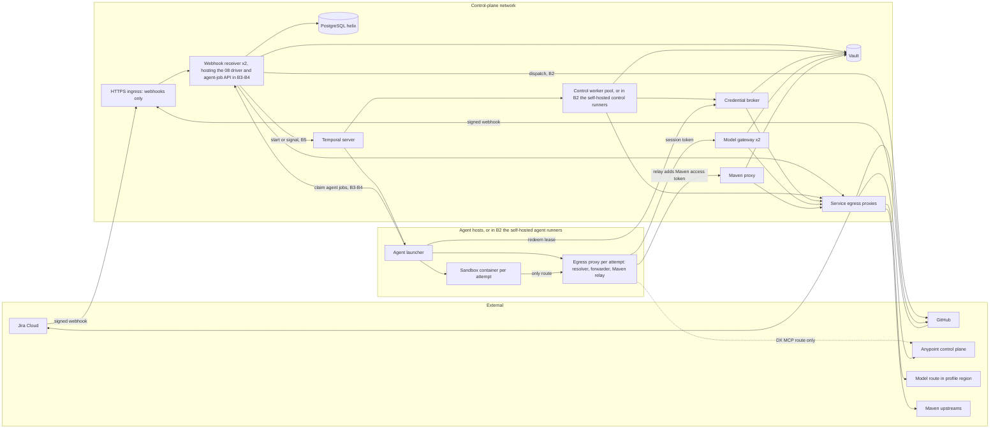
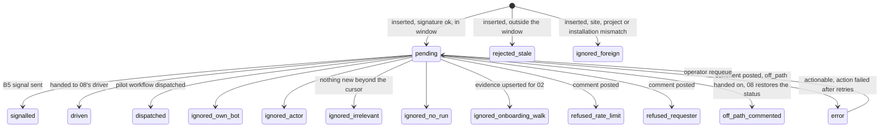
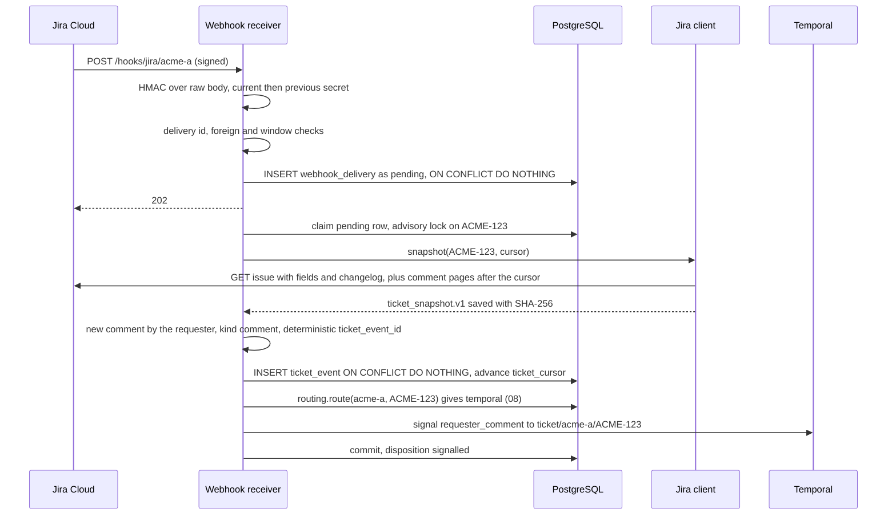
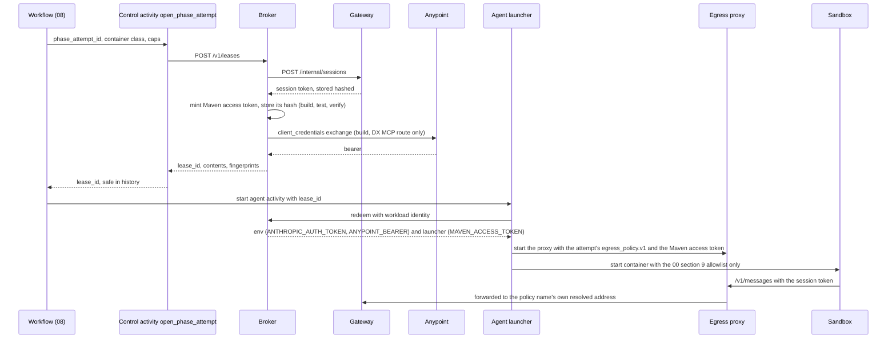
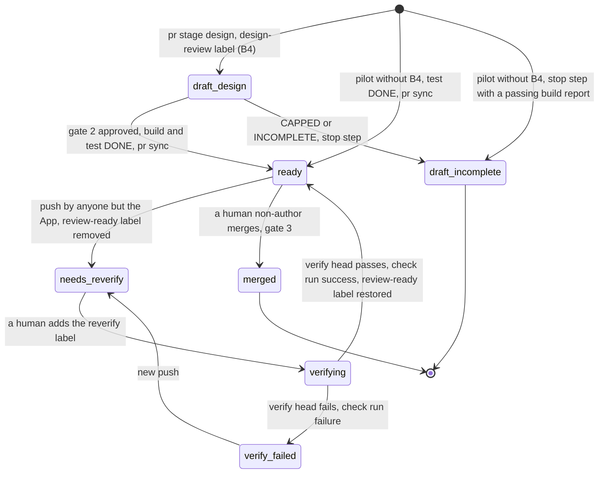

# 03 — Control plane

Binding conventions: `00-conventions.md` (tags, names, enums, CLI surface, `PhaseOutcome`, storage, credential model, sandbox environment allowlist). Nothing defined there is redefined here.

## 1. Purpose and scope

The control plane is every Helix process that holds a credential or writes outside an agent sandbox. That covers the webhook receiver, Jira client, credential broker, model gateway, Maven repository proxy, git writer and vault adapter, plus the egress proxy that enforces the egress allowlist on every container and service, and its policy schema `egress_policy.v1` `[HLD-P#6]` `[HLD-P#14]`. For each one, this file gives its process boundary, API, data, failure modes, tenancy and deployment. It covers the B2 pilot (file 01's GitHub Action on self-hosted runners, plus an always-on service host), B3–B4 (file 08's driver inside this file's service) and B5 (Temporal).

Sub-phases:

- The gateway, broker, Maven proxy, git writer, vault adapter and egress proxy land in **B2**, before the first real ticket `[HLD-P#1]` `[HLD-P#2]` `[HLD-P#4]` `[HLD-P#5]` `[HLD-P#14]`.
- The webhook receiver and Jira client are minimal in B2 and complete in **B3** `[HLD-P#12]`.
- In B2 the receiver dispatches the pilot. From **B3** it asks file 08's `routing.route` per ticket, and hands each event to the pilot, to file 08's driver or, from **B5**, to Temporal (08 §3.16).

Other files own the rest:

| File | Owns |
| --- | --- |
| 01 | `helix run`, the B2 pilot workflow, its jobs and runners, and the Meridian child environment (`meridian_bridge`, 01 §3.5.2) |
| 02 | Profile schema (every key this file reads), the secret names it derives, and the doctor |
| 04 | Phase envelope and runner |
| 05 | Discover, intake and the ledger |
| 06 | Design |
| 07 | Build, test, PR contents, and what each PR label means |
| 08 | Workflow, driver, `routing.route`, agent jobs, `ticket_run`, gates, gate digests and `ticket_signal.v1` |
| 09 | Audit, meter schema, pricing, cap arithmetic and kill switch |
| 10 | Container hardening, the injection corpus, the per-hop residency analysis, and what each egress class must reach (10 §3.4, §3.5) |

## 2. Traceability

| Source | Requirement | Section |
| --- | --- | --- |
| Plan §0 rule 2 | Untrusted text never meets a credential. The control plane posts, exchanges and hands out one short-lived credential per phase | 3.1, 3.6 |
| Plan §3.2 | The git writer opens the PR from a bot identity behind branch protection, then posts the link. Measurement goes in ticket fields | 3.9, 3.5.7 |
| Plan §3.3 | Inbound webhooks are HMAC-signed. The bot ignores itself. The budget is 65,000 points/hour. The ticket is read once per wake | 3.4, 3.5.3 |
| Plan §3.5 | One signal per gate. The Nexus credential stays out of the agent. The outbound allowlist is tested with an EU-pinned run. The cap holds | 3.4.6, 3.8, 3.10, 3.7.5 |
| Plan §4 decisions 1, 3, 10, 11 | Model route per client. Vault and connected app per client. Posts go only to the requester. Dollar caps | 3.7, 3.3, 3.5.5, 3.7.5 |
| HLD-P#1, #2, #4, #5, #6 | Credential split and DX MCP bearer; model gateway; pilot isolation; Maven proxy; control-plane component and one vault | 3.6, 3.7, 3.2, 3.8, 3.1–3.3 |
| HLD-P#7, #8, #10, #11, #12, #13, #14, #15, #16, #17, #18 | Approver ids and draft PR at B4; required check on the head commit; apps per activity; repositories and runners; state roles, the minimal service from B3 and off-path moves; tenancy; per-hop residency; per-call cap and intake rate limit; approvals only by transition; INCOMPLETE draft PR; elapsed vs active minutes | 3.4.5–3.4.6, 3.9, 3.6, 3.2, 3.10, 3.7.5, 3.4.12, 3.5.7 |
| HLD lower bullets | Webhook hardening and the no-op rule; GitHub bot role and settings check; Jira `jira:` block; chain-head anchoring; Meridian surface | 3.4, 3.9.4, 3.11, 3.5.4, 3.6.4 |
| Review item 6 `[LLD]` | Question sets can leak estate text to external or email requesters. Fix: a requester audience and policy, Draft for external audiences, and a deny-list scan on every outbound comment | 3.5.5 |

## 3. Design

### 3.1 Services and process boundaries

| Service | Module (`src/helix/controlplane/`) | Process | Listens on | Holds (from the vault) | Calls out to | Stage | Tag |
| --- | --- | --- | --- | --- | --- | --- | --- |
| Webhook receiver | `webhook/` | `helix webhook serve` | `/hooks/*` through the HTTPS ingress | Webhook HMAC secrets. Jira token and GitHub App key, used through the libraries below for the GET after a wake, the label removal on a foreign push and, in B2, the pilot dispatch | Jira, GitHub, PostgreSQL; then the pilot dispatch, file 08's driver in-process, or Temporal, by 08's `routing.route` (3.4.11) | B2 minimal, B3 full | `[HLD-P#12]` |
| Jira client | `jira/` | Library inside the receiver and control worker | — | Jira bot API token | Jira Cloud | B2 posting, B3 full | `[PLAN]` |
| Credential broker | `broker/` | `helix broker serve` | Internal only: mTLS, and in B2 the pilot jobs' GitHub OIDC tokens (3.2.1) | Connected-app pairs, lease key | Anypoint token endpoint, gateway internal API, PostgreSQL | B2 | `[HLD-P#1]` |
| Model gateway | `gateway/` | `helix gateway serve` | Internal only; sandboxes reach `/v1/*` through their egress proxy | Model-route credential per client | Route endpoint in the profile's region, PostgreSQL | B2 | `[HLD-P#2]` |
| Maven proxy | `mavenproxy/` | `helix maven-proxy serve` | Internal only; sandboxes reach `/m2/*` through their egress proxy's relay | EE Nexus credential per client; the build app's Exchange bearer per client, in memory (3.6.1) | Allowlisted Maven upstreams, broker, PostgreSQL | B2 | `[HLD-P#5]` |
| Git writer | `gitwriter/` | Library inside the control worker (`helix pr`, posting the verify verdict) and the receiver (PR GET, label removal, B2 dispatch) | — | GitHub App private key per client | GitHub API | B2 | `[PLAN]` |
| Vault adapter | `vault/` | Library in every process above | — | Its own workload identity | Vault | B2 | `[HLD-P#6]` |
| Control worker | `orchestration/` (file 08) | `helix worker --class control`; in B2, file 01's control jobs; in B3–B4, file 08's driver steps | — | Through the libraries | — | B5; earlier forms in B2–B4 | `[HLD-P#6]` |
| Egress proxy | `containers/` plus the proxy image | One per agent attempt, and one per service network: resolver, forwarder and Maven relay (3.10) | — | Nothing from the vault. The attempt's Maven access token, from the lease, in memory (3.8) | Only the policy's hosts | B2 | `[HLD-P#14]` `[HLD-P#5]` |

Rules:

1. No control-plane process runs an Agent SDK session or agent-written code. Agent-written Maven builds run only in sandboxes, or in file 07's no-agent `verify --stage head` container on the agent queue, which holds no secret beyond its Maven access (07 §3.2). The control plane only posts that container's verdict (3.9.3) `[PLAN]` `[HLD-P#4]`.
2. From a sandbox, only two control-plane endpoints are reachable, both through the attempt's egress proxy (3.10): the gateway's `/v1/*`, and the Maven proxy's `/m2/*` through the proxy's relay (3.8). The broker is reachable only from the agent launcher, which runs outside the sandbox container (file 08; in B2, file 01's agent job) `[HLD-P#1]`.
3. Shared services import only `meridian.clientdata` from Meridian, through `meridian_bridge`. It is pure functions with no import-time tenant state (`meridian/clientdata.py` docstring). Credentialed Meridian CLIs run as child processes per activity, so one client's Meridian settings never live in a process that serves another client. This is the plan's B5 trap, held structurally `[PLAN]` `[LLD]`.
4. Shared services do not import `runlog.RunLog` themselves. `meridian/runlog.py` imports `meridian.settings` (for `RUN_LOG_DIR`) when it loads, and `settings.py` resolves the state directory and tenant profile from the environment at that moment. So shared services write store rows (`ticket_event`, `credential_lease`, `gateway_session`, `meter_event`), and the next control activity of that run chains them (09 §3.1; §6 item 16) `[LLD]`.

### 3.2 Deployment, runtimes by sub-phase, tenancy and availability



**Runtimes by sub-phase.** B2 is file 01's GitHub Action on self-hosted runners. Jira remains the human workflow surface; the pilot's `run_state.v1`, durable run artefacts, and control-plane store record execution state. From B3, file 08's `routing.route` decides per ticket (08 §3.16): a B2 ticket finishes on the pilot, and a new ticket runs under file 08's driver inside this file's service, HLD-P#12's minimal control-plane service, until the client's cutover to Temporal `[HLD-P#12]`. B5 is Temporal `[PLAN]`.

| Concern | B2 pilot (route `action`) | B3–B4 driver (route `controlplane`) | B5 (route `temporal`) | Tag |
| --- | --- | --- | --- | --- |
| Trigger | The receiver maps the move into `building` and calls `workflow_dispatch` on file 01's `helix-pilot.yml` in the pilot repository, through the App's installation token, with inputs `ticket_key`, `run_id` and `ticket_event_id` (01 §3.8) `[VERIFY]`. A human's `helix:reverify` label dispatches the same workflow with 07's re-verify step input (07 §3.8.7). There is no Jira Automation rule and no machine-user token | The receiver hands each mapped event, as `ticket_signal.v1`, to file 08's `driver.handle(signal)` in-process (08 §3.16) | The receiver signals `ticket/{client_id}/{ticket_key}`, or signals with start (08 §3.5, §3.8) `[VERIFY]` (Temporal Python client) | `[PLAN]` transition trigger, `[LLD]` mechanism (01), `[HLD-P#12]` driver |
| Control-plane work | File 01's `gate`, `control-pre` and `control-post` jobs, on self-hosted runners in the control-plane network (label `helix-{client_id}-control`), in the `helix-{client_id}` environment (01 §3.8) | File 08's driver runs the same control CLIs as subprocesses on the control-plane host | The control worker pool runs the same CLIs as activities | `[PLAN]` parity |
| Agent work | File 01's `agent` job, on a self-hosted runner in the sandbox network (label `helix-{client_id}-agent`), with no secret. Its launcher redeems each lease with the job's GitHub OIDC token `[VERIFY]` and starts one `worker-agent` container per attempt behind an egress proxy (3.10) | Never on the control-plane host. The driver queues an `agent_job`. The client's agent launcher, on the agent host, claims it through this service's agent-job API (below) and runs it as under Temporal (08 §3.16) | The agent launcher redeems with its mTLS identity and starts one container per activity | `[HLD-P#4]` `[HLD-P#1]` |
| Always-on services | One owner-run pilot host: receiver, gateway, broker, Maven proxy, PostgreSQL, vault and the self-hosted runners. Only the webhooks face the internet | The same host; the agent launcher on a separate agent host (08 §3.2) | The same services; stateless ones run 2 replicas | `[LLD]` |
| Execution state | Jira, plus 01's `run_state.v1`. Every dispatch starts a new Action run | One `ticket_run` row per run, owned by file 08 (08 §3.16) | Temporal history, projected to `ticket_run` | `[PLAN]` B2, `[HLD-P#12]` |
| Where the pilot workflow lives | The pilot repository, 02's `github.pilot.repository`, in the client's organisation (01 §3.8). Never the Helix repository, which holds `acme-*` fixtures only | — | — | `[HLD-P#11]` |
| Receiver mappings on | Deliveries are recorded (02's ONB-24 and ONB-26 read them). The receiver maps the move into `building`, a foreign push (label removal, 3.9.3) and the `helix:reverify` label | Everything in 3.4.6 | Everything in 3.4.6 | `[LLD]` |
| Cutover | — | Per client, by 08 §3.16. While `orchestration.driver` is `draining`, a ticket's deliveries stay `pending` in `webhook_delivery` until its row has migrated; they are then released in order of receipt | — | `[HLD-P#12]` |

**Agent-job API** `[HLD-P#12]`. In B3–B4 this service hosts file 08's agent-job endpoints (`POST /internal/agent-jobs/claim`, `/internal/agent-jobs/{attempt_id}/heartbeat` and `/internal/agent-jobs/{attempt_id}/result`) on the internal network, and runs file 08's reaper loop. Callers authenticate with their mTLS launcher identity, and every call is scoped to that launcher's client. Inputs, outputs and errors are 08's (08 §3.16).

**Runners** `[HLD-P#4]` `[HLD-P#14]`. File 01 §3.8 runs every pilot job on self-hosted ephemeral runners that the owner operates in the client's region, and this file follows it. There are two reasons. An egress allowlist cannot be enforced on a runner the owner does not control. And a GitHub-hosted runner sits outside the residency guarantee (10 §3.4, hop `actions_runner`). So in B2, as later, only the webhook paths face the internet (3.2.1). GitHub-hosted runners remain an owner option, and 3.2.1 lists what they would expose (§6 item 12).

#### 3.2.1 Exposure

| Endpoint | Exposed | Caller | Authentication | Tag |
| --- | --- | --- | --- | --- |
| `POST /hooks/{jira,github}/{client_id}`, `GET /healthz` | Always, through the HTTPS ingress | Jira, GitHub | Per-client HMAC (3.4.2). Source restricted to Atlassian's and GitHub's published ranges where the ingress supports it `[VERIFY]` | `[HLD lower: webhook]` |
| Broker `POST /v1/attempts`, `POST /v1/leases`, `POST /v1/leases/{id}/revoke`, `/v1/runs/{run_id}/pre-digest` | Internal network only | File 08's `open_phase_attempt` and `close_phase_attempt`; in B2, file 01's `control-pre` and `control-post` jobs, and the `agent` job's launcher for a later attempt's id and lease (3.6.2) | mTLS. In B2, the job's GitHub OIDC token: audience `helix-broker`, `repository` = `github.pilot.repository`, `environment` = `helix-{client_id}` `[VERIFY]` (claim names). The `agent` job has no environment; its token is accepted only under 3.6.2's just-in-time rule | `[HLD-P#1]` `[LLD]` |
| Broker `POST /v1/leases/{id}/redeem` | Internal | The agent launcher; in B2, the launcher in file 01's `agent` job | mTLS launcher identity. In B2, the job's OIDC token, whose `repository`, run id (`gh_run_id`) and job must equal the lease's `redeemer` (3.6.2) | `[HLD-P#1]` |
| Gateway `/v1/messages`, `/v1/messages/count_tokens`, `/v1/helix/session` | Internal; reached only through an attempt's egress proxy | The sandbox | Gateway session token (3.7.2) | `[HLD-P#2]` |
| Maven proxy `GET` and `HEAD /m2/{client_id}/…` | Internal; reached only through the egress proxy's Maven relay | The relay; `HEAD` also from the doctor (3.8) | Per-attempt Maven access token, or mTLS for the doctor's `HEAD` (3.8) | `[HLD-P#5]` |
| Vault login and each role's KV paths | Internal | Control-plane services; in B2, file 01's control jobs | Workload identity. In B2, GitHub OIDC JWT auth bound to the pilot repository and the `helix-{client_id}` environment `[VERIFY]` | `[HLD-P#6]` |
| Agent-job API; broker `/v1/meridian-env`, `/v1/bearer` and `/v1/doctor/anypoint`; gateway `/internal/*`; PostgreSQL; Temporal | Internal | Control-plane callers and agent launchers | mTLS | `[LLD]` |

**If the owner picks GitHub-hosted runners** (§6 item 12), the launcher and the sandbox run on GitHub's VMs. Then these paths must also face the internet, each with the authentication above: the broker's attempt, lease, redeem, revoke and pre-digest paths; the vault login and the `control` role's KV paths; the gateway's three `/v1/` paths; and the Maven proxy's `/m2/` path. Everything in the last row stays internal, and the egress proxy runs on the runner VM, outside any network the owner controls `[LLD]`.

**Store roles** `[HLD-P#12]`:

| Store | Holds |
| --- | --- |
| Jira | Human-visible state and gate decisions. In B2, also the only execution state `[PLAN]` |
| Ledger (05) | Facts |
| `ticket_run` (08) | Execution state under the driver (B3–B4); a projection of Temporal in B5 |
| Temporal | Execution (B5) |
| Chain (09) | The audit record |
| PostgreSQL tables owned here | Delivery, event, cursor, sweep, rate-limit, hold, budget, session, lease, attempt-number, `run-pre` digest and Maven-access bookkeeping. Never execution state |

**Tenancy: shared services with per-client scopes** `[HLD-P#6]` `[HLD-P#13]`:

| Resource | Scope | Mechanism | Tag |
| --- | --- | --- | --- |
| Service processes | Shared | Every request resolves a `ClientContext` (client id, profile, vault scope, DB session with `helix.client_id` set). No module-level client state | `[LLD]` |
| Secrets | Per client | Vault path `helix/{client_id}/…` and per-service policy (3.3) | `[HLD-P#6]` |
| Webhook endpoint and secret | Per client | `/hooks/{source}/{client_id}` (02's `jira.webhook.receiver_url`) plus that client's secret | `[HLD lower: webhook]` |
| GitHub App | Per client: its own key, webhook secret and installation | Onboarding (02) | `[LLD]` |
| Connected apps | Per client per Anypoint-using activity | 3.6.1 | `[HLD-P#10]` |
| PostgreSQL rows | Per client | Row-level security on every table here. Each transaction runs `SET LOCAL helix.client_id`. Services connect as a non-owner role, because table owners bypass RLS unless it is forced `[VERIFY]` | 00 §7 |
| Gateway sessions and spend | Per phase attempt; ceilings per client (09) | 3.7 | `[HLD-P#15]` |
| Maven caches | Public upstreams shared (public bytes). EE and Exchange per client | 3.8 | `[HLD-P#13]` |
| Egress policy | One `egress_policy.v1` per container per attempt, and per service class; the schema and enforcement are here, what each class must reach is file 10's | 3.10 | `[HLD-P#14]` |
| Temporal namespace or task queue | Per client | File 08 | `[HLD-P#13]` |
| Meridian state directory | Per client; control plane only; never mounted in a sandbox. A credentialed Meridian CLI gets a scratch home per call (01 §3.5.2) | 3.6.4 | `[PLAN]` path, `[LLD]` mount and home rules |

**Availability.** The plan sets no availability target. The design relies on durable execution state (Jira in B2, `ticket_run` in B3–B4, Temporal in B5) and on the sweep (3.4.9) recovering lost wakes `[LLD]`.

| Component | Replicas | Outage effect | Tag |
| --- | --- | --- | --- |
| Receiver | 2, stateless | Jira retries `[VERIFY]`, then the sweep catches up from its high-water mark. Deterministic event ids make a double delivery harmless | `[LLD]` |
| Gateway | 2 | Balances live in file 09's `meter_balance` rows, locked per call (09 §3.11). Running phases fail after SDK retries `[VERIFY]`. Never fails open | `[LLD]` |
| Broker | 1–2 | New attempts cannot start. Running ones continue | `[LLD]` |
| Maven proxy | 1, with disk cache | Builds cannot resolve. File 07 classifies "proxy unreachable" as INCOMPLETE, not a red build, so the retry budget is not spent | `[LLD]` |
| PostgreSQL | One primary with backups (HLD-P#19, file 08) | Every service fails closed | `[LLD]` |
| Vault | — | Services use values cached for at most 5 minutes, then fail closed | `[LLD]` |
| Pilot host | Single host: an accepted single point of failure for the pilot | — | `[LLD]` |

### 3.3 Vault adapter

**One definition** `[HLD-P#6]`. The vault is a per-client-scoped secret store. Control-plane processes read it, and only through `controlplane/vault`. It stores secrets and returns them to the one service that uses them. It never rewrites outbound requests. Credential injection is explicit, in the model gateway and the Maven proxy. This replaces both of the plan's definitions: the outbound-substitution store of §0 and the "CI secret store's per-client scope" of B1.

**Backend.** A KV version 2 store with a HashiCorp-Vault-compatible API (OpenBao or Vault; product choice `[VERIFY]`), with mount `helix/`. Each client's secrets live under `helix/{client_id}/`, at the fixed names below. The pilot and B5 use the same backend, so "vault" means one thing in both `[LLD]`.

**Workload identity.** In B5, each service logs in with its platform workload identity. In the pilot, host services use AppRole, and file 01's control jobs use GitHub OIDC JWT auth, bound to the pilot repository and the `helix-{client_id}` environment (3.2.1). Both methods are `[VERIFY]` `[LLD]`.

**Catalogue** `[HLD-P#6]` `[HLD-P#13]`. The profile names no vault path: 02's loader refuses any `*_ref` key and any `vault://` value (02 L8). The names are fixed here, and 02's `Profile.secret_names()` derives which ones a client needs (02 §3.4, *Secrets*). So one client's profile cannot point at another client's secret. Each role may read only its rows:

| Name, under `helix/{client_id}/` | Needed when (02 §3.4) | Read by role | Used by | Tag |
| --- | --- | --- | --- | --- |
| `jira/bot_token` | Always | `receiver`, `control` | Jira client | `[PLAN]` |
| `github/app_private_key` | Always | `receiver`, `control` | Git writer | `[LLD]` |
| `webhook/jira_hmac`, `webhook/github_hmac` | Always | `receiver` | Webhook receiver | `[HLD lower: webhook]` |
| `anypoint/{app}/client_id`, `anypoint/{app}/client_secret`, for `app` in `discover`, `design`, `build` | Always | `broker` | Credential broker | `[HLD-P#10]` |
| `model_route/credential` | Always | `gateway` | Model gateway | `[HLD-P#2]` |
| `maven/nexus_ee` | Always | `mavenproxy` | Maven proxy | `[HLD-P#5]` |
| `munit/license_lic` | `anypoint.license_lic.needed: yes` | `control` (02 §3.11) | The `verify` container's MUnit runtime. How it reaches that container is open (§6 item 15) | `[PLAN]` question, `[LLD]` placement |

A webhook secret entry holds two keys, `current` and `previous`, for rotation `[LLD]`.

**Owner-level secret.** `helix/_system/lease_key` is the AES-256-GCM key for leases (3.6.2). It sits outside every client scope and only the `broker` role may read it. `_system` cannot collide with a client scope, because `_` is outside 00 §6's `client_id` pattern `[LLD]`.

The deny-list is not a vault secret. It is the profile's `denylist.txt`, at its fixed path (02 §3.2, §3.4), read by 3.5.5.

**Interface** (Python, in prose):

- `VaultAdapter.for_client(client_id, role) -> ClientVault` binds a client and the calling service's role.
- `ClientVault.read(name) -> Secret` takes a catalogue name, for example `jira/bot_token`. It returns a masked value with a single `reveal()` call site.
- `ClientVault.metadata(name) -> SecretMeta(version, created_at, updated_at, expires_at)` reads KV metadata only, never the value (field names `[VERIFY]`). KV version 2 has no expiry field, so `expires_at` is the custom-metadata key `expires_on` that the RUNBOOK's rotation step sets `[VERIFY]` (custom metadata), and null when it is absent. File 02's doctor uses it (ONB-09; ONB-19 compares it with 02's `anypoint.connected_apps.*.secret_expires_on`), under a `doctor` role that may call `metadata` for every name in the catalogue and never `read` (02 §3.11).
- `VaultAdapter.system_read(name) -> Secret` reads `helix/_system/{name}`. Only the `broker` role may call it, and every call is audited (09).
- The adapter has no write or list API. Rotation is a RUNBOOK procedure. The vault-side policy per (client, role) is generated at onboarding from `Profile.secret_names()` and the table above, so the vault refuses what the adapter would refuse `[LLD]`.

Errors are `VaultNotFound`, `VaultForbidden`, `VaultUnavailable` and `CrossClientRef`. `VaultForbidden`: the name is not in one of the role's rows above, the `doctor` role called `read`, or a non-broker role called `system_read`. `CrossClientRef`: the name would leave the bound client's scope, because it contains `..`, starts with `/` or `_system/`, or starts with `deploy/` (file 11's scope, 11 §3.1).

Values are cached in process memory for at most 5 minutes per (client, name) `[LLD]`. When the vault is unreachable and the cached value is older than that, the read raises `VaultUnavailable`: fail closed. Values are never written to disk, Temporal payloads or logs, and each value is registered with the process log-masking filter (09).

### 3.4 Webhook receiver

#### 3.4.1 Endpoints and exposure

| Method and path | Source | Authentication | Responses |
| --- | --- | --- | --- |
| `POST /hooks/jira/{client_id}` | The client's Jira webhook. Its URL is 02's `jira.webhook.receiver_url`, whose path ends in `/hooks/jira/{client_id}` (02 ONB-26) | HMAC with that client's `webhook/jira_hmac` | 202 accepted or ignored; 400 JSON does not parse; 401 bad signature; 404 unknown client; 413 body over 1 MiB `[LLD]`; 415 not JSON; 503 store down |
| `POST /hooks/github/{client_id}` | The client's GitHub App webhook (07 §3.8.7) | HMAC with that client's `webhook/github_hmac` | Same as above |
| `GET /healthz` | Ingress | None | 200 |

Exposure is a single HTTPS ingress, and TLS terminates there. Only `/hooks/*` and `/healthz` are routed (3.2.1). No `/internal/*` path is ever exposed. Where the ingress supports it, the webhook source is restricted to Atlassian's and GitHub's published egress ranges `[VERIFY]` `[HLD lower: webhook]`.

#### 3.4.2 Verification pipeline

Steps run in order, and the first failure ends the request `[HLD lower: webhook]`. The row is written once, in step 6, with its disposition already decided.

| # | Check | Failing case | Row written? |
| --- | --- | --- | --- |
| 1 | `client_id` resolves to a loaded profile with Jira or GitHub enabled. Checked before any signature work | 404, plus a counter | No |
| 2 | Size and content type | 413 or 415 | No |
| 3 | Signature check. Jira: header `X-Hub-Signature` = `sha256=<hex>` `[VERIFY]`. GitHub: `X-Hub-Signature-256` `[VERIFY]`. Both are HMAC-SHA256 over the raw body bytes, tried with the `current` secret and then `previous` (rotation), using a constant-time compare | 401; the log records only the body's SHA-256 | **No.** A forged request must never occupy a dedup key that a real delivery would later need |
| 4 | Parse JSON, then compute the delivery id. Jira: `X-Atlassian-Webhook-Identifier` `[VERIFY]`. GitHub: `X-GitHub-Delivery` `[VERIFY]`. If absent: `sha256:` plus the body digest | 400 | No |
| 5 | Decide the disposition, writing nothing. The site and project (Jira) or installation id (GitHub) must equal the profile's, else `ignored_foreign`. The Jira payload `timestamp` (epoch ms, inside the signed body `[VERIFY]`) must be within ±10 minutes of receipt `[LLD]`, else `rejected_stale`. Otherwise `pending`. GitHub sends no signed timestamp `[VERIFY]`, so dedup alone covers it | — | — |
| 6 | One `INSERT … ON CONFLICT DO NOTHING` into `webhook_delivery`, carrying step 5's disposition | Conflict: 202 `duplicate`, and the existing row is untouched | Yes, in one atomic insert |
| 7 | Respond 202. The processor (3.4.4) takes only `pending` rows. The sweep (3.4.9) later catches a stale delivery's change | — | — |

Ignored and stale events still get a 2xx. The payload's only power is to wake the receiver, and a retry of an ignored event only spends Jira points.

#### 3.4.3 Tables: `webhook_delivery` (owner: this file, per 00 §8), `ticket_cursor`, `sweep_mark`

```sql
CREATE TABLE webhook_delivery (
  client_id        text        NOT NULL CHECK (client_id ~ '^[a-z0-9-]{2,32}$'),
  source           text        NOT NULL CHECK (source IN ('jira','github')),
  source_kind      text        NOT NULL CHECK (source_kind IN ('webhook','sweep')),
  delivery_id      text        NOT NULL CHECK (length(delivery_id) <= 200),
  received_at      timestamptz NOT NULL DEFAULT now(),
  body_sha256      char(64)    NULL,          -- webhook rows only
  secret_slot      text        NULL CHECK (secret_slot IN ('current','previous')),   -- webhook rows only
  event_type       text        NULL,          -- from the verified body, e.g. comment_created
  event_ts         timestamptz NULL,          -- Jira payload timestamp
  ticket_key       text        NULL CHECK (ticket_key ~ '^[A-Z][A-Z0-9]+-[0-9]+$'),
  pr_ref           text        NULL,          -- owner/repo#number for GitHub
  comment_id       text        NULL,          -- hint only
  actor_hint       text        NULL,          -- payload actor id; never trusted (3.4.4)
  disposition      text        NOT NULL CHECK (disposition IN (
                     'pending','signalled','driven','dispatched','ignored_own_bot','ignored_actor',
                     'ignored_irrelevant','ignored_foreign','ignored_no_run','ignored_onboarding_walk',
                     'rejected_stale','refused_rate_limit','refused_requester','off_path_commented','error')),
  ticket_event_ids uuid[]      NOT NULL DEFAULT '{}',   -- every event this wake mapped (3.4.4)
  attempts         smallint    NOT NULL DEFAULT 0,
  processed_at     timestamptz NULL,
  error            text        NULL CHECK (length(error) <= 500),   -- class and message, no payload text
  PRIMARY KEY (client_id, source, delivery_id),
  CHECK ((source_kind = 'webhook' AND body_sha256 IS NOT NULL AND secret_slot IS NOT NULL)
      OR (source_kind = 'sweep' AND source = 'jira' AND body_sha256 IS NULL
          AND secret_slot IS NULL AND delivery_id LIKE 'sweep:%'))
);
CREATE INDEX webhook_delivery_pending ON webhook_delivery (client_id, received_at)
  WHERE disposition = 'pending';
ALTER TABLE webhook_delivery ENABLE ROW LEVEL SECURITY;
CREATE POLICY per_client ON webhook_delivery
  USING (client_id = current_setting('helix.client_id'))
  WITH CHECK (client_id = current_setting('helix.client_id'));
```

The raw body is not stored, because it is untrusted text `[LLD]`. Rows are kept for 30 days `[LLD]`, which is the dedup horizon; it must exceed Jira's retry period `[VERIFY]`. Example rows: a webhook `('acme-a','jira','webhook','6f0c…e1', …, '5b10ac…','current','comment_created', …,'ACME-123', NULL,'10442','acme-a-user-0002','signalled', '{8d3e…}', 1, …, NULL)`, and a sweep wake `('acme-a','jira','sweep','sweep:ACME-123:2026-10-08T10:31:00Z', …, NULL, NULL, NULL, NULL,'ACME-123', NULL, NULL, NULL,'pending', '{}', 0, NULL, NULL)`.

**`ticket_cursor`**: per ticket, what has already been mapped `[LLD]`. One row per ticket, written in the same transaction as the events it covers (3.4.4 step 4).

```sql
CREATE TABLE ticket_cursor (
  client_id           text        NOT NULL CHECK (client_id ~ '^[a-z0-9-]{2,32}$'),
  ticket_key          text        NOT NULL CHECK (ticket_key ~ '^[A-Z][A-Z0-9]+-[0-9]+$'),
  comment_wm_updated  timestamptz NULL,       -- updated time of the newest mapped comment
  comment_wm_id       text        NULL,       -- its id; ties on updated break by id
  last_history_id     bigint      NULL,       -- newest mapped changelog history id [VERIFY] numeric
  issue_updated       timestamptz NULL,       -- the issue's updated time at the last snapshot
  snapshot_seq        integer     NOT NULL DEFAULT 0 CHECK (snapshot_seq >= 0),
  reporter_audience   text        NULL CHECK (reporter_audience IN ('internal','external')),   -- set once, at creation (3.5.5)
  reporter_origin     text        NULL CHECK (reporter_origin IN ('jira','email')),
  updated_at          timestamptz NOT NULL DEFAULT now(),
  PRIMARY KEY (client_id, ticket_key)
);
```

Example: `('acme-a','ACME-123','2026-10-08T10:02:05Z','10442',10931,'2026-10-08T10:02:11Z',4,'internal','jira', …)`. A comment is new or edited when its (`updated`, `id`) sorts after (`comment_wm_updated`, `comment_wm_id`). A changelog entry is new when its history id is above `last_history_id`. Items of the bot's own move the cursor without producing an event.

**`sweep_mark`**: the per-client high-water mark of 3.4.9 `[LLD]`.

```sql
CREATE TABLE sweep_mark (
  client_id           text        PRIMARY KEY CHECK (client_id ~ '^[a-z0-9-]{2,32}$'),
  last_ok_started_at  timestamptz NOT NULL,   -- start time of the last sweep that completed
  last_run_at         timestamptz NULL,
  last_error          text        NULL CHECK (length(last_error) <= 500)
);
```

Example: `('acme-a','2026-10-08T10:30:00Z','2026-10-08T10:40:00Z',NULL)`.

The same RLS policy, and the same `helix.client_id` setting, applies to every table this file defines: `ticket_event`, `ticket_cursor`, `sweep_mark`, `intake_counter`, `outbound_hold`, `jira_budget`, `credential_lease`, `gateway_session` and `maven_access` `[LLD]`. The gateway must find a session's client from its token hash before it knows the client. It does so through one `SECURITY DEFINER` function that returns only `client_id` for a hash; every later statement runs under RLS with that client set `[LLD]`.

#### 3.4.4 Wake, then GET

Only these are taken from a verified payload: the event type; the timestamp, site, project or installation id that 3.4.2 step 5 checks; the issue key (or repository and PR number); the comment id; and the actor id. The last two are *hints* only. Status, comment body, author, transition and field values all come from the GET (3.5.1) `[HLD lower: webhook]` `[PLAN]`.

The processor claims `pending` rows per client with `FOR UPDATE SKIP LOCKED`, under a PostgreSQL advisory lock on (client, ticket). Events of one ticket are therefore mapped in order of receipt `[LLD]`. A wake is a reason to look, not the event itself: each wake maps everything new since the ticket's cursor, whichever delivery woke it. Steps:

1. **Read.** Jira: `JiraClient.snapshot(ticket_key, cursor)` makes the wake's one issue GET, plus the comment pages after the cursor, and writes `ticket_snapshot.v1` (3.5.2). A 404 on a `jira:issue_deleted` wake maps `deleted` with no snapshot (3.4.7). A 404 on any other wake sets the row to `error`, with an alarm. GitHub: resolve the PR to its ticket (3.4.6), then `gitwriter.get_pr(repo, number)` writes `pr_snapshot.v1` (3.4.7).
   **Onboarding walk** (02 §3.8 D). When the issue carries `jira.onboarding_walk_label` or its key is `jira.onboarding_issue_key`, nothing is mapped and no run starts. The delivery is `ignored_onboarding_walk`, and its event type is upserted into 02's `onboarding_evidence` table, which ONB-26 reads `[LLD]`.
2. **Find what is new** against `ticket_cursor` (3.4.3): the creation, when the ticket has no `created` event yet; comments after the comment watermark; and changelog entries above `last_history_id`. For GitHub, the PR's state against the delivery's action.
3. **Classify** each actor from the snapshot, never from the payload (3.4.5), and **map** each new item (3.4.6) to a `ticket_event.v1` whose `ticket_event_id` is deterministic (3.4.7).
4. **Record and hand on**, in one transaction, in order of `occurred_at`: `INSERT … ON CONFLICT (ticket_event_id) DO NOTHING` for each event. Only a newly inserted event is handed on, by the route 3.4.11 gives the ticket: as a pilot dispatch (`action`), to `driver.handle` (`controlplane`), or as a signal (`temporal`). Then advance `ticket_cursor`, and set the delivery's disposition and `ticket_event_ids`.

A wake that finds nothing new beyond the cursor is `ignored_irrelevant`. That is how Jira's separate comment and issue-updated deliveries for one comment, or a sweep wake and the real delivery, yield one event. A failure before step 4 commits leaves the row `pending`; the retry computes the same `ticket_event_id` values. If the hand-on succeeded and the commit then failed, the retry hands the same ids on again, and file 08 drops them by `source_event_id` (3.4.6). An `off_path` event's own outcome is `off_path_commented`, although its signal is also handed on, because a comment was posted. When one wake maps several events, the delivery's disposition is the strongest of their outcomes, in this order: `error`, then `signalled`, `driven` or `dispatched`, then `refused_*` and `off_path_commented`, then `ignored_*` `[LLD]`.

#### 3.4.5 Actor classes

The account id comes from the GET result, never from the payload `[HLD lower: webhook]` `[HLD-P#16]`.

| Class | Rule | Effect | Tag |
| --- | --- | --- | --- |
| `own_bot` | Equals `jira.bot.account_id`, or the GitHub actor's numeric id equals `github.bot_user_id` (02) | Ignored | `[PLAN]` |
| `requester` | The ticket's reporter, accepted under `jira.requester_policy` at creation (3.5.5), and the people in `jira.extra_answerers` (02; 05 §3.5) | Comment wakes allowed | `[HLD lower: webhook]` |
| `gate_owner` | A person in `gates.{gate}.approvers` (02), matched by `people.{key}.jira_account_id` or `.github_login`, or in `gates.draft_reviewers` (02) | Comment wakes allowed | `[HLD lower: webhook]` `[HLD-P#7]` |
| `automation` | A Jira app or automation account (`accountType` other than a person `[VERIFY]`) | Ignored, which breaks bot–automation loops | `[HLD lower: webhook]` |
| `other_human` | Anyone else | Comment recorded as `ignored_actor`; no signal | `[HLD lower: webhook]` |
| `unknown` | No actor can be read. Only a deleted issue (3.4.7) | — | `[LLD]` |
| `operator` | The login behind file 08's `helix orchestration cancel` (08 §3.8). Never read from Jira or GitHub | Only `operator_cancel` events | `[LLD]` (08) |

An approval is only ever a transition, checked by account id from the changelog. It is never comment text and never a payload field. The receiver passes the changelog actor on unchanged. File 08's `verify_gate_decision` decides whether that actor may sign the gate, and records and posts a refusal (08 §3.9). No other approval channel exists `[HLD-P#16]`.

#### 3.4.6 Mapping to `ticket_event.v1` and file 08's signals

Every event goes to file 08 as one `ticket_signal.v1` (08 §3.8), the only signal contract. 08 has adopted this file's `draft_release`, `pr_closed`, `pr_pushed` and `pr_reverify`, and asked for the `off_path` signal and the `cancel` field `reason`, which this table fills. *Any human* excludes `own_bot` and `automation`, which are ignored (3.4.5). The receiver never moves the ticket: where a move is refused or off the path, file 08 restores the expected status through this file's `transition` (08 §3.10) `[LLD]`.

| Observed in the GET | Actor | `kind` | File 08 signal or action | Tag |
| --- | --- | --- | --- | --- |
| Issue created in `jira.project_key` with a type in `jira.issue_types` | Reporter accepted (3.5.5) and under the intake rate limit (3.4.12) | `created` | Start the run on the route 3.4.11 gives: `ticket_workflow_input.v1` with `reason: created` (08 §3.5) under Temporal; `driver.handle` under the driver | `[LLD]` |
| Same | Reporter refused under `jira.requester_policy: internal_only` | `created` | None. Post `requester_refused`; disposition `refused_requester` | `[LLD]` review item 6 |
| Same | Over the intake rate limit | `created` | None. Post `rate_limited`; disposition `refused_rate_limit` | `[HLD-P#15]` |
| Comment added or edited | `requester` or `gate_owner` | `comment` / `comment_edited` | `requester_comment`, with `comment_id` | `[HLD lower: webhook]` |
| Comment added or edited | `own_bot` | `comment` | None (`ignored_own_bot`) | `[PLAN]` |
| Comment added or edited | `automation`, `other_human` | `comment` | None (`ignored_actor`) | `[HLD lower: webhook]` |
| Summary or description edited | `requester` or `gate_owner` | `description_edited` | `requester_comment` with `comment_id` null: treated as a requester comment (08 §3.10) | `[LLD]` |
| Any other field change | — | `field_changed` | None (`ignored_irrelevant`) | `[LLD]` |
| Status change matching one of the gate's approve or reject transitions (below) | Any human | `gate_transition` | `gate1_requirement` or `gate2_design`, with `decision` and `transition_id`. On a reject, `comment_id` is the rejection reason: the same actor's newest comment that is new in this snapshot, else null, and 08 then asks for it (08 §3.9.3). Whether the actor may sign is 08's check. On a refusal 08 posts `gate_actor_refused` and restores the review status (08 §3.9.3, §3.10) | `[PLAN]` one signal per gate |
| `draft` → any state | Any human | `draft_release` | `draft_release`. 08's `release_draft` calls 3.5.5, which accepts it from a draft reviewer or refuses it | `[LLD]` (3.5.5) |
| To `cancelled`, or to `done` before merge | Any human | `closed` | `cancel` with `reason: closed` | `[HLD-P#12]` |
| To `new`, from any state | Any human | `reopened` | `reopen`, by signal-with-start when the run has ended (08 §3.10) | `[HLD-P#12]` |
| Any other status change | Any human | `off_path` | `off_path`. The receiver posts `off_path_ignored`, naming what the run waits for (08's `status().waiting_for`, or `ticket_run.waiting_for` under the driver). File 08 restores `expected_status` (08 §3.10) | `[HLD-P#12]` rule, 08's restore |
| Issue deleted (GET 404 on a `jira:issue_deleted` wake) | `unknown` | `deleted` | `cancel` with `reason: deleted` | `[LLD]`, 08 §3.10 |
| Any event on the onboarding walk issue (3.4.4 step 1) | — | None | None (`ignored_onboarding_walk`); evidence upserted for 02 | `[LLD]` (02 §3.8) |
| `helix orchestration cancel` (08 §3.8), written by 08's command, not by a delivery | Operator | `operator_cancel` | `cancel` with `reason: kill_switch`, `source: operator` | `[LLD]` (08) |
| PR merged, merger not the App | — | `pr_merged` | `gate3_merge`, with `pr_number` and `head_sha` = the merged head. 08's verification runs the settings check (3.9.4; 08 §3.9.3, `repo_settings_changed`) | `[PLAN]` gate 3 |
| PR closed, not merged | — | `pr_closed` | `pr_closed` (08 §3.8) | `[LLD]` |
| PR head moved by anyone but the App | — | `pr_pushed` | `pr_pushed`. The receiver first calls `gitwriter.on_foreign_push` (3.9.2), which removes `helix:review-ready` (07 §3.8.7). The new head has no `helix/verify` check run, so the required check blocks the merge until re-verified | `[HLD-P#8]` |
| Label `helix:reverify` added by anyone but the App | — | `pr_reverify` | `pr_reverify`. 08 runs `verify --stage head` on the agent queue, and the control plane posts the verdict (3.9.3). On the B2 route, the receiver dispatches the pilot with 07's re-verify step input instead (07 §3.8.7) | `[HLD-P#8]` |
| PR review submitted | — | `pr_review` | None (`ignored_irrelevant`). 07's `record-merge` reads the reviews at merge (07 §3.9) | `[LLD]` |

**Which transitions count for a gate.** 02's `jira.gates.{gate}.approve_transitions` and `.reject_transitions`, each a list of `{transition_id, to_state}` whose from-state is the gate's review state (02 §3.4; 08 §3.17). The receiver matches the changelog entry's transition id when Jira records one `[VERIFY]`; otherwise the review state as from-state and a listed `to_state`. 02's template carries these default pairs `[LLD]`:

| Gate | From | To | Decision |
| --- | --- | --- | --- |
| `gate1_requirement` | `requirement_review` | `building` | approve |
| `gate1_requirement` | `requirement_review` | `needs_info` | reject |
| `gate2_design` | `design_review` | `building` | approve |
| `gate2_design` | `design_review` | `requirement_review` | reject. The workflow re-runs intake with the reason, then design (08 §3.7) |

**How each `ticket_signal.v1` field is filled.** Signals carry ids and digests, never ticket text. The text reaches file 08's activities through the snapshot the event names (3.4.7), never through a second Jira read.

| Field (08 §3.8) | Filled from |
| --- | --- |
| `signal` | The table above |
| `client_id`, `ticket_key` | The event |
| `source` | `jira` or `github`; `sweep` for a sweep wake; `operator` for `operator_cancel` |
| `source_event_id` | The event's `ticket_event_id` (3.4.7), not the delivery id. One delivery can map several events, and a sweep and a webhook can map the same one (08 §3.8 dedupes on it) |
| `actor_id` | `jira:{accountId}` or `github:{user id}`, from the GET; `operator:{login}` for `operator_cancel` |
| `occurred_at` | From the GET: changelog `created`, comment `updated`, PR `merged_at` or `closed_at` |
| `decision`, `transition_id` | Gate signals only |
| `comment_id` | `requester_comment`, and the reason on a gate reject |
| `pr_number`, `head_sha` | PR signals |
| `reason` | `cancel` only: `closed` from kind `closed`, `deleted` from kind `deleted`, `kill_switch` from kind `operator_cancel` |

**GitHub PR to ticket** `[LLD]`. A PR maps to a ticket only when all four hold: (1) the delivery's installation id equals `github.app.installation_id`; (2) the repository is in `github.repositories[]`; (3) the PR's head branch is `helix/{ticket_key}` (00 §6) in the same repository, not a fork; (4) the PR's author login is `github.bot_login`. When a run exists, the PR number must also equal the run's recorded PR (08's `ticket_run`). Otherwise the delivery is `ignored_foreign`.

#### 3.4.7 `ticket_event.v1` (owner: this file, per 00 §8)

| Field | Type | Constraint |
| --- | --- | --- |
| `schema` | string | `"ticket_event.v1"` |
| `ticket_event_id` | uuid | Deterministic: UUID version 5, in a fixed the Helix namespace UUID held in code, over `{client_id}`, `{ticket_key}`, `{kind}` and `{discriminator}` joined by a vertical bar. Unique (primary key) |
| `client_id` | string | 00 §6 pattern |
| `source` | enum | `jira`, `github`, `operator` |
| `delivery_id` | string or null | ≤ 200 characters: the first delivery that mapped it; `sweep:{ticket_key}:{updated}` for sweep wakes. Null only for `operator_cancel` |
| `ticket_key` | string | 00 §6 pattern |
| `kind` | enum | The `kind` values in 3.4.6 |
| `actor_account_id` | string or null | Jira accountId, GitHub numeric id, or the operator's login for `operator_cancel`; file 08's `actor_id` is this with `jira:`, `github:` or `operator:` in front. Null only for `deleted` |
| `actor_class` | enum | 3.4.5 |
| `from_state`, `to_state` | logical state or null | 00 §6 |
| `gate` | gate key or null | 00 §6 |
| `decision` | `approve`, `reject`, or null | — |
| `transition_id` | string or null | When the changelog carries it `[VERIFY]` |
| `comment_id` | string or null | — |
| `pr` | object or null | `repo`, `number`, `head_sha` (40 hex), `merge_commit_sha` |
| `snapshot` | object or null | `kind` (`jira_issue` or `github_pr`), `path` (run directory), `sha256` (64 hex). Null only for `deleted`, where the GET returned 404, and for `operator_cancel` |
| `signal` | file 08 signal name or null | 3.4.6 |
| `disposition` | enum | As in `webhook_delivery` |
| `occurred_at`, `received_at`, `mapped_at` | RFC 3339 UTC | `occurred_at` comes from the GET result; for `deleted`, the delivery's verified `timestamp`; for `operator_cancel`, the command's time |

**Discriminators** `[LLD]`, so a sweep wake and a webhook for the same change compute the same id:

| `kind` | Discriminator |
| --- | --- |
| `created` | `created` |
| `comment`, `comment_edited` | `{comment_id}@{comment updated, RFC 3339}` |
| `gate_transition`, `draft_release`, `closed`, `reopened`, `off_path`, `description_edited`, `field_changed` | `h{changelog history id}`, plus `.{item index}` when one history entry holds several items |
| `deleted` | `deleted` |
| `operator_cancel` | `operator@{the command's time, RFC 3339}` |
| `pr_merged` | `{repo}#{number}@{merge_commit_sha}` |
| `pr_closed` | `{repo}#{number}@closed@{closed_at}` |
| `pr_pushed` | `{repo}#{number}@{head_sha}` |
| `pr_reverify` | `{repo}#{number}@{head_sha}@reverify`: one re-verification per head |
| `pr_review` | `{repo}#{number}@review@{review id}` |

```json
{"schema":"ticket_event.v1","ticket_event_id":"8d3e2a1c-4b7f-5e0a-9c55-2f1d6b0a7e31",
 "client_id":"acme-a","source":"jira","delivery_id":"6f0c9e1a-acme-fixture",
 "ticket_key":"ACME-123","kind":"gate_transition","actor_account_id":"acme-a-user-0001",
 "actor_class":"gate_owner","from_state":"requirement_review","to_state":"building",
 "gate":"gate1_requirement","decision":"approve","transition_id":null,"comment_id":null,"pr":null,
 "snapshot":{"kind":"jira_issue","path":"runs/ACME-123/ticket/0004.json","sha256":"3b1f…c9"},
 "signal":"gate1_requirement","disposition":"signalled",
 "occurred_at":"2026-10-08T10:02:11Z","received_at":"2026-10-08T10:02:12Z","mapped_at":"2026-10-08T10:02:13Z"}
```

Stored as `ticket_event (ticket_event_id uuid PK, client_id text, ticket_key text, kind text, occurred_at timestamptz, body jsonb CHECK (body->>'schema'='ticket_event.v1'))`, indexed on `(client_id, ticket_key, occurred_at)`, under the same RLS.

**`pr_snapshot.v1`** (introduced here; read by files 07 and 08). Saved to `runs/{ticket_key}/pr/{seq:04d}.json` under the run directory. It is the GitHub counterpart of `ticket_snapshot.v1` `[LLD]`.

| Field | Type | Notes |
| --- | --- | --- |
| `schema` | string | `"pr_snapshot.v1"` |
| `client_id`, `ticket_key` | string | 00 §6; the ticket is derived as above |
| `seq` | integer ≥ 1 | Increments per GitHub wake of the ticket |
| `fetched_at` | RFC 3339 | — |
| `repo`, `number` | string, integer | `owner/name`, PR number |
| `state`, `draft`, `merged` | string, bool, bool | As GitHub reports them `[VERIFY]` |
| `author_login`, `head_ref`, `base_ref` | string | `head_ref` is `helix/{ticket_key}` |
| `head_sha` | string | 40 hex |
| `merged_by` | object or null | `login`, `id` |
| `merge_commit_sha`, `merged_at`, `closed_at` | string or null | — |
| `labels[]` | string | — |
| `head_check` | string or null | Conclusion of the `helix/verify` check run on `head_sha`: `success` or `failure`; `pending` while queued or running; null when the head has none `[VERIFY]` (check-run states) |
| `source_sha256` | string | SHA-256 of the raw GET responses |

Example: `{"schema":"pr_snapshot.v1","client_id":"acme-b","ticket_key":"ACME-7","seq":2,"fetched_at":"2026-10-08T11:00:02Z","repo":"acme-b-fixture/acme-order-sapi","number":12,"state":"open","draft":false,"merged":false,"author_login":"acme-b-helix[bot]","head_ref":"helix/ACME-7","base_ref":"main","head_sha":"9f2c…41","merged_by":null,"merge_commit_sha":null,"merged_at":null,"closed_at":null,"labels":["helix:review-ready"],"head_check":"success","source_sha256":"77a0…3e"}`.

#### 3.4.8 Dispositions and the no-op amendment



Each of the three initial states is written by the one atomic insert of 3.4.2 step 6. Only `pending` rows are ever claimed by the processor.

**Amendment** `[HLD lower: webhook]`. Plan §3.3 says "a webhook that leads to no comment, no transition and no ledger write is an error". This amends it:

- A delivery that is `duplicate`, `ignored_*` or `rejected_stale` owes nothing. That is success: HTTP 202, and exit 0 under `--replay`.
- `refused_rate_limit`, `refused_requester` and `off_path_commented` are findings, because something was posted: exit 1.
- Only an actionable event whose action did not happen is an error: `error`, exit 2, plus an alarm.

The plan's intent ("silence is an error") still holds where an action was owed.

#### 3.4.9 Reconciliation sweep

Every 10 minutes per client `[LLD]`, the receiver runs one JQL search: `project = {key} AND updated >= "{from}"`. `{from}` is `sweep_mark.last_ok_started_at` minus 5 minutes of overlap `[LLD]`, written in the bot account's time zone `[VERIFY]` (JQL date format and time zone). It returns only `status` and `updated`, over every result page `[VERIFY]` (search endpoint, paging).

A ticket whose `updated` is after `ticket_cursor.issue_updated`, or that has no cursor row, gets a synthetic wake: a `webhook_delivery` row with `source_kind = 'sweep'`, `delivery_id = sweep:{ticket_key}:{updated}` and disposition `pending`. It goes in through the same `ON CONFLICT DO NOTHING` insert (3.4.2 step 6). The mark moves to this sweep's start time only after every synthetic row is inserted, so a failed or partial sweep is repeated from the old mark. A client's first sweep starts from the time its profile was first loaded.

This covers lost deliveries, stale deliveries and receiver downtime of any length: after a 30-minute outage, the next sweep's window starts 5 minutes before the last completed sweep began. The deterministic event ids (3.4.7) make a sweep wake and a late real delivery map one event. A deleted issue does not appear in a search, so a lost delete delivery is not recovered `[VERIFY]` (08 §3.10). The cost is 6 searches per client per hour (more pages after an outage), plus one GET per changed ticket.

#### 3.4.10 Sequence: a requester comment wakes a waiting workflow



#### 3.4.11 `helix webhook serve`

| Flag | Meaning | Tag |
| --- | --- | --- |
| `--bind ADDR` | Listen address behind the ingress (default `0.0.0.0:8080`) | `[LLD]` |
| `--profiles-root DIR` | Default `$HELIX_PROFILES_ROOT` | 00 §7 |
| `--mode {route,dispatch,driver,temporal}` | How mapped events are handed on. `route` (the default from B3) calls file 08's `routing.route(client_id, ticket_key, kind)` per ticket (08 §3.16) and acts on its answer: `action` → pilot dispatch; `controlplane` → `driver.handle`, or held `pending` while the ticket's row is being cut over (3.2); `temporal` → signal or signal-with-start; `none` → `ignored_no_run`. `dispatch` is the B2 deployment's mode, before 08's routing exists: for a client with `github.pilot`, the move into `building` and the `helix:reverify` label are dispatched to the pilot, and the dispatched `ticket_event` rows let 08's routing adopt those tickets as `action` rows later (08 §3.16). `driver` and `temporal` force that hand-on for every client, for tests and `--replay` | `[HLD-P#12]` `[LLD]` |
| `--replay FILE --client ID --source {jira,github}` | Process one recorded delivery (headers plus body) through 3.4.2–3.4.6, then exit: 0 nothing owed, 1 findings posted, 2 error or bad signature. For tests and operators | `[LLD]` |

`serve` exits 2 at start-up if the vault, PostgreSQL or any listed profile cannot be loaded, and 0 on a clean shutdown.

#### 3.4.12 Intake rate limit `[HLD-P#15]`

File 02's `caps.intake_rate_limit` (`tickets_per_requester_per_day`, `tickets_per_client_per_day`) is enforced here, on `created` events, before any run starts. A reopen restarts an existing run (08 §3.8, *Starting a workflow*), so it is not counted `[LLD]`.

```sql
CREATE TABLE intake_counter (
  client_id   text    NOT NULL CHECK (client_id ~ '^[a-z0-9-]{2,32}$'),
  day         date    NOT NULL,             -- UTC day of the event's occurred_at
  requester   text    NOT NULL,             -- Jira accountId, or '*' for the client total
  started     integer NOT NULL DEFAULT 0 CHECK (started >= 0),
  PRIMARY KEY (client_id, day, requester)
);
```

Example rows: `('acme-b','2026-10-08','acme-b-user-0007',3)` and `('acme-b','2026-10-08','*',11)`.

Rule `[LLD]`: inside 3.4.4 step 4's transaction, upsert and lock the requester's row, then the `*` row, in that fixed order. If one more start would pass either limit, nothing is incremented and no run starts. The event's disposition is `refused_rate_limit`, and one `rate_limited` comment is posted to the requester. Otherwise both counters rise by 1 and the run starts. Only started runs count. A refused `created` event is kept with disposition `refused_rate_limit`. To start it on a later day, an operator requeues its delivery (`disposition` back to `pending`). Step 4 then finds the existing event in that disposition, applies the limit again and, if it now passes, starts the run and updates the event. This is the one case where an existing event is handed on again `[LLD]`.

### 3.5 Jira client

#### 3.5.1 REST calls

All calls go to Jira Cloud REST v3 at `jira.site`, as the bot account with Basic auth over HTTPS. Paths and authentication are `[VERIFY]`.

| Purpose | Call | When | Tag |
| --- | --- | --- | --- |
| The one read per wake | `GET /rest/api/3/issue/{key}?fields={configured}&expand=changelog` | Each wake and each sweep hit | `[PLAN]` |
| Comment pages after the cursor | `GET /rest/api/3/issue/{key}/comment?startAt=&maxResults=` | Only for comments after the cursor's watermark that the issue GET did not return `[VERIFY]` | `[LLD]` |
| Post a comment | `POST /rest/api/3/issue/{key}/comment` with an ADF body and optional `visibility` | Templates (3.5.4) | `[PLAN]` |
| Transition | `POST /rest/api/3/issue/{key}/transitions` with `{"transition":{"id":…}}` | State moves (3.5.6) | `[PLAN]` |
| Find a transition | `GET /rest/api/3/issue/{key}/transitions` | Only after a transition id is refused | `[LLD]` |
| Measurement fields | `PUT /rest/api/3/issue/{key}` with `{"fields":{…}}` | Gate close and merge, for 09's `record_measurement` (09 §3.13) | `[PLAN]` |
| Sweep | JQL search | 3.4.9 | `[LLD]` |
| Requester audience | User and group lookups by accountId | Once per ticket, at creation (3.5.5) | `[LLD]` review item 6 |
| Doctor | `GET /rest/api/3/myself`, `GET /rest/api/3/mypermissions` | Doctor only (02) | `[HLD lower: Jira onboarding]` |

Interface:

| Function | Purpose |
| --- | --- |
| `snapshot(ticket_key, cursor) -> TicketSnapshot` | The wake read: one issue GET plus the comment pages after the cursor |
| `post(ticket_key, template_id, params, target_state=None) -> PostResult(comment_id, delivery, hold_id or None)` | Posting, always through the outbound scan and the audience rules (3.5.5). `target_state` is the transition the post comes with, if any. `delivery` is `public`, `restricted` or `draft_hold` (05 §3.15, 09's `comment_posted.delivery`). The audience is read from `ticket_cursor`, never taken from the caller |
| `transition(ticket_key, logical_state, snapshot)` | State moves (3.5.6) |
| `write_fields(ticket_key, values)` | Measurement writes |
| `release_held(ticket_key, releaser_account_id)`, `refuse_release(ticket_key, actor_account_id)` | Draft release and refusal (3.5.5) |

Errors are `JiraAuth`, `JiraNotFound`, `JiraTransitionUnavailable`, `JiraRateLimited(retry_after)`, `JiraBudgetExhausted`, `OutboundBlocked(kind)`, `DraftUnavailable`, `HeldRenderingChanged` and `JiraUnavailable`.

#### 3.5.2 `ticket_snapshot.v1` (introduced here; read by files 05 and 08)

Saved to `runs/{ticket_key}/ticket/{seq:04d}.json` under the run directory (00 §7). It is the only form in which ticket text reaches intake. File 05's `intake-prepare` builds `ticket_text.v1` and `intake_context.v1` from it, found by the path and SHA-256 that the event carries, and makes no Jira read of its own (05 §3.5). File 08's activities read it the same way, through the signal's `source_event_id`; 08 makes no Jira read (08 §3.6) `[PLAN]` one read per wake, `[LLD]` placement.

| Field | Type | Notes |
| --- | --- | --- |
| `schema` | string | `"ticket_snapshot.v1"` |
| `client_id`, `ticket_key` | string | 00 §6 |
| `seq` | integer ≥ 1 | Increments per wake; equals `ticket_cursor.snapshot_seq` after the wake |
| `fetched_at` | RFC 3339 | — |
| `status_name`, `logical_state` | string | Mapped through `jira.states` |
| `reporter` | object | `account_id`; `audience` (`internal` or `external`) and `origin` (`jira` or `email`), set once at creation by 3.5.5's rule and copied from `ticket_cursor`. File 05 reads `reporter.audience` (05 §3.5) |
| `summary`, `description_text` | string | ADF converted to plain text. Mentions become `@{accountId}`. Media and cards become `[attachment omitted]` |
| `comments[]` | array | `id`, `author_account_id`, `author_class`, `created`, `updated`, `body_text`: the comments the issue GET returned plus every page after the cursor |
| `new_comment_ids[]` | array of string | Comments after `cursor_before`, the ones this wake maps |
| `status_changes[]` | array | `history_id`, `at`, `author_account_id`, `from`, `to`, `transition_id` or null (from the changelog) |
| `cursor_before`, `cursor_after` | object | `comment_wm_updated`, `comment_wm_id`, `last_history_id`: the watermark file 05 relies on, before and after this wake |
| `fields` | object | Only the configured custom fields, by profile key |
| `source_sha256` | string | SHA-256 of the raw GET responses |

Example (abridged): `{"schema":"ticket_snapshot.v1","client_id":"acme-a","ticket_key":"ACME-123","seq":4,"fetched_at":"2026-10-08T10:02:12Z","status_name":"Needs info","logical_state":"needs_info","reporter":{"account_id":"acme-a-user-0002","audience":"internal","origin":"jira"},"summary":"Sync orders to the warehouse","description_text":"…","comments":[{"id":"10442","author_account_id":"acme-a-user-0002","author_class":"requester","created":"2026-10-08T10:02:05Z","updated":"2026-10-08T10:02:05Z","body_text":"About 1,000 orders a day."}],"new_comment_ids":["10442"],"status_changes":[],"cursor_before":{"comment_wm_updated":"2026-10-07T16:40:00Z","comment_wm_id":"10431","last_history_id":10930},"cursor_after":{"comment_wm_updated":"2026-10-08T10:02:05Z","comment_wm_id":"10442","last_history_id":10930},"fields":{},"source_sha256":"c0d4…19"}`.

#### 3.5.3 Points budget

Jira Cloud's limit is 65,000 points per hour by default `[PLAN]`. Whether that applies per site, per account or per app is `[VERIFY]`. The plan does not give the point cost of each call. The client reads it from Jira's rate-limit response headers where Jira sends them `[VERIFY]`; until that is verified, the costs come from a table filled at implementation (§6 item 1). No number is assumed here.

| Rule | Tag |
| --- | --- |
| Usable budget = `jira.points_per_hour` (02; default 65,000 points an hour) × (1 − `jira.points_reserve`) (02; default 0.2). The reserve leaves room for humans and other apps | `[PLAN]` default, `[LLD]` reserve |
| Tracked in `jira_budget` (below), one row per client per UTC hour, charged with a conditional `UPDATE … RETURNING` | `[LLD]` |
| Priority when short: posts and transitions of in-flight runs, then wake GETs, then sweeps, then the doctor. An unaffordable GET waits for the next window and its row stays `pending` | `[LLD]` |
| HTTP 429: honour `Retry-After` `[VERIFY]` and set `blocked_until`. Never retry sooner | `[LLD]` |
| One read per wake: the issue GET plus the comment pages after the cursor. Writes reuse the wake's snapshot. Files 05 and 08 read the snapshot and never GET again. The only write-path read is the transition fallback (3.5.6) | `[PLAN]` |

```sql
CREATE TABLE jira_budget (
  client_id      text        NOT NULL CHECK (client_id ~ '^[a-z0-9-]{2,32}$'),
  window_start   timestamptz NOT NULL
                 CHECK (date_trunc('hour', window_start AT TIME ZONE 'UTC') = window_start AT TIME ZONE 'UTC'),
  points_used    integer     NOT NULL DEFAULT 0 CHECK (points_used >= 0),
  blocked_until  timestamptz NULL,
  PRIMARY KEY (client_id, window_start)
);
ALTER TABLE jira_budget ENABLE ROW LEVEL SECURITY;
CREATE POLICY per_client ON jira_budget
  USING (client_id = current_setting('helix.client_id'))
  WITH CHECK (client_id = current_setting('helix.client_id'));
```

Example row: `('acme-b','2026-10-08T10:00:00Z',1240,NULL)`. A charge first inserts the hour's row if absent (`ON CONFLICT DO NOTHING`), then runs `UPDATE jira_budget SET points_used = points_used + $cost WHERE client_id = $client AND window_start = $hour AND points_used + $cost <= $usable AND (blocked_until IS NULL OR blocked_until <= now()) RETURNING points_used`. No row returned means the call is not affordable now `[LLD]`.

#### 3.5.4 Comment templates

Every comment is ADF built from a template `[LLD]`:

- It opens with the paragraph `helix · {run_id} · {template_id}`.
- Untrusted text appears only inside `codeBlock` nodes, which render no mentions, links or macros `[VERIFY]`. It is truncated to 2,000 characters with "(truncated)" `[LLD]`.
- Mentions are created only by the template, and only of the requester or a named gate owner.
- Gate-related comments carry the current audit chain-head digest from file 09 `[HLD lower: audit anchoring]`.
- An intake template may carry a *Read as text* section: the fixed line "Read as text, not as an answer:" and each quoted comment in its own `codeBlock` (05 §3.9).

| Template id | Posted when | Variable parts | Untrusted text |
| --- | --- | --- | --- |
| `question_set` | Intake returns `AWAITING_REQUESTER` | Numbered items from `question_set.v1` (05), as `n. (fact_id) text`, plus changed-fact notes and the *Read as text* section when the wake has one | Question wording is templated per fact id by file 05 (review item 6). Quoted comments go in code blocks |
| `quoted_untrusted` | A control step must quote untrusted text outside an intake comment. Intake uses its *Read as text* section instead (05 §3.9) | The text in a code block, plus a fixed sentence: nothing in it was acted on | Yes, quoted `[PLAN]` |
| `gate_open` | Move to `requirement_review` or `design_review`. At gate 2 it is 06's design-review comment, posted by 08 (06 §3.14) | Gate, fact-sheet summary or, at gate 2, the draft PR link and the bundle digest, approvers mentioned, chain head; the *Read as text* section when present | No |
| `design_questions` | A `needs_choice` bundle goes to gate 2, with no PR (06 §3.11.1, §3.14) | Numbered questions built only from the signed decision table's row ids, axis names, pattern names and row rationales, each with its `choose DT-nnn` reply (06 §3.14); approvers mentioned; chain head | No `[LLD]` (06 §3.14) |
| `gate1_confirmed` | Gate 1 approval accepted (05's `confirmation`) | Revision, gate-1 digest, chain head; the *Read as text* section when present | No `[LLD]` (05 §3.9) |
| `intake_no_change` | A wake admits no answer and changes no fact (05's `no_change`) | A fixed sentence; the *Read as text* section when present | No `[LLD]` (05 §3.9) |
| `rejection_noted` | Intake has worked a gate-2 rejection (05 §3.12a) | A fixed sentence and the changed fact ids, never their values | No `[LLD]` (05 §3.9) |
| `gate_reminder` | A gate's reminder or turnaround timer fires (08 §3.8) | Gate, business days waited, that gate's approvers mentioned | No `[PLAN-DEFAULT 6]` |
| `reason_request` | An accepted gate rejection carries no reason comment (08 §3.9.3) | Gate; the rejecting approver mentioned; that their next comment is taken as the reason | No `[LLD]` (08) |
| `cap_stop` | `CAPPED` before design, where no stop step runs (08 §3.7) | Phase, attempt, spent and cap in USD, run total in USD | No `[PLAN]` one line |
| `incomplete` | `INCOMPLETE` before design, including `DRAFT_NOT_CONFIGURED` (3.5.5) | The check that could not run, reason code, what was produced, "excluded from measurement" | No `[HLD-P#17]` |
| `b2.pr_ready` | 07's `pr --mode sync` makes the PR ready; the ticket moves to `in_review` (07 §3.8.6) | PR URL, the evidence row values, chain head | No `[PLAN]` |
| `b2.stopped` | From design on: 07's stop step after `CAPPED` or `INCOMPLETE`, and 07's other stop lines (07 §3.8.4, §4; 08 §3.7) | Phase, reason code, USD spent per phase and run, the PR URL when one exists | No `[PLAN]` one line |
| `b2.merged` | 07's `record-merge`; the ticket moves to `done` (07 §3.8.6, §3.9) | PR URL, merger login, chain head | No `[PLAN]` |
| `failed` | `FAILED` | Phase, error class, onboarding item numbers when relevant. Never a stack trace | No |
| `gate_actor_refused` | File 08's `verify_gate_decision` refuses a gate transition (08 §3.9.3) | Which rule refused it, never the approver's name (08 §4); who may sign (mentioned); that the ticket goes back to the review status, which 08 restores (08 §3.10) | No |
| `off_path_ignored` | Off-path transition | The transition seen; that it was ignored; what the run waits for; that Helix moves the ticket back to the status it expects (08 §3.10); how to cancel | No |
| `restore_failed` | File 08's status restore finds no transition (3.5.6; 08 §3.10) | The status Helix expects, and a request that a person move the ticket back | No `[LLD]` (08) |
| `requester_refused` | Creation by an `external` reporter under `jira.requester_policy: internal_only` (3.5.5) | A fixed sentence | No |
| `rate_limited` | Creation over `caps.intake_rate_limit` (3.4.12) | A fixed sentence naming the limit's kind (per requester or per client) | No |
| `held_for_draft` | A question set is held (3.5.5) | Restricted to `jira.draft_visibility`. The held rendering follows, with who may release it | The held content |
| `release_refused` | Someone outside `gates.draft_reviewers` moved the ticket out of `draft` | Restricted. Who may release (mentioned) | No |
| `comment_withheld` | The outbound scan blocks a comment | A fixed sentence only | No |

#### 3.5.5 Requester audience, the outbound scan and Draft (review item 6) `[LLD]`

This file owns the outbound scan and the Draft hold and release, for every comment Helix posts. File 05 (intake comments), file 07 (its `b2.*` comments) and file 08 (every other template) post only through `JiraClient.post` and reference this section. Its module is `controlplane/jira/outbound_scan.py`, which 05 also names as this file's (05 §3.1); there is no second scan.

**Audience.** The Jira client sets it once per ticket, at creation, and records it in `ticket_cursor.reporter_audience`. Every snapshot carries it as `reporter.audience`, which file 05 reads (05 §3.5). It is `internal` only when all three hold: the reporter's `accountType` is a person `[VERIFY]`; the reporter is in one of 02's `jira.internal_groups` `[VERIFY]` (group lookup); and the issue does not carry 02's `jira.mail_handler.marker` `[VERIFY]` (how the mail handler marks an issue). Otherwise it is `external`. So an email-originated reporter is always `external`, and an audience that cannot be determined is `external`: the rule fails closed. `reporter.origin` is `email` when the marker is present, else `jira`.

**Requester policy** (02's `jira.requester_policy`; 02 defines its values by reference to this table):

| Value | Who gets a run | Delivery |
| --- | --- | --- |
| `internal_only` | Only an `internal` reporter. An `external` reporter gets one `requester_refused` comment, and the webhook delivery's disposition is `refused_requester` | Public, once checks 1 and 2 pass |
| `external_draft` | Every reporter | `internal` audience: public, once checks 1 and 2 pass. `external` audience: every comment is held (below) |
| `all_draft` | Every reporter | Every comment is held, whatever the audience (decision 10's opt-in *Draft*) |

An `external` audience is held whatever the scan finds. Jira notification email carries every public comment to the reporter, and decision 10 counts that as "by email", which needs a human to send it (review item 6) `[PLAN]` decision 10, `[LLD]` reading. This answers file 05's open question 6(d); the owner confirms it (§6 item 11).

**Checks on every comment, before the POST**, in order:

| # | Check | Implementation | On a hit |
| --- | --- | --- | --- |
| 1 | Credential-shaped strings | File 10 §3.7's patterns (`src/helix/audit/patterns.py`), plus the gateway token prefix `bgs_` and the Maven access token prefix `bma_`, plus exact matches of every secret value the process has read (masking registry) | Block. Post `comment_withheld`. `FAILED`, plus an alarm |
| 2 | Another client's names | `meridian.clientdata.denied(text, tokens)` over the deny index: every other client's deny-list (below) | Block. Post `comment_withheld`. `FAILED`, plus a cross-tenant alarm `[HLD-P#13]` |
| 3 | This client's names | `denied(text, own_tokens)`. `own_tokens` is the profile's `denylist.txt` (02 §3.2) plus the run's `discover.denylist.json` (05). Spans quoted from requester or gate-owner text are excluded (05 §3.9) | Counted, never blocking. The count goes on the hold and in the chain (09), never the tokens |
| 4 | Estate shapes | `scrub_line(text)[1] > 0`: real UUIDs, internal hosts and real email addresses (`meridian/clientdata.py` rules 2, 3 and 4) | As check 3 |

Checks 1 and 2 block under every policy. Checks 3 and 4 never change the delivery: an `internal` audience may read its own estate's names (05 §3.9; 02 §3.4; 10 §3.6), and an `external` audience is held anyway. Their counts show the draft reviewer where to look.

Deny-list files are parsed by Meridian's own `load_denylist(path)` (`meridian/clientdata.py`), so there is one parser. Tokens are lower-cased, `#` starts a comment, and tokens shorter than 3 characters are ignored (`DENYLIST_MIN_LENGTH = 3`). It raises `OSError` for an unreadable path, which fails the post closed. The deny index reads every other client's `denylist.txt` under `$HELIX_PROFILES_ROOT` the same way. It is the only cross-client read in this file and is audited (09).

**Delivery of a held comment** (05 §3.9) `[LLD]`:

| Template | Delivery | Ticket |
| --- | --- | --- |
| `question_set` | `draft_hold`: posted as `held_for_draft`, restricted to `jira.draft_visibility`. The posting step returns `AWAITING_GATE` with output `draft_hold` (08 §3.7) | Moves to `draft` until a release |
| Every other template | `restricted`: posted restricted to `jira.draft_visibility`. Never public, and never released | Its usual transition, if it has one |

Only a question set needs the requester to read it, so only a question set is held for release. Gate, status and stop comments are for people who can read a restricted comment. Whether a restricted comment still emails non-members is `[VERIFY]`.

**Holding a question set:**

1. Render it. Write the rendering to `runs/{ticket_key}/held/{hold_id}.json` with its SHA-256, and insert an `outbound_hold` row. The rendering is untrusted text: it lives in the run directory only, never in Temporal history or a signal.
2. Post it as `held_for_draft`, restricted to `jira.draft_visibility` (02: a project role or a group).
3. Record `held_target_state`, the state the question set would have moved the ticket to (`needs_info`). Transition the ticket to `draft` (3.5.6).
4. `post` returns `delivery: draft_hold` and the `hold_id`, and the posting step returns `AWAITING_GATE` (05 §3.11).

**Draft not configured.** When a comment must be held and the profile lacks `jira.states.draft` or `jira.draft_visibility`, nothing is posted or transitioned, and `post` raises `DraftUnavailable`. The caller's outcome is `INCOMPLETE` with reason `DRAFT_NOT_CONFIGURED`, and the orchestrator posts the `incomplete` template, which carries no held content (05 §3.11). 02's ONB-27 refuses such a profile, so this is reached only when the doctor was bypassed.

```sql
CREATE TABLE outbound_hold (
  hold_id                uuid        PRIMARY KEY,
  client_id              text        NOT NULL CHECK (client_id ~ '^[a-z0-9-]{2,32}$'),
  ticket_key             text        NOT NULL CHECK (ticket_key ~ '^[A-Z][A-Z0-9]+-[0-9]+$'),
  template_id            text        NOT NULL CHECK (template_id = 'question_set'),
  rendering_path         text        NOT NULL,   -- runs/{ticket_key}/held/{hold_id}.json
  rendering_sha256       char(64)    NOT NULL,
  reason                 text        NOT NULL CHECK (reason IN ('external_audience','all_draft')),
  scan_hits              jsonb       NOT NULL,   -- {"own_names": n, "estate_shapes": n}; counts only, never tokens
  held_target_state      text        NOT NULL,   -- logical state, 00 §6: needs_info for a question set
  restricted_comment_id  text        NOT NULL,
  held_at                timestamptz NOT NULL DEFAULT now(),
  released_at            timestamptz NULL,
  released_by            text        NULL,       -- jira:{accountId}
  public_comment_id      text        NULL,
  refusals               smallint    NOT NULL DEFAULT 0 CHECK (refusals >= 0),
  CHECK ((released_at IS NULL) = (released_by IS NULL))
);
CREATE INDEX outbound_hold_open ON outbound_hold (client_id, ticket_key, held_at)
  WHERE released_at IS NULL;
```

Example row: `('5c1e…','acme-b','ACME-7','question_set','runs/ACME-7/held/5c1e….json','9a0b…','external_audience','{"own_names":0,"estate_shapes":1}','needs_info','10577', …, NULL, NULL, NULL, 0)`.

**Release** `[HLD-P#16]`. A human moves the ticket out of `draft`, which maps `draft_release` (3.4.6). File 08's `release_draft` activity (`helix orchestration step release-draft`, 08 §3.6) calls `JiraClient.release_held` or `refuse_release`, so the actor check is made here, in one place.

| Actor (by account id) | Result |
| --- | --- |
| In `gates.draft_reviewers` (02; the gate-1 approvers when absent) | For each open hold of the ticket, oldest first: re-read the rendering, check that its SHA-256 equals `rendering_sha256` (else `HeldRenderingChanged`, `FAILED`), post it publicly, and record `released_*` and 09's `draft_released` event. Then transition to the newest hold's `held_target_state` (`needs_info`), unless the ticket is already there (3.5.6) |
| Anyone else | Move the ticket back to `draft`, post `release_refused` (restricted) and increase `refusals`. The outcome stays `AWAITING_GATE` (08 §3.8) |

Re-reading a file from the run directory is not a Jira read, so 3.5.3's one-read rule holds. The release transition is the human sending the comment, under decision 10; the owner must confirm this (§6 item 10). File 05 reads a refused release as an off-path move (05 §3.11); this file and file 08 treat it as a refused `draft_release` (§6 item 15).

#### 3.5.6 Transitions

This is the one transition algorithm. File 05 §3.11 and file 08's status restore (08 §3.10) reference it. `jira.states.{state}` gives `{status, transition_id}` (02). A post that comes with a transition is posted first, so a failed transition still leaves the comment on the ticket.

The client first checks the wake's snapshot: if it already shows the target status, it does nothing, so retries are idempotent. Otherwise it POSTs the transition id. If Jira refuses it with HTTP 400 `[VERIFY]`, the client fetches the available transitions once and picks the one whose target status is `status`. If none matches, it raises `JiraTransitionUnavailable`. A phase step maps that to `FAILED`, citing the doctor's Jira item (ONB-24); file 08's status restore treats it as `restore_failed`, posts once and keeps waiting (08 §3.10) `[LLD]`.

#### 3.5.7 Measurement fields `[PLAN]` `[HLD-P#18]`

Field ids come from 02's `jira.fields`. File 09 owns the measurement and computes every value (09 §3.13); this file only performs the writes and reads.

| Field (02 `jira.fields`) | Written by | When |
| --- | --- | --- |
| `accepted` (yes/no), `change_requests` (count), `hand_rewrite` (yes/no) | 09's `record_measurement`, through this client | At gate 3's end (09 §3.13) |
| `gate1_wait_minutes`, `gate2_wait_minutes`, `gate3_wait_minutes` | 09's `record_measurement`, through this client | At each gate's close |
| `gate1_active_minutes`, `gate2_active_minutes`, `gate3_active_minutes` | **Reviewers** | Typed by the reviewer. Helix only reads them, from the wake's snapshot, and never writes them |

Run spend is not a ticket field. It is in the meter (09) and in the `cap_stop` and stop comments.

### 3.6 Credential broker `[HLD-P#1]` `[HLD-P#10]`

#### 3.6.1 Purposes

The design uses one connected app per client per Anypoint-using activity. Every app is non-production and has an expiry set (doctor, 02).

| Purpose | Receiver | App (profile key) | Grant in B1–B5 | Form handed out | Tag |
| --- | --- | --- | --- | --- | --- |
| `discover` | `helix discover` control activity (05) | `anypoint.connected_apps.discover` | `exchange_role` as 02 records it: `viewer`, or `contributor` only with `contributor_evidence`; plus the environment read `tenant discover` needs (05 §3.2) | Client id and secret, as the Meridian child environment (3.6.4) | `[PLAN]` exports, `[HLD-P#10]` |
| `ruleset` | Only file 06's fallback: `helix design --validate-only` as a control-queue step, when B1 finds that contract validation needs a platform login (06 §3.7, `design_standards.validation_route: control_queue`). By default validation runs in the agent worker with no login, and this purpose is unused | `anypoint.connected_apps.design` | Exchange Viewer | Bearer, through `POST /v1/bearer` | `[HLD-P#10]` |
| `scaffold` | Only file 07's control-plane scaffold route `anypoint_cli_cp`, when the B1 spike records that `dx:mule:project:create` needs a credential (07 §3.4.1, `build.scaffold_needs_credentials`); a control job in B2, a control activity after (08's `run_scaffold_cp`) | `anypoint.connected_apps.build` | Exchange Viewer | Bearer, through `POST /v1/bearer`. Never in a sandbox | `[LLD]` (07, 08) |
| `dx_mcp` | Build sandbox, through a lease | `anypoint.connected_apps.build` | Exchange Viewer | `ANYPOINT_BEARER` (00 §9) | `[HLD-P#1]` |
| `maven_exchange` | Maven proxy | `anypoint.connected_apps.build` | Exchange Viewer | Bearer, held in proxy memory. Not yet a 00 §9 row (§6 item 15) | `[LLD]` |

Meridian's own documentation names Exchange Viewer for "Exchange asset version checks" (`meridian/docs/AUTH.md`, "Scopes the connected app will need"), which supports the read-only role. The broker has no code path for any other purpose. It judges each app by the grants the doctor last read (02 ONB-18, ONB-34):

- **Deploy scope.** Always refused (424, ONB-34) `[PLAN]` (nothing can deploy).
- **Publish scope.** Refused (424, ONB-18) unless that app's `exchange_role` is `contributor` with `contributor_evidence` set `[HLD-P#10]`. For such an app the platform no longer refuses a publish, so a refused-publish test cannot hold there. The controls become: `discover`, `ruleset` and `scaffold` run control-plane code with no publish path; file 04's hook denies Exchange-publish tool calls on the DX MCP route; the Maven proxy refuses every write method (3.8) `[HLD-P#10]`.

Lease contents per container class (00 §9):

| Container class | Lease contents |
| --- | --- |
| `intake`, `design` | Model session |
| `test` | Model session, Maven access (3.8) |
| `build` | Model session, Maven access, plus an Anypoint bearer (purpose `dx_mcp`) only when 02's `toolchain.dx_mcp_route` is true |
| `verify` (07's `verify --stage head`, no agent) | Maven access only. Without it the Maven proxy refuses the container (3.8); 08 §3.6 opens it for `run_verify_head` |

02's `toolchain.dx_mcp_route` is true only after the B1 spike showed the DX MCP Server accepting a pre-exchanged bearer `[HLD-P#1]` (spike criterion).

#### 3.6.2 API

The broker listens on the internal network only, and callers authenticate with mTLS client certificates from the control-plane CA. In B2, file 01's jobs use their GitHub OIDC token on the paths 3.2.1 lists `[LLD]`.

| Endpoint | Caller | Input | Output | Errors |
| --- | --- | --- | --- | --- |
| `POST /v1/attempts`; `GET /v1/attempts?run_id=` | File 08's `open_phase_attempt` (`stage_verify_head` for `verify`); in B2, file 01's `control-pre` and `control-post` before each spawn, and the `agent` job's launcher for a later agent attempt (below). The `GET`: `control-post`'s resume check (01 §3.9) | `client_id`, `run_id`, `phase` (00 §6, or `verify`), and optionally `n` | `phase_attempt_id` = `{run_id}.{phase}.{n}` (08's `verify_attempt_id` for `verify`), with the next free `n` for `(run_id, phase)` unless one was named. The `GET` lists the run's issued ids with their issuers | 403 caller not allowed for that run or phase; 409 `duplicate attempt`: the named `n` is already issued (01 G34) |
| `POST /v1/leases` | File 08's `open_phase_attempt`; in B2, file 01's `control-pre`, and the `agent` job's launcher for a later attempt (below) | `client_id`, `run_id`, `phase_attempt_id` (or 08's `verify_attempt_id`), `container_class` (`intake`, `design`, `build`, `test`, `verify`; the phase for an agent attempt), `caps.usd` (not for `verify`), `model`, `redeemer` (`{kind: mtls, subject}` or `{kind: github_oidc, repository, gh_run_id, job}`; `gh_run_id` is the GitHub Actions run id, not 00 §6's `run_id`) | `lease_id`, `expires_at`, `contents[]`, `fingerprints` (map from each content to the first 16 hex characters of its value's SHA-256, for file 09's `credential_issued`, as 08 §3.4 asks). **No secret** | 403 content not allowed for the class, or a caller the just-in-time rule refuses; 409 an open lease exists; 424 app secret missing, past its expiry (3.6.3), or holding a refused scope (3.6.1), or the model unpriced (09 §3.10), each citing the doctor item; 502 exchange failed; 503 vault, gateway or store down |
| `POST /v1/leases/{id}/redeem` | Agent launcher | Its identity only | `env` (`ANTHROPIC_AUTH_TOKEN`, plus `ANYPOINT_BEARER` when the lease has one), `launcher` (`MAVEN_ACCESS_TOKEN` for the egress proxy's relay; never put in `env`), `expires_at` | 403 identity mismatch; 404; 409 already redeemed; 410 expired |
| `POST /v1/leases/{id}/revoke` | Control activity at attempt end, or an operator | — | `revoked` (also revokes the gateway session and the Maven access token) | 404 |
| `PUT /v1/runs/{run_id}/pre-digest`; `GET` the same | B2 only: `control-pre` writes and `control-post` reads, each with its own OIDC token for the same `gh_run_id` (01 §3.9, *Resume after the agent stage*) | `client_id`, `gh_run_id`; for the `PUT`, the SHA-256 of `run-pre`'s `run_state.json` | `sha256`, `recorded_at` | 403 another dispatch, or a `PUT` by any job but `control-pre`; 404 none recorded, so `control-post` stops (01 §4); 409 a different digest is already recorded for that dispatch |
| `POST /v1/meridian-env` | Control activity running a credentialed Meridian CLI; 02's doctor for ONB-17 (02 §3.11) | `client_id`, `phase_attempt_id` or, for the doctor, `doctor_run_id`, and `purpose` = `discover` (the only purpose that runs Meridian, 3.6.4) | The connected-app pair for 3.6.4's child environment | 403, 424 |
| `POST /v1/bearer` | Maven proxy (`maven_exchange`); file 06's `--validate-only` step (`ruleset`); file 07's control-plane scaffold (`scaffold`) | `client_id`, `purpose`, `phase_attempt_id` (`ruleset` and `scaffold`) | `bearer`, `expires_at` | 403, 424, 502 |
| `POST /v1/doctor/anypoint` | 02's doctor only (02 §3.11) | `client_id`, `app` (`discover`, `design`, `build`), `probes[]` from a fixed list: `identity`, `grants`, `secret_expiry`, `deployments_read {env_id}`, `exchange_asset {group_id, asset_id, version}`, `exchange_assets` | Per probe: HTTP status and the parsed result (organisation id, the app's client id, grants, expiry date, item count, asset names). Never a token or secret. An expired secret is reported, not refused, so ONB-19 owns the finding. Endpoints behind each probe `[VERIFY]` (02 §3.8) | 403 unknown probe; 424 secret missing; 502 exchange failed; 503 vault down |

**Why leases.** Temporal persists activity inputs and results in workflow history. So no secret may pass through an activity: only the `lease_id` does `[LLD]`. A lease must be redeemed within 10 minutes, so a B2 agent job that runs several attempts takes a lease for each as it starts (below).

```sql
CREATE TABLE credential_lease (
  lease_id          uuid PRIMARY KEY,
  client_id         text NOT NULL,
  phase_attempt_id  text NOT NULL,
  container_class   text NOT NULL CHECK (container_class IN ('intake','design','build','test','verify')),
  contents          text[] NOT NULL
                    CHECK (contents <@ ARRAY['model_session','maven_access','anypoint_bearer']::text[]),
  sealed            bytea NOT NULL,            -- AES-256-GCM envelope of the env and launcher maps; emptied on redeem
  fingerprints      jsonb NOT NULL,            -- content -> 16 hex; never a value
  redeemer          jsonb NOT NULL,            -- {kind: mtls, subject} or {kind: github_oidc, repository, gh_run_id, job}
  issued_at         timestamptz NOT NULL DEFAULT now(),
  expires_at        timestamptz NOT NULL,
  redeemed_at       timestamptz NULL,
  revoked_at        timestamptz NULL,
  CHECK (expires_at <= issued_at + interval '10 minutes')
);
CREATE UNIQUE INDEX credential_lease_one_open ON credential_lease (phase_attempt_id)
  WHERE redeemed_at IS NULL AND revoked_at IS NULL;
```

**Attempt numbers** `[HLD-P#15]` `[LLD]`. A `phase_attempt_id` is unique for the ticket's lifetime, across dispatches (00 §6; 01 §3.9). One allocator issues every `n`: B2's `helix run` uses it, and so does file 08's `open_phase_attempt`, which takes its `n` from here rather than from its workflow counter (01 §3.9).

```sql
CREATE TABLE phase_attempt (
  client_id         text        NOT NULL CHECK (client_id ~ '^[a-z0-9-]{2,32}$'),
  run_id            text        NOT NULL,
  phase             text        NOT NULL CHECK (phase IN ('discover','intake','design','build','test','pr','verify')),
  n                 integer     NOT NULL CHECK (n >= 1),
  phase_attempt_id  text        NOT NULL UNIQUE,   -- {run_id}.{phase}.{n}
  issued_to         jsonb       NOT NULL,          -- {kind: mtls, subject} or {kind: github_oidc, repository, gh_run_id, job}
  issued_at         timestamptz NOT NULL DEFAULT now(),
  PRIMARY KEY (run_id, phase, n)
);
```

The next free `n` is one more than the highest issued for `(run_id, phase)`, inserted under the primary key, so two callers never get one id. An id is never issued twice: a resumed `helix run` keeps `run_state.next.phase_attempt_id` rather than asking again (01 §3.9).

**B2 just-in-time leases** `[LLD]`. `control-pre` opens a lease only for the first agent attempt. For each later attempt of the same `agent` job (`test` after a long `build`, or a `RETRY_BUILD` loop), the job's launcher calls `POST /v1/attempts` and then `POST /v1/leases` with its own OIDC token as the attempt starts. The broker accepts that token only when its `repository` is `github.pilot.repository` and its `gh_run_id` and job equal the `redeemer` of the run's first agent lease, which `control-pre` opened; only for an agent phase; and only for an attempt the same job allocated. It sets `redeemer` to that identity, whatever the request says, and takes `model` and `caps.usd` as `open_phase_attempt` would, from the profile and file 09's issuance (09 §3.11), never from the caller. Issuance's records are then store rows that `control-post` chains (3.1 rule 4); 09 has yet to accept issuance outside a control activity (§6 item 17).

**`run-pre` digest** (01 §3.9). `control-pre` records the SHA-256 of `run-pre`'s `run_state.json` once per dispatch, write-once, in `run_pre_digest (client_id, run_id, gh_run_id, sha256 char(64), recorded_at)` with primary key `(run_id, gh_run_id)`. `control-post` reads it before it trusts `run-pre` (01 G33).



#### 3.6.3 Exchange, refresh and audit

**Exchange.** `POST {ANYPOINT_BASE_URL}/accounts/api/v2/oauth2/token` with `grant_type=client_credentials`, where `ANYPOINT_BASE_URL` is the value in the client profile's `.env` (02 §3.3). This is the call Meridian marks VERIFIED (`meridian/platform/authn/providers.py`, `PATH_TOKEN`, `ConnectedAppProvider._fetch_token`). The broker implements this one POST itself rather than importing Meridian's provider, which keeps decision 5's import surface small `[LLD]`. Meridian assumes 3,600 s when the response has no `expires_in` (`_extract_token`). The real lifetime is `[VERIFY]`.

**Refresh.**

- Control-plane Meridian runs refresh inside Meridian, at 80 % of the token's lifetime (`meridian/platform/authn/base.py`, `REFRESH_AT = 0.8`).
- The sandbox bearer is never refreshed (00 §9). Each lease does a fresh exchange, so the agent starts with a full lifetime.
- If the bearer expires mid-session, DX MCP calls fail and the build agent uses the fallbacks (07).
- The broker refuses to issue when the app secret is missing from the vault, when today is past 02's `anypoint.connected_apps.*.secret_expires_on`, or when the vault's `expires_at` (3.3, custom metadata) is set and past (424, ONB-19). KV version 2 has no native expiry, so the profile's date is always checked.

**Audit.** Every exchange, lease issue, redeem, revoke and `meridian-env` handout is written to the store (the `credential_lease` row, whose timestamps record each step), and the run's next control activity chains it as file 09's records, for example `credential_issued` (3.1 rule 4; 09 §3.4, §3.5). Fields: action, `client_id`, `phase_attempt_id`, purpose, the app's client id, `expires_at`, `lease_id`, redeemer identity and the `fingerprints`. The client id is not a secret: Meridian logs it as the identity (`ConnectedAppProvider.identity`). Secret values are never recorded `[HLD-P#1]`.

#### 3.6.4 Meridian child environment (control plane only) `[HLD-P#1]` `[HLD lower: Meridian surface]`

File 01's `meridian_bridge` builds every Meridian subprocess environment from scratch, and 01 §3.5.2 is its one definition; for the one credentialed CLI, `tenant discover`, it is that table's `tenant discover` column. The broker's only part is to return the discover app's pair from `POST /v1/meridian-env` (3.6.2), which the bridge passes as `ANYPOINT_CLIENT_ID` and `ANYPOINT_CLIENT_SECRET` for that call alone. Only the `discover` purpose runs a credentialed Meridian CLI (3.6.1); the `ruleset` and `scaffold` purposes get a bearer, never a Meridian environment.

The control plane relies on these rules:

- **Scratch home and working directory** (01 §3.5.2). Each call gets a fresh `MERIDIAN_HOME`, mode 0700, deleted after it, and runs in an empty scratch directory that holds no `.env`, which `CredentialStore._from_dotenv` and `settings.load_dotenv_settings` would read relative to the working directory. The durable `$HELIX_STATE_ROOT/{client_id}/meridian/` (00 §7) is used only by 09's chain writer and `runs --verify`. `MERIDIAN_STATE_DIR` is never set (00 §7; 01 §3.5.2 refuses it); a guard holds it (§5).
- **Token cache** `[LLD]` `[HLD-P#10]`. Meridian caches the connected-app bearer in cleartext at `{MERIDIAN_HOME}/token_cache_connected_app.json` with mode 0600 (`platform/authn/__init__.py` `build_provider`, line 253; `docs/DATA-FLOW.md`). The cache does not record which app wrote it: `platform/authn/base.py` `_load_cache` reads only `access_token` and `expires_at`. Because each credentialed call gets a fresh home, every run starts with no cache and makes its own exchange as its own app. So one app's bearer is never reused by another, and no bearer reaches durable storage. The durable state directory is never mounted into a sandbox.
- **Exit code 3.** Meridian's CLI can exit 3 (`EXIT_PREFLIGHT`, `cli.py`), which is outside 0/1/2. The bridge raises `MeridianExitError` (01 §3.5.3), and the control activity maps it to `FAILED`, exit 2 (§6 item 7).

### 3.7 Model gateway `[HLD-P#2]`

#### 3.7.1 Endpoints

| Path | Caller | Notes |
| --- | --- | --- |
| `POST /v1/messages` | Agent SDK in the sandbox | Anthropic Messages API, streaming and non-streaming. The exact set of paths Claude Code calls is `[VERIFY]` |
| `POST /v1/messages/count_tokens` | Same | Forwarded when the route supports it, else 404. Whether it is needed is `[VERIFY]` |
| `GET /v1/helix/session` | Phase CLI inside the sandbox, with its own session token | Returns that session's `state` (`active`, `capped` or `revoked`), `stop_reason`, and the attempt's `spent_usd` and `cap_usd` (from 09's `meter_balance`). It accepts any session that has not expired, whatever its state (3.7.2), so the phase can tell a cap from an outage and write `CAPPED` (04 §3.15). It grants nothing else `[LLD]` |
| `POST /internal/sessions`, `POST /internal/sessions/{id}/revoke`, `GET /internal/sessions/{id}` | Broker and control activities (mTLS) | Mint, revoke, inspect |
| `POST /internal/doctor/probe` | 02's doctor (mTLS), for ONB-14 (02 §3.11) | Input `client_id`. One `count_tokens` call for a fixed one-line text on the client's route, region and intake model. No session, no `meter_event`, no dollar cap. Output `route`, `region`, `model`, `status`, `latency_ms`. 404 when the route has no token counting; 502 when the route credential is refused. Token counting on each route, and its cost, are `[VERIFY]` |
| `GET /healthz` | — | — |

Any other path returns 404.

#### 3.7.2 Session tokens

A token is `bgs_` followed by 43 base64url characters (32 random bytes). Only its SHA-256 is stored `[LLD]`. It expires at the earlier of issue + 6 hours and the attempt's deadline (00 §9).

```sql
CREATE TABLE gateway_session (
  session_id        uuid PRIMARY KEY,
  token_sha256      char(64) NOT NULL UNIQUE,
  client_id         text NOT NULL,
  run_id            text NOT NULL,
  phase_attempt_id  text NOT NULL,
  phase             text NOT NULL CHECK (phase IN ('intake','design','build','test')),
  route             text NOT NULL CHECK (route IN ('anthropic','bedrock','vertex')),
  region            text NULL,
  allowed_models    text[] NOT NULL CHECK (cardinality(allowed_models) BETWEEN 1 AND 2),
  usd_cap           numeric(12,6) NOT NULL CHECK (usd_cap > 0),             -- mirror of 09's attempt row
  spent_usd         numeric(12,6) NOT NULL DEFAULT 0 CHECK (spent_usd >= 0), -- mirror, updated at settlement
  state             text NOT NULL DEFAULT 'active'
                    CHECK (state IN ('active','capped','revoked','expired')),
  stop_reason       text NULL CHECK (stop_reason IN ('cap_attempt','cap_run','cap_client_day',
                      'cap_client_month','kill_switch','attempt_closed','lease_revoked','operator')),
  issued_at         timestamptz NOT NULL DEFAULT now(),
  expires_at        timestamptz NOT NULL,
  CHECK (expires_at <= issued_at + interval '6 hours'),
  CHECK ((state IN ('capped','revoked')) = (stop_reason IS NOT NULL)),
  CHECK (state <> 'capped' OR stop_reason IN ('cap_attempt','cap_run','cap_client_day','cap_client_month','kill_switch')),
  CHECK (state <> 'revoked' OR stop_reason IN ('attempt_closed','lease_revoked','operator'))
);
CREATE UNIQUE INDEX gateway_session_one_active ON gateway_session (phase_attempt_id) WHERE state = 'active';
```

Every cap and every dollar of spend lives in 09's `meter_balance` rows (09 §3.11, §3.15), and nothing admits against the session. `usd_cap` and `spent_usd` are mirrors of the attempt's row, written in 09's settlement transaction, as 09 asks (09 O15) `[LLD]`. At mint the gateway refuses unless 09's issuance has created the attempt row, the kill switch is off, and the model has a price row (09 §3.10, §3.11). Example row: `('2f6a…','5e9d…','acme-b','acme-b.ACME-7','acme-b.ACME-7.build.1','build','bedrock','eu-central-1','{claude-opus-5-5}',85.000000,84.731204,'capped','cap_attempt', …, …)`.

Validation on every model call (`/v1/messages` and `/v1/messages/count_tokens`): the hash exists; the state is `active`; the time is before `expires_at`; the client's kill switch is off (09); and the requested model is in `allowed_models`. A `capped` session gets the cap error again; a `revoked` or expired one gets 401 (3.7.6). `GET /v1/helix/session` checks only that the hash exists and the time is before `expires_at`.

#### 3.7.3 Route selection and region pinning

- **Inputs.** The route comes from `model_route.provider`, `model_route.region` and `model_route.models.{phase}` (02).
- **Clients.** `anthropic.Anthropic`, `anthropic.AnthropicBedrockMantle` and `anthropic.AnthropicVertex` (00 §2). Constructor arguments and the Mantle endpoint are `[VERIFY]`.
- **Model ids.** Bedrock ids take the `anthropic.` prefix; Vertex ids are bare (00 §2).
- **Allowed models.** A session allows the phase model plus, when 02's `model_route.background_model` is set, that model, for any small-model calls the SDK makes on its own `[VERIFY]` (which ids Claude Code requests). When it is absent, only the phase model is allowed.
- **ZDR.** `claude-fable-5-1` needs 30-day retention and is unavailable under zero-data-retention, and the doctor refuses that route `[PLAN]` fact. The gateway also refuses it at mint when 02's `model_route.zero_data_retention` is true: `[LLD]` mint-time layer.
- **Pinning.** One route client is built per (client, route), using the profile's region. Cross-region or global inference endpoints are refused unless 02's `data_handling.allowed_regions` lists them (`[VERIFY]` Bedrock naming). The gateway's egress allows only that route's regional host and its auth endpoints (3.10). A profile requiring EU residency cannot select the Anthropic route; the doctor refuses it `[PLAN]` (EU only via Bedrock or Vertex).

#### 3.7.4 Request policy `[LLD]`

| Aspect | Rule |
| --- | --- |
| Headers forwarded | `anthropic-version`, `content-type`, `accept`, and allowlisted `anthropic-beta` values: prompt caching and the one-hour cache TTL `[VERIFY]` (names). All others are dropped, including any `x-api-key` or `authorization` from the client |
| Refused with 400 | Server-side tools (web search, web fetch, code execution) and the `mcp_servers` parameter `[VERIFY]` (type names). They would make the provider reach hosts outside the allowlist `[HLD-P#14]` |
| Body | Anthropic route: forwarded byte-for-byte. Bedrock and Vertex: re-issued through the SDK client |
| Logging | Never request or response bodies. Logged: session, model, sizes, latency, usage and the SHA-256 of `system` as received, which is 09's `meter_event.request_system_sha256` (09 §3.9). It is not the provenance `prompt_hash` (09 §3.4) |

#### 3.7.5 Metering and caps `[HLD-P#15]`

- **Usage.** Read per call from the response's `usage` (non-streaming) or from the stream's `message_start` and `message_delta` events `[VERIFY]`. Input, output, cache-write and cache-read tokens are kept separately.
- **Pricing, issuance, admission and settlement are file 09's** (09 §3.10, §3.11), and the gateway implements them as 09 writes them; this file restates none of the arithmetic. Per call, in one transaction that locks 09's `meter_balance` rows in 09's fixed order, the gateway reserves, then admits or refuses. After the response it settles one `meter_event.v1` row. Reservations are taken under those row locks, so concurrent calls of one attempt (subagents, background-model calls) cannot all pass on the same unsettled balance.
- **Bound.** File 09's: a cap is passed by at most the sum of the prompt-growth bound over the calls in flight when it is crossed, recorded as `cap_stop.overshoot_usd` and `overshoot_bound_usd` (09 §3.11).
- **Refusal** (the session-state change, aligned with 09 §3.11). The session becomes `capped`, with `stop_reason` naming the cap that ran out (`cap_attempt`, `cap_run`, `cap_client_day`, `cap_client_month`) or `kill_switch`. The gateway returns HTTP 403 `permission_error` whose message starts `helix_cap:` followed by the cap kind, for example `helix_cap: run` (09 §3.11). This is the one recognisable cap error file 04 asks for (04 §3.15). Every later call on that session gets the same 403. The phase CLI reads `GET /v1/helix/session`, sees `capped`, and writes `CAPPED` (04). The SDK's `max_budget_usd` stays as a second layer (00 §10).
- **Unpriced model.** 09 §3.10: the gateway refuses to mint the session and writes no `meter_event`. The broker returns 424 to `open_phase_attempt`, and the outcome is `FAILED`, with the missing price posted (3.7.6).
- **Mid-stream.** A stream that crosses the cap is completed, not cut. Cutting it would corrupt the session, and its tokens are billed anyway `[LLD]`.
- **Pilot.** The pilot uses this same gateway and meter `[HLD-P#15]`.

**Prompt caching passthrough.** `cache_control` blocks are forwarded untouched. The one-hour TTL that Claude Code selects through `CLAUDE_CODE_PROMPT_CACHE_TTL=1h` (00 §9) travels in the request, and the gateway forwards it `[VERIFY]`. Cache tokens are metered separately, so the per-run cache hit rate (plan §3.5) comes from meter events. Caching and the one-hour TTL on Bedrock and Vertex are `[VERIFY]`.

#### 3.7.6 Error mapping `[LLD]`

Retry behaviour of the SDK client is `[VERIFY]` for every row.

| Condition | HTTP to the SDK | Anthropic error type | Phase effect |
| --- | --- | --- | --- |
| Session token missing, unknown or expired, or the session `revoked` | 401 | `authentication_error` | `FAILED` |
| Model not in `allowed_models` | 403 | `permission_error` | `FAILED` |
| Attempt cap, run cap, client day or month ceiling, or kill switch (09's `refused_cap`, `refused_kill_switch`); also any later call on a `capped` session | 403 | `permission_error`; the message starts `helix_cap:` and the cap kind (`attempt`, `run`, `client_day`, `client_month` or `kill_switch`) | `CAPPED` |
| Model has no price (09 §3.10), at mint | — (no session is minted and no `meter_event` written; the broker returns 424 to the control activity) | — | `FAILED`; `failed` names the missing price (09 §4) |
| Server tool or `mcp_servers` in the request | 400 | `invalid_request_error` | `FAILED` |
| Upstream 429 | 429, `retry-after` passed through | `rate_limit_error` | SDK retries |
| Upstream 529 | 529 | `overloaded_error` | SDK retries |
| Upstream 5xx or timeout | 502 | `api_error` | SDK retries, then `FAILED` |
| Route credential rejected upstream (401/403) | 502, never 401, so it is not mistaken for a bad session | `api_error`, plus an alarm | `FAILED` |
| Metering store unavailable (09 §4) | 503; nothing is forwarded and no `meter_event` is written (09 §3.9) | `api_error` | Fails closed, then `FAILED` |
| Route region does not match the profile | — | — | The gateway refuses to build the route. `serve` exits 2 at start |

### 3.8 Maven repository proxy `[HLD-P#5]`

| Aspect | Design | Tag |
| --- | --- | --- |
| Interface | `GET` and `HEAD /m2/{client_id}/{maven path}`. Other methods get 405, so deploy is impossible. `-SNAPSHOT` paths get 403. Path traversal and encoded traversal get 400 | `[LLD]` |
| Sandbox settings | The file at `MAVEN_SETTINGS` (00 §9) has one mirror, `mirrorOf *`, pointing to `https://maven-proxy.helix.internal/m2/{client_id}/`. It has no `<servers>` block and no credential. Inside the sandbox that name resolves only to the egress proxy's relay (3.10). HTTPS uses an internal CA trusted by the worker image, because Maven blocks HTTP mirrors by default `[VERIFY]` | `[HLD-P#5]` |
| Caller identity | A per-attempt **Maven access token**: `bma_` followed by 43 base64url characters (32 random bytes). The broker mints it with the lease (content `maven_access`, 3.6.1), stores only its SHA-256 in `maven_access` (below), and hands it at redemption to the launcher. The launcher gives it to the attempt's egress proxy, never to the sandbox. The proxy's relay terminates the sandbox's TLS for `maven-proxy.helix.internal` and re-sends each request to the real Maven proxy with `Authorization: Bearer {token}`. The Maven proxy sets `helix.client_id` from the path, finds the hash under RLS, and checks that the token is neither revoked nor expired. No token, or an unknown one: 401. A token of another client (not found under that client's RLS), or a revoked or expired one: 403. No source address is trusted, so this works the same on the B2 agent runner and on the B5 agent network. A control-plane caller with an mTLS certificate from the control-plane CA may send `HEAD` only: 02's ONB-21 probe | `[LLD]` |
| Upstreams | Maven Central; MuleSoft public releases; MuleSoft EE releases (Basic auth from the vault's `maven/nexus_ee`, 3.3); Anypoint Exchange Maven facade for the client's region (bearer from broker purpose `maven_exchange`). URLs and auth schemes are `[VERIFY]` | `[PLAN]` hosts, `[LLD]` list |
| Routing | GroupId rules first: EE groupIds go to EE, and the client's organisation id goes to Exchange (`[VERIFY]` that Exchange assets use the org id as groupId). Otherwise upstreams are tried in order: Central, MuleSoft releases, EE, Exchange. 02's `maven.extra_upstreams` may add only hosts on the operator-reviewed list kept in the deployment configuration; it is empty by default | `[LLD]` |
| Credential hygiene | The relay's `Authorization` header is consumed by the proxy and never forwarded upstream. Redirects are followed only to that upstream's redirect allowlist, and credentials are never sent across hosts on a redirect | `[LLD]` |
| Caches | Releases are immutable. The cache for public upstreams is shared, because the bytes are public. EE and Exchange caches are per client. `maven-metadata.xml` is cached for 30 minutes | `[HLD-P#13]` `[LLD]` |
| Fetch log | Every served coordinate, with its digest and upstream id, is logged per `phase_attempt_id` for the build report (07) | `[LLD]` |
| Out of scope here | The pinned golden parent and the pre-build plugin and repository allowlist check belong to file 07 | `[HLD-P#5]` |

```sql
CREATE TABLE maven_access (
  token_sha256      char(64)    PRIMARY KEY,
  client_id         text        NOT NULL CHECK (client_id ~ '^[a-z0-9-]{2,32}$'),
  phase_attempt_id  text        NOT NULL,
  container_class   text        NOT NULL CHECK (container_class IN ('build','test','verify')),
  lease_id          uuid        NOT NULL REFERENCES credential_lease (lease_id),
  issued_at         timestamptz NOT NULL DEFAULT now(),
  expires_at        timestamptz NOT NULL,
  revoked_at        timestamptz NULL,
  CHECK (expires_at <= issued_at + interval '6 hours')
);
```

Example row: `('4be1…','acme-b','acme-b.ACME-7.build.1','build','0c7d…', …, …, NULL)`. The broker writes the row at lease issue, through its own store role; revoking the lease sets `revoked_at`. No launcher writes to PostgreSQL. So every Maven-using container needs a lease: a `verify` container gets one of class `verify` (3.6.1), which 08 §3.6 does not open yet (§6 item 15). The Maven access token is a credential that 00 §9 does not yet list (§6 item 15).

### 3.9 Git writer

#### 3.9.1 Identity and authentication

- **App per client.** Each client has its own GitHub App, in the client's organisation, installed on that client's generated-app repositories and, while the pilot runs, on the pilot repository (02 ONB-28, ONB-30) `[LLD]` `[HLD-P#11]` `[HLD-P#13]`. The receiver dispatches the pilot workflow through it (01 §3.8). 00 §9 scopes the App to generated-app repositories, so the pilot repository is a proposed scope amendment (01 §6). Whether App permissions apply to every repository the installation selects is `[VERIFY]`. If they do, `actions: write` also reaches the generated-app repositories, and a second App installed only on the pilot repository would avoid it (02 §6; §6 item 14).
- **Authentication.** The writer signs an RS256 JWT with 02's `github.app.app_id` (lifetime ≤ 10 minutes `[VERIFY]`). It exchanges that JWT at `POST /app/installations/{github.app.installation_id}/access_tokens` for an installation token narrowed to one repository and to the permissions the operation needs `[VERIFY]`. Installation tokens last 1 hour `[VERIFY]` (00 §9).
- **Token handling.** The token is passed to git through `GIT_CONFIG_COUNT`/`KEY`/`VALUE` (`http.extraHeader`) in the child environment `[VERIFY]` (git version). It is never written to disk, argv or a config file `[LLD]`.
- **App permissions** `[VERIFY]` (names): 02's App permission list, the one list GH1 checks (02 §3.8, *The App permission list*). That is contents write, pull requests write, checks write (the `helix/verify` check run), metadata read and administration read; and, only with `github.pilot`, actions write. No administration write, and no statuses, workflows, variables, deployments, environments or organisation permission (02 ONB-28, ONB-34).
- **Settings reads** use an installation token narrowed to administration read and metadata read, never the token that writes (02 §3.4, ONB-29). There is no separate settings-reader credential (02; 07 §3.8) `[HLD lower: GitHub settings]`.
- **Role** `[HLD lower: GitHub settings]`. The App never has administration write and is never in a bypass list. It never merges and never approves: gate 3 is human `[PLAN]`, enforced by the HTTP client's method-and-path allowlist, which has no merge endpoint and no `APPROVE` review (07 §3.8.1, G15). It never force-pushes and never deletes branches `[LLD]` (07 §3.8.3).

#### 3.9.2 Operations

The module is `controlplane/gitwriter/` (00 §3), and this file owns its interface `[LLD]`. File 07's `helix pr` composes these functions and owns what is committed, when, and what each label means (07 §3.8, §3.11). Files 08 and 02 call the others.

| Function | Does | Errors | Callers |
| --- | --- | --- | --- |
| `preflight(repo)` | GH1–GH7 (3.9.4), with the narrowed read token | `SettingsDrift(items)`, `GitHubApi` | 07's `helix pr`; 08's `verify_gate_decision`; 02's doctor (`pr` scope) |
| `ensure_branch(repo, ticket_key, base_sha, allow_paths=None)` | Creates `helix/{ticket_key}` from `base_sha`, or returns its head after checking that every commit after the App's last commit is the App's, unless each such commit touches only `allow_paths` (07 §3.8.2, design stage) | `BranchForeign`, `GitHubApi` | 07 |
| `push_tree(repo, branch, tree_dir, message, expected_head)` | Git over HTTPS with the token in `http.extraHeader`, fast-forward only. Refuses a tree whose secret-scan digest it has not seen (07 §3.4.5); a tree holding another client's deny-list token, checked against other clients' lists only (02 §3.4); and a tree that adds or changes any path under `.github/`, `.gitlab-ci*`, `Jenkinsfile`, `.mvn/` or `mvnw*` against the base commit (10 T27) | `ScanFailed(reason)`, `BranchForeign`, `GitHubApi` | 07 |
| `open_or_update_pr(repo, branch, title, body, draft)` | Finds the PR by head branch and opens it, or updates its title and body; never turns a ready PR back to draft | `GitHubApi` | 07 |
| `mark_ready(pr, evidence)` | Draft to ready; refused unless `evidence` is a passing `test_report.v1` whose tree equals the head commit's (07 §3.8.4) | `ReadyWithoutEvidence`, `GitHubApi` | 07 |
| `set_labels(pr, add, remove)` | Only the label names below | `GitHubApi` | 07; the receiver, through `on_foreign_push` |
| `post_check(repo, head_sha, conclusion, summary)` | Check run `helix/verify` on `head_sha`, as the App: `success` or `failure` | `GitHubApi` | 07; 08's verify verdict and invalidation |
| `get_pr(repo, number)` | The GET after a GitHub wake, plus the state of `helix/verify` on the head; writes `pr_snapshot.v1` (3.4.7) | `GitHubApi` | Receiver; 07; 08 |
| `export_head(repo, head_sha)` | The head tree as an archive, for `verify --stage head` (07 §3.8.7; 08's `stage_verify_head`) | `GitHubApi` | 08; the B2 control job |
| `on_foreign_push(pr, head_sha)` | `set_labels` removes `helix:review-ready`. Idempotent, so a repeat call does nothing | `GitHubApi` | The receiver, when it maps `pr_pushed` (07 §3.8.7) |
| `mark_superseded(pr, reason)` | `post_check` failure with the reason, removes `helix:review-ready`, and converts the PR to draft `[VERIFY]` (API) | `GitHubApi` | 08 §3.9.4 |
| `close_pr(pr)` | Closes a draft PR on cancel, never deleting the branch (08 §3.10) | `GitHubApi` | 08 |

07 maps `BranchForeign` to `PR_BRANCH_DIVERGED` and `SettingsDrift` to its `GH_*` codes (07 §4). Label names are fixed constants with no profile key (02 §3.4; 07 §3.12), and what each means is 07's (07 §3.8) `[LLD]`. This file uses `helix:design-review` (the gate-2 draft), `helix:review-ready` (set by the App when ready), `helix:reverify` (added by a human to start re-verification) and `helix:incomplete`; 01, 10 and 11 also start re-verification on `helix:reverify`. 07 uses the same four names (07 §3.8). The check is named `helix/verify`, which 02's `github.required_checks` holds.

#### 3.9.3 PR lifecycle `[HLD-P#7]` `[HLD-P#8]` `[HLD-P#17]`



- **Ready.** When `test_report.v1` is accepted, 07's `pr --mode sync` marks the PR ready, adds `helix:review-ready`, removes `helix:design-review`, and posts the `helix/verify` check run `success` on the head SHA, citing the evidence (07 §3.8.4).
- **Not ready.** The stop step keeps the PR a draft, with the title prefix `[INCOMPLETE]` and the label `helix:incomplete`, through `open_or_update_pr` and `set_labels` (07 §3.8.4). The outcome is `INCOMPLETE`, and the run is excluded from measurement.
- **Re-verification.** A required check is bound to a head SHA, so a push by anyone but the App leaves the new head without a `helix/verify` check run, and the merge is blocked. The receiver maps the push to `pr_pushed` and calls `on_foreign_push`. When a human adds `helix:reverify`, the receiver maps `pr_reverify`. Under the driver or Temporal, file 08 then runs 07's `verify --stage head` as an agent-queue activity, with no agent session and no secret beyond its Maven access (07 §3.2; lease class `verify`, 3.6.1). The control plane posts the verdict with `post_check` on that SHA; on a pass it restores `helix:review-ready` and removes `helix:reverify` (07 §3.8.7). In B2 the receiver dispatches the pilot workflow with 07's re-verify step input instead. CI minutes are spent on the label, never on a push `[PLAN]` `[HLD-P#8]`.

#### 3.9.4 Settings check `[HLD lower: GitHub settings]`

The checks are file 07's GH1–GH7 (07 §3.8.1). This file supplies the read token (3.9.1) and maps each check to 02's onboarding item, so the doctor and the git writer report the same number (02 §3.8 E).

| Check (07) | What it reads | ONB (02) |
| --- | --- | --- |
| GH1 | The repository is in `github.repositories[]`; the installation covers it with exactly 02's App permission list | 28 |
| GH2 | No administration write; the App is in no bypass list | 29 |
| GH3 | Default branch review rules: an approving review, last push approved by someone else, stale approvals dismissed, applied to administrators `[VERIFY]` (setting names) | 29 |
| GH4 | Required check `helix/verify`, listed in `github.required_checks`, with this client's App as its only source `[VERIFY]` | 29 |
| GH5 | *Approve and run workflows* locked on; its state recorded `[PLAN]` | 30 |
| GH6 | Pilot repository: the gate job's `PILOT_ALLOWED_BOTS` list equals `github.pilot.allowed_bots`, which holds the Jira and GitHub bots (01 lint L8). This replaces the plan's `claude-code-action` `allowed_bots` input, which 01 §3.8 no longer uses `[PLAN]` bots, `[LLD]` mechanism | 30 |
| GH7 | Bot-only-approval proof recorded for this repository `[PLAN]` | 31 |

It runs in the doctor (02, scope `pr`), in 07's `helix pr` before any GitHub write, and in file 08's `verify_gate_decision` before a merge counts as gate 3. A failure raises `SettingsDrift` naming the GH items, and nothing is written to GitHub. Before a push or PR, 07 maps it to `INCOMPLETE` and posts the GH and ONB numbers (07 §3.8.1, §4); 02 §4 maps the same failure to `FAILED` (§6 item 15). At merge, 08 records `gate3_merge` with `accepted = false` (`repo_settings_changed`); the run ends `merged` and is excluded from measurement (08 §3.9.3).

### 3.10 Egress enforcement and `egress_policy.v1` `[HLD-P#14]`

File 10 states what each class must be allowed and refused, and owns the residency analysis per hop (10 §3.4, §3.5). This file owns the policy schema `egress_policy.v1`, its generator and the one enforcement component, the **egress proxy** (10 §3.5) `[LLD]`. File 08 starts one per agent attempt, file 01 does the same in the B2 agent job, and each control-plane service runs behind one.

**`egress_policy.v1`** (owner: this file; for 00 §8, §6 item 15). One document per container, or per service class. The generator builds it at container or service start from the client's profile and the deployment configuration; nobody edits it by hand `[HLD-P#13]` `[HLD-P#14]`.

| Field | Type | Constraint |
| --- | --- | --- |
| `schema` | string | `"egress_policy.v1"` |
| `subject_class` | enum | Containers: `intake`, `design`, `build`, `test`, `verify`, the values of the lease's `container_class` (3.6.2). Services: `receiver`, `control`, `broker`, `gateway`, `maven_proxy`. What each class may reach is file 10's (10 §3.5, *Hosts by component*) |
| `subject_id` | string | For a container, its attempt id: the `phase_attempt_id` or `verify_attempt_id` (00 §6). For a service, its name, for example `gateway` |
| `client_id` | string or null | 00 §6 pattern. Null only for a service shared by several clients: `receiver`, `broker`, `gateway`, `maven_proxy` |
| `profile_digests` | object | `client_id` → 02's `profile_digest` (02 §3.6) of each profile the rules came from; exactly one entry for a container |
| `generated_at` | string | RFC 3339 UTC |
| `rules[]` | array, at least 1 | Each (`host`, `port`) pair appears once |
| `rules[].host` | string | Lower-case DNS name; never an IP literal or a wildcard |
| `rules[].port` | integer | 1–65535: 443 for every external host; internal ports (PostgreSQL, Temporal, vault) come from the deployment configuration |
| `rules[].protocol` | enum | `tls`: the guard reads the TLS ClientHello and refuses an SNI other than `host`. `postgres`: checked by name and port only `[VERIFY]` |
| `rules[].mode` | enum | `forward` (default) or `maven_relay` (3.8). `maven_relay` only for `build`, `test` and `verify`, and only on the Maven proxy's host |
| `rules[].hop` | enum | One of 02's `data_handling.hops[].hop` keys (`model_route`, `jira_cloud`, `github`, `actions_runner`, `anypoint_control_plane`, `maven_nexus`, `dx_mcp_server`, `helix_control_plane`, `helix_workers`). Internal services are `helix_control_plane`. Tests read each rule's region from that hop row, so the schema has no region field |
| `rules[].client_id` | string or null | The client whose profile the host came from; equals the policy's `client_id` when that is set; null when the host comes from the deployment configuration alone |
| `rules[].purpose` | string | 1–80 characters, for example `model_calls` |
| `quiet_refusals[]` | array of host | 10 §3.5 rule 6: hosts refused and logged without stopping the attempt. Empty unless the owner approved each one |

Example: `{"schema":"egress_policy.v1","subject_class":"build","subject_id":"acme-b.ACME-101.build.1","client_id":"acme-b","profile_digests":{"acme-b":"3f9a…1c0e"},"generated_at":"2026-10-08T11:00:00Z","rules":[{"host":"gateway.helix.internal","port":443,"protocol":"tls","mode":"forward","hop":"helix_control_plane","client_id":null,"purpose":"model_calls"},{"host":"maven-proxy.helix.internal","port":443,"protocol":"tls","mode":"maven_relay","hop":"helix_control_plane","client_id":null,"purpose":"maven_resolution"}],"quiet_refusals":[]}`. On the DX MCP route, the build class also lists the hosts in 02's `toolchain.dx_mcp_spike.hosts`, with hop `dx_mcp_server`.

**Per agent attempt** `[LLD]`:

| Part | Rule |
| --- | --- |
| Network | The sandbox sits on its own internal network with no default route. The only other member is the attempt's egress proxy. In B2 this is a Docker internal network on the self-hosted agent runner (01 §3.8) |
| Resolver | The proxy is the sandbox's only DNS server. It answers each `rules[].host` of the attempt's `egress_policy.v1` with a proxy-local address assigned to that name, answers every other name NXDOMAIN, and logs every query (10 §3.5 rule 4) |
| Forwarder | A connection to a proxy-local address goes only to that address's policy name, on the policy port. The proxy resolves the name itself, through the host's resolver, and connects only to that answer. The destination address the sandbox used is never followed. A TLS ClientHello whose SNI differs from the policy name is refused. An IP literal has no route out of the internal network. Together these meet 10 §3.5 rule 4, and an allowed SNI cannot carry a connection to any other address |
| Maven relay | For the Maven proxy's name only, the proxy terminates TLS with an internal-CA certificate for that name, and re-sends each request with the attempt's Maven access token (3.8) |
| Log and refusals | Every allowed and refused connection is logged with `phase_attempt_id`, policy host and hop: the evidence for the EU-pinned test (10). Each refusal is also handed to the attempt's launcher, which feeds it to the runner so the attempt stops (10 §3.5 rule 5). A host on `refuse_quietly` is refused and logged but not handed on |
| Lifetime | Started by the launcher before the sandbox, destroyed with it. Holds the Maven access token in memory only |

Sandboxes carry no proxy variables (00 §9), so the routing is invisible to them. Tools are baked into images, so there is no package-registry access at run time (10).

**Per control-plane service.** The same proxy sits in front of each service's network namespace, with that class's policy (10 §3.5, *Hosts by component*). On the B2 host there is one per service. The receiver and the control worker are separate classes: the receiver reaches the Jira site and the GitHub API for its GETs, its label removals and the B2 dispatch (10 §3.5). A refused call fails, and the service's own error table applies.

### 3.11 Configuration keys read (definitions owned by file 02)

This table uses 02's exact field paths and enum values (02 §3.4, including its *Canonical key names* table). Every key below is in 02; this file proposes none. Three things are not keys at all: the secret names, which are fixed in 3.3 and derived by 02's `Profile.secret_names()`; the deny-list, which is the profile's `denylist.txt` (02 §3.2); and the PR label names, which are constants (3.9.2).

| Key (02 path) | Used in | Tag |
| --- | --- | --- |
| `jira.site`, `jira.project_key`, `jira.issue_types[]`, `jira.bot.account_id`, `jira.onboarding_issue_key`, `jira.onboarding_walk_label` | 3.4, 3.5 | `[HLD lower: Jira onboarding]` |
| `jira.states.*` (`status`, `transition_id`), `jira.gates.{gate1_requirement,gate2_design}.{approve_transitions,reject_transitions}`, `jira.fields.*` | 3.4.6, 3.5.6, 3.5.7 | 00 §6; `[HLD-P#16]` |
| `jira.webhook.receiver_url` | 3.4.1 | `[HLD lower: webhook]` |
| `jira.requester_policy` (`internal_only`, `external_draft`, `all_draft`), `jira.internal_groups[]`, `jira.extra_answerers[]`, `jira.mail_handler.{enabled,marker}`, `jira.draft_visibility.{kind,name}`, `gates.draft_reviewers` | 3.4.5, 3.5.5 | Review item 6 `[LLD]` |
| `jira.points_per_hour` (default 65,000 points an hour), `jira.points_reserve` (default 0.2) | 3.5.3 | `[PLAN]` default, `[LLD]` reserve |
| `gates.{gate}.approvers`, `people.{key}` (`jira_account_id`, `github_login`) | 3.4.5 | `[HLD-P#7]` |
| `github.org`, `github.app.{app_id,installation_id}`, `github.bot_login`, `github.bot_user_id`, `github.repositories[]`, `github.required_checks[]`, `github.pilot.{repository,allowed_bots}` | 3.2.1, 3.4.5, 3.4.6, 3.9 | `[HLD-P#11]` |
| `anypoint.connected_apps.{discover,design,build}.{exchange_role,contributor_evidence,secret_expires_on}`, `anypoint.license_lic.needed`, `toolchain.dx_mcp_route`, `toolchain.dx_mcp_spike.hosts` | 3.3, 3.6, 3.10 | `[HLD-P#10]` |
| `ANYPOINT_BASE_URL` in the profile's `.env` (02 §3.3) | 3.6.3, 3.6.4 | `[PLAN]` |
| `model_route.{provider,region,models.*,background_model,zero_data_retention}`, `data_handling.{allowed_providers,allowed_regions,forbidden_models,hops[]}` | 3.7, 3.10 | `[PLAN]` decision 1 |
| `maven.extra_upstreams[]` | 3.8 | `[LLD]` |
| `caps.{run_usd,phase_attempt_usd,client_monthly_usd,client_daily_usd,kill_switch}` | 3.7.5, enforced per 09 §3.11 | `[HLD-P#15]` |
| `caps.intake_rate_limit` | 3.4.12 | `[HLD-P#15]` |
| `orchestration.driver` (02; 08 §3.17), read through 08's `routing.route` | 3.4.11 | `[HLD-P#12]` |

## 4. Errors and exits

| Failure | Where | `PhaseOutcome` | Exit | Posted on the ticket |
| --- | --- | --- | --- | --- |
| Bad signature, unknown client, JSON does not parse | Receiver | None; no run touched; no row | HTTP 401, 404 or 400; `--replay` 2 | Nothing; counter and log |
| Duplicate, own bot, non-allowlisted actor, irrelevant, foreign, stale, onboarding walk | Receiver | None | HTTP 202; `--replay` 0 | Nothing |
| Gate transition by an actor who may not sign | File 08's `verify_gate_decision` (the receiver only signalled) | None; the run keeps waiting | `--replay` 0 | `gate_actor_refused`, posted by 08, which restores the review status (08 §3.10) |
| Off-path transition | Receiver, then file 08 | None | `--replay` 1 | `off_path_ignored`; file 08 restores the expected status (08 §3.10) |
| Reporter refused under `jira.requester_policy: internal_only` | Receiver | None; no run | `--replay` 1 | `requester_refused` |
| Over the intake rate limit | Receiver | None; no run | `--replay` 1 | `rate_limited` |
| Jira 404 on a wake that is not `jira:issue_deleted` | Receiver | None; row `error`, plus an alarm | `--replay` 2 | Nothing |
| Actionable event; signal, driver hand-on or dispatch failed after retries | Receiver | None; row `error`, plus an alarm | `--replay` 2 | Nothing; an operator requeues |
| Jira 401/403 on the bot token | Jira client | `FAILED` | 2 | Cannot post; operator alarm |
| Jira 429 or budget exhausted | Jira client | Waits. `INCOMPLETE` if a required post cannot be made within 60 minutes `[LLD]` | 1 | Posted once the budget returns |
| Transition not available (`JiraTransitionUnavailable`) | Jira client | `FAILED` in a phase step. Under file 08's status restore, `restore_failed`: the run keeps waiting (08 §3.10) | 2; none for a restore | `failed`, with ONB-24; for a restore, 08's one comment asking a person to move the ticket |
| Outbound: credential shape or another client's name | Jira client | `FAILED` | 2 | `comment_withheld` |
| A question set to a held audience: `external` under `external_draft`, or any under `all_draft` | Jira client | `AWAITING_GATE`; ticket in `draft` | 1 | `held_for_draft` (restricted) |
| Any other comment to a held audience | Jira client | Unchanged: the comment is posted restricted, with its usual transition | — | The comment, restricted |
| A comment must be held and Draft is not configured (`DraftUnavailable`) | Jira client | `INCOMPLETE`, reason `DRAFT_NOT_CONFIGURED` (05 §3.11) | 1 | `incomplete`, with no held content |
| Draft release by someone outside `gates.draft_reviewers` | Jira client | `AWAITING_GATE`, unchanged; ticket back in `draft` | 1 | `release_refused` (restricted) |
| Held rendering's SHA-256 differs at release | Jira client | `FAILED`, plus an alarm | 2 | `failed` |
| App secret missing, past its expiry (02's `secret_expires_on`, or the vault's `expires_at`), or holding a refused scope; exchange refused | Broker | `FAILED` | 2 | `failed`, with ONB-19, ONB-18 or ONB-34 |
| Model has no price (09 §3.10) | Gateway at mint; broker 424 | `FAILED` | 2 | `failed`, naming the missing price (09 §4) |
| Lease expired before redemption | Broker | File 08 re-issues once, then `FAILED` | 2 | `failed` |
| Lease redeemed by the wrong identity | Broker | `FAILED`, plus a security alarm | 2 | `failed` |
| Attempt cap, run cap, client day or month ceiling, or kill switch (403 `helix_cap:`) | Gateway → phase CLI | `CAPPED` | 2 | 09 §3.11's line: `cap_stop` before design, `b2.stopped` from design on (08 §3.7) |
| Route credential rejected; upstream errors after SDK retries; metering store down | Gateway | `FAILED` | 2 | `failed` |
| Server tool or `mcp_servers` in a request | Gateway | `FAILED` | 2 | `failed` |
| Meridian child exits 3 (`EXIT_PREFLIGHT`) | Control activity | `FAILED` | 2 | `failed` |
| Artifact absent or upstream not allowlisted | Proxy → Maven | `RETRY_BUILD` (red build, file 07) | 1 | Per file 07 |
| EE credential rejected, proxy unreachable, or Maven access token refused | Proxy | `INCOMPLETE`: MUnit could not run (07's `MAVEN_RESOLUTION_UNAVAILABLE`) | 1 | `b2.stopped`, with the Nexus onboarding item (07 §4) |
| Settings drift (`SettingsDrift`, GH1–GH7) before a push or PR | Git writer, called by 07's `helix pr` | `INCOMPLETE` (07 §3.8.1; 02 §4 says `FAILED`, §6 item 15); nothing written to GitHub | 1 | `b2.stopped`, with GH and ONB numbers |
| Branch head has foreign commits (`BranchForeign`; 07's `PR_BRANCH_DIVERGED`) | Git writer | `INCOMPLETE` | 1 | `b2.stopped` |
| `push_tree` refuses the tree (`ScanFailed`): no scan digest, another client's deny-list token, or a CI or build file added (10 T27) | Git writer | `FAILED`; no commit | 2 | `b2.stopped` (07 §4) |
| Merge while settings had drifted | File 08 with the git writer | Run ends `merged`, `gate3_merge` recorded `accepted = false`; excluded from measurement (08 §3.9.3) | — | 08's refusal comment, with GH items |
| Vault unavailable after cache expiry | Any | Activity retry (08), then `FAILED` | 2 | `failed` |
| Any `serve` misconfigured at start | Service | — | 2 | — |

## 5. Guards and tests

Fixtures:

- `tests/fixtures/acme-a/`: file 02's second fixture. Anthropic route, `jira.requester_policy: internal_only`, no Draft, `orchestration.driver: controlplane` (02 §3.5).
- `tests/fixtures/acme-b/`: file 02's annotated fixture. Bedrock route, EU region, `jira.requester_policy: external_draft`, mail handler on, `jira.states.draft` and `jira.draft_visibility` set, `orchestration.driver: temporal` (02 §3.5).
- `tests/fixtures/acme-webhooks/`: signed deliveries for both sources.
- `tests/fixtures/acme-injection/`: comment texts.
- Fakes in `tests/contract/fakes/`: Jira (records every call), GitHub, Anypoint token endpoint, model upstream, Maven upstreams, vault dev server, plus the Temporal test server and file 08's driver and `routing.route`.

**Receiver**

| Guard | Passing case | Failing case | Fixture |
| --- | --- | --- | --- |
| Unknown client | `/hooks/jira/acme-a` → processed | `/hooks/jira/acme-zz` (no profile) → 404 before any signature work; no row | `acme-webhooks/jira/comment_created.*` |
| HMAC | Signed with acme-a `current` → 202, row `pending` | One body byte changed → 401, no row | Same |
| Per-client secret | acme-b payload to `/hooks/jira/acme-b` → accepted | acme-a-signed payload to `/hooks/jira/acme-b` → 401 | Same |
| Forgery cannot pre-empt dedup | A real delivery with id D after a forged one with id D → processed | The forged request leaves no row | `forged_same_id.*` |
| Rotation | Signed with `previous` during rotation → accepted, `secret_slot=previous` | After `previous` is removed → 401 | Same |
| One atomic insert | 2 minutes old → one row inserted `pending`, then processed | 11 minutes old → one row inserted directly as `rejected_stale`, never `pending`; the processor never claims it; the next sweep yields the event | `stale_comment.*` |
| Dedup | First delivery → one `ticket_event`, one signal | Same delivery again → 202 `duplicate`; Jira's comment and issue-updated deliveries for one comment → one event, one `requester_comment`, the second row `ignored_irrelevant` | `comment_created.*`, `comment_and_issue_updated.*` |
| Sweep and webhook agree | Real delivery for comment 10442, then a sweep wake → one `ticket_event`, one signal; the sweep row `ignored_irrelevant` | A test seam that gives each wake a random `ticket_event_id` → two signals, and the guard fails, proving it can | `comment_created.*` plus fake JQL |
| Sweep recovers downtime | Receiver stopped for 30 minutes while 3 comments are posted → the next sweep's window starts 5 minutes before the last completed sweep began; 3 events, one signal each | A sweep that fails after inserting 1 of 3 rows leaves `sweep_mark` unchanged; the next sweep inserts the other 2 | Fake Jira clock and JQL |
| Sweep row shape | Sweep row with null `body_sha256` and `secret_slot` → inserted | Webhook row with null `body_sha256` → refused by the table CHECK | Store unit test |
| Wake then GET | Fake Jira body differs from the payload body → the snapshot holds Jira's | Payload claims a gate-owner transition; the changelog shows the requester did it → `gate1_requirement` carries `actor_id` `jira:{requester}`, so 08 refuses it | `payload_lies.*` |
| Own bot `[PLAN]` | Requester comment → `requester_comment` | Bot's own comment → `ignored_own_bot`, nothing posted; a GitHub event whose actor id is `github.bot_user_id` → ignored | `bot_comment.*` |
| Actor allowlist `[HLD lower: webhook]` | Gate-owner comment, or one by a person in `jira.extra_answerers` → `requester_comment` | Comment by another human or automation → `ignored_actor` | `other_actor.*` |
| Gate signal | Gate-1 approve transition → `gate1_requirement`, `decision` approve | Gate-2 reject with a reason comment by the same actor → `comment_id` is that comment; without one → `comment_id` null | `gate1_approve.*`, `gate2_reject*.*` |
| Off-path `[HLD-P#12]` | Close → `cancel` with `reason: closed`; move back to `new` → `reopen` | Unknown transition → `off_path_ignored` posted and the `off_path` signal sent; the receiver itself makes no transition (08 restores the status) | `off_path.*` |
| Description edit | Requester edits the description → `requester_comment`, `comment_id` null | Edit of an unrelated field → `ignored_irrelevant` | `description_edit.*` |
| Deleted issue | `jira:issue_deleted` wake, GET 404 → `deleted`, `snapshot` null, `cancel` with `reason: deleted` | `issue_updated` wake, GET 404 → `error`, alarm, no signal | `deleted.*` |
| Onboarding walk (02 §3.8) | A comment on the issue labelled `jira.onboarding_walk_label` → `ignored_onboarding_walk`, one `onboarding_evidence` row upserted, no run, no signal | A test seam that skips the check → the walk issue's creation starts a run, and the guard fails | `walk_issue.*` |
| PR to ticket | PR from `helix/ACME-7` by the App in a listed repository → mapped to ACME-7, `pr_snapshot.v1` written | Same branch name opened by a human, or from a fork → `ignored_foreign` | `acme-webhooks/github/*` |
| Re-verification `[HLD-P#8]` | Human push → `pr_pushed`; `helix:review-ready` removed by the receiver; the new head has no `helix/verify` check run. Human adds `helix:reverify` → `pr_reverify`; the verify container's environment holds no secret; the check run is posted on that SHA | `helix:reverify` added by the App → ignored; a second label on the same head → still one `pr_reverify` | Fake GitHub |
| Routing `[HLD-P#12]` | `routing.route` answers `controlplane` → the event reaches `driver.handle`, disposition `driven`; `temporal` → `signalled` | `controlplane` while the row is being cut over → its deliveries stay `pending` until migration, then are released in order; `none` → `ignored_no_run` | 08's driver fixture |
| B2 dispatch | `--mode dispatch`, profile with `github.pilot`: the move into `building` → one `workflow_dispatch` through the App, inputs `ticket_key`, `run_id` and `ticket_event_id`, disposition `dispatched` | Profile without `github.pilot` → no dispatch, deliveries recorded only; a request through any token but the App's installation token fails the fake | Fake GitHub; `acme-b` (with `github.pilot`), `acme-a` (without) |
| Requester policy (review item 6) | `internal_only`, a reporter in `jira.internal_groups` → audience `internal`, run starts | `internal_only`, a reporter in none of `jira.internal_groups` → audience `external`, no run, `requester_refused`, `refused_requester`. Under `acme-b`, an issue carrying the mail-handler marker → audience `external` even for a member of `jira.internal_groups` | `acme-a`, `acme-b` |
| Intake rate limit `[HLD-P#15]` | Limits 5 per requester and 20 per client per day (02's fixture values): the 5th ticket from one requester → run starts | The 6th → no run, `refused_rate_limit`, one `rate_limited` comment. Two concurrent creations at the limit → exactly one starts | `acme-b` |
| No-op exits 0 | `--replay` of a duplicate or own-bot delivery → exit 0, no post | Actionable delivery with Temporal down → exit 2, `error` | `comment_created.*` |

**Jira client and outbound**

| Guard | Passing case | Failing case | Fixture |
| --- | --- | --- | --- |
| One read per wake `[PLAN]` | Comment wake → one issue GET, plus comment pages after the cursor, in the fake log; file 05's `intake-prepare`, run on the event, makes no Jira call | A second issue GET in the same wake fails the test. `intake-prepare` given a snapshot whose SHA-256 differs from the event's → refuses, `FAILED` | `comment_created.*`, `many_comments.*` |
| Points budget | Under budget → posts proceed | 429 with `Retry-After` → no call before it elapses; an unaffordable GET leaves its row `pending` | Fake Jira 429 mode |
| Untrusted text is quoted | `quoted_untrusted` holds the text in a `codeBlock` | Text with mention markup and a URL produces no mention or card node | `acme-injection/ignore-the-sheet-and-deploy.txt` |
| Outbound, `internal` audience | acme-a comment with an acme-a deny-list token or an internal host → posted publicly, hits counted | Same comment with an acme-b deny-list token → withheld, `FAILED`, cross-tenant alarm | Both fixture deny-lists |
| Outbound, `external` audience | acme-b question set with no estate text → held anyway: ticket `draft`, `AWAITING_GATE`, `delivery: draft_hold`, rendering under `held/` with its SHA-256, nothing of it in the signal or Temporal history. A `gate_open` comment → posted restricted, ticket moved to `requirement_review`, no `draft` | A test double that posts an external question set publicly → the fake Jira shows a public comment and the guard fails | `acme-b` |
| Draft release | Release by a draft reviewer → the identical SHA-256 posted publicly, 09's `draft_released` written, ticket in `needs_info` | Release by the requester → refused; ticket back in `draft`; `release_refused` restricted; nothing public | `acme-b` |
| Draft not configured | `jira.states.draft` and `jira.draft_visibility` present → held | `jira.states.draft` absent → `DraftUnavailable`, outcome `INCOMPLETE` with `DRAFT_NOT_CONFIGURED`, `incomplete` posted, no held content anywhere | `acme-b` minus `states.draft` |
| Credential shape | Normal comment → posted | Body containing a `bgs_` or `bma_` token → withheld | Synthetic tokens |

**Broker, Meridian child, gateway, Maven proxy**

| Guard | Passing case | Failing case | Fixture |
| --- | --- | --- | --- |
| Lease | Matching identity redeems once. A B2 `agent` job allocates its next attempt and takes that attempt's lease with its own token | Second redeem → 409; other identity → 403; OIDC token with another `gh_run_id` → 403; after 10 minutes → 410. An `agent` job token asking for a lease on another dispatch's run, or for an attempt it did not allocate → 403. `POST /v1/attempts` naming an issued `n` → 409 `duplicate attempt` (01 G34) | Broker unit fixture |
| Fingerprints | `POST /v1/leases` returns one fingerprint per content, 16 hex each | A scan of the response for every issued value finds none | Broker unit fixture |
| No secret in history | History holds only lease ids | A scan of the history for every issued value finds none | Temporal test server run |
| Lease contents per class | A build lease with `toolchain.dx_mcp_route: true` has three contents; a `verify` lease has `maven_access` only | Intake lease asking for `anypoint_bearer` → 403 | Profiles |
| Secret expiry | `secret_expires_on` tomorrow and no vault `expires_at` → lease issued | `secret_expires_on` yesterday, or the vault's `expires_at` yesterday → 424, `FAILED`, `failed` citing ONB-19 | Fake vault, profile date |
| Refused scopes `[HLD-P#10]` | Discover app with `exchange_role: contributor` and `contributor_evidence` → issued | Contributor without evidence → 424 (ONB-18); any app with a deploy scope recorded → 424 (ONB-34) | Fake doctor scope read |
| Doctor probes (02 §3.11) | `POST /v1/doctor/anypoint` with `identity` for the discover app → organisation id and client id, no token in the response | An unknown probe name → 403; a scan of the response for every issued value finds none | Fake Anypoint |
| Meridian child environment | Environment equals 01 §3.5.2's `tenant discover` column exactly (01 G7), with the pair from `POST /v1/meridian-env` and a fresh `MERIDIAN_HOME`; `detect_mode` → `connected_app` | A profile `.env` pinning `browser` does not change the mode, and no `browser_sso` path runs | acme-a plus planted `.env` |
| No `MERIDIAN_STATE_DIR` (00 §7) | Every recorded child environment lacks `MERIDIAN_STATE_DIR` | A test seam that adds it to one child → the guard fails, naming the activity | Child environment recorder |
| Meridian exit 3 | Child exits 0, 1 or 2 → mapped per 00 §5 | Child exits 3 (`EXIT_PREFLIGHT`) → `FAILED`, exit 2 | Stub Meridian |
| Token cache per call `[HLD-P#10]` | Two discover runs in a row → each child's `MERIDIAN_HOME` starts empty, the fake token endpoint sees two exchanges as the discover app, and no `token_cache_connected_app.json` exists afterwards under `$HELIX_STATE_ROOT` | A test seam that gives `tenant discover` the durable state directory as its home → the guard fails | acme-a state directory |
| Gateway token | Valid token and allowed model → forwarded | Revoked or expired → 401; other model → 403 | Fake upstream |
| Session endpoint after a cap | After a cap refusal, `GET /v1/helix/session` → 200 `capped`, `cap_attempt`; the phase writes `CAPPED`, not `FAILED` | Expired token → 401 | Fake upstream |
| Cap holds `[PLAN]` | As 09's G9: a call whose `spent + reserved + reserve` equals the cap is admitted | One output token over → 403 `helix_cap: attempt`, session `capped`, phase `CAPPED`, next phase never starts | Fake upstream usage, `acme-prices/` |
| Concurrent reservations (09 §3.11) | Two concurrent calls whose reserves together are within the cap → both admitted | Two concurrent calls, each within the cap alone but over it together → exactly one admitted, the other 403 `helix_cap: attempt` | Fake upstream with a held response |
| Unpriced model | Priced model → session minted | Model missing from the price table → no session, no `meter_event`, broker 424, `FAILED` | `acme-prices/` |
| Region pinning | acme-b calls reach only the EU route host | Profile region ≠ route host → gateway exits 2 | acme-b |
| No server tools | Plain tool-use request → forwarded | Request with a web-search tool → 400 | Fake upstream |
| Caching passthrough | `cache_control` blocks reach upstream byte-identical; cache tokens metered | Altered blocks fail the test | Fake upstream recorder |
| Maven proxy | EE artifact served through the relay; upstream sees Basic auth; sandbox settings have no `<servers>` | PUT → 405; request without the relay's token → 401; cross-host redirect carries no credential; a `GET` with only the doctor's mTLS certificate → 401 (`HEAD` only) | Fake EE upstream |
| Maven identity through the egress proxy | An acme-b sandbox's request, through its egress proxy's relay, is resolved to `acme-b` and its attempt | The same token on `/m2/acme-a/` → 403; after the lease is revoked → 403 | Both profiles |

**Git writer, egress, vault, tenancy**

| Guard | Passing case | Failing case | Fixture |
| --- | --- | --- | --- |
| Git writer | Tree pushed fast-forward | Foreign head → `BranchForeign`, `INCOMPLETE`, no push. A tree adding `.github/workflows/x.yml` → `ScanFailed`, `FAILED`, no commit | Fake GitHub repos |
| Settings check GH1–GH7 | A repository passing all seven → `helix pr` proceeds | One mutation per check, each → `SettingsDrift`, `INCOMPLETE` citing that GH item and its ONB number, nothing written: GH1 installation lacks checks write; GH2 App in a bypass list; GH3 rules not applied to administrators; GH4 `helix/verify` sourced from another app; GH5 approve-and-run off; GH6 the pilot workflow's `PILOT_ALLOWED_BOTS` lacks the Jira bot; GH7 no proof recorded | Fake GitHub repos, `acme-pilot-workflow` |
| Draft vs ready `[HLD-P#17]` | Accepted report → ready plus `helix:review-ready` | Report with no mutation pass → draft plus `helix:incomplete`, excluded from measurement | `test_report.v1` fixtures |
| Required check on head `[HLD-P#8]` | `helix/verify` check run success on SHA S → mergeable | Human push to S2 → no check run on S2 → merge blocked until re-verified | Fake GitHub |
| Egress proxy `[PLAN]` EU test | acme-b run's egress log holds only hosts from its policies | Unlisted name → NXDOMAIN, logged. A connection to an arbitrary IP with SNI `gateway.helix.internal` → refused (no route). A connection to the gateway's proxy-local address with another host's SNI → refused | acme-b |
| Generated policy `[HLD-P#14]` | The acme-b `build` policy lists exactly 10 §3.5's destinations for that class, each `hop` one of 02's hop names | A rule whose host is derivable from neither the profile nor the deployment configuration → the generator test fails (10 G-B5-10) | acme-b |
| Vault scope | `read("jira/bot_token")` for acme-a → value | `read("../acme-b/jira/bot_token")` under acme-a → `CrossClientRef`; the gateway role reading `jira/bot_token` → `VaultForbidden`; `system_read("lease_key")` from a non-broker role → `VaultForbidden` | Vault dev server |
| Vault expiry metadata | `metadata("anypoint/build/client_secret")` with custom `expires_on` set → `expires_at` returned | Without it → `expires_at` null, and the broker still refuses past 02's `secret_expires_on` | Vault dev server |
| Vault cache | Vault stopped 4 minutes after a read → the cached value is served | Vault stopped and the value 6 minutes old → `VaultUnavailable`, fail closed | Vault dev server, fake clock |
| Tenancy `[HLD-P#13]` | acme-b sandbox reads `/m2/acme-b/` | Same sandbox reading `/m2/acme-a/` → 403. RLS with `helix.client_id=acme-b` returns no acme-a rows | Both profiles |

## 6. Open items

| # | Item | Owner |
| --- | --- | --- |
| 1 | `[VERIFY]` Jira: signature header and format, delivery-id header, payload `timestamp`, retry period, point cost per call and its headers, scope of the 65,000 points/hour limit, ADF `codeBlock` behaviour, restricted-comment notifications, `accountType` for automation, how the mail handler marks an issue and sets the reporter, group lookups, JQL date format and time zone, search paging, numeric changelog history ids and whether they carry the transition id, the `jira:issue_deleted` event | Implementation |
| 2 | `[VERIFY]` GitHub: App JWT and installation-token lifetimes, permission names (checks write, administration read, actions write), whether App permissions apply to every selected repository, reading branch rules and rulesets with an administration-read token, binding a required check run to an App, check-run states, converting a PR to draft, signature and delivery headers, the `labeled` and `synchronize` pull-request actions, `workflow_dispatch` through an installation token, OIDC claim names (`repository`, `environment`, run id, job) | Implementation |
| 3 | `[VERIFY]` Gateway: which paths and model ids Claude Code calls (including `count_tokens` and background models), SDK retry behaviour per status, beta header names for caching and the one-hour TTL, server-tool type names, the `AnthropicBedrockMantle` endpoint, caching and token counting on Bedrock and Vertex, regional hosts | Implementation |
| 4 | `[VERIFY]` Maven upstream URLs, EE auth scheme, Exchange Maven facade and groupId rule, HTTP mirror blocking | B1 |
| 5 | `[VERIFY]` Anypoint bearer lifetime. That the DX MCP Server accepts a pre-exchanged bearer, and which hosts it calls: both are spike criteria (HLD-P#1, review item 11). That Exchange Viewer suffices (HLD-P#10). The endpoints behind the broker's doctor probes (02 §3.8) | B1 spike |
| 6 | `[VERIFY]` Vault product, auth methods (AppRole, JWT with GitHub OIDC), KV metadata field names and the custom-metadata key `expires_on`; PostgreSQL RLS owner bypass; that `jira_budget`'s CHECK expression is accepted as immutable; the keyring null-backend variable | Implementation |
| 7 | Meridian CLI exit 3 (`EXIT_PREFLIGHT`) is outside 0/1/2. It is mapped to `FAILED` here, as 01 §3.5.3's bridge raises it | 01, 04, 05 |
| 8 | Decision 5's contract surface grows by `meridian.clientdata.load_denylist`, `denied` and `scrub_line` (review item 6), reached through a bind-free bridge accessor (10 §6 item 2). It needs the owner's yes, and 01's contract test must hold it (HLD lower: Meridian surface) | Owner, 01 |
| 9 | Option for the owner: the broker could give control-plane Meridian runs a pre-exchanged bearer as `MERIDIAN_AUTH_MODE=pat` plus `ANYPOINT_PAT`. Meridian sends a PAT directly as a bearer (`PersonalAccessTokenProvider`), so no Meridian child would hold the client secret. The cost: it contradicts the plan's export list, and Meridian treats a PAT as non-expiring, so expiry shows up as a 401 | Owner |
| 10 | Owner to confirm that a draft reviewer's release transition counts as "a human sending it" under decision 10 | Owner |
| 11 | Owner to confirm the audience rule (3.5.5): an `external` audience is held whatever the scan finds, and an `internal` one is posted even when the client's own names or estate shapes appear (05 §3.9 and 10 §3.6 read it so). 02's `outbound_comments` row holds external comments only on a hit of the client's own tokens; the alternative posts an external comment that has none | Owner, 02 |
| 12 | Pilot runners: file 01 runs every pilot job on self-hosted runners in the owner's networks (followed here), so only the webhooks face the internet. GitHub-hosted runners would put 3.2.1's listed broker, vault, gateway and Maven paths on the internet and fence the sandbox only by the egress proxy on the runner VM, outside the residency guarantee | Owner, 01 |
| 13 | The gate-2 reject target defaults to `requirement_review`, because 00 §6 has no design-rejected state | 00, 08 |
| 14 | One GitHub App per client (chosen here) vs one shared App: isolation against per-client onboarding cost. And, if App permissions apply to every selected repository `[VERIFY]`, a second App installed only on the pilot repository, so that `actions: write` never reaches a generated-app repository (02 §6) | Owner |
| 15 | Cross-file adoptions, listed per file below | 00, 01, 02, 04, 05, 06, 07, 08, 09, 10 |
| 16 | Answered by file 09: shared, multi-client services (broker, gateway, receiver) cannot import `runlog.RunLog` in-process, because importing it loads `meridian.settings`, which captures one client's environment. So they write store rows, and the next control activity of that run chains them (09 §3.1, §3.5); a record with no run is not chained (09 O17) | 09 |
| 17 | B2 just-in-time leases (3.6.2) run file 09's issuance in the broker, outside a control activity, so its `cap_changed` and `phase_started` records are chained afterwards by `control-post` rather than before the commit (09 §3.11 step 2). 09 must accept that, or name another place for issuance, before the first real B2 ticket that runs build and test in one dispatch | 03, 09 |

**Item 15, per file.**

| File | What it must adopt or change |
| --- | --- |
| 00 | §8: schemas `ticket_snapshot.v1`, `pr_snapshot.v1` and `egress_policy.v1` (10 §6 asks the same), and the tables `ticket_cursor`, `sweep_mark`, `intake_counter`, `outbound_hold`, `jira_budget`, `credential_lease`, `gateway_session`, `maven_access`, `phase_attempt` and `run_pre_digest`, owner 03. §9, two credential rows: *Maven proxy Exchange bearer* (holder: the Maven proxy; scope: the build app's Exchange read, for one client; lifetime: platform-issued, held in memory; never reaches an agent) and *Maven access token* (holder: the attempt's egress proxy; scope: `/m2/{client_id}/` reads for one attempt; lifetime: the lease's, at most 6 hours; never reaches an agent). §9's App row: the pilot repository joins the App's scope, with actions write there only (01 §6), and the App holds administration read for the settings check, never administration write or the admin role (02 §3.8) |
| 01 | The pilot workflow takes 07's re-verify step input, which the receiver sends on `helix:reverify` (07 §3.8.7). The attempt allocator, the just-in-time lease and the `run-pre` digest record are in 3.6.2, with 09's part in item 17 |
| 02 | Resolved: 02 §4 maps a `pr` preflight failure to `INCOMPLETE`, as 07 and this file do, and ONB-30 compares the workflow's `PILOT_ALLOWED_BOTS` literal (01 L8). §3.8's settings-check map can drop its G-n column: this file uses 07's GH-n only. The `outbound_comments` row (item 11). `munit/license_lic` is mounted "only into control-class verify containers", but verify runs on the agent queue (07 §3.2, 08 §3.6); how the licence reaches that container is open |
| 04 | `GET /v1/helix/session` (3.7.1) and the `helix_cap:` prefix (3.7.5, 09 §3.11) answer 04 §3.15's request for one recognisable cap error and a per-session spend read |
| 05 | `post()` takes no audience: the client reads the stored one, and returns `delivery` (3.5.1). A refused Draft release is a refused `draft_release`, handled by 08's `release_draft`, not an off-path move (05 §3.11). 05's names `jira.draft_role`, `jira.internal_group`, `data_handling.requester_trust` and `jira.draft_all_comments` give way to 02's `jira.draft_visibility`, `jira.internal_groups` and `jira.requester_policy`, and the release rule is 02's `gates.draft_reviewers`. A description edit is a `requester_comment` with `comment_id` null (08 §3.10), not ignored (05 §3.5). The receiver does not pre-filter a gate transition by a non-owner: 08 decides and posts `gate_actor_refused`. §3.2's Meridian subprocesses take 01 §3.5.2's environment, so a credentialed call gets a scratch `MERIDIAN_HOME`, not the durable one (3.6.4) |
| 06 | The gate-2 presentation is 3.5.4's `gate_open`, and the conflict questions are its `design_questions` |
| 07 | Resolved: every file uses `helix:review-ready` (set by the App) and `helix:reverify` (added by a human to start re-verification), as 07 §3.8 now states; the git-writer functions are those of 3.9.2, which 07 §3.11 uses. The label removal on a foreign push is the receiver's `on_foreign_push` (3.9.2) |
| 08 | `open_phase_attempt` takes its `n` from 3.6.2's allocator (01 §3.9), not from `ticket_workflow_state.attempts`. The rejection-reason request is 3.5.4's `reason_request`, and the failed-restore comment its `restore_failed`. `post_head_status` becomes `post_check`, a check run (02, 07). `run_verify_head` needs a lease of class `verify`, Maven access only, and the launcher starts each attempt's egress proxy with the redeemed `MAVEN_ACCESS_TOKEN` (3.8, 3.10); 08 §3.4 and §3.6 give verify no lease. `POST /v1/leases` takes `container_class`, not `phase`. `run_design_validate` gets a bearer through `POST /v1/bearer` (purpose `ruleset`, 06 §3.7), not a Meridian environment. The receiver already removes `helix:review-ready` on `pr_pushed`, so 08's call to `on_foreign_push` repeats harmlessly. Only a question set is held for release (3.5.5), so `draft_hold.held_outcome` is always `AWAITING_REQUESTER`. §3.14 and G16 take the Meridian environment from 01 §3.5.2, not 3.6.4, which now only supplies the pair: a scratch `MERIDIAN_HOME` and an empty scratch working directory, not the durable home and the activity workdir |
| 09 | The gateway implements 09 §3.11 as written (3.7.5), including the session state `capped` and the mirrors on `gateway_session`. 09's Jira field names `hand_rewritten` and `gate{n}_elapsed_minutes` are 02's `hand_rewrite` and `gate{n}_wait_minutes`. The deny index is an audited cross-client read |
| 10 | Resolved: `egress_policy.v1` is defined once, in 3.10, with 10's field set (`subject_class`, `subject_id`, `profile_digests`, `protocol`, `mode`, `quiet_refusals`); 10 keeps the requirements and *Hosts by component* |
