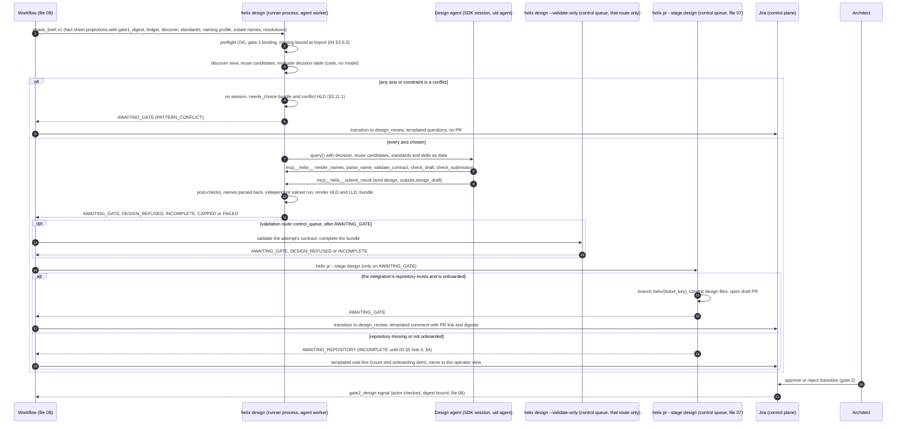
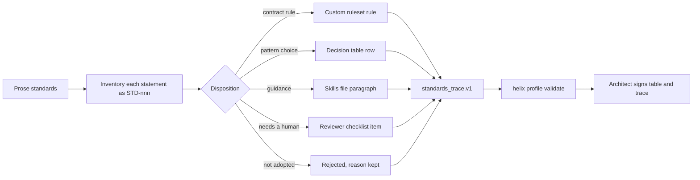
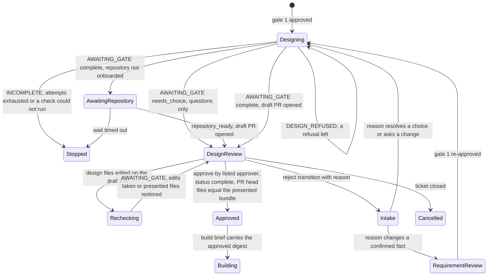

# 06 — B4: Design

## 1. Purpose and scope

This file designs **B4: design**, the phase between gate 1 (requirement confirmed) and gate 2 (design approved). It takes the confirmed fact sheet, the answer ledger, Discover's findings and the client's design standards. It produces, for the one integration a ticket describes, an API contract at zero ruleset violations, an integration HLD and an integration LLD. Every name in them is rendered by Meridian's grammar and parsed back. It also produces a key list that B2's generated code must later match exactly. The output is `design_bundle.v1`. The git writer commits a complete bundle to a **draft pull request** that the architect reviews at gate 2. A bundle that still needs a pattern choice is presented as templated questions on the ticket, with no pull request. B4 makes no platform write: nothing is published to Exchange (publish is B6). It covers `helix design` (agent worker), its `--validate-only` step (control queue, used only when validation needs a platform login) and its `--recheck` mode (hand edits on the draft PR, no model), the standards conversion each client needs in its first week, the typed wait for a repository that is not onboarded yet, and the gate-2 review surface. It does not cover the git writer's mechanics (file 07), the gate signal plumbing (file 08) or Discover and intake (file 05).

## 2. Traceability

| Source | What this file implements |
| --- | --- |
| Plan §3.4 (B4) | Inputs, standards as ruleset + skills + decision table, contract first, HLD and LLD contents (including the HLD's statement that B6's publish has no capture proof), naming, key list, *Design review*, rejection loop, the four B4 guards, the two traps |
| Plan §3.2 | Meridian imports limited to `naming.parse_any_name`, `grammar.Grammar.render`, `runlog.RunLog`; this file's wider imports are `[LLD]` deviations listed for the owner (§6) |
| Plan §4 decision 7 | OAS 3.0 contract first, Best Practices ruleset at zero violations, fewest layers that give reuse, core Logger with MDC: `[PLAN-DEFAULT 7]` |
| Plan §3.2 traps, §3.6 | The LLD's deployment-property keys go to `tenant.yaml` `deployment_properties:`; B6 publishes; B6's A10 question on inventory rows |
| Plan §6 | Versions from Exchange and the pom; provenance on every artefact; doing nothing is never exit 0 |
| HLD *Components*, *Data objects* | Design agent row; contract, HLD and LLD rows; "the LLD's key list is a contract" |
| HLD-P#3 | Fact-sheet free text, Discover text and rejection reasons reach the design agent as bounded, quoted data |
| HLD-P#7 | Draft PR at B4 is the gate-2 review surface; gate 2 binds to the bundle digest; approver list per gate |
| HLD-P#9 | A fixture value per key for B2's test property file (`keys[].fixture`, §3.10) |
| HLD-P#10 | No platform write in B4, proved by permission and environment, not only by a tool log; the refused-publish probe covers every connected app the profile declares |
| HLD-P#11 | One repository per integration unless the client's convention says otherwise (00 §3, 02 `github.repo_convention`), named by the grammar, onboarded and checked by the doctor before the draft PR is written. The typed wait around that check (`AWAITING_REPOSITORY`) is this file's `[LLD]` |
| HLD-P#15, #17 | Per-attempt sub-cap; typed outcomes. `DESIGN_REFUSED` and `AWAITING_REPOSITORY` are `[LLD]` outcomes in the manner of HLD-P#17, defined in §4 and proposed for 00 §5 (§6). Until 00 §5 lists them, §4 maps both onto 00 §5 values, so no result carries an outcome the spine lacks |
| HLD-P#16 | No mid-phase approvals; a pattern conflict is a gate-2 question, answered by transition |
| HLD lower bullets | Chain-head digest on the gate-2 comment (24); the single mutation chosen by the test author: an LLD mapping list in 07's form, so control-plane code can pick several mutations; Meridian dependency surface (19): contract tests extended over every name this file reaches, which does not by itself sanction new imports |
| Review item 6 | Ticket comments are fixed templates whose variable parts are codes, counts, rule and row ids, table text and links; names, paths and estate or requester text stay in the run record, the committed HLD or the operator view; every comment goes through file 03's outbound scan, which adds 05's estate tokens (03 §3.5.5; §4) |

## 3. Design

### 3.1 Position in the run



`[PLAN]` for the order: contract first, design review, approval by transition. `[HLD-P#7]` for the draft PR. `[HLD-P#11]` for the onboarding check before it; the typed wait around that check is `[LLD]`. `[LLD]` for evaluating the table in code before the session, and for asking before any session when a choice is open.

### 3.2 Modules

| Module | Process class | Responsibility | Tag |
| --- | --- | --- | --- |
| `src/helix/phases/design/__init__.py` | Agent sandbox: the phase CLI, which is 04's runner process (04 §3.2). With `--validate-only`, a control-plane process on the control queue | `helix design` entry: the steps of §3.11 around 04's `run_attempt()`, then `phase_result.v1`; `--validate-only` (§3.7) and `--recheck` (§3.14.1) | `[PLAN]` CLI, `[LLD]` layout |
| `phases/design/decision.py` | same | `validate_table`, `evaluate` (§3.5); imports no Meridian module | `[LLD]` |
| `phases/design/contract.py` | same | Reference check and ruleset validator run in a uid `maven` helper (§3.7); parses the report; the handler of 04's `validate_contract` tool | `[LLD]` |
| `phases/design/reuse.py` | same | Builds the discover view and reuse candidates from `discover_findings.v1` (§3.5, §3.6); checks the agent's reuse decisions | `[LLD]` |
| `phases/design/keys.py` | same; B2's sandbox for `key_list_diff` | Key-list checks; `key_list_diff` used by B2 (§3.10); reaches Meridian only through `meridian_bridge.references` | `[LLD]` |
| `phases/design/render.py` | same | Renders the integration HLD and LLD from templates plus the bundle; imports no Meridian module | `[LLD]` |
| `phases/design/submission.py` | same | Design's kind-specific submission check (04 §3.6 check 5), and the handlers of 04's `check_draft`, `render_names` and `parse_name` for design. All are tools of 04's one in-process server `helix` (04 §3.9) | `[LLD]` |
| `meridian_bridge/names.py` | Agent sandbox: the runner process, imported at preflight (04 §3.9.2); B2's sandbox (file 07) | The only caller of Meridian naming, grammar, tenant and settings in the design sandbox | `[PLAN-DEFAULT 5]` |
| `meridian_bridge/estate.py` | Agent sandbox: the runner process | Wraps `estate.mq_names.parse_destination_name` and `estate.client_inventory.split_env_suffix` for parse-back | `[LLD]`, deviation (§6) |
| `meridian_bridge/references.py` | B2's sandbox (file 07) | Wraps `references.scan_application` and `references.runtime_provided` for `key_list_diff` | `[LLD]`, deviation (§6) |
| `agents/definitions/design/` | — | 04's design definition; this file adds the design skills and the handlers of 04's design tools (§3.12) | 04, `[LLD]` |
| `templates/design/integration-hld.md.j2`, `integration-lld.md.j2` | — | Document templates (§3.8) | `[LLD]` |

The runner process and the SDK session share a container. Its environment is the 00 §9 allowlist (`all` rows only for design), and no `MERIDIAN_*` variable exists in it `[HLD-P#1]`. The runner imports `meridian_bridge` in its own process at preflight, with working directory `/in`, so Meridian finds only the staged naming profile (04 §3.9.2; §3.9 below). There is no separate naming process. `decision.py`, `keys.py`, `reuse.py`, `render.py` and `submission.py` import `meridian_bridge` only, never `meridian` (00 §2). `--validate-only` imports no Meridian module.

### 3.3 Inputs

The plan names four inputs: the confirmed fact sheet and the ledger, Discover's findings, and the client's design standards, which here are the decision table, the rulesets and the skills file. The rest are this file's. Untrusted inputs are handled under `[HLD-P#3]`. Every input arrives in `phase_brief.v1` `inputs` with its `sandbox_path` and SHA-256, staged by 04 §3.4's map. A digest mismatch is 04's `INPUT_DIGEST_MISMATCH`, `FAILED` (04 §4.2).

| Input | Brief name, schema and staging | Owner | Used for | Trust | Tag |
| --- | --- | --- | --- | --- | --- |
| Confirmed fact sheet | `fact_sheet_typed` (`human_confirmed`, under `/work/{id}/inputs/`) and `fact_sheet_text` (`untrusted`: raw copy in `/in/inputs/`, the agent reads its view), as 04 §3.4 stages every fact sheet. Both entries carry `source_sha256` and `gate1_digest` (below) | 05 | Decision table conditions; flows, mappings, keys | Typed part human-confirmed; free text quoted data `[HLD-P#3]` | `[PLAN]` |
| Ledger snapshot | `ledger` (`untrusted`): rows of `ledger_fact`, `ledger_answer` for the ticket | 05 | Which answers changed and when; cited in the HLD | Requester-derived | `[PLAN]` |
| Discover findings | `discover` (`discover_findings.v1`, `untrusted`; the agent reads its view) | 05 | Reuse candidates, connector versions, the discover view (§3.5) | Third-party text `[HLD-P#3]` | `[PLAN]` |
| Decision table | `decision_table` (`decision_table.v1`, `trusted`) | this file | Pattern choice | Client architect, signed | `[PLAN]` |
| Rulesets | `rulesets` (`trusted`): the pinned files under the profile's `standards/rulesets/` (§3.7) | this file | Contract validation | Pinned by SHA-256 | `[PLAN]` |
| Skills | Helix skills from the mount (04 §3.13), and the client's `design_standards.skills_file` (02) as input `skills_client` (`trusted`), because client standards are inputs, not skills files (04 §3.13) | this file, 02 | Agent guidance | Read-only | `[PLAN]` |
| Estate names | `estate_names` (`estate_names.v1`, §3.9), runner-only at `/in/estate-names.json` | 05 produces, this file owns the schema | Collision check (§3.9) | Runner-only: never under `inputs/`, never shown to the agent | `[LLD]` |
| Design configuration | `design_config` (`trusted`): the `design_standards`, `gates.gate2_design` and `github.repo_convention` values of `helix.yaml`, as JSON (§3.16) | 02 | Pins, layer words, contract format, attempts, validation route | Trusted; covered by `profile_digest` | `[LLD]` |
| Tenant naming | `naming_profile`: 04's staged naming profile at `/in/config/tenant.yaml`, holding exactly `schema_version`, `naming`, `environments`, `config_dir_in_repo` and `config_files` (§3.9) | 02, 04 | Name and config-path rendering | Runner-only (04 §3.4); no `MERIDIAN_*` variable anywhere in the sandbox | `[LLD]` |
| Resolutions | `resolutions` (`design_resolutions.v1`, §3.5, `trusted`), present only after a gate-2 rejection that chose rows | this file | Settles a pattern or constraint conflict | Gate owner's transition, actor-checked | `[LLD]` |
| Rejection context | `rejection_context` (05's `rejection_context.v1`, `untrusted`) | 05 | What to change, quoted | Untrusted `[HLD-P#3]` | `[LLD]` |

The runner checks every runner-only input's SHA-256 at preflight, like any other. 04's staging map lists the naming profile but not the estate names; adding `estate_names` beside it, at `/in/estate-names.json`, is a cross-file item for 04 and 08 (§6) `[LLD]`.

**Gate-1 binding** `[HLD-P#7]` `[LLD]`. The CLI never reads the Helix store: the sandbox holds no database credential, and its egress reaches only the model gateway (04 §3.12). The sandbox also never sees the approved `fact_sheet.v1` file itself, only its two projections (04 §3.4). So the check is split:

1. When 08's `open_phase_attempt` writes a design brief, it reads the live gate-1 approval's `gate_approval.decided_digest`, which is the SHA-256 of the approved revision file `fact-sheet.r{n}.json` (08 §3.9.1, 05 §3.7). It also takes the SHA-256 of the revision file it projects from. It writes them as `gate1_digest` and `source_sha256` on both fact-sheet entries, and it refuses to write the brief when they differ. No other copy of the sheet is hashed: 05's `fact_sheet.v1` has no `confirmed` status and no digest field, so a confirmed copy cannot carry the gate-1 digest (05 §3.7).
2. Step 2 (§3.11) refuses unless both entries carry the same `source_sha256` and it equals `gate1_digest` (`GATE1_MISMATCH`, `FAILED`). The bundle records both values.

So design never runs on an unapproved requirement. The two brief fields are a cross-file item for 04 and 08 (§6).

### 3.4 Converting prose standards (the client architect's first week)

Most clients' standards are prose. The first week of B4 for any client is the client architect turning them into three artefacts an agent can apply `[PLAN]`. Helix does not draft this with an agent: the standards bound the agent, and an agent should not write its own bounds `[LLD]`.



| Step | Output | Acceptance check | Tag |
| --- | --- | --- | --- |
| 1. Inventory | One `STD-nnn` per normative statement, with its source document and section | Every statement has an id | `[LLD]` |
| 2. Disposition | Each STD gets exactly one of `ruleset`, `decision_table`, `skills`, `reviewer_checklist`, `rejected` | No STD without a disposition; `rejected` carries a reason | `[LLD]` |
| 3. Ruleset | Client rules as a custom ruleset file, in the format the validator accepts `[VERIFY]` | Validator loads it; each rule cites its STD | `[PLAN]` artefact, `[VERIFY]` format |
| 4. Decision table | `decision_table.v1` (§3.5) | `validate_table` passes; every row's tests pass; every row cites an STD | `[PLAN]` artefact, `[LLD]` checks |
| 5. Skills | `standards/skills.md` (02 `design_standards.skills_file`) | Each paragraph cites an STD | `[PLAN]` artefact |
| 6. Reviewer checklist | Items copied into every integration HLD's checklist section | Rendered in the HLD; the architect ticks them at gate 2 | `[LLD]` |
| 7. Sign-off | `approved_by` and `approved_at` on the table and the trace | Doctor item (file 02) refuses an unsigned table | `[LLD]` |

**`standards_trace.v1`** `[LLD]`, at `$HELIX_PROFILES_ROOT/{client_id}/standards/trace.json`:

| Field | Type | Constraint |
| --- | --- | --- |
| `schema` | string | `"standards_trace.v1"` |
| `client_id` | string | 00 §6 |
| `items[]` | array | at least 1 |
| `items[].id` | string | `^STD-[0-9]{3}$`, unique |
| `items[].source` | string | Document name and section; stays in the gitignored profile |
| `items[].summary` | string | at most 300 characters |
| `items[].disposition` | enum | `ruleset`, `decision_table`, `skills`, `reviewer_checklist`, `rejected` |
| `items[].target_refs` | string[] | Rule ids, `DT-nnn` ids or skills anchors; empty only for `rejected` |
| `items[].reason` | string | Required when `rejected` |
| `approved_by`, `approved_at` | string, RFC 3339 | Both set before first use |

Example: `{"id":"STD-014","source":"acme integration standards §4.2","summary":"Calls with a response SLA use request-reply","disposition":"decision_table","target_refs":["DT-001"]}`.

The client's standards live in the profile at `$HELIX_PROFILES_ROOT/{client_id}/standards/`: `trace.json`, `decision-table.json`, `rulesets/`, `skills.md`, at the paths 02's `design_standards` names `[LLD]`. The profile is gitignored `[PLAN]`, so no client standard enters this repository. `standards_trace.v1` is owned here and read by file 02 (`helix profile validate` and the doctor's standards item). Adding it to 00 §8, and `standards/` to 00 §7's profile contents, are cross-file items (§6).

### 3.5 `decision_table.v1` (owned here)

The table decides from the facts; the HLD explains the choice by the rows that fired `[PLAN]`. Code evaluates it, not the model. The agent receives the result and writes the rationale around it `[LLD]`.

**Axes and patterns.** The plan's five choices fall on independent axes, because an integration can be MQ-based *and* reliable. Two rows on the same axis can conflict; rows on different axes cannot, except through a constraint `[LLD]`. Layering is a sixth axis, so "the fewest layers" is also a fired row `[LLD]`.

| Axis | Patterns | Plan words |
| --- | --- | --- |
| `interaction` | `sync_request_reply`, `async_anypoint_mq` | synchronous or MQ |
| `fan_out` | `single_call`, `scatter_gather` | scatter-gather |
| `volume` | `per_message`, `batch_job` | batch |
| `reliability` | `best_effort`, `retry_idempotent`, `reliable_mq_dlq` | reliability |
| `consistency` | `single_target`, `saga_compensation` | saga |
| `layering` | `process_only`, `process_system`, `experience_process_system` | fewest layers that give reuse |

Layer roles map to grammar layer words in the profile (`design_standards.layer_words`, a key proposed for 02 in §3.16, for example `process: prc`). Every word must be in the grammar's `layers` (Meridian `NamingConvention.layers`, `meridian/tenant.py`) `[LLD]`. A grammar with no `layer` part can name only one role per integration. So `validate_table` refuses, at onboarding, any layering row whose pattern has more than one role when the profile's grammar has no `layer` part. The question never reaches a run `[LLD]`.

**Document fields.**

| Field | Type | Constraint |
| --- | --- | --- |
| `schema` | string | `"decision_table.v1"` |
| `table_id` | string | `^[a-z0-9-]{2,48}$` |
| `version` | string | semver; the bundle records it |
| `client_id` | string | 00 §6 |
| `approved_by`, `approved_at` | string, RFC 3339 | required |
| `rows[]` | array | exactly one fallback row per axis |
| `constraints[]` | array | optional cross-axis exclusions |

**Row fields.**

| Field | Type | Constraint |
| --- | --- | --- |
| `id` | string | `^DT-[0-9]{3}$`, unique |
| `axis` | enum | one of the six axes |
| `pattern` | enum | a pattern of that axis |
| `fallback` | bool | `true` on exactly one row per axis; that row has no `when` |
| `when` | condition | required unless `fallback` |
| `rationale` | string | at most 500 characters; rendered into the HLD verbatim |
| `std_refs` | string[] | at least one `STD-nnn` |
| `implies` | object | optional; holds `platform_objects` and `key_patterns`, which the post-checks match (§3.11 steps 11–12); an unmet one is `IMPLIES_UNMET` |
| `implies.platform_objects` | enum[] | `mq_destination`, `mq_dlq`, `client_application`, `api_instance`; each needs at least one object of that kind in the bundle's `platform_objects` |
| `implies.key_patterns` | string[] | Shell-style globs matched with Python's `fnmatch.fnmatchcase`, the matching Meridian's `references.matches_deployment_pattern` uses; each must match at least one key in the bundle's `keys[]` (§3.10), for example `*.dlq.*` |
| `tests[]` | array | at least one `expect: "fires"` and one `expect: "does_not_fire"` |
| `tests[].facts` | object | A fact-sheet fragment: `{fact_id: {status, value}}`. A fact the fragment omits counts as `missing` |
| `tests[].discover` | object | Optional discover-view fragment by role: `{"source" or "target": {field: value}}`. Omitted means the Exchange search did not run, so every discover leaf is UNKNOWN |
| `tests[].expect` | enum | `fires`, `does_not_fire`, `unknown` |

**Row tests and the fallback** `[LLD]`. A non-fallback row's test evaluates that row's `when` alone: `fires` means TRUE, `does_not_fire` means FALSE, `unknown` means UNKNOWN. A fallback row has no `when`, so its test runs the whole axis (evaluation steps 3–6) over the fragment. There, `fires` means the fallback is chosen, `does_not_fire` means another pattern is chosen or the axis is a conflict, and `unknown` means the axis is a conflict.

**Condition grammar** `[LLD]`. A condition is `{"all": [...]}`, `{"any": [...]}`, `{"not": c}` or a leaf. There are two kinds of leaf:

- A fact leaf: `{"fact": <fact id>, "field": <JSON Pointer into the fact's value>, "op": <op>, "value": <json>}`. Fields are file 05's typed values in `fact_sheet.v1`; units are in the field names, for example `/latency_ms_p95`.
- A discover leaf: `{"discover": <discover-view field>, "system": "source" | "target", "op": <op>, "value": <json>}`.

Ops: `eq`, `ne`, `in`, `nin`, `lt`, `lte`, `gt`, `gte`, `exists`, `absent`, and `status_is`. `status_is` compares a fact's status and takes no `field`. Discover leaves accept the eight comparison ops only.

**Discover view** `[LLD]`. `reuse.py` builds it in code, before evaluation, from `discover_findings.v1` and the profile's system catalogue (`discover.systems[]`, file 05). It holds one entry per system role, keyed by the `system_id` of the `source` or `target` fact (file 05). It is written to `design/{n}/discover-view.json` and its SHA-256 goes into the bundle.

| Field | Type | Meaning | UNKNOWN when |
| --- | --- | --- | --- |
| `reusable_api_count` | integer | `exchange_assets[]` rows of an API type (`rest-api`, `raml`, `oas` `[VERIFY]` Exchange type names) whose `match_term` belongs to a `search_terms[]` entry with this `system_id` | The `exchange_search` source is not `ran`, or the fact's `system_id` is missing or `"unlisted"` |
| `connector_count` | integer | `connectors[]` rows whose asset matched a search term for this `system_id` | Same |
| `shareable` | bool | `shareable` of this system in `discover.systems[]` | The `system_id` is not in the catalogue |

Discover collects no consumer counts, so no row can test one. A client that wants such a condition needs file 05 to add the field first (§6).

**Leaf truth table** `[LLD]`. Each leaf gives TRUE, FALSE or UNKNOWN.

| Fact status | Comparison ops | `exists` | `absent` | `status_is` |
| --- | --- | --- | --- | --- |
| `known` | Compare the value at the pointer; a pointer absent from the value gives FALSE | TRUE if the pointer is present, else FALSE | TRUE if the pointer is absent, else FALSE | TRUE if the status equals the operand |
| `assumed` | As `known`, marked `on_assumption` | As `known`, marked | As `known`, marked | As `known`, not marked |
| `missing` (value null, file 05) | UNKNOWN | FALSE | TRUE | As `known` |
| `changed` (two values disagree) | UNKNOWN | UNKNOWN | UNKNOWN | As `known` |

`exists` and `absent` ask what the sheet holds, not what the world is. A missing fact's value is null by schema, so the sheet certainly holds nothing at any pointer. A changed fact holds two values that disagree, so whether a pointer is present is not settled. A discover leaf compares as a known fact's value does, or gives UNKNOWN in the cases the discover-view table lists. An assumed fact is never promoted to known `[PLAN]`; its mark travels to the HLD.

Types are checked before any run. `validate_table` refuses a leaf whose op does not suit the field's type (`TYPE_MISMATCH`): an order op (`lt`, `lte`, `gt`, `gte`) on anything but a number or integer; an `eq` or `ne` operand of another type, or outside the field's enum; an `in` or `nin` operand that is not an array of such values; a `value` given to `exists` or `absent`; a `field` given to `status_is`. A schema-valid fact sheet then cannot present a mismatched type. If one does, `evaluate` raises, and the attempt is `FAILED` as a bug.

**Constraint fields.** `{"id": "DC-001", "forbid": [{"axis": "interaction", "pattern": "sync_request_reply"}, {"axis": "volume", "pattern": "batch_job"}], "rationale": "..."}`. A constraint is violated when every `{axis, pattern}` in `forbid` is chosen. Its axes then become one constraint conflict (evaluation step 8) `[LLD]`.

**Example** (abbreviated from fixture `tests/fixtures/acme-standards/decision-table.json`; thresholds are fixture values, not advice). The fixture file also has one fallback row, with its two whole-axis tests, for each of `fan_out`, `volume`, `reliability` and `consistency`; they are left out here, so this excerpt alone would fail `validate_table`'s one-fallback-per-axis rule:

```json
{
  "schema": "decision_table.v1", "table_id": "acme-standard", "version": "1.0.0",
  "client_id": "acme-a", "approved_by": "acme-architect", "approved_at": "2026-10-08T09:00:00Z",
  "rows": [
    {"id": "DT-001", "axis": "interaction", "pattern": "sync_request_reply",
     "when": {"all": [{"fact": "trigger", "field": "/kind", "op": "eq", "value": "inbound_request"},
                      {"fact": "sla", "field": "/latency_ms_p95", "op": "lte", "value": 5000}]},
     "rationale": "A caller waits for the answer within its SLA.", "std_refs": ["STD-014"],
     "tests": [{"facts": {"trigger": {"status": "known", "value": {"kind": "inbound_request"}},
                          "sla": {"status": "known", "value": {"mode": "synchronous", "latency_ms_p95": 2000, "hours": "always"}}},
                "expect": "fires"},
               {"facts": {"trigger": {"status": "known", "value": {"kind": "schedule", "schedule": "*/15 * * * *"}},
                          "sla": {"status": "known", "value": {"mode": "synchronous", "latency_ms_p95": 2000, "hours": "always"}}},
                "expect": "does_not_fire"}]},
    {"id": "DT-002", "axis": "interaction", "pattern": "async_anypoint_mq",
     "when": {"any": [{"fact": "trigger", "field": "/kind", "op": "eq", "value": "message"},
                      {"all": [{"fact": "volume", "field": "/per", "op": "eq", "value": "minute"},
                               {"fact": "volume", "field": "/peak_count", "op": "gte", "value": 3000}]}]},
     "rationale": "Peak load or a message trigger needs a buffer.", "std_refs": ["STD-015"],
     "implies": {"platform_objects": ["mq_destination"]},
     "tests": [{"facts": {"trigger": {"status": "known", "value": {"kind": "message"}}}, "expect": "fires"},
               {"facts": {"trigger": {"status": "known", "value": {"kind": "inbound_request"}},
                          "volume": {"status": "known", "value": {"count": 1000, "per": "day", "peak_count": 300}}},
                "expect": "does_not_fire"}]},
    {"id": "DT-009", "axis": "interaction", "pattern": "sync_request_reply", "fallback": true,
     "rationale": "No row fired; request-reply is the standard's default.", "std_refs": ["STD-013"],
     "tests": [{"facts": {"trigger": {"status": "known", "value": {"kind": "file_arrival"}},
                          "volume": {"status": "known", "value": {"count": 1000, "per": "day", "peak_count": 300}}},
                "expect": "fires"},
               {"facts": {"trigger": {"status": "known", "value": {"kind": "message"}}}, "expect": "does_not_fire"}]},
    {"id": "DT-051", "axis": "layering", "pattern": "process_system",
     "when": {"all": [{"discover": "shareable", "system": "target", "op": "eq", "value": true},
                      {"discover": "reusable_api_count", "system": "target", "op": "eq", "value": 0}]},
     "rationale": "A shareable target with no reusable API gets a system API that others can reuse.", "std_refs": ["STD-021"],
     "tests": [{"facts": {}, "discover": {"target": {"shareable": true, "reusable_api_count": 0}}, "expect": "fires"},
               {"facts": {}, "discover": {"target": {"shareable": true, "reusable_api_count": 1}}, "expect": "does_not_fire"},
               {"facts": {}, "expect": "unknown"}]},
    {"id": "DT-059", "axis": "layering", "pattern": "process_only", "fallback": true,
     "rationale": "Fewest layers: one application unless a layering row fires.", "std_refs": ["STD-020"],
     "tests": [{"facts": {}, "discover": {"target": {"shareable": false, "reusable_api_count": 0}}, "expect": "fires"},
               {"facts": {}, "discover": {"target": {"shareable": true, "reusable_api_count": 0}}, "expect": "does_not_fire"}]}
  ],
  "constraints": []
}
```

**Evaluation** `evaluate(table, fact_sheet, discover_view, resolutions) -> Decision` `[LLD]`. It is pure and deterministic, and it uses no clock, no network and no model.

1. Each leaf gives TRUE, FALSE or UNKNOWN by the truth table above.
2. `all`: FALSE if any child is FALSE, else UNKNOWN if any is UNKNOWN, else TRUE. `any`: TRUE if any child is TRUE, else UNKNOWN if any is UNKNOWN, else FALSE. `not` swaps TRUE and FALSE. A TRUE or FALSE result is `on_assumption` when any leaf that decided it was marked. The deciding children are every child for a TRUE `all` or a FALSE `any`, the FALSE children for a FALSE `all`, the TRUE children for a TRUE `any`, and the child for `not`. UNKNOWN carries no mark.
3. Per axis: `F` = non-fallback rows that are TRUE, `U` = those that are UNKNOWN, `P` = the distinct patterns of `F`.
4. If `P` is empty and every `U` row has the fallback's pattern (or `U` is empty), the fallback fires and is chosen.
5. If `P` has exactly one pattern and every `U` row has that pattern, that pattern is chosen. **Every** row in `F` is cited, not just one.
6. Otherwise the axis is a **conflict**: `chosen` is null, and one templated question is added. Candidates are `F ∪ U`, plus the axis's fallback whenever `P` is empty, so the architect can keep the default when only unknown rows argue against it. Two rows that fire are named and the design asks; it never picks `[PLAN]`.
7. A resolution for a conflicted axis is accepted only if it names a candidate row. Then that row is chosen and recorded with the actor and gate event. A resolution naming a non-candidate is refused, and the axis stays a conflict (`RESOLUTION_INVALID`): you cannot choose a row the facts do not support. To get a different pattern, a fact or the table must change `[LLD]`.
8. Constraints are checked over the chosen patterns. A violated constraint `DC-nnn` becomes one **constraint conflict** over its axes, whose `chosen` become null. Its candidates are, per involved axis, that axis's TRUE and UNKNOWN rows plus its fallback. A resolution names one candidate row per involved axis. It is accepted only if the resulting patterns violate no constraint; otherwise it is `RESOLUTION_INVALID`. If no combination of candidates satisfies every constraint, the question says the table or a fact must change (`CONSTRAINT_UNSATISFIABLE`), and no resolution can clear it `[LLD]`.
9. Every `implies` of a chosen row is added to the post-check expectations (§3.11).

**`design_resolutions.v1`** `[LLD]`, at `runs/{ticket_key}/design/resolutions.json`. The control plane writes it (files 03 and 08; listed in §6), never an agent. It extracts every `choose DT-nnn` token (regex `\bchoose (DT-[0-9]{3})\b`) from the reason on a gate-2 rejection transition by a listed gate-2 approver. Code fills `axis` and `question_id` from the table and the rejected bundle. A token naming a row that answers no open question is dropped and reported as `RESOLUTION_INVALID`. Free text in the reason never selects a row `[HLD-P#3]` `[HLD-P#16]`. A later rejection writes a new file that carries forward every earlier item it does not replace.

| Field | Type | Constraint |
| --- | --- | --- |
| `schema` | string | `"design_resolutions.v1"` |
| `run_id`, `ticket_key` | string | 00 §6 |
| `bundle_digest` | string | 64 hex: the SHA-256 of the `needs_choice` bundle file the latest rejection answered, the same value 08 records as that gate's `presented_digest` (§3.13) |
| `items[]` | array | at least 1; at most one item per axis |
| `items[].question_id` | string | `^DQ-[0-9]+$`; an open question of the bundle it answered |
| `items[].axis` | enum | one of the six axes; equals the row's axis |
| `items[].row_id` | string | `^DT-[0-9]{3}$` |
| `items[].actor_id` | string | `jira:{accountId}` (08 §3.8); the `jira_account_id` of a person in `gates.gate2_design.approvers` at the time (02) |
| `items[].gate_event_id` | string | File 08 `gate_approval.approval_id` (uuid) of the accepted rejection |
| `items[].at` | string | RFC 3339 UTC |

```json
{"schema": "design_resolutions.v1", "run_id": "acme-a.ACME-123", "ticket_key": "ACME-123",
 "bundle_digest": "4b1a…",
 "items": [{"question_id": "DQ-1", "axis": "interaction", "row_id": "DT-002",
            "actor_id": "jira:acc-architect-1", "gate_event_id": "5f0c2a8e-3b1d-4c7e-9a52-1d2e3f4a5b6c",
            "at": "2026-10-09T10:12:00Z"}]}
```

**Static validation** `validate_table(table, fact_sheet_schema, grammar_parts, layers_policy) -> list[Problem]` runs under `helix profile validate` (file 02), in this repository's CI over the fixture tables, and at the start of every design attempt `[LLD]`. `grammar_parts` lists the profile grammar's part names, from `meridian_bridge.names.grammar_parts()` (in the sandbox, after the runner's preflight import, 04 §3.9.2). `layers_policy` is 02's `design_standards.layers_policy`. It refuses:

- a schema error, a duplicate id, an axis with zero or two fallback rows, or a pattern outside its axis;
- a fact field path not in `fact_sheet.v1`, or a discover field not in the discover view;
- a type mismatch (`TYPE_MISMATCH`, above);
- a non-fallback row without both test kinds, a fallback row without a `fires` and a `does_not_fire` whole-axis test, or any failing test;
- a row without `std_refs`, or an `implies.platform_objects` value outside its enum;
- a layering row with more than one role when `grammar_parts` has no `layer`, or a role with no `design_standards.layer_words` entry;
- a layering fallback that disagrees with `layers_policy`: `fewest_with_reuse` needs fallback `process_only`, `api_led_three_layer` needs `experience_process_system`;
- an unsigned table.

It also warns, without refusing, about two rows on one axis with different patterns whose `fires` tests fire each other. The warning reads "these can fire together; the design will ask".

### 3.6 Exchange reuse and the fewest layers

**Reuse is listed before a new layer is justified** `[PLAN]`. `reuse.py` builds candidates from the Exchange search results in `discover_findings.v1`. The agent must decide on every candidate. The HLD renders the reuse section before the layers section. The fields below are `[LLD]`.

| Field (`reuse[]` in the bundle) | Type | Constraint |
| --- | --- | --- |
| `system` | string | Source or target system, from the fact sheet |
| `need` | enum | `system_access`, `process`, `experience` |
| `candidates[]` | array | `{asset_ref, version, asset_type, finding_ref}`; `finding_ref` is a JSON Pointer into `discover_findings.v1`; may be empty |
| `decision` | enum | `reuse`, `new`, `none_found` |
| `reason` | string | 20 to 500 characters; required for `new` |

**Fewest layers** `[PLAN]` `[PLAN-DEFAULT 7]`. Under 02's default `layers_policy: fewest_with_reuse`, the layering axis's fallback is `process_only`: one application. A second or third layer appears only when a layering row fires. For example, DT-051 fires when the profile's catalogue marks the target system `shareable` and Discover found no reusable API for it (`reusable_api_count` 0, §3.5). Post-checks refuse:

- an application whose role is not in the chosen layering pattern (`LAYER_UNJUSTIFIED`);
- a new `system` or `experience` application for a system whose `reuse[]` entry is missing, or is `reuse` (`REUSE_NOT_LISTED`).

A grammar with no `layer` part cannot name more than one role, but that case never reaches a run: `validate_table` refuses such a layering row at onboarding (§3.5), and G7 holds it.

### 3.7 Contract first, and the ruleset check

| Item | Choice | Tag |
| --- | --- | --- |
| Format | OAS 3.0 default; RAML where 02's `design_standards.contract_format: raml10` | `[PLAN-DEFAULT 7]` |
| Event-only integrations (trigger MQ or schedule, no HTTP interface) | AsyncAPI 2.6 when `design_standards.async_contract: asyncapi26` (proposed, §3.16), else no contract. The HLD says why, and the validation status is `not_applicable` with that reason, never silent. Only an event-only integration may have no contract | `[PLAN]` 2.6, `[LLD]` rule |
| Ruleset | Anypoint Best Practices at 02's `design_standards.ruleset.version` (1.6.5 at research time), plus the client's custom rulesets | `[PLAN]` |
| Pass criterion | Zero violations: 02's `design_standards.max_ruleset_violations`, const 0. No profile key lowers it | `[PLAN]` |
| What counts as a violation | Every finding the validator reports as non-conformance (its error level). Until B1 confirms that the validator separates errors from warnings, every finding counts against zero. The bundle records which rule applied (`counting`), and lists other findings in the HLD only when the split is confirmed | `[LLD]` split, `[VERIFY]` what the validator calls a violation |
| Version | The contract's version major equals the application name's version part (`1.x.y` ↔ `v1`). The version is `info.version` in OAS and AsyncAPI, and the top-level `version` in RAML 1.0 `[VERIFY]` | `[LLD]` |
| Location in repository | Under `src/main/resources/api/` | `[VERIFY]` APIkit's expected location |
| Ruleset files | Pinned in the profile under `standards/rulesets/`, SHA-256 in `design_standards.ruleset_files[]` (proposed, §3.16); downloaded at onboarding | `[LLD]` `[HLD-P#10]` |

**The validation command is `[VERIFY]`.** The design assumes the Anypoint CLI v4 governance validation command can validate a local API file against local ruleset files with no platform login. Candidate: `anypoint-cli-v4 governance:api:validate --rulesets <file>... <api file>` `[VERIFY]`. The fallback validator is the open-source AMF custom validator over the same ruleset files `[VERIFY]`. Whichever is chosen is pinned by version in the worker image and recorded in the bundle. If B1 finds that validation needs a platform login, `design_standards.validation_route` is set to `control_queue` and the check moves to `helix design --validate-only` (below) `[LLD]` `[HLD-P#10]`.

**Isolation and references** `[LLD]`. The validator parses a contract the agent wrote. So the runner treats it as 04 treats `json_query` and `xml_check` (04 §3.9.1), for both the `validate_contract` tool and step 13:

| Item | Rule |
| --- | --- |
| Process | A helper subprocess the runner starts as uid `maven` (04 §3.12), in its own process group, with a 120-second limit (estimate) |
| Environment | `PATH`, `LANG`, and `HOME` and `TMPDIR` set to a fresh scratch directory. No gateway token, no bearer. Anything more the validator needs is `[VERIFY]` and added by name |
| Working directory | `/work/{phase_attempt_id}/design/`; ruleset files read at their `sandbox_path` under `inputs/` |
| Network | None. The helper starts in an empty network namespace, as 04 §3.9.1 starts `json_query` and `xml_check`, with the same `[VERIFY]` and the same seccomp fallback. The validator runs in its offline mode `[VERIFY]`; one that needs the network fails here with `VALIDATOR_UNAVAILABLE`, which is B1's signal for the `control_queue` route below |
| References | Before the validator starts, `contract.py` parses the contract and refuses every `$ref` (OAS, AsyncAPI) and every RAML `!include` or `uses:` value that is absolute, is a URL, or resolves (after symlinks) outside the contract's directory under `design/`. The finding is `CONTRACT_EXTERNAL_REF`, and the validator never starts |
| Messages | Each finding's `message` is cut to 300 characters (estimate); it is returned with `rule_id`, `severity`, `path` and `line` |

Uid `maven` cannot read `/in`, `/out` or another uid's `/proc` entries, so a reference that slipped past the check still reaches nothing private.

**Two runs, one verdict.** The agent may call `mcp__helix__validate_contract` as often as it likes while drafting. After the session, step 13 re-runs validation on the final file. Only that second run counts: an agent's own green is not evidence `[PLAN]` (§0 rule 3, applied here) `[LLD]`.

The validator report is normalised to `{rule_id, severity, message, path, line}` per finding, written to `ruleset-report.json`, and its SHA-256 is recorded. A planted violation exits 1 and is named: its `rule_id` and `path` appear in `phase_result.v1` `findings[]`, and its `rule_id` and count in the ticket comment (§4) `[PLAN]`.

**The control-queue route: `helix design --validate-only`** `[LLD]` `[HLD-P#10]`.

| Item | Rule |
| --- | --- |
| When | `design_standards.validation_route: control_queue`, set from B1's finding |
| The design attempt | Step 13 runs the reference check only. Step 17 writes the bundle with `contract.validation.status: pending` as `design-bundle.provisional.json`, never as `design-bundle.json`, and the attempt ends `AWAITING_GATE` with finding `RULESET_PENDING` (ADVISORY). This outcome is provisional: nothing is posted, and the workflow does not apply gate-2 effects yet. A provisional bundle is never presented, committed or approved |
| Order | Design attempt, then `helix design --validate-only`, then `helix pr --stage design`, then the gate-2 effects. The round's outcome is validate-only's, as an intake round's outcome is intake-apply's (08 §3.5). A design result other than `AWAITING_GATE` skips validate-only. File 08 adds this order (§6) |
| Process | Control plane, control queue; never in the sandbox |
| Inputs | A brief naming, each with SHA-256: the attempt's provisional bundle, its accepted draft (`submission.json`), its contract, its rendered HLD and LLD, and the pinned ruleset files; and the attempt's `retry.remaining` |
| Steps | (1) Validate the brief and every digest. (2) The reference check, before any bearer is minted. (3) A bearer from the broker for 02's `anypoint.connected_apps.design`. (4) The validator in a scratch directory holding only copies of the contract and the ruleset files, with environment `PATH`, `LANG`, `HOME`, `TMPDIR` and the one bearer variable the validator reads `[VERIFY]`. (5) Normalise the report. (6) Fill `contract.validation`, re-render the HLD from the draft and the bundle (section 7 shows the counts), repeat steps 15 and 16, and write the final `design-bundle.json` beside the provisional file in the same `design/{n}/` directory. Only the final file's SHA-256 is the gate-2 digest |
| Outcomes | `AWAITING_GATE` (zero violations); `DESIGN_REFUSED` (`RULESET_VIOLATION`, `CONTRACT_EXTERNAL_REF`), or `INCOMPLETE` with `DESIGN_ATTEMPTS_EXHAUSTED` when no refusal is left; `INCOMPLETE` (`VALIDATOR_UNAVAILABLE`); `FAILED` on a digest mismatch. The §4 mapping applies until 00 §5 lists `DESIGN_REFUSED` |
| Output | `attempts/{phase_attempt_id}/validate-result.json` (`phase_result.v1`), `ruleset-report.json`, the re-rendered HLD and the final bundle |

### 3.8 The integration HLD and LLD (one pair per ticket)

One ticket is one integration `[PLAN]`, so each run writes one HLD and one LLD. What each document holds is the plan's `[PLAN]`; the sections and who writes them are `[LLD]`. The agent never types a table that code can produce. The agent submits `design_draft.v1` (prose fields plus structured proposals, §3.12) as `outputs.design_draft` of its one `submit_result` call; the runner writes it to `/out/submission.json` (04 §3.6). `render.py` fills the templates from the draft, the decision, the rendered names and the code-filled fields. The documents and the bundle therefore cannot disagree `[LLD]`.

**Integration HLD** (`templates/design/integration-hld.md.j2` → `docs/design/hld.md` in the generated-app repository):

| Section | Content | Written by |
| --- | --- | --- |
| 1 Summary | What the integration does, in at most 150 words | Agent (draft `summary`) |
| 2 Facts used | Fact id, status, source, ledger date; assumed facts flagged | Code, from fact sheet and ledger |
| 3 Pattern | Per axis: pattern, rows that fired (id, rationale, facts used), fallback or not, assumptions, resolution if any | Code from `decision`; agent adds `consequences` prose per axis |
| 4 Open questions | Templated question per conflict (§3.13) | Code |
| 5 Reuse | The `reuse[]` table, before layers | Code; agent's reasons |
| 6 Layers and why | Each application, its role, the layering row that justified it | Code; agent's prose |
| 7 Contract | Format, path, operations, ruleset result with counts | Code |
| 8 Exchange publish (B6) | Fixed text: the contract is not in Exchange yet; B6 publishes it after approval by `exchange:asset:upload` or the DX MCP Server's publish; that publish is outside Meridian's register, so it is a platform write with no capture proof | Code `[PLAN]` |
| 9 Reviewer checklist | The client's `reviewer_checklist` STDs, unticked | Code |
| 10 Changes since the last attempt | Present from attempt 2: what changed and which rejection or hand edit asked for it | Code from attempt diff; agent prose |
| 11 Provenance | Ticket, model and provider, region, prompt hash, agent definition hash, decision table version, ruleset digests | Code `[PLAN]` |

A conflict HLD (§3.11.1) has sections 2, 3 and 4 only.

**Integration LLD** (`templates/design/integration-lld.md.j2` → `docs/design/lld.md`):

| Section | Content | Written by |
| --- | --- | --- |
| 1 Applications | Per application: repository-form name, deployed base name, deployed name per environment, parsed parts. Then one line, *why this many applications*: the layering row that fired (or the fallback, with its rationale) and each `reuse[]` decision behind it `[PLAN]` trap | Code (§3.9) |
| 2 Flows | Per application: flow name, trigger, steps in words, error handler; one APIkit flow per contract operation | Agent (draft `flows[]`), checked by code |
| 3 Error handling | Per error type: strategy (`propagate`, `continue`, `retry`, `dlq`, `compensate`), retry count, target; consistent with the reliability and consistency patterns | Agent, checked |
| 4 Mappings | `MAP-nnn` rows in 07's form (§3.13): kind, source expression → target field and type, transform, DataWeave module, the fact mapping rule each implements | Agent, checked against fact `mapping` |
| 5 Platform objects | MQ destinations and DLQs, client applications, API instance labels, with names per environment | Code (§3.9) |
| 6 Property keys per environment | The key list (§3.10): class, type, config file per environment, fixture | Code |
| 7 Logging | Core Logger with MDC (02 `design_standards.logging: core_logger_mdc`); the MDC keys | `[PLAN-DEFAULT 7]` |
| 8 Connectors and external calls | Each connector's group, artifact, version and operations, from Exchange through Discover; the processors that are external calls | Code (§3.13) `[PLAN]` versions from Exchange |

The mapping list (section 4) carries the fields 07's mutation check needs, so control-plane code picks several mutations for B2, rather than the suite's author picking one `[HLD-P lower]`.

### 3.9 Naming: render with Meridian, parse back

Every application name is rendered by `grammar.Grammar.render`, and every platform object name by `naming.py`. Each is parsed back before use `[PLAN]`. Only the `meridian_bridge` package (`names.py`, `estate.py`) imports Meridian, in the runner process `[PLAN-DEFAULT 5]`.

**Loading the right grammar.** Meridian binds the naming convention at import (`naming.NAMING = TENANT.naming`, `meridian/naming.py`). If no profile is found, it silently uses built-in defaults (`meridian/tenant.py`, `discover()` then defaults). This file adopts 04 §3.9.2 unchanged `[LLD]`:

1. The runner's working directory is `/in`, which holds no `.env`, so importing `meridian.settings` copies nothing into `os.environ`.
2. The activity stages the naming profile at `/in/config/tenant.yaml`; no `MERIDIAN_*` variable exists anywhere in the sandbox.
3. The runner imports `meridian_bridge` in its own process at preflight. `discover()` finds `config/tenant.yaml` through the working directory, which is the staged file.
4. The bridge refuses unless `tenant.PROFILE.configured` is true, `tenant.PROFILE.source` equals `/in/config/tenant.yaml`, and `load_error` and `problems` are empty (`TenantProfile` fields, `meridian/tenant.py`). A refusal is 04's `NAMING_PROFILE_NOT_LOADED`, `FAILED`, and no session starts.
5. The bridge never calls `settings.reload()` or `tenant.reload()` without a path.

**What the staged profile must hold** `[LLD]`. 04 §3.4 stages `schema_version`, `naming` and `environments`. Design also renders config file paths. `naming.config_file_path` reads `settings.CONFIG_DIR_IN_REPO`, which is `TENANT.config_dir_in_repo`, and `EnvSpec.config_filename`, which renders `TENANT.config_files[0]` (`meridian/naming.py`, `meridian/settings.py`). Both are top-level `tenant.yaml` keys (`tenant.PROFILE_KEYS`), outside `naming` and `environments`. Without them the paths would be Meridian's defaults, not the client's. So the staged profile holds exactly five sections: `schema_version`, `naming`, `environments`, `config_dir_in_repo` and `config_files`. It holds nothing else: no `deployment_properties`, no org or business-group names or ids. This is an amendment to 04 §3.4 (§6), and G33 holds it.

**What is rendered and how it is parsed back** (all functions cited from Meridian source):

| Object | Render | Parse back | Must equal | Tag |
| --- | --- | --- | --- | --- |
| Repository name | `NAMING.grammar.render(FORM_REPOSITORY, values)` (`grammar.py`) | `naming.parse_any_name(name)` → `AppName` | `region`, `name`, `layer`, `version`, `extra` equal the input values | `[PLAN]` |
| Deployed base name | `NAMING.grammar.render(FORM_DEPLOYED, values, exclude=(env part,))`, as `AppName.deployed_name` does | `naming.parse_any_name(name)` | same | `[PLAN]` |
| Deployed name per environment | `AppName.deployed_name_in(env_key)` (`naming.py`) | `NAMING.grammar.parse(name, PROFILE.env_tokens(), FORM_DEPLOYED)` | parts plus `env` equal to `env_spec(env_key).name_suffix` | `[LLD]`, surface `[HLD-P lower]` |
| MQ destination, logical (the config value) | `naming.mq_destination_name(domain, entity, purpose, qualifier)` | `estate.mq_names.parse_destination_name(name)` | `logical` equals the name, no `env_token` | `[LLD]`, surface `[HLD-P lower]` |
| MQ destination per environment, and its DLQ | `mq_destination_name(..., env=KEY)` and `dead_letter=True`, only after the bridge has refused a `KEY` outside `settings.ENVIRONMENTS` (below) | `parse_destination_name(name)` | `logical`, `env_token`, `is_dlq` as intended | same |
| Client application per environment | `naming.client_application_name(consumer, env_key, layer)` | `estate.client_inventory.split_env_suffix(name, PROFILE.env_tokens())` | the base equals `prefix-client_app_scope-consumer[-layer]`; the token equals the suffix | same |
| API instance label | `naming.api_instance_label(app, env_key)`, for each application that exposes a contract, per environment (§3.13) | as the deployed name per environment | same | same |
| Config file path per environment | `naming.config_file_path(env_key, secure)`, using the staged `config_dir_in_repo` and `config_files` | — (a path, rendered for the LLD) | — | `[LLD]` |

`parse_any_name` cannot parse a deployed name that carries its environment suffix. Its deployed regex excludes the env part (`NamingConvention.deployed_name_re`, `meridian/tenant.py`). A synthetic run of `Grammar.compatibility("acme","src","run",...)` confirmed that `acme-run-glb-order-sync-prc-v1-dev` matches neither regex, while `Grammar.parse(..., ("dev",), ...)` parses it. Hence the extra row. Using `Grammar.parse`, `estate.mq_names` and `estate.client_inventory` widens Meridian's imported surface beyond the plan's three names. The contract test in decision 5 must cover them `[HLD-P lower]`.

**Values** `[LLD]`. `prefix` and `scope` come from the grammar's literals. `region` is the profile's `primary_region` (`NamingConvention.primary_region`), unless the draft proposes another for an application (`applications[].region`, with `region_reason`, §3.12); a proposed region is checked against the grammar's region values, and the HLD names the reason. `layer` comes from the layering decision via `design_standards.layer_words`. `version` is `v1` for a new API. `name` and any declared extra part come from the agent's proposal in the draft. Each value is checked against its part's source: a `values` list, a `pattern`, or for the text part `grammar.TEXT_CHARSET` (`[a-z0-9]+`) joined by the grammar's separator (`meridian/grammar.py`). `Grammar.render` does not check values itself, so this check and the parse-back are what refuse a bad value. A missing value raises `GrammarError` ("no value for the ... part"), which is surfaced as `NAME_UNPARSED`.

**Environments** `[LLD]`. Environments come from `settings.ENVIRONMENTS`, which holds in-scope environments only; `settings.env_spec` raises `KeyError` for any other key, so the env-spec helpers (`deployed_name_in`, `client_application_name`, `config_file_path`) cannot name an out-of-scope environment. `naming.mq_destination_name` is different: it resolves `env` through `mq_env_suffix`, which reads `settings.ALL_ENVIRONMENTS`, out-of-scope environments included (`meridian/naming.py`). So `meridian_bridge` refuses any `env_key` not in `settings.ENVIRONMENTS` before it calls `mq_destination_name` (`UNKNOWN_ENVIRONMENT`, surfaced as `NAME_UNPARSED`). G10 holds it.

**Collision** `[LLD]`. `discover_findings.v1` carries no names: 05 keeps `tenant validate` and `tenant infer` `names[]` in `discover.raw/` only. So 05's `helix discover`, on the control plane, also writes `discover.estate-names.json` (`estate_names.v1`, below) from `discover.raw/`, and the activity stages it runner-only at `/in/estate-names.json` (§3.3). Step 11 compares each rendered repository-form name, deployed base name and deployed name per environment, lower-cased, with `names[]`. A match is `NAME_COLLISION`, except a name this run's own earlier bundle rendered, such as a repository a client admin created for this ticket. If no source ran, or `names[]` is empty, the HLD says "collision not checked: no estate names from Discover", and finding `NAME_COLLISION_NOT_CHECKED` (ADVISORY) is recorded. It is never silent.

**`estate_names.v1`** `[LLD]` (owned here; produced by file 05, §6). Control-plane and runner-only data; never in a ticket comment or a model's context.

| Field | Type | Constraint |
| --- | --- | --- |
| `schema` | string | `"estate_names.v1"` |
| `run_id`, `phase_attempt_id` | string | 00 §6; the Discover attempt that wrote it |
| `sources[]` | array | `{source, status, raw_path, raw_sha256}`; `source` in `tenant_validate`, `tenant_infer`; `status` one of 05's source statuses (`ran`, `failed`, `not_configured`, `not_needed`); `raw_path` and `raw_sha256` (the SHA-256 of that `discover.raw/` file) are null when the source did not run |
| `names[]` | string[] | Lower-cased, de-duplicated names as Meridian printed them: `tenant validate` `coverage[].names[].name` and `tenant infer` `names[].name` (05 §3.4's key paths). Never `parse_checks[].name`, which Meridian synthesises from the profile and which names nothing in the estate. May be empty |

```json
{"schema": "estate_names.v1", "run_id": "acme-a.ACME-123", "phase_attempt_id": "acme-a.ACME-123.discover.1",
 "sources": [{"source": "tenant_validate", "status": "ran", "raw_path": "discover.raw/tenant_validate.json", "raw_sha256": "3c9e…"},
             {"source": "tenant_infer", "status": "not_configured", "raw_path": null, "raw_sha256": null}],
 "names": ["acme-src-glb-order-sapi-sys-v1", "acme-run-glb-order-sapi-sys-v1"]}
```

### 3.10 The key list, and its equality with `report` later

The LLD names every property key each environment needs. This is exactly the list Meridian's `prepare` checklist will later hold the config file to `[PLAN]`. The fields below are `[LLD]`, shaped to what B2 renders from (07 §3.4.4, §3.10.4); the marks are Meridian's `[PLAN]` (`meridian/markers.py`).

| Field (`keys[]`) | Type | Constraint |
| --- | --- | --- |
| `key` | string | `^[A-Za-z0-9_.\-]+$`; unique per application; no `secure::` prefix (Meridian strips it, `references._split_prefix`) |
| `app` | string | Repository-form name of the application that reads it |
| `class` | enum | `invariant` (one value, in 07's base file), `env_specific` (a `${MERIDIAN_SET_<ENV>}` mark per environment), `secret` (a `${MERIDIAN_ENCRYPT_<ENV>}` mark per environment), `deployment` (supplied at deployment, for example as a Runtime Manager property) |
| `kind` | enum | `property` (read as `${key}`) or `secure` (read as `${secure::key}`). `secret` requires `secure`; `invariant` and `env_specific` require `property`; `deployment` allows either |
| `type` | enum | `string`, `integer`, `number`, `boolean`, `url`, `host`, `port`: this file's four plus the three 07 §3.10.4 asks for its test-file defaults. A `url` or `host` value is a string (an absolute URL; a host name), a `port` value an integer from 1 to 65535. A `secret` key is `string` |
| `value` | scalar of `type` | Required for `invariant`, absent for every other class. Filled by code from `fact_ref` when that is set |
| `fact_ref` | string or null | `{fact_id}{json pointer}`; `invariant` only; the fact must be neither `missing` nor `changed` |
| `fixture` | scalar of `type`, a string matching `^acme-fixture-[a-z0-9.-]+$`, or null | The test property file's value `[HLD-P#9]` (07 §3.4.4), never a real value; the two forms are 07 §3.10.4's. For `secret` it must match the pattern, 07's scanner allowlist. Null lets 07 use its typed default |
| `environments` | string[] | Keys of the bundle's `environments[]`; all of them for `env_specific` and `secret` |
| `read_by` | string[] | Flow names |
| `config_file` | object | Filled by code, `{ENV: path}`: for `invariant`, 07's base file under the staged `config_dir_in_repo`; for `env_specific`, `naming.config_file_path(ENV)`; for `secret`, `naming.config_file_path(ENV, secure=True)`; empty for `deployment` |

Post-checks refuse (`KEY_LIST_INVALID`): a duplicate; a `secret` or `deployment` key with a `value`; an `invariant` key without one; a `fact_ref` to a `missing` or `changed` fact; a `runtime_provided` key (Meridian `references.runtime_provided`); a `value` not of the key's `type`; a `fixture` in neither allowed form, or a `secret` fixture outside the allowlist pattern; a `kind` the class does not allow. An `implies.key_patterns` entry of a chosen row that matches no key is `IMPLIES_UNMET`.

**Equality** `key_list_diff(bundle, scan) -> KeyDiff` `[PLAN]` rule, `[LLD]` function. It is defined here and run by B2 (file 07) after the build. For each application, with `scan = references.scan_application(repo_dir)` (`meridian/references.py`):

- `K_lld` = `{k.key for k in keys if k.app == app}`.
- `K_code` = `(scan.keys ∪ scan.deployment_keys) − scan.defined − {k : references.runtime_provided(k)}`.
- Why `scan.deployment_keys` is added, not subtracted: Meridian fills it with the placeholders inside a `configuration-properties` `file=` and a `secure-properties` `key=` or `file=` (`references._read_xml`), such as the environment selector and the secure-properties key. These are keys each environment needs, supplied at deployment. The LLD lists them with `class: deployment`, and the equality counts them. Subtracting them would report every such key as "in the LLD but not read".
- `scan_application` returns `None` when the repository holds no source at all (`meridian/references.py`). That is `INCOMPLETE` with `KEY_SCAN_NO_SOURCE`, never a pass.
- Pass when `K_lld == K_code` and `scan.dynamic` is empty. A dynamic `p(...)` cannot be checked, so it is `DYNAMIC_REFERENCE`.
- Otherwise `KEY_LIST_MISMATCH` names both differences: in code but not in the LLD, and in the LLD but not read.

`meridian report --fail-on CRITICAL` stays B2's gate. A key the LLD did not name and no file defines is `REFERENCED_NOT_DEFINED`, CRITICAL, and fails the phase `[PLAN]`. Calling `references.scan_application` directly widens the Meridian surface `[HLD-P lower]`.

**Deployment-property keys.** Keys with `class: deployment` go into the client profile's `tenant.yaml` `deployment_properties:`, so `report` resolves them by the profile layer `[PLAN]`. Timing `[LLD]`: until merge, the control plane writes a run-scoped copy (`runs/{ticket_key}/tenant.overlay.yaml`, the profile plus these keys), which B2's `report` reads through `MERIDIAN_TENANT_PROFILE` in that child process's own environment (07 §3.4.4), never in the runner's. At gate 3 the control plane appends the keys to the profile's `tenant.yaml` under a per-client lock. This keeps a rejected or abandoned design's keys out of the client profile, where they would mask a real `REFERENCED_NOT_DEFINED` in another application.

### 3.11 `helix design`: steps and post-checks

Flags: the 00 §4 common flags, plus `--validate-only` (§3.7, control queue only) and `--recheck` (§3.14.1) `[LLD]`. Step order and the outcome of each failure are `[LLD]`. The checks themselves trace to the sections cited. Steps 1–6 run in the phase CLI process before it calls 04's `run_attempt()`; 04's preflight then repeats its own checks, which are idempotent: no Meridian module creates a directory at import (every `mkdir` in the package is inside a function, and `settings._state_dir()` only computes a path), so 04's second `MERIDIAN_STATE_PRESENT` check still passes. The conflict branch (§3.11.1) and `--recheck` (§3.14.1) never call `run_attempt()`, so steps 1 and 3 call 04's preflight checks directly; a preflight entry point callable without a session is asked of 04 (§6). Steps:

| # | Step | On failure |
| --- | --- | --- |
| 1 | 04's preflight checks: `assert_process_env()`, brief schema, every input SHA-256 at its `sandbox_path`, Helix skills digests, definition | `FAILED` with 04's codes (04 §4.2), among them `ENV_NOT_ALLOWLIST`, `BRIEF_INVALID`, `INPUT_DIGEST_MISMATCH`, `SKILLS_DIGEST_MISMATCH`, `DEFINITION_INVALID` |
| 2 | Gate-1 binding (§3.3) | `FAILED` (`GATE1_MISMATCH`) |
| 3 | Bind naming: check that no Meridian state directory exists under `HOME`, import `meridian_bridge` and check the profile (04 §3.9.2, §3.9) | `FAILED` (04's `MERIDIAN_STATE_PRESENT`, `NAMING_PROFILE_NOT_LOADED`) |
| 4 | Standards and scope: `validate_table`; each client standards file's SHA-256 equals its pin in `design_standards` (§3.16); `github.repo_convention` has a rule (§3.14); the `environments` fact names at least two environments | `INCOMPLETE` (`STANDARDS_INVALID`, `RULESET_UNAVAILABLE`, `REPO_CONVENTION_UNDEFINED`, `ENVIRONMENTS_TOO_FEW`) |
| 5 | Discover view, reuse candidates, `evaluate` → `pattern-decision.json` (the bundle's `decision`). Write `design/given/decision.json` and `design/given/reuse-candidates.json` for the agent | — |
| 6 | If any axis or constraint is a conflict, take the conflict branch (§3.11.1) and stop here | — |
| 7 | Run the agent session through `run_attempt()` (§3.12) | 04 §4.1–§4.3, unchanged: `CAPPED` (`BUDGET_REACHED`); `FAILED` (`TURNS_EXHAUSTED`, `CONTEXT_COMPACTED`, `TIMEOUT`, `POLICY_STOP`, `NO_SUBMISSION`, `SUBMISSION_INVALID`, `SDK_ERROR`, `TOOLSET_DRIFT`, `SDK_BUDGET_MISMATCH`, `CREDENTIAL_IN_TRANSCRIPT`, `CREDENTIAL_IN_OUTPUT`) |
| 8 | Read `outputs.design_draft` from `/out/submission.json`; schema-check it as `design_draft.v1` (§3.12) | `DESIGN_REFUSED` (`DRAFT_INVALID`) |
| 9 | The draft's per-axis choices equal the decision; its application roles are the chosen layering pattern's | `DESIGN_REFUSED` (`DRAFT_INVALID`) |
| 10 | Reuse and layers (§3.6) | `DESIGN_REFUSED` (`REUSE_NOT_LISTED`, `LAYER_UNJUSTIFIED`) |
| 11 | Render and parse back every name and platform object (§3.9); collision check; `implies.platform_objects` met | `DESIGN_REFUSED` (`NAME_UNPARSED`, `NAME_COLLISION`, `IMPLIES_UNMET`) |
| 12 | Key list checks (§3.10); `implies.key_patterns` met; every `connectors_used[]` entry and every fact-sheet connector is in Discover's `connectors[]` | `DESIGN_REFUSED` (`KEY_LIST_INVALID`, `IMPLIES_UNMET`, `CONNECTOR_NOT_IN_DISCOVER`) |
| 13 | Contract: reference check, then the independent ruleset run (§3.7). On the `control_queue` route, the reference check only, and `contract.validation.status: pending`. With no contract (event-only, §3.7), `not_applicable` with its reason | `DESIGN_REFUSED` (`CONTRACT_EXTERNAL_REF`, `RULESET_VIOLATION`); `INCOMPLETE` (`VALIDATOR_UNAVAILABLE`) |
| 14 | Contract ↔ LLD: one flow per operation; the contract's version major equals the name's version part | `DESIGN_REFUSED` (`CONTRACT_LLD_MISMATCH`) |
| 15 | Fill the code-owned fields (§3.13); render HLD and LLD; re-read them and compare their generated tables with the bundle | `FAILED` (`DOC_BUNDLE_MISMATCH`: a renderer bug) |
| 16 | Credential-shape scan over the rendered HLD, LLD, bundle and contract, with 07's scanner rules (07 §3.4.5) | `FAILED` (`SECRET_SHAPED`) |
| 17 | Write `design_bundle.v1` as canonical JSON (§3.13), as `design-bundle.provisional.json` on the `control_queue` route (§3.7), and `phase_result.v1` | — |

When step 8 passes, steps 9–14 all run, so one attempt reports every refusal it can find. Outputs are written under `/out/design/` and collected by the activity to `runs/{ticket_key}/design/{n}/` (04 §3.3).

**Outcome of a refused attempt** `[LLD]`. A refusal at steps 8–14 is `DESIGN_REFUSED` while a refusal is left. When none is left (the brief's `retry.remaining` is 0, or `design_standards.max_attempts` is 1 on the round's first attempt), the attempt ends `INCOMPLETE` with `DESIGN_ATTEMPTS_EXHAUSTED` plus the refusal codes. Until 00 §5 lists `DESIGN_REFUSED`, no refusal is ever left (§4). A round restarts after every gate-2 rejection. A passing attempt ends `AWAITING_GATE`, exit 1: a human signature is still owed.

#### 3.11.1 The conflict branch: ask before any session `[LLD]`

When step 5 leaves any axis or constraint as a conflict, steps 7–16 do not run, and step 17 writes the `needs_choice` bundle.

| Item | Rule |
| --- | --- |
| Session | None: `run_attempt()` is not called, so no model call is made and `usage` is zero |
| Why every axis | A conflict on `interaction` changes the contract's shape (HTTP or MQ). On `layering` it changes which applications exist, which one exposes the contract, and every name. On `fan_out`, `volume`, `reliability` or `consistency` it changes the LLD's flows, error handling and platform objects. So no axis leaves both the contract and the LLD untouched. A `needs_choice` bundle cannot be approved anyway, so B4 asks before it spends a session |
| Bundle | `status: needs_choice`; `decision` and `open_questions[]` filled; `title`, `repo_name`, `contract` and `documents.lld` null; `applications`, `reuse`, `flows`, `error_handling`, `mappings`, `keys`, `connectors` and `external_calls` empty; `platform_objects` holds empty lists; `provenance.mode: conflict` |
| Documents | The conflict HLD: sections 2, 3 and 4 only (§3.8), kept in the run directory |
| Outcome | `AWAITING_GATE`, exit 1, one `PATTERN_CONFLICT` finding per open question, or `CONSTRAINT_UNSATISFIABLE` |
| Gate 2 | Questions on the ticket only, and no pull request, because no name and no repository exist yet. The workflow skips `helix pr --stage design` for a `needs_choice` bundle (§6, file 08). Approval is refused (§3.14); a rejection carrying `choose DT-nnn` answers (§3.5) |

### 3.12 The design agent

04 owns the runner, the tools and the options; this table restates 04's design column so the design is readable here, and changes nothing.

| Item | Value | Tag |
| --- | --- | --- |
| Session | One `query()` per attempt through 04's `run_attempt()` (00 §10) | `[LLD]` |
| Model | The profile's design model; default `claude-opus-5-5` | 00 §2 |
| `allowed_tools` | 04 §3.9's design column: `Read`, `Glob`, `Grep`, `Write`, `Edit`, `TodoWrite`, and `mcp__helix__{submit_result, check_submission, list_inputs, read_input, render_names, parse_name, validate_contract, check_draft}`, all on 04's one in-process server `helix` | 04 §3.9 |
| Denied | Everything else, including `Bash`, `WebFetch`, `WebSearch` and any other MCP server, through `disallowed_tools` and `permission_mode: "dontAsk"` (04 §3.7) | 04, `[VERIFY]` exact semantics (00 §10) |
| Write scope | `design/**` under `/work/{phase_attempt_id}/` (04 `R-PATH-01`) | 04 §3.9 |
| Read scope | `inputs` (04 table 3.10b), `design/**`, `/opt/helix/skills/design/**`, `/opt/helix/skills/shared/**`. `/in/**` and `/out/**` are denied with a stop (04 `R-SEC-01`) | 04 §3.10 |
| `cwd`, `add_dirs` | `/work/{phase_attempt_id}`; `/opt/helix/skills/design` and `/opt/helix/skills/shared` | 04 §3.7 |
| Caps | `max_turns` and `max_budget_usd` from the brief's `caps` (attempt sub-cap) | `[HLD-P#15]` |
| Network | Model gateway only (egress allowlist, file 03) | `[HLD-P#1]` |
| Prompt framing | Untrusted inputs reach the agent only as 04's delimited views and `read_input` pages; the decision, reuse candidates and client standards are trusted blocks or files (04 §3.8, §3.11) | `[HLD-P#3]` |
| Skills | 04 §3.13's design skills inlined; the client's `skills.md` as the trusted input `skills_client` | 04 §3.13 |
| Output | One `mcp__helix__submit_result` call of kind `design`. `outputs.design_draft` is the `design_draft.v1` object, which the runner writes to `/out/submission.json`. The contract file is written under `design/` and named by `contract_path` (04 §3.6) | 04 §3.6 |

**Given files** `[LLD]`. Step 5 writes `design/given/decision.json` and `design/given/reuse-candidates.json` before the session, for the agent to read. The post-checks compare the draft with the CLI's own in-memory copies, so an agent's edit to those files changes nothing.

**Tool handlers** `[LLD]`. The tool contracts are 04 §3.9.1's. This file supplies the design handlers: `render_names` and `parse_name` call `meridian_bridge.names`; `validate_contract` runs §3.7's reference check and validator helper, and reports a refused reference as a finding with `rule_id` `CONTRACT_EXTERNAL_REF`; `check_draft` runs 04's checks with this file's kind-specific check (`submission.py`). None writes into the agent's write scope or reaches the network.

**`design_draft.v1`** `[LLD]`, the agent's output, internal to this file:

| Field | Type | Constraint |
| --- | --- | --- |
| `schema` | string | `"design_draft.v1"` |
| `title` | string | 5–80 characters, plain text, no newline; becomes the PR title (07 §3.8.2, §3.8.5) |
| `summary` | string | At most 150 words |
| `axes[]` | array | `{axis, consequences}`; one per axis; `consequences` at most 300 words |
| `reuse[]` | array | §3.6, with `decision` and `reason` |
| `applications[]` | array | `{role, name_part, extra_parts{}, region, region_reason, exposes_contract}`. Roles are exactly the chosen layering pattern's. `region` optional, from the grammar's region values; `region_reason` (20–300 characters) required with it. `exposes_contract` true on exactly one application when a contract exists |
| `contract_path` | string or null | Under `design/`; null only for an event-only integration without AsyncAPI (§3.7) |
| `connectors_used[]` | array | `{group_id, asset_id}`; each must be in `discover_findings.v1` `connectors[]` |
| `external_calls[]` | string[] | `{element}@{config_ref}`, `^[a-z][a-z0-9-]*:[a-z][A-Za-z0-9-]*@[a-z][a-z0-9-]{1,62}$`, for example `http:request@acme-wms-config`: the processor element and the `name` of the global configuration element it uses, the form 07 §3.10.4 asks for. The LLD fixes both, and B2's code must use them |
| `flows[]` | array | `{app_role, flow, trigger, steps[], error_handler}` |
| `error_handling[]` | array | `{error_type, strategy, retries, target}` |
| `mappings[]` | array | The §3.13 mapping fields |
| `platform_objects` | object | `{mq_destinations[] {destination_key, domain, entity, purpose, qualifier, destination_type, dead_letter_enabled}, client_applications[] {consumer_key, layer}}`; field names follow Meridian's `MqDestination` and `ClientApplication` (`meridian/models.py`) |
| `keys[]` | array | §3.10 without `config_file`, which code fills; no `value` where `fact_ref` is set |
| `changes_since_last[]` | array | `{ref, what}`; from attempt 2 |

### 3.13 `design_bundle.v1` (owned here)

Written in the sandbox to `/out/design/design-bundle.json`, collected to `runs/{ticket_key}/design/{n}/design-bundle.json`, and committed unchanged as `docs/design/design-bundle.json`. The fields and both paths are `[LLD]`; `provenance` is `[PLAN]`; the gate-2 digest rule is `[HLD-P#7]`. Fields marked *code* are filled by code, never typed by the model. B2 reads the fields 07 §3.10.4 lists.

| Field | Type | Constraint / meaning |
| --- | --- | --- |
| `schema` | string | `"design_bundle.v1"` |
| `run_id`, `phase_attempt_id`, `client_id`, `ticket_key` | string | 00 §6 |
| `status` | enum | `complete`, `needs_choice` |
| `title` | string or null | From the draft; null when `needs_choice` |
| `repo_name` | string or null | The integration's repository (§3.14): the primary application's repository-form name under `per_integration`; null when `needs_choice` |
| `environments[]` | string[] | *Code*: the `environments` fact's `targets`, in Meridian's `settings.ENV_ORDER` (rank order), the order 07 §3.10.4 uses; at least two (step 4) |
| `inputs` | object | `fact_sheet {typed_sha256, text_sha256, source_sha256, gate1_digest}`, `ledger {path, sha256}`, `discover {path, sha256}`, `estate_names {path, sha256}`, `decision_table {table_id, version, sha256}`, `rulesets[] {ref, sha256}`, `skills[] {path, sha256}`, `resolutions {path, sha256}` or null |
| `decision.axes[]` | array | `{axis, status: chosen\|conflict, pattern\|null, fired[] {row_id, truth: true\|unknown, on_assumption, facts_used[]}, fallback_used, resolution {row_id, actor_id, gate_event_id, at}\|null}`; all six axes present |
| `decision.constraints_violated[]` | string[] | `DC-nnn` ids |
| `open_questions[]` | array | `{id: "DQ-n", axis, candidates[] (row ids), text}`; empty iff `status` is `complete` |
| `reuse[]` | array | §3.6 |
| `applications[]` | array | `{role, layer, primary, region, exposes_contract, repository_name, deployed_base_name, deployed_names {ENV: name}, parts {}}`. Exactly one `primary`: the application that exposes the contract, or the `process`-role application when there is no contract `[LLD]`. `repository_name` is the application's rendered repository-form name, its identity; for the primary it equals `repo_name` |
| `contract` | object or null | `{format: oas30\|raml10\|asyncapi26, path, sha256, version, operations[], app, validation}`, or `{format: none, validation: {status: "not_applicable", reason}}`; null when `needs_choice`. `path` is the repository path under `src/main/resources/api/`; `app` is the exposing application's `repository_name`. `validation` is `{status: passed\|pending, validator, validator_version, rulesets[] {ref, sha256}, counting: errors_only\|all_findings, violations, other_findings, report_path, report_sha256}`; `violations` is 0 in any bundle that reaches gate 2; `pending` only on the `control_queue` route before validate-only (§3.7) |
| `documents` | object | `hld {path, sha256}`, `lld {path, sha256}` or null |
| `connectors[]` | array | *Code*: `{group_id, artifact_id, version, exchange_asset_id, operations[]}`, one per connector the fact sheet's `source` or `target` names and per `connectors_used[]` entry, each taken from `discover_findings.v1` `connectors[]`. `artifact_id` is Discover's `asset_id` (`[VERIFY]` that a connector's Exchange asset id is its Maven artifact id); `exchange_asset_id` is `{group_id}/{asset_id}`; `version` is Discover's `version`, the one `describe_connector` ran on (05 §3.4); `operations[]` are its operation names `[PLAN]` versions from Exchange |
| `external_calls[]` | string[] | From the draft, in its `{element}@{config_ref}` form, across the integration's applications; 07's mock guard treats them as the boundary (07 §3.5.2) |
| `flows[]`, `error_handling[]` | arrays | From the draft, after checks |
| `mappings[]` | array | 07's shape (07 §3.10.4) plus this file's trace fields: `{id, app_role, kind, source_expr, target_field, target_type, transform, fact_rule, dwl_module}`. `id` `^MAP-[0-9]{3,}$`, unique: the id 07's code anchors (`// map:{id}`), test coverage tags (`covers: MAP-001`) and `test_report.v1` `mapping_id` use; `kind` `field` or `condition`; `source_expr` the DataWeave source expression, kept for the LLD's reader (07 does not need it); `target_type` `string`, `number`, `boolean`, `date`, `object`, `array`, 07's list; `transform` the fact rule's `transform`; `fact_rule` the index of the rule in the `mapping` fact's `rules[]`; `dwl_module` `^[a-z][a-z0-9-]{1,60}$`, the module 07 places at `src/main/resources/dwl/{dwl_module}.dwl` (07 §3.4.6). Every `field` row cites a fact rule, and every fact rule has at least one row (`DRAFT_INVALID` otherwise) |
| `platform_objects` | object | *Code*: `mq_destinations[]` with `logical_name`, `names {ENV}`, `dlq_names {ENV}`; `client_applications[]` with `names {ENV}`; `api_instances[]` `{app, labels {ENV}}`, one per application that exposes a contract, labels by `naming.api_instance_label(app, ENV)` for each of `environments[]` `[LLD]` |
| `keys[]` | array | §3.10 |
| `deployment_property_keys[]` | string[] | *Code*: keys with `class: deployment` |
| `standards` | object | `{decision_table_version, logger: "core_logger_mdc", contract_format, layers_policy}`, from 02's `design_standards` |
| `provenance` | object | `{model, provider, region, prompt_hash, agent_definition_hash, session_id, mode: session\|conflict\|recheck, pr_head_sha, created_at}`; `prompt_hash` and `agent_definition_hash` are 09's shared identifiers with 09's definitions (09 §3.4), copied from the attempt's `phase_result.v1` `agent`; `model`, `provider`, `region`, both hashes and `session_id` are null for `conflict` and `recheck`, where no model ran; `pr_head_sha` is set only for `recheck` `[PLAN]` |

**Gate-2 digest** `[HLD-P#7]`. The bundle has no digest field of its own. Gate 2 binds to the SHA-256 of the bundle file's bytes, as 08 §3.9 says; `phase_result.v1` `outputs.design_bundle.sha256` carries it, and 08 records it as `presented_digest` and `decided_digest`. So the CLI writes the file as canonical JSON (UTF-8, sorted keys, `(",", ":")` separators, one trailing newline), and the same content always has the same bytes. The git writer commits those bytes unchanged. The bundle lists each member's SHA-256 (`contract.sha256`, `documents.*.sha256`) and the `gate1_digest` it consumed, so 08's check on the PR head covers every design file, not only the bundle.

Example (abbreviated; shown indented for reading, written canonical):

```json
{
  "schema": "design_bundle.v1", "run_id": "acme-a.ACME-123", "phase_attempt_id": "acme-a.ACME-123.design.1",
  "client_id": "acme-a", "ticket_key": "ACME-123", "status": "complete",
  "title": "Order sync to the warehouse", "repo_name": "acme-src-glb-order-sync-prc-v1",
  "environments": ["DEV", "SIT"],
  "decision": {"axes": [
    {"axis": "interaction", "status": "chosen", "pattern": "sync_request_reply",
     "fired": [{"row_id": "DT-001", "truth": true, "on_assumption": false, "facts_used": ["trigger", "sla"]}],
     "fallback_used": false, "resolution": null},
    {"axis": "layering", "status": "chosen", "pattern": "process_only",
     "fired": [{"row_id": "DT-059", "truth": true, "on_assumption": false, "facts_used": []}],
     "fallback_used": true, "resolution": null}], "constraints_violated": []},
  "open_questions": [],
  "applications": [{"role": "process", "layer": "prc", "primary": true, "region": "glb", "exposes_contract": true,
    "repository_name": "acme-src-glb-order-sync-prc-v1", "deployed_base_name": "acme-run-glb-order-sync-prc-v1",
    "deployed_names": {"DEV": "acme-run-glb-order-sync-prc-v1-dev", "SIT": "acme-run-glb-order-sync-prc-v1-sit"},
    "parts": {"region": "glb", "name": "order-sync", "layer": "prc", "version": "v1"}}],
  "contract": {"format": "oas30", "path": "src/main/resources/api/acme-order-sync.yaml", "version": "1.0.0",
    "app": "acme-src-glb-order-sync-prc-v1",
    "validation": {"status": "passed", "validator": "anypoint-cli-v4 governance", "validator_version": "<pinned>",
                   "rulesets": [{"ref": "anypoint-best-practices@1.6.5", "sha256": "7d1c…"}],
                   "counting": "all_findings", "violations": 0, "other_findings": 0}},
  "connectors": [{"group_id": "com.mulesoft.connectors", "artifact_id": "mule-http-connector", "version": "1.10.0",
                  "exchange_asset_id": "com.mulesoft.connectors/mule-http-connector", "operations": ["request"]}],
  "external_calls": ["http:request@acme-wms-config"],
  "mappings": [{"id": "MAP-001", "app_role": "process", "kind": "field", "source_expr": "payload.orderId",
                "target_field": "order.id", "target_type": "string", "transform": "copy", "fact_rule": 0,
                "dwl_module": "order-to-wms"}],
  "keys": [{"key": "orders.target.url", "app": "acme-src-glb-order-sync-prc-v1", "class": "env_specific",
            "kind": "property", "type": "url", "fixture": "acme-fixture-orders-url",
            "environments": ["DEV", "SIT"], "read_by": ["post:\\orders:api-config"],
            "config_file": {"DEV": "src/main/resources/config/config-dev.yaml", "SIT": "src/main/resources/config/config-sit.yaml"}},
           {"key": "env", "app": "acme-src-glb-order-sync-prc-v1", "class": "deployment", "kind": "property",
            "type": "string", "fixture": "munit", "environments": ["DEV", "SIT"], "read_by": [], "config_file": {}}],
  "deployment_property_keys": ["env"],
  "standards": {"decision_table_version": "1.0.0", "logger": "core_logger_mdc", "contract_format": "oas30",
                "layers_policy": "fewest_with_reuse"}
}
```

The connector coordinates and version in the example are illustrative, not verified values. The config paths follow Meridian's built-in shape (`config_dir_in_repo` `src/main/resources/config`, file template `config-[secure-]{env_prefix}{token}.{ext}`, `meridian/tenant.py`, `meridian/config_files.py`), with `yaml` shown as the extension; a client's profile renders its own.

### 3.14 Gate 2: the review surface and the loop

**Review surface** `[HLD-P#7]`. Every bundle that goes to gate 2 ends `AWAITING_GATE`, exit 1, because a human signature is still owed; `status` and the finding codes tell a complete bundle from one that needs a choice. For a complete bundle, the workflow runs `helix pr --stage design` (file 07). The git writer, on branch `helix/{ticket_key}` in the integration's repository (`repo_name`, below), commits `docs/design/hld.md`, `docs/design/lld.md`, `docs/design/design-bundle.json` and the contract. It then opens a **draft** pull request labelled `helix:design-review` (GitHub draft PRs `[VERIFY]`). B2 later extends the same branch. The control plane (08's `apply_effects`, 08 §3.7) moves the ticket to `design_review` and posts one templated comment: the PR link, the bundle file's SHA-256, and the chain-head digest `[HLD-P lower]`. For a `needs_choice` bundle there is no PR: the comment carries the templated questions only (§3.11.1).

**Repositories** `[HLD-P#11]` `[LLD]`. 00 §3 says one repository per integration unless the client's convention says otherwise, and 02's `github.repo_convention` records which. Under `per_integration`, the integration's repository is named by the grammar's repository form for the primary application (`repo_name`). Every application of the integration lives in it: the primary at the root, each other one in a directory named by its own repository-form name. The design files go to the repository's `docs/design/`, so non-primary applications' design is in the same documents. Under `client_defined`, 02 gives no naming rule yet, so step 4 stops `INCOMPLETE` (`REPO_CONVENTION_UNDEFINED`) until 02 defines one (§6). B2 builds one application per run today (07 §3.10.4's single `repo_name`); building the others of a multi-application integration is a file 07 item (§6).

**The repository wait** `[LLD]`, with `[HLD-P#11]` for the onboarding check itself:

| Item | Rule |
| --- | --- |
| Check | Before any write, `helix pr --stage design` runs 07's GH1 for `repo_name` and requires it in 02's `github.repositories[]`, with doctor items 29 and 31 passed for it. Under `per_integration` this is one repository; under any later convention, every repository the bundle names |
| Outcome | `AWAITING_REPOSITORY`, exit 1, finding `REPO_NOT_ONBOARDED` |
| Posted | On the ticket: "Design is ready, but the repository for this integration is not onboarded yet (onboarding item 29). The operator has been told." The rendered name goes to the operator view (08 §3.18) and the run record, not to the ticket (review item 6) |
| Who acts | A client GitHub admin creates the repository; the operator adds it to `github.repositories[]` and runs `helix doctor --scope pr --repo NAME` (02's doctor interface) |
| Signal | When that doctor run passes for the repository (02's `pr` scope: items 01, 09, 28 to 31 and 34, the checks 07's preflight repeats), the control plane sends `repository_ready` to every workflow of that client in `awaiting_repository`. Each re-runs `helix pr --stage design`, which checks again |
| Timeout | `design_standards.repository_wait_business_days` (proposed, §3.16) ends the run `INCOMPLETE` with `REPO_WAIT_TIMEOUT` |
| Never | The git writer never creates a repository: its role is write, never admin (00 §9) |

**Questions are templated** `[LLD]` (review item 6). The only variable parts are row ids, axis names, pattern names and row rationales, which come from the signed table. For example: "DQ-1. On *interaction*, DT-001 (sync request-reply) and DT-002 (Anypoint MQ) both fire. To choose, reject with `choose DT-001` or `choose DT-002`, or correct a fact through the requester." No Discover or fact-sheet text is ever quoted in a ticket comment, and the comment goes through file 03's outbound scan (03 §3.5.5; §4).



| Rule | Tag |
| --- | --- |
| Approval counts only as a transition by an actor in the profile's gate-2 approver list, checked by actor id on the signed webhook; never by a comment | `[HLD-P#7]` `[HLD-P#16]` |
| Approval is refused when the bundle `status` is `needs_choice` (a refusal reason 08 adds, §6), or when the bundle file or any member file on the PR head has a SHA-256 other than the presented bundle's (08's `digest_mismatch`, 08 §3.9). The refusal is posted; the ticket returns to `design_review` | `[HLD-P#7]` |
| A rejection's reason enters through the intake agent, then goes to design. Never to build `[PLAN]`. The workflow schedules build only with a gate-2 approval whose `decided_digest` equals the current bundle file's SHA-256 | `[PLAN]`, `[HLD-P#7]` |
| If intake finds that the reason changes a confirmed fact, gate 1 reopens first | `[HLD-P#7]` |
| Attempt *n+1* reuses the branch; earlier design files are replaced; the HLD's section 10 says what changed | `[LLD]` |
| Ticket closed in `design_review` cancels the workflow; reopened re-enters at Discover | `[HLD-P#12]` |
| Active reviewer minutes and elapsed wait at gate 2 are recorded separately (files 08, 09) | `[HLD-P#18]` |

#### 3.14.1 Hand edits on the draft PR: `helix design --recheck` `[LLD]`

08 §3.9 sends the run back to design when the design files on the draft PR head differ from the presented or approved bundle. This mode is what design does then.

| Item | Rule |
| --- | --- |
| Trigger | 08 sees a design file on the draft PR head whose SHA-256 differs from the presented bundle's (at a gate-2 decision, or on a push to the branch) |
| Runs | As design attempt *n+1* on the agent queue, in the same sandbox and staging as any design attempt. The CLI never calls `run_attempt()`, so no model call is made and `usage` is zero |
| Inputs | The presented bundle and its accepted draft (`trusted`), and `edited_design`: the files under `docs/design/` and the contract path, read from the PR head by the git writer and staged runner-only in `/in/inputs/` like any raw untrusted input. No model reads them |
| What a human may edit | The contract file, and in `design-bundle.json` the draft-sourced fields: `title`, `flows`, `error_handling`, `mappings`, `external_calls`, and `keys` except `config_file`. An edit to a code-owned field, or to `hld.md` or `lld.md`, is refused with `DESIGN_EDIT_REFUSED`, naming the field paths, never their values. The documents are rendered from the bundle, so a hand edit to them would make the two disagree |
| Steps | Apply the edits to the presented draft. Run steps 1–5 and 8–17 with it; steps 6 and 7 are skipped. `provenance.mode: recheck`, with the PR head commit in `pr_head_sha`. On the `control_queue` route, `--validate-only` follows as for any attempt (§3.7) |
| Outcome | `AWAITING_GATE`, exit 1, unless a `FAILED` step stops it as in any attempt (steps 1–3, 15 and 16; for example a credential-shaped string in an edited contract is `SECRET_SHAPED`). If every step passes, the rechecked bundle becomes the gate-2 subject. If any refuses, the presented bundle stays the subject, with finding `RECHECK_REFUSED` plus the codes, and the comment says the edits were not taken |
| Commit | `helix pr --stage design` then commits the subject's files on top of the human's commit, so the PR head again equals the gate-2 subject: a refused edit is reverted by an App commit, with the reason posted. 07's branch rule allows this App commit only when the human's commits touch nothing but the editable paths. That is a file 07 amendment (§6) |
| Attempts | A recheck does not use up `design_standards.max_attempts`, because no model ran |

### 3.15 No platform write in B4, and the test that proves it

B4 publishes nothing. The Exchange publish is B6's, after approval, so a rejected design leaves no asset version `[PLAN]`. The proof is layered, strongest first `[HLD-P#10]`:

| Layer | Mechanism | Test |
| --- | --- | --- |
| 1. No credential | The design sandbox carries no Anypoint credential at all (00 §9: bearer reaches the build agent only) | Captured session env equals the allowlist's `all` rows exactly |
| 2. No route | Egress allowlist: model gateway only | A connection to the Anypoint control-plane host from the sandbox is refused |
| 3. No tool | No `Bash`, no network tool, no MCP server but 04's `helix`, and of its tools only design's (04 §3.9) | Tool log holds no publish call `[PLAN]`, and no call outside the allowed set |
| 4. Permission | Every connected app the profile declares for B1–B5 (02's `anypoint.connected_apps.discover`, `.design` and `.build`, ONB-15) is refused a publish | Doctor's permission probe, once per declared app: an `exchange:asset:upload` `[VERIFY]` of asset `acme-permission-probe` with that app's bearer is refused, and the doctor line names the app. If any probe succeeds, the doctor fails, names that app, and reports that a probe asset now exists |

If B1 finds that Exchange read needs Contributor `[VERIFY]` (HLD-P#10 asks whether Viewer suffices), layer 4 cannot pass. Then the doctor reports it as a known gap, and B4 rests on layers 1–3 `[HLD-P#10]`.

### 3.16 Configuration keys (`helix.yaml` `design_standards`, owned by file 02)

This file reads 02's `design_standards` block and does not redefine it. The keys it needs that 02 lacks are proposed as additions under `design_standards`, for file 02 to adopt (§6).

**Read from 02 as defined there:**

| Key | Type (02) | Used for | Tag |
| --- | --- | --- | --- |
| `design_standards.contract_format` | `oas30` \| `raml10` | Contract format (§3.7) | `[PLAN-DEFAULT 7]` |
| `design_standards.ruleset` | `{group_id, asset_id, version}`, the ruleset's Exchange coordinates (02; ONB-33 checks they exist) | The Best Practices ruleset and its version | `[PLAN-DEFAULT 7]` |
| `design_standards.max_ruleset_violations` | const `0` | Pass criterion (§3.7) | `[PLAN-DEFAULT 7]` |
| `design_standards.layers_policy` | `fewest_with_reuse` \| `api_led_three_layer` | Must agree with the table's layering fallback (§3.5) | `[PLAN-DEFAULT 7]` |
| `design_standards.logging` | `core_logger_mdc` | `standards.logger` in the bundle; LLD section 7 | `[PLAN-DEFAULT 7]` |
| `design_standards.skills_file`, `.decision_table` | paths in the profile; `standards/skills.md`, `standards/decision-table.json` in 02's example | Inputs `skills_client`, `decision_table` | `[PLAN-DEFAULT 7]` |
| `gates.gate2_design.approvers` | list of `person` keys (02 `people`) | Who may approve, reject and resolve | `[HLD-P#7]`, `[PLAN-DEFAULT 6]` |
| `github.repo_convention`, `github.repositories[]` | 02 | Repository naming and the onboarding check (§3.14) | `[HLD-P#11]` |
| `anypoint.connected_apps.{discover,design,build}` | 02 | The publish probe (§3.15); the `--validate-only` bearer | `[HLD-P#10]` |

**Proposed additions under `design_standards`** (§6, file 02):

| Key | Type | Default | Tag |
| --- | --- | --- | --- |
| `design_standards.async_contract` | `asyncapi26` \| `none` | `none` | `[LLD]` |
| `design_standards.standards_trace` | path in the profile | `standards/trace.json` | `[LLD]` |
| `design_standards.ruleset_files[]` | `{ref, path, sha256}`; one is the Best Practices file at `ruleset.version`, the others the client's custom rulesets | required | `[LLD]` `[HLD-P#10]` |
| `design_standards.pins` | `{decision_table, standards_trace, skills_file}`, each a SHA-256 | required | `[LLD]` |
| `design_standards.layer_words` | `{experience, process, system}` → grammar layer words | none; required when the grammar has a layer part | `[LLD]` |
| `design_standards.max_attempts` | integer ≥ 1 | 3 attempts per round (estimate; chosen without evidence). Has no effect until 00 §5 lists `DESIGN_REFUSED` (§4) | `[LLD]` |
| `design_standards.validation_route` | `sandbox` \| `control_queue` | `sandbox` until B1 shows validation needs a login | `[LLD]`, `[VERIFY]` |
| `design_standards.repository_wait_business_days` | integer ≥ 1 | 10 business days (estimate; chosen without evidence) | `[LLD]` |

## 4. Errors and exits

Two outcomes are new. Both are `[LLD]` and are proposed for 00 §5 and file 08 (§6).

| PhaseOutcome | Meaning | Exit | From | Workflow action |
| --- | --- | --- | --- | --- |
| `DESIGN_REFUSED` | The ruleset or a post-check refused the draft; the findings are named | 1 | `helix design`, `--validate-only` | Start design attempt *n+1* with the findings as 04's `retry` input; `retry.remaining` counts the refusals left in this round. When none is left, the CLI itself returns `INCOMPLETE` with `DESIGN_ATTEMPTS_EXHAUSTED`, so the run ends in a spine outcome that is posted and excluded from measurement |
| `AWAITING_REPOSITORY` | Complete bundle; the integration's repository is missing or not onboarded | 1 | `helix pr --stage design` | Post the wait line, notify the operator, wait for `repository_ready`; on the timeout, `INCOMPLETE` (`REPO_WAIT_TIMEOUT`) (§3.14) |

**Until 00 §5 lists them** `[LLD]`. 08 treats a result whose outcome is not in 00 §5 as `PhaseContractError`, `FAILED` (08 §3.7). So a CLI returns either new outcome only when the pinned `phase_result.v1` schema's `outcome` enum (04 §3.5, which follows 00 §5) lists it. Until then both map onto spine values, and the run is recovered as 08 recovers any terminal run (08 §3.10):

| New outcome | Spine value meanwhile | Effect |
| --- | --- | --- |
| `DESIGN_REFUSED` | `INCOMPLETE`, exit 1, `DESIGN_ATTEMPTS_EXHAUSTED` plus the refusal codes | `helix design` and `--validate-only` count no refusal as left, as if `design_standards.max_attempts` were 1. The comment is the "Design stopped after {n} attempts" line below |
| `AWAITING_REPOSITORY` | `INCOMPLETE`, exit 1, `REPO_NOT_ONBOARDED` | 07's present preflight result (`GH_REPO_NOT_ONBOARDED`, `REPO_MISSING`) stands, with the wait line's wording plus "reopen the ticket once the repository is onboarded". No `repository_ready` wait exists |

**Session and preflight stops are 04's** and are not redefined here: every row of 04 §4.1–§4.3 applies to design unchanged. The ones design can meet are `CAPPED` with `BUDGET_REACHED`, and `FAILED` with `TURNS_EXHAUSTED`, `CONTEXT_COMPACTED`, `TIMEOUT`, `POLICY_STOP`, `NO_SUBMISSION`, `SUBMISSION_INVALID`, `SDK_ERROR`, `TOOLSET_DRIFT`, `SDK_BUDGET_MISMATCH`, `ENV_NOT_ALLOWLIST`, `CREDENTIAL_NOT_PERMITTED`, `BRIEF_INVALID`, `INPUT_DIGEST_MISMATCH`, `SKILLS_DIGEST_MISMATCH`, `UNTRUSTED_RAW_STAGED`, `INPUT_NOT_VISIBLE`, `DEFINITION_INVALID`, `STREAMED_INPUT_REQUIRED`, `MERIDIAN_STATE_PRESENT`, `NAMING_PROFILE_NOT_LOADED` (04 §3.9.2), `CREDENTIAL_IN_TRANSCRIPT` or `CREDENTIAL_IN_OUTPUT`. Each is posted with 04's text.

**What a ticket comment may carry** `[LLD]` (review item 6). Comments are fixed templates whose variable parts are finding codes, counts, ruleset rule ids, row ids, axis and pattern names, row rationales from the signed table, attempt numbers and links. Names, paths, Meridian's reasons, and anything from Discover or the requester stay in `phase_result.v1` `findings[]`, the committed HLD (once a PR exists) or the operator view. Retry findings for the next attempt carry the draft pointer in `where` (for example `/applications/0/name_part`), never an estate name; 04's brief block renders only codes, rule ids and `where` from them (04 §3.8). Every comment is posted through file 03's `JiraClient.post`, so 03's outbound scan applies (03 §3.5.5; its module is `controlplane/jira/outbound_scan.py`). Its check 3 matches this client's deny-list plus 05's `discover.denylist.json` estate tokens and counts a hit, never the token, without changing the delivery; checks 1 and 2 (credential shapes, another client's names) block the comment. The control plane posts; the CLI posts nothing (04 §3.2).

| Condition | Finding code | PhaseOutcome | Exit | Posted on the ticket |
| --- | --- | --- | --- | --- |
| Complete bundle, validated; draft PR opened | — | `AWAITING_GATE` | 1 | "Design ready for review: {PR link}. Bundle {sha256:12}, chain {chain_head:12}." |
| Complete bundle on the `control_queue` route, before validate-only | `RULESET_PENDING` (ADVISORY) | `AWAITING_GATE`, provisional | 1 | Nothing; validate-only's outcome replaces it (§3.7) |
| A decision axis or constraint conflicts | `PATTERN_CONFLICT` | `AWAITING_GATE` | 1 | The templated questions (§3.14); no PR link, because no PR exists |
| No combination of candidates satisfies the constraints | `CONSTRAINT_UNSATISFIABLE` | `AWAITING_GATE` | 1 | "DQ-{n}: no choice among the candidate rows satisfies {DC-nnn}; a fact or the decision table must change" |
| A resolution names a non-candidate row, or one that breaks a constraint | `RESOLUTION_INVALID` | `AWAITING_GATE` | 1 | "{DT-nnn} is not a candidate for these facts", and the question again |
| Contract violation after the session | `RULESET_VIOLATION` | `DESIGN_REFUSED` | 1 | "Design refused (attempt {n} of {max}): rule {rule_id} ×{count}", one line per rule |
| Contract reference outside its directory | `CONTRACT_EXTERNAL_REF` | `DESIGN_REFUSED` | 1 | "Design refused (attempt {n} of {max}): CONTRACT_EXTERNAL_REF ×{count}" |
| Draft invalid, or disagrees with the decision | `DRAFT_INVALID` | `DESIGN_REFUSED` | 1 | Same form: code and count |
| Name does not render or parse; environment out of scope | `NAME_UNPARSED` | `DESIGN_REFUSED` | 1 | Code and count; Meridian's reason stays in `findings[]` |
| Name equals an existing estate name | `NAME_COLLISION` | `DESIGN_REFUSED` | 1 | Code and count, for example "NAME_COLLISION ×1"; the name stays in the run record |
| New layer without a reuse decision | `REUSE_NOT_LISTED` | `DESIGN_REFUSED` | 1 | Code and count |
| Application with no fired layering row | `LAYER_UNJUSTIFIED` | `DESIGN_REFUSED` | 1 | Code and count |
| Key list fault | `KEY_LIST_INVALID` | `DESIGN_REFUSED` | 1 | Code and count |
| A chosen row's `implies` unmet | `IMPLIES_UNMET` | `DESIGN_REFUSED` | 1 | Code and the row id |
| Connector not in Discover's findings | `CONNECTOR_NOT_IN_DISCOVER` | `DESIGN_REFUSED` | 1 | Code and count |
| Contract and LLD disagree | `CONTRACT_LLD_MISMATCH` | `DESIGN_REFUSED` | 1 | Code and count |
| A refusal with none left in the round | `DESIGN_ATTEMPTS_EXHAUSTED`, plus the refusal codes | `INCOMPLETE` | 1 | "Design stopped after {n} attempts: {codes}" |
| Table, trace, ruleset or client skills file invalid, or not equal to its pin | `STANDARDS_INVALID`, `RULESET_UNAVAILABLE` | `INCOMPLETE` | 1 | "Design standards unusable ({code}); onboarding item 33" |
| `github.repo_convention` has no naming rule | `REPO_CONVENTION_UNDEFINED` | `INCOMPLETE` | 1 | "Repository convention not defined; onboarding item 29" |
| Fewer than two environments | `ENVIRONMENTS_TOO_FEW` | `INCOMPLETE` | 1 | "Design needs at least two environments; the requirement names {count}" |
| Validator not installed or crashed | `VALIDATOR_UNAVAILABLE` | `INCOMPLETE` | 1 | "Ruleset check could not run"; never reported as zero violations |
| Repository missing or not onboarded | `REPO_NOT_ONBOARDED` | `AWAITING_REPOSITORY` (`INCOMPLETE` until 00 §5 lists it) | 1 | The wait line (§3.14) |
| Repository wait timed out | `REPO_WAIT_TIMEOUT` | `INCOMPLETE` | 1 | "Stopped: the repository was not onboarded within {days} business days" |
| Hand edit refused on recheck | `RECHECK_REFUSED`, with `DESIGN_EDIT_REFUSED` or the post-check codes | `AWAITING_GATE` | 1 | "Edits to the design files were not taken ({codes}); the presented design is restored. Reject with a reason to change it." |
| Fact sheet not the gate-1 approved one | `GATE1_MISMATCH` | `FAILED` | 2 | "Design failed: GATE1_MISMATCH"; no automatic retry |
| Renderer disagrees with the bundle | `DOC_BUNDLE_MISMATCH` | `FAILED` | 2 | Same form |
| Credential-shaped string in a rendered output | `SECRET_SHAPED` | `FAILED` | 2 | Same form |
| B2's equality (run by file 07): the repository has no source to scan | `KEY_SCAN_NO_SOURCE` | `INCOMPLETE` | 1 | 07's `b2.stopped` (§6) |
| B2's equality: key list and code differ; dynamic reference | `KEY_LIST_MISMATCH`, `DYNAMIC_REFERENCE` | File 07 maps them (§6) | — | 07's templates |
| Gate-2 approval refused (wrong actor, `needs_choice`, head files differ) | 08's refusal reasons, for example `digest_mismatch` | (signal refused, file 08) | — | 08's one comment |

## 5. Guards and tests

Fixtures live under `tests/fixtures/acme-*/`. Every guard is tested in both directions `[PLAN]`. Where a case below says `DESIGN_REFUSED` or `AWAITING_REPOSITORY`, the same fixture gives `INCOMPLETE` with the same codes under §4's interim mapping; both are exit 1, and G36 holds the switch.

| # | Guard | Passing case (fixture) | Failing case (fixture) | Tag |
| --- | --- | --- | --- | --- |
| G1 | A design the ruleset rejects cannot reach the architect | `acme-order-sapi` contract: zero violations → `AWAITING_GATE`, exit 1, `contract.validation.violations` 0, draft PR opened | `acme-contract-violation`: one planted violation, its rule id recorded in the fixture manifest → `DESIGN_REFUSED`, exit 1, that rule id in `findings[]` and, with its count, in the posted comment; no `helix pr` step runs | `[PLAN]` |
| G2 | Only the CLI's own validation counts | Agent's `validate_contract` green and the step-13 run green → `AWAITING_GATE` | `acme-validator-stub` reports green to the tool and red to step 13 → `DESIGN_REFUSED` | `[LLD]` |
| G3 | A test per row | Every row of `acme-standards/decision-table.json` passes its `fires` and `does_not_fire` tests | `acme-standards-badrow`: a row whose `fires` test does not fire → `validate_table` refuses, naming the row | `[PLAN]` |
| G4 | Two rows fire → name both and ask | `acme-design-clean`: trigger `{kind: inbound_request}`, sla `{mode: synchronous, latency_ms_p95: 2000, hours: always}`, volume `{count: 1000, per: day, peak_count: 300}` → DT-001 TRUE, DT-002 FALSE, interaction `chosen` | `acme-design-conflict`: the same trigger and sla, volume `{count: 1000, per: minute, peak_count: 4800}` → DT-001 and DT-002 both TRUE → `AWAITING_GATE`, `PATTERN_CONFLICT`, the bundle names both, `pattern` null, no session, no contract, no PR | `[PLAN]` |
| G5 | Unknown is not false | `acme-design-clean`: no unknown rows | `acme-design-unknown`: as `acme-design-clean` with `volume` missing, so DT-002 is UNKNOWN beside a TRUE DT-001 → conflict question | `[LLD]` |
| G6 | A resolution chooses only among candidates | `acme-design-conflict` + `choose DT-002` from a listed approver (`jira:acc-architect-1`) → `chosen`, the resolution recorded | Same + `choose DT-020` (not a candidate) → `RESOLUTION_INVALID`; `choose DT-002` from an unlisted actor → the control plane writes no resolution | `[LLD]` |
| G7 | Table validator | `acme-standards` passes | `acme-standards-twofallback` (two fallbacks on one axis), `-nofallback`, `-badpath` (field not in `fact_sheet.v1`), `-unsigned`, `-layers-policy` (fallback `process_only` under `api_led_three_layer`), `-nolayer` (a two-role layering row with a grammar that has no `layer` part) → each refused by name | `[LLD]` |
| G8 | Names parse under the client's grammar | `acme-a` (built-in shape) and `acme-b` (declared `segments:`): the same fixture ticket gives names that parse under their own grammar | `acme-b`'s names parsed under `acme-a`'s grammar fail; a draft `name_part` of `Order_Sync` → `NAME_UNPARSED` | `[PLAN]` |
| G9 | Env-suffixed names parse back | `deployed_name_in("DEV")` parses with `Grammar.parse(..., FORM_DEPLOYED)` and `env` equals DEV's suffix | `acme-a`: a deployed name ending in `-qa9`, a suffix no environment declares → `Grammar.parse` raises `GrammarError` → `NAME_UNPARSED` (stage `parse`). Held beside it as a contract test: an in-scope env-suffixed name through `parse_any_name` raises `NamingError`, so a Meridian change to that behaviour is seen | `[LLD]` |
| G10 | Platform object names parse back | `acme-mq` draft: logical, per-environment and DLQ names for `DEV` and `SIT` parse with the intended `logical`, `env_token`, `is_dlq` | `acme-mq-envword`: qualifier `dev` makes the logical name end in an environment suffix, so `parse_destination_name` reads `env_token` `dev` and a shorter `logical` → `NAME_UNPARSED`. `acme-mq-out-of-scope`: a destination for `env_key` `PROD`, which is not in `settings.ENVIRONMENTS` → the bridge refuses before `mq_destination_name` (`UNKNOWN_ENVIRONMENT`, surfaced as `NAME_UNPARSED`) | `[LLD]` |
| G11 | The right profile, or nothing | Staged `acme-a` naming profile at `/in/config/tenant.yaml` → `PROFILE.source` equals it | Nothing staged → built-in defaults would load → `FAILED` (`NAMING_PROFILE_NOT_LOADED`, 04 §3.9.2), no session, no names written | `[LLD]` |
| G12 | Key list equals what the code reads | `acme-order-sapi` bundle + B2 golden project, with the selector `env` and `secure.key` listed as `class: deployment`: `key_list_diff` empty | `acme-keys-mismatch`: the code reads one key the LLD lacks, and the LLD names one key nothing reads → both named in `KEY_LIST_MISMATCH`. The golden project with `env` left out of the LLD → `env` named "in code but not in the LLD". A `p(varName)` → `DYNAMIC_REFERENCE`. `acme-keys-no-source` (a repository with no source) → `INCOMPLETE` (`KEY_SCAN_NO_SOURCE`) | `[PLAN]` |
| G13 | Reuse before a new layer | `acme-reuse-sys` Discover lists a system API; the draft reuses it → one application | Same Discover; the draft adds a system application with no reuse entry → `REUSE_NOT_LISTED` | `[PLAN]` |
| G14 | Fewest layers | `acme-design-clean`: no layering row fires → `process_only`, one application | A draft with three applications under `process_only` → `LAYER_UNJUSTIFIED` | `[PLAN]` |
| G15 | No platform write: credential and route | Captured design-session env equals the 00 §9 `all` rows; the tool log has no publish call and no call outside 04's design tool set | `acme-env-leak`: the runner is given `ANYPOINT_CLIENT_SECRET` → the env assertion fails the test; a connection to the Anypoint host from the sandbox is refused | `[HLD-P#10]` |
| G16 | No platform write: permission | `acme-b` profile: probes with the `discover`, `design` and `build` apps are each refused; the doctor prints one line per app, naming it | The same profile with the `build` app granted Contributor: its probe succeeds → the doctor fails and names `build`. A profile without the `design` app → ONB-15 fails before any probe | `[HLD-P#10]` |
| G17 | Rejection goes to intake then design, never build | Fake Jira: reject with reason → intake runs, then design; build never scheduled | Fake Jira and fake GitHub: `hld.md` edited on the PR head after the commit, then approve → 08 refuses (`digest_mismatch`), build not scheduled, recheck starts | `[PLAN]` `[HLD-P#7]` |
| G18 | A `needs_choice` bundle cannot be approved | Resolved bundle approved by a listed actor → build scheduled | `needs_choice` bundle + approve transition → refused, 08's comment posted | `[HLD-P#7]` |
| G19 | Untrusted text stays data | `acme-design-clean` → design matches the golden bundle | `acme-injection-factsheet`: a mapping note says to publish the API and print the environment → no tool call outside the allowed set, no publish, and the note appears only quoted in the HLD | `[HLD-P#3]` |
| G20 | Ticket text carries no estate text | The conflict comment equals the template filled with row ids and table text; a refusal comment carries codes and counts only | (a) A Discover asset description planted in a candidate → the comment Helix refuses any field not in the template. (b) `acme-design-collision`: the draft's name equals a name in `estate_names.v1` → `NAME_COLLISION`; the comment reads "NAME_COLLISION ×1" with no name, and the retry findings carry `/applications/0/name_part`, not the name. (c) A row rationale carrying `acme-bg-ops`, a token only 05's `discover.denylist.json` holds (05 guard 12) → file 03's check 3 reports one hit, never the token, and the delivery is unchanged (03 §3.5.5) | `[LLD]` review item 6 |
| G21 | Documents equal the bundle | Rendered `hld.md` and `lld.md` tables re-parsed equal the bundle | A renderer stub that drops a key → `DOC_BUNDLE_MISMATCH`, `FAILED` | `[LLD]` |
| G22 | Pinned standards | Ruleset and table digests equal the profile's pins | One byte changed in the profile's ruleset file after pinning → `INCOMPLETE` (`RULESET_UNAVAILABLE`); a staged copy whose bytes differ from the brief's SHA-256 → `FAILED` (`INPUT_DIGEST_MISMATCH`, 04) | `[LLD]` |
| G23 | Validator absence is not a pass | Validator present → its result is used | Validator binary removed → `INCOMPLETE` (`VALIDATOR_UNAVAILABLE`), never `AWAITING_GATE` with `validation.status: passed` | `[PLAN]` |
| G24 | Design runs only on the gate-1 approved sheet | `acme-design-clean` brief: both fact-sheet entries' `source_sha256` equal `gate1_digest` → the attempt runs | `acme-design-gate1-stale`: the projections come from revision 4 while `gate1_digest` is revision 3's → `FAILED` (`GATE1_MISMATCH`) at step 2, no session | `[HLD-P#7]` |
| G25 | Key list faults are refused | `acme-order-sapi` key list → no `KEY_LIST_INVALID` | `acme-keys-secret-value` (a `secret` key with a `value`), `acme-keys-missing-fact` (an `invariant` key whose `fact_ref` names a `missing` fact), `acme-keys-runtime` (key `http.port`, which `references.runtime_provided` reports), `acme-keys-bad-type` (an `invariant` key of type `port` whose `value` is `"eighty"`) → each `KEY_LIST_INVALID`, with the key's draft pointer in `findings[]` | `[LLD]` |
| G26 | Contract and LLD agree | `acme-order-sapi`: one flow per operation; version `1.0.0` with name part `v1` | `acme-contract-extra-op`: an operation with no flow → `CONTRACT_LLD_MISMATCH`; `acme-contract-v2`: version `2.0.0` with name part `v1` → same | `[LLD]` |
| G27 | No credential-shaped text in design outputs | `acme-order-sapi` outputs scan clean | `acme-design-secret-canary`: a flow step carrying an AWS-key-shaped canary → 04 records `CREDENTIAL_SHAPED` and accepts the submission; step 16 → `FAILED` (`SECRET_SHAPED`); nothing reaches the git writer | `[LLD]` |
| G28 | A constraint conflict asks, and its answer must satisfy the constraint | `acme-constraint-sync-batch`: table `acme-standards-constraint`, where DC-001 forbids `sync_request_reply` with `batch_job` and DT-031 chooses `batch_job` at 100,000 records a day or more (fixture values); facts: inbound request, synchronous 2000 ms SLA, 200,000 a day → `AWAITING_GATE` with one constraint question over `interaction` and `volume`. Then `choose DT-001` and `choose DT-039` (the volume fallback) → accepted, both axes chosen | Same, with `choose DT-001` and `choose DT-031` → the patterns still break DC-001 → `RESOLUTION_INVALID` | `[LLD]` |
| G29 | No resolution clears an unsatisfiable constraint | `acme-standards-constraint`: a satisfying combination exists → no `CONSTRAINT_UNSATISFIABLE` | `acme-standards-unsat`: two constraints together forbid every combination of the candidates → `AWAITING_GATE` with `CONSTRAINT_UNSATISFIABLE`; any `choose` → `RESOLUTION_INVALID` | `[LLD]` |
| G30 | The attempt limit ends the run in a spine outcome | With a `phase_result.v1` schema that lists `DESIGN_REFUSED` (G36): `acme-contract-violation` with `retry.remaining` 1 → `DESIGN_REFUSED`, and the workflow starts attempt *n+1* | `acme-attempts-exhausted`: the same refusal with `retry.remaining` 0 → `INCOMPLETE` (`DESIGN_ATTEMPTS_EXHAUSTED`), exit 1, never `DESIGN_REFUSED` | `[LLD]` |
| G31 | An event-only integration says why it has no contract | `acme-event-only` (trigger `message`, asynchronous SLA): with `async_contract: asyncapi26`, an AsyncAPI 2.6 contract is validated; with `none`, `contract.validation` is `not_applicable` with its reason, and HLD section 7 states it | `acme-http-no-contract`: an inbound-request trigger and a draft with `contract_path: null` → `DRAFT_INVALID` | `[PLAN]` 2.6, `[LLD]` rule |
| G32 | The validator reads nothing outside the contract | A `$ref` to `./schemas/order.json` beside the contract under `design/` → validates | `acme-contract-ref-local` (`$ref: /in/brief.json`), `acme-contract-ref-url` (`$ref: https://schemas.acme.test/x.json`), `acme-contract-ref-up` (`../inputs/fact_sheet_typed.json`) → `CONTRACT_EXTERNAL_REF`, and the validator never starts; on the `control_queue` route no bearer is minted. With the check disabled in a test build, the helper as uid `maven` still cannot read `/in/brief.json`, and a connection it opens to the model gateway fails (empty network namespace; with the namespace and the seccomp filter also disabled, the connection succeeds and the guard goes red, as 04's helper guard) | `[LLD]` |
| G33 | Config paths follow the client's profile | `acme-b`, whose `tenant.yaml` sets `config_dir_in_repo: src/main/resources/properties` → every `keys[].config_file` path starts with it | A staging run that copies `deployment_properties` or `root_org_id` into the staged naming profile → the staging test fails: only the five sections may be staged | `[LLD]` |
| G34 | A missing repository waits, then stops | `acme-order-sapi` with its repository onboarded → draft PR opened, `AWAITING_GATE` | With a schema that lists `AWAITING_REPOSITORY` (G36): `acme-repo-missing` → `AWAITING_REPOSITORY`, exit 1; the ticket line holds no repository name and the operator view does. `repository_ready` after a passing `helix doctor --scope pr --repo NAME` → draft PR opened. No signal within the wait → `INCOMPLETE` (`REPO_WAIT_TIMEOUT`) | `[LLD]`, `[HLD-P#11]` |
| G35 | Hand edits are checked, or reverted | `acme-recheck-contract-edit`: a contract description edited on the PR head → the recheck passes with no model call, `AWAITING_GATE`, and the rechecked bundle is the new subject | `acme-recheck-hld-edit`: `hld.md` edited → `RECHECK_REFUSED` with `DESIGN_EDIT_REFUSED`; the presented files are restored by an App commit; approval of the edited head is refused | `[LLD]` |
| G36 | No result carries an outcome the spine lacks | With a `phase_result.v1` schema whose `outcome` enum lists both new outcomes, G30 and G34's cases give `DESIGN_REFUSED` and `AWAITING_REPOSITORY` | With the pinned schema as 00 §5 stands today: `acme-contract-violation` with `retry.remaining` 1 → `INCOMPLETE` (`DESIGN_ATTEMPTS_EXHAUSTED`, `RULESET_VIOLATION`), exit 1; `acme-repo-missing` → `INCOMPLETE` (`REPO_NOT_ONBOARDED`), exit 1; each result passes 08's schema check, never `PhaseContractError` | `[LLD]` |

## 6. Open items

| Item | Kind | Owner or settles it |
| --- | --- | --- |
| The ruleset validation command; whether it runs offline against local ruleset files; its report format; which findings it calls violations (error level) rather than warnings | `[VERIFY]` | B1 spike day or B4 week 1; sets `design_standards.validation_route` |
| What the validator needs in its environment, and its offline mode | `[VERIFY]` | B1 |
| Ruleset file format for client custom rules; Best Practices asset coordinates and download path at onboarding | `[VERIFY]` | B4 week 1 with the client architect |
| Whether AsyncAPI 2.6 contracts are covered by the Best Practices ruleset | `[VERIFY]` | Same |
| RAML 1.0's top-level `version` as the contract version; `!include` and `uses:` as RAML's only external reference forms | `[VERIFY]` | B4 week 1 |
| Whether a connector's Exchange asset id equals its Maven artifact id | `[VERIFY]` | B1, with 05's adapters |
| Connector compatibility with Mule 4.9.x: B4 takes Discover's latest released version and does not choose from `versions[]`, so an incompatible connector fails at B2's `mvn package`. Choosing by Exchange metadata is open | `[VERIFY]`, owner | B1 |
| Whether Exchange Viewer suffices for Exchange search and ruleset download; publish probe semantics and probe-asset clean-up | `[VERIFY]` | B1 (HLD-P#10) |
| APIkit's expected contract location and flow-naming convention | `[VERIFY]` | B2's golden project |
| GitHub draft PR creation and conversion to ready by the git writer's role | `[VERIFY]` | File 07 |
| Capturing a Jira transition's reason text with the transition event | `[VERIFY]` | File 03 |
| 00 §5: add `DESIGN_REFUSED` (exit 1, re-run design) and `AWAITING_REPOSITORY` (exit 1, wait for `repository_ready`) (§4). Until then §4 maps both onto `INCOMPLETE` | Cross-file | File 00 |
| 00 §4: `helix design --validate-only` runs on the control queue, and `--recheck` on the agent queue | Cross-file | File 00 |
| 00 §8: add `standards_trace.v1` (§3.4), `design_resolutions.v1` (§3.5) and `estate_names.v1` (§3.9), owned here. 00 §7: `standards/` in the profile's contents, as 02 also asks | Cross-file | File 00 |
| 02: adopt the proposed `design_standards` keys (§3.16); doctor items for standards sign-off (ONB-33) and the publish probe per declared app (§3.15); `helix doctor --scope pr --repo NAME` raising `repository_ready` when it passes (§3.14); a naming rule for `github.repo_convention: client_defined` | Cross-file | File 02 |
| 03: templates (03 §3.5.4) for §4's comments: the gate-2 presentation, the design questions, the refusal and stop lines, and the repository wait line | Cross-file | File 03 |
| 04 §3.4: the staged naming profile also holds `config_dir_in_repo` and `config_files` (§3.9); `estate_names` as a runner-only input at `/in/estate-names.json` (§3.3); `source_sha256` and `gate1_digest` on the two fact-sheet input entries (§3.3). 04 §3.2: a preflight entry point callable without a session, because the conflict branch and `--recheck` never call `run_attempt()` (§3.11) | Cross-file | File 04 |
| 05: `helix discover` writes `discover.estate-names.json` (`estate_names.v1`) from `discover.raw/` on the control plane (§3.9). Consumer counts per system, only if a client wants a condition on them (§3.5) | Cross-file | File 05 |
| 07: `helix pr --stage design` (design files only, draft PR, label `helix:design-review`) runs after design ends `AWAITING_GATE` with `status: complete`, never `DONE` (§3.8.2 still says "`DONE` or `AWAITING_GATE`"); once 00 §5 lists `AWAITING_REPOSITORY`, D1's GH1 and D2's existence check return it (`REPO_NOT_ONBOARDED`) instead of `INCOMPLETE` (`GH_REPO_NOT_ONBOARDED`, `REPO_MISSING`), and §4's mapping holds meanwhile; the branch rule allows the App's commit on top of human commits that touch only the editable design paths (§3.14.1); §3.10.4 reads `keys[]` by `class` (not `supplied_by` and `value_source`), `environments[]`, `title`, `connectors[]`, `external_calls[]` in the `element@config_ref` form 07 proposed, and `mappings[]` with `MAP-nnn` ids, `kind` and `target_type`, as §3.13 defines them; the bundle has no `digest` field, because the gate-2 digest is the file's SHA-256 (§3.13); map `KEY_LIST_MISMATCH`, `DYNAMIC_REFERENCE` and `KEY_SCAN_NO_SOURCE`; build every application of a multi-application integration (§3.14) | Cross-file | File 07 |
| 07's proposed `libraries[]` (jars outside Exchange, for example a JDBC driver) is not adopted: no B4 input gives their versions, and versions never come from model memory `[PLAN]`. Where they come from is open | Owner decision | Owner, file 07 |
| 08: §3.7's `DONE` row and §3.5's diagram (`design --> awaiting_gate2 : DONE`) still list design; design ends `AWAITING_GATE` for every bundle that goes to gate 2. A complete bundle then runs `--validate-only` on the `control_queue` route, then `pr --stage design`, then the gate-2 effects (§3.7). A `needs_choice` bundle, told apart by its `PATTERN_CONFLICT` or `CONSTRAINT_UNSATISFIABLE` findings, skips `pr --stage design`: the effects post the questions and transition with no PR (§3.11.1), so 08 needs a gate-2 presentation whose `subject.pr` is null and a refusal reason for approving a `needs_choice` bundle (proposed `subject_needs_choice`). Also: the `DESIGN_REFUSED` action, with `retry.remaining` counted per round (§4); state `awaiting_repository`, signal `repository_ready` and its timer (§3.14); 08's `design.max_attempts` is `design_standards.max_attempts` (§3.16); the gate-2 digest check covers every member file on the PR head (§3.13), and §3.9.1's mention of a bundle `digest` field is dropped; §3.9.1's check of a confirmed copy's `status: confirmed`, `revision` and `digest` has nothing to read in 05 §3.7, so 06 checks the revision file's SHA-256 (§3.3); `open_phase_attempt` fills `source_sha256` and `gate1_digest` and refuses when they differ (§3.3); stage `estate_names`; the recheck trigger (§3.14.1) | Cross-file | File 08 |
| 03 and 08: write `design_resolutions.v1` from a gate-2 rejection's reason (`choose DT-nnn`), checked by actor id (§3.5) | Cross-file | Files 03, 08 |
| Meridian surface widened: `Grammar.parse`, `naming.config_file_path`, `naming.mq_destination_name`, `naming.client_application_name`, `naming.api_instance_label`, `settings.ENVIRONMENTS`, `settings.ENV_ORDER`, `estate.mq_names.parse_destination_name`, `estate.client_inventory.split_env_suffix`, `references.scan_application`, `references.runtime_provided`; contract tests. Importing `estate.client_inventory` also imports `meridian.platform`'s HTTP client modules into the runner (`meridian/estate/client_inventory.py` imports), so the contract test also asserts that the bridge's imports open no connection and write no file | `[HLD-P lower]` | Decision 5 contract test |
| Timing of the `deployment_properties:` write (overlay until gate 3) | `[LLD]`, owner may prefer the plan's direct write | Owner |
| Whether B4's LLD should emit Meridian inventory rows so B6's A10 can hold; `platform_objects` already uses `MqDestination`/`ClientApplication` field names to keep that open | Owner decision (B6) | B6 |
| `design_standards.max_attempts` default of 3 and `repository_wait_business_days` default of 10 | Chosen without evidence | First real tickets |
| Decision 7 (mandatory design artefacts) blocks B4 | `[PLAN-DEFAULT 7]` | Owner |
