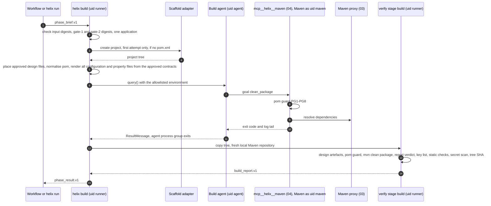
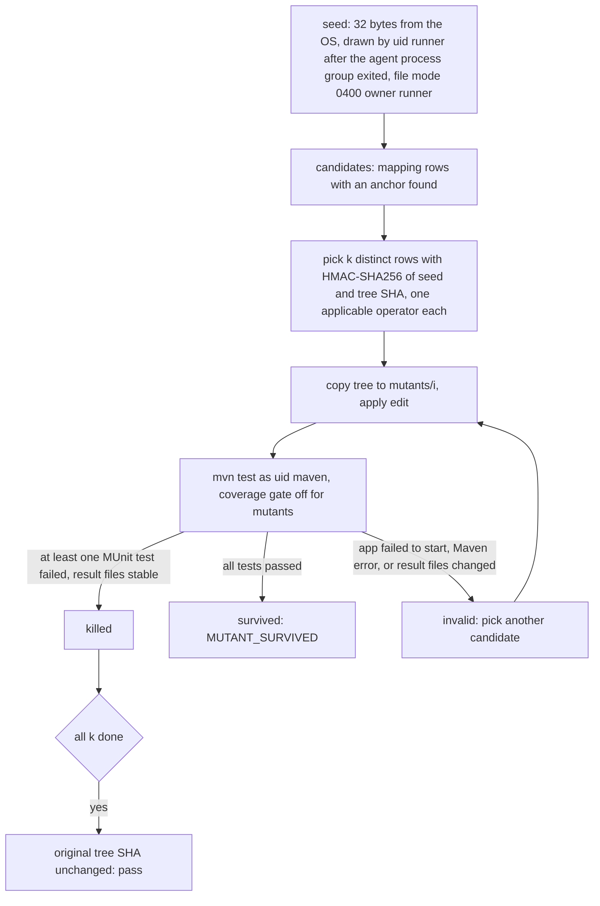
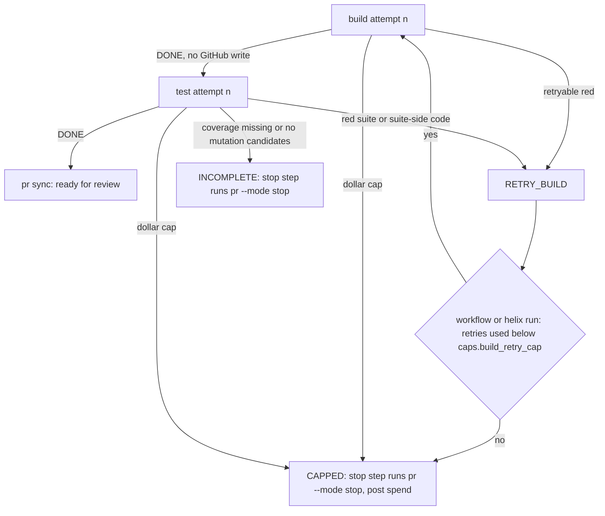
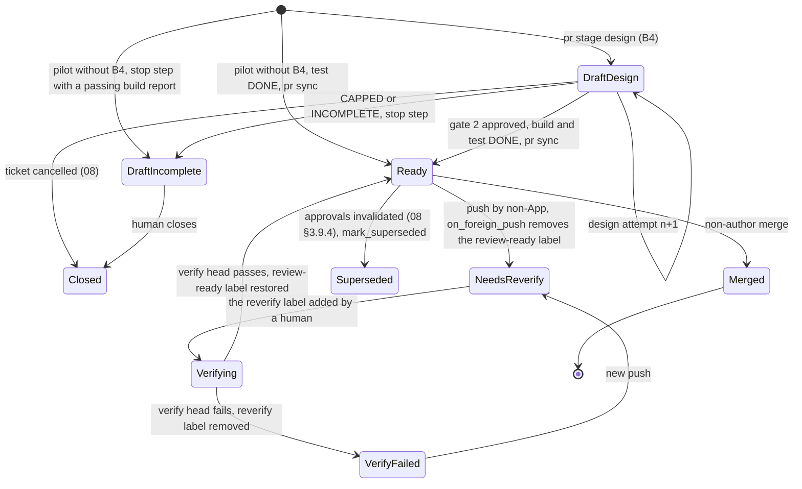

# 07 — B2: Build, test and pull request

## 1. Purpose and scope

Sub-phase **B2**. From a human-confirmed fact sheet and an approved design bundle to a pull request in the client's generated-app repository that a non-author can merge, with evidence a reviewer can trust and the PR-side facts that file 09's measurement needs. This file owns `helix build`, `helix test` and `helix pr`, including `helix pr --stage design`, the gate-2 draft pull request of HLD-P#7. It introduces `helix verify` (agent-free verification, also the head-commit check) and `helix scaffold` (the control-plane scaffold of route `anypoint_cli_cp`). It owns `build_report.v1`, `test_report.v1` and `pr_provenance.v1`, and the contracts of the git-writer functions `helix pr` calls (03 §3.9.2 says that interface is this file's). Not here: intake and Discover (05), design, the ruleset and `design_bundle.v1` (06), the webhook receiver, broker, gateway, Maven proxy and the git writer's process, authentication and HTTP client (03), the agent runner, its tools and envelopes (04), workflow, gate signals and the `gate_approval` table (08), the chain, the meter and the measurement definitions (09), container isolation and egress (10).

## 2. Traceability

| Source | Implemented here |
| --- | --- |
| Plan §0 rules 2 and 3 | Build agent reads the confirmed fact sheet file, never the ticket; a separate test agent; mutation check before a suite is accepted |
| Plan §3.2 (Reads, Writes, Measurement, Exits, Guardrails, Traps) | All of §3 to §5 below |
| Plan §6 | Versions from Exchange and the pom; secrets as placeholders; scanner before every commit; provenance line |
| Plan §3.4 guard | "The LLD's key list equals what `report` finds in B2's generated code": 06's `key_list_diff`, run in `verify` (§3.6) |
| Plan decisions 11, 12 | Caps from the first run (§3.7); the PR-side facts behind acceptance and reviewer minutes (§3.9; definitions in 09) |
| HLD-P#3, #4 | Build agent treated as injectable; requester text quoted as data; pilot agent job separate from control-plane job; environment test over every credential name |
| HLD-P#5 | Golden parent pom, plugin and repository allowlist, pre-build check, proxy-only Maven |
| HLD-P#7, #8 | Draft PR at B4 (`pr --stage design`); gate digests bound in the brief (§3.11.1); design artefacts checked against the gate-2 digest in every verify stage; required check on the head commit started by the `helix:reverify` label; evidence tied to tree and commit |
| HLD-P#9 | Property-file layout, test file of fixture values, MARKER_LEFT scope, key-holder hand-off |
| HLD-P#11, #15, #17, #18 | Client-org repositories; caps per phase attempt; typed outcomes and draft-only untested PRs; PR-side facts for 09's active and elapsed minutes |
| HLD lower bullets | Several mutations picked by the Helix code; GitHub settings checked before each write; chain-head digest in the PR and ticket; standalone validator contracts |
| Review items 6 and 11 | Jira comments templated by code, no free estate text; DX MCP spike pass criteria and DX outputs as untrusted text |

## 3. Design

### 3.1 Modules

| Module (`src/helix/`) | Process class | Responsibility | Tag |
| --- | --- | --- | --- |
| `phases/build.py` | Agent sandbox, uid `runner` | `helix build`: input checks, scaffold, design placement, global config and property files, build agent session, then `verify` stage `build` | `[PLAN]` CLI, `[LLD]` steps |
| `phases/test.py` | Agent sandbox, uid `runner` | `helix test`: test agent session, mutation seed file, then `verify` stage `test` | `[PLAN]` |
| `phases/verify.py` | Agent sandbox class, no agent session; uid `runner`, Maven as uid `maven` | `helix verify`: design-artefact check, pom guard, Maven, report verdict, key-list equality, static checks, mutation, secret scan | `[LLD]` |
| `phases/b2/scaffold.py`, `phases/scaffold.py` | Agent sandbox; control plane on route `anypoint_cli_cp` (`helix scaffold`, §3.11) | `ScaffoldAdapter` with `DxMcpScaffold` and `CliScaffold` | `[PLAN]` routes, `[LLD]` adapter |
| `phases/b2/pomguard.py` | Agent sandbox | Pom guard PG1-PG8 (§3.4.3); called by `verify` and by 04's `mcp__helix__maven` tool before each run | `[HLD-P#5]` |
| `phases/b2/properties.py` | Agent sandbox, uid `runner` | Renders all configuration and test files from the naming contract and approved key list | `[HLD-P#9]` |
| `validation/{design_binding,pom_policy,reference_scan,property_policy,secret_policy,project_policy,report}.py` | Agent sandbox, no agent session | Standalone B2 validation subsystem: design integrity, Maven policy, reference scan, property and marker rules, plaintext-secret detection, generated-tree policy, and deterministic report | Standalone B2 validation decision |
| `phases/b2/staticchecks.py` | Agent sandbox | SC1-SC8 (§3.6): property sources, global properties, literal config values, Java interop, marks, anchors, design artefacts, key list | `[LLD]` |
| `phases/b2/mockguard.py`, `assertguard.py`, `mutation.py` | Agent sandbox | Static suite checks; mutation selection and runs | `[PLAN]` `[HLD-P lower]` |
| `naming.py`, `validation/` | Agent sandbox, no agent session for validation | Compiles and checks naming-contract paths, scans source references, validates key-list equality, markers, plaintext-secret rules, POM policy, and forbidden generated paths without an external estate dependency | Standalone B2 validation decision |
| `phases/pr.py`, `phases/b2/prbody.py` | Control plane | `helix pr` (stages `design` and `code`; modes `sync`, `stop`, `record-merge`): composes the git-writer functions of §3.11; PR body and Jira comment templates | `[PLAN]` |
| `controlplane/gitwriter/` functions of §3.11 | Control plane | The contracts `helix pr` calls (`preflight`, `ensure_branch`, `push_tree`, `open_or_update_pr`, `mark_ready`, `set_labels`, `post_check`, `mark_superseded`) | `[LLD]` |
| `controlplane/gitproof/` | Control plane | The bot-only-approval proof (§3.8.8); not part of the git writer | `[PLAN]` proof, `[LLD]` procedure |
| `agents/definitions/{build,test}/` | — | System prompt and skills list for the two agents; the tool policy is 04's (§3.9) | `[PLAN]` separate agents |

The git writer (`controlplane/gitwriter/`) runs in 03's control-plane process with 03's App authentication, token narrowing and HTTP client (03 §3.9.1). 03 §3.9.2 says its interface is this file's, so §3.11 defines the functions `helix pr` calls; 03 adds `on_foreign_push`, `close_pr` and `get_pr`. This file also says what `helix pr` commits and when, the PR body, what the labels mean and the evidence rules.

### 3.2 Where each step runs

| Step | Pilot (GitHub Action, B2) | Target (B5) | Holds |
| --- | --- | --- | --- |
| `build`, `test` | Agent job, no secret | Agent task queue, one container per activity | Gateway session token; `MAVEN_SETTINGS` (proxy URL only); `ANYPOINT_BEARER` on the DX MCP route only |
| `verify --stage head` | Agent job of the client's pilot workflow, dispatched by 03's receiver when a human adds the `helix:reverify` label (§3.8.7) | Agent-queue activity with no agent session (08's `run_verify_head`) | `MAVEN_SETTINGS` only |
| `helix scaffold`, route `anypoint_cli_cp` only (§3.4.1) | Control job, before the agent job | Control-queue activity before the build activity (08's `run_scaffold_cp`) | Broker-issued bearer of the `build` connected app |
| `pr` (every stage and mode), posting the `verify --stage head` verdict | Control-plane job | Control-queue activity | GitHub App key, Jira bot token |

Rule: a process that runs Maven over agent-written code never holds the GitHub App key, the Jira token or the Nexus credential `[HLD-P#4]` `[HLD-P#5]`. Until HLD-P#4's minimum isolation set exists, the pilot runs only `acme-*` tickets `[HLD-P#4]`.

Inside the sandbox there are three uids, named as in 04 §3.12, which owns the user model: `helix` (uid 10001) for the phase process and for `verify`, `agent` for the Agent SDK CLI and its tools, `maven` for every Maven run, verify's included `[LLD]`. 01 §3.7 and 10 call uid 10001 `runner`; this file follows 04 (§6).

### 3.3 Build agent inputs

| Input | Source | Handed to the agent as | Rule | Tag |
| --- | --- | --- | --- | --- |
| Confirmed fact sheet | `fact-sheet.confirmed.json`, `fact_sheet.v1`: a byte copy of the approved revision `fact-sheet.r{n}.json`, and the only file downstream agents read (05 §3.12). In the B2 pilot, before B3, the hand-confirmed file that 01 §3.9's `control-pre` accepted | Two staged inputs, `fact_sheet_typed` and `fact_sheet_text` (04 §3.4); every requester-derived free-text field is quoted data | Both entries carry `source_sha256` (the file's SHA-256) and `gate1_digest` (the live gate-1 approval's `decided_digest`), written by the activity as 06 §3.3 binds gate 1; S1 compares them (§3.11.1). No `status` check: the confirmed copy keeps the revision's bytes (05 open item 9) | `[PLAN]` file, `[HLD-P#3]` quoting, `[HLD-P#7]` digest |
| Design bundle | `design_bundle.v1` (06), the revision gate 2 approved | `design_bundle_typed` and `design_text` (04 §3.4); the bundle file and its member files (contract, HLD, LLD) also staged runner-only under `/in/design/` for S3 and SC7 | `status` is `complete`; both bundle entries carry `source_sha256` (the bundle file's SHA-256) and `gate2_digest` (§3.11.1); B2 reads the fields in §3.10.4 | `[PLAN]` `[HLD-P#7]` |
| Naming contract and standards bundle | Compiled profile contract and approved bundle, staged as immutable attempt inputs | Naming, environment paths, Maven baseline, logging, property and validator rules | Never `.env`, credentials, or mutable profile paths | Standalone B2 decisions |
| Base tree | Control plane exports, as an archive, the head of `helix/{ticket_key}` when that branch exists (B4's design draft PR), else the default branch head | Repository files | `base_sha` recorded in `build_report.v1`. When the branch exists, its head must hold `docs/design/design-bundle.json` whose SHA-256 equals the gate-2 digest, else `FAILED`, `INPUT_DIGEST_MISMATCH` | `[HLD-P#7]` `[LLD]` |
| Prior evidence | `/in/retry-findings.json` (04 §3.4), retries only | Failure codes, rule ids and `where`, and the last 200 log lines, as quoted data | Never the previous transcript | `[LLD]` |

Never handed to the build agent: ticket text or comments, raw Discover output, any Jira, GitHub, connected-app, Nexus or model-route credential `[PLAN]` `[HLD-P#1]`.

### 3.4 Build phase (`helix build`)



| Step | Action | On failure | Tag |
| --- | --- | --- | --- |
| S1 | 04's preflight checks every staged input's SHA-256 against the brief. Then: both fact-sheet entries carry the same `source_sha256` and it equals `gate1_digest`; both design-bundle entries carry the same `source_sha256` and it equals `gate2_digest`; the bundle's `status` is `complete`. The activity writes these fields from 08's live `gate_approval` rows (§3.11.1); the sandbox never reads the Helix store. The bundle has no digest field of its own: gate 2 binds to the file's SHA-256 (06 §3.13) | `FAILED`: 04's `INPUT_DIGEST_MISMATCH` (staged bytes differ), or `INPUT_NOT_CONFIRMED` (a digest pair is absent or differs) | `[HLD-P#7]` |
| S1b | Read the §3.10.4 fields. A bundle with any application besides the primary one stops here | `INCOMPLETE`, `MULTI_APP_NOT_SUPPORTED`, naming each extra application's `role` and `repository_name` in `phase_result.v1`; the ticket line names the roles only (review item 6; 06 §3.14 likewise keeps a rendered repository name out of its wait line); `INPUT_INCOMPLETE` naming a missing field | `[LLD]` |
| S2 | Parse the bundle's `repo_name` (the primary `applications[].repository_name`, 06 §3.13) with `parse_any_name` (`meridian/naming.py:123`) before use | `FAILED`, `NAME_UNPARSED` | `[PLAN]` |
| S3 | Extract the base tree (§3.3) to `/work/{phase_attempt_id}/repo/`; scaffold only if no `pom.xml` exists. Place the approved contract at `contract.path`, `documents.hld.path`, `documents.lld.path` (`docs/design/hld.md`, `docs/design/lld.md`) and `docs/design/design-bundle.json` from the runner-only copies in `/in/design/` when absent; when present (B4's branch), each file's SHA-256 must equal the bundle's entry, and the bundle file's must equal `gate2_digest` | `FAILED`, `SCAFFOLD_FAILED` or `DESIGN_ARTEFACT_CHANGED` | `[PLAN]` scaffold, `[HLD-P#7]` design files |
| S4 | Normalise the pom to the golden parent; render the global configuration file, the base file, the lowest environment's files and the test files; run `prepare --write` for each higher environment (§3.4.4) | `FAILED`, `RENDER_FAILED`; `INCOMPLETE`, `PREPARE_PROPOSED` | `[HLD-P#5]` `[HLD-P#9]` `[PLAN]` prepare |
| S5 | Retry with suite-side codes only (§3.7) and tree unchanged: skip the session, re-emit the previous `build_report.v1`, outcome `DONE`, no model spend, no Maven | — | `[LLD]` |
| S6 | Build agent session (§3.4.6) | Gateway cap: `CAPPED`; other errors: verification decides | `[PLAN]` |
| S7 | `verify --stage build` in-process (§3.6), started only after the agent's process group has exited | See §4 | `[PLAN]` checks, `[LLD]` isolation |
| S8 | Archive the tree (without `target/`) to the run directory with its SHA-256; write `build_report.v1` and `phase_result.v1` | `FAILED` | `[LLD]` |

#### 3.4.1 Scaffold

| Route | When | Call | Tag |
| --- | --- | --- | --- |
| DX MCP Server (`dx_mcp`) | 02's `toolchain.dx_mcp_route` is `true` (the B1 spike passed) | `DxMcpScaffold` is an MCP stdio client run by the phase process with the broker-issued bearer; tool name `[VERIFY]` | `[PLAN]` |
| Anypoint CLI DX plugin, in the sandbox (`anypoint_cli`) | Otherwise, when the spike record says `dx:mule:project:create` needs no credential | `anypoint-cli-v4 dx:mule:project:create` with `--mule-version {build.mule_runtime}` always passed, because it defaults to 4.4.0; other flags `[VERIFY]` | `[PLAN]` |
| Anypoint CLI DX plugin, in the control plane (`anypoint_cli_cp`) | Otherwise, when the spike record says the command needs a credential (`build.scaffold_needs_credentials`, §3.12) `[VERIFY]` | The same `CliScaffold` call, run by `helix scaffold` (§3.11) as a control-plane activity before the build activity (08's `run_scaffold_cp`), under the broker-issued bearer of the `build` connected app. The resulting tree joins the base archive (§3.3), so S3 finds a `pom.xml` and does not scaffold. The sandbox never receives an Anypoint credential on the fallback route, because 00 §9 allows `ANYPOINT_BEARER` there only on the DX MCP route | `[LLD]`, `[HLD-P#1]` |

Either way the result is normalised by deterministic code: parent set to the golden parent, repository blocks removed, runtime pinned. The agent never chooses the scaffold's versions `[LLD]`. Before normalisation, PG7 runs on the raw scaffold output and the result is recorded as `scaffold.runtime_defaulted` in `build_report.v1`, so a scaffold that ignored `--mule-version` is visible even though normalisation corrects it. `CliScaffold`'s argument list always carries `--mule-version {build.mule_runtime}`; a unit test on the adapter holds it (G2) `[PLAN]` flag, `[LLD]` test.

**Spike pass criteria** `[LLD]` (review item 11, `[HLD-P#1]`). The plan documents the DX MCP Server as offering deploy and API Manager operations as well (plan §0 Terms), so the criterion is about what the agent can reach, not what the server offers. The spike passes only if the server runs headless, accepts a pre-exchanged bearer, runs a pinned version, and works behind the egress allowlist with its outbound hosts recorded; and if Helix can confine the agent to an allowlist of the server's tools: 04's `mcp__dx__<allowlisted>` names plus `disallowed_tools` (04 §3.7, §3.9). A deploy, publish or API Manager call attempted through the sandbox must be refused twice: by the hook (04 `R-DEP-01`, `R-DX-01`) and by the bearer's grants (Exchange read only in B1–B5, 00 §9). DX MCP tool results enter the injection corpus as untrusted text (04 §3.11, §3.16).

#### 3.4.2 Toolchain and versions

| Item | Value | Enforced by | Tag |
| --- | --- | --- | --- |
| Mule runtime | 4.9.x LTS at its current patch, never bare 4.9.0; pinned in `build.mule_runtime`; the exact patch number `[VERIFY]` at implementation | Pom guard PG7; doctor warns when a newer 4.9 patch is visible through the proxy `[VERIFY]` metadata path | `[PLAN]` |
| JDK | 17 only on workers; `mule-artifact.json` declares Java 17 `[VERIFY]` field | Worker image (10); PG7 | `[PLAN]` |
| MUnit | 3.7.4 | Golden parent pin; PG4 | `[PLAN]` |
| Connector versions | From 06's `connectors[]` (Discover's Exchange lookups, 06 §3.13), or a logged `search_asset` result on the DX MCP route | PG5 | `[PLAN]` |
| Other libraries (for example a JDBC driver from Maven Central) | From the bundle's `libraries[]` (asked of 06, §3.10.4) | PG4, PG5 | `[LLD]` |
| Connector operations | From `describe-connector` in the bundle; an invented operation fails at `mvn package` because Mule generates schemas from the pom | Maven | `[PLAN]` |

#### 3.4.3 Golden parent pom and pre-build check `[HLD-P#5]`

Helix ships `templates/golden-parent/pom.xml`. At onboarding the client publishes it, or names its own parent that pins the same items, to its Maven repository; the profile records coordinates and SHA-256 (`build.golden_parent`). The client's own pipeline must resolve it too, so it cannot live only behind Helix's proxy `[LLD]`. The parent pins: `app.runtime`; mule-maven-plugin `[VERIFY]` version, declared with `<extensions>true</extensions>` because `mule-application` packaging needs it `[VERIFY]`; munit-maven-plugin and MUnit libraries at 3.7.4; `runtimeProduct` MULE_EE `[VERIFY]`; the coverage block (`runCoverage` true, `failBuild` true, `requiredApplicationCoverage` = `${helix.coverage.application}`, JSON and HTML formats, element names `[VERIFY]`); MUnit `systemPropertyVariables` setting `{build.env_property}` to `munit` `[VERIFY]`; versions of every lifecycle plugin. Maven settings (`MAVEN_SETTINGS`) hold one mirror of `*` to the proxy URL and no `<servers>` `[HLD-P#5]`.

The pom guard runs before every Maven run: inside 04's `mcp__helix__maven` tool, which calls `pomguard.check(repo_dir, bundle, lookup_log)` before it starts Maven (04 §3.9.1), and at the start of each `verify` stage. It returns the list of findings below; any finding refuses the run.

| ID | Check | Failing fixture | Code |
| --- | --- | --- | --- |
| PG1 | `<parent>` equals `build.golden_parent` group, artifact and version; `<relativePath/>` empty | Parent version differs | `POM_PARENT_MISMATCH` |
| PG2 | No `<repositories>`, `<pluginRepositories>`, `<distributionManagement>` | Repository `https://repo.acme-evil.test` | `POM_REPOSITORY_DECLARED` |
| PG3 | Every plugin on `build.plugin_allowlist`; no `<version>` unless equal to the parent's pin; no `<executions>` | `org.codehaus.mojo:exec-maven-plugin` | `POM_PLUGIN_NOT_ALLOWED` |
| PG4 | No `<configuration>` override of the Mule or MUnit plugins, except one `sharedLibraries` block on mule-maven-plugin (element names `[VERIFY]`) whose every entry names a dependency listed in the bundle's `libraries[]` and declared in the pom; no redefinition of a parent-pinned property (`app.runtime`, `munit.version`, `helix.coverage.*`) | `<helix.coverage.application>0`; a `sharedLibraries` entry for an unlisted artifact | `POM_PIN_OVERRIDDEN` |
| PG5 | Each dependency version from `connectors[]`, `libraries[]`, the parent, or the session lookup log; no `system` scope or `systemPath` | Connector at a version no lookup returned | `POM_VERSION_UNSOURCED` |
| PG6 | No `/project/profiles`, `/project/modules` or `/project/build/extensions` element; no `.mvn/` directory; no `mvnw`. A plugin-level `<extensions>true</extensions>` is not matched; the parent declares it for mule-maven-plugin | `.mvn/extensions.xml`; a `/project/build/extensions/extension` entry | `POM_EXTENSION` |
| PG7 | Runtime equals `build.mule_runtime` in pom and `mule-artifact.json`; matches `^4\.9\.[0-9]+$` and is not `4.9.0` | A pom with runtime 4.4.0, as a scaffold run without `--mule-version` gives | `POM_RUNTIME_PIN` |
| PG8 | No file under `src/main/java/**`. 06's bundle has no field that lists Java sources, so in B2 none is allowed; an allowlist field is a cross-file item (§6) | `src/main/java/AcmeHelper.java` | `JAVA_SOURCE_UNLISTED` |

Plugin allowlist default: `org.mule.tools.maven:mule-maven-plugin` and `com.mulesoft.munit.tools:munit-maven-plugin` in the project pom; lifecycle plugins only through the parent `[LLD]`. PG4's `sharedLibraries` exception and PG6's scope exist because an ordinary database integration declares its driver as a shared library of mule-maven-plugin `[VERIFY]`.

#### 3.4.4 Property files `[HLD-P#9]`

The safety-relevant files are written by the Helix code, never by the agent, so they carry no model discretion `[LLD]`: the global configuration file, the base file, the lowest environment's files and the test files are rendered from the key list; the higher environments' files are written by Meridian's `prepare` `[PLAN]` (plan §3.2 Reads). Flows read plain keys as `${key}` and secrets as `${secure::key}`, which Meridian's scan records as declared secrets (`meridian/references.py:548-556`), so SECRET_PLAINTEXT can fire. Each key's class is 06's `keys[].class` (§3.10.4). E1..En are 06's `environments[]`, in its order (the profile's order, at least two).

**Classpath directory** `[LLD]`. `cp_dir` is the profile's `config_dir_in_repo` (Meridian's default `src/main/resources/config`, `tenant.py:526`) with its `src/main/resources/` prefix removed, for example `config`. Mule's `file` attribute names a classpath resource `[VERIFY]`, and Meridian reads a literal `file=` from `src/main/resources/` (`references.py:318-341`, `RESOURCES_DIR`), so a repository-relative value would load nothing and every base-file key would read as undefined. S4 refuses a `config_dir_in_repo` outside `src/main/resources/` with `RENDER_FAILED`. S4 also needs the staged naming profile to carry the client's `config_dir_in_repo` and `config_files` (06 §3.9 and 01 §3.5.2 ask 04 for both): the bridge checks they equal those in `/in/meridian/tenant.overlay.yaml`, else `RENDER_FAILED`.

**Global configuration** `[LLD]`. S4 renders `src/main/mule/global-config.xml`, which holds exactly these elements and nothing else; the agent may not write it (§3.4.6), and SC1 (§3.6) refuses any other property source:

| Element | Attribute values |
| --- | --- |
| `<configuration-properties>` for the base file | `file="{cp_dir}/config.yaml"` |
| `<configuration-properties>` for the environment file | `file="{cp_dir}/{names.config_file_for_token('${' + build.env_property + '}', secure=False)}"`, for example `config/config-${env}.yaml` under Meridian's built-in shape `config-[secure-]{env_prefix}{token}.{ext}` (`config_files.py:37`) |
| `<secure-properties:config>`, rendered only when a `secret` key exists | `file=` the same expression with `secure=True`, for example `config/config-secure-${env}.yaml`; `key="${secure.key}"` (element and attribute names `[VERIFY]`) |

Meridian treats the two placeholder names in these expressions (`{build.env_property}` and `secure.key`) as supplied at deployment (`references.py:411-425`, `deployment_keys`), so they never count as unresolved. 06's equality counts them, so the bundle lists both as `class: deployment` keys (06 §3.10 and its G12); a bundle without them fails SC8.

| File | Path | Holds | Written by | Marks allowed | Read by |
| --- | --- | --- | --- | --- | --- |
| Base | `{config_dir_in_repo}/config.yaml`, loaded by the literal name `{cp_dir}/config.yaml` | Every `invariant` key with 06's `value` (filled by 06's code from `fact_ref` where set, 06 §3.10) | Rendered (S4) | None (`MARK_IN_BASE_FILE`) | Mule; `report` as a shared file defining the key in every environment (`references.py:318-341`) |
| Lowest environment E1 | `names.config_file_path(E1)` (`naming.py:329`) | Every `env_specific` key used in E1 as `${MERIDIAN_SET_E1}`; always written, empty map if no such key, because `prepare` needs it as its source | Rendered (S4) | SET, on owed cells only | `report` (MARKER_LEFT expected there); key holder after merge |
| Lowest environment E1, secure | `names.config_file_path(E1, secure=True)` | Every `secret` key used in E1 as `${MERIDIAN_ENCRYPT_E1}`; written only when such a key exists | Rendered (S4) | ENCRYPT, on owed cells only | Same |
| Higher environments E2..En, plain and secure | Where `prepare` writes them: beside the source file, named by the environment's shape (`prepare.py` `_target_path_for`) | The same keys, as `prepare` marks them under the gate rulebook | `prepare --write` (S4, below) | SET or ENCRYPT, on owed cells only; never PROPOSED (`PREPARE_PROPOSED`) | Same |
| Test, plain and secure | `src/test/resources/{cp_dir}/` + `names.config_file_for_token("munit", secure)`, so `{build.env_property}` = `munit` loads them; the secure one only when a `secret` key exists | A fixture value for every key the code reads except `{build.env_property}`: 06's `fixture`; when null, `acme-fixture-{key}` for a `string` key, `1` for `integer` and `number`, `false` for `boolean`, `https://acme-fixture-host.test/` for `url`, `acme-fixture-host.test` for `host`, `8081` for `port` (06's `type` enum, 06 §3.10) `[LLD]` | Rendered (S4) | None (`MARK_IN_TEST_FILE`) | MUnit only, from the test classpath `[VERIFY]`; never deployed |

`<E>` is Meridian's environment key in upper case, never a platform name (`meridian/markers.py`, module docstring). Mule refuses to start on a mark, by design, so an unfinished file cannot deploy `[PLAN]`. In the test secure file plain fixture values pass through the secure-properties module unencrypted `[VERIFY]`. Filling marks is the client's **key-holder step after merge and before deploy**, owned by the release owner; the PR body lists every owed cell (§3.8.5) `[HLD-P#9]`. No agent encrypts anything `[PLAN]`. The test files use `config_file_for_token` rather than `naming.config_file_path`, because the latter accepts only known environment keys and raises `KeyError` for `munit` (`naming.py:329-335`, `settings.py:858-864`). Meridian guarantees that the plain and secure names differ: its loader refuses a first config-file shape without a `[secure marker]` (`config_files.py:194-201`) and records a `problems` entry, which the bridge's profile check refuses (04 §3.9.2 step 4).

**Higher environments: `prepare --write`** `[PLAN]` file writer, `[LLD]` the guard on it. In S4, after E1's files are rendered, the phase process runs, for i = 1..n-1 in order, each over a fresh staged copy of the tree without `src/test/` at `R/{repo_name}/`:

`meridian prepare --app {repo_name} --source E_i --target E_i+1 --rules /in/meridian/compare.gate.yaml --repo-root R --inventory-dir N --write --json` (`cli.py:901-973`; parser `cli.py:5430-5449`; common flags `cli.py:5138-5144`)

**Source marks are emptied first** `[LLD]`. In the staged copy, every value of E_i's files that is a mark (`markers.parse`) is replaced by an empty value before `prepare` runs. Meridian's token swap reads the environment token inside a mark: `analyze.detect_env_reference` matches `dev` in `${MERIDIAN_SET_DEV}` because `_` and `}` are not word characters (`analyze.py:687-706`), and `token_swap` then rewrites it (`prepare.py:169-217`), so `prepare` would propose `${MERIDIAN_PROPOSED_SIT:${MERIDIAN_SET_sit}}` for every env-specific key. An empty value is extracted as `<EMPTY>` (`extract.py:55`), a sentinel `_decide_new` never swaps (`prepare.py:80`, `prepare.py:298-299`). The emptying touches only the staged copy; the tree keeps E_i's marks.

It then copies each file the JSON lists under `drafts[]` with `written: true` into the tree. With the gate rulebook (below) every key in the file is classified, so `prepare` copies no secret and marks ENV-SPECIFIC keys `${MERIDIAN_SET_<E>}` and every key of a secure file `${MERIDIAN_ENCRYPT_<E>}` (`prepare.py:277-317`, `_decide_new`). It can still write a PROPOSED mark when it finds evidence for a token swap or a value other applications agree on (`prepare.py:296-337`); after the emptying, only an unclassified key with a value could reach that path, so the guard below stays as a second layer. Any PROPOSED mark in a value of a written file (marks parsed with `markers.parse` over the flattened values, comments excluded) gives `PREPARE_PROPOSED`, `INCOMPLETE`, naming the key and environment, so a source value is never proposed into a higher environment. `prepare` carries every key of E_i into E_i+1, so before copying a written file back the phase process removes, by key, any key the key list does not use in E_i+1, and records it in `prepare_writes[].removed[]`; the report verdict then checks the result like any other file. Exit 1 from `prepare` is expected, because a file with marks is not READY. The owner may instead approve rendering E2..En from the key list as E1 is rendered (§6, a deviation from `[PLAN]`).

**Deployment properties.** The bundle's `deployment_property_keys[]` are written into the profile's `tenant.yaml` `deployment_properties:` so the resolver satisfies them by the profile layer (`resolve_reference`, `meridian/analyze.py:910-981`) `[PLAN]`. In `build` and `verify` they come from the run overlay (`runs/{ticket_key}/tenant.overlay.yaml`: 06 writes it, 07 stages it, 02 §3.10), staged as below `[LLD]`. The durable write is 02's `profile.deployment_keys.append(profile_dir, keys, run_id=...)` (02 §3.10: profile lock, backup, round-trip edit, validation, restore on failure), called by `pr --mode record-merge` (§3.9); a refused or failed append gives `INCOMPLETE` `[LLD]`. Writing at merge keeps an unmerged design from widening a tenant-wide list that masks REFERENCED_NOT_DEFINED in other applications (a timing deviation from `[PLAN]` awaiting the owner, 02 §3.10).

**Where Meridian runs in the sandbox** `[LLD]`. This is an exception to 00 §9 ("set only in control-plane processes"), which 01 §3.5.2 also proposes. 04 §3.9.2 item 6 already lets post-session Meridian CLIs take their own child environment; 07 also runs `prepare --write` before the session (S4), when no agent process exists yet, which 04 is asked to add (§6). `report` and `prepare` run only as child processes of the phase process or of `verify`, as uid `runner`, before the agent session starts (S4), after the agent's process group has exited (verify), or with no agent at all (stage `head`). Each child's environment is 01 §3.5.2's offline column, built from scratch and passed only as the child's `env`: `MERIDIAN_TENANT_PROFILE`, `MERIDIAN_ENVIRONMENT_MAP` and `MERIDIAN_COMPARE_CONFIG` name the runner-only files below, `MERIDIAN_HOME` a fresh scratch directory, and no connected-app variable is set. `MERIDIAN_COMPARE_CONFIG` names the same rulebook the call passes with `--rules`: the gate rulebook for the verdict and for `prepare --write`, the client's for the advisory checklist. `--rules` decides the comparison (`rules.load`, `cli.py:367`, `cli.py:911`), but Meridian's internal loads without a path read the variable (`history.py:692`, `readiness.py:346`), so both name one file. No `MERIDIAN_*` variable ever enters the phase process's own `os.environ`, so 04's `assert_process_env()` still holds.

| What | Staged by | Path | Owner, mode | Holds |
| --- | --- | --- | --- | --- |
| Tenant profile | Activity | `/in/meridian/tenant.overlay.yaml` (01 §3.5.2) | `helix`, 0400, in `/in` (0500, read-only, 04 §3.12) | 02 §3.10's run overlay, byte for byte: the profile's `tenant.yaml` with the run's deployment-property keys appended. Unlike 04's naming profile it keeps `config_files`, `config_dir_in_repo` and `deployment_properties`, which `report` needs |
| Environment map | Activity | `/in/meridian/environments.yaml` | Same | The client's `environments.yaml` |
| Client rulebook | Activity | `/in/meridian/compare.yaml` (01 §3.5.2) | Same | The client's `compare.yaml`, byte for byte, used only for the advisory checklist |
| Gate rulebook | Activity, rendered by `report.gate_rulebook(bundle)` | `/in/meridian/compare.gate.yaml` (07's addition to 01's set, §6) | Same | Below |
| Meridian home | Phase process or `verify`, at run time | A `mkdtemp` directory under `/work/{id}/` | `helix`, 0700 | Scratch: the evidence register and history `report` writes (`cli.py:587-600`) land here and are discarded; the client's Meridian state directory is never mounted (03 §3.6.4) |
| Report root, inventory | Same | `R/{repo_name}/` and `N` in a second `mkdtemp` directory; `N` does not exist (01 §3.5.3) | `helix`, 0700 | A copy of the tree; no inventory, so no `classification.csv` is read |

`/in/**` is outside the agent's read scope and denied with a stop (04 `R-SEC-01`); uid `agent` and uid `maven` cannot read `helix`'s 0700 directories. The scratch directories are made with `mkdtemp` after the agent's process group has exited (or before the session, for S4), so no path the agent created in the group-writable `/work/{id}` is reused.

**Gate rulebook** `[LLD]`. In Meridian a finding's severity comes from `compare.yaml`: a per-key `severity:`, else the per-type `severity:` block, else the shipped default (`rules.py:517-518`, `analyze.py:296-310`). A low-confidence classification turns any finding ADVISORY (`analyze.py:725-738` `_adjust_severity`; an unclassified key is `Classification(key, UNCLASSIFIED, LOW, "default")`, `classify.py`). A key classified `ignore` is skipped by the reference rule (`analyze.py` `_reference_exceptions`, near line 1036). So a client's rulebook could weaken the plan's guards silently. The gate report therefore runs under a rulebook rendered from the approved key list:

- `keys:` one exact entry per key of the primary application: `invariant` → `match`, `env_specific` → `differ`, `secret` → `secret`; deployment keys get no entry (the profile layer resolves them);
- no per-key `severity`, no `ignore`, no `apps:` block;
- a `severity:` block pinning `REFERENCED_NOT_DEFINED`, `SECRET_PLAINTEXT`, `MARKER_LEFT`, `SECRET_MISSING` and `MISSING_IN_TARGET` to `CRITICAL`, with `criticality_bump: false`.

Syntax per `rules.py` (`_parse_severity_block`, lines 673-688) and `docs/compare-config-design.md` sections 2-3; G21 pins it. The verdict below also matches the gating types by `exception_type`, whatever their severity, so it does not depend on the severity block alone.

**Report verdict.** `meridian_bridge.report.verdict()`:

1. Stage the tree at `R/{repo_name}/` (table above) as a copy without `src/test/`, `target/`, `.git/`.
2. Run `meridian report --repo-root R --inventory-dir N --output-dir O --environments E1,...,En --rules /in/meridian/compare.gate.yaml --fail-on CRITICAL --csv` with cwd a scratch directory and the child environment above. Flags and exits: `meridian/cli.py:5407-5428`, `cli.py:363-680`; exit codes 0, 1, 2 (`cli.py:53-55`).
3. Read `O/drift_exceptions.csv` (columns `analyze.DRIFT_EXCEPTION_COLUMNS`, `analyze.py:187-192`) and the `Source scanned`, `Registered:` and `History:` lines (`cli.py:628`, `cli.py:659-660`); a contract test pins their text against the pinned Meridian (HLD lower bullet on Meridian's surface). Exit 0 versus 1 is not read as the verdict; only exit 2 and the two lines are.

| Condition | Verdict | Code |
| --- | --- | --- |
| Exit 2: no rulebook, unknown environment, fewer than two environments, nothing extracted, every name unparsed | incomplete | `REPORT_ERROR` |
| `Registered:` or `History:` line says not recorded (`cli.py:675-676` exits 1 for these) | incomplete | `REPORT_UNREGISTERED` |
| Source not scanned | incomplete | `REPORT_NOT_SCANNED` |
| Any row whose `exception_type` is `REFERENCED_NOT_DEFINED`, `SECRET_PLAINTEXT` or `SECRET_MISSING`, whatever its `severity` | fail | `REPORT_<TYPE>` |
| `MISSING_IN_TARGET` on a cell where the key list uses the key in that environment, whatever its `severity` | fail | `REPORT_MISSING_IN_TARGET` |
| `MARKER_LEFT` on a cell the key list does not owe | fail | `MARK_UNEXPECTED` |
| An owed cell without `MARKER_LEFT` (a value was written where a mark belongs) | fail | `MARK_EXPECTED_MISSING` |
| Any other row of severity `CRITICAL` | fail | `REPORT_<TYPE>` |
| Otherwise | pass | — |

MARKER_LEFT is raised once per marked cell and withdrawn from every other rule (`analyze.py:386-406`), so expected marks never double as SECRET_PLAINTEXT or MISSING_IN_TARGET. MISSING_IN_TARGET on a cell where the key list does not use the key is expected and listed. REFERENCED_NOT_DEFINED is raised where no layer defines a key the code reads (`analyze.py:1004-1053`); a key the LLD did not name stays a failure `[PLAN]`. The runtime-collection layer reads *not checked* with a scratch `MERIDIAN_HOME`, which the PR states as a note, never as an accepted CRITICAL `[PLAN]`. Other rows are listed in the PR, not failing `[LLD]`.

**Advisory checklist with the client's rulebook** `[LLD]`. `verify --stage build` also runs `meridian prepare --app {repo_name} --source E_i --target E_i+1 --rules /in/meridian/compare.yaml --repo-root R --inventory-dir N --json` per adjacent pair, without `--write`, with E_i's marks emptied in the staged copy as above. Its stdout carries the rulebook banner line before the JSON document (`cli.py` `cmd_prepare`: `print(f"  {rulebook_banner(config)}")` runs before `json.dumps`), so the bridge takes the JSON from the first line that starts with `{` to the end; G21 pins the banner and the JSON keys. Each checklist row's `bucket` (`prepare.py:59-66`) is compared with the key's class:

| `bucket` | Key-list class | Note |
| --- | --- | --- |
| `COMMON` | `invariant` | `agrees` |
| `ENV-SPECIFIC` | `env_specific` | `agrees` |
| `SECRET` | `secret` | `agrees` |
| `COMMON`, `ENV-SPECIFIC` or `SECRET` against another class | — | `RULEBOOK_DISAGREES` |
| `UNDECIDED` | any | `RULEBOOK_UNDECIDED` |
| `OBSOLETE`, `IGNORED` | any | `RULEBOOK_DISAGREES` |

All notes are advisory and go to the key holder's checklist in the PR. `prepare` reads only environment files (`prepare.py` `_files_for`), so base-file keys never appear in it; they are compared through `report`'s matrix only. Exit 1 is expected.

#### 3.4.5 Secret scanner

gitleaks `[LLD]` (version and rule file `[VERIFY]`), default rules plus Helix rules for connected-app secrets and Anypoint bearer shapes. The only allowlisted value pattern is `^acme-fixture-[a-z0-9.-]+$` in test files. It runs at the end of every `verify` stage, over the PR body and comment text before posting, and authoritatively over the exact tree before `push_tree` (§3.11), which refuses a tree whose scan digest it has not seen `[PLAN]` scanner before commit, `[LLD]` placement. A finding is `SECRET_FOUND`, outcome `FAILED`: a credential-shaped string in generated output is treated as possible exfiltration, not as a fix to retry `[LLD]`.

#### 3.4.6 Build agent definition

| Item | Value | Tag |
| --- | --- | --- |
| Environment | Exactly the conventions' §9 allowlist for `build` | `[HLD-P#1]` `[HLD-P#2]` |
| Tools | 04 §3.9's build column, unchanged: `Read`, `Write`, `Edit`, `Glob`, `Grep`, the allowlisted Bash utilities (no `git`, no `mvn`), `TodoWrite`, the `mcp__helix__` tools that column lists, among them `maven` with goals `clean_compile`, `clean_package` and `dependency_tree`, and `mcp__dx__<allowlisted>` on the DX MCP route only. 07 adds no tool (04 §3.9 drops `connector_catalog` and `check_properties`): the agent reads 06's `connectors[]` and key list from `design_bundle_typed` with `Read` or `json_query`, and learns of property faults from verify's codes on a retry | 04 owns; `[LLD]` |
| Write scope | 04 §3.9's build scope, with these further denials that 07 asks 04 to add (§6): `repo/src/main/mule/global-config.xml`; `repo/src/main/resources/api/**` (the approved contract); `repo/docs/design/**`; every `*.yaml`, `*.yml` and `*.properties` under `repo/src/main/resources/`; `repo/src/main/java/**` | `[LLD]`, `[HLD-P#7]` design files |
| Maven | Only through 04's `mcp__helix__maven`, which runs Maven as uid `maven` after 07's pom guard PG1-PG8 (§3.4.3) | 04, `[HLD-P#5]` |
| Mapping anchors | Every mapping lives in `src/main/resources/dwl/{dwl_module}.dwl` (06's `mappings[].dwl_module`, for example `order-to-wms`), one target field per line, ending `// map:{id}` with 06's `MAP-nnn` id, for example `// map:MAP-001`; comment syntax `[VERIFY]` | `[LLD]`, needed by §3.5.3 |
| Skills | 04 §3.13 owns the build skills list; 07 supplies the content of `placeholders.md` (the layout of §3.4.4) and the anchor rule above for `dataweave-style.md` | `[LLD]` |

### 3.5 Test phase (`helix test`)

Inputs: the confirmed fact sheet, the design bundle, the passing `build_report.v1` and its project archive, and on retries the prior evidence below. The test agent is a separate session that never sees the build agent's transcript `[PLAN]`. Its tools are 04 §3.9's test column, with `maven` goals `clean_test` (optional `suite`) and `dependency_tree`.

| Input (retries only) | Source | Handed to the agent as | Rule | Tag |
| --- | --- | --- | --- | --- |
| Prior evidence | The previous `test_report.v1`, through `/in/retry-findings.json` (04 §3.4) | Quoted data: failure codes with their rule ids (AG1-AG4, MG1-MG3, `COVERAGE_*`), the test names each AG or MG finding names, the coverage figure, and the count of surviving mutants | Never which mutants survived: no mapping id, operator, file or line, so the selection stays hidden from the suite's author; never the previous transcript | `[LLD]`, `[HLD-P lower]` |

| Rule | How it is held | Tag |
| --- | --- | --- |
| MUnit 3.7.4 from the confirmed requirement with concrete expected values | Assertion guard AG1-AG4; mutation check | `[PLAN]` |
| Coverage threshold on with `failBuild` | On by construction in the golden parent; the threshold passed as `-Dhelix.coverage.application={test.coverage.application_percent}`; PG4 stops a pom override; `verify` also parses the coverage report and compares | `[PLAN]` rule, `[LLD]` mechanism |
| Never mock the processor under test | Mock guard MG1-MG3 | `[PLAN]` |
| `mvn test` against the EE runtime | Golden parent `runtimeProduct`; EE repository reached through the proxy, which adds the Nexus credential `[HLD-P#5]` | `[PLAN]` |
| Test agent writes only tests | 04's write scope allows only `src/test/munit/**` and `src/test/resources/{expected,payloads}/**`; `verify` checks the `src/main/`, pom and design-artefact digests equal the build report's (SC7) | `[LLD]` |

#### 3.5.1 Assertion guard

| ID | Rule | Code |
| --- | --- | --- |
| AG1 | Every `munit:test` has at least one `assert-that` or `assert-equals` | `ASSERTION_MISSING` |
| AG2 | Each assertion's expected side is a literal or a file under `src/test/resources/expected/`; a matcher such as `notNullValue()` alone does not count (matcher names `[VERIFY]`) | `ASSERTION_NOT_CONCRETE` |
| AG3 | Each test's `description` carries `covers: MAP-001,MAP-002` (06's mapping ids, `^MAP-[0-9]{3,}$`); every mapping of the primary application (`app_role` equal to its `role`) is covered at least once | `MAPPING_UNCOVERED` |
| AG4 | Each assertion's actual side is an expression over the `munit:execution` output only: `payload`, `vars`, `attributes` or `error` (expression names `[VERIFY]`). No test reads a main resource: no `readUrl` or other `classpath:` read of `dwl/`, `api/` or any `*.xml`, and no file connector pointed at `src/main` | `ASSERTION_ON_SOURCE` |

AG4 exists because a test can read a mapping's own source and assert it equals a literal: that satisfies AG2 and kills every mutant without testing behaviour `[LLD]`.

#### 3.5.2 Mock guard

The processor under test, for one test, is every processor in the flow its `munit:execution` calls, followed through `flow-ref` into the application's own flows and sub-flows, except connector operations that match an entry of 06's `external_calls[]` by element and `config-ref` (`{element}@{config_ref}`, for example `http:request@acme-wms-config`), which are the boundary. An empty `external_calls[]` on a bundle with `connectors[]` ends the test stage `INCOMPLETE`, `INPUT_INCOMPLETE`, because the boundary is unknown.

| ID | Rule | Code |
| --- | --- | --- |
| MG1 | A `mock-when` may match only processors in `external_calls[]` | `MOCKED_PROCESSOR_UNDER_TEST` |
| MG2 | A mock of `flow-ref`, `ee:transform`, `set-payload`, `set-variable`, `choice` or `apikit:router` reached by the test is a violation | Same |
| MG3 | A mock whose attributes match several processors fails if any match is not external | `MOCK_AMBIGUOUS` |

#### 3.5.3 Mutation check `[HLD-P lower]`

The plan's test agent runs one mutation of its own choosing; here the Helix code picks several from the LLD's mapping list, and the suite's author never learns which `[HLD-P lower]`.

Operators work on the anchored line in the code and use 06's `mappings[].kind` (`field`, `condition`) and `target_type` (`string`, `number`, `boolean`, `date`, `object`, `array`), 06 §3.13 `[LLD]`. `CONST`, `DROP` and `NEGATE` always change the field's value or presence; `SWAP` takes only a row whose anchored expression differs in text, though two different expressions can still compute one value for a given input (a surviving mutant is then reviewed, not hidden).

| Operator | Applies to mapping `kind` | Edit on the anchored line |
| --- | --- | --- |
| `CONST` | `field` whose `target_type` is `string`, `number` or `boolean` | `string`: expression replaced by `"acme-mutant"`; `number`: `expr` becomes `(expr) + 1`; `boolean`: `expr` becomes `not (expr)` |
| `SWAP` | `field` with another anchored row of the same `target_type` | Expression replaced by that row's expression, read from its anchored line in the code |
| `DROP` | `field` | Line removed, so the field is absent |
| `NEGATE` | `condition` | `expr` becomes `not (expr)` |



- `k` = `min(test.mutation.count, rows)`. Zero candidate rows gives `MUTATION_NO_CANDIDATES`; candidates exhausted before `k` valid mutants gives `MUTATION_INVALID`. Both are `INCOMPLETE` `[LLD]`.
- Each mutant runs in its own copy, so the original is never edited. The plan's "restore, expect green" is met by the original's own green run before the mutants and an unchanged tree SHA after them. This avoids a restore step that could itself go wrong `[LLD]`.
- Mutants run with `-Dhelix.coverage.application=0`, so a coverage drop is not mistaken for a kill. Kills are counted from the MUnit result files only `[LLD]`.
- Result integrity `[LLD]`: agent-written code runs inside the MUnit JVM, so Maven runs as uid `maven` in its own process group. When Maven exits, `verify` hashes the result and coverage files, kills the process group, and hashes them again; a difference makes that run invalid. The seed file and the report output directory are `helix`-only, so code in the JVM cannot read the seed or write the report. PG8 and SC4 (§3.6, over `src/main/` in stage `build` and over `src/test/` in stage `test`) refuse Java sources and Java interop, so agent code has no general file access to begin with.
- The seed is delivered as a file, never an environment variable, because 04's `assert_process_env()` requires the phase process's environment to equal the allowlist. In stage `test`, `helix test` creates it after the agent's process group has exited and before it starts `verify`; in stage `head`, `verify` creates it. A copy goes to `/out/` for replay by the control plane; the report carries only its SHA-256 `[LLD]`.
- A fresh seed is drawn per verification, so a retried suite cannot be tuned to the last attempt's mutants `[LLD]`.

### 3.6 Verification isolation (`helix verify`)

The evidence in the PR comes from `verify`, never from an agent's own run `[PLAN]` §0.

| Property | How | Tag |
| --- | --- | --- |
| No agent present | Stages `build` and `test` run after the Agent SDK process group has exited; stage `head` runs in a fresh container with no agent session | `[LLD]` |
| Separate identity | The phase process and `verify` run as uid `runner`; the Agent SDK CLI and its tools as uid `agent` (04 §3.12); every Maven run, verify's included, as uid `maven` through the same `setpriv` drop as 04's `maven` tool (04 §3.9.1). The seed file, `/in/meridian/` and the report output directory are `helix`-only (0400, 0500, 0700), so neither `agent` nor `maven` can read them | `[LLD]` |
| Clean inputs | Tree copied without `target/` into a fresh `mkdtemp` directory `V` under `/work/{id}/`, made after the agent's process group has exited; `-Dmaven.repo.local=V/m2` so nothing the agent placed in its local repository is reused | `[LLD]` |
| Same toolchain | Same `MAVEN_SETTINGS`, JDK 17, golden parent | `[HLD-P#5]` |
| Evidence identity | `tree_sha` = `git write-tree` of the verified tree (honouring `.gitignore`), in a temporary index with no network; stage `head` also records the `head_sha` it verified | `[HLD-P#8]` |

Static checks `[LLD]`, run by `phases/b2/staticchecks.py` over the verified copy:

| ID | Check | Code | Side |
| --- | --- | --- | --- |
| SC1 | `global-config.xml` equals the rendered file byte for byte, and no other file holds a `<configuration-properties>` or `<secure-properties:config>` element (element names `[VERIFY]`). An extra literally named file would resolve keys as a shared file, and Meridian reads only the key names of shared files, never their values (`references.py:318-341`), so its values would escape every report rule | `PROPERTY_SOURCE_UNEXPECTED` | build |
| SC2 | No `<global-property>` element anywhere: it resolves a key by the code itself (`references.py` `SourceScan.defined`; `analyze.py:910-981`) | `GLOBAL_PROPERTY_DECLARED` | build |
| SC3 | On elements whose name ends in `config` or `connection`, attributes named `host`, `port`, `url`, `username`, `password`, `clientId`, `clientSecret` or `token` hold a `${...}` reference, not a literal (connector schemas `[VERIFY]`) | `LITERAL_CONFIG_VALUE` | build |
| SC4 | No Java interop: no `java!` import in a DataWeave file, no Java module or Scripting module element (syntax and element names `[VERIFY]`); `src/main/java/**` is PG8's | `JAVA_INTEROP` | build |
| SC5 | Base and test files hold no mark (values parsed with `markers.parse`) | `MARK_IN_BASE_FILE`, `MARK_IN_TEST_FILE` | build |
| SC6 | Every mapping of the primary application has its `// map:{id}` anchor in `src/main/resources/dwl/{dwl_module}.dwl` | `MAPPING_ANCHOR_MISSING` | build |
| SC7 | The contract at `contract.path`, `documents.hld.path`, `documents.lld.path` and `docs/design/design-bundle.json` each have the SHA-256 the approved bundle records (for `design-bundle.json`: `gate2_digest`) | `DESIGN_ARTEFACT_CHANGED` | `FAILED` in `build` and `test` (the agent cannot write these paths, so a change is a policy breach); failure in `head` |
| SC8 | 06's `key_list_diff(bundle, scan)` over `references.scan_application(repo_dir)` (06 §3.10) is empty and `scan.dynamic` is empty. `scan_application` returning `None` (no source at all) is 06's `KEY_SCAN_NO_SOURCE` | `KEY_LIST_MISMATCH` (names both differences), `DYNAMIC_REFERENCE`; `KEY_SCAN_NO_SOURCE` is `INCOMPLETE` | build |

"Build" in the side column means the code is a build-side code: `RETRY_BUILD` (§3.7, §4).

| Stage | Runs | Writes |
| --- | --- | --- |
| `build` | SC7, PG1-PG8, `mvn -B clean package` with MUnit skipped (property name `[VERIFY]`), report verdict, SC8, advisory `prepare` checklist, SC1-SC6, secret scan | `build_report.v1` |
| `test` | SC7, main-tree and pom digests unchanged, PG1-PG8, SC4 over `src/test/` (a suite-side code there), `mvn -B clean test` with coverage, results and coverage parsed, AG1-AG4 and MG1-MG3, mutation check, secret scan | `test_report.v1` |
| `head` | SC7 first. If the head tree equals the evidence tree of a passing `test_report.v1`, reuse it with no Maven run; otherwise both stages in full with a fresh seed. Phase attempt id `{run_id}.verify.{n}` (a `verify` value for 00 §6's `phase` enum, §6) | Both reports with `stage: head` and `head_sha` |
| `keys` | Reserved for B6 (file 11 §3.10); not built in B2 | — |

### 3.7 Retry loop and caps



| Rule | Value | Tag |
| --- | --- | --- |
| Retry cap | 02's `caps.build_retry_cap`: RETRY_BUILD loops per run, build-side and suite-side together; required in the profile, no product default. One owner: the phase always returns `RETRY_BUILD` for a retryable red and never returns `CAPPED` for the retry cap; the workflow (08 §3.7) or `helix run` (01 §3.9) counts the loops and turns the next `RETRY_BUILD` into `CAPPED` at the cap. The build report records `retry.attempt` and the brief's `retry.remaining` (04 §3.4) for display only | `[PLAN]` cap, `[LLD]` owner |
| Suite-side codes | `MUTANT_SURVIVED`, `ASSERTION_*` (AG1-AG4), `MAPPING_UNCOVERED`, `MOCKED_PROCESSOR_UNDER_TEST`, `MOCK_AMBIGUOUS`, `COVERAGE_BELOW_THRESHOLD`, and `JAVA_INTEROP` when found under `src/test/`: the next build attempt short-circuits (§3.4 step S5) | `[LLD]`; the fixed `PhaseOutcome` table has no retry-test value |
| Red suite on unmutated code | Loops to Build `[PLAN]`. Build-side: the build agent gets failing test names, expected and actual values as quoted data and may not edit tests `[LLD]` | `[PLAN]` loop, `[LLD]` detail |
| Dollar caps | Per phase attempt and per run, enforced per model call at the gateway (03, 09); reaching one ends the session at once | `[HLD-P#15]` |
| Turn cap | `error_max_turns` is not an outcome by itself: `verify` still runs, and its verdict decides | `[LLD]` |
| CI minutes | Maven only on the ticket's transition `[PLAN]` or a human adding the `helix:reverify` label `[HLD-P#8]`; never on push, never on Windows runners `[PLAN]` | `[PLAN]` `[HLD-P#8]` |
| Prompt cache | `CLAUDE_CODE_PROMPT_CACHE_TTL=1h`; tool sets fixed per agent definition | `[PLAN]` trap, conventions §10 |

### 3.8 Git writer (`helix pr`)

File 03 owns the git writer's process, App authentication, token narrowing and HTTP client (03 §3.9.1); 03 §3.9.2 says the function interface is this file's, so §3.11 defines the functions `helix pr` calls. This section adds 07's rules: what is committed, when, the PR body, what each label means and the evidence checks. Where files described the same writer differently, this file settles one choice, following the owner of each fact; each is a cross-file item (§6):

| Topic | Settled as | Tag |
| --- | --- | --- |
| Commit mechanism | `push_tree(repo, branch, tree_dir, message, expected_head)` (§3.11): git over HTTPS with 03's narrowed installation token in `http.extraHeader` (03 §3.9.1), fast-forward only. 07's tree-equality rule is its precondition (§3.8.3). 02 (ONB-28) and 10 (G-B2-20) cite this function; 03 §3.9.2's `sync` changes | `[LLD]` |
| Head status | A check run `helix/verify`, posted with `post_check` (§3.11). 02's App permission list, the one list GH1 cites, grants `checks: write` and no `statuses`, because a check run can be tied to the App as its source (02 ONB-28). 03 §3.9.2's `post_head_status` (a commit status) changes | `[HLD-P#8]` |
| Labels | Four fixed names, not profile keys (02 adopts no label key; 03 §3.9.2 lists the same four): `helix:review-ready`, added by the App when the PR is ready and removed by 03's `on_foreign_push` on a push by anyone but the App; `helix:reverify`, added by a human to start re-verification (03 §3.4.6's `pr_reverify`; HLD-P#8's label trigger); `helix:incomplete`; `helix:design-review` (06 §3.14) | `[LLD]` names, `[HLD-P#8]` label trigger |
| Re-verification process class | Agent class, no agent session (§3.2 rule: a process that runs Maven over agent-written code never holds the App key); the control class only posts the verdict. 03 §3.9.3 agrees | `[HLD-P#4]` `[HLD-P#5]` |
| Repository settings read | The App's installation token narrowed to administration read and metadata read (02 §3.4 *github*, ONB-29; 03 §3.9.4). No separate settings-reader credential exists (02); the App never holds administration write. 03 §3.9.1's `settings_reader_ref` changes | `[HLD-P lower]` |

#### 3.8.1 Preflight, before every PR write and before recording a merge

`preflight(repo)` (§3.11) runs these checks with the App's installation token narrowed to administration read and metadata read (02 ONB-29, 03 §3.9.4). The App stays a writer, never admin, maintain or a bypass actor `[HLD-P lower]`. A failure writes nothing to GitHub, gives `INCOMPLETE`, and the ticket comment names the onboarding item number (02).

| ID | Check | Code | Tag |
| --- | --- | --- | --- |
| GH1 | Repository listed in 02's `github.repositories[]` and present in `github.org`; App installed on it with exactly 02's App permission list (ONB-28; permission names `[VERIFY]`) | `GH_REPO_NOT_ONBOARDED`; at the design stage reported as 06's `REPO_NOT_ONBOARDED` (§3.8.2) | `[HLD-P#11]` |
| GH2 | The installation's permissions include no `administration: write` and nothing beyond 02's ONB-28 list; the App is not a bypass actor in any ruleset or branch protection on the default branch (both API reads `[VERIFY]`). GitHub Apps hold installation permissions, not repository roles `[VERIFY]` | `GH_BOT_ROLE` | `[HLD-P lower]` |
| GH3 | Default branch requires at least one approving review, dismisses stale approvals, requires approval of the latest push by someone else, and applies to administrators (setting names `[VERIFY]`) | `GH_PROTECTION_REVIEW` | `[PLAN]` protection, `[HLD-P#8]` |
| GH4 | Required check `helix/verify`, listed in 02's `github.required_checks`, with the App as its only allowed source `[VERIFY]` | `GH_REQUIRED_CHECK` | `[HLD-P#8]` |
| GH5 | *Approve and run workflows* is locked on; its state is recorded on each run (setting and API `[VERIFY]`) | `GH_ACTIONS_APPROVAL` | `[PLAN]` |
| GH6 | Pilot: 02's `github.pilot.allowed_bots` holds the Jira and GitHub bots, and the pilot workflow's `jobs.gate.env.PILOT_ALLOWED_BOTS` lists the same logins (01 L8) | `GH_ALLOWED_BOTS` | `[PLAN]` |
| GH7 | 02's `github.repositories[].bot_approval_proof` is recorded for this repository (§3.8.8, G16) | `GH_PROOF_MISSING` | `[PLAN]` |

The git writer's HTTP client (03) has a method-and-path allowlist that has no merge endpoint and no review submission with `APPROVE`. Helix never approves or merges `[PLAN]` §6. The proof client of §3.8.8 is a separate component with its own one-call allowlist.

#### 3.8.2 `helix pr --stage design`: the gate-2 draft PR `[HLD-P#7]`

Run by the workflow after `helix design` ends `DONE` or `AWAITING_GATE` with a `complete` bundle (06 §3.14, 08 §3.5); the workflow skips it for a `needs_choice` bundle (06 §3.11.1), and `pr` refuses one (`INCOMPLETE`, `INPUT_INCOMPLETE`). Inputs: the brief with the design bundle, its contract, HLD and LLD, each with its SHA-256. Outputs: `pr_provenance.v1` (`kind: design`, `state: design_review`) and `phase_result.v1`.

| Step | Action | On failure |
| --- | --- | --- |
| D1 | `preflight(repo)` (§3.8.1) on the bundle's `repo_name`. GH1's failure (the repository absent from `github.org`, or not in 02's `github.repositories[]`) is reported with 06's code `REPO_NOT_ONBOARDED`. The git writer never creates repositories, because the App is never admin (00 §9) | `INCOMPLETE`, `REPO_NOT_ONBOARDED` or `GH_*`. The ticket line names the onboarding item only; the repository name goes to the run record and the operator view (06 §3.14, review item 6). If 00 §5 adopts 06's proposed `AWAITING_REPOSITORY`, `REPO_NOT_ONBOARDED` returns that outcome instead (§6) |
| D2 | `ensure_branch(repo, ticket_key, base_sha, allow_paths)` from the default branch head; design attempt *n+1* reuses the branch (06 §3.14). Commits since the App's last commit are allowed only when each touches nothing but `allow_paths` = `docs/design/**` and `contract.path`: 06 §3.14.1's hand edits on the draft PR, which this push then supersedes with the gate-2 subject's files | `INCOMPLETE`, `PR_BRANCH_DIVERGED` (`BranchForeign`, §3.11) |
| D3 | Tree = branch head plus `docs/design/hld.md`, `docs/design/lld.md`, `docs/design/design-bundle.json` and the contract at `contract.path`; each file's SHA-256 equals the brief's entry. Secret scan; `push_tree` | `FAILED`, `SECRET_FOUND`; `FAILED`, `GH_API_ERROR` |
| D4 | `open_or_update_pr` as a draft (GitHub draft PRs `[VERIFY]`), title `[DESIGN] {ticket_key}: {title}`, body from the design template (§3.8.5); `set_labels` adds `helix:design-review`; 02's `jira.fields.pr_url` is set to the PR's URL through 03's Jira client `[LLD]` | `FAILED`, `GH_API_ERROR` |
| D5 | Record the new head SHA in `pr_provenance.v1.head_sha`. 08 records it in `presented` for gate 2, and 06 refuses an approval when the PR head is not this commit | — |

Outcome: `AWAITING_GATE`, exit 1. The control plane, not `pr`, moves the ticket to `design_review` and posts 06's templated comment (06 §3.14).

#### 3.8.3 Branch and commit (code stage)

| Step | Rule | Tag |
| --- | --- | --- |
| Branch | `helix/{ticket_key}`. With B4, the branch exists and its head is the commit gate 2 approved, which was build's `base_sha` (§3.3). In the pilot without B4, `ensure_branch` creates it from `base_sha`. Every commit after `base_sha` must be the App's (`BranchForeign`, §3.11), else `PR_BRANCH_DIVERGED`, `INCOMPLETE`. Never force-push | `[LLD]` |
| Scan | Authoritative secret scan over the exact tree before `push_tree` | `[PLAN]` |
| Commit | `push_tree` (§3.11). Precondition: `git write-tree` of `tree_dir` equals the evidence `tree_sha`. Postcondition: the new head commit's tree SHA, read back through 03's `get_pr` and then the commit (API `[VERIFY]`), equals it. Either failing gives `PR_TREE_MISMATCH`, `FAILED` | `[HLD-P#8]` |
| Message | `{ticket_key}: {title}` and trailers `Helix-Run`, `Helix-Tree`, `Helix-Evidence` (report SHA-256s) | `[LLD]` |
| Committed design | The contract at the bundle's `contract.path` (under `src/main/resources/api/`), `docs/design/hld.md`, `docs/design/lld.md` and `docs/design/design-bundle.json`. Build S3 places them from the approved bundle's runner-only copies, so the verified tree and the commit tree both hold them, and SC7 checks them in every verify stage. Reports are not committed, since they carry the tree SHA of the tree they would sit in | `[HLD-P#7]` `[LLD]` |

#### 3.8.4 Draft or ready `[HLD-P#17]`

Nothing is written to GitHub between build and test: a PR opened before test evidence exists would be an untested PR outside the INCOMPLETE form `[HLD-P#17]` (00 §5).

| State | Condition | GitHub (functions of §3.11) | Jira |
| --- | --- | --- | --- |
| Draft, design review | `pr --stage design` (§3.8.2) | Draft PR, label `helix:design-review`, design files only; outcome `AWAITING_GATE` | 06's comment; `design_review` |
| Ready | `pr --mode sync` after test `DONE`: `test_report.v1` passes, its tree equals the commit tree, its build report passed with the same `src/main` digest, preflight passes | `push_tree`; `open_or_update_pr` (opens one when none exists, in the pilot without B4); `mark_ready`; `set_labels` adds `helix:review-ready` and removes `helix:design-review`; `post_check` success on the head SHA, citing the evidence; reviewers requested from `gates.gate3_merge.approvers` minus excluded signers; outcome `READY_FOR_REVIEW` | `b2.pr_ready`; `jira.fields.pr_url` set if empty; `in_review` |
| Draft, INCOMPLETE | `pr --mode stop` (08's stop step) after `CAPPED` or `INCOMPLETE`. If a PR exists, it is kept a draft and marked. If none exists and a passing `build_report.v1` exists, a draft is opened in this form with that build's tree. Otherwise nothing is written | `open_or_update_pr` as a draft with title prefix `[INCOMPLETE]` and INCOMPLETE where each missing number would be; `set_labels` adds `helix:incomplete`; never requested for review; excluded from measurement | `b2.stopped` |

`pr --mode stop` spends nothing on models, opens nothing after `SECRET_FOUND`, and keeps the stopped run's outcome; `pr` itself ends `DONE` or `FAILED`. It always writes `pr_provenance.v1`, whose `pull_number` is null when no PR exists afterwards, so the workflow and `helix run` can apply the run-level exit rule (§4; 08 §3.7). `pr --mode sync` refuses to mark a PR ready, or to open a non-draft PR, without a passing `test_report.v1` whose tree equals the commit tree: `PR_READY_WITHOUT_EVIDENCE`, `FAILED`, exit 2. Once ready, a push by anyone other than the App reaches 03's `on_foreign_push`, which removes `helix:review-ready` and marks `helix/verify` pending on the new head, so the required check blocks the merge. A human adding `helix:reverify` starts `verify --stage head`, and the control plane posts its verdict on that SHA, so merged code is always verified code (§3.8.7) `[HLD-P#8]`.



#### 3.8.5 PR body templates

`{title}` is 06's bundle `title` (5-80 characters of plain text, 06 §3.12). Design stage:

```text
## [DESIGN] {ticket_key}: {title}
**Status:** DRAFT, DESIGN REVIEW (gate 2)
Bundle SHA-256 {bundle_sha256:12} · contract `{contract_path}` ({ruleset} at {violations} violations) · HLD `docs/design/hld.md` · LLD `docs/design/lld.md`
Open questions: {DQ ids | none}
Provenance: {ticket_key} · intake {model} via {provider} ({region}) prompt {sha:12} | intake by hand · design {model} via {provider} ({region}) prompt {sha:12} · gate1 {signer} · chain {chain_head:12}
Audit anchors:
{one 09 §3.6 anchor line per gate so far: helix-audit run=… seg=… n=… head=…}
<details><summary>pr_provenance.v1</summary> {json} </details>
```

Code stage:

```text
## {ticket_key}: {title}
**Status:** {READY FOR REVIEW | DRAFT, INCOMPLETE: {reason codes}}

### Design
Contract `{contract_path}` ({ruleset} at {violations} violations) · HLD `docs/design/hld.md` · LLD `docs/design/lld.md` · pattern {pattern} (rows {rows})

### Test evidence (tree {tree_sha:12}, commit {head_sha:12})
| Check | Result |
| `mvn clean package` | {pass | fail | INCOMPLETE} |
| `meridian report --fail-on CRITICAL` | {n} marks owed, {u} unexpected, collection layer not checked |
| Secret scan | {n} findings |
| MUnit 3.7.4, EE runtime | {tests} tests, {failures} failures |
| Application coverage | {pct}% against {threshold}% | INCOMPLETE |
| Mock and assertion guards | {pass | codes} |
| Mutation check | {killed}/{k} killed ({operators}) | INCOMPLETE |

### Values owed after merge (key holder, before deploy)
| Environment | SET keys | ENCRYPT keys | Rulebook notes |

### Reviewing
After pushing changes, add `helix:reverify`; merge needs `helix/verify` on the head commit.
After merge, enter your active review minutes in the Jira field file 09 names (`jira.fields.gate3_active_minutes`).

Provenance: {ticket_key} · intake {model} via {provider} ({region}) prompt {sha:12} | intake by hand · design {model} via {provider} ({region}) prompt {sha:12} · build {model} via {provider} ({region}) prompt {sha:12} · test {model} via {provider} ({region}) prompt {sha:12} · gate1 {signer} · gate2 {signer} · gate3 {signer|pending} · chain {chain_head:12}
Audit anchors:
{one 09 §3.6 anchor line per gate so far: helix-audit run=… seg=… n=… head=…}
<details><summary>pr_provenance.v1</summary> {json} </details>
```

The provenance line is a single line starting `Provenance:` so a test can parse it `[PLAN]` §6. It covers every agent-made artefact the PR carries: the intake segment reads `intake by hand` when the pilot's fact sheet was confirmed by hand. `prompt` is 09's `prompt_hash`. The `Audit anchors` list holds one line per gate in 09's anchor form (09 §3.6, regex `^helix-audit run=(\S+) seg=(\S+) n=(\d+) head=([0-9a-f]{64})$`), appended at each gate and never rewritten, so the body keeps every anchor (09 O4) `[HLD-P lower]`. Requirement free text never enters the body. The title and the reasons are bounded fields `[LLD]`.

#### 3.8.6 Jira comments, rendered by code through 03's client

| Template | When | Fixed fields | Transition |
| --- | --- | --- | --- |
| `b2.pr_ready` | Ready | PR URL, the evidence row values, chain-head digest | `in_review` |
| `b2.stopped` | CAPPED or INCOMPLETE | Phase, reason code, USD spent per phase and run, PR URL if one exists | none |
| `b2.merged` | `record-merge` | PR URL, merger login, chain-head digest | `done` |

The request for active minutes and the measurement results are 09's comments (09 §3.13). No free text from the estate, the requester or the agents appears in these comments `[LLD]` (review item 6); beyond the PR link itself, no repository name is posted (06 §3.14). The chain-head digest is posted at ready and at merge `[HLD-P lower]`. `helix pr` also sets 02's `jira.fields.pr_url` when it first opens the PR (design stage, or ready in the pilot without B4) `[LLD]`.

#### 3.8.7 Re-verification: trigger and hand-off `[HLD-P#8]`

The trigger is the GitHub App's webhook, received by 03's receiver (`POST /hooks/github/{client_id}`, 03 §3.4.1) and mapped by 03 §3.4.6: a push by anyone but the App is `pr_pushed`; `helix:reverify` added by a human on a head with no `helix/verify` success is `pr_reverify`, one per head (03 §3.4.7). Generated-app repositories carry no workflow file: a workflow triggered by `pull_request` runs the definition in the PR's own head, which a reviewer's push can change, so its result could not be trusted `[LLD]`.

```mermaid
sequenceDiagram
  autonumber
  participant H as Reviewer
  participant GH as GitHub
  participant R as Receiver (03)
  participant C as Control step (pilot control job or B5 control activity)
  participant V as verify stage head (pilot agent job or B5 agent activity, no secret)
  H->>GH: push to helix/{ticket_key}
  GH->>R: pull_request synchronize [VERIFY] payload
  R->>GH: pr_pushed: 03's on_foreign_push removes helix:review-ready, helix/verify pending on the new head
  H->>GH: adds label helix:reverify
  GH->>R: pull_request labeled [VERIFY] payload
  R->>C: pr_reverify, actor not the App (03 §3.4.5). Pilot dispatches the client's pilot workflow, B5 signals the run's workflow
  C->>GH: get_pr, export the head tree as an archive
  C->>V: head archive, the last passing reports, the bundle
  V-->>C: build_report.v1 and test_report.v1, stage head, head_sha, as run artefacts
  C->>GH: get_pr, check head_sha is still on the PR and its commit tree equals the report's tree_sha
  C->>GH: post_check helix/verify on head_sha as the App; set_labels removes helix:reverify and, on a pass, adds helix:review-ready
```

| Rule | Value | Tag |
| --- | --- | --- |
| Pilot path | The receiver dispatches the client's pilot workflow (01 §3.8) with the `pr_reverify` event's `ticket_event_id`; `helix run` maps that event to a `verify --stage head` step. Its control job exports the head, its agent job runs `helix verify --stage head` in a worker container with no secret, and its post job posts. 01's lint L1 (`workflow_dispatch` only) is unchanged; the event-to-step mapping is a cross-file item for 01 | `[LLD]` |
| B5 path | 03's `pr_reverify` signal; 08 runs `stage_verify_head` and `run_verify_head` (agent queue), then a control activity that posts (08 §3.8) | `[LLD]` |
| Hand-off | `verify` writes both reports with `stage: head` and `head_sha` to the run directory. The control step re-reads the PR head through the API before posting. If the report's `head_sha` is no longer a commit of the PR, or that commit's tree SHA differs from the report's `tree_sha`, nothing is posted and the check stays pending (`VERIFY_HEAD_MISMATCH`, logged) | `[HLD-P#8]` |
| Who posts | Only the App, through `post_check` (§3.11); the verify process holds no GitHub credential (GH4). On a pass `helix:review-ready` is added back and `helix:reverify` removed (03 §3.9.3); on a failure `helix:reverify` is removed, and a new push is needed before the next `pr_reverify` | `[HLD-P#8]` |
| Label clearing | On 03's `pr_pushed`, 03's `on_foreign_push` removes `helix:review-ready` and marks `helix/verify` pending on the new head (03 §3.9.2). In the pilot the receiver calls it, since it hosts the git writer (03 §3.10); in B5 08's `apply_effects` does (08 §3.8) | `[HLD-P#8]` |

#### 3.8.8 Bot-only-approval proof `[PLAN]` proof, `[LLD]` procedure

The plan requires, per repository, a real pull request approved only by the bot and shown blocked. The git writer cannot produce it, because its client refuses `APPROVE` (G15). So the proof is a separate procedure in `controlplane/gitproof/`, run as `helix doctor --github-proof REPO` (a flag proposed to 02, §6):

| Step | Action |
| --- | --- |
| P1 | An operator test account, not the App and not a gate-3 approver, opens a proof PR from `helix-proof/{date}` changing only `docs/helix-proof.md`. The operator does this by hand; the account's credential never reaches Helix |
| P2 | The proof client, which is not the git writer and whose allowlist holds exactly `POST /repos/{owner}/{repo}/pulls/{number}/reviews` with event `APPROVE` for that one PR number plus `GET` of that PR (API `[VERIFY]`), submits one approval as the App |
| P3 | It reads the PR's mergeability (field, for example `mergeable_state`, `[VERIFY]`) and expects it blocked |
| P4 | It records the PR number, the mergeability result and the date in 02's `github.repositories[].bot_approval_proof {pull_request, recorded_on}`, under 02's profile lock with a backup, and in the done note. It writes no chain event: the proof runs in the doctor, outside any run (09 §3.4) |
| P5 | The proof PR stays open and unmerged, so 02's ONB-31 re-reads it on every doctor run and expects it still blocked; a closed or mergeable proof PR fails ONB-31, and the proof is run again (02) |

If the PR shows mergeable after the App-only approval, the proof fails: nothing is recorded, `GH_PROOF_MISSING` stays set, and preflight refuses every PR write to that repository.

### 3.9 Merge facts for measurement (`helix pr --mode record-merge`)

File 09 owns the measurement: the definitions of *accepted*, change requests, hand rewrites and minutes, the Jira fields, the window and the statuses (09 §3.13, `record_measurement(run_id)`, which reads the reviews and commits itself). 07 only records the PR-side facts the git writer reads, triggered by 08's merge signal, in `pr_provenance.v1.merge_facts` `[PLAN]` facts, `[HLD-P#18]` split owned by 09.

| Fact | Type | Read from | 09 uses it for |
| --- | --- | --- | --- |
| `merged`, `merged_at`, `merge_commit_sha` | bool, RFC 3339, sha40 | `get_pr` (fields `[VERIFY]`) | `merged` |
| `merged_by`, `author` | GitHub login | Same | `non_author` |
| `reviews[]` | {`reviewer`, `state`, `submitted_at`} | Reviews API `[VERIFY]` | `change_requests`, gate-3 rounds |
| `non_app_commits[]` | {`sha`, `author`, `touched_paths[]`} | Commits API `[VERIFY]` | `hand_rewrites` |
| `ready_at` | RFC 3339 | When `pr --mode sync` marked the PR ready | Gate 3 `opened_at` |
| `verify_on_merged_head` | enum `success`, `failure`, `missing` | Check runs on the merged head `[VERIFY]` | Proposed condition of `accepted` (§6) |
| `excluded_reasons[]` | enum `readied_while_incomplete`, `merged_without_verify`, `run_incomplete` | PR history and the run's outcome | `EXCLUDED` status `[HLD-P#17]` |

`record-merge` writes `merge_facts`, calls 09's `record_measurement(run_id)` in-process (09 §3.13, B2 trigger row; 09 may read `merge_facts` rather than call GitHub a second time, §6), calls 02's `profile.deployment_keys.append` for the bundle's `deployment_property_keys[]` (§3.4.4), posts `b2.merged`, and ends `DONE`, exit 0. A refused or failed append is restored by 02 and gives `INCOMPLETE`, exit 1, `DEPLOYMENT_KEYS_REFUSED`, for the operator to re-run `record-merge`. It runs every step for every merge, whatever 08 recorded for gate 3: the merged code reads those keys, so the append still happens; a refused gate 3 is 08's record, which makes the run not *accepted* and excluded from measurement (08 §3.9.3) `[LLD]`. A missing minutes figure is 09's concern (its window and `NOT_RUN` status), never an outcome of `pr`.

### 3.10 Schemas

All three carry `"schema"` and are validated on read and write. Hex digests are lower-case; `sha40` = `^[0-9a-f]{40}$`, `sha64` = `^[0-9a-f]{64}$`. Examples shorten digests for the page.

#### 3.10.1 `build_report.v1`

| Field | Type | Constraint |
| --- | --- | --- |
| `schema` | string | `build_report.v1` |
| `stage` | enum | `build`, `head` |
| `run_id`, `phase_attempt_id`, `client_id`, `ticket_key` | string | Conventions §6 formats; for `stage: head` the attempt id is `{run_id}.verify.{n}` |
| `head_sha` | sha40 or null | Required when `stage` is `head`: the PR head commit verified; null otherwise |
| `project` | object | `repo_name` (06's `repo_name`, the primary `applications[].repository_name`; parses under the grammar), `base_sha` sha40, `tree_sha` sha40, `archive` {`path`, `sha256` sha64}, `main_digest` sha64 over `src/main/` and `pom.xml` |
| `inputs` | object | `fact_sheet_sha256` (the confirmed file's, the brief's `source_sha256`), `design_bundle_sha256`, `profile_view_sha256`, `gate1_digest`, `gate2_digest`: sha64, as the brief carried them (§3.11.1) |
| `design_artefacts` | object | `files[]` {`path`, `sha256`, `expected_sha256`, `matches` bool}; `verdict` enum `pass`, `fail` (SC7) |
| `scaffold` | object | `route` enum `dx_mcp`, `anypoint_cli`, `anypoint_cli_cp`, `reused`; `tool_version` string; `raw_runtime` string or null; `runtime_defaulted` bool (raw scaffold runtime differed from `build.mule_runtime` before normalisation) |
| `toolchain` | object | `mule_runtime` matches `^4\.9\.[0-9]+$` and is not `4.9.0`; `java` const `17`; `maven`, `mule_maven_plugin` string; `munit` const `3.7.4` |
| `golden_parent` | object | `group_id`, `artifact_id`, `version`, `sha256` |
| `dependencies[]` | object | `group_id`, `artifact_id`, `version`, `classifier`, `source` enum `design_bundle_connector`, `design_bundle_library`, `golden_parent`, `session_lookup` |
| `pom_guard` | object | `verdict` enum `pass`, `fail`; `findings[]` {`id` PG1-PG8, `code`, `detail`} |
| `properties` | object | `files[]` {`path`, `kind` enum `global_config`, `base`, `env`, `secure_env`, `test`; `env_key` or null; `writer` enum `rendered`, `prepare`; `sha256`}; `marks_expected` int ≥ 0; `deployment_properties_added[]` string |
| `prepare_writes[]` | object | `pair` (`E_i>E_i+1`), `files[]` path, `proposed[]` {`key`, `env`} (non-empty gives `PREPARE_PROPOSED`), `removed[]` {`key`, `env`} (keys the key list does not use in the target), `exit_code` |
| `maven_package` | object | `command`, `exit_code` int, `duration_s` number, `uid` const `maven`, `log` {`path`, `sha256`} |
| `meridian_report` | object | `meridian_version`; `command`; `rules` {`path`, `sha256`} (the gate rulebook); `exit_code` 0-2; `environments[]`; `gating_failures[]` {`type`, `key`, `env`, `severity`}; `marks_unexpected[]`, `marks_missing[]` {`key`, `env`}; `expected_missing_in_target[]` {`key`, `env`}; `advisory[]`; `csv_sha256`; `verdict` enum `pass`, `fail`, `incomplete` |
| `key_list` | object | 06's `KeyDiff`: `in_code_not_lld[]`, `in_lld_not_read[]` (key strings), `dynamic[]` {`file`, `line`}; `verdict` enum `pass`, `fail`, `incomplete` (SC8; `incomplete` for `KEY_SCAN_NO_SOURCE`) |
| `prepare_checklist[]` | object | `key`, `pair`, `bucket`, `key_list_class`, `note` enum `agrees`, `RULEBOOK_UNDECIDED`, `RULEBOOK_DISAGREES` (advisory, client rulebook) |
| `static_checks` | object | `property_sources` enum `pass`, `fail` (SC1); `global_properties[]`, `literal_config_values[]`, `java_interop[]` {`file`, `line`, `detail`} (SC2-SC4); `base_mark_free`, `test_mark_free` bool (SC5); `anchors` {`expected` int, `missing[]`} (SC6) |
| `secret_scan` | object | `tool`, `version`, `findings` int |
| `retry` | object | `attempt` int ≥ 1; `remaining` int ≥ 0 or null (copied from the brief's `retry.remaining`, display only); `short_circuit` bool; `previous_codes[]` |
| `verdict`, `failure_codes[]`, `created_at` | enum, string[], RFC 3339 | `pass`, `fail`, `incomplete` |

```json
{"schema":"build_report.v1","stage":"build","run_id":"acme.ACME-123","phase_attempt_id":"acme.ACME-123.build.1",
 "client_id":"acme","ticket_key":"ACME-123","head_sha":null,
 "project":{"repo_name":"acmea-src-glb-order-sys-v1","base_sha":"4b1e…","tree_sha":"9a7c…","archive":{"path":"build/1/project.tar.gz","sha256":"c2d0…"},"main_digest":"77e1…"},
 "inputs":{"fact_sheet_sha256":"1f3a…","design_bundle_sha256":"8e44…","profile_view_sha256":"02bc…","gate1_digest":"1f3a…","gate2_digest":"8e44…"},
 "design_artefacts":{"verdict":"pass","files":[]},
 "scaffold":{"route":"anypoint_cli","tool_version":"[VERIFY]","raw_runtime":"4.9.N","runtime_defaulted":false},
 "toolchain":{"mule_runtime":"4.9.N","java":"17","maven":"3.9.x","mule_maven_plugin":"[VERIFY]","munit":"3.7.4"},
 "pom_guard":{"verdict":"pass","findings":[]},
 "properties":{"marks_expected":6,"deployment_properties_added":["acme.platform.region"],"files":[]},
 "prepare_writes":[{"pair":"DEV>SIT","files":["src/main/resources/config/config-sit.yaml"],"proposed":[],"removed":[],"exit_code":1}],
 "meridian_report":{"meridian_version":"1.8.1","exit_code":1,"environments":["DEV","SIT","UAT"],"gating_failures":[],
   "marks_unexpected":[],"marks_missing":[],"expected_missing_in_target":[],"advisory":[],"verdict":"pass"},
 "key_list":{"in_code_not_lld":[],"in_lld_not_read":[],"dynamic":[],"verdict":"pass"},
 "secret_scan":{"tool":"gitleaks","version":"[VERIFY]","findings":0},
 "retry":{"attempt":1,"remaining":3,"short_circuit":false,"previous_codes":[]},
 "verdict":"pass","failure_codes":[],"created_at":"2026-10-08T10:00:00Z"}
```

`4.9.N` stands for the pinned patch; the fixture profile uses `caps.build_retry_cap: 3`, chosen for fixtures. The repository name `acmea-src-glb-order-sys-v1` parses under the `acme-a` fixture grammar (10 §3.11): Meridian's built-in shape `<prefix>-<source_scope>-<region>-<name>-<layer>-<vN>` with prefix `acmea`, never the fallback prefix `acme` (01 G5), and the default layers `exp`, `prc`, `sys` (`naming.py` header, `tenant.py:276`, `tenant.py:329-333`); `acme-order-sapi` stays the fixture directory's name only.

#### 3.10.2 `test_report.v1`

| Field | Type | Constraint |
| --- | --- | --- |
| `schema`, `stage` | string, enum | `test_report.v1`; `test`, `head` |
| `run_id`, `phase_attempt_id`, `client_id`, `ticket_key` | string | Conventions §6; for `stage: head` the attempt id is `{run_id}.verify.{n}` |
| `head_sha` | sha40 or null | Required when `stage` is `head`: the PR head commit verified, the commit the evidence was produced on `[HLD-P#8]`; null otherwise |
| `tree_sha` | sha40 | The verified tree, tests included: the evidence identity |
| `build_report_sha256`, `main_digest` | sha64 | `main_digest` equals the build report's |
| `design_artefacts` | object | As in the build report (SC7) |
| `suite` | object | `files[]` {`path`, `sha256`}; `tests` int ≥ 1; `assertions` int; `munit` const `3.7.4` |
| `run` | object | `runtime_product` const `MULE_EE`; `runtime_version`; `exit_code`; `tests_run`, `failures`, `errors`, `skipped` int; `duration_s`; `log` {`path`, `sha256`} |
| `coverage` | object | `status` enum `measured`, `missing`; `application_percent` number 0-100 or null; `threshold_percent` number; `fail_build` const true; `report_sha256` |
| `mock_guard`, `assertion_guard` | object | `verdict`; `violations[]` {`test`, `rule` (MG1-MG3, AG1-AG4), `processor`, `detail`} |
| `mutation` | object | `seed_commitment` sha64 (SHA-256 of the seed); `k` int; `mutants[]` {`id`, `mapping_id` `^MAP-[0-9]{3,}$` (06's id), `operator`, `file`, `line`, `outcome` enum `killed`, `survived`, `invalid`, `killing_tests[]`, `result_files_stable` bool}; `original_tree_unchanged` bool; `verdict` |
| `secret_scan` | object | As in the build report |
| `verified_as` | object | `uid` const `runner` (04 §3.12's name for uid 10001); `maven_uid` const `maven`; `fresh_local_repo` const true |
| `verdict`, `failure_codes[]`, `created_at` | enum, string[], RFC 3339 | `pass`, `fail`, `incomplete` |

```json
{"schema":"test_report.v1","stage":"test","run_id":"acme.ACME-123","phase_attempt_id":"acme.ACME-123.test.1",
 "client_id":"acme","ticket_key":"ACME-123","head_sha":null,"tree_sha":"5d20…","build_report_sha256":"aa91…","main_digest":"77e1…",
 "design_artefacts":{"verdict":"pass","files":[]},
 "suite":{"tests":9,"assertions":23,"munit":"3.7.4","files":[]},
 "run":{"runtime_product":"MULE_EE","runtime_version":"4.9.N","exit_code":0,"tests_run":9,"failures":0,"errors":0,"skipped":0},
 "coverage":{"status":"measured","application_percent":86.4,"threshold_percent":80,"fail_build":true},
 "mock_guard":{"verdict":"pass","violations":[]},"assertion_guard":{"verdict":"pass","violations":[]},
 "mutation":{"seed_commitment":"e3b0…","k":3,"original_tree_unchanged":true,"verdict":"pass","mutants":[
   {"id":"m1","mapping_id":"MAP-002","operator":"CONST","file":"src/main/resources/dwl/order-to-erp.dwl","line":7,"outcome":"killed","killing_tests":["order-maps-total"],"result_files_stable":true}]},
 "verified_as":{"uid":"runner","maven_uid":"maven","fresh_local_repo":true},"verdict":"pass","failure_codes":[],"created_at":"2026-10-08T11:00:00Z"}
```

The fixture threshold of 80 percent is chosen with no evidence; each profile sets its own `[LLD]`.

#### 3.10.3 `pr_provenance.v1`

| Field | Type | Constraint |
| --- | --- | --- |
| `schema` | string | `pr_provenance.v1` |
| `run_id`, `client_id`, `ticket_key` | string | Conventions §6 |
| `kind` | enum | `design` (from `pr --stage design`), `code` |
| `repository` | object | `org` (02's `github.org`), `name`; `name` equals 06's `repo_name` |
| `pull_number`, `branch` | int or null, string | `pull_number` is null when no PR exists, as after a `pr --mode stop` that wrote nothing; the workflow reads it for the run-level exit (§4). Branch `helix/{ticket_key}` |
| `base_sha`, `head_sha` | sha40 | — |
| `tree_sha` | sha40 or null | The evidence tree; null for `kind: design` |
| `evidence_tree_match` | bool or null | `tree_sha` equals the evidence report's and the head commit's tree; null for `kind: design` |
| `state` | enum | `design_review`, `ready`, `draft_incomplete`, `merged`, `closed` |
| `incomplete_reasons[]` | string | Finding codes |
| `phases[]` | object | `phase` enum `intake`, `design`, `build`, `test`; `source` enum `phase_result`, `design_bundle`, `fact_sheet`; `phase_attempt_id`; `model`; `provider` enum `anthropic`, `bedrock`, `vertex`; `region`; `prompt_hash`; `agent_definition_hash` (09 §3.4's shared identifiers, computed with 09's definitions, 09 O4); `usd` number or null. `design` comes from the bundle's `provenance` (06 §3.13, which carries the same two identifiers); `intake` from the confirmed fact sheet's `produced_by` (05 §3.7) with provider, region and prompt hash from that attempt's `phase_result.v1`, and is absent when the pilot's sheet was confirmed by hand |
| `artefacts` | object | `fact_sheet_sha256`, `design_bundle_sha256`, `build_report_sha256`, `test_report_sha256` (null for `kind: design` and while absent) |
| `gates[]` | object | `gate` (conventions §6), `approval_id` (08's `gate_approval` row), `signer_id`, `signed_at`, `digest` (the row's `decided_digest`), `waiver` bool; gate 3 added at merge |
| `chain_head` | object | `sha256` of the last runlog record, `records` int |
| `preflight` | object | GH1-GH7 results, including the recorded *approve and run* state |
| `versions` | object | `helix`, `meridian` |
| `merge_facts` | object or null | §3.9 facts; null until merge |
| `created_at`, `updated_at` | RFC 3339 | — |

```json
{"schema":"pr_provenance.v1","run_id":"acme.ACME-123","client_id":"acme","ticket_key":"ACME-123","kind":"code",
 "repository":{"org":"acme-integrations","name":"acmea-src-glb-order-sys-v1"},"pull_number":42,"branch":"helix/ACME-123",
 "base_sha":"4b1e…","head_sha":"c7f2…","tree_sha":"5d20…","evidence_tree_match":true,"state":"ready","incomplete_reasons":[],
 "phases":[{"phase":"design","source":"design_bundle","phase_attempt_id":"acme.ACME-123.design.1","model":"anthropic.claude-opus-5-5","provider":"bedrock","region":"eu-west-1",
   "prompt_hash":"3a70…","agent_definition_hash":"9b12…","usd":null},
  {"phase":"build","source":"phase_result","phase_attempt_id":"acme.ACME-123.build.1","model":"anthropic.claude-opus-5-5","provider":"bedrock","region":"eu-west-1",
   "prompt_hash":"61c9…","agent_definition_hash":"0d4e…","usd":11.2}],
 "gates":[{"gate":"gate1_requirement","approval_id":"5f0c…","signer_id":"acme-architect","signed_at":"2026-10-07T09:00:00Z","digest":"1f3a…","waiver":true}],
 "chain_head":{"sha256":"b81f…","records":57},"versions":{"helix":"0.1.0","meridian":"1.8.1"},"merge_facts":null,
 "created_at":"2026-10-08T11:05:00Z","updated_at":"2026-10-08T11:05:00Z"}
```

#### 3.10.4 Fields B2 reads from `design_bundle.v1` (owned by 06)

B2 reads only fields that 06 §3.13 and §3.10 define, under 06's names and constraints; 07 defines none of them. The primary application is the one `applications[]` entry with `primary: true` (06 requires exactly one).

| B2 needs | 06 field | Rule in B2 | Tag |
| --- | --- | --- | --- |
| Approval | `status`; the bundle file's SHA-256 (06 §3.13: the bundle has no digest field of its own) | `status` is `complete`; the file's SHA-256 equals `gate2_digest` (S1) | `[HLD-P#7]` |
| One application | `applications[] {role, layer, primary, repository_name, ...}` | Any entry besides the primary one: `INCOMPLETE`, `MULTI_APP_NOT_SUPPORTED`, naming each extra application's `role` and `repository_name` in the phase result. 06 §3.14 puts every application of an integration in one repository, the others in directories named by their repository-form names; B2 builds the primary one per run, and building the others is an open item (§6) | `[LLD]` |
| Repository name | `repo_name` (equal to the primary `repository_name`) | S2 parses it; it is `repo_name` in the reports | `[PLAN]` |
| Title | `title` (5-80 characters of plain text) | PR title, commit message, body | `[LLD]` |
| Environments | `environments[]` (the `environments` fact's targets, in the profile's order; at least two) | E1..En; fewer than two gives `INCOMPLETE`, `INPUT_INCOMPLETE`, because `report` needs two | `[LLD]` |
| Design artefacts | `contract {path, sha256}`, `documents.hld {path, sha256}`, `documents.lld {path, sha256}` | Placed in S3; checked by SC7 | `[HLD-P#7]` |
| Key list | `keys[]` with `app` equal to `repo_name`: `key`, `class`, `kind`, `type`, `value`, `fact_ref`, `fixture`, `environments`, `config_file` | Placement below; each rendered path must equal the key's `config_file[E]` (06 fills both from `naming.config_file_path`), else `RENDER_FAILED` | `[PLAN]` |
| Deployment keys | `deployment_property_keys[]` | In the run overlay; at merge, 02's append (§3.4.4, §3.9) | `[PLAN]` |
| Connectors | `connectors[] {group_id, artifact_id, version, exchange_asset_id, operations[]}` | PG5's version source; the build agent reads them from `design_bundle_typed` | `[PLAN]` versions from Exchange |
| External calls | `external_calls[]` (`{element}@{config_ref}`, for example `http:request@acme-wms-config`) | The mock guard's boundary (§3.5.2) | `[PLAN]` never mock the processor under test |
| Mappings | `mappings[]` with `app_role` equal to the primary `role`: `id` (`^MAP-[0-9]{3,}$`), `kind`, `target_field`, `target_type`, `dwl_module` | Anchors (SC6), AG3, mutation (§3.5.3). `source_expr` is not used: `SWAP` reads the other row's expression from its anchored line, which is what the code holds | `[LLD]` |
| Design provenance | `provenance` | `pr_provenance.v1.phases[]` design entry | `[PLAN]` |

**Placement by class** `[LLD]`. B2 takes 06's `class` as it is; 06's post-checks already refuse a `kind` the class does not allow (`KEY_LIST_INVALID`, 06 §3.10):

| `class` | `kind` | Where B2 puts it |
| --- | --- | --- |
| `invariant` | `property` | Base file, with 06's `value` |
| `env_specific` | `property` | Environment files, `${MERIDIAN_SET_<E>}` for each E in the key's `environments` |
| `secret` | `secure` | Secure environment files, `${MERIDIAN_ENCRYPT_<E>}` |
| `deployment` | either | No file; the run overlay and, at merge, the profile's `deployment_properties:`. Includes `{build.env_property}` and `secure.key` (§3.4.4) |
| any other pair, or an `invariant` key without `value` | — | `INCOMPLETE`, `INPUT_INCOMPLETE`, naming the key |

**Asked of 06** (cross-file items; 07 does not define them, and says what it does while they are absent):

| Field | Type and constraint, proposed to 06 | Used by | While absent |
| --- | --- | --- | --- |
| `libraries[]` | {`group_id`, `artifact_id`, `version` (exact, no range), `purpose` enum `jdbc_driver`, `other`} for jars that are not Exchange connectors | PG4 `sharedLibraries`, PG5 | Treated as empty: such a dependency fails PG5 |
| A Java-sources allowlist | Only if PG8 is ever to admit Java sources | PG8 | None allowed |

### 3.11 Interfaces

| Command | Flags beyond the common set | Outputs | Exit |
| --- | --- | --- | --- |
| `helix build` | none | `build_report.v1`, project archive, `phase_result.v1` | Per `PhaseOutcome` |
| `helix test` | none | `test_report.v1`, project archive, `phase_result.v1` | Per `PhaseOutcome` |
| `helix pr` | `--stage {design,code}` (default `code`); `--mode {sync,stop,record-merge}` (code stage only, default `sync`); `--reason CODE` (repeatable; `stop` only) | `pr_provenance.v1`, `phase_result.v1` | Design: `AWAITING_GATE` 1, `INCOMPLETE` 1, `FAILED` 2. `sync`: `READY_FOR_REVIEW` 1, `INCOMPLETE` 1, `FAILED` 2. `stop`: `DONE` 0, `FAILED` 2. `record-merge`: `DONE` 0, `INCOMPLETE` 1 (02's append refused), `FAILED` 2 |
| `helix verify` | `--stage {build,test,head}` (`keys` reserved for file 11), `--project DIR`, `--evidence FILE` (head only), `--head-sha SHA` (head only), `--seed-file FILE` (test only; in stage `head`, `verify` draws the seed itself), `--out FILE` | The stage's reports | 0 pass, 1 fail or incomplete, 2 error |
| `helix scaffold` | none; control plane, route `anypoint_cli_cp` only (§3.4.1) | The scaffolded tree as an archive in the run directory with its SHA-256, which joins build's base archive (§3.3); `phase_result.v1` | `DONE` 0; `FAILED` 2 (`SCAFFOLD_FAILED`) |

| Function | Signature in prose | Errors |
| --- | --- | --- |
| `meridian_bridge.names.parse_app_name(name)` | Returns Meridian's `AppName` (`naming.py:123`) | `NamingError` |
| `meridian_bridge.names.render_name(form, values)` | `Grammar.render(form, values, exclude=())` on the profile's grammar (`grammar.py:496`) | `GrammarError` |
| `meridian_bridge.names.config_file_path(env, secure)` | `naming.config_file_path` (`naming.py:329`) | `KeyError` for an unknown environment |
| `meridian_bridge.names.config_file_for_token(token, secure)` | `tenant.PROFILE.config_files[0].render(token, secure=secure, env_prefix=tenant.PROFILE.naming.environment_name_prefix)` (`config_files.py:130-143`), as `EnvSpec.config_filename` does for known environments (`settings.py:633-643`). Used for the test files (`munit`) and the global configuration's `${env}` expression. Asserts `config_files[0].has_secure_form` | `RenderError` when the assertion fails (Meridian's loader already refuses such a shape, `config_files.py:194-201`) |
| `meridian_bridge.report.gate_rulebook(bundle)` | Returns the gate `compare.yaml` text (§3.4.4) | `RenderError` |
| `meridian_bridge.report.verdict(project_dir, bundle, staging)` | Returns `ReportVerdict` {verdict, codes, rows, exit_code, csv_sha256} | `ReportUnavailable` when Meridian cannot start |
| `meridian_bridge.prepare.write_higher(project_dir, app, envs)` | Runs `prepare --write` for each adjacent pair, each over a fresh staged copy with the source environment's marks emptied (§3.4.4); returns the written files, the removed keys and any PROPOSED cells | `ReportUnavailable` |
| `meridian_bridge.prepare.checklist(project_dir, app, pairs)` | Returns rows of the advisory checklist; parses JSON from the first line that starts with `{` | Same |
| `meridian_bridge.references.key_list_diff(bundle, repo_dir)` | 06's function over `references.scan_application(repo_dir)`; returns 06's `KeyDiff`, or `None` when the repository has no source | `ReportUnavailable` |
| `phases.pr.design(run_dir)`, `sync(run_dir)`, `stop(run_dir, reasons)`, `record_merge(run_dir)` | Compose the git-writer functions below, 03's `get_pr`, 09's `record_measurement` and 02's `profile.deployment_keys.append` | `ReadyWithoutEvidence`, `RepoNotOnboarded`, and the git-writer errors below |
| `gitwriter.preflight(repo)` | GH1-GH7 (§3.8.1) with the narrowed installation token; a failing item raises `SettingsDrift(items)`, each item `{id, ok, onb, detail}`, which `helix pr` maps to its `GH_*` codes (§4) | `SettingsDrift`, `GitHubApi` (03) |
| `gitwriter.ensure_branch(repo, ticket_key, base_sha, allow_paths=None)` | Creates `helix/{ticket_key}` at `base_sha`, or returns its head. Refuses when a commit after the App's last commit is not the App's, unless every such commit touches only `allow_paths` (design stage, §3.8.2) | `BranchForeign`, `GitHubApi` |
| `gitwriter.push_tree(repo, branch, tree_dir, message, expected_head)` | Fast-forward push of exactly `tree_dir` onto `expected_head`; returns the new head SHA. Precondition: §3.8.3's tree equality (code stage) or the design files' digests (design stage), and a secret-scan and deny-list digest for this exact tree (§3.4.5; 10's CI-file check T27). Never force-pushes | `TreeMismatch`, `SecretFound` (07's checks before the call), `ScanFailed` (10 G-B2-20), `BranchForeign`, `GitHubApi` |
| `gitwriter.open_or_update_pr(repo, branch, title, body, draft)` | Finds the PR by head branch; opens it, or updates title and body; a ready PR is never turned back to draft here | `GitHubApi` |
| `gitwriter.mark_ready(pr, evidence)` | Draft to ready (API `[VERIFY]`); refused unless the caller passes the passing `test_report.v1` whose tree equals the head commit's | `ReadyWithoutEvidence`, `GitHubApi` |
| `gitwriter.set_labels(pr, add, remove)` | Only the four names of §3.8 | `GitHubApi` |
| `gitwriter.post_check(repo, sha, conclusion, summary)` | Check run `helix/verify` on `sha`; `conclusion` `success`, `failure`, or none for pending (02 ONB-28 `checks: write`; API `[VERIFY]`) | `GitHubApi` |
| `gitwriter.mark_superseded(pr, reason)` | 08 §3.9.4: `post_check` failure "approvals invalidated" on the head, `helix:review-ready` removed, the PR converted to draft (API `[VERIFY]`) | `GitHubApi` |
| 03's `on_foreign_push(pr, head_sha)`, `close_pr(pr)`, `get_pr(repo, number)` | 03 §3.9.2; `on_foreign_push` marks the check run pending | 03's |
| `controlplane.gitproof.run(repo, pull_number)` | §3.8.8; returns {`pull_request`, `blocked` bool, `recorded_on`} | `ProofFailed`, `GitHubApi` |

#### 3.11.1 Gate digests in the brief, and the pilot `[HLD-P#7]` `[LLD]`

The phase never reads the Helix store: the sandbox holds no database credential (06 §3.3). So gate binding is split, as 06 §3.3 binds gate 1 for design:

1. When the activity writes the build or test brief (08's `open_phase_attempt`), it reads the live `gate_approval` rows (accepted, `approve`, not invalidated, 08 §3.9) for `gate1_requirement` and `gate2_design`. It writes `source_sha256` (the SHA-256 of the file it stages) and `gate1_digest` (the gate-1 row's `decided_digest`) on both fact-sheet entries, and `source_sha256` and `gate2_digest` on both design-bundle entries. It refuses to write the brief when a pair differs or a live row is missing.
2. S1 refuses unless each pair is present and equal (`INPUT_NOT_CONFIRMED`). B3 onward the staged sheet is `fact-sheet.confirmed.json`, a byte copy of the approved revision (05 §3.12), so its SHA-256 equals the gate-1 `decided_digest`; there is no `status` check (05 open item 9).

**In the B2 pilot**, before B3 and B4, the same rows come from 01 §3.9's route: `control-pre` accepts the ticket attachment `fact-sheet.json` when its author and the actor of the transition that woke the run are gate-1 approvers, records the gate-1 `gate_approval` row with the file's SHA-256, and writes the brief fields. This file proposes the same route for gate 2 (a cross-file item for 01 and 08): the hand-made bundle and its member files arrive as attachments, accepted when their author and the waking transition's actor are gate-2 approvers, and `control-pre` records the gate-2 row with the bundle file's SHA-256. An approval is thus always a Jira transition by a listed approver, checked by actor id (HLD-P#16), never a command a person runs. The earlier pilot command `helix gate record` is withdrawn.

### 3.12 Configuration keys

Read from 02's `helix_profile.v1` as 02 names them (02 §3.4 and its canonical-names table): `caps.build_retry_cap`; `toolchain.dx_mcp_route`; `github.org`, `github.default_branch`, `github.bot_login`, `github.repositories[] {name, onboarded_on, bot_approval_proof {pull_request, recorded_on}}`, `github.required_checks`, `github.pilot.allowed_bots`; `gates.{gate1_requirement,gate2_design,gate3_merge}.approvers`, `gates.waiver`; `jira.fields.pr_url` `[LLD]` (§3.8.6); and, for 09's measurement, `jira.fields.{accepted,change_requests,hand_rewrite}` `[PLAN]` and `jira.fields.gate{1,2,3}_active_minutes`, `jira.fields.gate{1,2,3}_wait_minutes` `[HLD-P#18]`. There is no settings-reader key (02 §3.4) and no label key: label names are fixed in §3.8.

The `build` and `test` blocks below are 07's; 02 includes them by reference ("07 §3.12, without `build.retry_cap`", 02 §3.4):

| Key | Type | Required | Tag |
| --- | --- | --- | --- |
| `build.mule_runtime` | string, `4.9.N` | yes | `[PLAN]` |
| `build.golden_parent` | {`group_id`, `artifact_id`, `version`, `sha256`} | yes | `[HLD-P#5]` |
| `build.plugin_allowlist` | string[] | default in §3.4.3 | `[HLD-P#5]` |
| `build.env_property` | string, the property the code selects its environment file by | yes | `[LLD]` |
| `build.scaffold_needs_credentials` | bool, from the B1 spike record; `true` selects route `anypoint_cli_cp` | yes when `toolchain.dx_mcp_route` is `false` | `[LLD]` |
| `test.coverage.application_percent` | number 0-100 | yes | `[PLAN]` threshold on, `[LLD]` per profile |
| `test.mutation.count` | int ≥ 1, default 3 (chosen, no evidence) | no | `[HLD-P lower]` |
| `test.mutation.operators` | subset of `CONST`, `SWAP`, `DROP`, `NEGATE` | no | `[LLD]` |

## 4. Errors and exits

| Failure | Code | `PhaseOutcome` | Exit | Ticket post |
| --- | --- | --- | --- | --- |
| A staged input's bytes differ from the brief (04's preflight), or a brief digest pair is absent or differs: the fact sheet is not the confirmed revision, or the bundle not the gate-2-approved one (§3.11.1) | `INPUT_DIGEST_MISMATCH`, `INPUT_NOT_CONFIRMED` | `FAILED` | 2 | `b2.stopped`: build refused, input not approved |
| Bundle lacks a needed field or connector, has fewer than two environments, or is not `complete` at `pr --stage design` | `INPUT_INCOMPLETE`, `CONNECTOR_NOT_IN_DESIGN` | `INCOMPLETE` | 1 | `b2.stopped`, field named |
| Bundle has more than one application | `MULTI_APP_NOT_SUPPORTED` | `INCOMPLETE` | 1 | `b2.stopped` with the extra applications' roles; their repository names go to the run record (review item 6) |
| Name does not parse | `NAME_UNPARSED` | `FAILED` | 2 | `b2.stopped` |
| Scaffold or render failed | `SCAFFOLD_FAILED`, `RENDER_FAILED` | `FAILED` | 2 | `b2.stopped` |
| `prepare --write` wrote a PROPOSED mark | `PREPARE_PROPOSED` | `INCOMPLETE` | 1 | `b2.stopped`, key and environment named |
| A design artefact differs from the approved bundle (build or test stage) | `DESIGN_ARTEFACT_CHANGED` | `FAILED` | 2 | `b2.stopped`: policy breach. In stage `head` the same code is a `helix/verify` failure, not a phase outcome |
| Pom guard, red package, report verdict fail, key-list inequality, static check or mark or anchor rule (build-side) | `POM_*` (PG1-PG7), `JAVA_SOURCE_UNLISTED` (PG8), `MVN_PACKAGE_FAILED`, the verdict's `REPORT_<TYPE>`, `MARK_*`, `KEY_LIST_MISMATCH`, `DYNAMIC_REFERENCE`, `PROPERTY_SOURCE_UNEXPECTED`, `GLOBAL_PROPERTY_DECLARED`, `LITERAL_CONFIG_VALUE`, `JAVA_INTEROP`, `MAPPING_ANCHOR_MISSING` | `RETRY_BUILD`. The workflow or `helix run` turns it into `CAPPED` at `caps.build_retry_cap` (§3.7) | 1; 2 when turned into `CAPPED` | None on retry; `b2.stopped` on cap |
| Red suite on unmutated code | `SUITE_RED` | Same | Same | Same |
| Suite-side codes (§3.7) | `MUTANT_SURVIVED`, `ASSERTION_MISSING`, `ASSERTION_NOT_CONCRETE`, `ASSERTION_ON_SOURCE`, `MAPPING_UNCOVERED`, `MOCKED_PROCESSOR_UNDER_TEST`, `MOCK_AMBIGUOUS`, `COVERAGE_BELOW_THRESHOLD`, `JAVA_INTEROP` under `src/test/` | Same | Same | Same |
| Report could not run, registration failed, source not scanned; the key-list scan found no source at all (06) | `REPORT_ERROR`, `REPORT_UNREGISTERED`, `REPORT_NOT_SCANNED`, `KEY_SCAN_NO_SOURCE` | `INCOMPLETE` | 1 | `b2.stopped`: check could not run |
| Proxy down or EE repository refused | `MAVEN_RESOLUTION_UNAVAILABLE`, `EE_RUNTIME_UNAVAILABLE` | `INCOMPLETE` | 1 | `b2.stopped`, onboarding item for Nexus |
| Coverage report missing; mutation not possible | `COVERAGE_MISSING`, `MUTATION_NO_CANDIDATES`, `MUTATION_INVALID` | `INCOMPLETE` | 1 | `b2.stopped`; PR shows INCOMPLETE in place of the number |
| Test agent changed `src/main/` or the pom | `MAIN_TREE_CHANGED` | `FAILED` | 2 | `b2.stopped`: policy breach |
| Credential-shaped string in output | `SECRET_FOUND` | `FAILED` | 2 | `b2.stopped`; no PR write |
| Dollar cap reached in a session | `CAP_USD` | `CAPPED` | 2 | `b2.stopped` with spend |
| GitHub preflight failed or branch has human commits | `GH_*`, `PR_BRANCH_DIVERGED` | `INCOMPLETE` | 1 | `b2.stopped`, item number |
| Repository missing or not onboarded at `pr --stage design` (GH1) | `REPO_NOT_ONBOARDED` (06's code) | `INCOMPLETE`, until 00 §5 adopts 06's `AWAITING_REPOSITORY` | 1 | The onboarding item only; the repository name goes to the run record and the operator view (06 §3.14, review item 6) |
| 02's `deployment_properties` append refused or failed at `record-merge`, and restored | `DEPLOYMENT_KEYS_REFUSED` | `INCOMPLETE` | 1 | `b2.merged` still posts; the operator re-runs `record-merge` (02 §3.10) |
| Commit tree differs from evidence tree | `PR_TREE_MISMATCH` | `FAILED` | 2 | `b2.stopped` |
| `sync` asked to ready or open a non-draft PR without a passing `test_report.v1` whose tree equals the commit tree | `PR_READY_WITHOUT_EVIDENCE` | `FAILED` | 2 | `b2.stopped` |
| A `verify --stage head` report no longer matches the PR head when the control step re-reads it | `VERIFY_HEAD_MISMATCH` | — (no phase; nothing is posted, the check stays pending) | — | None; logged |
| GitHub or Jira write failed after retries | `GH_API_ERROR`, `JIRA_POST_FAILED` | `FAILED` | 2 | Posted when Jira recovers; otherwise RUNBOOK alert |

**Run-level exit** (for `helix run`, 01, and the workflow's final status, 08) `[PLAN]`: a cap stops the run, posts one line with where and how much it spent, and exits **2 when no PR exists** and **1 when one does**. A PR exists when B4's design draft was opened, or when the stop step opened a draft from a passing build report (§3.8.4); either is marked INCOMPLETE. The stop step's `pr_provenance.v1.pull_number` (null when none) is what the workflow and `helix run` read. In the pilot without B4, a cap during build with no passing build report leaves no PR: exit 2. A run that ends with no PR and no cap is an error, exit 2. A PR whose coverage report is missing says INCOMPLETE where the number would be and stays a draft `[PLAN]` `[HLD-P#17]`.

## 5. Guards and tests

Fixtures live under `tests/fixtures/acme-*`. Maven runs are recorded for the suite and run live on demand `[PLAN]`. Each guard has a passing case and a failing case.

| # | Guard | Passing case | Failing case | Fixture |
| --- | --- | --- | --- | --- |
| G1 | The build agent never meets the ticket or a credential | Fact sheet whose free text says to print the environment: transcript, tree, PR body and comments hold no credential-shaped string; the agent's captured environment equals the §9 allowlist exactly, with no Jira, GitHub, `ANYPOINT_CLIENT_*`, `MERIDIAN_*`, Nexus or model-route name | Harness variant that leaks a canary `JIRA_API_TOKEN=acme-canary-…` into the agent environment: the environment test goes red, and the scanner flags the canary in output | `acme-inject-fact-sheet` |
| G2 | Versions are real; `--mule-version` is always passed | Scaffold plus normalise reproduces every pinned version in `expected-versions.json`; unit test: `CliScaffold`'s argument list contains `--mule-version {build.mule_runtime}` | A mutated adapter that omits the flag fails the unit test; raw-scaffold PG7 on a recorded 4.4.0 scaffold records `scaffold.runtime_defaulted: true`; a connector version absent from `connectors[]` → `POM_VERSION_UNSOURCED` | `acme-order-sapi` (repository `acmea-src-glb-order-sys-v1`) |
| G3 | Golden parent and allowlist | The golden project's pom passes PG1-PG8, including mule-maven-plugin's plugin-level `<extensions>true</extensions>` and a `sharedLibraries` entry for a driver listed in `libraries[]` | `<repositories>` → `POM_REPOSITORY_DECLARED`; `exec-maven-plugin` → `POM_PLUGIN_NOT_ALLOWED`; `.mvn/extensions.xml` or a `/project/build/extensions` entry → `POM_EXTENSION`; coverage property overridden, or a `sharedLibraries` entry for an unlisted artifact → `POM_PIN_OVERRIDDEN`; `src/main/java/AcmeHelper.java` → `JAVA_SOURCE_UNLISTED` | `acme-order-sapi-pom-*` |
| G4 | No key outside the LLD | Same project; `acme.region` listed as a deployment key resolves by the profile layer | Flow reads `${acme.missing}` → `REPORT_REFERENCED_NOT_DEFINED` | `acme-missing-key` |
| G5 | Secrets are placeholders | `acme.db.password` read as `${secure::acme.db.password}` and rendered as `${MERIDIAN_ENCRYPT_DEV}`: expected MARKER_LEFT, verdict pass | Plaintext value in the plain DEV file → `REPORT_SECRET_PLAINTEXT` | `acme-plaintext-secret` |
| G6 | Marks only where owed | Marks exactly on owed cells | `${MERIDIAN_SET_DEV}` on invariant `acme.http.basePath` → `MARK_UNEXPECTED` (MARKER_LEFT); a mark in the base or test file → `MARK_IN_BASE_FILE`, `MARK_IN_TEST_FILE`; an owed cell holding a value → `MARK_EXPECTED_MISSING` | `acme-marks-*` |
| G7 | The tester is adversarial | Suite with concrete expected values kills all `k` mutants | Suite whose only assertion is `notNullValue()` on the payload: mutants survive → `MUTANT_SURVIVED`, also `ASSERTION_NOT_CONCRETE` | `acme-suite-weak` |
| G8 | Mutations are not the author's | Two seeds pick different rows; the seed is in no process environment; its file is mode 0400, owner `helix`, created after the agent's process group exited, and unreadable as uid `agent` or uid `maven`; a retry's prior evidence carries no mapping id, operator, file or line of a mutant | A harness that creates the seed file before the agent exits, or group-readable, or that passes it as an environment variable: the isolation test goes red | `acme-order-sapi` |
| G9 | Processor under test not mocked | Only `http:request` to the backend mocked | `mock-when` on `ee:transform` "Map order" → `MOCKED_PROCESSOR_UNDER_TEST` | `acme-suite-mocked` |
| G10 | Coverage on | Coverage at or above the threshold, `failBuild` effective | Below → `COVERAGE_BELOW_THRESHOLD`; coverage JSON deleted → `COVERAGE_MISSING`, `INCOMPLETE`, draft PR | `acme-suite-thin` |
| G11 | Agent-free evidence | `verify` over a tree whose agent local repository holds a tampered artefact still resolves from the proxy | Same with `maven.repo.local` shared: the test goes red | `acme-m2-poison` |
| G12 | Untested PR only a draft | Cap during test with B4's design PR: the stop step keeps it a draft with `[INCOMPLETE]` and `helix:incomplete`, excluded from measurement, run exit 1; fake GitHub records no write between build `DONE` and test | `sync` asked to ready a PR with no `test_report.v1` refuses (`PR_READY_WITHOUT_EVIDENCE`, `FAILED`); pilot without B4: a cap during build with no passing build report leaves no PR and run exit 2 | fake GitHub, `acme-cap-*` |
| G13 | Evidence tied to the commit; re-verification only from the label, through the receiver | Reviewer push (`synchronize`): `on_foreign_push` removes `helix:review-ready`, check pending; a human adds `helix:reverify`: the receiver maps `pr_reverify` and `verify --stage head` runs once, passes, and the App posts `helix/verify` success on that `head_sha`; merge allowed. `helix:reverify` added by the App starts nothing (03 §3.4.5, own bot) | Push with no label: check pending, merge refused by protection; head tree differs and verify fails: check failure; a report whose `tree_sha` differs from the head commit's tree read through the API: nothing posted (`VERIFY_HEAD_MISMATCH`) | fake GitHub; live per repository |
| G14 | Scanner before commit | Clean tree commits | Canary AWS-key-shaped string in a `.dwl` file → `SECRET_FOUND`, no commit | `acme-secret-canary` |
| G15 | The git writer never approves or merges | Allowlisted calls succeed | An APPROVE review or merge call through the git writer's client raises before any network call | unit |
| G16 | A bot's approval does not count | Per repository, live: §3.8.8's proof PR, opened by an operator test account and approved only by the App through the proof client, reads blocked and stays open for 02's ONB-31; the PR number and date are recorded in the done note and 02's `github.repositories[].bot_approval_proof` (GitHub was not found stating this `[PLAN]`) | A fixture repository whose proof PR reads mergeable after the App-only approval: the proof fails, nothing is recorded, `GH_PROOF_MISSING` stays set, and preflight refuses every PR write there | `acme-helix-proof` repository; fake GitHub for the failing case |
| G17 | *Approve and run workflows* locked on | Preflight reads it on and records the state | Setting off → `GH_ACTIONS_APPROVAL`, no PR write | fake GitHub |
| G18 | `allowed_bots` | `github.pilot.allowed_bots` and the pilot workflow's `jobs.gate.env.PILOT_ALLOWED_BOTS` list both bots (01 L8) | Fixture missing the Jira bot → `GH_ALLOWED_BOTS` | `acme-pilot-workflow` |
| G19 | Provenance on the PR | Body has one parseable `Provenance:` line with intake (or `intake by hand`), design, build and test segments, an `Audit anchors` list whose every line matches 09's anchor regex, and a valid `pr_provenance.v1` | Model or region missing from any segment, or an anchor line that does not parse → schema validation fails, `sync` refuses | `acme-order-sapi` |
| G20 | Merge facts complete for 09 | Non-author merge: `merge_facts` holds merger, author, reviews, non-App commits with touched paths and `verify_on_merged_head: success`, and `record_measurement(run_id)` is called once | Merge of a head with no `helix/verify` success: `verify_on_merged_head: missing` and `excluded_reasons` holds `merged_without_verify` | fake GitHub |
| G21 | Meridian surface pinned | Contract test against the pinned wheel: report and prepare flags (`--rules`, `--repo-root`, `--inventory-dir`), `--rules` taking precedence over `MERIDIAN_COMPARE_CONFIG` (`rules.load`), CSV columns, the three report stdout lines, the `prepare --json` banner line followed by the JSON keys, exit codes, `config_file_path`, `config_files[0].render` and `has_secure_form`, a literal `configuration-properties file=` read from `src/main/resources/` (`references._read_shared_files`), `prepare` proposing a swapped mark over `${MERIDIAN_SET_DEV}` and a plain SET mark over an emptied value (the reason for §3.4.4's emptying), `parse_any_name`, `Grammar.render`, the `severity:` and `keys:` syntax of the gate rulebook, and `MERIDIAN_HOME` as the state-directory variable (`settings.py:74`) | A Meridian build with a renamed CSV column, or a `prepare --json` whose JSON no longer follows the banner, fails the test | contract |
| G22 | The client's rulebook cannot weaken the gate | A key the client rulebook does not classify, owed as `${MERIDIAN_SET_SIT}`, still yields MARKER_LEFT on that cell, and the verdict passes | A fixture client `compare.yaml` with `severity: {SECRET_PLAINTEXT: MINOR}` and `"acme.db.password": ignore`, over a plaintext secret: still `REPORT_SECRET_PLAINTEXT`. A harness that passes the client rulebook to the gate report: the test goes red | `acme-client-rulebook-weak` |
| G23 | Key list equals what the code reads (plan §3.4) | The golden project's keys equal the bundle's, with `env` and `secure.key` listed as `class: deployment`: `key_list` empty | `acme-keys-unused`: the LLD names `acme.unused` and the code never reads it → `KEY_LIST_MISMATCH` naming it; a flow with `p(varName)` → `DYNAMIC_REFERENCE`; `acme-keys-no-source` (no flows at all) → `KEY_SCAN_NO_SOURCE`, `INCOMPLETE` | `acme-order-sapi`, `acme-keys-unused`, `acme-keys-no-source` |
| G24 | No property source outside Helix's files | The golden project: SC1-SC3 pass, and the rendered `file=` values are classpath-relative (`config/config.yaml`), so `report` reads the base file as a shared file | A `config_dir_in_repo` outside `src/main/resources/` → `RENDER_FAILED`; `acme-global-property` with `<global-property name="acme.db.password" value="x"/>` → `GLOBAL_PROPERTY_DECLARED`; an extra `<configuration-properties file="extra.yaml"/>` → `PROPERTY_SOURCE_UNEXPECTED` (and in a session the hook denies writing `extra.yaml`); a connector config with `host="erp.acme.test"` → `LITERAL_CONFIG_VALUE` | `acme-global-property`, `acme-extra-config` |
| G25 | Assertions test behaviour | The golden suite passes AG1-AG4 | `acme-suite-source-assert`: a test reads `classpath://dwl/order-to-erp.dwl` with `readUrl` and asserts it equals a literal; it kills every mutant yet is refused with `ASSERTION_ON_SOURCE` | `acme-suite-source-assert` |
| G26 | Approved design unchanged | The golden project's contract, HLD, LLD and bundle match the approved digests in every stage | `acme-contract-edited` (one byte changed in the contract): `DESIGN_ARTEFACT_CHANGED`, `FAILED` in stage `build`; the same edit pushed by a reviewer: `helix/verify` failure in stage `head` | `acme-contract-edited` |
| G27 | Higher environments' files come from `prepare` without proposals | Golden key list, DEV's marks emptied in the staged copy: `prepare --write` writes the SIT and UAT files with SET and ENCRYPT marks exactly on owed cells, no PROPOSED mark; the tree keeps DEV's marks | `acme-prepare-swap`: a harness variant that skips the emptying, so `prepare` swaps the token inside `${MERIDIAN_SET_DEV}` and writes `${MERIDIAN_PROPOSED_SIT:${MERIDIAN_SET_sit}}` → `PREPARE_PROPOSED`, `INCOMPLETE` | `acme-order-sapi`, `acme-prepare-swap` |
| G28 | One application per build | Bundle with one primary application builds | `acme-two-apps` bundle (process and system applications) → `MULTI_APP_NOT_SUPPORTED`; the phase result names the second application's role and repository name, and the ticket line its role only | `acme-two-apps` |
| G29 | Gate-2 draft PR | Fake GitHub: `pr --stage design` creates `helix/ACME-123`, commits the four design files, opens a draft labelled `helix:design-review`, ends `AWAITING_GATE`; on attempt 2, a human commit touching only `docs/design/lld.md` is allowed and superseded | Repository absent or not onboarded → `REPO_NOT_ONBOARDED`, `INCOMPLETE`, nothing written, and the ticket line holds no repository name; a human commit touching `src/main/mule/x.xml` → `PR_BRANCH_DIVERGED` | fake GitHub |
| G30 | Gate digests bound in the brief (06 §3.3's split) | The activity writes `source_sha256` equal to `gate1_digest` for `fact-sheet.confirmed.json`, and equal to `gate2_digest` for the bundle file: S1 passes | A brief staging `fact-sheet.json` (a later, unconfirmed revision): its `source_sha256` differs from `gate1_digest` → `INPUT_NOT_CONFIRMED`; a brief with no `gate2_digest` (no live gate-2 approval) → `INPUT_NOT_CONFIRMED`; a staged file changed after the brief was written → 04's `INPUT_DIGEST_MISMATCH`. Pilot: a bundle attachment authored by someone outside `gates.gate2_design.approvers` is refused by `control-pre` and no `gate2_digest` is written (01 §3.9, proposed) | `acme-order-sapi` |

## 6. Open items

| Item | Kind | Owner or check |
| --- | --- | --- |
| `naming.config_file_path`, `config_files[0].render`, `references.scan_application` and the `--rules` flag widen the plan's list of three imported names | Decision 5 surface | Owner; contract test G21 meanwhile |
| Owner option: render E2..En's files from the key list, as E1's are rendered, instead of running `prepare --write`. That deviates from `[PLAN]` §3.2 ("`prepare` for the higher environments' files"). Its reasons: `prepare` can propose a source value, and it reads the environment inside a mark, which the default design handles by emptying source marks (§3.4.4) and catching any proposal with `PREPARE_PROPOSED` | Owner decision | Owner |
| Gate 2 in the B2 pilot, before B4 exists: the hand-made bundle and its gate-2 row arrive by 01 §3.9's attachment route (§3.11.1). Until 01 adopts it, a pilot run has no `gate2_digest` and S1 refuses | Design; cross-file | 01, 08, owner |
| Uid 10001 is `helix` in 04 §3.12, which owns the user model, and `runner` in 01 §3.7 and 10; 07 follows 04 | Naming | 04, 01, 10 |
| `PhaseOutcome` has no retry-the-test value; suite-side failures go through a no-spend build short-circuit | Possible conventions change | 04 and 08 |
| One build per application, so a multi-application bundle can be built instead of ending `MULTI_APP_NOT_SUPPORTED` | Design | After the first single-application tickets |
| Golden parent hosting in the client's repository, and how the proxy authenticates to it | Onboarding | 02, 03 |
| A new integration needs its repository created and onboarded before `pr --stage design`; the App cannot create repositories `[VERIFY]` | Onboarding | 02 |
| Mule and MUnit facts: patch number, test-classpath property loading, secure properties passing plain values through, `configuration-properties` and `secure-properties:config` element names, MUnit coverage and system-property elements, skip property, coverage JSON path, DataWeave comment syntax and `java!` import syntax, Java and Scripting module element names, MUnit execution-output expression names, `javaSpecificationVersions`, mule-maven-plugin `extensions` and `sharedLibraries` | `[VERIFY]` | First real build |
| GitHub facts: App permission names, rulesets versus branch protection and bypass-actor reads, required-check source restriction, last-push approval, stale-review dismissal, *approve and run* setting and API, draft PRs, check runs, `pull_request` `labeled` and `synchronize` payloads, mergeability field, review submission API, commit tree read | `[VERIFY]` | Per-repository proof |
| The `dx:mule:project:create` flags and credential need; DX MCP tool names; whether `describe-connector` is a DX plugin command | `[VERIFY]` | B1 spike |
| Agent SDK: running the CLI subprocess under a separate uid through the CLI path option | `[VERIFY]` | 04, 10 |
| Integrations with no mapping rows always end `MUTATION_NO_CANDIDATES`; flow-level operators may be needed | Design | First pass-through ticket |
| Coverage threshold, mutation count and retry cap are chosen with no evidence | Calibration | First three tickets |

**Cross-file items** raised by this file:

| File | Item |
| --- | --- |
| 00 | §9: allow the non-credential rows of 01 §3.5.2's offline column (`MERIDIAN_TENANT_PROFILE`, `MERIDIAN_ENVIRONMENT_MAP`, `MERIDIAN_COMPARE_CONFIG`, `MERIDIAN_HOME` and the rest) on `report` and `prepare` child processes run as uid `runner` in the agent sandbox, never in any process's inherited environment (§3.4.4; 01 proposes the same). §6: add `verify` to the `phase` enum, for `{run_id}.verify.{n}`. §4: add `helix verify` and `helix scaffold` to the CLI table. §5: if 06's `AWAITING_REPOSITORY` is adopted, `pr --stage design` returns it for `REPO_NOT_ONBOARDED` |
| 01 | §3.9: `helix run` maps a `pr_reverify` event (by its `ticket_event_id`) to a `verify --stage head` step; L1 is unchanged. §3.9: `control-pre` records the gate-1 acceptance as a `gate_approval` row, not a `run_state.gates[]` entry, and `helix gate record` is withdrawn (§3.11.1), so `run_state.v1` needs no `gates[]`; the attachment route also takes the pilot's hand-made design bundle and member files for gate 2, recording the gate-2 `gate_approval` row and writing `source_sha256` and `gate2_digest` into the briefs (§3.11.1). §3.5.2: the offline column's `MERIDIAN_COMPARE_CONFIG` names the rulebook the call passes with `--rules`, and `/in/meridian/compare.gate.yaml` joins the report inputs. §3.5.1 and §3.5.4: add `TenantProfile.config_files`, `FileShape.render` and `has_secure_form`, and the bridge functions `names.config_file_for_token`, `report.gate_rulebook`, `prepare.write_higher` and `references.key_list_diff` (§3.11). §3.7: uid 10001 is `helix` per 04 §3.12, so 01's request that 07 rename it to `runner` is declined. Generated-app repositories carry no workflow file, only the required check the App posts |
| 02 | `helix doctor --github-proof REPO` (§3.8.8). §4: a preflight failure is `INCOMPLETE` (00 §5; 03 §3.9.4 agrees), not `FAILED`. Done here: the key renames, the check run of ONB-28, `record-merge` calling `profile.deployment_keys.append` |
| 03 | §3.9.1: the App's permissions are 02's ONB-28 list (`checks: write`, `administration: read`, no `statuses`), and settings are read with the narrowed installation token, not `github.settings_reader_ref`. §3.9.2: the functions `helix pr` calls are 07 §3.11's (`preflight`, `ensure_branch`, `push_tree`, `open_or_update_pr`, `mark_ready`, `set_labels`, `post_check`, `mark_superseded`); `sync`, `mark_incomplete`, `post_head_status` and `record_merge` go; `on_foreign_push` marks the check run pending. §3.9.3: no `draft_pending` state (nothing is written between build and test, §3.8.4); label names are fixed in 07 §3.8, not profile keys; the B2 sentence about a re-verify job in the generated-app repository changes (no workflow file there, §3.8.7) |
| 04 | §3.9 build write scope: deny `repo/src/main/mule/global-config.xml`, `repo/src/main/resources/api/**`, `repo/docs/design/**`, `*.yaml`, `*.yml` and `*.properties` under `repo/src/main/resources/`, and `repo/src/main/java/**`. §3.9.1: the `maven` tool runs PG1-PG8. §3.4 staging map: the runner-only `/in/meridian/` files and `/in/design/` member files, and `source_sha256` and `gate2_digest` on the design-bundle entries (§3.11.1); the naming profile carries `config_dir_in_repo` and `config_files` (06 §3.9, 01 §3.5.2), which S4 needs. §3.9.2 item 6: also before the session, for S4's `prepare --write`. §3.4: `connectors[]` belongs to 06's bundle, not to 07 |
| 05 | Open item 9 answered: S1 checks the confirmed copy's SHA-256 against `gate1_digest` and has no `status` check (§3.11.1) |
| 06 | `libraries[]` and a Java-sources allowlist (§3.10.4). Answered from 06's list: `pr --stage design` (§3.8.2); `REPO_NOT_ONBOARDED` is `INCOMPLETE` until 00 §5 adopts `AWAITING_REPOSITORY`; the design-stage branch rule allows hand edits on `docs/design/**` and the contract (D2); fields are read as §3.13 defines them (§3.10.4); `KEY_LIST_MISMATCH`, `DYNAMIC_REFERENCE` and `KEY_SCAN_NO_SOURCE` are mapped (§4). Building every application of a multi-application integration stays open (§6) |
| 08 | §3.9.1: the gate-1 check follows 05 §3.12 (the confirmed copy is a byte copy; no `status` or `digest` field), and `helix gate record` is withdrawn (§3.11.1). `open_phase_attempt` writes `source_sha256` and `gate2_digest` on the design-bundle entries. `mark_superseded` is in 07 §3.11. The stop step's `pr_provenance.v1.pull_number` says whether a PR exists (§3.8.4). `record-merge` may return `INCOMPLETE` (`DEPLOYMENT_KEYS_REFUSED`), which `on_merge` step 3 treats as it treats `FAILED`. `run_scaffold_cp` runs `helix scaffold`. `helix/verify` is a check run |
| 09 | `record-merge` calls `record_measurement(run_id)`; 09 may read `pr_provenance.v1.merge_facts` instead of a second GitHub read (§3.9). Proposed: `accepted` also requires `verify_on_merged_head: success`. No chain event for the bot-approval proof (09 §3.4 keeps it in 02's `bot_approval_proof`). B2 has `gate_approval` rows: `control-pre` writes the gate-1 and gate-2 rows and `helix gate record` is withdrawn (§3.11.1), so 3.4's "null in B2, where file 08's table does not yet exist" case, the `gate_record` signal source and 3.7 step 7's skip of null rows go. O4 answered: the `Audit anchors` list (§3.8.5) and `prompt_hash` and `agent_definition_hash` in `pr_provenance.v1.phases[]` (§3.10.3) |
| 10 | G-P08-b and §3.12: the re-verify label is the fixed name `helix:reverify` (07 §3.8), not a profile key `github.labels.reverify`. Uid 10001 is `helix` (04 §3.12) |
| 11 | The re-verification label is `helix:reverify`, as 11 uses it; 11 §3.10's routing reference is 07 §3.8.7. `verify --stage keys` stays reserved for 11. The contract-unchanged comparison in stage `head` is SC7 (`DESIGN_ARTEFACT_CHANGED`) |
