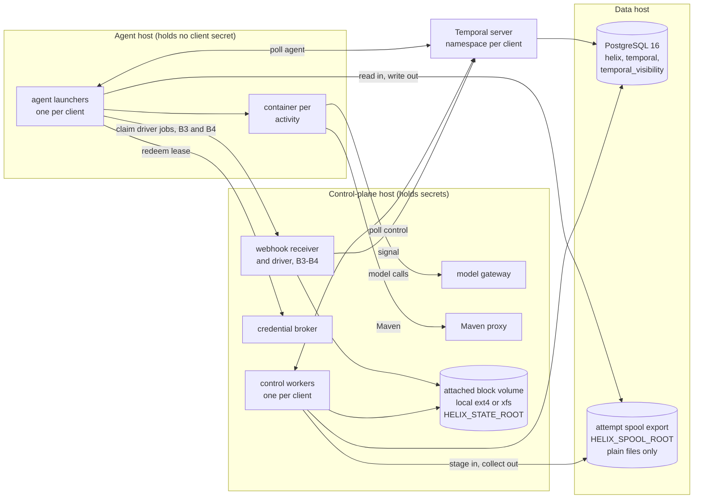
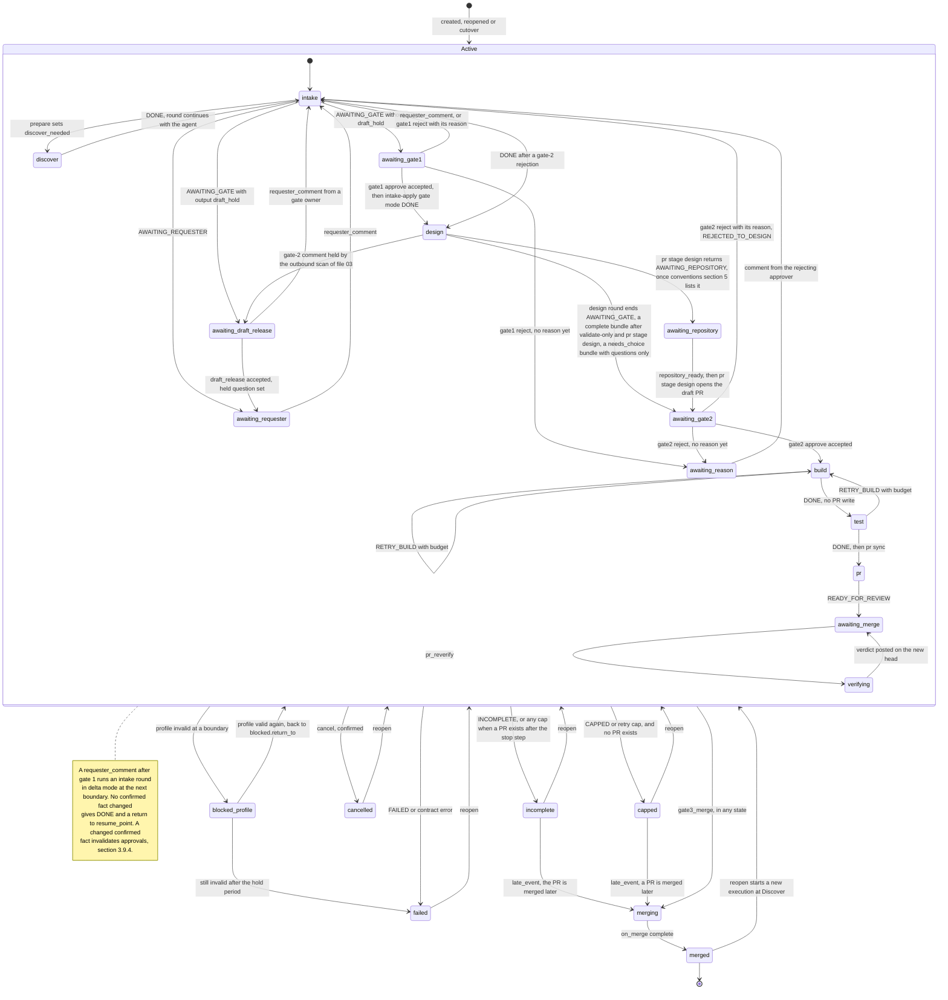
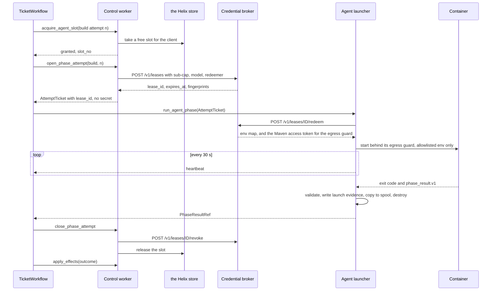
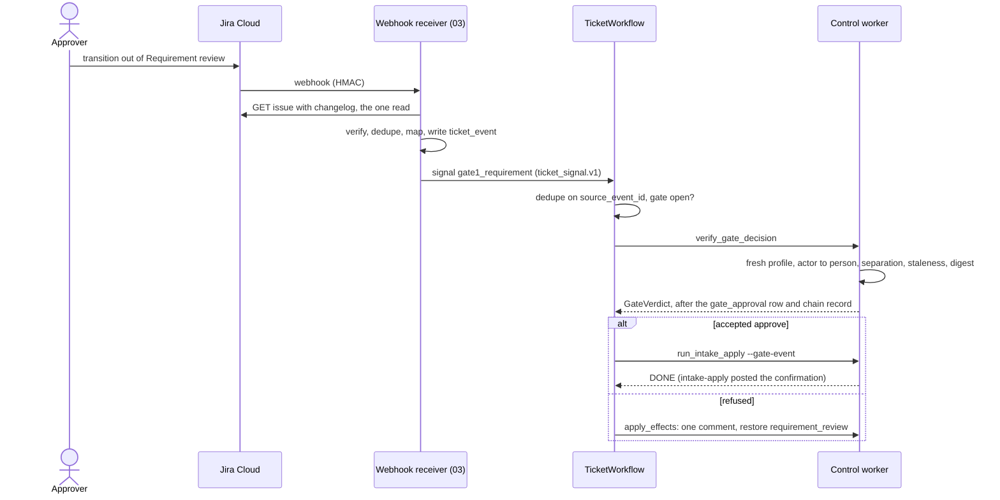
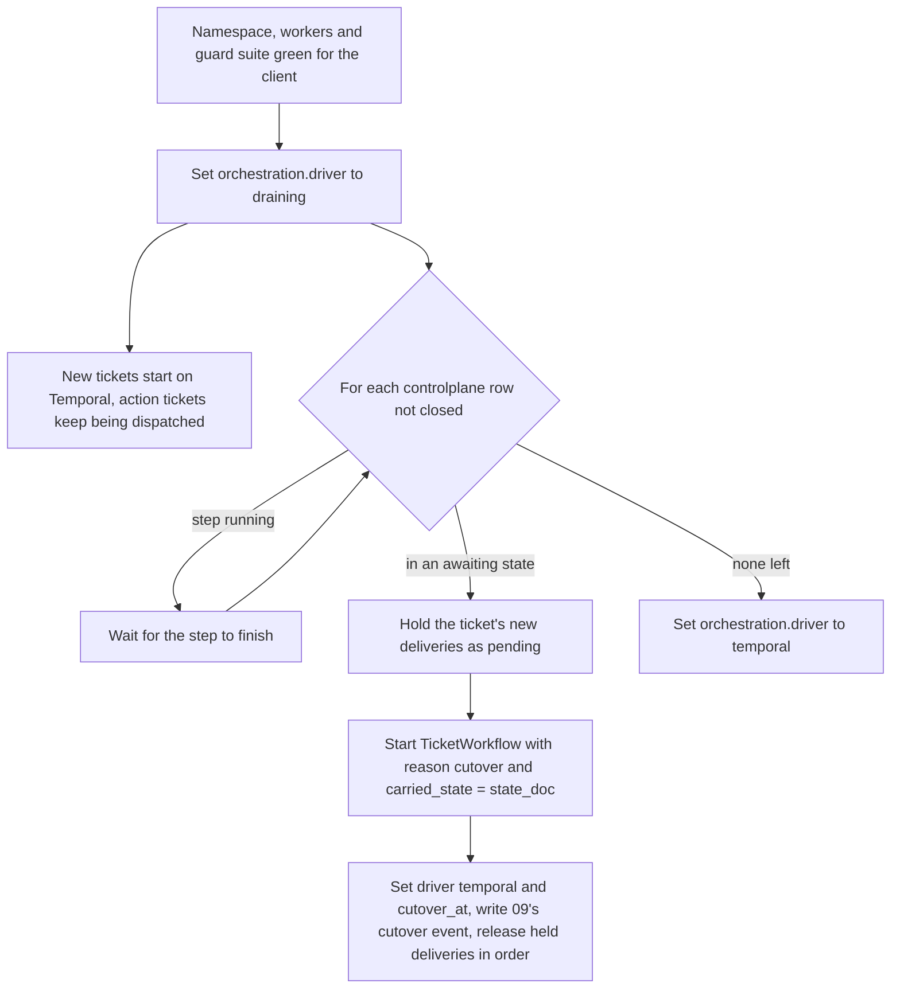

# 08 — B5: Durable orchestration

## 1. Purpose and scope

Sub-phase **B5**. This file designs the durable orchestration that carries one Jira ticket from its first webhook to a merged pull request and can wait for days between gates at no cost. It covers: the Temporal deployment and per-client tenancy; the worker classes, the one-container-per-activity rule and the per-client agent slots; the `TicketWorkflow` (inputs, state machine, activities, signals, queries); how each `PhaseOutcome` drives it; the `gate_approval` table this file owns; the merge step; cap enforcement with the model gateway; idempotent external writes; continue-as-new; the control-plane driver that runs B3 and B4 before Temporal exists (an owner decision), routing per ticket, and the cutover to Temporal; and the operations view.

It does not design the phase CLIs (files 04–07), the webhook receiver, model gateway, credential broker or Maven proxy (file 03), the profile (file 02), the audit and meter records (file 09), or the B2 Action pilot (files 01 and 03). Where it needs something from them, it says what, in section 6.

## 2. Traceability

| Source | What this file implements |
| --- | --- |
| Plan §3.5 (B5) | One workflow per ticket, one activity per phase as a CLI call, one signal per gate; worker containers; profile loaded per workflow in a fresh process; caps stop at the phase boundary; all B5 guards that concern orchestration |
| Plan §3.2 *Exits*, §3.3 *Exits* and *Traps* | Retry cap on red build or suite; cap message; a cap exits 2 when no pull request was opened and 1 when one was, read as file 07 §4 reads it (3.7); exit 2 never retried; the bot's own events wake nothing; one Jira read per wake, made by file 03's receiver (3.6) |
| Plan §4 decision 6 | Gate owners per client, two business days with a reminder at one (`[PLAN-DEFAULT 6]`) |
| Plan §4 decision 10 | The optional Draft status as a wait state with its own release signal (3.5, 3.8) (`[PLAN-DEFAULT 10]`) |
| Plan §4 decision 11 | Run and phase caps (`[PLAN-DEFAULT 11]`) |
| Plan §5 | One workflow per ticket. The exclusion *several tickets sharing one worker* is read here as: no process that touches a profile, Meridian or agent code serves two tickets. The long-lived per-client pollers of 3.4 do serve several tickets, so this reading is an owner decision (section 6, item 13), not literal compliance |
| HLD *Runtime and non-functional design*, *Failure handling*, *Inbound events* | Durable waits, no repeated writes on resume, wrong-actor and unreached-gate refusal decided in one place (3.9.3) |
| HLD-P#7 | Approved-artefact digest per gate; a stale presentation is refused; changed fact returns to the earliest affected gate and blocks a pending merge; approver lists and separation of duties |
| HLD-P#8 | A head pushed after review is re-verified before a merge counts (3.5 `verifying`, 3.6 `run_verify_head`) |
| HLD-P#12 | Minimal control-plane service before B5 (the driver, an owner decision, 3.16); roles of Jira, ledger, Temporal and chain; close cancels, reopen re-enters at Discover; routing per ticket and cutover of in-flight tickets |
| HLD-P#13 | Namespace or task queue per client; worker never switches clients; per-client Maven settings; cross-tenant isolation test (G23). The HLD's *one ephemeral worker per workflow* is refined, not adopted literally (3.4) |
| HLD-P#15 | Run is the ticket's lifetime; sub-cap per phase attempt; per-client ceiling and kill switch |
| HLD-P#16 | No mid-phase approvals; no tool-approval signal exists |
| HLD-P#17 | Typed outcomes drive the workflow; untested PR only as an INCOMPLETE draft |
| HLD-P#18 | Elapsed wait and the approver's entered active minutes recorded per gate (3.9) |
| HLD-P#19 | Operations view: hosting choice, state storage, backups, tested restore, upgrades, on-call, second operator |
| HLD lower bullets | Chain-head digest posted at each gate (audit anchoring); repository settings checked before every PR write (file 07's preflight) and before the merge is accepted (GitHub settings); deduplicated no-op events exit 0 (webhook hardening) — all `[HLD-P lower]` |
| Review item 6 | Reminders go through file 03's templates, outbound scan and audience rules (3.8) `[LLD]` |
| Review item 23 | Temporal hosting is an owner decision (3.2) |
| Conventions §4–§9 | `helix worker --class {control,agent}`; `PhaseOutcome`; ids; storage; credential model; sandbox allowlist. Proposed additions: commands `helix orchestration step`, `helix orchestration cutover` and `helix orchestration cancel` (section 6, item 2); `HELIX_SPOOL_ROOT` in §7 (item 16); new schemas and tables in §8 (item 17) |

## 3. Design

### 3.1 Modules

All under `src/helix/orchestration/` `[LLD]`.

| Module | Responsibility |
| --- | --- |
| `machine.py` | Pure function `transition(state, event) -> list[Step]`. No I/O, no clock, no randomness. Shared by the Temporal workflow and the pre-Temporal driver (3.16). For the outcome-to-next-phase table it calls file 01's `orchestration/transitions.py` `next_step`, which `helix run` also calls, so all three runners take the same phase decisions (G20) |
| `types.py` | Dataclasses: `TicketWorkflowInput`, `TicketWorkflowState`, `TicketSignal`, `AttemptTicket`, `VerifyTicket`, `PhaseResultRef`, `GateVerdict`, `WorkflowStatus` |
| `workflow.py` | `TicketWorkflow`: the deterministic loop that feeds events to `machine.transition` and executes the returned steps as activities, waits and timers |
| `activities_control.py` | Control-queue activities (3.6). Each one that touches a profile, Meridian or the audit chain runs `helix orchestration step` or a phase CLI as a fresh subprocess (3.14); the store-only activities (`load_run_counters`, `acquire_agent_slot`, `project_ticket_run`) run in-process |
| `steps.py` | The `helix orchestration step NAME` command: one entry per control step, JSON in, JSON out (3.6) |
| `activities_agent.py`, `launcher.py` | `run_agent_phase` and `run_verify_head`: lease redemption, one ephemeral container and one egress guard (03 §3.10) per activity, spool transfer, launch evidence (3.4, 3.15). The same launcher serves the driver's agent jobs (3.16) |
| `slots.py` | Per-client agent slots (3.11) |
| `effects.py` | `apply(outcome, ctx)`: only the Jira and GitHub writes that no phase CLI makes (3.7), through files 03 and 07, each under a write key (3.12) |
| `writes.py` | The `external_write` protocol: record, reconcile, write, confirm |
| `gates.py` | Gate verification, `gate_approval` repository, invalidation (3.9) |
| `merge.py` | `on_merge`, the one named merge step that file 11 extends (3.9.5) |
| `driver.py`, `agent_jobs.py` | The pre-Temporal driver, its executor and its agent-job queue (3.16), an owner decision |
| `routing.py` | `route(client_id, ticket_key, kind) -> action \| controlplane \| temporal \| none`: the per-ticket rule file 03's receiver calls (3.16). Store reads only; no Temporal import |
| `cutover.py` | Moving in-flight driver tickets to Temporal (3.16) |
| `worker.py` | Bootstrap for `helix worker --class {control,agent} --profile DIR`; refuses a state root on a network filesystem (3.18) |

### 3.2 Temporal deployment — an owner decision

The plan says *Temporal (MIT)* and *workers the owner operates*; it does not say where the Temporal service runs (review item 23). Both options run the same workflow code; only the connection settings differ.

| | Self-hosted Temporal | Managed (Temporal Cloud) |
| --- | --- | --- |
| Persistence | PostgreSQL 16, Helix store's server, separate databases `temporal` and `temporal_visibility` with their own roles `[LLD]`; PostgreSQL 16 support `[VERIFY]` | Run by the vendor |
| Data hop | None new: histories stay in the owner's estate | New hop: histories leave the estate; region choice per namespace `[VERIFY]`; adds a row to the per-hop residency table (HLD-P#14) |
| What histories hold | Ids, paths, digests, outcomes, actor ids; never a secret, ticket text or artefact content (3.12) `[LLD]` | Same, plus a payload codec encrypting every payload, key in the control plane's vault `[LLD]`; codec support `[VERIFY]` |
| Operator load | Server upgrades, schema migrations, backups, monitoring (3.18) | Vendor runs the server; owner runs workers, backups of the Helix store only |
| Cost | Infrastructure only | Priced per action and storage `[VERIFY]`; no figure is quoted here |
| Single-engineer risk (HLD-P#19) | Higher: one more stateful system | Lower |

**Recommendation `[HLD-P#19]`, owner decides:** self-hosted, on Helix's PostgreSQL server, for the pilot and the first client. It adds no data hop to any client's residency statement and reuses the one database the owner already backs up. The rule that histories hold no client text keeps managed hosting open without redesign. Revisit if the tested restore (3.18) fails twice or the second operator is not named by the second client.



The control-plane host and the agent host are separate machines `[LLD]`: the agent host runs agent-written code (Maven builds, MUnit), so a container escape must not land beside the vault, the Jira token or the GitHub App key. For the same reason the agent host never mounts `$HELIX_STATE_ROOT`: it reaches the data host only through the attempt spool (3.4). This holds under the driver too: agent phases run on the agent host, never on the control-plane host (3.16).

**`$HELIX_STATE_ROOT` is local block storage** `[LLD]` `[HLD-P#19]`. It is a block volume attached to the control-plane host and mounted as a local ext4 or xfs filesystem, never a network export. It holds each client's Meridian action log, which is SQLite opened in WAL mode (`meridian/db/engine.py` line 148, `PRAGMA journal_mode=WAL`). Meridian's own design rejects SQLite on a network file share because the failure is corruption (`meridian/docs/database-design.md` lines 24–26). Several control subprocesses of one client write that database at once, because every chain segment is mirrored into it (file 09 §3.3), and file 09's per-run lock is an exclusive `flock`, which needs a filesystem that honours it (09 §3.3, O14 `[VERIFY]`); 09 asks that each client's chain-writing activities run on one host (09 O3, O14). The spool is the only shared export, and it holds no database (3.4). The worker bootstrap enforces the rule (3.18, G25).

Consequence: every control worker, and the driver, runs on the one control-plane host that mounts the volume. A second control-plane host needs either clients pinned to a host, or `MERIDIAN_DATABASE_URL` pointing at a per-client PostgreSQL database. The second path needs a `[VERIFY]` that Meridian 1.8.1 supports PostgreSQL for its action log (`db/engine.py` `dsn()` reads the variable first) and a change to file 01's bridge, which refuses the variable today (01 §3.5.2). Section 6, item 18.

### 3.3 Tenancy: one namespace per client `[HLD-P#13]`

| Item | Value | Tag |
| --- | --- | --- |
| Namespace | `helix-{client_id}` (`orchestration.namespace`), created at onboarding; file 02's ONB-38 checks it exists once `orchestration.driver` is `draining` or `temporal` | `[HLD-P#13]` |
| Task queues in it | `control`, `agent`; `deploy` reserved for B6 and polled by nothing | `[HLD-P#13]` for `control` and `agent`; `[LLD]` for the `deploy` name (HLD deploy sketch, review item 12); `[PLAN]` that nothing deploys in B1–B5 |
| Workflow id | `ticket/{client_id}/{ticket_key}` (conventions §6) | `[LLD]` |
| Retention of closed histories | 30 days; the chain, not Temporal history, is the evidence | `[LLD]` |
| Worker processes | One long-lived control worker and one long-lived agent launcher per client; a process never serves two namespaces, so it never switches clients. Each serves every ticket of its client; the unit that touches a profile, Meridian or agent code is fresh per activity (3.4) | `[LLD]` refining `[HLD-P#13]`; owner decision, section 6 item 13 |
| Fallback if namespaces are unavailable or too costly | One namespace `helix`, queues `{client_id}.control`, `{client_id}.agent` and, reserved, `{client_id}.deploy`; the workflow id already carries the client. File 11 uses both forms as written here (11 §3.1) | `[LLD]` |

Why a namespace rather than only a queue: a namespace carries its own retention, access control and visibility `[VERIFY]`, so one client's histories cannot be listed from another client's worker credentials.

### 3.4 Worker classes and the execution unit

| Class | CLI | Polls | Runs | Holds | Tag |
| --- | --- | --- | --- | --- | --- |
| Control worker | `helix worker --class control --profile DIR` | `control` in that client's namespace | `discover`, `pr`, posting, transitions, gate verification, attempt open and close, slot accounting; every profile- or Meridian-touching step as a fresh `helix` subprocess with a constructed environment (3.14) | That client's vault scope through the broker; a Temporal client identity for this namespace | `[HLD-P#1]` `[HLD-P#6]` split; `[LLD]` class name |
| Agent launcher | `helix worker --class agent --profile DIR` | `agent` in that client's namespace (B5); the driver's agent-job queue through file 03's internal API (B3–B4, 3.16) | One ephemeral container per activity: `helix intake/design/build/test` (`run_agent_phase`) and `helix verify --stage head` (`run_verify_head`) | A launcher identity that can only redeem credential leases opened for this client (file 03 §3.6.2) and claim this client's agent jobs. A Temporal identity that the namespace authorizer limits to polling and completing tasks on this namespace's `agent` queue: it cannot signal, start, query or cancel a workflow `[VERIFY]` (Temporal authorizer and claim mapper). No client secret; no mount of `$HELIX_STATE_ROOT` | `[HLD-P#13]`, `[HLD-P#1]`; identity limits `[LLD]` |
| Deploy worker | none in B1–B5 | `deploy` reserved | — | — | `[PLAN]` nothing deploys in B1–B5; `[LLD]` the class name (HLD deploy sketch, review item 12) |

`--class` accepts only `control` and `agent`; any other value, `deploy` included, exits 2 `[LLD]` (file 11 §3.1 states the same exit).

**Long-lived pollers plus ephemeral units, not one worker per workflow** `[LLD]` refining `[HLD-P#13]`, **owner decision** (section 6, item 13). Plan §5 excludes *several tickets sharing one worker*, and HLD-P#13 proposes *one ephemeral worker per workflow*. This design reads *worker* as the unit that touches a profile, Meridian or agent code: that unit is a fresh subprocess or container per activity and never serves two tickets. The pollers that schedule those units are long-lived, client-bound and hold no ticket state, and they do serve every ticket of one client. Reason: a worker per workflow would hold a process for every waiting ticket for days. The alternative, if the owner reads the plan literally: a per-client supervisor starts one control worker and one agent launcher per workflow, on a per-workflow task queue, and stops them when the workflow ends; while the workflow waits, the pair stays up and idle. That costs one idle process pair per open ticket and a supervisor to build; the rest of this design is unchanged.

**The container per agent activity** `[HLD-P#13]` `[HLD-P#1]`:

| Aspect | Rule |
| --- | --- |
| Image | `worker-agent` (conventions §3); no secret baked in; JDK 17, Maven 3.9.x, Node 20 LTS, Anypoint CLI v4 with DX plugin, DX MCP Server only if the spike passed `[PLAN]` |
| Environment | Exactly the conventions §9 allowlist for that phase: the credential entries come from the redeemed lease (below), the rest are fixed values; nothing inherited from the launcher. A `verify` container gets only `HOME`, `PATH`, `LANG`, `TMPDIR`, the three `HELIX_*` identifiers and `MAVEN_SETTINGS` |
| Mounts | `/work/{attempt_id}/` read-write, ephemeral; inputs copied in from the attempt spool's `in/` with SHA-256 checked against the brief; `/opt/helix/skills/` read-only; the per-client Maven settings file (proxy URL only) read-only |
| Never mounted | The vault, `$HELIX_PROFILES_ROOT`, `$HELIX_STATE_ROOT` (it holds Meridian's connected-app token cache, `meridian/platform/authn/__init__.py` line 253 in `build_provider`, `token_cache_connected_app.json`, and the chain), the spool itself, the container runtime socket, Temporal credentials |
| Maven local repository | Inside the workdir, per attempt; never shared across attempts or clients `[HLD-P#13]` |
| Network | Egress allowlist from the profile (files 03 and 10): gateway, Maven proxy, and the client's Anypoint control plane (`ANYPOINT_BASE_URL`, 3.14) only on the DX MCP route. A `verify` container reaches only the Maven proxy. Enforced by the attempt's egress guard, which the launcher starts beside the container with the attempt's egress policy and the lease's Maven access token; the container's only route is through it (03 §3.6.2, §3.8, §3.10) |
| End of life | Launcher validates `phase_result.v1`, writes `launch-evidence.json` (3.15), copies the result, the evidence and each declared output into the spool's `out/`, destroys the container, its egress guard and the workdir. `close_phase_attempt` moves them into the run directory (below). On launcher start, any container or guard labelled `helix.attempt_id` with no live activity or job is destroyed |

`attempt_id` is the `phase_attempt_id` (conventions §6) for an agent phase, and `verify_attempt_id` = `{run_id}.verify.{n}` for a head verification, which is not a conventions §6 `phase` (section 6, item 17) `[LLD]`.

**Credential delivery to the container** `[HLD-P#1]` `[HLD-P#2]`. File 03's lease API (03 §3.6.2) is the only protocol. Nothing mints a gateway token for the launcher; the broker mints it inside the lease. The activity names `open_phase_attempt` and `close_phase_attempt` are the ones files 09 and 03 use (09 O3, O15; 03 §3.6.2 names `open_phase_attempt` as the caller of `POST /v1/leases`).

| Step | Activity | Call | Result |
| --- | --- | --- | --- |
| 1 | `acquire_agent_slot` (control) | Helix store, `agent_slot` (3.11) | A slot for this client. Without one, no lease is opened |
| 2 | `open_phase_attempt` (control) | File 09's issuance (09 §3.11), then `POST /v1/leases` with `client_id`, `run_id`, `phase_attempt_id`, `container_class` (the phase), `caps.usd` = the sub-cap, `model`, `redeemer = {kind: mtls, subject: <this client's launcher identity>}` | The broker mints the gateway session, the Maven access token for `build` and `test`, and, for `build` on the DX MCP route only, exchanges the build app for an Anypoint bearer (03 §3.6.1). It returns `lease_id`, `expires_at`, `contents[]` and a `fingerprints` map (first 16 hex of each credential's SHA-256, 03 §3.6.2). `open_phase_attempt` writes `credential_issued` per entry (file 09 §3.4); no value is ever in its hands |
| 3 | `run_agent_phase` (agent) | `POST /v1/leases/{id}/redeem` with the launcher's own identity | `env`: `ANTHROPIC_AUTH_TOKEN` and, when present, `ANYPOINT_BEARER`, put only into the container's environment. `launcher`: the Maven access token, handed to the attempt's egress guard for its Maven relay and never put into the container (03 §3.8) |
| 4 | `close_phase_attempt` (control) | `POST /v1/leases/{id}/revoke` | The lease, its gateway session and its Maven access token are revoked; the slot is released |

A head verification (3.8 `pr_reverify`) takes the same path with a `verify`-class lease: contents `maven_access` only, and no `caps.usd` (03 §3.6.1–3.6.2). There is no model session, so file 09's issuance does not run. `stage_verify_head` opens it, `run_verify_head` redeems it, `close_phase_attempt` revokes it. The `verify` container gets no gateway token and no Anypoint bearer.

Lease rules `[LLD]`:

| Case | Rule |
| --- | --- |
| Retried `open_phase_attempt` | Idempotent per `phase_attempt_id`. HTTP 409 from the broker (an open lease exists, 03 §3.6.2) makes it revoke that lease and issue a new one. A retry may have lost the first response, so the 409 body must name the open `lease_id` (asked of 03, section 6 item 4). The brief and staged inputs are reused when their SHA-256 match. `stage_verify_head` follows the same rule for its `verify` lease |
| Lease expired before redemption | A lease lives at most 10 minutes before redemption (03: `CHECK (expires_at <= issued_at + interval '10 minutes')`). The launcher maps HTTP 410 on redeem to a raised, non-retryable `LeaseExpired`. The workflow runs `open_phase_attempt` once more for the same `phase_attempt_id`; a second `LeaseExpired` is `FAILED` (03 §4) |
| Waiting in the queue | The slot gate (3.11) keeps a launcher execution slot free whenever a lease is open, so a queued task is picked up at once. `run_agent_phase` also has a schedule-to-start timeout of 5 minutes, below the lease lifetime `[LLD]`; its semantics are `[VERIFY]`. When it fires (the launcher is down), the workflow runs `close_phase_attempt` with `revoke_only`, waits 5 minutes on a durable timer, re-acquires a slot and re-opens the same attempt. This does not count against `infra_reattempts_used`, and no token is live while it waits |
| Second redeem | HTTP 409 (already redeemed) is `PhaseContractError`: one lease, one launcher |
| Wrong identity | HTTP 403 is `PermissionDenied`, non-retryable: `FAILED` plus a security alarm (03 §4) |

**Moving files between the run directory and the agent host** `[LLD]`. The run directory sits on the control-plane host's volume under `$HELIX_STATE_ROOT`, which the agent host never mounts. Transfer goes through a separate spool:

| Item | Rule |
| --- | --- |
| Location | `$HELIX_SPOOL_ROOT/{client_id}/{attempt_id}/` with `in/` and `out/`: an export from the data host, separate from `$HELIX_STATE_ROOT`, which stays local to the control-plane host (3.2). Plain files only; never a database |
| Agent host's view | Mounts only `$HELIX_SPOOL_ROOT/{client_id}/`, owned by that client's launcher identity: `in/` read-only, `out/` writable. Never any path under `$HELIX_STATE_ROOT`, so never `{client_id}/meridian/` |
| Stage in | `open_phase_attempt` (or `stage_verify_head`) copies `phase_brief.v1` and every input it names, at their run-directory relative paths, into `in/`, and checks each SHA-256 against the brief |
| Collect out | The launcher writes `result.json`, `launch-evidence.json` and each declared output to `out/`. `close_phase_attempt` validates `phase_result.v1`, checks each output's SHA-256 against the result, copies them into the run directory, then deletes the attempt's spool directory |
| What it may hold | Briefs, ticket text and agent outputs, which the agent sees anyway. Never a credential, a token cache or a chain file |
| Guard | G30 (section 5) |

### 3.5 TicketWorkflow

**Input — `ticket_workflow_input.v1`** `[LLD]`

| Field | Type | Constraint |
| --- | --- | --- |
| `schema` | string | `ticket_workflow_input.v1` |
| `client_id` | string | conventions §6 |
| `ticket_key` | string | conventions §6 |
| `run_id` | string | `{client_id}.{ticket_key}` `[HLD-P#15]` |
| `reason` | enum | `created`, `reopened`, `continued`, `cutover`, `late_event` (a merge of a terminal run's PR; 3.8 *Starting a workflow*, 3.9.5). Minutes entered after a merge are file 09's sweep (09 §3.13), not a workflow start |
| `profile_dir` | path | `$HELIX_PROFILES_ROOT/{client_id}` |
| `carried_state` | `ticket_workflow_state.v1` or null | Required for `continued` and `cutover`; null otherwise. Restore rules below |

```json
{"schema": "ticket_workflow_input.v1", "client_id": "acme-retail", "ticket_key": "ACME-101",
 "run_id": "acme-retail.ACME-101", "reason": "created",
 "profile_dir": "/srv/helix/profiles/acme-retail", "carried_state": null}
```

**State — `ticket_workflow_state.v1`** `[LLD]`. Held in Temporal history and mirrored, whole, to `ticket_run.state_doc` (3.16) by `project_ticket_run`; under the driver, `state_doc` is the state itself.

| Field | Type | Meaning |
| --- | --- | --- |
| `schema` | string | `ticket_workflow_state.v1` |
| `state` | `WorkflowState` | See the machine below |
| `step_seq` | int ≥ 0 | Number of the last executed step; the next step takes `step_seq + 1`. Prefix of every write key (3.12) and of file 09's audit `event_key` (09 §3.3.2); never reused within a `run_id` |
| `attempts` | map phase → int | Last `n` used in `phase_attempt_id`; key `verify` for `verify_attempt_id` |
| `infra_reattempts_used` | map phase → int | Re-attempts after a lost container, at most 1 per phase per run `[LLD]` |
| `build_retries_used` | int | Against `caps.build_retry_cap` (02) `[PLAN]` |
| `design_attempts_used` | int | Design attempts in the current design round, against `design_standards.max_attempts` (06); reset after each gate-2 rejection; fills the brief's `retry.remaining` (06 §4). Used only if conventions §5 adds `DESIGN_REFUSED` (3.7) |
| `gate_rounds` | map gate → int | Times each gate opened |
| `presented` | map gate → {`digest`, `opened_at`, `round`, `revision`, `subject_ref`, `subject`, `presented_comment_id`, `chain_head_at_presentation`} | What the open gate asks a human to approve (3.9.2) |
| `approvals` | list of {`gate`, `approval_id`, `decided_digest`, `round`, `person_key`} | Live accepted approvals |
| `pending_signals` | list of `ticket_signal.v1` | Buffered while a step runs |
| `seen_event_ids` | list of `source_event_id`, the last 500 | Signal dedupe `[LLD]` |
| `resume_point` | `WorkflowState` or null | Where an intake round after gate 1 returns when no confirmed fact changed |
| `blocked` | {`return_to`: `WorkflowState`, `since`: RFC 3339, `problems`: list of `ONB-nn`} or null | Set only in `blocked_profile` (3.7) |
| `expected_status` | logical ticket state (conventions §6) | The status Helix last set, or last accepted from a human gate transition. Refused and off-path moves are restored to it (3.10) |
| `timers` | list of {`kind`: `reminder`, `turnaround`, `reason_reminder`, `slot_retry`, `queue_retry`, `profile_retry`, `profile_deadline`, `repository_wait`; `gate` or null; `due_at` RFC 3339} | Armed durable timers; a new execution re-arms each one whose `due_at` is still ahead and fires at once any that passed (3.13) |
| `reason_wait` | {`gate`, `approval_id`, `person_key`, `asked_at`, `asked_comment_id`} or null | Set only in `awaiting_reason` (3.9.3) |
| `draft_hold` | {`hold_ids`, `held_outcome`, `held_gate` or null, `held_at`} or null | Set only in `awaiting_draft_release` (3.8): the outcome the held post would have reached |
| `pr` | {`repo`, `number`, `kind`: `design_draft`, `ready`, `superseded_draft` or `incomplete_draft`; `head_sha`, `verified_head_sha` or null, `evidence_stale`: bool} or null | The run's pull request, once `helix pr` opened it (07 §3.8.4: the design draft at gate 2, made ready after test; nothing is written between build and test) |
| `artefacts` | map name → {`path`, `sha256`} | Latest accepted outputs |
| `last_outcome` | `PhaseOutcome` or null | |
| `profile_digest` | hex64 | Of the profile at the last boundary |
| `measurement_excluded` | {`reason`} or null | Set by `INCOMPLETE`, by a cap, or by a refused gate-3 merge; file 09 recomputes the measurement status from the chain (09 §3.13) |

`WorkflowState` values `[LLD]`: `intake`, `discover`, `awaiting_requester`, `awaiting_draft_release`, `awaiting_gate1`, `awaiting_reason`, `design`, `awaiting_repository` (reached only once conventions §5 lists `AWAITING_REPOSITORY`, 3.7), `awaiting_gate2`, `build`, `test`, `pr`, `awaiting_merge`, `verifying`, `merging`, `blocked_profile`; terminal `merged`, `incomplete`, `capped`, `failed`, `cancelled`.

```json
{"schema": "ticket_workflow_state.v1", "state": "awaiting_gate1", "step_seq": 14,
 "attempts": {"intake": 2, "discover": 1}, "infra_reattempts_used": {}, "build_retries_used": 0,
 "design_attempts_used": 0, "gate_rounds": {"gate1_requirement": 1},
 "presented": {"gate1_requirement": {"digest": "9b1e…c40a", "opened_at": "2026-10-11T15:02:10Z",
   "round": 1, "revision": 2, "subject_ref": "runs/ACME-101/fact-sheet.r2.json",
   "subject": {"kind": "fact_sheet", "fact_sheet_revision": 2}, "presented_comment_id": "10512",
   "chain_head_at_presentation": "e81c…09b3"}},
 "approvals": [], "pending_signals": [], "seen_event_ids": ["8d3e2a1c-4b7f-5e0a-9c55-2f1d6b0a7e31"],
 "resume_point": null, "blocked": null, "expected_status": "requirement_review",
 "timers": [{"kind": "reminder", "gate": "gate1_requirement", "due_at": "2026-10-12T15:02:10Z"},
            {"kind": "turnaround", "gate": "gate1_requirement", "due_at": "2026-10-13T15:02:10Z"}],
 "reason_wait": null, "draft_hold": null, "pr": null, "artefacts": {},
 "last_outcome": "AWAITING_GATE", "profile_digest": "a03f…77d2", "measurement_excluded": null}
```

An **intake round** is four steps, in file 05's order: `run_intake_prepare` (control), `run_discover` when prepare sets `discover_needed` (state `discover`), `run_agent_phase(intake)` (agent, behind a slot and a lease), `run_intake_apply` (control). The round's outcome is intake-apply's. Prepare is handed the wake's `ticket_event.v1`, whose `snapshot` is the receiver's one Jira read (3.6). The mode passed to prepare (`--mode`, file 05) is `initial` on `created` or `reopened`, `answer` for a comment before gate 1 or a gate-1 rejection reason, `delta` for a comment after gate 1, and `rejection` for an accepted gate-2 rejection. After a gate-1 approval is accepted, `run_intake_apply --gate-event` runs once in gate mode before design (3.9). A reopen re-enters at Discover because file 05's prepare sets `discover_needed` on a `reopened` wake.

A **design round** `[LLD]` follows file 06's order (06 §3.7), and its outcome is its last step's, as an intake round's is intake-apply's. (1) `run_agent_phase(design)`, behind a slot and a lease; a passing attempt ends `AWAITING_GATE`, exit 1 (06 §3.11), which is provisional: nothing is posted yet. (2) When `design_standards.validation_route` is `control_queue`, `run_design_validate`. (3) For a `complete` bundle, `run_pr --stage design`, whose `AWAITING_GATE` opens gate 2 (3.7). A `needs_choice` bundle skips steps 2 and 3: it has no contract, name or repository yet, so gate 2 opens on 06's templated questions with no PR (06 §3.11.1); `close_phase_attempt` reports the bundle's `status` so the workflow can choose. A design result other than `AWAITING_GATE` also skips steps 2 and 3.



**Restoring state** `[LLD]`. `load_run_counters` builds the starting state from one source, by reason. `w` is the highest `step_seq` recorded for the `run_id` in `external_write` (3.12) or in file 09's `audit_event_key` rows (09 §3.3.2), or 0 when there is none.

| `reason` | Source of the state | `step_seq` restored as |
| --- | --- | --- |
| `created` | Fresh state | `w` |
| `continued`, `cutover` | `carried_state` (authoritative) | `max(carried_state.step_seq, w)` |
| `reopened`, `late_event` | `ticket_run.state_doc` (3.16) | `max(state_doc.step_seq, w)` |

The next step then takes `step_seq + 1`, so a write key or an audit `event_key` is never reused, even if `state_doc` lags. To keep `state_doc` current, `project_ticket_run` runs at every wait entry and after every phase boundary, and it must have returned before continue-as-new (3.13) and before the workflow completes or fails. The first step of every execution writes file 09's `workflow_started` through `audit_record` (09 §3.4).

**The loop** `[LLD]`. The workflow (1) runs `load_run_counters` and `load_profile_snapshot`; (2) asks `machine.transition(state, event)` for steps; (3) executes each step: an activity, a wait (`wait_condition` on the signal queue, with the timers in `timers`), or a terminal; (4) feeds the result back as the next event. Signal handlers only check the payload's shape, drop a `source_event_id` already in `seen_event_ids`, and append to `pending_signals`; the loop drains them at step boundaries. Three signals also act while an activity runs (3.8): `cancel` and `reopen`, once `confirm_ticket_event` accepts them, cancel the running activity; `gate3_merge` cancels it at once, because a merge cannot be undone. Workflow code reads no file, no profile and no clock other than `workflow.now()`; the Python SDK's workflow sandbox enforces part of this `[VERIFY]`.

### 3.6 Activities

All timeouts are `[LLD]` starting values, estimates to be replaced by the meter's observed durations. Agent activities stay under the gateway token's 6-hour ceiling (conventions §9), and file 04 derives each agent's session wall clock from these start-to-close values (04 §3.7). Temporal retry semantics are `[VERIFY]`.

| Activity | Queue | Does | Timeouts | Heartbeat (every / timeout) | Retry policy |
| --- | --- | --- | --- | --- | --- |
| `load_run_counters` | control | Read or create `ticket_run`; restore state (3.5); return counters, spend, approvals | 1 min | — | T |
| `load_profile_snapshot` | control | Subprocess `helix orchestration step profile-snapshot --profile DIR`: file 02's loader, then returns `{valid, problems[], keys, profile_digest}` with the keys of 3.17. `helix profile validate` prints problems only (02 §3.6), so it is not used here | 2 min | — | T. An invalid profile is a returned value, not an error (3.7) |
| `confirm_ticket_event` | control | For `cancel` and `reopen`: the signal's `source_event_id` exists in `ticket_event` (03 §3.4.7) for this client and ticket; its `kind` is `closed`, `deleted` or `reopened` as the signal says; its actor is a human, not the bot, in the receiver's snapshot of that wake. For `source: operator` with `reason: kill_switch`, a fresh profile has `caps.kill_switch: true` instead. Returns `confirmed` or `refused` with a reason. No Jira read: the receiver's one read already holds the status and the changelog | 2 min | — | T |
| `run_intake_prepare` | control | Writes the wake's `ticket_event.v1`, read from the store by `source_event_id`, to the run directory, then subprocess `helix intake-prepare --event FILE --mode M` (05 §3.3); in `rejection` mode also `--gate-event FILE`, the accepted gate-2 rejection's `ticket_event.v1` (05 §3.12a), and, when the reason ended `awaiting_reason`, first writes 06's `design_resolutions.v1` from it (3.9.3) | 5 min | — | Infrastructure errors only, 3 attempts; a returned outcome is never retried |
| `run_discover` | control | Subprocess `helix discover` with the Meridian environment (3.14) | 45 min | 20 s / 1 min | Infrastructure errors only, 2 attempts |
| `run_intake_apply` | control | Subprocess `helix intake-apply` in normal mode, or with `--gate-event FILE` in gate mode (05 §3.12) | 10 min | 20 s / 1 min | Infrastructure errors only, 3 attempts; file 05's `intake_round.marker` makes a retry post nothing twice (3.12) |
| `release_draft` | control | Subprocess `helix orchestration step release-draft`: file 03's `JiraClient.release_held` or `refuse_release` (03 §3.5.5), which checks the actor against `gates.draft_reviewers` (02), re-checks each held rendering's SHA-256, posts publicly and moves the ticket to the newest hold's `held_target_state` | 5 min | — | T |
| `run_design_validate` | control | Only when `design_standards.validation_route` is `control_queue` (06 §3.7): subprocess `helix design --validate-only`. The CLI takes its own `ruleset` bearer from the broker (`POST /v1/bearer`, 03 §3.6.1–3.6.2) and imports no Meridian module, so no Meridian child environment is built (06 §3.2) | 15 min | 20 s / 1 min | Infrastructure errors only, 2 attempts |
| `run_scaffold_cp` | control | Only on file 07's scaffold route `anypoint_cli_cp` (07 §3.4.1, `build.scaffold_needs_credentials`): 07's `CliScaffold` before the build activity, under a broker-issued bearer of the `build` connected app; the tree joins the base archive (07 §3.3). Command name and broker purpose are asked of 07 and 03 (section 6, items 5 and 19) | 15 min | 20 s / 1 min | Infrastructure errors only, 2 attempts |
| `acquire_agent_slot` | control | Take a per-client agent slot (3.11), idempotent per `attempt_id`. Returns `granted` with `slot_no`, or `busy` | 1 min | — | T |
| `open_phase_attempt` | control | File 09's issuance (09 §3.11) with `caps.phase_attempt_usd`, sub-cap, lease (3.4), `phase_brief.v1` (3.11), stage inputs into the spool, chain records `phase_started` and `credential_issued` (09 §3.5). Idempotent per `phase_attempt_id` | 2 min | — | T |
| `run_agent_phase` | agent | Redeem the lease, start the egress guard and the container, run `helix {intake,design,build,test}`, heartbeat, collect, write launch evidence, destroy | schedule-to-start 5 min; start-to-close intake 30 min, design 90 min, build 4 h, test 4 h | 30 s / 2 min | **1 attempt, no retry** |
| `close_phase_attempt` | control | Revoke the lease, and with it the gateway session and the Maven access token; release the slot; collect and validate the result and `launch-evidence.json` (3.15); spend from the meter; chain records `tool_call_summary`, `security_refusal` when any, `cap_stop` when capped, `phase_ended` (09 §3.5). With `revoke_only`: the first two only. For a design attempt it also returns the bundle's `status` (3.5 design round). For a verify attempt: revoke its lease, collect the reports and release the slot | 5 min | — | T |
| `stage_verify_head` | control | `get_pr`, then the git writer exports the PR head tree at `head_sha` as an archive; the last passing reports and the approved bundle are copied beside it; all go into the spool (07 §3.8.7). Then a `verify`-class lease (3.4), and 09's `credential_issued` for it | 10 min | — | T |
| `run_verify_head` | agent | Redeem the `verify` lease; the Maven access token goes to the attempt's egress guard. Container class `verify`: `helix verify --stage head --project DIR --evidence FILE --head-sha SHA --out FILE` (07 §3.11), with `MAVEN_SETTINGS` and the fixed rows only; no gateway token, no agent session (07 §3.2, 03 §3.9.3) | schedule-to-start 5 min; start-to-close 60 min, an estimate: the plan speaks of ten-minute Maven runs (plan §3.2 *Traps*), and `verify` runs build and test; replaced once the meter has `verify` durations | 30 s / 2 min | **1 attempt, no retry** |
| `apply_effects` | control | `effects.apply` for one outcome (3.7) | 15 min | 20 s / 1 min | T, 10 attempts |
| `run_pr` | control | Subprocess `helix pr` (07 §3.11) as one of: `--stage design` (the gate-2 draft PR, 07 §3.8.2); `--mode sync` after test (ready for review, 07 §3.8.4); `--mode stop --reason CODE` (the stop step after `CAPPED` or `INCOMPLETE`, 07 §3.8.4); `--mode record-merge` (3.9.5) | 30 min | 20 s / 1 min | Infrastructure errors only, 3 attempts; file 07's CLI is idempotent by its own rules (PR by head branch, fast-forward only, tree SHA, 07 §3.8.3) |
| `run_measure` | control | Subprocess `helix meter measure --profile DIR --run RUN_ID` (09 §3.13), on `pr_closed`; a merge is measured by `record-merge` (07 §3.9) | 10 min | — | T |
| `verify_gate_decision` | control | Fresh profile, the wake's snapshot (Jira) or `pr_snapshot.v1` (GitHub), actor-to-person resolution, separation, staleness, digest, `gate_approval` row and chain record (3.9.3); for an accepted gate-2 rejection whose reason comment the signal names, 06's `design_resolutions.v1` (3.9.3) | 5 min | — | T |
| `invalidate_approvals` | control | Mark rows, chain record `approvals_invalidated`, the PR effects of 3.9.4; with `--check design`, first compare the PR head's design files with the approved bundle | 5 min | — | T |
| `project_ticket_run` | control | Write `ticket_run.state_doc` and its projections (3.16) | 1 min | — | T, 10 attempts |
| `audit_record`, `run_close` | control | File 09's generic chain writer and run close (09 §3.5) | 2 min | — | T |

**T** = transient policy `[LLD]`: initial interval 2 s, backoff coefficient 2.0, maximum interval 5 min, 5 attempts unless stated. Non-retryable error types on every activity: `PhaseContractError`, `ProfileInvalid` (the loader itself could not run), `PermissionDenied`, `ConfigError`, `LeaseExpired`.

**One Jira read per wake** `[PLAN]`. The read is file 03's receiver (03 §3.4.4, `ticket_snapshot.v1`). No activity here GETs the ticket; the earlier `fetch_ticket` is withdrawn. Activities reach the text through the snapshot that the signal's `source_event_id` names in `ticket_event` (03 §3.4.7). File 05's `intake-prepare` reads that snapshot by the path and SHA-256 the event carries and makes no Jira read of its own (05 §3.3; 03 §3.5.2). Missed deliveries are file 03's sweep (03 §3.4.9), not this file's.

**No automatic retry of exit 2, `FAILED` or `CAPPED`** `[PLAN]` `[HLD-P#17]`: an activity that ran a phase CLI *returns* its `PhaseResultRef` for every valid result, whatever the outcome. Temporal retries only raised errors, so a returned `FAILED` or `CAPPED` is never retried; the workflow acts on it (3.7). A build that stops with `DX_UNAVAILABLE` (04 §3.7) returns `FAILED`, so no attempt `n+1` starts in `cli_fallback` (this answers 04's question). The fallback is a profile change (`toolchain.dx_mcp_route: false`, 02), then either an operator reset of the workflow to the step before the build attempt, which keeps the gate approvals (3.18 *Operator recovery*), or a reopen, which re-enters at Discover `[LLD]`. An activity raises only for infrastructure faults and contract violations:

| Raised error | Cause | Retryable? |
| --- | --- | --- |
| `PhaseContractError` | No `phase_result.v1`, schema invalid, exit code outside {0, 1, 2}, exit code disagreeing with the outcome per conventions §5, launch evidence not matching the pinned release (3.15), or a second redeem of one lease | No; workflow treats as `FAILED` |
| `LeaseExpired` | Broker answered HTTP 410 on redeem | No; the workflow re-opens once (3.4) |
| Schedule-to-start timeout | No launcher picked the task within 5 minutes | Not an attempt: revoke, release, wait, re-open (3.4); not counted |
| Heartbeat or start-to-close timeout | Launcher or worker lost, container hung | Agent: no (1 attempt); the workflow may start one fresh attempt `n+1` if `infra_reattempts_used[phase] = 0` and the cap allows, else `FAILED` `[LLD]` |
| Transient I/O (Jira 5xx or 429, database, broker or gateway unreachable) | | Yes, per T |

`PhaseResultRef` `[LLD]`: `attempt_id`, `phase`, `exit_code`, `outcome`, `result_path`, `result_sha256`, `outputs` (name → {`path`, `sha256`}), `launch_evidence_path`, `launch_evidence_sha256`. Spend comes from `close_phase_attempt`, read from the meter, never from the SDK (conventions §10).



The gateway token goes from the broker to the launcher to the container's environment; the Maven access token stops at the egress guard. Neither enters a Temporal payload, a log line or the run directory `[HLD-P#2]` `[LLD]`.

### 3.7 How each PhaseOutcome drives the workflow `[HLD-P#17]`

Effects run in `apply_effects` before the next step; an outcome counts as reached only when its effects are confirmed.

**One poster per outcome** `[LLD]`. When a phase CLI has already posted and transitioned for its outcome, `apply_effects` records the outcome and posts nothing: `intake-apply` for intake outcomes (05 §3.3); `helix pr` for `READY_FOR_REVIEW`, the stop step and the merge (07 §3.8.4, §3.8.6); file 03's Jira client for a Draft hold (03 §3.5.5). `apply_effects` posts only what no phase CLI posts: the gate-2 presentation comment and transition, which file 07 leaves to the control plane (07 §3.8.2, 06 §3.14); the `RETRY_BUILD` line; the `CAPPED`, `FAILED` and `INCOMPLETE` lines before design, when the stop step does not run (file 03's `cap_stop`, `failed` and `incomplete` templates); gate refusals and status restores (3.9.3, 3.10); reminders (3.8); the head-verify verdict (3.8); the invalidation notice and its PR effects (3.9.4); and the merge line when `record-merge` did not post it (3.9.5). Every post goes through file 03's `JiraClient.post`, so 03's outbound scan and Draft hold apply to it too (03 §3.5.5).

**The stop step** `[LLD]`. After a `CAPPED` or `INCOMPLETE` outcome, or a cap refusal, from design onward, the workflow runs `run_pr --mode stop --reason CODE` (07 §3.8.4). It keeps an existing PR a draft marked INCOMPLETE, or, when none exists and a passing `build_report.v1` does, opens one in that form; it posts `b2.stopped` with the spend. Before design, `apply_effects` posts file 03's `cap_stop` or `incomplete` template instead. The stop step's result tells the workflow whether a PR now exists, which the cap rule below needs (section 6, item 19).

| Outcome | From | Effects (each under a write key) | Next |
| --- | --- | --- | --- |
| `DONE` | discover, build, test; intake in delta or rejection mode; intake-apply gate mode | None. Nothing is written to GitHub between build and test (07 §3.8.4) | Next phase in order; after an intake delta, `resume_point`; after test, `run_pr --mode sync` |
| `AWAITING_GATE`, provisional | `helix design` or `run_design_validate`, when a later step of the design round follows (3.5; 06 §3.7, §3.11) | None: no post, no gate opened | That later step; the round's last step decides |
| `AWAITING_REQUESTER` | intake-apply | None: intake-apply posted the question set and moved the ticket to `needs_info` (05 §3.3) | Wait in `awaiting_requester` |
| `AWAITING_GATE` with output `draft_hold` | intake-apply, or `apply_effects` itself, when file 03's outbound scan held the post (03 §3.5.5) | Record `draft_hold` with the outcome the post would have reached. No post and no transition: 03 posted the restricted comment and moved the ticket to `draft` | Wait in `awaiting_draft_release` |
| `AWAITING_GATE` without `draft_hold`, gate 1 | intake-apply | Record `presented` (3.9.2); write file 09's `gate_opened`; arm the reminder and turnaround timers. No post and no transition: intake-apply posted the review comment and moved the ticket to `requirement_review` (05 §3.12) | Wait in `awaiting_gate1` |
| `AWAITING_GATE`, gate 2 | The design round's last step: `run_pr --stage design` (07 §3.8.2), or the design attempt itself for a `needs_choice` bundle (06 §3.11.1) | Post file 06's templated gate comment (PR link, bundle digest, chain-head digest, open questions; for `needs_choice`, the questions only) and transition to `design_review` (06 §3.14; 07 §3.8.2 leaves both to the control plane); record `presented` from the comment's creation time (3.9.2); `gate_opened`; `pr.kind = design_draft` when a PR was opened; arm the timers | Wait in `awaiting_gate2` |
| `REJECTED_TO_DESIGN` | `verify_gate_decision` on an accepted gate-2 rejection | Transition to `building` while the rejection is worked (03 §3.4.6 default gate transitions) | Intake in rejection mode with the reason, then design |
| `RETRY_BUILD` | build, test | One line on the ticket: attempt *n* of the cap | If `build_retries_used < caps.build_retry_cap`: build attempt `n+1`. Else the retry cap is reached: the stop step and the cap rule below `[LLD]`. No phase result is `CAPPED` for the retry cap (07 §6) |
| `READY_FOR_REVIEW` | `run_pr --mode sync` after test | None: `helix pr` marked the PR ready, posted the `helix/verify` check and `b2.pr_ready` with the chain head, and moved the ticket to `in_review` (07 §3.8.4, §3.8.6). Record `pr.kind = ready` and `pr.verified_head_sha = head_sha` | Wait in `awaiting_merge`; write `gate_opened` for gate 3; arm the gate-3 reminder timers |
| `INCOMPLETE` | any | The stop step (above); run excluded from measurement (file 09) | Workflow completes with result `incomplete`; run-level exit 1 |
| `CAPPED` | any agent phase, or an `open_phase_attempt` refusal | The stop step, then the cap rule below | `incomplete` or `capped` |
| `FAILED` | any, or `PhaseContractError` | Post the phase, attempt id and a one-line reason (no stack, no tool output) | Workflow fails, error type `PhaseFailed`, non-retryable; no automatic retry |

**The cap rule** `[PLAN]` (plan §3.2 *Exits*) `[HLD-P#17]`. A cap stops the run at once and posts one line naming where it stopped and what it had spent (the stop step's `b2.stopped`, or 03's `cap_stop` before design). Its run-level result follows file 07 §4, which owns the mapping with file 01: exit 2 when no PR exists and 1 when one does, where *a PR exists* means B4's design draft was opened, or the stop step opened a draft from a passing build report. The capped attempt's own `phase_result.v1` stays `CAPPED`, exit 2 (07 §4, 09 §3.11).

| After the stop step | Workflow result | Run-level exit | PR | Measurement |
| --- | --- | --- | --- | --- |
| A PR exists (`pr.kind` set) | `incomplete` (workflow completes) | 1 | A draft titled `[INCOMPLETE]`, labelled `helix:incomplete` (07 §3.8.4); `pr.kind = incomplete_draft` | Excluded |
| No PR | `capped` (workflow fails, error type `Capped`, non-retryable) | 2 | None | Excluded |

The rule applies equally to a `CAPPED` result, to a run cap, client ceiling or kill switch refusal by `open_phase_attempt` at a boundary, and to the retry cap. With B4 in place a design draft exists from gate 2 on, so a cap at build or test gives `incomplete`, exit 1, and a cap during intake, or during design before its draft PR exists, gives `capped`, exit 2.

**An invalid profile at a boundary** `[LLD]`. `load_profile_snapshot` returns `valid: false`. No activity runs, no slot is held and no token is live. The workflow enters `blocked_profile`, sets `blocked.return_to` to the state it was about to enter, posts one comment naming the onboarding item numbers (never field values) and alerts the operator. It retries the snapshot on a durable timer every 15 minutes. A valid snapshot returns the run to `blocked.return_to` with nothing else changed. A run still invalid after `orchestration.profile_hold_hours` (3.17; default 72 hours) ends `failed`, exit 2, with one more comment. Signals that arrive meanwhile are buffered, except `cancel`, which is acted on.

**`DESIGN_REFUSED` and `AWAITING_REPOSITORY`** (file 06) are not in conventions §5, so a phase result carrying either fails schema validation and is `PhaseContractError`, `FAILED`. File 06 must map them onto conventions §5 values until §5 changes (section 6, item 10). If conventions §5 adds them, this file handles them so `[LLD]`: `DESIGN_REFUSED` starts design attempt `n+1` with the findings as 04's `retry` input and `retry.remaining` = `design_standards.max_attempts` − `design_attempts_used`. When none is left, the design CLI itself returns `INCOMPLETE` with `DESIGN_ATTEMPTS_EXHAUSTED` (06 §4), which the `INCOMPLETE` row handles. `AWAITING_REPOSITORY`, from `run_pr --stage design`, follows 06 §3.14: `apply_effects` posts 06's wait line (no repository name) and alerts the operator, and the workflow waits in `awaiting_repository` with a `repository_wait` timer due after `design_standards.repository_wait_business_days` (3.17). The `repository_ready` signal (3.8) re-runs `run_pr --stage design`; its `AWAITING_GATE` opens gate 2 as above, and another `AWAITING_REPOSITORY` waits again with the timer unchanged. When the timer fires, the run ends `INCOMPLETE` with `REPO_WAIT_TIMEOUT` (06 §4).

Terminal results: `merged`, `incomplete`, `cancelled` complete the workflow; `capped` and `failed` fail it so every run-level exit 2 shows as a failed workflow to operations `[LLD]`. Before completing or failing, the workflow runs `project_ticket_run` and file 09's `run_close` and waits for both. Recovery from any terminal state is a ticket reopen (3.10) or an operator reset (3.18).

Gate 1 rejection is not a `PhaseOutcome`: it runs intake with the reviewer's reason, which normally yields `AWAITING_REQUESTER` `[LLD]`.

### 3.8 Signals and queries

**One signal contract, `ticket_signal.v1`** `[LLD]`, owned here and filled by file 03's receiver as 03 §3.4.6 says. File 03 adopts it as "the only signal contract" and proposed four names, adopted here: `draft_release`, `pr_closed`, `pr_pushed` and `pr_reverify`. It has no free-text field: comment and reason text is read by an activity from the wake's snapshot, so untrusted text never enters Temporal history. The schema is listed for conventions §8 (section 6, item 17).

| Field | Type | Constraint |
| --- | --- | --- |
| `schema` | string | `ticket_signal.v1` |
| `signal` | enum | `requester_comment`, `gate1_requirement`, `gate2_design`, `gate3_merge`, `draft_release`, `cancel`, `reopen`, `pr_closed`, `pr_pushed`, `pr_reverify`, `off_path` (asked of 03, 3.10), `repository_ready` (06 §3.14; used once conventions §5 lists `AWAITING_REPOSITORY`, 3.7) |
| `client_id`, `ticket_key` | string | Must equal the workflow's |
| `source` | enum | `jira`, `github`, `sweep`, `operator` |
| `source_event_id` | string | The `ticket_event_id` (03 §3.4.7), deterministic, so a sweep wake and a webhook for one change give one id; the dedupe key. For `source: operator`, the `ticket_event_id` of the row the operator command wrote |
| `actor_id` | string | `jira:{accountId}` or `github:{user id}` from the GET (03 §3.4.5); `operator:{login}` for an operator command |
| `occurred_at` | RFC 3339 | From the GET: changelog `created`, comment `updated`, PR `merged_at` or `closed_at` |
| `decision` | enum or null | `approve`, `reject`; gate 1 and gate 2 only |
| `transition_id` | string or null | Gates 1 and 2, when the changelog carries it `[VERIFY]` |
| `comment_id` | string or null | `requester_comment` (null for a summary or description edit); on a gate reject, the same actor's newest comment new in the snapshot, else null (03 §3.4.6) |
| `pr_number`, `head_sha` | int, string or null | PR signals; for `gate3_merge`, the merged head |
| `reason` | enum or null | For `cancel`: `closed`, `deleted` or `kill_switch` (asked of 03 for the first two) |

```json
{"schema": "ticket_signal.v1", "signal": "gate1_requirement", "client_id": "acme-retail",
 "ticket_key": "ACME-101", "source": "jira", "source_event_id": "8d3e2a1c-4b7f-5e0a-9c55-2f1d6b0a7e31",
 "actor_id": "jira:acc-architect-1", "occurred_at": "2026-10-12T09:14:03Z",
 "decision": "approve", "transition_id": "41", "comment_id": null,
 "pr_number": null, "head_sha": null, "reason": null}
```

| Signal | Accepted in | Handler | Otherwise |
| --- | --- | --- | --- |
| `requester_comment` | Any non-terminal state | `awaiting_requester`, `awaiting_gate1`: an intake round (`answer` mode). `awaiting_draft_release`: an intake round only when the actor is a gate owner, 03's `gate_owner` class, which includes the draft reviewers (05 §3.11 *Revise*; 03 §3.4.5); file 03 holds the new set again. `awaiting_reason`: the reason, when the actor is the rejecting approver (3.9.3). While a step runs, or after gate 1: buffered, then a `delta` round at the next boundary (3.10) | — |
| `gate1_requirement`, `gate2_design` | `awaiting_gate1` for gate 1; `awaiting_gate2` for gate 2 | `verify_gate_decision` (3.9.3) | Any other state: `verify_gate_decision` records `gate_not_open`; `apply_effects` posts one comment and restores `expected_status` |
| `gate3_merge` | Any state; a terminal `incomplete` or `capped` run by start reason `late_event` | Cancel any running activity; state `merging`; `on_merge` (3.9.5). Gate 3 is open only in `awaiting_merge` and `verifying` | — (a merge cannot be undone) |
| `draft_release` | `awaiting_draft_release` | `release_draft`. Released: the ticket is in the newest hold's `held_target_state`, and the workflow proceeds as if `draft_hold.held_outcome` had been reached: `awaiting_requester`, since only a question set is ever held (03 §3.5.5). Refused (not a draft reviewer, or rendering changed): 03 posts `release_refused` and moves the ticket back to `draft`; state unchanged | Any other state: one comment; status restored |
| `cancel` | Any non-terminal state, after `confirm_ticket_event` | Cancel the running activity (container destroyed, lease revoked, slot released), post one comment, `gitwriter.close_pr` closes an open draft PR without deleting the branch (03 §3.9.2); result `cancelled` | Not confirmed: no state change; security alert (G32) |
| `reopen` | Terminal, by signal-with-start with reason `reopened`; non-terminal, after `confirm_ticket_event` | Invalidate all approvals; intake round with Discover (3.10) | Not confirmed: no state change; security alert |
| `pr_closed` | Any non-terminal state | One comment naming the PR; `audit_record` writes file 09's `pr_closed`; `run_measure`, since 09 measures a close as gate 3's end (09 §3.13); state unchanged. Only a ticket close cancels `[LLD]` | — |
| `pr_pushed` | `awaiting_merge`, `verifying` | `pr.head_sha` = the new head, `pr.evidence_stale = true`; `apply_effects` calls `gitwriter.on_foreign_push(pr, head_sha)` (03 §3.9.2): `review-ready` removed, `helix/verify` pending on the new head. `invalidate_approvals --check design` invalidates gate 2 if the design files changed (3.9.4) | Earlier states: recorded only; the next `run_pr` meets the branch (07 refuses a diverged branch, `PR_BRANCH_DIVERGED`) |
| `pr_reverify` | `awaiting_merge` with `pr.evidence_stale` true, or after a failed verify | State `verifying`: `acquire_agent_slot`, `stage_verify_head`, `run_verify_head`, `close_phase_attempt`, then `apply_effects` applies 07 §3.8.7's hand-off: re-read the PR head; if the report's `head_sha` is still on the PR and its tree equals the report's `tree_sha`, post the `helix/verify` verdict on that SHA and, on a pass, restore the review-ready label; else post nothing (`VERIFY_HEAD_MISMATCH`). On a pass, `pr.verified_head_sha = head_sha` and `pr.evidence_stale = false` | Recorded only |
| `off_path` (asked of 03) | Any non-terminal state | Restore `expected_status` (3.10); `audit_record` writes file 09's `off_path_event` with `action: ignored`. The receiver has already posted `off_path_ignored` (03 §3.4.6) | — |
| `repository_ready` | `awaiting_repository`. The control plane sends it, `source: operator`, to every run of the client in that state when `helix doctor --scope pr --repo NAME` passes for the repository (06 §3.14) | `run_pr --stage design` again, which re-checks the repository; its outcome is handled as in 3.7 | Recorded only |

There is no signal for a tool approval: hooks only allow or deny, and an *ask* is a logged deny that stops the phase (file 04) `[HLD-P#16]`. There is no `gate4_deploy` signal in B1–B5 `[PLAN]`. There is no `kill_switch` signal (below). PR reviews are not signalled: `record-merge` reads them at merge (03 §3.4.6, 07 §3.9).

**Kill switch** `[HLD-P#15]` `[LLD]`. It is not a signal. The gateway refuses every call and every mint for the client (03 §3.7), so a running session ends `CAPPED`, and `open_phase_attempt` refuses at the next boundary because `load_profile_snapshot` reads `caps.kill_switch`; both follow the cap rule (3.7). Waiting runs keep waiting with no token live. If the owner wants them ended, `helix orchestration cancel --profile DIR --reason kill_switch` (section 6, item 2) writes a `ticket_event` row per open run and sends `cancel` with `source: operator` and `reason: kill_switch`; `confirm_ticket_event` checks the switch in the profile.

**Starting a workflow** `[LLD]`. File 03's receiver starts or signals the workflow id for a ticket whose route is `temporal` (3.16). A closed workflow is started again only for these events:

| Event (03 `ticket_event.kind`) | `ticket_run` | Start reason |
| --- | --- | --- |
| `created` | none | `created` |
| `reopened` | terminal | `reopened` |
| `pr_merged` | terminal `incomplete` or `capped` | `late_event` |
| Anything else | terminal | None: `ignored_no_run` (03). Active minutes entered after the run ended are read by file 09's `helix meter measure --sweep` (09 §3.13), not by a workflow |

| Query | Returns |
| --- | --- |
| `status()` | `ticket_workflow_status.v1`: `schema`, `run_id`, `state`, `waiting_for` (signal names accepted now), current `attempt_id`, `attempts`, `build_retries_used` and cap, run spend at the last boundary and run cap, `presented`, live approvals with digests, `expected_status`, `pr`, `last_outcome`, `step_seq`, history length. The receiver reads `waiting_for` and `expected_status` for its `off_path_ignored` comment (03 §3.4.6) |
| `accepts(signal, gate)` | Boolean, for the receiver's log only. The receiver never drops a gate transition on it; the workflow decides (3.9.3) |

Queries never change state `[VERIFY]`.

**Reminders** `[PLAN-DEFAULT 6]`. When a gate opens, a durable timer fires after `gates.{gate}.reminder_after_business_days` (02; default 1) and a second after `gates.{gate}.turnaround_business_days` (default 2). Each posts one comment through file 03's Jira client, so 03's templates and outbound scan apply (03 §3.5.4–3.5.5) `[LLD]` (review item 6); a `gate_reminder` template is asked of 03. The comment names the gate and mentions that gate's approvers, which 03's templates allow (mentions only of the requester or a named gate owner). When the requester's class is `external` or `email` (03 §3.5.5, 05 §3.5), the reminder is posted restricted to `jira.draft_visibility` (02), the audience 03 uses for held comments, which exists whenever such a requester has a run (02 ONB-27). So any notification email it causes goes to the internal approvers, never to the requester; the doctor should prove that every gate approver can read that audience (asked of 02, section 6 item 7). Whether a mention sends a Jira notification email, and whether a restricted comment suppresses email to non-members, are `[VERIFY]` (03 §3.5.5). Nothing is ever auto-approved. Business days skip Saturday and Sunday; a holiday calendar is an open item.

### 3.9 Gates: `gate_approval`, verification, invalidation, merge `[HLD-P#7]`

#### 3.9.1 What each gate approves

| Gate | Subject | Digest (`presented_digest`) | What consumers check |
| --- | --- | --- | --- |
| `gate1_requirement` | The fact-sheet revision presented at `requirement_review`: `fact-sheet.r{n}.json`, which intake-apply writes once and never rewrites (05 §3.7) | SHA-256 of the bytes of `fact-sheet.r{n}.json`, 64 lowercase hex | Files 06 and 07 hash `fact-sheet.confirmed.json` and compare it with the live gate-1 approval's `decided_digest` (equal to `presented_digest`). That holds because intake-apply's gate mode copies the approved revision file to the confirmed copy byte for byte, after the decision (05 §3.12). `open_phase_attempt` writes the digest into the design brief as `gate1_digest`, beside the confirmed copy's SHA-256 as `source_sha256`, and refuses a brief where they differ (06 §3.3); file 07 reads it from `gate_approval` (07 §3.3, and S1 in §3.4). Never hash `fact-sheet.json`: it moves on with the next revision. Never expect `status: confirmed`: `fact_sheet.v1` has no such value, because confirmation is the live `gate_approval` row (05 §3.7) |
| `gate2_design` | The design bundle on the draft PR head | SHA-256 of the bytes of `design_bundle.v1` as written (`runs/{ticket_key}/design/{n}/design-bundle.json`, committed byte for byte as `docs/design/design-bundle.json`, 06 §3.13) | Build (07 §3.3) and B6 (11 §3.4) check that the bundle file hashes to it. The bundle has no digest field of its own; it lists each member's SHA-256 and the `gate1_digest` it consumed, which 3.9.3's gate-2 check reads (06 §3.13) |
| `gate3_merge` | The PR head commit merged | Git commit id of the head; must equal `pr.verified_head_sha` (HLD-P#8, file 07) | `record-merge` (07 §3.9) |

The gate-1 digest is over the immutable revision file because 05 names it so (05 §2, "file 08's digest") and asserts it in 05's G13 `[HLD-P#7]` `[LLD]`.

#### 3.9.2 Presentation and staleness

`apply_effects` records `presented[gate]` for an `AWAITING_GATE` outcome without `draft_hold`:

| Field | Gate 1 | Gate 2 |
| --- | --- | --- |
| `digest` | 3.9.1 | 3.9.1 |
| `revision`, `round` | `fact_sheet_revision` from intake-apply's output `presentation`; `gate_rounds` + 1 | The bundle attempt `n`; `gate_rounds` + 1 |
| `subject_ref` | `runs/{ticket_key}/fact-sheet.r{n}.json` | The bundle path, `runs/{ticket_key}/design/{n}/design-bundle.json`, which 11 §3.4 reads as `bundle_path`; the PR head goes in `subject.pr` (3.9.3) |
| `opened_at` | The Jira creation time of the presenting review comment, read back by intake-apply and returned in its output `presentation` (section 6, item 6) | The Jira creation time of the gate comment that `apply_effects` posted (3.7), from Jira's response to the POST |
| `presented_comment_id`, `chain_head_at_presentation` | From the same output | From the same POST and the chain head it carried |

`opened_at` is on Jira's clock, the same clock as the signal's `occurred_at`, so no skew between hosts enters the staleness check. It is the presenting comment, not the transition into the review status, because a re-presentation while the ticket already sits in that status makes no transition (05 §3.11 skips a transition to the current status) `[LLD]`.

#### 3.9.3 Verification

`verify_gate_decision` runs as a fresh subprocess per call. **Refusals are decided here and nowhere else** `[LLD]`: file 03's receiver passes the changelog actor on unchanged and pre-filters nothing (03 §3.4.5), so every refusal has a `gate_approval` row and a chain record. Checks, in order:

| Check | Refusal reason | Tag |
| --- | --- | --- |
| Gate is the one open now (gate 3 is open in `awaiting_merge` and `verifying`) | `gate_not_open` (decided in-workflow, recorded by the activity) | `[PLAN]` |
| Source event not seen before | `duplicate` (row not re-written; exits 0, nothing owed) | `[HLD-P lower]` |
| Actor is not Helix's bot (`jira.bot.account_id`; GitHub `github.bot_login` or `github.bot_user_id`, 02) | `actor_is_bot` | `[PLAN]` |
| Actor resolves to a person through `people` (02): a Jira account id equal to `people.{key}.jira_account_id`, or, for a merge, the merger's login from `pr_snapshot.v1` equal to `people.{key}.github_login` (a numeric GitHub id once 02 adds it, section 6 item 7); that person is in `gates.{gate}.approvers`, read fresh | `actor_not_approver` | `[PLAN]` actor check, `[HLD-P#7]` lists |
| Separation: the requester never approves gate 1; the merger approved neither gate 1 nor gate 2 of this run (compared by `person_key` on live `gate_approval` rows) and is not the PR author. Waived only under `gates.waiver` (02: `{reason, recorded_on, max_tickets: 1}`), and only while the number of runs with a row carrying that waiver is below `max_tickets`; the waiver is copied into the row | `separation_of_duties` | `[HLD-P#7]` |
| Gates 1 and 2: the transition is one of `jira.gates.{gate}.approve_transitions` or `.reject_transitions` (02) for this decision: by `transition_id` when the changelog carries it, else the gate's review state as from-state and a listed `to_state` | `transition_not_found` | `[LLD]` |
| Not stale: `occurred_at` ≥ `presented[gate].opened_at` (3.9.2); for gate 1, the current revision also equals `presented.revision` (05 §3.12) | `stale_presentation`; the current subject is re-presented | `[HLD-P#7]` |
| Digest. Gate 1: the SHA-256 of `fact-sheet.r{n}.json` now equals `presented.digest`. Gate 2: the design files on the draft PR head, read from GitHub, each hash to the bundle's member SHA-256, and the bundle file hashes to `presented.digest`. Gate 3: the merged head equals `pr.verified_head_sha` and `pr.evidence_stale` is false | `digest_mismatch` | `[HLD-P#7]`; gate 3 `[HLD-P#8]` |
| Gate 3 only: repository settings still as onboarded (07 §3.8.1 preflight, 03 §3.9.4) | `repo_settings_changed` | `[HLD-P lower]` |

After a refused gate-1 or gate-2 decision, `apply_effects` posts one comment naming the rule that refused it (03's `gate_actor_refused` template for the actor rules), never the approver's name, and restores `expected_status`, the review status (3.10), as file 05 §3.12 expects. A refused gate-1 decision does not call intake-apply.

At decision time the activity also reads the approver's entered active minutes (`jira.fields.gate{1,2,3}_active_minutes`, 02) from the wake's snapshot; empty is recorded as null, not zero `[HLD-P#18]`. File 09's `record_measurement` remains the authority for minutes (09 §3.13).

**A rejection's reason** `[LLD]`. An accepted rejection takes its reason from the signal's `comment_id`, which the receiver fills with the rejecting actor's newest comment new in the snapshot (03 §3.4.6). If it is null, `apply_effects` posts one comment asking that approver for the reason, the workflow enters `awaiting_reason`, and the next `requester_comment` from that person becomes the reason; a `reason_reminder` repeats the request after one business day. For an accepted gate-2 rejection, control-plane code writes file 06's `design_resolutions.v1` at `runs/{ticket_key}/design/resolutions.json` from the reason's `choose DT-nnn` tokens, as 06 §3.5 specifies, with the rejection's `approval_id` as each item's `gate_event_id`: `verify_gate_decision` writes it when the signal names the reason comment, and `run_intake_prepare` writes it, before its CLI call, from the comment that ended `awaiting_reason`. Intake never parses the tokens (05 §3.12a).

**A merge cannot be undone.** A refused gate-3 merge still ends the run as `merged`, with `gate3_merge` recorded `accepted = false`; file 09 counts it as not *accepted* and the run is excluded from measurement `[LLD]`.

**Table — `gate_approval`** (owned here; conventions §8). Append-only: a trigger allows one update per row, setting the three `invalidated_*` columns; rows are never deleted `[LLD]`.

```sql
CREATE TABLE gate_approval (
  approval_id                uuid        PRIMARY KEY,
  client_id                  text        NOT NULL CHECK (client_id ~ '^[a-z0-9-]{2,32}$'),
  run_id                     text        NOT NULL,
  gate                       text        NOT NULL CHECK (gate IN ('gate1_requirement','gate2_design','gate3_merge','gate4_deploy')),
  round                      integer     NOT NULL CHECK (round >= 1),
  subject_kind               text        NOT NULL CHECK (subject_kind IN ('fact_sheet','design_bundle','pr_head')),
  subject_ref                text        NOT NULL,   -- run-directory path, or {repo}#{number}@{sha}
  subject                    jsonb       NOT NULL CHECK (subject->>'kind' = subject_kind),
  presented_digest           text        NOT NULL CHECK (presented_digest ~ '^([0-9a-f]{64}|[0-9a-f]{40})$'),
  opened_at                  timestamptz NOT NULL,   -- presentation time on Jira's clock (3.9.2)
  decision                   text        NOT NULL CHECK (decision IN ('approve','reject')),
  actor_id                   text        NOT NULL,   -- 'jira:{accountId}' or 'github:{user id}'; no display names
  person_key                 text,                   -- key of people (02); null when the actor resolves to no person
  actor_check                text        NOT NULL CHECK (actor_check IN ('listed','listed_waived','not_listed','is_bot','is_requester','sod_conflict')),
  decided_digest             text,                   -- digest computed at decision time; null if not computable
  accepted                   boolean     NOT NULL,
  refusal_reason             text        CHECK (refusal_reason IN ('gate_not_open','actor_is_bot','actor_not_approver',
                                           'separation_of_duties','transition_not_found','stale_presentation',
                                           'digest_mismatch','repo_settings_changed')),
  waiver                     jsonb,                  -- copy of gates.waiver when separation is waived
  source_kind                text        NOT NULL CHECK (source_kind IN ('jira_transition','github_merge','cutover_import')),
  source_event_id            text        NOT NULL,   -- ticket_event_id (03)
  transition_id              text,
  occurred_at                timestamptz NOT NULL,   -- the signal's occurred_at
  reason_comment_id          text,
  profile_digest             char(64)    NOT NULL,
  chain_head_at_presentation char(64)    NOT NULL,
  chain_head                 char(64)    NOT NULL,   -- at decision: head of the sealed segment holding the decision record (09 §3.6, 05 §3.12)
  decided_at                 timestamptz NOT NULL,
  elapsed_wait_s             integer     NOT NULL CHECK (elapsed_wait_s >= 0),   -- max(0, occurred_at - opened_at) (HLD-P#18)
  active_minutes             integer     CHECK (active_minutes >= 0),            -- approver's entry; null = missing
  invalidated_at             timestamptz,
  invalidated_reason         text,       -- e.g. 'fact_changed:volume,sla', 'reopen', 'design_edited'
  invalidated_by             text,       -- source_event_id or attempt_id that caused it
  created_at                 timestamptz NOT NULL DEFAULT now(),
  CHECK (accepted = (refusal_reason IS NULL)),
  CHECK (NOT accepted OR decision = 'reject' OR decided_digest = presented_digest),
  CHECK (invalidated_at IS NULL OR accepted),
  CHECK ((actor_check = 'listed_waived') = (waiver IS NOT NULL)),
  UNIQUE (client_id, source_event_id, gate)
);
CREATE UNIQUE INDEX gate_approval_one_live ON gate_approval (run_id, gate, round)
  WHERE accepted AND decision = 'approve' AND invalidated_at IS NULL;
CREATE INDEX gate_approval_run ON gate_approval (run_id, gate);
ALTER TABLE gate_approval ENABLE ROW LEVEL SECURITY;
CREATE POLICY gate_approval_client ON gate_approval
  USING (client_id = current_setting('helix.client_id'))
  WITH CHECK (client_id = current_setting('helix.client_id'));
GRANT SELECT ON gate_approval TO helix_audit_reader;   -- file 09's verifier (09 §3.7)
```

`subject` holds the gate-specific fields that have no column. Fields file 05 lists for the gate-1 subject that are columns here: `approver_account_id` is `actor_id`, `approved_at` is `occurred_at`, `elapsed_minutes` is `elapsed_wait_s`, `active_minutes`, `chain_head_at_presentation`, and `chain_head_at_approval` is `chain_head`, the name files 05 (§3.12) and 09 (§3.6, verify step 7) use.

| `subject_kind` | `subject` fields |
| --- | --- |
| `fact_sheet` | `kind`, `fact_sheet_revision`, `fact_sheet_path`, `fact_sheet_digest` (= `presented_digest`), `ledger_snapshot_sha256`, `discover_findings_sha256`, `presented_comment_id`, `presented_at` (05 §3.12) |
| `design_bundle` | `kind`, `bundle_path`, `bundle_attempt`, `members` [{`path`, `sha256`}], `gate1_digest`, `pr` {`repo`, `number`, `head_sha`}, `presented_comment_id`, `presented_at` |
| `pr_head` | `kind`, `repo`, `number`, `head_sha`, `merge_commit_sha`, `verified_head_sha`, `author_login`, `merger_login`, `settings_check` {`passed`, `items`[]} |

```json
{"approval_id": "5f0c2a8e-3b1d-4c7e-9a52-1d2e3f4a5b6c", "client_id": "acme-retail",
 "run_id": "acme-retail.ACME-101", "gate": "gate1_requirement", "round": 2,
 "subject_kind": "fact_sheet", "subject_ref": "runs/ACME-101/fact-sheet.r2.json",
 "subject": {"kind": "fact_sheet", "fact_sheet_revision": 2, "fact_sheet_path": "runs/ACME-101/fact-sheet.r2.json",
   "fact_sheet_digest": "9b1e…c40a", "ledger_snapshot_sha256": "41d0…2be1",
   "discover_findings_sha256": "c3a9…7710", "presented_comment_id": "10512",
   "presented_at": "2026-10-11T15:02:10Z"},
 "presented_digest": "9b1e…c40a", "opened_at": "2026-10-11T15:02:10Z",
 "decision": "approve", "actor_id": "jira:acc-architect-1", "person_key": "architect",
 "actor_check": "listed", "decided_digest": "9b1e…c40a", "accepted": true, "refusal_reason": null,
 "waiver": null, "source_kind": "jira_transition", "source_event_id": "8d3e2a1c-4b7f-5e0a-9c55-2f1d6b0a7e31",
 "transition_id": "41", "occurred_at": "2026-10-12T09:14:03Z",
 "reason_comment_id": null, "profile_digest": "a03f…77d2",
 "chain_head_at_presentation": "e81c…09b3", "chain_head": "f02d…118a",
 "decided_at": "2026-10-12T09:14:09Z", "elapsed_wait_s": 65513, "active_minutes": 25,
 "invalidated_at": null, "invalidated_reason": null, "invalidated_by": null}
```

The same decision is written to the chain in the same activity with file 09's event names (09 §3.4): `gate_approved` or `gate_rejected` for an accepted decision, `signal_refused` for a refused one, whose `reason` is this table's `refusal_reason`; `stale_presentation` is new to 09's list (section 6, item 3). A gate-3 decision also writes `pr_merged`. The chain is authoritative (3.10).



`GateVerdict` `[LLD]`: `approval_id`, `gate`, `decision`, `accepted`, `refusal_reason`, `decided_digest`, `person_key`, and `outcome` (`DONE` for an accepted approval, `REJECTED_TO_DESIGN` for an accepted gate-2 rejection, null otherwise).

#### 3.9.4 Invalidation — a changed confirmed fact returns to the earliest affected gate `[HLD-P#7]`

| Trigger | Earliest affected gate | Invalidated | PR effect (by `apply_effects`) | Next state |
| --- | --- | --- | --- | --- |
| After gate 1, an intake round's intake-apply writes a new revision, which it does only when a confirmed fact's value or status changed (05 §3.12, *After confirmation*) | gate 1 | Gate 1 and every later live approval | When the PR is `ready`: a `helix/verify` failure ("approvals invalidated") on the head SHA (03 `post_head_status`, 07's check form); `review-ready` removed (03 `set_labels`); the PR converted to draft `[VERIFY]` (GitHub API; a function `mark_superseded` asked of 07 and 03); `pr.kind = superseded_draft`, `pr.verified_head_sha = null`. The required check then blocks the merge (GH4: 07 §3.8.1, 03 §3.9.4) | Per intake-apply's outcome: `awaiting_requester` (05's `confirm_change` question, or a question set) or `awaiting_gate1` (a new review of the revision) |
| At gate 2 or later, the design files on the PR head differ from the gate-2 approved bundle (`invalidate_approvals --check design` on `pr_pushed`) | gate 2 | Gate 2 and later | As above when the PR is `ready` | `design` (recheck of the edited bundle, file 06), then `awaiting_gate2` |
| Code pushed to the PR after gate 2, design files unchanged | none of gates 1–2 | — | `on_foreign_push` only (3.8) | Gate 3's head rule covers it |
| Ticket reopened | gate 1 | All | None; the run restarts | Intake round with Discover |
| Profile approver list changes after an approval | none | — | — | An approval valid when made stays valid `[LLD]` |

`invalidate_approvals` writes file 09's `approvals_invalidated`. A phase attempt whose brief consumed an invalidated digest is marked superseded; its outputs are not used `[LLD]`. The comment lists the changed fact ids, never their values `[LLD]`.

#### 3.9.5 The merge step `on_merge` `[LLD]`

One named step, which file 11 extends for B6 (11 §3.1). It runs for every merge, accepted or not.

| # | Step | Activity | Timeout | Retry |
| --- | --- | --- | --- | --- |
| 0 | Cancel any running activity; `close_phase_attempt` revokes its lease and releases its slot | `close_phase_attempt` | 5 min | T |
| 1 | Record gate 3, accepted or refused (3.9.3); chain `pr_merged` and the gate record | `verify_gate_decision(gate3_merge)` | 5 min | T |
| 2 | Merge facts, measurement and the durable `deployment_properties` write: file 07's CLI reads the merge facts, passes them to file 09's `record_measurement`, writes `deployment_properties`, posts `b2.merged` and moves the ticket to `done` (07 §3.9, §3.8.6). File 09 computes `accepted`, which is false for a merger outside gate 3's rules (09 §3.13) | `run_pr --mode record-merge` | 30 min | Infrastructure errors only, 3 attempts |
| 3 | If step 2 did not confirm the `done` transition and its comment (it failed, or returned `FAILED`), transition to `done` and post one merge line with the chain head; anchor the chain head (09 §3.6) | `apply_effects(merge)` | 15 min | T, 10 attempts |
| 4 | Project the final state | `project_ticket_run` | 1 min | T, 10 attempts |
| 5 | Close the run in the chain | `run_close` (09) | 2 min | T |
| 6 | Complete as `merged` | — | — | — |

`record-merge` ends `DONE` or `FAILED` (07 §3.11). Missing active minutes are file 09's concern, through its measurement window and `helix meter measure --sweep` (09 §3.13), never an outcome here. A late merge of an `incomplete` or `capped` run (start reason `late_event`) runs every step.

### 3.10 Off-path transitions and sources of truth `[HLD-P#12]`

| Event | Workflow state | Action | Tag |
| --- | --- | --- | --- |
| Ticket moved to `cancelled`, or to `done` before merge (`cancel`) | any non-terminal | `confirm_ticket_event`, then cancel the running activity (container destroyed, lease revoked, slot released), post one comment, `gitwriter.close_pr` closes an open draft PR without deleting the branch; result `cancelled`; file 09's `off_path_event` with `action: cancel` | `[HLD-P#12]`, PR close `[LLD]` |
| Ticket moved from `done` or `cancelled` back to an open state (`reopen`) | terminal | Signal-with-start, reason `reopened`: new execution, same `run_id`, state from `ticket_run.state_doc` (3.5), spend and attempt counters carried, all approvals invalidated, intake round with Discover | `[HLD-P#12]` |
| Ticket moved back to `new` from an open state (`reopen`, as 03 §3.4.6 maps any move to `new`) | non-terminal | `confirm_ticket_event`, then cancel the running activity, invalidate all approvals, intake round with Discover | `[LLD]` (HLD-P#12 covers a reopen after a close only) |
| Any other transition the workflow did not make, that is not a gate or Draft transition it waits for (`off_path`) | any non-terminal | The receiver posts `off_path_ignored` naming what the run waits for (03 §3.4.6); the workflow restores `expected_status` and writes `off_path_event` | `[HLD-P#12]` rule, `[LLD]` restore |
| Gate transition by a wrong actor, or for a gate not open | any | Refused (3.9.3); one comment; `expected_status` restored | `[PLAN]` refusal, `[LLD]` restore |
| Comment by the bot, or by an actor outside the allowlist | any | Dropped at the receiver (03 §3.4.5); no signal, no comment; the event exits 0 | `[PLAN]` bot, `[HLD-P lower]` allowlist |
| Requester comment while a phase runs | running | Buffered; handled at the boundary: before `awaiting_gate1` it feeds the next intake; after gate 1 it runs intake in delta mode | `[LLD]` |
| Ticket summary or description edited | any | `requester_comment` with `comment_id` null (03 §3.4.6): treated as a requester comment | `[LLD]` |
| PR closed without merge (`pr_closed`) | any non-terminal | One comment on the ticket; state unchanged; only a ticket close cancels | `[LLD]` |
| Ticket deleted | any | `cancel` with reason `deleted` (03 §3.4.6) | `[LLD]` |

**Restoring the expected status** `[LLD]`. Refused gate moves and off-path moves are restored; file 05 §3.12 expects the restore for gate 1. File 03 §3.4.6 still says "the status is not reverted (08 §3.10)" for both, citing this section; section 6, item 5 asks it to follow this rule.

* `apply_effects` calls file 03's `transition(ticket_key, expected_status)`. 03's client posts the profile's transition id and, if Jira refuses it, picks an available transition whose target status matches (03 §3.5.6). Jira transitions exist per workflow edge, so a restore from an arbitrary status may have no transition `[VERIFY]` (Jira workflow configuration).
* The doctor should prove at onboarding that each status Helix may restore to is reachable from every status of the project's workflow, by listing available transitions on the onboarding issue (section 6, item 7) `[VERIFY]`.
* When no transition is available (`JiraTransitionUnavailable`, 03 §3.5.1), the restore is not retried and does not fail the workflow. `apply_effects` returns `restore_failed`, posts one comment naming the status Helix expects and asking a person to move the ticket back, and alerts the operator. The workflow keeps waiting in the same state; the next transition Helix makes re-syncs the status.

| Concern | Authority | Also held in | On disagreement |
| --- | --- | --- | --- |
| Status a human sees; that a person transitioned | Jira | `ticket_run.state` (projection) | Temporal's state wins for execution; only close and reopen move the workflow off its path; other moves are restored |
| Facts, answers, changed-fact history | Ledger (file 05) | `fact_sheet.v1` file | Ledger wins; the sheet is re-rendered |
| Where execution is, what it waits for, timers | Temporal; the driver's `ticket_run.state_doc` before cutover; Jira for a B2 Action ticket | `ticket_run` | Temporal wins; the next `project_ticket_run` rewrites the row |
| Gate decisions and digests | Chain `gate_approved`, `gate_rejected` and `signal_refused` records (09 §3.4) | `gate_approval` | Chain wins; a row disagreeing with its record is a finding of `helix audit verify` (file 09) |
| What happened, in order | Chain (file 09) | Temporal history (30-day retention) | Chain wins; history is not evidence |
| Spend | Meter (file 09) | Gateway counters | Meter wins |
| Whether an external write happened | The external system, matched by its marker (3.12) | `external_write`; file 05's `intake_round` | External system wins |

### 3.11 Caps, enforced with the gateway `[HLD-P#15]`

A **run** is the ticket's lifetime: `run_id = {client_id}.{ticket_key}` spans every execution, continue-as-new and reopen. A **sub-cap** belongs to one phase attempt. Key names are file 02's; the issuance arithmetic is file 09's (09 §3.11).

| Layer | Enforces | How | Tag |
| --- | --- | --- | --- |
| Gateway, per model call | Attempt sub-cap; per-client ceilings (`caps.client_monthly_usd`, and `caps.client_daily_usd` when set); kill switch | Meters every call; refuses a call once attempt spend reaches its sub-cap, which ends the session; refuses mints and calls for a client over its ceiling or with the kill switch on (file 03, file 09) | `[HLD-P#2]`, `[HLD-P#15]` |
| Agent SDK | Second layer | `max_budget_usd` = sub-cap, `max_turns` from the brief; `error_max_budget_usd` maps to `CAPPED` (file 04) | conventions §10 |
| Workflow, at every boundary | Run cap; retry cap | `open_phase_attempt` runs 09's issuance. If `run_spent_usd >= caps.run_usd` it refuses and the cap rule (3.7) applies before the phase starts. Otherwise `sub_cap = min(caps.phase_attempt_usd, caps.run_usd − run_spent_usd)` | `[PLAN]` boundary stop, `[HLD-P#15]` |

Defaults: run cap three times the medium estimate as the meter measures it, about $170 on the research's figures (an estimate), and half that per attempt `[PLAN-DEFAULT 11]`. `caps.client_monthly_usd` has no default: file 02 requires it and the owner sets it per client (09 O6).

`AttemptTicket` `[LLD]`: `phase_attempt_id`, `brief_path`, `brief_sha256`, `sub_cap_usd`, `run_spent_usd`, `run_cap_usd`, `lease_id`, `lease_expires_at`, `slot_no`, `spool_dir`, `deadline_at` (now + the activity's start-to-close); or `refused` with `reason` ∈ {`run`, `client_day`, `client_month`, `kill_switch`}, file 09's `cap_kind` for an issuance refusal, which `cap_stop` records (09 §3.11 step 4). The brief's `caps.usd` equals `sub_cap_usd` (file 04). `VerifyTicket` `[LLD]`: `verify_attempt_id`, `head_sha`, `project_archive_sha256`, `evidence_sha256`, `lease_id`, `lease_expires_at`, `slot_no`, `spool_dir`.

**Agent slots** `[LLD]`. `orchestration.max_parallel_agents` (02; default 2) is enforced in two places. The workflow, or the driver, must hold a row in the Helix store's `agent_slot` table before `open_phase_attempt` or `stage_verify_head`. The launcher's maximum number of concurrent activities or jobs is set to the same number (Temporal Python worker option `[VERIFY]`). A lease is opened only while a slot is held, and slots never exceed the launcher's concurrency, so a lease is opened only when a launcher can redeem it at once.

```sql
CREATE TABLE agent_slot (
  client_id    text        NOT NULL CHECK (client_id ~ '^[a-z0-9-]{2,32}$'),
  slot_no      integer     NOT NULL CHECK (slot_no >= 1),
  attempt_id   text        NOT NULL UNIQUE,   -- phase_attempt_id or verify_attempt_id
  run_id       text        NOT NULL,
  acquired_at  timestamptz NOT NULL DEFAULT now(),
  held_until   timestamptz NOT NULL,          -- acquired_at + the activity's start-to-close + 30 min
  PRIMARY KEY (client_id, slot_no),
  CHECK (held_until > acquired_at)
);
ALTER TABLE agent_slot ENABLE ROW LEVEL SECURITY;
CREATE POLICY agent_slot_client ON agent_slot
  USING (client_id = current_setting('helix.client_id'))
  WITH CHECK (client_id = current_setting('helix.client_id'));
```

```json
{"client_id": "acme-retail", "slot_no": 2, "attempt_id": "acme-retail.ACME-101.build.1",
 "run_id": "acme-retail.ACME-101", "acquired_at": "2026-10-14T08:00:02Z",
 "held_until": "2026-10-14T12:30:02Z"}
```

| Operation | Rule |
| --- | --- |
| Acquire | One transaction under `pg_advisory_xact_lock(hashtext('slot/' \|\| client_id))`: (1) a row already holding this `attempt_id` is returned; (2) rows past `held_until` (a workflow an operator terminated) are deleted and alerted; (3) the lowest free `slot_no` in 1..`max_parallel_agents` is inserted; none free returns `busy` |
| Release | Delete by `attempt_id`, in `close_phase_attempt` |
| `busy` | The workflow waits on a durable timer of 60 seconds and tries again; no token is live while it waits |
| Lowering `max_parallel_agents` | Never evicts a held slot; applies to the next acquisition |

The kill switch (`caps.kill_switch`, 02) is enforced by the gateway on every call and mint, and by `open_phase_attempt` at every boundary; it is not a workflow signal (3.8). A run it stops follows the cap rule (3.7). A reopen after it is lifted re-enters at Discover `[LLD]`.

### 3.12 Waits that cost nothing, and writes that never repeat

**A wait costs nothing** `[PLAN]`: in every `awaiting_*` state and in `blocked_profile` no activity runs, no container exists, no agent slot is held and every lease for the run is revoked. The wait is a Temporal condition plus durable reminder timers held by the server `[VERIFY]`. A worker restart replays the workflow from history; completed activities are read from history, not re-run `[VERIFY]`.

**Writes made by `apply_effects` carry a write key** `[LLD]`: `{run_id}/s{step_seq:05d}/{kind}/{ordinal}`, built from deterministic workflow state, so a retried activity, a replay or a restarted worker produces the same key. File 09's audit `event_key` uses the same `{run_id}/s{step_seq:05d}` prefix (09 §3.3.2). File 09's measurement writes use the form `{run_id}/measure/{kind}/{ordinal}` in the same table (09 O3), with `step_seq` 0.

**Phase CLIs own their own idempotency** `[LLD]`, and their writes are not in `external_write`: `intake-apply` writes `intake_round.marker` before its POST and reads the comment back on a retry (05 §3.8); `helix pr` finds the PR by head branch, pushes fast-forward only and refuses a tree that differs from the evidence (07 §3.8.3); `release_draft` checks the held rendering's digest (03 §3.5.5).

| `kind` | Target | Reconcile before writing |
| --- | --- | --- |
| `jira.comment` | Issue key | Search the issue's comments for the key's marker: a comment property `[VERIFY]`, else a last line `helix-ref: {sha256(key)[:12]}` |
| `jira.transition` | Issue key | Skip if the issue is already in the target status (03 §3.5.6) |
| `jira.field` | Issue key and field id | Skip if the value already equals the request |
| `github.check` | Repository and head SHA | `helix/verify` already on that SHA, from this client's App, with the requested state and summary |
| `github.label` | Repository and PR | Labels already as requested |
| `github.pr_draft` | Repository and PR | PR already a draft |

Internal writes (`gate_approval`, `ticket_run`, `agent_slot`, `agent_job`) use natural unique keys in one transaction. Chain appends go through file 09's `ChainWriter.record`, which skips an event whose `event_key` is already written for the run (09 §3.3.2).

```sql
CREATE TABLE external_write (
  write_key      text        PRIMARY KEY,   -- '{run_id}/s{step_seq:05d}/{kind}/{ordinal}' or '{run_id}/measure/{kind}/{ordinal}'; '#{k}' suffix after a conflict
  client_id      text        NOT NULL CHECK (client_id ~ '^[a-z0-9-]{2,32}$'),
  run_id         text        NOT NULL,
  step_seq       integer     NOT NULL CHECK (step_seq >= 0),   -- 0 for the measure form
  kind           text        NOT NULL CHECK (kind IN ('jira.comment','jira.transition','jira.field',
                               'github.check','github.label','github.pr_draft')),
  target         text        NOT NULL,      -- issue key, or {repo}#{number}, or {repo}@{sha}
  request_digest char(64)    NOT NULL,      -- SHA-256 of the canonical request body
  status         text        NOT NULL CHECK (status IN ('pending','done','failed')),
  result_ref     text,                      -- comment id, transition id, check or status id
  attempts       integer     NOT NULL DEFAULT 0 CHECK (attempts >= 0),
  first_at       timestamptz NOT NULL DEFAULT now(),
  done_at        timestamptz,
  last_error     text        CHECK (length(last_error) <= 500),   -- class and message, no payload text
  CHECK (write_key LIKE run_id || '/s%' OR write_key LIKE run_id || '/measure/%'),
  CHECK ((step_seq = 0) = (write_key LIKE run_id || '/measure/%')),
  CHECK ((status = 'done') = (done_at IS NOT NULL))
);
CREATE INDEX external_write_run ON external_write (run_id, step_seq);
ALTER TABLE external_write ENABLE ROW LEVEL SECURITY;
CREATE POLICY external_write_client ON external_write
  USING (client_id = current_setting('helix.client_id'))
  WITH CHECK (client_id = current_setting('helix.client_id'));
```

```json
{"write_key": "acme-retail.ACME-101/s00031/jira.comment/1", "client_id": "acme-retail",
 "run_id": "acme-retail.ACME-101", "step_seq": 31, "kind": "jira.comment", "target": "ACME-101",
 "request_digest": "0f3a…9c21", "status": "done", "result_ref": "10577", "attempts": 1,
 "first_at": "2026-10-14T10:12:40Z", "done_at": "2026-10-14T10:12:41Z", "last_error": null}
```

Protocol: (1) insert `pending`, or read the existing row; (2) if `done` with the same `request_digest`, return `result_ref` and write nothing; (3) if `done` with a different digest (possible only after an operator reset or a cutover), use the next free `#{k}` suffix; (4) if `pending`, reconcile against the external system first; (5) write; (6) mark `done` with `result_ref`. Because the restored `step_seq` is never below the highest recorded step (3.5), two different writes never share a key.

### 3.13 Continue-as-new for long runs `[LLD]`

| Rule | Value |
| --- | --- |
| Checked at | Entry to every `awaiting_*` state and after every phase boundary |
| Triggered when | Temporal suggests it `[VERIFY]`, or history exceeds 10,000 events (an `[LLD]` threshold below Temporal's limits `[VERIFY]`) |
| Preconditions | No activity in flight; no agent slot held; signal handlers finished `[VERIFY]`; `pending_signals` copied into state; a `project_ticket_run` that has returned |
| Carried | The whole `ticket_workflow_state.v1`, including timers' due times, which the new execution re-arms |
| Same | Workflow id, `run_id`, write keys (because `step_seq` continues), caps, approvals |
| Different | Temporal run id, recorded by the first `project_ticket_run` |

### 3.14 The profile per workflow, in a fresh process `[PLAN]`

The plan's reason: Meridian binds values at import (`meridian/settings.py`: `STATE_DIR = _state_dir()` and `RUN_LOG_DIR = STATE_DIR / "runs"`, lines 568–569; `meridian/runlog.py` line 25 imports `RUN_LOG_DIR`), and `settings.reload()` refreshes only modules that define `refresh()`; its own comment calls one listed entry dead (`settings.py` lines 445–511). So no long-lived the Helix process imports `meridian` `[LLD]`:

* The control worker, the driver and the launcher never import `meridian` or `meridian_bridge`; an import-linter contract and a test that inspects `sys.modules` at each activity's end hold it.
* Every activity that needs the profile or Meridian runs a `helix` CLI as a subprocess whose environment is **constructed**, not inherited, and whose working directory is the activity's workdir `/work/{attempt_id}/`, which holds no `.env` (03 §3.6.4; 02 §3.3 and 01 §3.5.2 say the same). Meridian loads `.env` from the working directory at import (`settings.py` lines 388–415, `DOTENV_APPLIED`), so the profile directory, which holds a `.env`, is never the working directory.
* `load_profile_snapshot` re-reads the profile at every boundary, so a raised cap, a new approver or the kill switch takes effect at the next boundary; the profile digest is recorded per attempt.

**The Meridian child environment is file 03 §3.6.4's** `[HLD-P#1]`, the single definition (built by file 01's bridge, 01 §3.5.2); this file does not restate it. 08's activities use it for every control subprocess that runs a credentialed Meridian CLI, which in B1–B5 is `run_discover` alone: `discover` is the only broker purpose that runs Meridian (03 §3.6.1, §3.6.4), and `run_design_validate` takes a bearer with no Meridian (3.6). Two points are settled here:

* `MERIDIAN_HOME` = `$HELIX_STATE_ROOT/{client_id}/meridian/`; `MERIDIAN_STATE_DIR` is not set (conventions §7; 01 §3.5.2 refuses it).
* `MERIDIAN_ACTOR` = `helix:{run_id}`, the value file 09 §3.3 now uses for `run_start` (`runlog.py` lines 280–283 read it). File 01 §3.5.2 uses the same value.

Why the 03 §3.6.4 variables this file depends on matter, from Meridian's source:

| Variable (03 §3.6.4) | What goes wrong without it | Meridian source |
| --- | --- | --- |
| `ANYPOINT_BASE_URL` = the value of `ANYPOINT_BASE_URL` in the profile's `.env` (02 §3.3), read by Helix and exported (03 §3.6.4) | The profile's `.env` is not loaded (working-directory rule), so `control_plane()` falls back to `DEFAULT_CONTROL_PLANE = "https://anypoint.mulesoft.com"`, and an EU-plane client's Discover and token exchange go to the US host | `settings.py` lines 429 and 432 |
| `PYTHON_KEYRING_BACKEND` = the null backend (`[VERIFY]` name) | `CredentialStore.resolve` tries the OS keyring before the environment, so on a shared control host a keyring entry would outrank the client's pair | `platform/authn/store.py` lines 248–265 |
| `MERIDIAN_READ_ONLY=1` | Nothing in B1–B5 writes to the platform; without the switch, nothing in Meridian refuses an apply | `settings.py` `read_only` (03 §3.6.4) |
| `MERIDIAN_BROWSER_SSO=0` | The second layer behind an explicit auth mode | `platform/authn/browser_sso.py` (03 §3.6.4) |
| `MERIDIAN_ENV_ALLOWLIST` | Presence is the assertion; `EnvironmentAllowlist.from_env` reads it | `platform/guards.py` line 67. `settings.py` `_ENV_ALLOWLIST` (line 333) is only the list of names the `.env` loader accepts |
| `MERIDIAN_AUTH_MODE=connected_app` | An explicit mode beats the client pair in detection | `platform/authn/__init__.py` `detect_mode` |
| `MERIDIAN_DATABASE_URL` | Not set: the action log is SQLite under `MERIDIAN_HOME`, on the local volume (3.2) | `db/engine.py` `dsn()` |

**Chain continuity across processes.** `RunLog.__init__` starts every instance at the genesis hash (`runlog.py` line 97). File 09 §3.3 answers this with chain segments: each chain-writing activity opens, writes and seals its own segment through `ChainWriter`, linked by `prev_segment_head`, under a per-run lock. This file's part is file 09's O3: bracket every agent activity with `open_phase_attempt` and `close_phase_attempt`, provide `audit_record` and `run_close`, never run two chain-writing activities of one run at once, and keep each client's chain-writing activities on one host (3.2). The launcher writes no chain (3.15).

### 3.15 The Nexus credential and hooks in the sandbox

| Concern | Rule | Tag |
| --- | --- | --- |
| EE Nexus credential | Held only by the Maven proxy on the control-plane host. No worker, image or container holds it; the plan's *settings file outside the working tree* is superseded | `[HLD-P#5]` |
| Maven settings in the container | `MAVEN_SETTINGS` names a per-client file holding only the proxy URL, mounted read-only | `[HLD-P#5]`, `[HLD-P#13]` |
| Hooks | The runner installs the agent definition's `PreToolUse` deny policy (file 04): secret paths, deploy calls, `mvn help:effective-settings` | `[PLAN]` |
| Hook evidence | The launcher writes `launch-evidence.json` into the spool's `out/`: `image_digest`, `agent_definition_hash` (09 §3.4 definition), `hook_policy_sha256` (SHA-256 of the definition's `PreToolUse` policy file, 04) and `env_names` (names, never values, of the container's environment). It returns the file's SHA-256 in `PhaseResultRef`. The launcher writes nothing to the chain: it has no mount of `$HELIX_STATE_ROOT` (3.2). `close_phase_attempt` compares `agent_definition_hash` and `hook_policy_sha256` with the pinned release's values for the phase, and `env_names` with conventions §9; any mismatch raises `PhaseContractError`. It writes the values to the chain through file 09's `ChainWriter` (section 6, item 3) | `[LLD]` |
| Approvals | None mid-phase. An *ask* stops the phase; the workflow sees only its outcome | `[HLD-P#16]` |
| Environment proof | `env_names` in `launch-evidence.json` is what G17 compares with conventions §9; file 04's runner also snapshots the environment at start (04 §3.5, `capture.env_snapshot`) | `[PLAN]` guard, `[LLD]` mechanism |

### 3.16 Before Temporal: the driver, routing per ticket, and cutover `[HLD-P#12]`

**Runtimes by sub-phase.** B2 is file 01's GitHub Action (`helix run`, `run_state.v1`). B3 and B4 ship before B5; file 03 §3.2 runs them under this file's **driver** inside 03's service, HLD-P#12's "minimal control-plane service from B3", and files 02 (`orchestration.driver`) and 09 (`runner = controlplane`) are written for it. B5 is Temporal.

**The driver is an owner decision** `[HLD-P#12]` (section 6, item 22). The alternative is to extend the B2 Action pilot through B4: `helix run` plus `run_state.v1`, as file 05 §3.3 still names it ("file 01's `helix run` before B5"). Recommendation: the driver, because B3 waits for days between gate events, and an Action has no durable wait, so each wake would rebuild state from Jira and artefacts. If the owner chooses the Action, `driver.py` and `agent_jobs.py` are dropped, `ticket_run.driver` loses `controlplane`, and files 02, 03 and 09 drop their driver rows.

| Element | Design |
| --- | --- |
| Trigger | File 03's receiver hands each mapped event, as `ticket_signal.v1`, to `driver.handle(signal)` in-process, for a ticket whose route is `controlplane` (below) |
| State | `ticket_run.state_doc`: the whole `ticket_workflow_state.v1`; the row is the machine state |
| Decision | The same `machine.transition` the workflow uses (G20) |
| Concurrency | A PostgreSQL advisory lock per `run_id`; one step at a time per ticket |
| Control steps | The same `helix` subprocesses as the activities of 3.6, on the control-plane host |
| Agent steps | **Never on the control-plane host.** After `acquire_agent_slot` and `open_phase_attempt`, the driver inserts an `agent_job` row. The client's agent launcher on the agent host claims it through file 03's internal API with its mTLS launcher identity, redeems the lease and runs the container exactly as under Temporal (3.4), then posts the `PhaseResultRef`. The result becomes the driver event `agent_result` |
| Liveness | A reaper loop in 03's service, every 30 seconds: a job `queued` over 5 minutes is revoked, its slot released, and re-queued after 5 minutes (not an attempt, as 3.4); a job `running` with no heartbeat for 2 minutes becomes `lost`, the driver event `agent_lost` (one fresh attempt, then `FAILED`, as 3.6) |
| Waiting and timers | No process; the row sits in an `awaiting_*` state. Timers live in `state_doc.timers`; the projection `ticket_run.next_timer_at` lets the service's scheduler fire each due timer as a driver event |
| Restart | A control step left `running` with no live process re-runs under its write keys |
| Writes | Same `external_write` keys; `step_seq` lives in `state_doc` and increments in the same transaction |

**Agent-job queue** `[LLD]`. Endpoints are hosted by file 03's service on the internal network (section 6, item 5); every call is scoped to the client of the caller's launcher identity.

| Endpoint | Input | Output | Errors |
| --- | --- | --- | --- |
| `POST /internal/agent-jobs/claim` | Launcher identity only | The oldest `queued` job of that client: `attempt_id`, `kind`, `ticket` (an `AttemptTicket` or `VerifyTicket`) | 204 none queued; 403 identity |
| `POST /internal/agent-jobs/{attempt_id}/heartbeat` | — | `cancel`: true when the driver cancelled the job | 403; 404; 409 job not `running` |
| `POST /internal/agent-jobs/{attempt_id}/result` | `PhaseResultRef` | `accepted` | 403; 404; 409 job not `running` |

```sql
CREATE TABLE agent_job (
  attempt_id    text        PRIMARY KEY,
  client_id     text        NOT NULL CHECK (client_id ~ '^[a-z0-9-]{2,32}$'),
  run_id        text        NOT NULL,
  kind          text        NOT NULL CHECK (kind IN ('agent_phase','verify_head')),
  ticket        jsonb       NOT NULL,   -- AttemptTicket or VerifyTicket: ids, paths, digests; never a secret
  state         text        NOT NULL CHECK (state IN ('queued','running','done','lost','cancelled')),
  claimed_by    text,                   -- launcher identity subject
  queued_at     timestamptz NOT NULL DEFAULT now(),
  claimed_at    timestamptz,
  heartbeat_at  timestamptz,
  result        jsonb,                  -- PhaseResultRef
  CHECK ((state = 'queued') = (claimed_at IS NULL)),
  CHECK ((state = 'done') = (result IS NOT NULL))
);
ALTER TABLE agent_job ENABLE ROW LEVEL SECURITY;
CREATE POLICY agent_job_client ON agent_job
  USING (client_id = current_setting('helix.client_id'))
  WITH CHECK (client_id = current_setting('helix.client_id'));
```

**Routing per ticket** `[LLD]`. `routing.route` is called by file 03's receiver before it dispatches, drives or signals. A ticket keeps the runtime it started on until it ends or is cut over, so no ticket loses its events when the client's setting changes.

| `ticket_run` row for the ticket | Event | Route |
| --- | --- | --- |
| `driver = 'action'` | Any | Dispatch to the pilot (03 §3.2 B2 column), until the ticket ends |
| `driver = 'controlplane'` | Any | `driver.handle`; while `orchestration.driver` is `draining` and the row is being cut over, held as `pending` (below) |
| `driver = 'temporal'` | Any | Signal, or signal-with-start (3.8 *Starting a workflow*) |
| None | `created` | By the client's `orchestration.driver` (02): `controlplane` gives a `controlplane` row; `draining` and `temporal` give a `temporal` row. The receiver writes the row |
| None | Any other | A B2 ticket from before this table: if a `ticket_event` for it was `dispatched`, write an `action` row and dispatch; else `ignored_no_run` |

**Cutover of in-flight driver tickets, per client** `[HLD-P#12]`. Run by `helix orchestration cutover --profile DIR [--dry-run]` (section 6, item 2).



Live gate approvals cross as the `gate_approval` rows the driver wrote; the workflow's first step checks each against the chain. B2 Action tickets are not migrated; they finish where they started.

**Table — `ticket_run`** `[LLD]`. One row per run. Under the driver and under Temporal, `state_doc` is the whole `ticket_workflow_state.v1`; the other columns are projections of it, written in the same statement, for the receiver, operators and file 09. An `action` row has no `state_doc`: its state is Jira plus `run_state.v1` (01).

```sql
CREATE TABLE ticket_run (
  run_id               text        PRIMARY KEY,
  client_id            text        NOT NULL CHECK (client_id ~ '^[a-z0-9-]{2,32}$'),
  ticket_key           text        NOT NULL CHECK (ticket_key ~ '^[A-Z][A-Z0-9]+-[0-9]+$'),
  driver               text        NOT NULL CHECK (driver IN ('action','controlplane','temporal')),
  state_doc            jsonb,                        -- ticket_workflow_state.v1; null for action rows
  state                text,                         -- projection of state_doc->>'state'
  waiting_for          text[]      NOT NULL DEFAULT '{}',
  step_seq             integer     NOT NULL DEFAULT 0 CHECK (step_seq >= 0),
  next_timer_at        timestamptz,                  -- earliest due_at in state_doc.timers
  last_outcome         text,
  temporal_workflow_id text,
  temporal_run_id      text,
  measurement_cohort   text        NOT NULL CHECK (measurement_cohort IN ('pre_b5','b5')),
  created_at           timestamptz NOT NULL DEFAULT now(),
  updated_at           timestamptz NOT NULL DEFAULT now(),
  closed_at            timestamptz,                  -- terminal result, or for an action row the ticket closed or merged
  cutover_at           timestamptz,
  CHECK (run_id = client_id || '.' || ticket_key),
  CHECK ((driver = 'action' AND state_doc IS NULL)
      OR (driver <> 'action' AND state_doc IS NOT NULL
          AND state_doc->>'schema' = 'ticket_workflow_state.v1'
          AND state = state_doc->>'state'
          AND step_seq = (state_doc->>'step_seq')::integer)),
  CHECK ((driver = 'temporal') = (temporal_workflow_id IS NOT NULL)),
  CHECK (temporal_workflow_id IS NULL OR temporal_workflow_id = 'ticket/' || client_id || '/' || ticket_key)
);
CREATE INDEX ticket_run_open ON ticket_run (client_id, driver) WHERE closed_at IS NULL;
CREATE INDEX ticket_run_timer ON ticket_run (next_timer_at) WHERE driver = 'controlplane' AND closed_at IS NULL;
ALTER TABLE ticket_run ENABLE ROW LEVEL SECURITY;
CREATE POLICY ticket_run_client ON ticket_run
  USING (client_id = current_setting('helix.client_id'))
  WITH CHECK (client_id = current_setting('helix.client_id'));
```

`project_ticket_run` writes only when the new `step_seq` is at least the stored one, so a late retry never rolls the row back. `measurement_cohort` is `pre_b5` for `action` and `controlplane` rows, and stays `pre_b5` after a cutover; it is `b5` for tickets started on Temporal. File 09 reports per cohort (review item 8).

```json
{"run_id": "acme-retail.ACME-101", "client_id": "acme-retail", "ticket_key": "ACME-101",
 "driver": "temporal", "state_doc": {"schema": "ticket_workflow_state.v1", "state": "awaiting_gate1",
   "step_seq": 14, "…": "the rest of the state document"},
 "state": "awaiting_gate1", "waiting_for": ["requester_comment", "gate1_requirement"], "step_seq": 14,
 "next_timer_at": "2026-10-12T15:02:10Z", "last_outcome": "AWAITING_GATE",
 "temporal_workflow_id": "ticket/acme-retail/ACME-101", "temporal_run_id": "6c1d…",
 "measurement_cohort": "b5", "created_at": "2026-10-10T08:01:12Z",
 "updated_at": "2026-10-11T15:02:14Z", "closed_at": null, "cutover_at": null}
```

### 3.17 Configuration keys

**Helix-level, per host** `[LLD]`. File 01 §3.3 owns runtime configuration; this file proposes the Temporal, container and spool variables for its table (section 6, item 16). None carries a secret value.

| Variable | Read by | Meaning |
| --- | --- | --- |
| `HELIX_TEMPORAL_TARGET` | Workers, receiver | Temporal host and port |
| `HELIX_TEMPORAL_TLS_CERT_FILE`, `HELIX_TEMPORAL_TLS_KEY_FILE`, `HELIX_TEMPORAL_TLS_CA_FILE` | Workers, receiver | Paths to the client identity's certificate, private key and CA. Named `_FILE` so file 01's guard against secret-looking names (`_KEY`, 01 G19) holds: the value is a path, never the key |
| `HELIX_CONTAINER_RUNTIME` | Agent launcher | `docker` or `podman`. Never set on the control-plane host, which starts no container (G33) |
| `HELIX_SPOOL_ROOT` | Control worker, driver, agent launcher | Root of the attempt spool (3.4). New: needs a row in 01 §3.3 and in conventions §7 (section 6, item 16) |
| `HELIX_DATABASE_URL`, `HELIX_CONTROLPLANE_URL`, `HELIX_PROFILES_ROOT`, `HELIX_STATE_ROOT`, `HELIX_WORK_ROOT` | As file 01 §3.3 defines them | The gateway, broker and agent-job API base URL is `HELIX_CONTROLPLANE_URL` |

**Read from the client profile** (`helix.yaml`; file 02 owns names and validation). Names are file 02's; keys 02 lacks are marked *proposed* (section 6, item 7).

| Key | Type | Default | Used in | Tag |
| --- | --- | --- | --- | --- |
| `orchestration.driver` | `controlplane`, `draining`, `temporal` | `controlplane` until B5 | 3.16 | `[HLD-P#12]` |
| `orchestration.namespace` | string | `helix-{client_id}` | 3.3 | `[HLD-P#13]` |
| `orchestration.max_parallel_agents` | int ≥ 1 | 2 | 3.11 | `[LLD]` |
| `orchestration.profile_hold_hours` | int ≥ 1 | 72 | 3.7 | `[LLD]`; proposed |
| `caps.run_usd`, `caps.phase_attempt_usd` | number | Decision 11's default | 3.11 | `[PLAN-DEFAULT 11]` |
| `caps.client_monthly_usd`; `caps.client_daily_usd` | number | None: monthly is required; daily optional | 3.11 | `[HLD-P#15]` |
| `caps.build_retry_cap` | int ≥ 0 | None: required | 3.7 | `[PLAN]` |
| `caps.max_turns.{phase}` | int ≥ 1 | None: required | Brief | 02 |
| `caps.kill_switch` | bool | Required | 3.8, 3.11 | `[HLD-P#15]` |
| `people.{key}` | `{jira_account_id, github_login}`; `github_user_id` proposed | — | 3.9.3 | `[HLD-P#7]` |
| `gates.{gate}.approvers` | list of person keys | The owner, for the pilot | 3.9.3 | `[PLAN-DEFAULT 6]`, `[HLD-P#7]` |
| `gates.{gate}.reminder_after_business_days`, `.turnaround_business_days` | int | 1, 2 | 3.8 | `[PLAN-DEFAULT 6]` |
| `gates.waiver` | `{reason, recorded_on, max_tickets: 1}` or absent | Absent; the pilot sets one and it is recorded | 3.9.3 | `[HLD-P#7]` |
| `gates.draft_reviewers` | list of person keys | The gate-1 approvers | 3.6 `release_draft` | `[PLAN-DEFAULT 10]`, review item 6 |
| `jira.gates.{gate}.approve_transitions`, `.reject_transitions` | lists of `{transition_id, to_state}` | 03 §3.4.6's default table | 3.9.3 | `[LLD]` |
| `jira.states.*`, `jira.bot.account_id`, `github.bot_login`, `github.bot_user_id`, `jira.fields.gate{1,2,3}_active_minutes` | — | — | 3.9, 3.10 | 02 |
| `design_standards.max_attempts`, `design_standards.validation_route`, `design_standards.repository_wait_business_days` | int ≥ 1; `sandbox` or `control_queue`; int ≥ 1 | 3; `sandbox` until B1 shows validation needs a login; 10, an estimate (06 §3.16) | 3.5, 3.7 | 06 |
| `toolchain.dx_mcp_route` | bool | `false` | 3.6 | 02 |

### 3.18 Operations view `[HLD-P#19]`

| Area | Design | Tag |
| --- | --- | --- |
| Persistence | PostgreSQL 16 on the data host: databases `helix`, `temporal`, `temporal_visibility`. `$HELIX_STATE_ROOT` (chain segments, Meridian's SQLite action log, run artefacts) on block storage attached to the control-plane host and mounted as a local ext4 or xfs filesystem; never NFS, CIFS or SMB (3.2). `helix worker --class control` and the driver's host service read the state root's mount type from `/proc/self/mountinfo` and refuse to start, exit 2, when it is `nfs`, `nfs4`, `cifs`, `smb3` or `fuse.sshfs` (G25) | `[LLD]` |
| Spool | `$HELIX_SPOOL_ROOT`, an export on the data host; plain files only. Not backed up: `close_phase_attempt` copies every result into the run directory | `[LLD]` |
| Backups | PostgreSQL: continuous WAL archiving plus a nightly base backup, 30 days kept. State volume: a nightly block snapshot, taken after each client's Meridian database is hot-copied with `sqlite3 meridian.db "VACUUM INTO '…'"` (Meridian `docs/RUNBOOK.md` line 704), because a snapshot taken mid-write of a WAL database may need recovery `[VERIFY]` | `[LLD]` |
| After a restore | Point-in-time restores can leave Temporal behind the chain or the reverse. Reconcile: replay open histories; for each open run compare `ticket_run`, `gate_approval` and `external_write` with the chain; writes made after the restore point are found by their markers (3.12), not re-made | `[LLD]` |
| Tested restore | Quarterly, and before the second client: restore into a staging stack; replay every open workflow's history; `helix audit verify --run RUN_ID` (wraps `meridian runs --verify`, which exits 0 valid, 1 broken chain or differing copy, 2 no log: Meridian `cli.py` `cmd_runs`) on three runs; resume one `acme-*` fixture workflow to a merge. Pass: all three verify at 0 and the fixture merges with no duplicate write | `[HLD-P#19]` |
| Temporal upgrades | Follow Temporal's supported upgrade path and schema tool `[VERIFY]`; staging first | `[LLD]` |
| Workflow code changes | Every change runs the replay test over recorded histories in CI `[VERIFY]` (Replayer); incompatible changes use version markers `[VERIFY]` (`workflow.patched`) | `[LLD]` |
| Meridian wheel upgrades | Each activity is a fresh process, so an upgrade takes effect per activity; the Meridian version is recorded per attempt in the chain; contract tests (decision 5) gate the pin | `[PLAN-DEFAULT 5]` |
| Missed events | File 03's reconciliation sweep (03 §3.4.9) recovers lost or stale deliveries through the receiver's normal path and dedupe; this file runs no sweep. Workflow-side alert only: a `webhook_delivery` row of a Temporal or driver ticket still `pending`, or a `ticket_event` with disposition `signalled` or `driven` whose id is not in the run's `seen_event_ids`, 15 minutes after receipt. File 09's measurement sweep (`helix meter measure --sweep`) is scheduled by the operator, daily `[LLD]` | `[LLD]` |
| Alerts | Workflow failed or capped; agent heartbeat timeout or a lost agent job; an agent slot wait or schedule-to-start retry lasting over 30 min; `external_write` pending over 10 min; gate past turnaround; restore transition unavailable; a run in `blocked_profile`; a refused `confirm_ticket_event` (security); chain verify not 0; backup job failed; workflow task failing repeatedly (a non-determinism error retries rather than failing the workflow `[VERIFY]`) | `[LLD]` |
| Operator recovery | Default: reopen the ticket (re-enters at Discover, invalidating every approval). For an infrastructure failure, or after a profile fix such as `DX_UNAVAILABLE`'s (3.6): reset the workflow to the last completed step before the failed one, which keeps the run's approvals; whether signals received after that point are re-applied is `[VERIFY]` (Temporal reset); write keys make the re-run safe | `[LLD]` |
| On-call | Business hours for the pilot: a down worker delays, it loses nothing (waits are durable; events are held as pending and file 03's sweep catches up) | `[LLD]` |
| Second operator | Named in `RUNBOOK.md` before the second client, with Temporal admin, database restore rights and the drills above | `[HLD-P#19]` |
| RUNBOOK ownership | Sections: start and stop workers per client; cutover; restore drill; reset; kill switch and `helix orchestration cancel`; rotating Temporal client certificates; moving or resizing the state volume | `[PLAN]` RUNBOOK, `[LLD]` sections |

**Temporal facts this design relies on — all `[VERIFY]`:** workflows replay from history and do not re-run completed activities; Python SDK `@workflow.defn`, `@workflow.signal`, `@workflow.query`, `workflow.execute_activity` with `start_to_close_timeout`, `schedule_to_start_timeout`, `heartbeat_timeout`, `retry_policy`, `task_queue`; concurrent activities from one workflow; `RetryPolicy` fields and `ApplicationError(non_retryable=True)`; activity cancellation delivered through heartbeats; a worker's maximum concurrent activities; signal-with-start on a closed id under an allowing reuse policy; `continue_as_new`, the continue-as-new suggestion and handler-drain helpers; durable timers; namespace-scoped retention and access; an authorizer that limits one client identity to polling and completing one task queue; PostgreSQL 16 as persistence and SQL visibility; time-skipping test environment; Replayer and `patched`; custom search attributes registered per namespace.

## 4. Errors and exits

The workflow, or the driver, posts on the ticket through `apply_effects` only what no phase CLI posts (3.7); every such post carries a write key.

| Failure | Detected by | Result | Exit code of the phase or event | Posted on the ticket |
| --- | --- | --- | --- | --- |
| Phase returns `FAILED` | Workflow | `failed`, no retry | 2 | Phase, attempt id, one-line reason |
| Phase returns `CAPPED`, the retry cap is reached, or a run cap, client ceiling or kill switch refusal at a boundary, and **no PR exists** after the stop step | Workflow, or `open_phase_attempt` | `capped` | 2 | Phase, attempt, attempt spend, run spend, which cap; *not started* for a boundary refusal (`b2.stopped`, or 03's `cap_stop` before design) |
| The same, and **a PR exists** after the stop step (B4's design draft, or a draft opened from a passing build report, 07 §4) | Workflow, or `open_phase_attempt` | `incomplete`; PR a draft marked INCOMPLETE (07 §3.8.4); excluded from measurement | Phase 2; run-level 1 | The same line, with the PR URL |
| Phase returns `INCOMPLETE` | Workflow | `incomplete`; excluded from measurement | 1 | The reason (`b2.stopped`, or 03's `incomplete` before design); a PR stays a draft labelled INCOMPLETE |
| `PhaseContractError` (no or invalid result; exit code outside 0–2, including Meridian's preflight code 3, `cli.py` line 56; exit and outcome disagree; launch evidence mismatch) | Activity | `failed` | 2 | *The phase did not report correctly*; attempt id |
| Agent container lost, heartbeat timeout, or a driver agent job `lost` | Temporal, or the driver's reaper | One fresh attempt `n+1`, then `failed` | — then 2 | Only if it fails: attempt id and *worker lost* |
| Lease expired before redemption | Launcher (`LeaseExpired`) | `open_phase_attempt` once more, then `failed` | — then 2 | Only if it fails: *credential lease expired* |
| No launcher picked the task or job within 5 minutes | Temporal schedule-to-start, or the driver's reaper | Lease revoked, slot released, retried after 5 minutes; not an attempt | — | Nothing; operator alert after 30 minutes |
| Transient Jira, GitHub, database, broker or gateway error | Activity | Retried per policy T; then `failed` | 2 after exhaustion | The system that failed |
| Profile invalid at a boundary | `load_profile_snapshot` | `blocked_profile`; `failed` if still invalid after `orchestration.profile_hold_hours` | — then 2 | One comment naming the onboarding item numbers; one more at failure |
| Chain append fails | Any activity | `failed`; silence is an error | 2 | *Audit record could not be written* |
| Gate signal refused | `verify_gate_decision` | Keep waiting; status restored | — | Which rule refused it; never the approver's name |
| Restore transition unavailable | `apply_effects` (`JiraTransitionUnavailable`) | Keep waiting; operator alert | — | The status Helix expects, and a request to move the ticket back |
| Cancel or reopen signal not confirmed | `confirm_ticket_event` | Ignored; security alert | — | Nothing |
| Merge refused at gate 3 | `verify_gate_decision` | `merged`, `accepted = false`, excluded from measurement | — | `record-merge`'s `b2.merged` line |
| Duplicate or no-op event | Receiver or workflow dedupe | Nothing | 0 | Nothing |
| Event for a B2 Action ticket | Receiver (`routing.route`) | Dispatched to the pilot | — | As the pilot posts |
| Event for a Temporal ticket whose workflow is closed, not a start reason (3.8) | Receiver | Dropped and logged, `ignored_no_run` | 0 | Nothing |
| Temporal unreachable when signalling | Receiver | Event held as pending in `webhook_delivery`; retried; file 03's sweep backs it up | — | Nothing |
| Off-path transition | Receiver and workflow | Ignored; status restored | 0 | What Helix waits for |
| Non-determinism after a deploy | Temporal | Workflow task retries; workflow stuck, not failed | — | Nothing; operator alert |
| Control worker or driver started on a network-filesystem state root | Bootstrap | Refuses to start | 2 | Nothing; operator alert |

## 5. Guards and tests

Fixtures: profiles `tests/fixtures/acme-retail/` and `tests/fixtures/acme-logistics/` (different routes and approvers; `acme-logistics` carries a `gates.waiver`), and file 03's `tests/fixtures/acme-b/` (Bedrock route, EU control plane, requester trust that holds comments for external requesters); ticket `ACME-101`; the fake Jira, fake GitHub and fake broker with lease semantics that record every call (file 03); stub phase CLIs `tests/fixtures/acme-stub-phases/` that emit scripted `phase_result.v1` files; Temporal's time-skipping test environment `[VERIFY]`.

| # | Guard | Passing case | Failing case | Fixture |
| --- | --- | --- | --- | --- |
| G1 | Restart mid-wait resumes without repeating a write `[PLAN]` | `ACME-101` reaches `awaiting_requester`; control worker and launcher are killed and restarted; a `requester_comment` arrives. Fake Jira holds exactly one question-set comment, carrying file 05's `intake_round.marker`, and one transition; intake ran once more | (a) Crash injected inside intake-apply after its POST and before it returns: the retried activity reads the marked comment back (05 §3.8) and posts nothing; one question-set comment. With the read-back stubbed out the fake records two and the test fails, proving it can catch a repeat. (b) Crash in `apply_effects` after the `RETRY_BUILD` line's POST and before `external_write` is `done`: reconcile finds the `helix-ref` marker and posts nothing | `acme-retail`, `ACME-101`, fake Jira |
| G2 | Wrong-actor gate signal refused `[PLAN]` | `gate1_requirement` approve from `jira:acc-architect-1` (person `architect`, listed): accepted; `presented_digest` equals the SHA-256 of `fact-sheet.r1.json`; `person_key = architect` | The same transition by `jira:acc-requester-1`, forwarded by the receiver, is refused `actor_not_approver`; a row with `accepted = false`; state stays `awaiting_gate1`; one comment; ticket restored to `requirement_review` | `acme-retail`, `ACME-101` |
| G3 | Unreached gate refused `[PLAN]` | `gate2_design` while `awaiting_gate2` is processed | `gate2_design` while `awaiting_requester` is refused `gate_not_open`, recorded, state unchanged, status restored | `acme-retail` |
| G4 | Bot never satisfies a gate `[PLAN]` | The same `gate1_requirement` from the listed `jira:acc-architect-1` is accepted | The same signal whose actor is the bot's `jira.bot.account_id` is refused `actor_is_bot` | `acme-retail` |
| G5 | Separation of duties `[HLD-P#7]` | The requester approves gate 1 under `acme-logistics`, whose `gates.waiver` has `max_tickets: 1` and no run using it: accepted, `actor_check = listed_waived`, `waiver` copied | (a) The same under `acme-retail` (no waiver): refused `separation_of_duties`. (b) A second `acme-logistics` ticket after the first used the waiver: refused `separation_of_duties` | `acme-logistics`, `acme-retail` |
| G6 | Approval bound to what was presented `[HLD-P#7]` | Approval transition at a time after r2's review comment was created: accepted | `ACME-101` with a buffered signal: the approver's transition (time t0) is buffered while an intake round presents r2 with a comment created at t1 > t0; drained in `awaiting_gate1`, it is refused `stale_presentation`; r2 stays presented; one comment; status restored. Gate 2: a design file on the PR head edited after presentation: refused `digest_mismatch` | `acme-retail`, `ACME-101` |
| G7 | Exit 2 fails the workflow `[PLAN]` | Stub build returns `DONE`, exit 0: test is scheduled | Stub build returns `FAILED`, exit 2: build activity ran once, workflow failed `PhaseFailed`, test never scheduled, one comment | `acme-stub-phases` |
| G8 | Outcome and exit code agree `[HLD-P#17]` | `RETRY_BUILD`, exit 1: build re-runs | `DONE` with exit 2: `PhaseContractError`, workflow failed | `acme-stub-phases` |
| G9 | Cap at one token over stops before the next phase; the run-level exit follows the PR `[PLAN]` | `caps.run_usd` 10.00; meter shows spend below it after build: test starts with `sub_cap = min(caps.phase_attempt_usd, remaining)` | (a) No PR: spend from intake reaches 10.00 plus the price of one output token under the fixture price table before design attempt 1: `open_phase_attempt` refuses with `run`, design never starts, no PR exists, result `capped`, run exit 2, one `cap_stop` comment. (b) Design draft PR open: the same overspend after build `DONE`: `open_phase_attempt` refuses before test; the stop step marks the PR `[INCOMPLETE]` and posts `b2.stopped`; result `incomplete`, run exit 1, run excluded from measurement | `acme-retail`, fixture price table |
| G10 | Retry cap `[PLAN]` | `caps.build_retry_cap` 2; build returns `RETRY_BUILD` twice then `DONE`: test runs | Third `RETRY_BUILD`: the retry cap stops the run; the stop step marks the design draft PR `[INCOMPLETE]`; result `incomplete`, run exit 1; `b2.stopped` names the retry cap | `acme-stub-phases` |
| G11 | Changed fact returns to the earliest gate `[HLD-P#7]` | Gates 1 and 2 approved; a requester comment changes no fact: approvals intact, `resume_point` resumed | The comment changes `volume`: gate 1 and 2 rows get `invalidated_at`; state `awaiting_requester` with a `confirm_change` question; the comment lists `volume` without its value | `acme-retail` |
| G12 | Close cancels, reopen re-enters at Discover `[HLD-P#12]` | Ticket closed during build: `confirm_ticket_event` accepts, container destroyed, lease revoked, slot released, result `cancelled`. Reopened: new execution at intake with Discover, same `run_id`, spend carried, `step_seq` continues | A human moves `needs_info` to `design_review`: the receiver posts one `off_path_ignored`; the ticket is restored to `needs_info`; state unchanged; design never scheduled | `acme-retail` |
| G13 | Continue-as-new keeps state `[LLD]` | Forced continue-as-new at `awaiting_gate2`: `status()` before and after is equal except Temporal run id and history length; `ticket_run.state_doc` equals the carried state; the gate 2 approval then proceeds | State with a pending signal: the signal is processed exactly once after the new execution starts | `acme-retail` |
| G14 | No secret and no ticket text in history `[HLD-P#1]` `[HLD-P#2]` | Exported histories of a full fixture run contain no credential-shaped string, gateway token or comment body; only lease ids | A test-only activity that returns a fake token is flagged by the same scanner | `acme-retail` |
| G15 | Fresh process per activity: `[PLAN]` per workflow, `[LLD]` per activity | `acme-retail` and `acme-logistics` activities interleave on one host: each subprocess saw its own `MERIDIAN_HOME` and allowlist; the worker's and the driver's `sys.modules` hold no `meridian` | A test worker that imports `meridian` fails the import-linter contract and the `sys.modules` check | Both profiles |
| G16 | No browser sign-in path, and the right control plane `[PLAN]` | Every control subprocess environment equals 03 §3.6.4: `MERIDIAN_AUTH_MODE=connected_app`; `PYTHON_KEYRING_BACKEND` the null backend; `ANYPOINT_BASE_URL` equal to the profile's control plane (for `acme-b`, the EU plane); a working directory with no `.env` | (a) Negative control: the subprocess runs with the profile directory as working directory, `MERIDIAN_AUTH_MODE` unset and a fixture `.env` holding `MERIDIAN_AUTH_MODE=browser`: `detect_mode` returns `browser` and the guard flags it. (b) An `acme-b` environment without `ANYPOINT_BASE_URL`: `control_plane()` returns `https://anypoint.mulesoft.com` and the guard flags it | `acme-b`, planted `.env` |
| G17 | Sandbox environment is exactly the allowlist `[HLD-P#1]` | `env_names` in each `launch-evidence.json` equals conventions §9 for the phase | A launcher built with an extra variable: `close_phase_attempt` raises `PhaseContractError` | `acme-retail` |
| G18 | Wait costs nothing `[PLAN]` | At `awaiting_gate1`: no container labelled with the run, no `agent_slot` row, no live lease or gateway token, no meter event for 1 simulated day | A stub that leaves a lease unrevoked is caught by the live-token check | `acme-retail` |
| G19 | Deploy queue untouched `[PLAN]` | No activity is scheduled on `deploy` across the whole suite | `helix worker --class deploy` exits 2 | — |
| G20 | Driver and workflow agree `[HLD-P#12]` | The same scripted event sequence through the driver and the workflow yields identical phase calls and write keys; `helix run` (01) makes the same phase calls for the same outcomes | A fixture driver with an altered transition table yields a different write key; the test reports the first step that differs | `acme-stub-phases` |
| G21 | Cutover keeps in-flight tickets `[HLD-P#12]` | A driver row at `awaiting_gate1` migrates; the next approval is accepted under Temporal with no duplicate comment; `step_seq` continues | A row with a running step is not migrated until the step ends; an `action` row's next event is still dispatched to the pilot, and no event is dropped | `acme-retail` |
| G22 | Replay compatibility `[LLD]` | Recorded histories replay against the new workflow code | A change to activity order without a version marker fails replay in CI | Recorded histories |
| G23 | Cross-tenant isolation `[HLD-P#13]` | An `acme-retail` run touches only its own profile directory, `$HELIX_STATE_ROOT/acme-retail/`, `$HELIX_SPOOL_ROOT/acme-retail/`, vault scope `helix/acme-retail/` and namespace `helix-acme-retail` (file-access audit, vault audit log, Temporal client log) | A planted read of `$HELIX_STATE_ROOT/acme-logistics/` from an `acme-retail` control step, a planted claim of an `acme-logistics` agent job, and a planted signal from the `acme-retail` identity to `helix-acme-logistics` are refused (permission denied; 403; Temporal authorization error `[VERIFY]`) and flagged | Both profiles |
| G24 | Agent slots keep leases fresh `[LLD]` | Three concurrent `acme-retail` build attempts with `max_parallel_agents` 2 all complete; the third opens its lease only after a slot frees; no `LeaseExpired` | A stub workflow that skips the slot gate, with the launcher's concurrency at 2 and builds that run over 10 minutes of test time: the third lease expires before redemption, `LeaseExpired` is raised, and the test detects it | `acme-retail`, fake broker |
| G25 | State root on a local filesystem `[LLD]` | `helix worker --class control` starts on a state root whose mount type is ext4 or xfs | The same command with a state root whose mount type is `nfs`, `cifs` or `smb3` refuses to start, exit 2 | Fixture `mountinfo` files |
| G26 | Merge step `[LLD]` | A listed non-author merges in `awaiting_merge`: gate 3 recorded `accepted = true`; `record-merge` runs once; the ticket moves to `done`; result `merged` | A merge while build runs: the build activity is cancelled and its lease revoked; gate 3 recorded `accepted = false` (`gate_not_open`); `record-merge` runs; result `merged`; run excluded from acceptance | `acme-retail`, fake GitHub |
| G27 | Draft hold and release `[PLAN-DEFAULT 10]` `[LLD]` (review item 6) | `acme-b` external requester: the question set is held (output `draft_hold`), state `awaiting_draft_release`; a release by a listed draft reviewer posts it once with the same SHA-256, the ticket moves to `needs_info`, and the state becomes `awaiting_requester` | A release by another actor is refused; the ticket is back in `draft`; state stays `awaiting_draft_release`; a `gate1_requirement` in that state is refused `gate_not_open` | `acme-b` |
| G28 | Re-verification before merge `[HLD-P#8]` | In `awaiting_merge`, a non-App push (`pr_pushed`) leaves the new head pending; the re-verify label (`pr_reverify`) runs `run_verify_head` once, under a `verify` lease whose contents are `maven_access` only and with no gateway token in the container's environment, and the control step posts success on the new head; `pr.verified_head_sha` is the new head | A merge of a head with no passing verify: gate 3 recorded `accepted = false`, `digest_mismatch` | `acme-retail`, fake GitHub |
| G29 | Invalidation blocks a pending merge `[HLD-P#7]` | No confirmed fact changes in `awaiting_merge`: the fake GitHub records no status, label or draft call | A confirmed fact changes in `awaiting_merge`: `helix/verify` goes to failure on the head, `review-ready` is removed, the PR becomes a draft, and the fake GitHub refuses a merge | `acme-retail`, fake GitHub |
| G30 | Spool mounts only `[HLD-P#13]` | The launcher's mount table holds only `$HELIX_SPOOL_ROOT/acme-retail` | A launcher configured with any path under `$HELIX_STATE_ROOT` refuses to start, exit 2 | `acme-retail` |
| G31 | Profile hold `[LLD]` | `acme-retail` profile made invalid at a boundary: one comment, state `blocked_profile`, no slot or lease; fixed within the hold period: the run resumes in the state it was entering | Not fixed within `orchestration.profile_hold_hours`: the run ends `failed` with one more comment | `acme-retail` |
| G32 | Cancel and reopen are confirmed `[LLD]` | A real close (a `ticket_event` row of kind `closed` with a human actor, written by the receiver) cancels the run | A `cancel` signal whose `source_event_id` has no matching row, as a compromised launcher would send, is refused by `confirm_ticket_event`; the run continues; security alert. The launcher identity's own attempt to signal is refused by the namespace authorizer `[VERIFY]` | `acme-retail` |
| G33 | Agent work never runs on the control-plane host `[HLD-P#1]` `[LLD]` | Under the driver, an `acme-retail` build runs in a container on the agent host after the launcher claims its `agent_job`; the control-plane host's process table shows no container runtime | A driver configured with `HELIX_CONTAINER_RUNTIME` on the control-plane host refuses to start, exit 2 | `acme-retail` |

## 6. Open items

| # | Item | Kind | Owner or file |
| --- | --- | --- | --- |
| 1 | Closed. Conventions §7 and §9 already name `MERIDIAN_HOME` and say Helix never sets `MERIDIAN_STATE_DIR` | — | — |
| 2 | New commands for conventions §4: `helix orchestration step NAME` (control steps, 3.6), `helix orchestration cutover --profile DIR [--dry-run]` (3.16) and `helix orchestration cancel --profile DIR --reason kill_switch` (3.8) | Conventions addition | 00 |
| 3 | Closed as answered by file 09 §3.3–3.4 and O3: segments, `ChainWriter.record`, `event_key` dedupe, 09's event names, the activity names, `gate_approval.chain_head` (the head at decision), the measure key form and the `helix_audit_reader` grant, all adopted here. Remaining asks of 09: add `stale_presentation` to `signal_refused.reason`; add `env_names` and `hook_policy_sha256` to `phase_ended` (3.15) and an event for a head-verification verdict (3.8); add `maven_access` to `credential_issued.credential_kind`, since `build`, `test` and `verify` leases carry 03's Maven access token (3.4) | Cross-file | 09 |
| 4 | Broker (03 §3.6.2): 03 already names `open_phase_attempt` as the caller of `POST /v1/leases` (09 O15); add `stage_verify_head` as the caller for the `verify` class (3.4). The 409 for an open lease must name its `lease_id`, so a retried `open_phase_attempt` can revoke it (3.4). Confirm that 410 on an expired redeem and 409 on a second redeem behave as 3.4 assumes. The single-use mint and gateway registration of earlier drafts are withdrawn | Cross-file | 03 |
| 5 | Receiver and service (03): `ticket_signal.v1` is adopted with 03's four signals (03's open item 15 answered); add the `off_path` signal and the `cancel` field `reason`; restore refused and off-path moves under 3.10, which 03 §3.4.6 now cites the other way; host the agent-job API (3.16) and run agent work on the agent host, which 03 §3.2's "same launcher code" must say; call `routing.route` per ticket (3.16), including `action` rows; a `ticket_event` kind for the operator command; a `gate_reminder` template; a broker purpose for the control-plane scaffold of 07 §3.4.1; 03 §3.5.5's release handler still names 05's `intake-apply --draft-event`, which 05 dropped; label removal on a foreign push is 03's `on_foreign_push` here, while 07 §3.8.7 gives it to the receiver; the re-verify label is `review-ready` in 03 §3.4.6 and `helix:reverify` in 07 §3.8; 03 §3.5.2 and its §6 row for 08 still name `fetch_ticket`, which this file withdrew (3.6) | Cross-file | 03 |
| 6 | Intake (05). Already in 05: `intake-prepare` reads the wake's snapshot from `ticket_event.v1` with no second GET, and takes the mode names `initial`, `answer`, `delta`, `rejection` (05 §3.3). Remaining: `intake-apply` returns output `draft_hold` (hold ids and the held outcome) when 03 holds a post and output `presentation` (comment id, Jira creation time, revision, chain head) when it presents gate 1; 05 §3.3 names `helix run` as the pre-B5 orchestrator, which is the driver here (item 22). Three points in 05 §3.12: its G13 (a) and its digest rule expect `digest_mismatch` for a transition that predates the newer review comment, which 3.9.3 refuses as `stale_presentation`; gate mode step 1 looks the row up by the event's `delivery_id`, but `gate_approval.source_event_id` is the `ticket_event_id` (3.8); and 03's receiver no longer pre-filters a non-owner's transition (03 §3.4.5), so the refusal is 3.9.3's | Cross-file | 05 |
| 7 | Profile (02): add `orchestration.profile_hold_hours` and `people.{key}.github_user_id`; a doctor item that each restore target status is reachable from every status `[VERIFY]`; a doctor check that every gate approver can read `jira.draft_visibility`, where restricted reminders go (3.8) | Cross-file | 02 |
| 8 | Self-hosted or managed Temporal; namespace or queue per client | Owner decision `[HLD-P#19]` `[HLD-P#13]` | Owner |
| 9 | Business-day holiday calendar for reminders | `[LLD]` gap | 02 |
| 10 | Design (06): `DESIGN_REFUSED` and `AWAITING_REPOSITORY` are not in conventions §5, so 06 maps them onto §5 values until §5 changes (3.7 says how they would be handled); 06's design round order and the `needs_choice` skip are adopted (3.5); the gate-2 comment and transition of 06 §3.14 are posted by `apply_effects` (3.7), as 07 §3.8.2 leaves them to the control plane | Cross-file | 06, 00 |
| 11 | Every `[VERIFY]` item: Temporal facts in 3.18; Jira changelog actor and transition id, comment properties, mention and restricted-comment notifications, transitions per workflow edge, delete events; GitHub merged-event fields, converting a PR to draft | `[VERIFY]` | Implementation |
| 12 | Pilot (01): `helix run` keeps calling `transitions.next_step` (G20); `MERIDIAN_ACTOR` is `helix:{run_id}` here, in 01 §3.5.2 and in 09 §3.3; the B2 Action ends at B3 for new tickets, and `action` rows route its remaining tickets (3.16) | Cross-file | 01 |
| 13 | **Owner decision**: long-lived per-client pollers with a fresh unit per activity (3.4), or a worker pair per workflow (plan §5 read literally; HLD-P#13). If the owner keeps the pollers, file 10 T10's mitigation "one ephemeral worker per workflow" must change to this design | Owner decision | Owner, 10 |
| 14 | Timeouts, the 10,000-event threshold, the 5-minute schedule-to-start, the 60-second slot retry, the 72-hour profile hold, the 30-second reaper and the 30-day retention are starting values; replace them from the meter and the first runs | Estimate | 09 |
| 15 | Closed. File 11 uses this file's queue form throughout: `deploy` in `helix-{client_id}`, or `{client_id}.deploy` under the fallback (11 §3.1, §3.11 d) | — | — |
| 16 | New runtime variables (3.17) for file 01 §3.3, which owns runtime configuration: `HELIX_TEMPORAL_TARGET`, `HELIX_TEMPORAL_TLS_CERT_FILE`, `HELIX_TEMPORAL_TLS_KEY_FILE`, `HELIX_TEMPORAL_TLS_CA_FILE`, `HELIX_CONTAINER_RUNTIME` and `HELIX_SPOOL_ROOT`. The spool also needs a row in conventions §7 (attempt spool `$HELIX_SPOOL_ROOT/{client_id}/{attempt_id}/`, ephemeral per attempt, an export separate from `$HELIX_STATE_ROOT`) | Conventions addition | 00, 01 |
| 17 | New shared identifiers owned here, for conventions §8: schemas `ticket_workflow_input.v1`, `ticket_workflow_state.v1`, `ticket_workflow_status.v1`, `ticket_signal.v1` (the one signal contract, filled by 03); tables `ticket_run`, `external_write`, `agent_slot`, `agent_job` (besides `gate_approval`, already listed); for conventions §6, `verify_attempt_id` = `{run_id}.verify.{n}` | Conventions addition | 00 |
| 18 | A second control-plane host: clients pinned per host, or `MERIDIAN_DATABASE_URL` on a per-client PostgreSQL database after a `[VERIFY]` that Meridian 1.8.1 supports it and a change to 01's bridge, which refuses the variable (3.2) | Owner decision, `[VERIFY]` | Owner, 01 |
| 19 | Git writer (07): add `mark_superseded(pr, reason)` (3.9.4: failure verdict, review-ready label removed, convert to draft `[VERIFY]`); `record-merge` behaviour when gate 3 was refused, including whether the `deployment_properties` write happens; a command name for the control-plane scaffold (`run_scaffold_cp`, 07 §3.4.1); `pr --mode stop` must report in its result whether a PR exists afterwards, which the cap rule needs (3.7); 07 §3.8 calls `helix/verify` a check run, while 03 §3.9.2's `post_head_status` posts a commit status | Cross-file | 07, 03 |
| 20 | Agent runtime (04): the `DX_UNAVAILABLE` question is answered in 3.6 (no automatic `cli_fallback` attempt; recovery by profile change and operator reset, or reopen); the output names `draft_hold` and `presentation` (item 6) fit `phase_result.v1` `outputs` (name → `{path, sha256, schema}`) as two small JSON files, without an envelope change | Cross-file | 04 |
| 21 | Owner to confirm that a draft reviewer's release counts as "a human sending it" under decision 10 (03 item 10) | Owner | Owner |
| 22 | **Owner decision**: the B3–B4 runtime is this file's driver inside file 03's service (recommended; files 02, 03 and 09 are written for it), or the B2 Action pilot extended through B4 (05 §3.3's wording). 3.16 lists what changes in 02, 03 and 09 if the owner picks the Action | Owner decision `[HLD-P#12]` | Owner, 01, 03, 05 |
