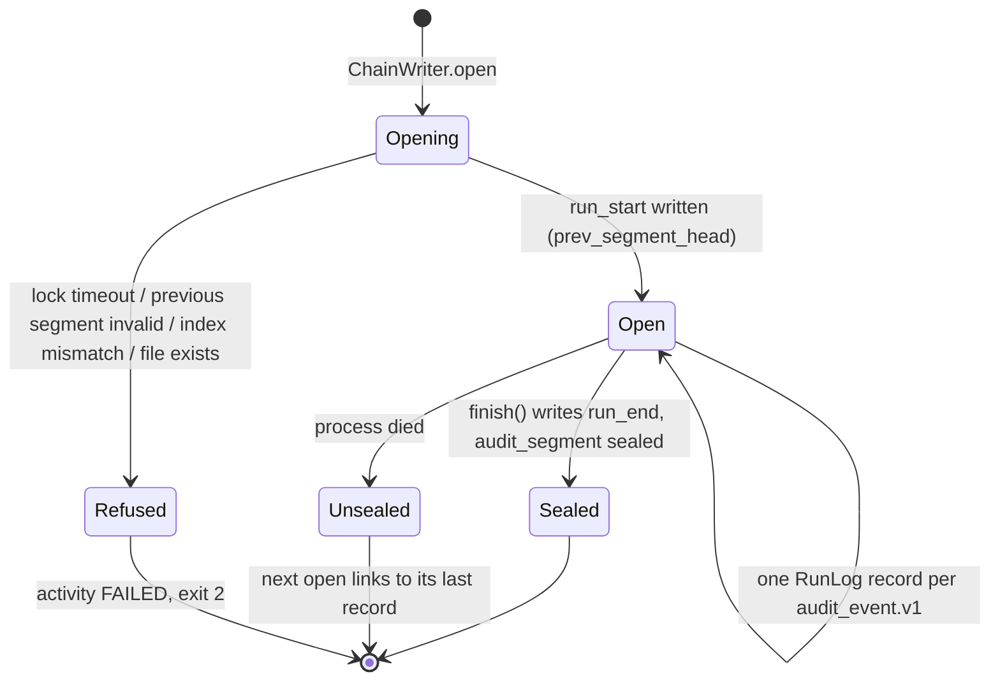
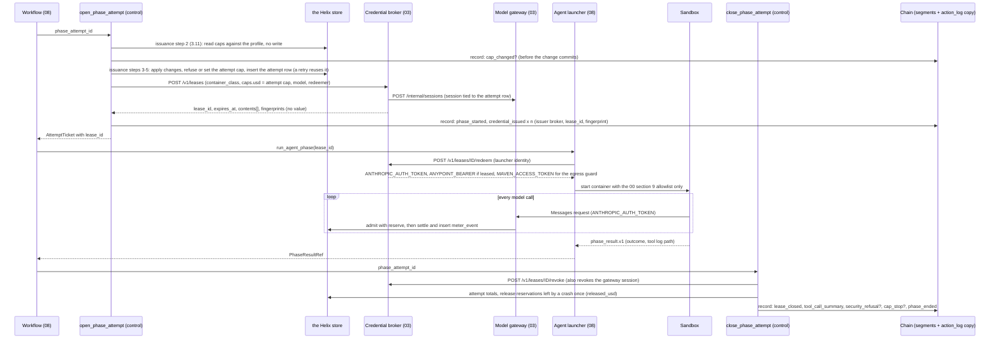
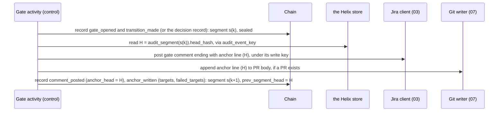
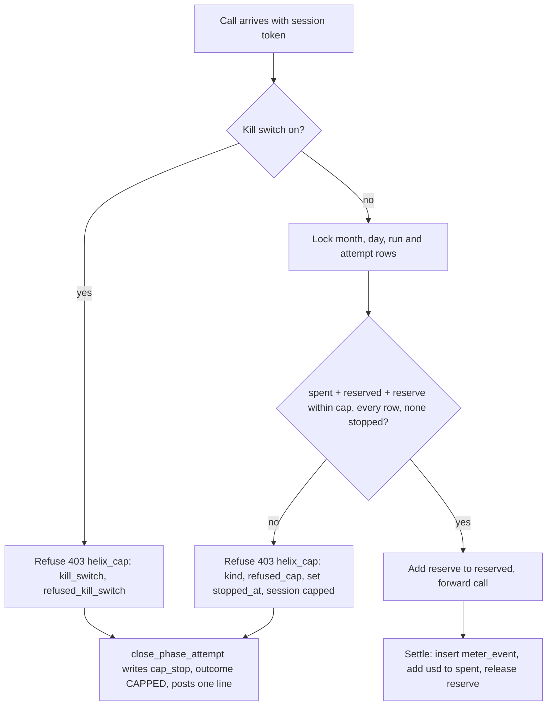
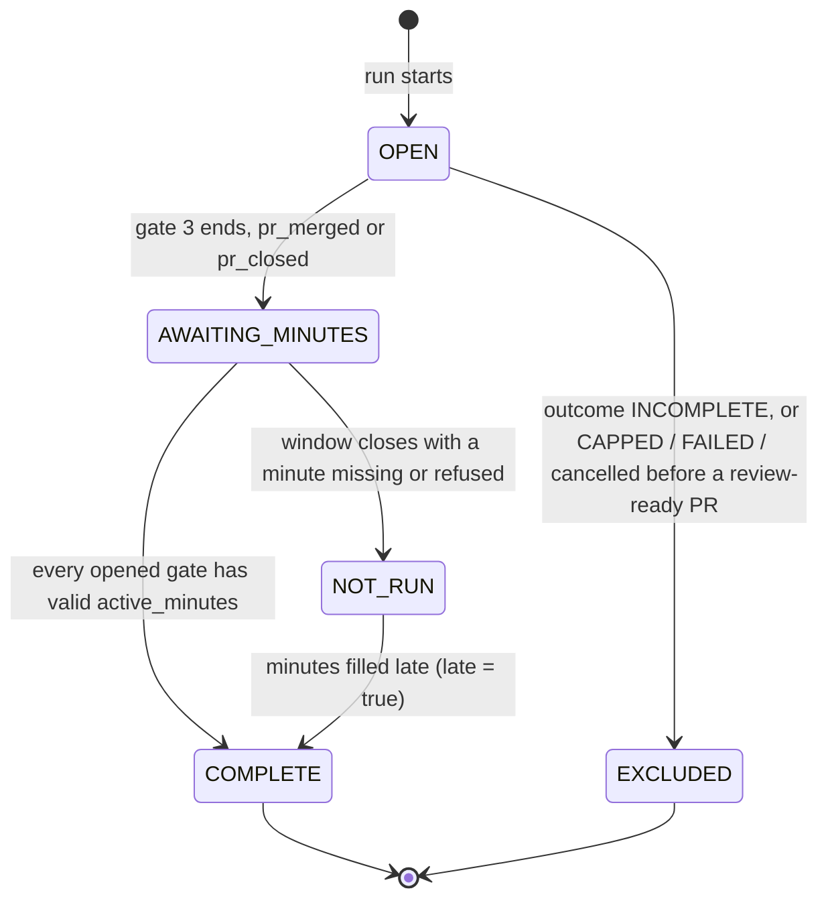

# 09 — Audit, metering and measurement

## 1. Purpose and scope

This file designs three things that let a run be trusted afterwards: the **audit chain** (who did what, when, under which model and which approval), the **meter** (what every model call cost, and the caps that stop spending), and the **measurement** (was the work accepted, and how many minutes the humans spent at each gate). The pilot is held to all three from its first real ticket, so they start in B2 and finish in B5. B3 and B4 add gates 1 and 2 to the measurement. Deploy (B6) is out of scope; gate 4 is reserved in every enum.

This file owns `audit_event.v1`, `meter_event.v1` and the commands `helix audit verify` and `helix meter report` (00 §4, §8). It also introduces these shared identifiers: `audit_segment_header.v1`, `price_table.v1`, `audit_verify.v1`, `meter_report.v1`; the `event_key` field (3.3.2, 3.4); the provenance digests `agent_definition_hash` and `prompt_hash` (3.4), which files 04 and 05 use with this file's definitions and files 06 and 07 are asked to adopt (O4); the command `helix meter measure` (3.13), proposed for 00 §4 (O1); the read-only store role `helix_audit_reader` (3.7); and seven helix-store tables (3.15). Every `[HLD-P#n]` decision here has a stated fallback in section 3.17.

| Sub-phase | What lands from this file |
| --- | --- |
| B2 | Helix-owned append-only audit chain on durable run storage; `helix audit verify`; gateway metering per model call with attempt, run, daily and monthly caps; gate 3 measurement; anchors in the PR body and the merge comment |
| B3 | Gate 1 measurement and anchor; `comment_posted` (`question_set`), `transition_made` and 05's intake events (3.4) |
| B4 | Gate 2 measurement and anchor (draft PR from `[HLD-P#7]`) |
| B5 | The chain stays on durable per-client storage, now file 08's control-plane host under Temporal (the B3–B4 driver already writes there) `[PLAN]` durable storage (plan §3.5); per-run metrics recorded at workflow end; `helix meter report` over many runs |

## 2. Traceability

| Source | What it says | Where it lands here |
| --- | --- | --- |
| Plan §0, *Reviewer minutes are the number* | Every pilot run records the reviewer's minutes | 3.13 |
| Plan §3.2, *The measurement* | *Accepted* (non-author merge, change requests, hand rewrites) and *reviewer minutes*; a pilot that cannot record the minutes has not run | 3.13, guard G14 |
| Plan §3.2, *Exits* | A capped run stops and posts one line with where and what it spent | 3.11, section 4 |
| Audit and metering contract | Helix-owned hash-chain records with provenance, durable storage, independent verification, metering per run and phase, cache hit rate, loops, and rework per run | 3.3–3.12 |
| Plan §3.5, *Guardrails* | One altered record reports the break at that record; the cap holds at one token over and the next phase never starts | G1, G2, G9 |
| Plan §4, decisions 6, 11, 12 | Turnaround; dollar cap default; acceptance target | 3.11, 3.13 |
| Plan §5 | No cryptographic signature on the chain | 3.8 |
| Plan §6 | Provenance on every artefact; reads never migrate; numbers carry their assumption | 3.4, 3.7 |
| HLD, *Components* rows Metering and Audit chain; *Data objects* rows Audit chain and Run measurements; *Measurement* paragraph | As in the plan | 3.3–3.13 |
| `[HLD-P#2]` | The model gateway meters tokens and enforces caps | 3.9, 3.11 |
| `[HLD-P#7]` | Each gate records a digest of what was approved | 3.4 (`gate_approved`, `gate_rejected`, `approvals_invalidated`), 3.7 step 7 (`GATE_APPROVAL_MISMATCH`) |
| `[HLD-P#12]` | Off-path transitions; the pre-B5 driver and its cutover | 3.4 (`off_path_event`, `cutover`), 3.13 (`runner`, cohort) |
| `[HLD-P#15]` | A run is a ticket workflow's lifetime; sub-caps per phase attempt; metered per model call; per-client monthly ceilings; kill switch | 3.11 |
| File 08, open item 3 and §3.12 | Chain appends deduplicated by `event_key`; the record types 08 writes, including `stale_presentation`, the launch evidence and the head-verification verdict | 3.3.2, 3.4; 08's record names mapped in 3.4 |
| File 05 §3.15 | Intake's audit events and the four types it asks for | 3.4 |
| File 01 §3.5.4–3.5.5 | `runlog.open_segment` and the pilot's durable state root; the layout and linking of chain files are 09's | 3.3, 3.3.1 |
| File 03 §3.1 rule 4, §3.5.5, §3.6.3, open item 16 | Shared services hand audit facts to 09 without importing `RunLog`; lease issue, redeem and revoke are audited; a released Draft is chained | 3.1, 3.4 (`credential_issued`, `lease_closed`, `draft_released`) |
| File 10 §3.5 rule 5, §4 | Every refusal reaches the chain; codes go where their owners put them | 3.4 (`security_refusal`) |
| `[HLD-P#16]` | An *ask* is a logged deny that stops the phase | 3.4 (`tool_call_summary.denied`) |
| `[HLD-P#17]` | An INCOMPLETE run is excluded from measurement | 3.13 |
| `[HLD-P#18]` | Active minutes and elapsed wait at every gate; decision 12 stated as active minutes | 3.13 |
| `[HLD-P lower: audit chain]` (review item 24) | Threat model; chain-head digest in the PR and a Jira comment at each gate | 3.6, 3.8 |
| `[HLD-P lower: Meridian surface]` (review item 19) | Contract tests over every Meridian name, variable and output used, including environment variables and the runlog and database schemas | 3.2, G18; the environment-variable, run-log and action-log schema contract tests are file 01's (01 §3.6) |
| Conventions 00 §1 | An `[HLD-P#n]` item must be removable, with the file saying how | 3.17 |

## 3. Design

### 3.1 Modules and responsibilities

| Module (00 §3) | Process class | Responsibility | Tag |
| --- | --- | --- | --- |
| `helix.audit.chain` | Control plane | `ChainWriter`: skips events whose `event_key` is already written (3.3.2), then opens, writes and seals segments; redacts; records segment and event-key rows | `[LLD]` |
| `helix.audit.events` | Any | Builds and validates `audit_event.v1` dicts; computes `agent_definition_hash` and `prompt_hash` per 3.4 | `[LLD]` |
| `helix.audit.anchor` | Control plane | Formats anchor lines; writes them through the Jira client and the git writer; parses them back | `[HLD-P lower]` |
| `helix.audit.verify` | Anywhere with read access to durable run records and the read-only store role `helix_audit_reader`; `--check-anchors` only in the control plane | `helix audit verify`; verifies Helix segment hashes, index records and external anchors | `[LLD]` |
| `helix.metering.pricing` | Control plane | Loads and checks `price_table.v1`; prices one call | `[LLD]` |
| `helix.metering.caps` | Control plane (`open_phase_attempt` for issuance, the gateway per call) | Issuance, admission and settlement against the attempt, run, client-day and client-month balances (3.11) | `[HLD-P#15]` |
| `helix.metering.metrics` | Anywhere | Per-run metrics from the store | `[PLAN]` metrics, `[LLD]` formulas |
| `helix.metering.measurement` | Control plane | `record_measurement(run_id)` and the window sweep, run as `helix meter measure` (3.13): collects accepted, change requests, hand rewrites, minutes; owns the measurement status | `[PLAN]` `[HLD-P#18]` |
| `helix.metering.report` | Anywhere | `helix meter report` | `[PLAN]` |
| `helix.meridian_bridge.runlog` | Control plane | The only import of `meridian.runlog`; a thin adapter (00 §2) | `[PLAN-DEFAULT 5]` |

**No agent writes the chain or the meter.** The agent sandbox has no `MERIDIAN_HOME`, no mount under `$HELIX_STATE_ROOT` and no store credential. Every chain record is written by control-plane code. Agent-side facts (the tool log, the phase result) reach the chain only as summaries and SHA-256 digests read by a control-plane activity after the sandbox exits. `[HLD-P#1]` `[LLD]`

**Nor do the agent launcher or the shared services.** The launcher never imports `meridian` (08 §3.14), and the gateway, broker and receiver hand no record to `RunLog` (03 §3.1 rule 4). They write store rows (`gateway_session`, `credential_lease`, `meter_event`, `ticket_event`), and the next control activity of that run chains them under the row form of `event_key` (3.3.2). This is the per-client audit writer that 03's open item 16 asks for: the store is the queue, and a per-client control process is the writer. Which events record those rows is in 3.4: `credential_issued` and `lease_closed` for leases, `cap_stop` for refused calls, and `off_path_event`, `pr_closed` and the gate records for ticket events. `[LLD]`

### 3.2 Meridian interfaces used (grounded in the pinned source)

Everything below was read in Meridian v1.8.1 (`meridian/__init__.py:15`). Decision 5's contract test holds each row against the pinned wheel `[PLAN-DEFAULT 5]` `[HLD-P lower: Meridian surface]`.

| Name | Source | What Helix relies on |
| --- | --- | --- |
| `RunLog(run_id=None, directory=None)` | `meridian/runlog.py:91` | Creates `{directory}/{run_id}.jsonl` with owner-only directory permissions (`fsutil.private_dir`). A new instance always starts its chain at genesis (`_prev_hash = "0" * 64`, line 97). **It cannot resume an existing file**: a second instance on the same `run_id` would append records whose `prev` is genesis and break the chain |
| `RunLog.start(mode, envs, context)` | `runlog.py:156` | Writes `type=run_start` with `operator`, `signed_in`, `host`, `platform`, `python`, `tool_version` (Meridian's version) and our `context` dict |
| `RunLog.note(message, **fields)` | `runlog.py:176` | Writes `{"type": "note", "run_id": ..., "message": ..., **fields}`. Our fields are spread at the top level, after `type` and `run_id`, so a field named `type` or `run_id` would overwrite them |
| `RunLog.finish(summary: RunSummary)` | `runlog.py:180` | Writes `type=run_end` and closes the instance; any later append raises `RuntimeError("run log is closed")` |
| `RunSummary(run_id, started_at, finished_at, mode, envs, counts, duration_s, operator, ...)` | `runlog.py:62` | Required by `finish` |
| Chain algorithm | `runlog.py:109-124` | Each record gets `ts` (UTC ISO) and `prev`. `payload = json.dumps(record, sort_keys=True, default=str, separators=(",", ":"))`; `hash = sha256(prev + payload)`; one line per record, `fsync` after each write |
| `RunLog.mirror_error`, `RunLog.mirrored` | `runlog.py:105-106`, `126-142` | After the file write, each record is copied to Meridian's `action_log` through `db.audit.mirror_run_record`. The first copy failure stops the copy for that instance and is kept on `mirror_error`; the file goes on |
| `db.audit.mirror_run_record` | `meridian/db/audit.py:19` | Calls `bootstrap.ensure_ready`, which migrates the Meridian database to head (`db/bootstrap.py:225`). **The writer migrates** `[PLAN]` |
| `db.audit.copy_verdict(run_ref, file_hashes)` | `db/audit.py:32` | A read that never migrates. States: `identical`, `incomplete`, `absent`, `broken`, `differs`, `unavailable`; `FINDINGS = ("broken", "differs")` |
| `RunLog.verify(path)` | `runlog.py:196` | Returns `{valid, records, broken_at, reason?}`; `broken_at` is the 0-based index of the first bad record. It cannot see records cut from the end or a file deleted whole (docstring, lines 207-212) |
| `meridian runs --verify RUN_ID_OR_PATH` | `meridian/cli.py:2649-2681`, parser `5858-5868` | Takes a path, or a run id looked up under the import-time `RUN_LOG_DIR`. Prints JSON: `RunLog.verify`'s result plus `action_log` = `copy_verdict(path.stem, hashes)`. Exit **0** valid with no copy finding; **1** chain invalid or copy `broken`/`differs`; **2** no log at that path (`EXIT_ERROR`); **3** is `EXIT_PREFLIGHT` (`cli.py:56`), which the wrapper treats as an error |
| State directory | `meridian/settings.py:58-101` (`_state_dir`; the variable is read at line 72) | Meridian reads **`MERIDIAN_HOME`**, not `MERIDIAN_STATE_DIR`; `MERIDIAN_STATE_DIR` is read nowhere in `meridian/`. `RUN_LOG_DIR = STATE_DIR / "runs"` is bound at import (`settings.py:568-569`) |
| Database URL | `meridian/db/engine.py:46-59` | `MERIDIAN_DATABASE_URL`, else `sqlite:///{state_dir()}/meridian.db`, resolved at call time |
| SQLite pragmas | `meridian/db/engine.py:145-151` (`_sqlite_on_connect`, registered at line 70) | On **every** SQLite connection, including the read inside `copy_verdict`: `PRAGMA journal_mode=WAL`, `foreign_keys=ON`, `busy_timeout=15000` (`SQLITE_BUSY_TIMEOUT_MS`), `synchronous=NORMAL`. No migration runs, but the first connection to a database not yet in WAL mode rewrites its header, and a WAL database needs `-wal` and `-shm` files beside it and shared memory on one host (SQLite behaviour, `[VERIFY]` on the pinned SQLite) |
| Action-log redaction keys | `meridian/db/repositories/actions.py:39-40` (`_EXTRA_SECRET_KEYS`), `54-68` (`_redact`), `224-225` (where it applies), `285-335` (`mirror`); `meridian/estate/client_inventory.py:74-76` (`SECRET_KEYS`) | `_redact` replaces the value of any key in `SECRET_KEYS \| _EXTRA_SECRET_KEYS`, stripped and lower-cased: `clientsecret`, `client_secret`, `secret`, `password`, `token`, `access_token`, `refresh_token`, `consumersecret`, `consumer_secret`, `authorization`, `api_key`, `apikey`, `bearer`, `x-api-key`. It applies only to the `request` and `response` of the action log's own records (`_append`). `mirror` stores a run-log record as written and re-derives its hash, so it redacts nothing: a secret in a Helix event would reach the copy. Helix therefore redacts before `note()` (3.4) |
| Copy continuity | `meridian/db/repositories/actions.py:300-306` | The copy refuses a record whose `prev` is not the hash of the last record it holds for that `run_ref`. Each segment is its own `run_ref`, so every segment starts a fresh copy chain at genesis |
| `MERIDIAN_ACTOR` | `runlog.py:280-283` | Becomes `signed_in` on `run_start` and `performed_by` on the copy |
| Doctor run-log check | `meridian/doctor.py:778-843` (`check_run_logs`) | Verifies every `*.jsonl` in `{state}/runs`; a log without `run_end` is counted as unfinished, not failed |

Consequences for Helix:

| Consequence | Decision | Tag |
| --- | --- | --- |
| `RunLog` cannot resume a file, and a run lasts days across many processes | The chain of one run is a sequence of **segments**: one `RunLog` file per batch of writes, linked by the previous segment's head (3.3) | `[LLD]` |
| `RUN_LOG_DIR` is fixed at import | The bridge always passes `directory=` explicitly, and `helix audit verify` always passes an absolute path | `[LLD]` |
| Meridian reads `MERIDIAN_HOME` | Every process that writes the chain exports `MERIDIAN_HOME` = `$HELIX_STATE_ROOT/{client_id}/meridian/` (00 §7, §9). `helix audit verify` sets it too, outside the control plane (3.7, O1). Helix never sets `MERIDIAN_STATE_DIR` | `[PLAN]` location, Meridian source for the name (00 §7) |
| Meridian forces WAL on SQLite | One host at a time writes a client's state directory, on local or block storage; every process that opens `meridian.db`, verify included, needs write access to the directory for the `-wal` and `-shm` side files (3.3) | `[LLD]` |
| `note()` lets fields overwrite `type` and `run_id` | `type`, `run_id`, `message`, `ts`, `prev` and `hash` are reserved. The schema forbids them as Helix keys, and Helix's run id is carried as `helix_run_id` | `[LLD]` |

### 3.3 Chain storage and segments

| What | Where | Tag |
| --- | --- | --- |
| Meridian state (the chain's home) | `{MERIDIAN_HOME}` = `$HELIX_STATE_ROOT/{client_id}/meridian/` (00 §7) under every runner: in B2 on the pilot host's local block storage, bind-mounted into both control jobs (01 §3.5.5); in B3–B5 on file 08's control-plane host | `[PLAN]` location, B2 mount per 01 |
| Segment files | `{MERIDIAN_HOME}/runs/{segment_id}.jsonl` | `[LLD]` |
| Segment id | `{run_id}.s{NNNN}`, `NNNN` zero-padded from `0001`, at most `9999`. Example: `acme.ACME-123.s0007` | `[LLD]` |
| Lock file | `{MERIDIAN_HOME}/runs/{run_id}.lock` (exclusive `flock`) | `[LLD]` |
| Copy (action log) | Meridian's database at `{MERIDIAN_HOME}/meridian.db`, table `action_log`, `run_ref` = segment id. `MERIDIAN_DATABASE_URL` is not set (08 §3.14), and 01's bridge refuses it (01 §3.5.2) | `[PLAN]` copy, `[LLD]` SQLite |
| Segment index | Helix store tables `audit_segment` and `audit_event_key` (3.15) | `[LLD]` |

**Durability, by sub-phase.**

| Sub-phase | Where the chain lives | Real tickets allowed? | Tag |
| --- | --- | --- | --- |
| B2 | `$HELIX_STATE_ROOT/{client_id}/meridian/` on the always-on pilot host's local block storage. Both control jobs (`control-pre`, `control-post`) run as containers on that host with `{state_root}/{client_id}` bind-mounted read-write; the agent job mounts none of it (01 §3.5.5, §3.8). `$RUNNER_TEMP` is never a state root, and `bind_control` refuses a state root without the RUNBOOK's `.helix-state-root` marker (01 §3.5.5). `audit_segment` and `audit_event_key` rows go to the Helix store, which `helix run` reaches through `HELIX_DATABASE_URL` (01 §3.3); the heads go to the PR body and Jira (3.6) | Only on that durable mount. Plan §7 item 2 requires one real ticket in B2, and its chain must outlive the jobs. A pilot that cannot mount the state root runs synthetic `acme-*` tickets only | `[LLD]`, following 01 §3.5.5 (01: `[HLD-P#6]` `[LLD]`); stricter than the HLD's "B2 imports it; B5 makes it durable" |
| B3–B4 (08's driver, 08 §3.16) and B5 | `$HELIX_STATE_ROOT/{client_id}/meridian/` on file 08's control-plane host, local block storage (08 §3.2), never the worker's home | Yes | `[PLAN]` (plan §3.5 *Writes*) |

**Storage rules that follow from Meridian's WAL** (3.2, `db/engine.py:145-151`) `[LLD]`:

1. One control-plane host at a time writes a given client's state directory, and that directory sits on local or block storage, never on a network file system. A WAL database needs shared memory on one host `[VERIFY]` for the chosen storage product (O14). File 08 places each client's chain-writing activities on that host (O3).
2. The storage honours `flock` (the run lock) `[VERIFY]` for the chosen product (O14).
3. Every process that opens `meridian.db`, `helix audit verify` included, needs write access to the directory: SQLite creates the `-wal` and `-shm` files there. Verify never changes the database's content (3.7).
4. If one host per client cannot be kept, the fallback is a per-client PostgreSQL database for the copy through `MERIDIAN_DATABASE_URL` (`db/engine.py:46-59`). The segment files and their lock would still need one host. This is not the default. It needs a `[VERIFY]` that Meridian 1.8.1's action log runs on PostgreSQL, and a change to 01's bridge, which refuses the variable today (01 §3.5.2; 08 open item 18).

**What a segment is.** A sealed batch of records written by one control-plane process: one `RunLog` instance from `start()` to `finish()`. A control-plane activity writes one segment, or two when it anchors, because an anchor cannot sit inside the segment whose head it publishes (3.6). A retried activity whose events were all written before writes none (3.3.2). Segment `n`'s `run_start.context.prev_segment_head` holds the `hash` of the last record of segment `n-1`, so the segments form one chain across files. `[LLD]`

**Opening a segment** (`ChainWriter.open(run_id, opened_by)`), under the lock. Steps 1–5 are also the first half of `ChainWriter.record` (3.3.2):

1. Take the run's lock, waiting at most 120 seconds; otherwise raise `AuditLockTimeout`. `[LLD]`
2. Read the `audit_segment` rows. If the last row is `open` and has no file, a process died between steps 7 and 8: mark it `abandoned`. Its number is never reused. If the last row is `open` and its file ends in `run_end`, the process died between `finish()` and the row update: complete the row from the file (`state = sealed`, `closed_at` = the `run_end` record's `ts`, `head_hash`, `records`; `mirrored` and `mirror_error` stay null, meaning unknown). Let `k` be the highest segment number that has a file. A file with no row, or a row other than `abandoned` with no file, raises `AuditIndexMismatch`.
3. If `k > 0`, run `RunLog.verify` on segment `k`. If it is not valid, raise `AuditChainBroken`: tampering is caught at the next write, not only at the next verify.
4. Read segment `k`'s last record's `hash`. If segment `k` is sealed and its `audit_segment.head_hash` differs, raise `AuditIndexMismatch`.
5. Backfill the event-key index from segment `k` (3.3.2). Only segment `k` can hold unindexed keys, because every earlier segment was backfilled when its successor was opened.
6. The new number is one more than the highest number in the rows (abandoned ones included). Refuse with `AuditIndexMismatch` if that file already exists (no overwrite, ever).
7. Insert the `audit_segment` row with `state = open`.
8. Call file 01's `meridian_bridge.runlog.open_segment(segment_id, directory=MERIDIAN_HOME/runs)`, which constructs `RunLog(run_id=segment_id, directory=...)`, then `start(mode="helix", envs=[], context=header)` (header below). `prev_segment_id` names segment `k`, so the link skips an abandoned number.

**Sealing** (`ChainWriter.seal()`): `finish(RunSummary(...))` with `counts` = events by type; then update the `audit_segment` row to `state = sealed` with `closed_at`, `head_hash`, `records`, `mirrored` and `mirror_error`; then release the lock. A process that dies before sealing leaves an unsealed segment. The next open links to its last record, and verify reports it as `SEGMENT_UNSEALED` (information only), as Meridian's doctor does. `[LLD]`

Single writer: the workflow (file 08) never runs two chain-writing activities of one run at the same time, and the lock enforces it if it does. `[LLD]`



**Segment header**: the `context` passed to `RunLog.start()`. `[LLD]`

| Field | Type | Constraint | Example |
| --- | --- | --- | --- |
| `schema` | string | const `audit_segment_header.v1` | |
| `helix_run_id` | string | 00 §6 `run_id` | `acme.ACME-123` |
| `client_id` | string | 00 §6 | `acme` |
| `ticket_key` | string | 00 §6 | `ACME-123` |
| `segment_no` | integer | 1–9999 | `7` |
| `prev_segment_id` | string or null | null only for `s0001` | `acme.ACME-123.s0006` |
| `prev_segment_head` | string or null | 64 lowercase hex; null only for `s0001` | `9f86d0...0a08` |
| `prev_segment_sealed` | boolean or null | false when the previous segment ended without `run_end` | `true` |
| `opened_by` | object | `{component, activity, phase_attempt_id?}` | `{"component":"controlplane","activity":"close_phase_attempt","phase_attempt_id":"acme.ACME-123.build.2"}` |
| `helix_version` | string | Helix's package version | `0.1.0` |

`run_start`'s own fields add `tool_version` (Meridian's version) and the host. `MERIDIAN_ACTOR` is set to `helix:{run_id}`, the value file 08 uses for its control subprocesses (08 §3.14), so `signed_in` and the copy's `performed_by` name Helix and the run rather than a container user. Meridian reads it from the environment only (`ACTOR` is in `ENV_ONLY_SETTINGS`, `settings.py:159-161`); file 01 §3.5.2 sets the same value. `[LLD]` (O1)

#### 3.3.1 File 01's bridge and the pilot's state root

File 01 owns `meridian_bridge` and has adopted this file's segment layout (01 §3.5.5). The calls this file makes: `[LLD]`

| File 01 (01 §3.5.4–3.5.5) | Used here | Status |
| --- | --- | --- |
| `runlog.open_segment(segment_id, *, directory) -> RunLog`, control class only | `ChainWriter.open` step 8, with `directory` = `{MERIDIAN_HOME}/runs`; one file per segment, `{run_id}.s{NNNN}.jsonl`. An attempt usually has two segments, one at open and one at close (3.5) | Adopted by 01 |
| `open_segment` refuses an existing file (01 G13) | Step 6; this file's G8 | Adopted |
| `runlog.chain_head(path) -> str` | Step 4 | Adopted |
| `runlog.runs_verify(*, chain_file) -> ChainVerdict` | `helix audit verify`, step 2 | Its bind and environment differ from 3.7 step 2 (O16) |

**B2: the chain on the pilot host** `[LLD]`, following 01 §3.5.5 and §3.8:

1. Both control jobs (`control-pre`, `control-post`) run as containers on the always-on pilot host with `{state_root}/{client_id}` mounted read-write from its local block storage. So both jobs, and every later run of the ticket, see one state directory. The agent job mounts none of it and writes no chain.
2. No segment file, `meridian.db` or token cache travels in a workflow artefact. The `run-pre` and `run-agent` artefacts hold the run directory only (01 §3.8); the state directory is mounted, never copied.
3. A control job bound to the wrong state directory cannot continue a chain. `bind_control` refuses a root without the RUNBOOK's `.helix-state-root` marker (01 §3.5.5, 01 G31). `ChainWriter.open` step 2 refuses a directory that lacks a segment the store records, with `AuditIndexMismatch` (G32).
4. `helix audit verify` runs on the pilot host against the mounted directory, or anywhere against a copy of it (3.7).
5. If the owner rejects self-hosted runners, 01's fallback carries the run's segment files and `meridian.db` between the control jobs as an artefact, never the token cache (01 §3.5.5). `open` step 2 then checks the restored files against the store rows, so a missing or older carry raises `AuditIndexMismatch` (G32). Under that fallback no mount holds the chain between jobs, so a real ticket needs the owner's approval of the fallback, and the artefact's retention must outlast the run `[VERIFY]` (O14).

#### 3.3.2 Deduplication by `event_key`

File 08 retries control activities (up to 5 attempts under policy T, 08 §3.6). A retried `close_phase_attempt` or gate activity would otherwise write `phase_ended`, `gate_approved` and the rest again, in a new segment. Every event therefore carries an `event_key`, and the writer skips a key it has already written. `[LLD]` (08 §3.12)

**Key forms.** `event_key` is a string of at most 200 characters, built only from deterministic state, so a retry, a replay or a restarted worker builds the same key:

| Form | Pattern | Used by |
| --- | --- | --- |
| Step | `{run_id}/s{step_seq:05d}/audit.{event}/{ordinal}` | Events an activity produces itself. `{run_id}/s{step_seq:05d}` is the prefix of file 08's write key (08 §3.12), `step_seq` from 08's state (also under the driver, 08 §3.16). Under `helix run` (B2), `step_seq` is one more than the highest `step_seq` in the run's `audit_event_key` rows when the step starts, kept in `run_state.v1.steps[].step_seq` so a resumed step reuses it (01 §3.9). `ordinal` counts events of that type in the step, from 1 |
| Row | `{run_id}/row/{table}/{row_id}/{event}` | Events that record a store row written by a shared service, whichever activity chains it first: `credential_issued` (`credential_lease`, `row_id` = `{lease_id}.{content}`), `lease_closed` (`credential_lease`, `row_id` = `lease_id`), and facts relayed from `gateway_session`, `meter_event` and `ticket_event` rows. A new row is a new fact: a retried `open_phase_attempt` that revokes the open lease and gets another (08 §3.4) chains both leases and conflicts with nothing |
| Measure | `{run_id}/measure/{gate or run}/{name}/{digest12}` | Events from `helix meter measure` (3.13), which is not a workflow step. `digest12` is the first 12 hex characters of a SHA-256. For `measurement_recorded`, `name` is the metric and the digest is the event's `data_sha256` (below), over the value, `recorded_by`, `changed_at` and `refused` together: the same facts never repeat, and every new change of the field gets a new key, such as the signer entering the number a wrong account had entered. For its `comment_posted` events, `name` is `comment.{purpose}` and the digest is of the comment's write key (3.13) |

Example: `acme.ACME-123/s00042/audit.phase_ended/1`.

**Index.** Table `audit_event_key` (3.15): one row per written key, with the segment and record that hold it and `data_sha256` = SHA-256 of `json.dumps(data, sort_keys=True, separators=(",", ":"))` of the event's `data` after redaction.

**`ChainWriter.record(run_id, events, opened_by) -> list[event_id]`**, the normal entry point:

1. Steps 1–5 of `open` (lock, index checks, verify segment `k`, backfill).
2. For each event, in order: compute `data_sha256`. If its key has a row with the same `data_sha256`, skip it and return the stored `event_id`. If the row's `data_sha256` differs, raise `AuditEventKeyConflict` (non-retryable: the activity ends `FAILED`). Two events with one key in the same batch raise the same error.
3. If nothing is left, release the lock and return: no empty segment is written.
4. Otherwise steps 6–8 of `open`; then for each event, `RunLog.note()` (the file write and its `fsync`), then insert its `audit_event_key` row; then `seal()`.

An activity that anchors calls `record` twice (3.6). Between the calls it reads the head of the segment holding the first call's events (`audit_event_key.segment_id`, then `audit_segment.head_hash`), so a retry whose first call was skipped finds the same head. `open` and `seal` are the internal halves of `record`; no activity calls them directly.

**The crash window.** A process can die after `note()` wrote a record and before its key row was inserted. Backfill (step 5 of `open`) closes it: for every `audit_event.v1` record in segment `k` whose `event_key` has no row, insert the row from the record (`segment_id`, `record_index`, `event_id`, `event`, `data_sha256`). A key that already has a row pointing at another record means the key was written twice: `AuditIndexMismatch`. The retried activity then skips the event as in step 2.

An event's `data` holds only values read from deterministic inputs (store rows, files and their digests, external results matched by 08's write keys). `event_id` and `occurred_at` sit outside `data`, so a retry that mints a new `event_id` still matches. `[LLD]`

**Values a retry would otherwise read differently**, and how each is pinned `[LLD]`:

| Event | Value | Rule |
| --- | --- | --- |
| `credential_issued` | `lease_id`, `fingerprint`, `issued_at`, `expires_at` | Row form keyed by the lease (above): each lease is its own fact |
| `phase_started` | `caps` (the remaining amounts at issuance) | Issuance stores them on the attempt's `meter_balance` row as `issued_with`, and a retry reuses that row (3.11, 3.15). Other runs' spend after issuance does not change them |
| `phase_ended` | `usage.reservations_released_usd`; `duration_s` | The released amount is stored once on the attempt row as `released_usd` (3.11); a retry reads it and releases nothing more. `duration_s` is `phase_result.v1`'s `ended_at − started_at`, never the clock at close |
| `gate_approved`, `gate_rejected`, `signal_refused` | `gate_approval_id` | Derived, never drawn: UUID v5, in a fixed the Helix namespace, of `{client_id}/{source_event_id}/{gate}`, which is the `gate_approval` row's unique key (08 §3.9.3). A retry that crashed after the chain record and before the row rebuilds the same id (O3) |
| `cap_changed` | `old_cap_usd`, `stop_cleared` | Chained before the change is committed (3.11, issuance steps 2 and 3), so a retry computes the same change and skips it by key |
| Any | A value read fresh from the profile, Jira or GitHub that changed between two tries (a profile edit, or two faults in one step) | `AuditEventKeyConflict`: the activity ends `FAILED` for an operator. The chain never holds two different facts under one key |

### 3.4 `audit_event.v1`

One Helix event = one `RunLog.note()` record. The record as written to the file has two kinds of key:

| Kind | Keys | Who sets them |
| --- | --- | --- |
| RunLog-owned (reserved) | `type` = `"note"`, `run_id` = the segment id, `message`, `ts`, `prev`, `hash` | `RunLog` (`message` is a short helix-written line such as `phase_ended build 2 DONE`, never requester text) |
| Helix-owned | Every field in the next table | `helix.audit.events`, validated against `schemas/audit_event.v1.json` before `note()` is called |

**Common fields** `[LLD]`

| Field | Type | Constraint |
| --- | --- | --- |
| `schema` | string | const `audit_event.v1` |
| `event` | string | one of the event types below |
| `event_id` | string | UUID v4 |
| `event_key` | string | required; at most 200 characters; one of the three forms in 3.3.2, for example `acme.ACME-123/s00042/audit.phase_ended/1`; unique per run (table `audit_event_key`) |
| `helix_run_id` | string | 00 §6 `run_id` |
| `client_id` | string | 00 §6 |
| `ticket_key` | string | 00 §6 |
| `phase_attempt_id` | string or null | 00 §6; null for events outside an attempt |
| `occurred_at` | string | RFC 3339 UTC: when the fact happened. RunLog's `ts` is when it was written |
| `actor` | object | `{kind: control_plane \| human \| gateway \| broker \| sandbox_runner, component: string, account_id: string?}`; `account_id` is a Jira account id or GitHub login, never a display name or email |
| `provenance` | object or null | required on `phase_started`, `phase_ended`, `tool_call_summary`, `gate_approved`, `gate_rejected`, `pr_opened`, `cap_stop` |
| `data` | object | per event type; at most 16 KiB serialized; the overflow rule below applies. Every event type's schema also allows `truncated` (boolean) and the `{name}_total` and `{name}_sha256` fields the rule adds |
| `redactions` | array of string | JSON Pointers of values replaced by `"<redacted>"`; empty when none |

**When `data` would exceed 16 KiB** `[LLD]` (fields that grow over a long session, such as `tool_call_summary.denied`, `by_tool` and `mcp_calls`):

1. A list keeps its first 100 entries. A map keeps its 100 keys with the largest counts, and the rest are summed under the key `"_other"`.
2. Each list or map cut this way gains `{name}_total` (the full entry count) and `{name}_sha256` (SHA-256 of the full value as canonical JSON, taken from the source, for example the tool log), and `data.truncated` is set to `true`. Example: `denied` keeps 100 entries, plus `denied_total` and `denied_sha256`.
3. If `data` is still over 16 KiB, the cut fields keep only their `_total` and `_sha256`.
4. Size never fails the activity. The full values stay in their source file, which the event binds by its SHA-256 (for example `tool_log.sha256`).

**Provenance object** (plan §6: ticket, model and provider, prompt hash, region, the reviewer who signed; plan §3.5: the agent definition's hash) `[PLAN]` fields, `[LLD]` shape

| Field | Type | Constraint | Example |
| --- | --- | --- | --- |
| `ticket_key` | string | 00 §6 | `ACME-123` |
| `model` | string or null | canonical model id (00 §2) | `claude-opus-5-5` |
| `route_model_id` | string or null | the id sent to the provider | `anthropic.claude-opus-5-5` on Bedrock |
| `provider` | string or null | `anthropic` \| `bedrock` \| `vertex` | `bedrock` |
| `region` | string or null | the profile route's region; `n/a` when the route has none | `eu-west-1` |
| `prompt_hash` | string or null | 64 hex; definition below | |
| `agent_definition_hash` | string or null | 64 hex; definition below | |
| `reviewer` | object or null | `{system: jira \| github, account_id}`; set on gate events | `{"system":"jira","account_id":"acme-architect-01"}` |
| `helix_version`, `meridian_version` | string | package versions | `0.1.0`, `1.8.1` |

Hash definitions. Introduced and owned here as shared identifiers. Files 04 and 05 already use them with these definitions (04 `phase_brief.v1.agent`, `phase_result.v1.agent`, `agent_definition.v1` and §3.8 *Digests*; 05 `produced_by`). Two other digests are **not** these and must not be put in their place: the `prompt_sha256` and `agent_definition_sha256` of files 06 and 07 (07's `prompt_sha256` covers "system prompt plus first user message"), which must become these names with these inputs (O4); and the gateway's SHA-256 of `system`, which is `request_system_sha256` (3.9), not `prompt_hash` (O15). File 04 proposes adding `POLICY_VERSION`, the SDK version and the CLI version to `agent_definition_hash` (04 §3.8). This file keeps the hash over files only, so it stays stable per the Helix version and phase, and chains those three values beside it in `phase_ended.launch` (O9). `[LLD]`

| Name | Definition |
| --- | --- |
| `agent_definition_hash` | SHA-256 over the UTF-8 lines `"{relpath}\t{sha256(file bytes)}\n"`, sorted by `relpath`, for every file under `src/helix/agents/definitions/{phase}/` plus every skills file that definition lists (paths relative to the repository root). It is stable per the Helix version and phase |
| `prompt_hash` | SHA-256 over `system_prompt_bytes + b"\x00" + brief_bytes`: the definition's system prompt file as shipped, and the `phase_brief.v1` file the attempt was started with. The control plane computes it before the sandbox starts, from artefacts it holds. The text the SDK adds to the prompt is not in it; the gateway records `request_system_sha256` per call for that (3.9) |

**Event types**

The plan names no event types. It requires that the chain carry "the provenance fields and the agent definition's hash" (plan §3.5) and that "every artefact is in the chain" (plan §7 item 5); the types below are this file's way of meeting that, so each is tagged `[LLD]` with any HLD item it serves. The list is closed: a type another file writes is added here first. Activity names are file 08's (08 §3.6), including `audit_record`, `run_close` and `run_measure`; `intake-apply` and `helix discover` are file 05's commands, which 08's control activities run. `[LLD]`

| `event` | Written by (activity, file 08, unless named) | `data` fields | Tag |
| --- | --- | --- | --- |
| `workflow_started` | `audit_record`, as the first step of every execution, driver run or `helix run` | `reason` (08's `created` \| `reopened` \| `continued` \| `cutover` \| `late_event`), `driver` (`action` \| `controlplane` \| `temporal`), `measurement_cohort` (`pre_b5` \| `b5`, 08 §3.16), `temporal_workflow_id`, `temporal_run_id` (null outside Temporal), `profile_digest` | `[LLD]` |
| `phase_started` | `open_phase_attempt` | `phase`, `attempt` (int ≥ 1), `brief {path, sha256}`, `inputs [{path, sha256}]` (from the brief), `caps {attempt_usd, run_remaining_usd, day_remaining_usd, month_remaining_usd}` (the attempt row's `cap_usd` and `issued_with`, 3.11; `day_remaining_usd` null when no daily cap is set), `image_digest` | `[LLD]` |
| `credential_issued` | `open_phase_attempt`, one per entry of the lease's `contents[]` (row form of `event_key`); `run_discover` for its `meridian_env` handout and `run_design_validate` for its `ruleset` bearer (step form: a handout has no lease row) | `credential_kind`: 03's lease contents (`model_session` \| `maven_access` \| `anypoint_bearer`, 03 §3.6.2), or `meridian_env` (03 `POST /v1/meridian-env`: the discover app's pair for a credentialed Meridian child), or `ruleset_bearer` (03 `POST /v1/bearer`, purpose `ruleset`); `issuer` (`broker`: every credential is minted inside a broker lease or handout, 03 §3.6.2); `lease_id` (null for a handout); `issued_to {class: agent_sandbox \| egress_guard \| control_plane, phase_attempt_id}` (`maven_access` goes to the attempt's egress guard, never into the sandbox's environment, 03 §3.6.2); `scope` (`{models[], usd_cap}`, `{app_key, grants[]}` or `{path_prefix}` for `maven_access`); `issued_at`; `expires_at`; `fingerprint` (the broker's `fingerprints` entry: first 16 hex characters of the credential's SHA-256; never the value) | `[LLD]`, `[HLD-P#1]` `[HLD-P#2]` scope |
| `lease_closed` | `close_phase_attempt` after it revokes the lease; for a lease revoked elsewhere (a retried `open_phase_attempt`, an operator, expiry), the run's next control activity (row form) | `lease_id`, `container_class`, `contents []`, `redeemer` (03's `{kind: mtls, subject}` or `{kind: github_oidc, repository, gh_run_id, job}`), `redeemed_at` (null when never redeemed), `revoked_at` (null when it expired unrevoked), `expires_at`. 03 §3.6.3 audits issue, redeem and revoke: issue is `credential_issued`, the other two are this record | `[LLD]`, `[HLD-P#1]` |
| `tool_call_summary` | `close_phase_attempt` | `tool_log {path, sha256}` (04's tool log), `calls_total`, `by_tool {name: {allowed, denied}}`, `denied [{tool, rule_id, args_sha256}]` (a hook *ask* appears here as a deny `[HLD-P#16]`), `bash_classes {mvn_package, mvn_test, other}`, `mcp_calls {"server.tool": n}`, `files_written`, `source: "sandbox_runner"`. Tool arguments are kept out of the chain and bound by digest; the overflow rule above caps the lists and maps | `[LLD]` |
| `security_refusal` | `close_phase_attempt` for refusals inside the sandbox (read from the tool log and `phase_result.v1.findings`); `audit_record` for a control-plane component's refusal within a run | `code` (the refusal's code as its owner defines it, 10 §4: 04's findings such as `POLICY_STOP`, `CREDENTIAL_IN_TRANSCRIPT`, `CREDENTIAL_IN_OUTPUT`; 07's `SECRET_FOUND`, `TREE_CI_FILE`; 03's outbound-scan and push refusals), `rule_id` (the rule id when there is one, for example 04's `R-EGR-01`, `R-SEC-01`, `R-ASK-01`, `R-LIM-01`; else null), `component` (`runner_preflight` \| `pretooluse_hook` \| `permission_request` \| `egress` \| `transcript_scan` \| `secret_scanner` \| `outbound_scan` \| `git_writer` \| `gateway` \| `doctor`), `target_sha256` (SHA-256 of what was refused: path, command, host or artefact; never the value), `phase_attempt_id` (null outside an attempt). A refusal with no run (a webhook signature or replay refused before routing) has no chain and stays in 03's log. A refused gate signal is written once, as `signal_refused`. A hook deny that does not stop the session is in `tool_call_summary.denied` only (10 §4) | `[LLD]` (10 §3.5 rule 5) |
| `phase_ended` | `close_phase_attempt` | `phase`, `attempt`, `outcome` (00 §5 PhaseOutcome), `exit_code`, `outputs [{path, sha256}]`, `usage` (from the meter store, 3.9: `input_tokens`, `output_tokens`, `cache_read_tokens`, `cache_write_tokens`, `usd`, `calls`, `usage_unreadable_calls`, `reservations_released_usd` (3.11)), `sdk_reported {total_cost_usd, subtype, usage}` (advisory), `usage_disagrees` (true when `phase_result.v1.usage` token counts differ from the store's, G13), `findings_count`, `duration_s` (`phase_result.v1`'s `ended_at − started_at`), `launch {evidence {path, sha256}, image_digest, hook_policy_sha256, env_names [], sdk_version, cli_version, policy_version}` (08's `launch-evidence.json`, 08 §3.15, and `phase_result.v1.agent`, 04; names only, never values) | `[LLD]` |
| `cap_stop` | `close_phase_attempt`; `open_phase_attempt` when issuance was refused | `cap_kind` (`attempt` \| `run` \| `client_day` \| `client_month` \| `kill_switch` \| `sdk_budget`), `cap_usd`, `spent {attempt_usd, run_usd, day_usd, month_usd}`, `overshoot_usd`, `overshoot_bound_usd` (3.11), `last_meter_event_id`, `refused_at` | `[LLD]` `[HLD-P#15]` |
| `cap_changed` | `open_phase_attempt`, when issuance applies a changed profile cap (3.11) | `scope_kind`, `scope_key`, `old_cap_usd`, `new_cap_usd`, `stop_cleared` (boolean), `profile_digest` | `[HLD-P#15]`, `[LLD]` event |
| `gate_opened` | The step that posts the gate's own comment, so the comment can carry the anchor (3.6): 05's `intake-apply` for gate 1 (05 §3.15); `apply_effects` for gates 2 and 3 (08 §3.7). One writer per round (O3) | `gate` (00 §6), `round` (int ≥ 1), `ticket_state`, `presented_digest` (08's digest of what is put before the signer), `approvers [account_id]` (from the profile) | `[LLD]` |
| `gate_approved` | `verify_gate_decision`; in the B2 pilot, `control-pre`'s attachment acceptance for gates 1 and 2 (07 §3.11.1, 01 §3.9) | `gate`, `round`, `approver {system, account_id}` (`{system}:{account_id}` equals 08's `gate_approval.actor_id`), `approved_digest` (= `gate_approval.decided_digest`), `gate_approval_id` (08's `approval_id`, derived as 3.3.2 says; `control-pre` writes the row in B2 too), `signal_source {kind: jira_webhook \| github_webhook, ticket_event_id}` (03's `ticket_event_id`, which is 08's `gate_approval.source_event_id`, not the delivery id), `decided_at` | `[LLD]`, `[HLD-P#7]` digest |
| `gate_rejected` | `verify_gate_decision` | `gate`, `round`, `approver`, `decided_digest` (or null), `gate_approval_id`, `signal_source`, `reason_sha256` (the reason text stays on the ticket), `decided_at` | `[LLD]` |
| `signal_refused` | `verify_gate_decision`; `audit_record` for a refusal decided in workflow code | `gate`, `actor {system, account_id}`, `reason` (08's `refusal_reason`: `gate_not_open` \| `actor_is_bot` \| `actor_not_approver` \| `separation_of_duties` \| `transition_not_found` \| `stale_presentation` \| `digest_mismatch` \| `repo_settings_changed`), `gate_approval_id` (null when no row was written) | `[PLAN]` refusal, `[LLD]` event |
| `approvals_invalidated` | `invalidate_approvals` | `gate`, `gate_approval_ids []`, `changed_fact_ids []` (00 §6 fact ids; empty for a reopen or a design edit), `reason` (08's `invalidated_reason`), `caused_by` (08's `invalidated_by`) | `[HLD-P#7]` |
| `off_path_event` | `audit_record`, from 08's off-path handling (08 §3.10) | `from_status`, `to_status` (Jira status names as the event carried them), `actor {system, account_id}`, `action` (`cancel` \| `reopen` \| `ignored`), `ticket_event_id` | `[HLD-P#12]` |
| `cutover` | `helix orchestration cutover` (08 §3.16), through `audit_record` | `from_driver` (`controlplane`), `to_driver` (`temporal`), `carried_state_sha256` (SHA-256 of the carried `ticket_workflow_state.v1`), `temporal_workflow_id`, `cutover_at` | `[HLD-P#12]` |
| `transition_made` | `apply_effects`; 05's `intake-apply` | `from_state`, `to_state` (00 §6 logical states), `jira_transition_id` | `[LLD]` |
| `comment_posted` | `apply_effects`; gate activities; 05's `intake-apply`; `helix meter measure` | `purpose` (`question_set` \| `gate_open` \| `gate_ack` \| `intake_notice` \| `cap_stop` \| `error` \| `off_path` \| `measurement_request` \| `measurement_missing` \| `minutes_refused` \| `pr_link`), `delivery` (`public` \| `restricted` \| `draft_hold`, 05 §3.15; `public` when the writer sets none), `jira_comment_id` (null for `draft_hold`), `body_sha256`, `body_chars`, `anchor_head` (when the comment carries an anchor) | `[LLD]` |
| `draft_released` | 08's `release_draft`, through 03's `release_held` (03 §3.5.5) | `hold_id`, `reason` (03's `own_names` \| `estate_shape` \| `draft_all`), `held_comment_sha256` (03's `rendering_sha256`), `released_by {system, account_id}`, `released_at`, `posted_comment_id` (03's `public_comment_id`), from 03's `outbound_hold` row | `[LLD]` (03 §3.5.5, 05 §3.15) |
| `discover_source` | 05's `helix discover`, in `run_discover` | `source`, `status`, `required`, `exit_code`, `reason` (a code), `raw_sha256`, `duration_s` | `[LLD]` (05 §3.15) |
| `ledger_answer` | 05's `intake-apply` | `fact_id`, `answer_id` (or null), `source_kind`, `author_class`, `value_sha256`, `stated_at`, `admitted` (boolean), `reason_code` (or null) | `[LLD]` (05 §3.15) |
| `ledger_contradiction` | 05's `intake-apply` | `fact_id`, `earlier_answer_id`, `later_answer_id`, `status_after` | `[LLD]` (05 §3.15) |
| `intake_output_rejected` | 05's `intake-apply` | `output` (`fact_sheet` \| `question_set` \| `rejection_context`), `error_codes []`, `output_sha256` | `[LLD]` (05 §3.15) |
| `head_verified` | `apply_effects`, after `run_verify_head` (08 §3.8 `pr_reverify`); in the pilot, the post job of 07 §3.8.7 | `verify_attempt_id` (08's `{run_id}.verify.{n}`), `head_sha`, `tree_sha`, `verdict` (`pass` \| `fail`), `reports [{path, sha256}]`, `posted` (`success` \| `failure` \| `none`), `reason` (null, or `VERIFY_HEAD_MISMATCH` when the head moved and nothing was posted) | `[LLD]`, `[HLD-P#8]` |
| `profile_keys_appended` | `run_pr --mode record-merge`, through 02's `profile.deployment_keys.append` (02 §3.10, edit rule 7) | `file` (`tenant.yaml`), `added [key name]`, `skipped` (count), `old_sha256`, `new_sha256` | `[LLD]` |
| `pr_opened` | `run_pr` | `repo` (`owner/name`), `number`, `draft`, `head_sha`, `base`, `body_sha256` | `[LLD]` |
| `pr_merged` | `verify_gate_decision` (gate 3, 08's `on_merge`) | `repo`, `number`, `merged_by`, `author`, `merged_at`, `merge_sha` | `[LLD]` |
| `pr_closed` | `audit_record`, on 08's `pr_closed` signal (03 §3.4.6) | `repo`, `number`, `closed_by`, `closed_at`, `head_sha` | `[LLD]` |
| `anchor_written` | gate activities (`intake-apply` for gate 1, `apply_effects`, `verify_gate_decision`), `run_close` | `anchored_segment_id`, `head`, `records`, `targets [{where: jira_comment \| pr_body, ref}]`, `failed_targets [{where, error}]` | `[HLD-P lower]` |
| `measurement_recorded` | `helix meter measure` (3.13) | `metric`, `gate?`, `value`, `source` (3.13), `recorded_by` (the Jira account id that set the field, or `control_plane`), `changed_at` (the changelog time of the field's latest change; null for a value the control plane derived), `refused` (null \| `MINUTES_INVALID` \| `MINUTES_WRONG_ACTOR`) | `[HLD-P#18]` |
| `run_closed` | `run_close` | `final_outcome`, `reason`, `totals {usd, tokens}`, `metrics` (3.12) | `[LLD]` |

File 08 now uses these names (08 §3.9.3, open item 3), in place of its earlier `phase_attempt_opened`, `phase_attempt_closed`, `gate_decision` and `workflow_ended`. Two things that look like chain records are not: the bot-only-approval proof (07 §3.8.8, P4) runs in `helix doctor` outside any run, so it has no chain and belongs in 02's `onboarding_evidence` and `bot_approval_proof` (O4); and a profile edit made outside a run is 02's own record, not this chain's.

**Redaction before hashing** `[LLD]`. Before `note()`, `helix.audit.events.redact()` replaces with `"<redacted>"`:
- any value whose key, lower-cased and stripped, is in Helix's secret-key set (`authorization`, `api_key`, `apikey`, `bearer`, `x-api-key`, `password`, `secret`, `client_secret`, `clientsecret`, `consumersecret`, `consumer_secret`, `token`, `access_token`, `refresh_token`), modelled on Meridian's action-log rule (`SECRET_KEYS | _EXTRA_SECRET_KEYS`, `db/repositories/actions.py:39-40` and `54-68`, `estate/client_inventory.py:74-76`) but kept in Helix so the Meridian surface does not grow. It must run here, because Meridian's copy stores a run-log record as written and redacts nothing (3.2). A contract test (G18) asserts that Helix's set is a superset of Meridian's union in the pinned wheel;
- any string matching the secret patterns of file 07's pre-commit scanner.

Fields named `*_sha256`, `*_hash`, `head` and `fingerprint` are exempt when they are exactly 16 or 64 lowercase hex characters. The redacted pointers go in `redactions`, so the hash covers what the file holds, as Meridian's copy does.

**Example**: one `phase_ended` record as written, wrapped here for reading (on disk it is one line):

```json
{"actor":{"component":"close_phase_attempt","kind":"control_plane"},"helix_run_id":"acme.ACME-123","client_id":"acme",
"data":{"attempt":2,"duration_s":1843.2,"exit_code":0,"findings_count":0,
"launch":{"cli_version":"2.1.242","env_names":["ANTHROPIC_AUTH_TOKEN","ANTHROPIC_BASE_URL","HELIX_PHASE","HELIX_PHASE_ATTEMPT_ID",
"HELIX_RUN_ID","CLAUDE_CODE_PROMPT_CACHE_TTL","HOME","LANG","MAVEN_SETTINGS","PATH","TMPDIR"],
"evidence":{"path":"build/2/launch-evidence.json","sha256":"8f43...21aa"},"hook_policy_sha256":"6b86...4b4b",
"image_digest":"sha256:4a5e...1f20","policy_version":"1","sdk_version":"0.1.0"},"outcome":"DONE",
"outputs":[{"path":"build_report.json","sha256":"5d41402abc4b2a76b9719d911017c592ae2c7f3d5e5c1f9b3a0b1e2c3d4e5f60"}],
"phase":"build","sdk_reported":{"subtype":"success","total_cost_usd":"11.920000"},
"usage":{"cache_read_tokens":1840211,"cache_write_tokens":96420,"calls":61,"input_tokens":20514,
"output_tokens":48122,"reservations_released_usd":"0.000000","usage_unreadable_calls":0,"usd":"12.104380"},"usage_disagrees":false},
"event":"phase_ended","event_id":"7c1e0a52-3f7e-4f0e-9d33-0f6a4e1c2b90","event_key":"acme.ACME-123/s00042/audit.phase_ended/1",
"hash":"a3f1...c09e","message":"phase_ended build 2 DONE","occurred_at":"2026-11-03T10:41:07Z",
"phase_attempt_id":"acme.ACME-123.build.2","prev":"1b4f0e9851971998e732078544c96b36c3d01cedf7caa332359d6f1d83567014",
"provenance":{"agent_definition_hash":"e3b0c442...b855","helix_version":"0.1.0","meridian_version":"1.8.1",
"model":"claude-opus-5-5","prompt_hash":"2c26b46b...e7ae","provider":"bedrock","region":"eu-west-1",
"reviewer":null,"route_model_id":"anthropic.claude-opus-5-5","ticket_key":"ACME-123"},"redactions":[],
"run_id":"acme.ACME-123.s0012","schema":"audit_event.v1","ticket_key":"ACME-123",
"ts":"2026-11-03T10:41:09.512000+00:00","type":"note"}
```

Keys are in sorted order because `RunLog` writes with `sort_keys=True`; `ts` has the shape `datetime.isoformat()` gives. Hashes shortened with `...` are abbreviated for reading. Token counts, dollar figures and versions are fixture values, not measurements; they are not priced with the `acme-fixture-1` table of 3.9, so no test derives one from the other.

### 3.5 Writing sequence around an agent phase

The sandbox writes nothing to the chain, so file 08's workflow brackets every agent activity with two control-queue activities, `open_phase_attempt` and `close_phase_attempt` (08 §3.6). This file defines their audit and metering side. Credentials follow 08's lease model on 03's broker API (03 §3.6.2): the broker mints the gateway session and, for build on the DX MCP route only, the Anypoint bearer; the control activity never holds a value; the launcher redeems the lease. `[HLD-P#1]` `[HLD-P#2]` `[LLD]`



Each `record` is one `ChainWriter.record` call (3.3.2): it opens a segment, writes and seals, and skips any key already written, so a retried activity adds nothing.

Events raised inside workflow code, such as `signal_refused`, `off_path_event`, `pr_closed` and `workflow_started`, are written by 08's generic control activity `audit_record(run_id, events[])`, which calls `ChainWriter.record`; `run_close` writes `run_closed` (08 §3.6). Store rows written by shared services (`credential_lease`, `gateway_session`, refused `meter_event` rows, `ticket_event`) are chained by the next control activity of the run, under the row form of `event_key` (3.3.2). `[LLD]`

In `helix run` (B2, no Temporal, file 01) the same `ChainWriter` runs in-process in the control jobs with the same issuance, `record` and close steps per phase step, so the chain has the same shape under every runner. In the pilot, the agent job's launcher redeems the lease with the job's OIDC identity (03 §3.6.2, 01 §3.9). `[PLAN]` parity

### 3.6 Chain-head anchoring `[HLD-P lower: audit chain]`

At each gate, the control plane publishes the head of the latest sealed segment to two places it does not operate: a Jira comment, and the PR body once a PR exists. A later full rewrite of the store then contradicts records held by Atlassian and GitHub.

| When | Jira comment | PR body | Tag |
| --- | --- | --- | --- |
| Gate 1 opened, decided | yes | no PR yet | `[HLD-P lower]` |
| Gate 2 opened, decided | yes | yes (the draft PR from `[HLD-P#7]`) | `[HLD-P lower]` |
| Gate 3 opened (ready for review), merged | yes | yes | `[HLD-P lower]` |
| Run closed (`DONE`, `CAPPED`, `FAILED`, `INCOMPLETE`, cancelled) | yes | yes if a PR exists | `[LLD]` |

**Anchor line**, one line of plain text: `[LLD]`

```
helix-audit run=acme.ACME-123 seg=acme.ACME-123.s0007 n=9 head=9f86d081884c7d659a2feaa0c55ad015a3bf4f1b2b0b822cd15d6c15b0f00a08
```

Regex: `^helix-audit run=(\S+) seg=(\S+) n=(\d+) head=([0-9a-f]{64})$`. In Jira it ends **the gate's own comment** (the gate-open or gate-acknowledgement comment the control plane posts anyway), so anchoring adds no comment and no Jira points `[LLD]`. Jira Cloud's REST v3 stores a comment body as Atlassian Document Format, and the text may be re-rendered `[VERIFY]` (O13). So the anchor is written as the comment's **last ADF block, a paragraph holding one text node and nothing else** (no marks, no links). It is read back by walking the comment's ADF tree, joining the text nodes of each paragraph and code block into one line per block, and running the regex on each line; the last match wins. A comment whose anchor block no longer parses is `ANCHOR_MISSING` (3.7) `[LLD]`. In the PR body it is **appended** to an `Audit anchors` list inside 07's provenance block, so the body holds every anchor, not only the latest `[LLD]`. File 07 owns where that list sits (open item O4).

The gate activities are the steps that post a gate's own comment: 05's `intake-apply` for gate 1, which also writes its `gate_opened` (05 §3.15), 08's `apply_effects` for gates 2 and 3, 08's `verify_gate_decision` when a gate is decided, and `run_close` at the end of a run. For a decision, the record (`gate_approved`, `gate_rejected` or `signal_refused`) sits in segment s(k), and `verify_gate_decision` stores H, the head of s(k), as `gate_approval.chain_head` (08 §3.9.3, the head at decision; checked by verify step 7) `[LLD]`.



A gate is not opened until its comment posts, because the gate comment carries the anchor; a Jira failure fails the activity and file 08's retry policy applies `[LLD]`. A PR body update that fails is recorded in `anchor_written.failed_targets`. It does not stop the gate, and the next anchor appends again `[LLD]`. On a retry, the events of s(k) are skipped by their keys (3.3.2) and H is read back from the store, so H is unchanged, and the comment's write key (08 §3.12) finds the comment already posted. If reconciliation misses it and a second comment with the same anchor posts, the retry's `comment_posted` carries a different `jira_comment_id`, `ChainWriter` refuses it with `AuditEventKeyConflict`, and the activity ends `FAILED` for an operator to look at; verify accepts the repeated anchors of one head that this leaves on the ticket.

### 3.7 `helix audit verify`

Wraps `meridian runs --verify` (00 §4) `[PLAN]`, through file 01's `meridian_bridge.runs_verify(chain_file=...)`. It runs anywhere that has (a) write access to the client's state directory, or to a copy of it (a restored backup), because Meridian opens `meridian.db` in WAL mode and SQLite creates side files beside it (3.3), and (b) Helix store through the read-only role `helix_audit_reader`. `--check-anchors` runs only in the control plane, because it reads Jira and GitHub. `[LLD]`

**Role `helix_audit_reader`** `[LLD]`: a PostgreSQL role with `SELECT` only on `audit_segment`, `audit_event_key` and `gate_approval`, under each table's row-level security per client (00 §7). It holds no other grant, so verify cannot change the store.

| Flag | Meaning |
| --- | --- |
| `--run RUN_ID` | Required; 00 §6 `run_id`. Gives `client_id` (the part before the first `.`) |
| `--profile DIR` | Optional; the default is `$HELIX_PROFILES_ROOT/{client_id}`; used only for the Jira and GitHub identities of `--check-anchors` |
| `--meridian-home DIR` | Optional; the state directory to check. The default is `$HELIX_STATE_ROOT/{client_id}/meridian/`, on the pilot host in B2 and on the control-plane host from B3 (3.3); any other directory is a copy, such as a restored backup |
| `--check-anchors` | Also fetch the bot's comments on the ticket and the PR body, and compare every anchor line |
| `--out FILE` | Write `audit_verify.v1` JSON there; a text summary always goes to stdout |

**Algorithm**

1. List segments from `{MERIDIAN_HOME}/runs/{run_id}.s*.jsonl` and from `audit_segment`. If neither has any, stop: error, exit 2. If the store cannot be reached, go on with the files and report `STORE_UNAVAILABLE`; steps 5 and 7 are then not run.
2. For each segment in order, run `meridian runs --verify {absolute path}` as a subprocess. Its environment is exactly `MERIDIAN_HOME` (the `--meridian-home` directory), `PATH`, `HOME` (an empty scratch directory, as 01 §3.5.2 sets it) and `LANG`, plus `MERIDIAN_DATABASE_URL` only if the fallback of 3.3 rule 4 is in use. No profile export, no `MERIDIAN_ACTOR` (verify writes nothing) and no Anypoint variable, because verification is offline and runs outside the control plane (00 §9 confines the profile exports to the control plane; O1) `[LLD]`. 01 §3.5.2's `runs --verify` column also sets the profile paths, the guard switches and `MERIDIAN_ACTOR`, so that no stored `setting` row in `meridian.db` changes behaviour. None can change this command: its verify path reads only the segment file and `action_log` (`cli.py:2659-2681`), and the database location and the home are env-only settings (`DATABASE_URL`, `HOME`, `settings.py:159-161`). 01's bridge is asked to build this environment for `runs_verify`, with no profile bind (O16). Its working directory is an empty temporary directory, never the profile directory, because Meridian loads `.env` from the working directory at import (`settings.py:388-417`, as 08 §3.14 notes). Parse stdout as JSON. Exit 2, exit 3 or JSON that does not parse means an error for that segment.
3. Map Meridian's `broken_at` to `{segment_id, record_index, event_id}`. The `event_id` is read from that line when it parses.
4. Check the links. Segment numbers run 1..k with no gap except numbers whose row is `abandoned`. Each `prev_segment_id` names the previous segment that has a file, and each `prev_segment_head` equals that segment's last `hash`. Every segment except the last ends in `run_end`; a missing `run_end` is reported as `SEGMENT_UNSEALED`, for information.
5. Check the store. Each sealed segment's last hash and record count equal `audit_segment.head_hash` and `records`. Each `audit_event_key` row names a record that exists at that `segment_id` and `record_index` with that `event_id` and `event_key`. A difference is `STORE_MISMATCH`.
6. Classify the copy from Meridian's `action_log.state` and the segment's row:

   | Copy state | `audit_segment` row | Code | Severity |
   | --- | --- | --- | --- |
   | `identical` | any | none | — |
   | `broken`, `differs` | any | `COPY_BROKEN`, `COPY_DIFFERS` | finding |
   | `absent` | `mirrored > 0` | `COPY_LOST` | finding |
   | `absent` | `mirrored = 0` or null | `COPY_ABSENT` | information |
   | `incomplete` | the copy holds fewer records than `mirrored` (for example `mirrored = records` and `mirror_error` empty, so the copy was whole at seal) | `COPY_TRUNCATED` | finding |
   | `incomplete` | the copy holds exactly `mirrored` records, and `mirror_error` is set | `COPY_INCOMPLETE` | information: the copy stopped at write time, as recorded |
   | `incomplete` | `mirrored` null (row repaired by `open` step 2) | `COPY_INCOMPLETE` | information |
   | `unavailable` | `mirrored > 0` | `COPY_UNAVAILABLE` | finding: a copy was made and cannot be read now |
   | `unavailable` | `mirrored = 0` or null | `COPY_UNAVAILABLE` | information: there was no copy to read |

7. Check the gate rows (`[HLD-P#7]`). For each `gate_approval` row of the run, find the chain record whose `data.gate_approval_id` equals its `approval_id`. The record's `event` must agree with the row (`gate_approved` for an accepted approve, `gate_rejected` for an accepted reject, `signal_refused` for a refusal); its digest (`approved_digest` or `decided_digest`) must equal `decided_digest`; `{approver.system}:{approver.account_id}` (or `actor` for a refusal) must equal `actor_id`; `decided_at` must be equal; and `chain_head` must equal the `head_hash` of the sealed segment holding the record (3.6). A row with no record, a record with no row, or any difference is `GATE_APPROVAL_MISMATCH`. The chain wins (08 §3.10).
8. With `--check-anchors`, for every anchor found (Jira comments by the bot account, read as in 3.6, and PR body lines), the named segment must exist, be sealed, and have that head and that record count. Every `anchor_written` event must have its Jira target present.

Reads never migrate: verify calls no writer, Meridian's `copy_verdict` does not migrate (`db/audit.py:36`), and the Helix store is only read. Opening the database in WAL mode creates side files but changes no row and no schema (3.3; G19). `[PLAN]`

**Finding codes**

| Code | Severity | Raised when |
| --- | --- | --- |
| `CHAIN_BROKEN` | finding | Meridian reports `valid: false`; carries `record_index` and `reason` |
| `COPY_BROKEN`, `COPY_DIFFERS` | finding | Meridian's `action_log.state` is `broken` or `differs` |
| `COPY_LOST` | finding | Copy `absent`, but the segment row recorded copied records |
| `COPY_TRUNCATED` | finding | Copy `incomplete` and shorter than the row's `mirrored` count: its tail was removed after seal |
| `COPY_UNAVAILABLE` | finding when `mirrored > 0`; information when `mirrored` is 0 or null | Meridian's `unavailable` |
| `COPY_INCOMPLETE`, `COPY_ABSENT` | information | The copy stopped at write time as the row records, or was never made; the file is the record |
| `SEGMENT_MISSING` | finding | A gap in segment numbers, or a store row without its file, other than an `abandoned` row |
| `SEGMENT_UNRECORDED` | finding | A file without its store row |
| `SEGMENT_LINK_BROKEN` | finding | `prev_segment_head` does not match |
| `SEGMENT_UNSEALED` | information | A segment that is not the last has no `run_end` |
| `STORE_MISMATCH` | finding | Head or record count differs from `audit_segment`, or an `audit_event_key` row names a record that is not there |
| `STORE_UNAVAILABLE` | finding | Helix store could not be read, so steps 5 and 7 did not run |
| `GATE_APPROVAL_MISMATCH` | finding | A `gate_approval` row and its chain record disagree, or one exists without the other (step 7) |
| `ANCHOR_MISMATCH` | finding | An anchor names a head the chain does not hold at that segment |
| `ANCHOR_MISSING` | finding | `anchor_written` names a Jira comment that is absent or no longer carries the line |
| `ANCHORS_INCOMPLETE` | finding | `--check-anchors` was asked for but Jira or GitHub could not be read |

**Output `audit_verify.v1`** `[LLD]`

| Field | Type | Notes |
| --- | --- | --- |
| `schema` | string | const `audit_verify.v1` |
| `run_id`, `client_id` | string | |
| `meridian_home` | string | the directory checked |
| `checked_at` | string | RFC 3339 UTC |
| `meridian_version` | string | from `meridian --version` |
| `verdict` | string | `VALID` \| `FINDINGS` \| `ERROR` |
| `segments[]` | array | `{segment_id, path, records, valid, broken_at, reason, sealed, head, link_ok, copy {state, records, reason?}, store {head_match, records_match, keys_match}}` |
| `gate_rows` | object | `{status: OK \| FINDINGS \| INCOMPLETE, checked, mismatched}` |
| `anchors` | object | `{status: OK \| FINDINGS \| INCOMPLETE \| NOT_REQUESTED, items [{where, ref, segment_id, head, match}]}` |
| `findings[]` | array | `{code, severity, segment_id?, record_index?, event_id?, gate_approval_id?, reason}` |

Exit codes (00 §5): **0** no finding (information lines allowed); **1** any finding, including a check that could not run (`STORE_UNAVAILABLE`, `ANCHORS_INCOMPLETE`, `COPY_UNAVAILABLE` where a copy was made); **2** error (no segments, state directory unreadable or not writable, Meridian exit 2 or 3, output that does not parse).

### 3.8 Threat model

**Statement** `[HLD-P lower: audit chain]`: the audit chain is tamper-evident against partial edits by anyone. Against a full rewrite it is tamper-evident only up to the last external anchor. It is **not** tamper-proof against whoever operates its storage, and it carries no signature (plan §5). It proves records were not changed after writing. It does not prove the control plane wrote the truth.

| Attack | Detected? | By |
| --- | --- | --- |
| Edit a field of record *i* and leave its `hash` | Yes, at record *i* | Meridian `RunLog.verify`: "record content does not match its hash" |
| Edit record *i* and recompute its `hash` | Yes, at record *i+1* | "prev hash does not match the preceding record" |
| Delete, insert or reorder records inside a segment | Yes, at the first record out of place | `RunLog.verify` |
| Cut records from the end of a sealed segment | Yes | `STORE_MISMATCH` (count and head); the copy reads `differs` |
| Cut records from the end of the last, unsealed segment | Through the copy and the key index | Copy `differs` if the copy holds more records than the file; `STORE_MISMATCH` if an `audit_event_key` row names a cut record; not detected if the file, the copy and the key rows are all cut |
| Cut rows from the end of a segment's copy | Yes, when the seal recorded `mirrored` | `COPY_TRUNCATED` against `audit_segment.mirrored` |
| Delete a middle segment | Yes | `SEGMENT_MISSING`, `SEGMENT_LINK_BROKEN` |
| Delete the last segments | Yes, if anchored or indexed | `audit_segment` rows; anchors |
| Rewrite every file, the Meridian copy and the Helix store consistently (the storage operator) | Only for history up to the last anchor | `ANCHOR_MISMATCH` against Jira and the PR body |
| The above, plus editing the Jira comments and the PR body | No | Out of scope: needs the storage operator, a Jira admin and a repository writer acting together. Whether edits show in Jira and GitHub history is `[VERIFY]` |
| A compromised control plane writes false events at write time | No | Out of scope: the control plane is trusted to write |
| An agent writes to the chain | Prevented, not detected | No state-directory mount and no `MERIDIAN_HOME` in the sandbox (G6) |

Write-once storage for the state directory is an optional strengthening; signing stays deferred (plan §5). `[HLD-P lower]`

### 3.9 `meter_event.v1`

One record per model call that reaches the gateway with a valid session, written by the model gateway (`helix gateway serve`, file 03) into the Helix store, table `meter_event`. Per-call metering at the gateway is authoritative; the SDK's `ResultMessage.total_cost_usd` is advisory (00 §10). `[HLD-P#2]` `[HLD-P#15]`

| Field | Type | Constraint | Tag |
| --- | --- | --- | --- |
| `schema` | string | const `meter_event.v1` | `[LLD]` |
| `meter_event_id` | string | UUID v4; primary key | `[LLD]` |
| `client_id`, `run_id`, `phase_attempt_id`, `phase` | string | 00 §6; taken from the gateway session, never from request headers the sandbox controls | `[LLD]` |
| `session_id` | string | the gateway's id for the session token; never the token. Always set: a call without a valid session is refused with 401 before metering (03 §3.7.6) and has no row | `[LLD]` |
| `provider` | string | `anthropic` \| `bedrock` \| `vertex` | `[PLAN]` |
| `region` | string | the endpoint region the gateway called, or would have called for a refused call | `[PLAN]` |
| `model`, `route_model_id` | string | canonical id and id as sent (00 §2) | `[LLD]` |
| `provider_request_id` | string or null | the provider's request id; the header or field name per provider is `[VERIFY]`; null when no request reached the provider | `[LLD]` |
| `started_at`, `ended_at` | string | RFC 3339 UTC | `[LLD]` |
| `status` | string | `ok` \| `provider_error` \| `refused_cap` \| `refused_kill_switch` | `[LLD]` |
| `usage_unreadable` | boolean | true when the gateway could not read the response's usage; the call is then charged its reserve (below) | `[LLD]` |
| `http_status` | integer | status returned to the sandbox | `[LLD]` |
| `streamed` | boolean | | `[LLD]` |
| `max_tokens` | integer or null | from the request; used for the reserve. Null only on a `refused_kill_switch` row (the switch is checked before the request is read) | `[LLD]` |
| `prompt_tokens_prev` | integer ≥ 0 | `P_prev` of 3.11: the previous settled call's total prompt tokens in this attempt; 0 for the first call | `[LLD]` |
| `tokens.input` | integer ≥ 0 | uncached input | `[PLAN]` class |
| `tokens.output` | integer ≥ 0 | | `[PLAN]` class |
| `tokens.cache_read` | integer ≥ 0 | | `[PLAN]` class |
| `tokens.cache_write_5m`, `tokens.cache_write_1h` | integer ≥ 0 | cache writes by window; their sum is 00 §8's `cache_write_tokens` | `[LLD]`; usage field names `[VERIFY]` |
| `price.table_version`, `price.table_sha256` | string or null | the `price_table.v1` that priced this call, pinned on the session at issue (3.10). Null only on a `refused_kill_switch` row | `[LLD]` |
| `price.unit_usd_per_mtok` | object or null | the five unit prices used, as decimal strings. Null only on a `refused_kill_switch` row | `[LLD]` |
| `usd` | string | decimal, 6 places, rounded half-up; what the call is charged (below) | `[LLD]` |
| `reserve_usd` | string | the reservation computed at admission (3.11); `"0.000000"` on a `refused_kill_switch` row | `[LLD]` |
| `balances_after` | object | `{attempt_usd, run_usd, day_usd, month_usd}` spent after settlement; `day_usd` null when no daily cap is set | `[LLD]` |
| `request_system_sha256` | string or null | SHA-256 of the `system` field as received (includes SDK-added text). This is the digest 03 logs (03 §3.7.4); it is **not** the provenance `prompt_hash` (3.4) | `[LLD]` |

**What a call is charged (`usd`), by status** `[LLD]`. `spent_usd` on each balance row moves by exactly the stored `usd`, so `Σ meter_event.usd` over an attempt, a run, a day or a month equals that row's `spent_usd`, and reports agree with the balances (G21).

| Status | Tokens | `usd` | Reserve |
| --- | --- | --- | --- |
| `ok`, usage read | as reported | `Σ_class tokens_class × unit_class ÷ 1,000,000` | released |
| `ok` or `provider_error`, `usage_unreadable = true` | all 0 | equal to `reserve_usd` | consumed: the call is charged its reserve |
| `provider_error` before any request reached the provider (connection refused, or an upstream 4xx or 5xx with no stream started) | all 0 | `"0.000000"` (`[VERIFY]` that such calls are not billed) | released |
| `refused_cap`, `refused_kill_switch` | all 0 | `"0.000000"` | never taken |

Rows that are **not** written:

| Case | Why | Where it is recorded instead |
| --- | --- | --- |
| Refusal at session issue (no price row for the model, cap or kill switch at issuance) | No session exists yet | `cap_stop` written by `open_phase_attempt`, or the phase finding and the posted line (3.11, section 4) |
| Meter store unavailable | The row cannot be written to the store that is down | The gateway's 503 log line (03 §3.7.6); the phase ends `FAILED`. The gateway forwards nothing while the store is down, so no call goes unmetered |

Pricing: in `decimal.Decimal`, rounded once per event. Report sums add the stored `usd` values and never re-price unless asked (`--reprice`). `[LLD]`

Usage extraction is `[VERIFY]` per provider. It covers the Anthropic Messages `usage` object (`input_tokens`, `output_tokens`, `cache_read_input_tokens`, `cache_creation_input_tokens`, and a per-window `cache_creation` split), how the same usage arrives over streaming events, and the Bedrock and Vertex equivalents. A response whose usage cannot be read is charged its reserve. That can still be below the true cost by up to the call's prompt growth priced at the highest input-class rate (3.11), which the gateway cannot measure for that call, so the report shows every such call as `USAGE_UNREADABLE` (3.14). `[LLD]`

Example (fixture values; the arithmetic below holds against `acme-fixture-1`):

```json
{"schema":"meter_event.v1","meter_event_id":"0b6f8c1e-2d4a-4c55-9a7e-5f1d2c3b4a59","client_id":"acme",
 "run_id":"acme.ACME-123","phase_attempt_id":"acme.ACME-123.build.2","phase":"build","session_id":"gws_01J9Z",
 "provider":"bedrock","region":"eu-west-1","model":"claude-opus-5-5","route_model_id":"anthropic.claude-opus-5-5",
 "provider_request_id":null,"started_at":"2026-11-03T10:12:01Z","ended_at":"2026-11-03T10:12:19Z","status":"ok",
 "usage_unreadable":false,"http_status":200,"streamed":true,"max_tokens":8192,"prompt_tokens_prev":152190,
 "tokens":{"input":312,"output":1904,"cache_read":151880,"cache_write_5m":0,"cache_write_1h":2210},
 "price":{"table_version":"acme-fixture-1","table_sha256":"4e07408562bedb8b60ce05c1decfe3ad16b72230967de01f640b7e4729b49fce",
  "unit_usd_per_mtok":{"input":"1.00","output":"5.00","cache_read":"0.10","cache_write_5m":"1.25","cache_write_1h":"2.00"}},
 "usd":"0.029440","reserve_usd":"0.345340",
 "balances_after":{"attempt_usd":"4.118200","run_usd":"19.774410","day_usd":null,"month_usd":"141.006120"},
 "request_system_sha256":null}
```

Checks on the example: `usd` = (312 × 1.00 + 1,904 × 5.00 + 151,880 × 0.10 + 2,210 × 2.00) ÷ 1,000,000 = 29,440 ÷ 1,000,000 = 0.029440. `reserve_usd` = (8,192 × 5.00 + 152,190 × 2.00) ÷ 1,000,000 = (40,960 + 304,380) ÷ 1,000,000 = 0.345340, where 2.00 is the highest input-class unit price in the row. `balances_after` are cumulative fixture values: attempt ≤ run ≤ month, and `day_usd` is null because the `acme` fixture profile sets no daily cap.

### 3.10 Price table `price_table.v1`

| Field | Type | Constraint |
| --- | --- | --- |
| `schema` | string | const `price_table.v1` |
| `version` | string | `^[a-z0-9.-]{1,40}$`, for example `2026-11-01.1` |
| `currency` | string | const `USD` |
| `unit` | string | const `per_million_tokens` |
| `rows[]` | array | `{provider, region ("*" allowed), model (canonical), effective_from (date), input, output, cache_read, cache_write_5m, cache_write_1h (decimal strings ≥ 0), source {kind: published \| negotiated, reference, checked_on (date), checked_by}}` |

| Rule | Tag |
| --- | --- |
| List prices live in the Helix repository at `src/helix/metering/prices/{version}.json`, one file per version, never edited after release; a change is a new file | `[LLD]` |
| A client with negotiated prices sets `metering.price_table` in `helix.yaml` to a file in its profile directory, which is gitignored like the rest of the profile | `[LLD]` |
| Lookup at session issue: exact `(provider, region, model)` first, then region `*`; the row with the latest `effective_from` ≤ the issue time. The session pins that table version and row, and every call of the session is priced with it, so a row that takes effect during a session (at most 6 hours, 00 §9) applies from the next session | `[LLD]` |
| Every value is copied from its `source.reference` on `checked_on`. No price is written into the LLD or the code by memory; the repository's first table is filled from the providers' pages at implementation `[VERIFY]`, and regional or cross-region surcharges on Bedrock and Vertex are `[VERIFY]` | `[LLD]` |
| `table_sha256` = SHA-256 of the file bytes; each meter event records it, so a price change never re-prices history silently | `[LLD]` |
| A profile route whose model has no row: the doctor reports it (file 02 check, open item O5), and the gateway refuses to mint the session. No `meter_event` is written; `open_phase_attempt` ends the attempt `FAILED` with the missing price posted (section 4) | `[LLD]` |
| Fixture `tests/fixtures/acme-prices/acme-fixture-1.json` holds the round numbers in 3.9's example. They are test data, **not prices** | `[LLD]` |

### 3.11 Cap arithmetic `[HLD-P#15]`

The plan stops a capped run "at the phase boundary" (plan §3.5). `[HLD-P#15]` replaces that with per-call metering and a stop inside the attempt. The boundary check stays as file 08's check before each phase (08 §3.11) and as issuance below. Section 3.17 states the fallback.

The keys are file 02's (`helix_profile.v1` `caps`, 02 §3.4); this file adds none.

| Cap | Scope key | Profile key and default | Tag |
| --- | --- | --- | --- |
| Run | `run_id`: the ticket workflow's whole lifetime, across clarification and rejection loops | `caps.run_usd` (number > 0, required): three times the medium estimate as the meter measures it, about 170 USD on the research's figures (an **estimate**); never removed | `[PLAN-DEFAULT 11]`, run defined `[HLD-P#15]` |
| Phase attempt | `phase_attempt_id` | `caps.phase_attempt_usd` (number > 0 and ≤ `run_usd`, required): half the run cap | `[PLAN-DEFAULT 11]` "half per phase", applied per attempt `[HLD-P#15]` |
| Client day | `{client_id}:{YYYY-MM-DD}`, a UTC calendar day by `started_at` | `caps.client_daily_usd` (number ≥ `phase_attempt_usd` and ≤ `client_monthly_usd`, optional): no row and no check when it is absent | `[HLD-P#15]` ceiling, 02's key |
| Client month | `{client_id}:{YYYY-MM}`, a UTC calendar month by `started_at` | `caps.client_monthly_usd` (number ≥ `run_usd`, required): **no default**; the loader refuses a profile without it (open item O6) | `[HLD-P#15]` ceiling, `[LLD]` no default |
| Kill switch | `client_id` | `caps.kill_switch` (boolean, required) | `[HLD-P#15]` |

02's caps are YAML numbers. Helix converts each with `Decimal(str(x))` before any arithmetic, never `Decimal(x)`, so no binary float enters it, and stores USD as `numeric(12,6)` `[LLD]`.

Each cap is held in a `meter_balance` row (3.15) with `cap_usd`, `spent_usd` and `reserved_usd`. Every transaction that touches more than one row locks them in one fixed order with `SELECT ... FOR UPDATE`: client month, client day (when the row exists), run, attempt. `[LLD]`

**Issuance** (`open_phase_attempt`, before it asks the broker for a lease) `[HLD-P#15]` `[LLD]`:

1. Take the caps and the kill switch from the profile, re-read in a fresh process at this boundary (08 §3.14).
2. Cap changes, chained first. In a short transaction that writes nothing, lock the existing rows in order and compare each row's `cap_usd` with the profile; then release the locks. Chain each difference as `cap_changed` (3.4) with `old_cap_usd`, `new_cap_usd` and `stop_cleared` (true when the row has `stopped_at` and the new cap exceeds `spent_usd + reserved_usd`). No balance lock is held during the chain write. A crash between this write and step 3's commit leaves a record whose change the retry computes again and skips by key (3.3.2).
3. In one transaction, for steps 3 to 5: lock the rows in order. Create any missing month, day (only when `caps.client_daily_usd` is set) and run row from the profile, with `spent_usd = reserved_usd = 0`. Apply each chained change where `cap_usd` still equals its `old_cap_usd`, and clear `stopped_at` and `stop_reason` where `stop_cleared`. Only a raised cap clears a stop; nothing else does.
4. Refuse when the kill switch is on (`cap_kind = kill_switch`), or when the month, day or run row has `stopped_at` set or a remaining amount (`cap_usd − spent_usd − reserved_usd`) ≤ 0 (`cap_kind` = that row's kind). The attempt ends `CAPPED` before its phase starts (08 §3.11), and `open_phase_attempt` writes `cap_stop`. No session is minted, so no `meter_event` is written.
5. Otherwise the attempt cap = min(`caps.phase_attempt_usd`, run remaining, day remaining when set, month remaining). Insert the attempt row with that `cap_usd` and `issued_with` = the run, day and month remaining amounts it used, then commit. A retried `open_phase_attempt` that finds the attempt row reuses it: steps 1 to 4 still run, so a switch turned on since the first try refuses, but step 5 inserts nothing and changes neither value, so `phase_started` is rebuilt with the same `caps` (3.3.2). The attempt cap is the brief's `caps.usd` (04), the lease's `caps.usd` (03 §3.6.2) and the SDK's `max_budget_usd` (00 §10).

The gateway then mints the session only if the attempt row exists, the kill switch is off and the model has a price row (3.10). It does not create the attempt row; issuance does (03 §3.7.2).

**Admission** (the gateway, before forwarding each call; one transaction) `[HLD-P#15]` mechanism, `[LLD]` arithmetic:

- The kill switch is checked first, before the request is read; the gateway re-reads it at least every 60 seconds (3.16). When on, refuse with `refused_kill_switch`.
- From the price row pinned on the session: `u_output` is the output price; `u_max_input` is the highest of the four input-class prices (`input`, `cache_read`, `cache_write_5m`, `cache_write_1h`).
- `P_prev` is the total prompt tokens (`input + cache_read + cache_write_5m + cache_write_1h`) of the latest settled call in this attempt, and 0 for the first call.
- `reserve = (max_tokens × u_output + P_prev × u_max_input) ÷ 1,000,000`, in `decimal.Decimal`, rounded up to 6 places.
- Lock the rows in order. Admit only if, for each row, `spent_usd + reserved_usd + reserve ≤ cap_usd` and the row has no `stopped_at`. Then `reserved_usd += reserve` on each row, and forward.
- Otherwise refuse. Set `stopped_at` and `stop_reason` on the attempt row and on every row the call would have passed; set `gateway_session.state = capped` with the `stop_reason` that names the cap (`cap_attempt`, `cap_run`, `cap_client_day`, `cap_client_month`, or `kill_switch` for the switch; 03 §3.7.2); insert a `meter_event` with `status = refused_cap` and `usd = "0.000000"`; and return HTTP 403 `permission_error` with a message that starts `helix_cap:` followed by the cap kind, for example `helix_cap: run`. This is file 03's prefix (03 §3.7.5, §3.7.6) and the one recognisable cap error 04 asks for (04 §3.15). The phase CLI confirms the stop through `GET /v1/helix/session` (03 §3.7.1) and writes `CAPPED` (04). How Claude Code reacts to a 403 from its base URL (no retry, the session ends) is `[VERIFY]`; the SDK's `max_budget_usd` is the backstop (00 §10).

**This admission is authoritative** `[LLD]`. File 03's gateway implements it and restates none of the arithmetic (03 §3.7.5). Every cap and every dollar of spend lives in `meter_balance`. `gateway_session.usd_cap` and `spent_usd` are mirrors of the attempt row's `cap_usd` and `spent_usd`, written in the settlement transaction; nothing admits against them (03 §3.7.2).

**Settlement** (after the response): one transaction inserts the `meter_event`, adds its `usd` (3.9) to `spent_usd` and takes `reserve` off `reserved_usd` on every row, and updates the `gateway_session` mirror. At attempt close, `close_phase_attempt` releases any reservation left by a gateway crash, on every row in lock order, and stores the amount once on the attempt row as `released_usd`; a retry finds it set and releases nothing more. `phase_ended.usage.reservations_released_usd` is that stored value (3.3.2). `[LLD]`

**What "the cap holds" means** `[PLAN]` test, `[HLD-P#15]` stop inside the attempt (replacing the plan's phase-boundary stop), `[LLD]` bound:

- Output is bounded exactly by `max_tokens`. A call's input cost is at most `P_this × u_max_input ÷ 1,000,000`, whatever mix of cache classes it is billed at. So a call costs more than its reserve by at most `max(0, P_this − P_prev) × u_max_input ÷ 1,000,000`: the prompt growth since the previous call, priced at the highest input-class rate. A cache that expires or is invalidated changes the mix of classes, not the bound, because the reserve already prices `P_prev` at the highest rate.
- A cap is passed by at most the sum of that bound over the calls in flight when it is crossed. With one call at a time, that is one call's growth. On the first call of an attempt `P_prev = 0`, so the bound is that whole prompt at the highest input rate.
- `cap_stop.overshoot_usd` records the actual overshoot and `overshoot_bound_usd` the bound; the report raises `CAP_OVERSHOOT` when the first exceeds the second (G31).
- Once settled spend plus the next reserve passes a cap, no call is admitted, the attempt ends `CAPPED` (exit 2, 00 §5), and the workflow schedules no further phase: plan §3.5's "the cap holds at one token over, and the next phase never starts".

Worked case, the cache-miss fixture of G31 (`acme-fixture-1` prices): the previous call's prompt was 154,402 tokens, all `cache_read`. The next call sends the same prompt, billed as `cache_write_1h` because the cache expired, with `max_tokens` 8,192 and 1,000 output tokens. Reserve = (8,192 × 5.00 + 154,402 × 2.00) ÷ 1,000,000 = 0.349764 USD. Cost = (1,000 × 5.00 + 154,402 × 2.00) ÷ 1,000,000 = 0.313804 USD, within the reserve. Pricing the previous prompt at its own mix (154,402 × 0.10) would have reserved 0.056400 USD and let this call pass a cap by 0.257404 USD with no prompt growth at all.



**Posted on the ticket** (one comment, by the control plane) `[PLAN]` content, `[LLD]` wording:

> Stopped at the {attempt | run | daily | monthly | switched-off} cap during {phase} attempt {n}: spent {attempt_usd} USD in this attempt, {run_usd} USD in this run (cap {cap_usd} USD). {PR state.} helix-audit run=... seg=... n=... head=...

When the stop leaves a pull request open, the run-level exit follows plan §3.2 (exit 1 when a PR was opened and the cap stopped the test agent). The phase itself still reports `CAPPED`, exit 2. Files 01 and 07 own the run-level mapping and the draft PR marked INCOMPLETE `[HLD-P#17]`.

Intake rate limits per requester are file 03's `[HLD-P#15]`.

### 3.12 Per-run metrics

Recorded at run close on `run_closed` and in `run_metrics`, and recomputed from the store by `helix meter report`; the two must agree. `[PLAN]` metrics, `[LLD]` formulas

| Metric | Formula | Source |
| --- | --- | --- |
| Spend | `Σ meter_event.usd` by run, phase, attempt | `meter_event` |
| Tokens by class | sums of the five classes | `meter_event` |
| Cache hit rate | `cache_read ÷ (input + cache_read + cache_write_5m + cache_write_1h)`, token-weighted, per run and per attempt; calls with `usage_unreadable = true` are left out and counted separately | `meter_event` |
| Compile-test loops, outer | number of `phase_ended` events with `outcome = RETRY_BUILD` | chain, mirrored to `run_metrics` |
| Compile-test loops, inner | `Σ bash_classes.mvn_package + mvn_test` over build and test attempts | `tool_call_summary` |
| Rework multiplier | `(usd of all design, build and test attempts) ÷ (usd of their attempt 1)`; comparable with the research's "1.3× rework" **estimate** | `meter_event` by `phase_attempt_id` |
| Calls and refusals | count of `meter_event` by `status`, and of `usage_unreadable` calls | `meter_event` |
| Suggested run cap | `3 × median run usd` of accepted runs, shown once at least 3 exist. The owner edits the profile; nothing changes the cap automatically ("adjusted from the meter, never removed") | `[PLAN-DEFAULT 11]` rule, `[LLD]` median |

### 3.13 Measurement `[PLAN]` `[HLD-P#18]`

The Jira field ids are file 02's (`helix_profile.v1` `jira.fields`, 02 §3.4), including the optional self-report field this file proposed.

**Accepted** `[PLAN]` definition, `[HLD-P#7]` approver and separation:

| Number | Definition | Captured from | Written by |
| --- | --- | --- | --- |
| `merged` | the PR was merged | GitHub `pull_request` closed-and-merged event `[VERIFY]` payload fields | Control plane, `pr_merged` |
| `non_author` | `merged_by` is not the PR author (the GitHub App bot) `[PLAN]`, and is a gate 3 approver in the profile (02 `gates.gate3_merge.approvers`) who passes 08's separation-of-duties rules `[HLD-P#7]`. A merge by any other human gives `non_author = false` (`MERGED_BY_NON_APPROVER`) | the same event; profile | Control plane |
| `change_requests` | count of submitted reviews whose state is *changes requested* | GitHub `pull_request_review` events `[VERIFY]` state value | Control plane; Jira field `jira.fields.change_requests` |
| `hand_rewrites` | commits on the PR branch whose author is not the bot and that touch `src/main/mule/**/*.xml` (flows) or `src/main/resources/**/*.dwl` (mappings): a count of files, plus `flows` and `mappings` booleans. DataWeave written inline in a flow's XML counts as a flow change | GitHub commits API at gate 3's end `[VERIFY]` the author identity of App commits; 07's `merge_facts` (07 §3.9) | Control plane; the **derived** value (`flows ∨ mappings`) goes to Jira field `jira.fields.hand_rewrite` |
| `hand_rewrite_self_report` | the merger's own answer to "a flow or mapping was rewritten by hand", in the optional Jira field `jira.fields.hand_rewritten_self_report` (02 §3.4). Without that field nothing is read and no comparison is made. A disagreement with the derived value is `HAND_REWRITE_DISAGREES`, and the derived value is the one reported | Jira field | The merger |
| `gate3_accepted` | the merge's gate 3 record is `gate_approved`, not `signal_refused` (any of 08's refusal reasons, for example `digest_mismatch` for a head that was never verified, 08 §3.9.3). In B2, where no gate record exists, it is 07's `verify_on_merged_head = success` (07 §3.9) | chain; 07's `merge_facts` | Control plane |
| `accepted` | `merged ∧ non_author ∧ gate3_accepted` | derived | Control plane; Jira field `jira.fields.accepted` |

**Reviewer minutes, split at every gate** `[HLD-P#18]`

| Number | Definition | Captured from | Written by |
| --- | --- | --- | --- |
| `elapsed_wait_minutes` | Σ over rounds of `decided_at − opened_at`, wall-clock minutes. For gate 3, `decided_at` is `merged_at`, or `closed_at` for a PR closed unmerged | `gate_opened.occurred_at`, and `gate_approved` / `gate_rejected` / `pr_merged` / `pr_closed` in the chain | Control plane; Jira field `jira.fields.gate{n}_wait_minutes` |
| `rounds` | count of `gate_opened` for the gate; for gate 3, review rounds = submitted reviews | chain; GitHub review events | Control plane |
| `max_round_wait_business_days` | the longest round in business days (Monday to Friday in `measurement.timezone`; no holiday calendar), compared with 02's `gates.{gate}.turnaround_business_days`. That key's default of 2 is the plan's *recommendation* for decision 6; decision 6's default is that the owner signs all four gates | chain; profile | Control plane; turnaround is 02's key, `[LLD]` calendar |
| `active_minutes` | the signer's own count of minutes spent reviewing, cumulative over rounds, whole minutes 0–10000 | **reviewer self-report** in Jira field `jira.fields.gate{n}_active_minutes`. Gates 1 and 2: on the transition screen `[VERIFY]` that a transition screen can require the field. Gate 3: on the ticket after the merge or the close, asked for by a `measurement_request` comment | The gate's signer (next table) |

**Who may enter a gate's active minutes** `[LLD]`:

| Gate end | Signer | Jira account that must have set the field |
| --- | --- | --- |
| Gate 1 or 2 decided | the approver or rejecter of the last round | `gate_approval.actor_id` of that round's accepted decision (a Jira account) |
| Gate 3 merged | the merger | the merger's GitHub login mapped through 02's `people.{key}.github_login` to `people.{key}.jira_account_id` |
| Gate 3 closed by a person | the closer | mapped the same way |
| Gate 3 closed by the bot (a cancel, 08 §3.10) | any gate 3 approver | the `jira_account_id` of any person in `gates.gate3_merge.approvers` |

`record_measurement` reads the author of the field's latest change from the issue changelog (`GET /rest/api/3/issue/{key}/changelog`; endpoint and fields `[VERIFY]`, O13). A value set by any other account, or by a merger who has no `people` entry, is refused as `MINUTES_WRONG_ACTOR`, and the field is asked for again with a `minutes_refused` comment.

Validation: `active_minutes ≤ elapsed_wait_minutes` for that gate, otherwise the value is refused as `MINUTES_INVALID` and asked for again. A value of 0 is accepted and flagged. `[LLD]`

**Decision 12, stated as active minutes** `[PLAN-DEFAULT 12]` `[HLD-P#18]`: merged on the client's first real ticket with both numbers recorded; by the third, **no mapping rewritten by hand** (`hand_rewrite_mappings = false`) and **gate 3 active minutes under 90** (the plan's "chosen target with no evidence behind it; the first three tickets replace it"). Reading the plan's "reviewer minutes" as gate 3 active minutes is `[HLD-P#18]`. The report also shows the sum of active minutes over gates 1–3, in case the owner prefers that reading (open item O7). It shows `hand_rewrite_flows` beside the target, but a flow rewritten by hand does not fail it: that stricter reading is an `[LLD]` question for the owner (O7). Elapsed wait is reported against the turnaround, never against the 90 minutes. Decision 12 and the minutes are reported per measurement cohort (below).

**Measurement status** of a run `[LLD]` (excluded runs from `[HLD-P#17]`):



| Rule | Tag |
| --- | --- |
| `record_measurement` recomputes the status from the chain, the profile and the Jira fields each time it runs, so running it twice changes nothing. If a closed PR is reopened and later merged, the merge is a new gate 3 round and the run is measured again from it | `[LLD]` |
| The window is `measurement.minutes_window_business_days`, default 5 business days after gate 3's `decided_at` (merge or close) | `[LLD]` |
| While a run is `NOT_RUN` it **has not run** for the pilot (plan §3.2): the report shows `MEASUREMENT_NOT_RUN`, exits 1, and leaves it out of decision 12 | `[PLAN]` |
| Minutes entered after the window move the run to `COMPLETE` with `late = true`. It then counts toward decision 12, and the report shows `late` beside every figure it feeds, so the owner can discount it | `[LLD]` |
| A PR closed unmerged is a measured result (`accepted = false`), not an exclusion. `pr_closed` is chained, its `closed_at` is gate 3's `decided_at`, and the `measurement_request` is posted on a close as on a merge | `[LLD]` |
| A merge refused at gate 3 (08 §3.9.3) is also a measured result with `accepted = false` and finding `MERGE_REFUSED`, not an exclusion: exclusion is for `INCOMPLETE` runs (`[HLD-P#17]`), and a reviewer spent minutes on this one. Files 07 and 08 treat it as excluded today (07 G20 `merged_without_verify`, 08 §3.9.3); the owner decides (O7) | `[LLD]` |
| Each run records `runner` (`action` for the B2 Action and `helix run`; `controlplane` for 08's pre-B5 driver, 08 §3.16; `temporal`), `measurement_cohort` (08's `pre_b5` or `b5`; `action` runs are `pre_b5`) and `helix_version`. The report gives decision 12 and the minutes per cohort, since B5 adds controls that may change reviewer minutes | `[LLD]` (review item 8) |

**`helix meter measure`** `[LLD]`, a new command proposed for 00 §4 (O1). It runs in the control plane, because it reads Jira and GitHub and writes Jira fields, comments and the chain.

```
helix meter measure --profile DIR (--run RUN_ID | --sweep) [--out FILE]
```

| Flag | Meaning |
| --- | --- |
| `--profile DIR` | The client's profile directory (00 §4) |
| `--run RUN_ID` | Measure one run |
| `--sweep` | Measure every run of the client whose status is `AWAITING_MINUTES` or `NOT_RUN`, or `OPEN` with gate 3 ended |
| `--out FILE` | Write a `meter_report.v1` (3.14) scoped to the runs measured |

`record_measurement(run_id)`, called once per run in scope:

1. Read the run's gate, PR and outcome events from the chain, and its `run_measurement` and `gate_measurement` rows.
2. A run that ended `INCOMPLETE`, `CAPPED`, `FAILED` or cancelled before a review-ready PR is `EXCLUDED`; stop.
3. When gate 3 has ended and its GitHub figures are not yet recorded: take 07's `merge_facts` when `record-merge` passed them (07 §3.9), else read the reviews and commits (`[VERIFY]`, O13); compute `accepted`, `change_requests` and the hand rewrites; write the Jira fields `accepted`, `change_requests`, `hand_rewrite` and `gate{n}_wait_minutes`; post one `measurement_request` comment.
4. For each opened gate, read `gate{n}_active_minutes` and the author and time of its latest change; check the author and the bound; chain `measurement_recorded` with the value or the refusal; after a refusal, post one `minutes_refused` comment. When 02's optional `jira.fields.gate1_return_facts` and `gate1_redundant_facts` are set, read them the same way and chain each as `measurement_recorded` with that metric name (05 §3.10).
5. If `jira.fields.hand_rewritten_self_report` is set in the profile and the merger has filled it, compare it with the derived value (`HAND_REWRITE_DISAGREES` on a difference).
6. Compute the status. When the window closes with a minute missing or refused, post the "Measurement missing" line once (section 4). Update `run_measurement` and `gate_measurement`.

Every Jira write carries a write key `{run_id}/measure/{kind}/{ordinal}`, reconciled as in 08 §3.12, whose `external_write` table accepts that form. Chain writes use the measure form of `event_key` (3.3.2).

| Trigger | B2 (`helix run`, the Action) | B3–B4 (08's driver) | B5 (Temporal) |
| --- | --- | --- | --- |
| Gate 3 ends (merge or close) | Merge: 07's `helix pr --mode record-merge` calls `record_measurement` in-process (07 §3.9). Close: the sweep | The driver runs the same steps as Temporal (08 §3.16) | Merge: `on_merge` step 2, `run_pr --mode record-merge` (08 §3.9.5). Close: `run_measure` on the `pr_closed` signal (08 §3.6, §3.8) |
| A measurement field changes on the ticket | The sweep | The sweep | The sweep. 08 starts no workflow for minutes entered after a run ends (08 §3.5 `reason`, §3.8) |
| Sweep | A timer on the always-on pilot host runs `--sweep` in a control container with the profile and state root mounted (01 §3.5.5). It is never a scheduled Action run, because the pilot workflow's `on:` is `workflow_dispatch` only (01 lint L1) | The control-plane service's timer | A Temporal schedule `[VERIFY]` |

The sweep runs at least once per business day, so a window close is noticed within one business day `[LLD]`. File 08 owns the schedule from B3 (O3); in B2 it is the pilot host's timer (O16).

Exit codes (00 §5): **0** nothing owed: every run in scope is `COMPLETE`, `EXCLUDED`, or `OPEN` with gate 3 not yet ended; **1** minutes are owed or were refused (a run `AWAITING_MINUTES` or `NOT_RUN`, `MINUTES_INVALID`, `MINUTES_WRONG_ACTOR`), or `HAND_REWRITE_DISAGREES`; **2** error (the store, Jira or GitHub unreachable, or an invalid scope). A sweep that read the store and found no run in scope has checked, and owes nothing: exit 0. No workflow branches on these codes; a trigger only runs the command. `helix meter report` (3.14) has its own exit rule, in which a run still within its window is not a finding.

### 3.14 `helix meter report`

| Flag | Meaning |
| --- | --- |
| `--profile DIR` | Client to report (00 §4) |
| `--run RUN_ID` | One run; or |
| `--month YYYY-MM` | Every run with spend in that UTC month (the default is the current month) |
| `--group-by {run,phase,attempt}` | Text table grouping; the default is `run` |
| `--reprice FILE` | Add a column re-priced with another `price_table.v1`; stored events are not changed |
| `--out FILE` | Write `meter_report.v1` JSON |

**`meter_report.v1`** `[LLD]`

| Field | Type | Notes |
| --- | --- | --- |
| `schema` | string | const `meter_report.v1` |
| `client_id`, `generated_at`, `scope` | string, string, object | `scope = {run_id}` or `{month}` |
| `price_tables[]` | array | `{version, sha256, events}` used in scope |
| `client_month` | object | `{month, spent_usd, ceiling_usd, headroom_usd, kill_switch}` |
| `client_day` | object or null | `{date, spent_usd, ceiling_usd, headroom_usd}` for the current UTC day; null when `caps.client_daily_usd` is not set |
| `runs[]` | array | `{run_id, ticket_key, runner, measurement_cohort, helix_version, final_outcome, usd, tokens{5 classes}, usage_unreadable_calls, cache_hit_rate, loops{outer, inner}, rework_multiplier, caps{run_usd, phase_attempt_usd}, cap_stops[], phases[{phase, attempts[{phase_attempt_id, usd, calls, tokens, outcome}]}], measurement{status, late, window_closes_at, accepted, merged, non_author, gate3_accepted, merge_refusal, change_requests, hand_rewrites{files, flows, mappings, self_report}, gates[{gate, rounds, elapsed_wait_minutes, max_round_wait_business_days, turnaround_business_days, within_turnaround, active_minutes, active_refusal}]}}` |
| `decision12` | object | keyed by cohort (`pre_b5`, `b5`): `{first_ticket {run_id, merged, numbers_recorded, late}, third_ticket {run_id, hand_rewrite_mappings, hand_rewrite_flows, merge_active_minutes, target_minutes, late, met}, active_minutes_all_gates}`. `met` uses `hand_rewrite_mappings` and the gate 3 minutes only (3.13) |
| `suggested_run_cap_usd` | string or null | 3.12 |
| `findings[]` | array | `{code, run_id?, phase_attempt_id?, detail}`: `MEASUREMENT_NOT_RUN`, `MINUTES_INVALID`, `MINUTES_WRONG_ACTOR`, `HAND_REWRITE_DISAGREES`, `MERGED_BY_AUTHOR`, `MERGED_BY_NON_APPROVER`, `MERGE_REFUSED` (gate 3 refused the merge; detail names 08's reason, or `merged_without_verify` in B2), `UNPRICED_EVENTS` (an event whose price table cannot be loaded for `--reprice`), `CAP_OVERSHOOT` (a cap passed by more than the bound of 3.11), `USAGE_UNREADABLE` (calls charged their reserve, 3.9), `USAGE_DISAGREES` (`phase_ended.usage_disagrees`, G13), `METRICS_MISMATCH` (`run_metrics` against recomputed values) |

Text output starts with one line per run, for example `acme.ACME-123  DONE  52.41 USD  cache 87%  loops 1/6  rework 1.21x  accepted yes  merge active 64 min  wait 1.8 business days`; the figures are fixture values. Exit codes: **0** the report was produced, every run in scope is `COMPLETE`, `EXCLUDED`, `OPEN`, or `AWAITING_MINUTES` before its window closes, and there is no finding; **1** any finding (including every run in `NOT_RUN`); **2** the store is unreachable or the scope is invalid. An empty month is exit 1 with `no runs in scope`, because doing nothing is never 0 (00 §5).

### 3.15 Helix-store tables owned here

All carry `client_id` with row-level security (00 §7). The store never migrates on a read `[PLAN]`. `[LLD]` for every table. Seven tables:

| Table | Key | Columns (type, constraint) | Writers |
| --- | --- | --- | --- |
| `audit_segment` | `(client_id, run_id, segment_no)`; `segment_id` unique | `state text not null` (`open` \| `sealed` \| `abandoned`), `opened_at timestamptz not null`, `opened_by jsonb`, `prev_segment_head char(64) null`, `closed_at timestamptz null`, `head_hash char(64) null`, `records int null` (records in the file, `run_start` and `run_end` included), `mirrored int null`, `mirror_error text null`. A trigger refuses any change to a `sealed` or `abandoned` row | `ChainWriter` |
| `audit_event_key` | `(client_id, run_id, event_key)` | `event_key text not null` (≤ 200 characters, 3.3.2), `segment_id text not null` (references `audit_segment.segment_id`), `record_index int not null ≥ 1` (0 is `run_start`), `event_id uuid not null`, `event text not null`, `data_sha256 char(64) not null`, `written_at timestamptz not null`. A trigger refuses UPDATE and DELETE | `ChainWriter` (on write and on backfill) |
| `meter_event` | `meter_event_id` | every field of 3.9; `usd numeric(12,6)`, `reserve_usd numeric(12,6)`; `max_tokens`, `price_*` nullable only when `status = refused_kill_switch` (a CHECK); indexes `(client_id, started_at)`, `(run_id)`, `(phase_attempt_id)`. Grants: INSERT only, no UPDATE or DELETE | Gateway |
| `meter_balance` | `(client_id, scope_kind, scope_key)`, `scope_kind ∈ {attempt, run, client_day, client_month}` | `cap_usd numeric(12,6) > 0`, `spent_usd numeric(12,6) ≥ 0`, `reserved_usd numeric(12,6) ≥ 0`, `stopped_at timestamptz null`, `stop_reason text null`, `issued_with jsonb null` (attempt rows only: `{run_remaining_usd, day_remaining_usd, month_remaining_usd}` at issuance, decimal strings; set once), `released_usd numeric(12,6) null` (attempt rows only: reservations released at close; set once), `updated_at timestamptz not null`. A CHECK keeps `issued_with` and `released_usd` null on other kinds, and a trigger refuses changing either once set. Invariant: `spent_usd` = Σ `meter_event.usd` in scope | `open_phase_attempt` (creates rows, applies cap changes, sets `issued_with`, 3.11); gateway (admission, settlement); `close_phase_attempt` (releases reservations, sets `released_usd`) |
| `run_metrics` | `(client_id, run_id)` | the 3.12 values, `computed_at` | `run_close` |
| `run_measurement` | `(client_id, run_id)` | `status text` (`OPEN` \| `EXCLUDED` \| `AWAITING_MINUTES` \| `COMPLETE` \| `NOT_RUN`), `late bool`, `runner text` (`action` \| `controlplane` \| `temporal`), `measurement_cohort text` (`pre_b5` \| `b5`), `helix_version`, `pr_repo`, `pr_number`, `merged bool`, `merged_by`, `closed_by text null`, `gate3_ended_at timestamptz null` (merge or close), `author`, `non_author bool`, `gate3_accepted bool null`, `merge_refusal text null` (08's `refusal_reason`, or `merged_without_verify` in B2), `change_requests int ≥ 0`, `review_rounds int ≥ 0`, `hand_rewrite_files int ≥ 0`, `hand_rewrite_flows bool`, `hand_rewrite_mappings bool`, `hand_rewrite_self_report bool null`, `window_closes_at`, `updated_at` | `helix meter measure` |
| `gate_measurement` | `(client_id, run_id, gate)` | `rounds int ≥ 1`, `first_opened_at`, `last_decided_at`, `elapsed_wait_minutes numeric(10,1)`, `max_round_wait_business_days numeric(5,2)`, `active_minutes int null`, `active_valid bool null`, `active_refusal text null` (`MINUTES_INVALID` \| `MINUTES_WRONG_ACTOR`), `recorded_by text null` (the Jira account id that set the field), `recorded_at timestamptz null` | `helix meter measure` |

Example `audit_event_key` row: `("acme", "acme.ACME-123", "acme.ACME-123/s00042/audit.phase_ended/1", "acme.ACME-123.s0012", 4, "7c1e0a52-3f7e-4f0e-9d33-0f6a4e1c2b90", "phase_ended", "b94d27b9...e2fd", "2026-11-03T10:41:09Z")`.

### 3.16 Configuration keys this file reads

File 02 owns `helix_profile.v1`; this file uses 02's names and types (02 §3.4). It defines the fields of two blocks, `metering` and `measurement`, which 02 includes by reference with `additionalProperties: false` (02 §3.4, *Blocks other files define*); 02 has adopted every key this file proposed. 02's USD caps are YAML numbers, converted with `Decimal(str(x))` (3.11).

| Key | Type (02) | Default | Tag |
| --- | --- | --- | --- |
| `caps.run_usd` | number > 0 | about 170 USD (an estimate) | `[PLAN-DEFAULT 11]` |
| `caps.phase_attempt_usd` | number > 0, ≤ `run_usd` | half of `run_usd` | `[PLAN-DEFAULT 11]` `[HLD-P#15]` |
| `caps.client_daily_usd` | number ≥ `phase_attempt_usd` and ≤ `client_monthly_usd`; optional | absent: no daily cap | `[HLD-P#15]` |
| `caps.client_monthly_usd` | number ≥ `run_usd` | none; required | `[HLD-P#15]` |
| `caps.kill_switch` | boolean | `false`; re-read at each issuance, and by the gateway at least every 60 seconds | `[HLD-P#15]`, `[LLD]` refresh |
| `gates.{gate1_requirement,gate2_design,gate3_merge}.turnaround_business_days` | integer ≥ 1 | 2 when absent (02). Two business days is the plan's *recommendation* for decision 6; decision 6's default is that the owner signs all four gates | `[LLD]` default, 02's key |
| `gates.gate3_merge.approvers`, `people.{key}.{jira_account_id,github_login}` | as 02 | none | `[HLD-P#7]` |
| `jira.fields.{accepted, change_requests, hand_rewrite}` | Jira custom field ids | none; the doctor checks each | `[PLAN]` §3.2 (02) |
| `jira.fields.gate{1,2,3}_active_minutes`, `jira.fields.gate{1,2,3}_wait_minutes` | Jira custom field ids | none; the doctor checks each | `[HLD-P#18]` (02) |
| `jira.fields.gate1_return_facts`, `jira.fields.gate1_redundant_facts` | Jira custom field ids; optional | absent: not read | `[LLD]` (02, 05 §3.10) |
| `jira.fields.hand_rewritten_self_report` | Jira custom field id; optional | absent: no self-report is read | `[LLD]` (02) |
| `metering.price_table` | path or null | null (repository list prices) | `[LLD]` |
| `measurement.timezone` | IANA zone | `UTC` | `[LLD]` |
| `measurement.minutes_window_business_days` | integer ≥ 1 | `5` | `[LLD]` |
| `measurement.target_merge_active_minutes` | integer ≥ 1 | `90` | `[PLAN-DEFAULT 12]` `[HLD-P#18]` |

### 3.17 Fallbacks if an HLD proposal is rejected

00 §1 requires that removing an `[HLD-P#n]` item not break the rest of the design without the file saying how. For each item this file uses: `[LLD]`

| Item | What this file does with it | If the owner rejects it |
| --- | --- | --- |
| `[HLD-P#1]` control plane and sandbox split | Only control-plane code writes the chain; `credential_issued` records broker leases | The plan's worker holds the connected-app secret and runs the agent. The chain is still written only by the Helix code outside the Agent SDK session, through `ChainWriter`; `credential_issued` records the worker's own exchange (`issuer` gains the value `worker`, `issued_to.class = control_plane`) and the lease fields are null. G6 holds against the agent's tool policy instead of a container mount list |
| `[HLD-P#2]` model gateway | Per-call `meter_event`, admission and settlement, `request_system_sha256` | Spend comes from the SDK's `ResultMessage` per attempt (`total_cost_usd`, `usage`), written by `close_phase_attempt` into `phase_ended.usage`; there is no `meter_event` table and no per-call reserve. Caps apply at phase boundaries, as in plan §3.5, with the SDK's `max_budget_usd` as the only limit inside an attempt. The per-call parts of G9–G11, G13, G26, G27, G28 and G31 drop; provenance takes provider and region from the profile route |
| `[HLD-P#6]` the control plane as a component before B5 (01's always-on pilot host) | The B2 state root on that host's local block storage, mounted into both control jobs (3.3, 3.3.1) | No always-on pilot host, so no mount holds the B2 chain between jobs. 01's artefact-carry fallback applies (3.3.1 item 5): each control job restores and uploads the segment files and `meridian.db`, a real ticket needs the owner's approval of it, and G32 checks the restored files against the store rows |
| `[HLD-P#7]` gate digests, approver lists, draft PR at B4 | `approved_digest`, `gate_approval_id`, verify step 7, `non_author` requires a listed gate 3 approver, `gate3_accepted` | Gate events carry no digest or row id; verify step 7 and `GATE_APPROVAL_MISMATCH` drop; `non_author` is only "`merged_by` is not the PR author" (plan §3.2), so `MERGED_BY_NON_APPROVER` drops; `gate3_accepted` rests on 07's `verify_on_merged_head` alone; gate 2's anchor goes only to Jira, because no draft PR exists before build. `approvals_invalidated` is not written |
| `[HLD-P#8]` head re-verification before a merge counts | `head_verified`; an unverified head makes `gate3_accepted` false (08's `digest_mismatch`, 07's `verify_on_merged_head`) | No re-verification runs, so `head_verified` is not written and `gate3_accepted` rests on the actor rules alone; `MERGE_REFUSED` then arises only from 08's other refusal reasons |
| `[HLD-P#12]` off-path handling and the pre-B5 driver | `off_path_event`, `cutover`, `runner = controlplane`, cohorts | Those events are not written; `runner` is `action` or `temporal`; every run before B5 is the `pre_b5` cohort |
| `[HLD-P#15]` run as ticket lifetime, attempt sub-caps, per-call stop, daily and monthly ceilings, kill switch | 3.11 entire | A run is one execution (one Action run, or one workflow execution); caps are the run cap and "half per phase", checked at phase boundaries only (plan §3.5, decision 11); no `client_day`, `client_month` or kill-switch rows, no `cap_changed` event; G9 tests the boundary stop only, and G10, G11, G26 and G28 drop |
| `[HLD-P#16]` an *ask* is a logged deny | `tool_call_summary.denied` includes asks | `denied` holds hook denies only; how an approval is recorded is then file 04's and 08's |
| `[HLD-P#17]` typed outcomes; INCOMPLETE excluded from measurement | `EXCLUDED` status, 00 §5 outcomes in `phase_ended` | `phase_ended.outcome` is null and only `exit_code` is kept. `EXCLUDED` applies only to runs that opened no PR; a PR opened after a cap stop is measured like any other (plan §3.2's exits). G20 drops |
| `[HLD-P#18]` active minutes and elapsed wait at every gate | Self-reported active minutes, actor checks, decision 12 as active minutes | Reviewer minutes are gate 3 elapsed minutes, "from opening the pull request to merge, every round included" (plan §3.2); gates 1 and 2 are not measured; no self-report, so `MINUTES_INVALID` and `MINUTES_WRONG_ACTOR` drop; decision 12 reads elapsed minutes under 90; G15 and G30 drop |
| `[HLD-P lower: audit chain]` anchoring and threat model | 3.6, verify step 8, G5 | No anchors; verify has no `--check-anchors`; the threat model's full-rewrite row reads "not detected"; G5 drops |
| `[HLD-P lower: Meridian surface]` wider contract tests | G18 over every name in 3.2 | G18 holds only `RunLog`, `RunLog.verify` and `runs --verify` (the plan's surface) |
| `[HLD-P lower: Jira onboarding]` measurement fields checked by the doctor | 3.16 field ids | The fields are created by hand at onboarding; the doctor does not check them; a missing field shows as `MEASUREMENT_NOT_RUN` |

## 4. Errors and exits

| Failure | Where | PhaseOutcome / exit | Posted on the ticket | Tag |
| --- | --- | --- | --- | --- |
| Segment cannot be opened: lock timeout, previous segment invalid, index mismatch (including a state directory that lacks segments the store records, such as a wrong or empty mount), file exists | Any control activity | `FAILED`, 2 | "Stopped: the audit chain could not be continued ({code}). Nothing further runs until an operator checks the state directory." | `[LLD]` |
| Event key written before with different data (`AuditEventKeyConflict`) | `ChainWriter.record` | `FAILED`, 2; non-retryable | Same line, with the code | `[LLD]` |
| Chain write fails (disk, permissions) | Any control activity | `FAILED`, 2 | Same line, with the reason | `[LLD]`: no work proceeds without its record ("every artefact is in the chain", plan §7) |
| Copy to Meridian's database stops (`mirror_error`) | `ChainWriter.seal` | No change to the outcome; finding `AUDIT_COPY_INCOMPLETE` in the phase findings | Nothing | `[LLD]`, following Meridian's rule that the file is the record and the copy's failure must not stop the work (`runlog.py:102-105`) |
| Gate comment carrying the anchor fails to post | Gate activity | Activity fails; file 08 retries | Nothing (Jira is down) | `[LLD]` |
| PR body anchor fails | Gate activity | No change; `anchor_written.failed_targets` | Nothing | `[LLD]` |
| Meter store unavailable | Gateway | Calls refused with HTTP 503 (03 §3.7.6); nothing is forwarded upstream; no `meter_event` is written, because the store is down; the session ends; `FAILED`, 2 | "Stopped: metering was unavailable, and no model call is made unmetered." | `[LLD]` fail closed |
| Model not in the price table | Gateway at session mint, through `open_phase_attempt` | `FAILED`, 2 (the doctor should have caught it); no `meter_event` | "Stopped: no price for {model} on {provider} {region}." | `[LLD]` |
| Usage unreadable in a response | Gateway | Call charged its reserve (`usage_unreadable = true`, `usd = reserve_usd`); the session goes on; report `USAGE_UNREADABLE` | Nothing | `[LLD]` |
| Attempt, run, daily or monthly cap reached | `open_phase_attempt` at issuance, or the gateway per call, then `close_phase_attempt` | `CAPPED`, 2 | The one line in 3.11 | `[PLAN]` stop and line, `[HLD-P#15]` per call |
| Kill switch on | `open_phase_attempt` at issuance, or the gateway per call | `CAPPED`, 2 (`cap_kind = kill_switch`) | "Stopped: Helix is switched off for this client." | `[HLD-P#15]` |
| SDK `max_budget_usd` reached first | Sandbox | `CAPPED`, 2 (`cap_kind = sdk_budget`) | The one line in 3.11 | `[LLD]` |
| Minutes missing at window close | `helix meter measure` | No phase outcome; run measurement `NOT_RUN`; `measure` and report exit 1 | "Measurement missing: gate {n} active minutes were not recorded; this run does not count toward the pilot unless they are entered." | `[PLAN]` |
| Self-reported minutes larger than elapsed | `helix meter measure` | Value refused (`MINUTES_INVALID`); asked again | "Gate {n} active minutes ({v}) exceed the time the gate was open ({e}); please correct the field." | `[LLD]` |
| Self-reported minutes set by someone other than the gate's signer | `helix meter measure` | Value refused (`MINUTES_WRONG_ACTOR`); asked again | "Gate {n} active minutes must be entered by the person who signed the gate; please have them enter the value." | `[LLD]` |
| `helix audit verify` finding or error | CLI | Exit 1 or 2 | Nothing (operator command) | `[LLD]` |

## 5. Guards and tests

Every guard has a passing case and a failing case. Fixtures live under `tests/fixtures/` and are `acme-*` only (00 §11). The Meridian guards run the real pinned `meridian` CLI. `[PLAN]` both directions

| # | Guard | Passing case | Failing case | Fixture |
| --- | --- | --- | --- | --- |
| G1 | One altered record is reported at that record | Untouched three-segment chain: verify exit 0, every segment `valid`, copy `identical` | One field of record 4 in `s0002` changed, `hash` kept: exit 1, `CHAIN_BROKEN` at `{segment: s0002, record_index: 4}`, reason "record content does not match its hash". The copy still reads `identical`, because `copy_verdict` compares seals, not content; the test asserts that too, so nobody reads the copy as the integrity check | `acme-audit-chain/` (3 segments plus `meridian.db`) |
| G2 | A recomputed hash moves the break by one | — (G1 passing case) | Record 4 altered and its `hash` recomputed: `CHAIN_BROKEN` at `record_index: 5`, "prev hash does not match the preceding record"; the copy reads `differs` (`COPY_DIFFERS`) | `acme-audit-chain/` |
| G3 | A missing segment is found | Segments 1..3 linked: no `SEGMENT_*` finding | `s0002` deleted: `SEGMENT_MISSING` (2) and `SEGMENT_LINK_BROKEN` at `s0003` | `acme-audit-chain/` |
| G4 | A sealed segment cut short is found | Counts and heads equal `audit_segment`, and every `audit_event_key` row finds its record | Last two records of `s0001` removed (its last event and its `run_end`): exit 1 with `STORE_MISMATCH` for `s0001` (count, head, and the key row of the removed event), `COPY_DIFFERS` for `s0001` (the copy holds more records than the file), `SEGMENT_LINK_BROKEN` at `s0002` (its `prev_segment_head` no longer matches), and `SEGMENT_UNSEALED` for `s0001` as information | `acme-audit-chain/` plus store rows |
| G5 | Anchors catch a full rewrite | Original chain with `--check-anchors`: anchors `OK`, exit 0 | Chain rewritten consistently (all hashes recomputed, copy and store rebuilt): Meridian reports `valid`, which the test asserts to show the limit, and `--check-anchors` against the fake Jira holding the original anchor gives `ANCHOR_MISMATCH`, exit 1 | `acme-audit-rewrite/`, fake Jira and GitHub recorders |
| G6 | No agent can write the chain | Sandbox start environment (captured as in 03's test) has no `MERIDIAN_HOME` and its mount list has no path under `$HELIX_STATE_ROOT` | A sandbox spec that mounts the state directory is refused by the runner's spec check | `acme-sandbox-spec/` |
| G7 | No secret enters the chain | An event with ordinary values is written unchanged, `redactions: []` | A `run_closed` event whose `data.reason` holds the fixture string `sk-ant-acme-FIXTURE-0000` is written with that value as `<redacted>` and `redactions: ["/data/reason"]`; the chain still verifies | `acme-secret-shapes.json` |
| G8 | A segment never resumes over itself | Next segment opens as `s0004` and links to `s0003`'s head | A pre-existing `s0004` file with no store row: `open` raises `AuditIndexMismatch` (and only that), activity `FAILED` | `acme-audit-chain/` |
| G9 | The cap holds | Attempt cap `1.000000`; a call with `spent + reserved + reserve = 1.000000` exactly is admitted | A call with `spent + reserved + reserve` = `1.000000` plus the price of one output token (`0.000005` under `acme-fixture-1`): refused 403 `helix_cap: attempt`, `meter_event.status = refused_cap`, `cap_stop` written, attempt `CAPPED` exit 2, and the fake workflow schedules no further phase | `acme-profile-capped/`, `acme-prices/` |
| G10 | The run cap spans days and attempts | `caps.run_usd` 10.00 and `phase_attempt_usd` 6.00: attempt 1, on day 1, is issued a cap of 6.00 and spends 5.00; attempt 2, on day 2, is issued min(6.00, 5.00) = 5.00 | Attempt 2 spends its 5.00, so the run has 0 remaining: attempt 3's issuance is refused, `cap_stop` with `cap_kind: run`, no lease requested, `CAPPED` | `acme-meter-run-loop/` |
| G11 | The monthly ceiling holds and is per client | `acme-two` keeps running while `acme` is stopped | `acme` runs summing past `caps.client_monthly_usd` in one month: the call that would pass it is refused `helix_cap: client_month`, and new issuance for `acme` is refused with `cap_kind: client_month` | `acme-meter-month/` (two clients) |
| G12 | Prices are versioned | A meter event priced with `acme-fixture-1` keeps its `usd` after `acme-fixture-2` is loaded; `--reprice` shows both columns | A profile model missing from the table: the session is not minted, no `meter_event` is written, the attempt is `FAILED` with the missing price posted, and the doctor reports it | `acme-prices/` |
| G13 | The meter is authoritative | `phase_ended.usage` equals the store sums for the attempt, and `usage_disagrees = false` | Sandbox `phase_result.usage` claims 0 tokens while the store has 61 calls: `phase_ended.usage` carries the store figures, `usage_disagrees = true`, and the report raises `USAGE_DISAGREES`, exit 1 | `acme-meter-attempt/` |
| G14 | A pilot that cannot record minutes has not run | Merged run with gate 3 active minutes 64 and elapsed 2,600: status `COMPLETE`, report exit 0. A run merged one hour earlier with no minutes yet: `AWAITING_MINUTES`, report exit 0 | Same run, field empty at window close: status `NOT_RUN`, `MEASUREMENT_NOT_RUN`, report exit 1; left out of decision 12 while it stays `NOT_RUN` | `acme-measure-merged/` |
| G15 | Active minutes cannot exceed the wait | 64 active with 2,600 elapsed: accepted | 300 active with 120 elapsed: refused `MINUTES_INVALID`, asked again | `acme-measure-merged/` |
| G16 | Accepted means a listed human non-author merged | Merged by `acme-dev-02`, a gate 3 approver: `accepted = true` | Merged by the bot login: `accepted = false`, `MERGED_BY_AUTHOR`. Merged by `acme-dev-09`, a human who is not a gate 3 approver: `non_author = false`, `accepted = false`, `MERGED_BY_NON_APPROVER`. Merged by `acme-dev-02` with gate 3 refused as `digest_mismatch` (a head never verified): `gate3_accepted = false`, `accepted = false`, `MERGE_REFUSED`, and the run is measured, not excluded | `acme-github-events/`, `acme-audit-gates/` |
| G17 | Hand rewrites are counted from commits | A human commit to `src/main/mule/acme-order-sapi.xml`: `hand_rewrite_files = 1`, `flows = true` | A human commit to `README.md` only: `hand_rewrite_files = 0` | `acme-github-events/` |
| G18 | Meridian's surface is the one this file relies on | Contract test on the pinned wheel: the names, signatures and line-cited behaviour in 3.2; `runs --verify` JSON keys `valid`, `records`, `broken_at`, `action_log.state`, exits 0, 1 and 2, run with exactly verify's environment (3.7 step 2); Helix's secret-key set is a superset of `SECRET_KEYS \| _EXTRA_SECRET_KEYS` | A stub Meridian whose `runs --verify` drops `action_log`, or whose `SECRET_KEYS` gains a key Helix lacks: the contract test fails, naming the key | `tests/contract/meridian_runlog/` |
| G19 | Reads never migrate; writers do | `helix audit verify` over a state directory whose `meridian.db` was created by Meridian's own migrations one revision below head, so it is already in WAL mode (`db/engine.py:145-151`): after verify the database file's SHA-256 and its Alembic revision are unchanged. Opening a segment on the same directory then brings it to head: the writer migrates | A test double of verify that calls Meridian's `bootstrap.ensure_ready` changes the file's SHA-256, and the guard fails on it, which proves the guard can fail | `acme-meridian-db-old/` (built by Meridian, never by hand) |
| G20 | INCOMPLETE runs are excluded | A `DONE` run with a review-ready PR is measured | A run whose PR opened as an INCOMPLETE draft: status `EXCLUDED`, absent from decision 12, spend still in the month | `acme-measure-incomplete/` |
| G21 | Metrics agree | `run_metrics` equals the report's recomputed values | One `meter_event.usd` changed in the fixture store: `METRICS_MISMATCH` | `acme-meter-run-loop/` |
| G22 | Event keys stop repeated records | `close_phase_attempt` runs, then is retried with the same `step_seq` (a fake Temporal retry): the retry adds no segment and no record, `audit_event_key` is unchanged, and the same event ids are returned. Crash case: a segment whose last `phase_ended` record has no key row is backfilled by the next `open`, and the retry skips it. Lease case: `open_phase_attempt` chains `phase_started` and `credential_issued`, then is retried after another run spent from the month; the broker answers 409, so the retry revokes that lease and gets a new one (08 §3.4): `phase_started` is skipped with the same `caps` (from `issued_with`), the new lease adds `credential_issued` rows under new row keys, and nothing conflicts | The retry presents the same `event_key` for `phase_ended` with a different `outcome`: `AuditEventKeyConflict`, nothing written, activity `FAILED`. A test double of issuance that recomputes `phase_started.caps` on a retry instead of reading `issued_with` gets `AuditEventKeyConflict`, which proves the guard can fail | `acme-audit-retry/` |
| G23 | Gate rows agree with the chain `[HLD-P#7]` | Every `gate_approval` row of the fixture matches its chain record: no `GATE_APPROVAL_MISMATCH`, exit 0 | One row's `decided_digest` (or `chain_head`) edited in the fixture store: `GATE_APPROVAL_MISMATCH` naming its `gate_approval_id`, exit 1 | `acme-audit-gates/` |
| G24 | An unreadable copy is a finding only if a copy was made | A segment whose row has `mirrored = 0`, with `meridian.db` replaced by a file that is not a database: `COPY_UNAVAILABLE` as information, exit 0 | The same with `mirrored = 9`: `COPY_UNAVAILABLE` as a finding, exit 1 | `acme-audit-chain/` |
| G25 | A copy cut short after seal is found | A segment whose row records `records = 9`, `mirrored = 5` and a `mirror_error`, with 5 copied rows: `COPY_INCOMPLETE`, information, exit 0 | A sealed segment with `mirrored = records = 9` and no `mirror_error`, whose last 3 `action_log` rows were deleted: copy `incomplete`, `COPY_TRUNCATED`, exit 1 | `acme-audit-chain/` |
| G26 | The kill switch stops spending `[HLD-P#15]` | `caps.kill_switch: false`: an attempt is issued and its calls are admitted | The switch set to `true` while a session runs: within 60 seconds of the fake clock the next call is refused 403 `helix_cap: kill_switch` with `meter_event.status = refused_kill_switch`; the attempt ends `CAPPED` with `cap_stop.cap_kind = kill_switch`; the next issuance is refused the same way and no lease is requested | `acme-profile-capped/` with the switch toggled |
| G27 | Metering fails closed | Store up: a call is admitted and settled, and one `meter_event` exists | Store connection refused: the call gets HTTP 503, the fake upstream receives zero requests, no `meter_event` exists afterwards, and the phase ends `FAILED` | `acme-meter-attempt/` plus a store fault injector |
| G28 | The daily ceiling holds when set `[HLD-P#15]` | `caps.client_daily_usd` 20.00: calls on one UTC day summing to 19.99 are admitted, and the next UTC day starts a new `client_day` row. With the key absent, no `client_day` row exists and the same calls are admitted | A call whose `spent + reserved + reserve` on the day row passes 20.00: refused 403 `helix_cap: client_day`, `cap_stop.cap_kind = client_day`, attempt `CAPPED` | `acme-meter-day/` |
| G29 | The merger's self-report is checked against the commits | Derived `hand_rewrite = false` and the merger's self-report `false`: no finding | Derived `true` (a human commit to a `.dwl` file) and self-report `false`: `HAND_REWRITE_DISAGREES`, `measure` and report exit 1, and `jira.fields.hand_rewrite` holds `true` | `acme-github-events/`, fake Jira |
| G30 | Only the gate's signer can enter its minutes | Gate 3 minutes set by the Jira account mapped from merger `acme-dev-02` through `people`: accepted | The same field set by the requester's Jira account: refused `MINUTES_WRONG_ACTOR`, one `minutes_refused` comment, value not recorded | `acme-measure-merged/`, fake Jira changelog |
| G31 | Overshoot stays within its bound, even on a cache miss | The cache-miss case of 3.11: reserve 0.349764 USD, cost 0.313804 USD, no overshoot. A growth case, the next prompt 10,000 tokens longer: overshoot at most 10,000 × 2.00 ÷ 1,000,000 = 0.020000 USD, no `CAP_OVERSHOOT` | Fixture meter events edited so a capped attempt's spend passes its cap by more than its `overshoot_bound_usd`: report `CAP_OVERSHOOT`, exit 1. A gateway double that reserves with the previous call's own class mix reserves 0.056400 USD for the cache-miss call, and the guard fails on it | `acme-meter-cachemiss/`, `acme-prices/` |
| G32 | A control job on the wrong state directory cannot continue the chain | `control-pre` and `control-post` both bound to the pilot host's mounted state root: `control-post`'s `open` links to the segment `control-pre` sealed and writes the next one | `control-post` bound to a fresh directory that carries a copied `.helix-state-root` marker, so 01's bind check passes, for a run whose `s0001` to `s0003` rows exist: `open` raises `AuditIndexMismatch`, the job ends `FAILED`, the ticket gets the stop line | `acme-audit-b2/` (a state root plus store rows) |

## 6. Open items

| # | Item | Owner | Tag |
| --- | --- | --- | --- |
| O1 | 00: (a) §9's export list gains `MERIDIAN_ACTOR` = `helix:{run_id}` for chain-writing processes (`runlog.py:280-283`), the value file 08 uses (08 §3.14); (b) §9 notes that `helix audit verify` sets `MERIDIAN_HOME` outside the control plane, with no other Meridian export (3.7 step 2); (c) §4 lists `helix meter measure --profile DIR (--run RUN_ID \| --sweep) [--out FILE]`, control plane, owning file 09 (3.13); (d) §8 registers this file's schemas `audit_segment_header.v1`, `price_table.v1`, `audit_verify.v1` and `meter_report.v1`, and its tables (3.15) | 00 | `[LLD]` |
| O2 | `RunLog` cannot resume a file across processes, hence segments. If Meridian later adds a resume entry point, segments could be dropped; until then the contract test holds the genesis-per-instance behaviour | Owner, Meridian | `[LLD]` |
| O3 | File 08. Already adopted (08 open item 3): the activity names, `audit_record`, `run_close` and `run_measure`, this file's record names, `MERIDIAN_ACTOR` = `helix:{run_id}`, `gate_approval.chain_head` (the head at decision), the measure key form in `external_write`, the `helix_audit_reader` grant and `caps.phase_attempt_usd`. 08's remaining asks of this file are answered in 3.4: `stale_presentation`, `phase_ended.launch` (with `env_names` and `hook_policy_sha256`), `head_verified` and `maven_access`. Still asked: (a) gate 1's `gate_opened` has one writer, 05's `intake-apply`, which posts the gate comment that carries the anchor (3.4, 3.6; 05 §3.15 has adopted it), so 08 §3.7's gate-1 row drops its own write; (b) `approval_id` is derived as UUID v5 of `{client_id}/{source_event_id}/{gate}` (3.3.2), so a retry rebuilds it; (c) a merge refused at gate 3 is measured with `accepted = false` and `MERGE_REFUSED`, not excluded: 08 §3.9.3's "the run is excluded from measurement" and `measurement_excluded` for that case give way to 3.13 (owner question in O7); (d) `close_phase_attempt` writes `lease_closed` after it revokes, and `apply_effects` writes `head_verified` after `run_verify_head` (3.4); (e) the sweep schedule from B3 (3.13); (f) never two chain-writing activities of one run at once, and each client's state directory on one control-plane host (3.3 rule 1; 08 open item 18) | 08 | `[LLD]` |
| O4 | Files 07 and 06: (a) 07 places the `Audit anchors` list in the PR body's provenance block, appended at each gate (07 §3.8.5's templates, as 07 notes); (b) 07's `pr_provenance.v1.phases[]` and 06's `provenance` rename `prompt_sha256` and `agent_definition_sha256` to `prompt_hash` and `agent_definition_hash`, with 3.4's inputs (05 has done so). Answered for 07: `record_measurement` takes `merge_facts` (3.13 step 3); in B2, `accepted` requires `verify_on_merged_head = success` (`gate3_accepted`); `helix gate record` writes `gate_approved` with `signal_source.kind = gate_record`; the bot-only-approval proof runs outside any run, so it is not a chain event and belongs in 02's `onboarding_evidence`; G20's `merged_without_verify` is a measured `MERGE_REFUSED`, not an exclusion (O7) | 07, 06 | `[HLD-P lower]`, `[LLD]` |
| O5 | File 02: (a) answered: 02 has the optional `jira.fields.hand_rewritten_self_report` and includes the `metering` and `measurement` blocks by reference (02 §3.4); (b) doctor checks for price-table coverage of every routed model (3.10), and for `flock` and WAL support on the state directory (3.3, O14); (c) the durable append at merge (02 §3.10, rule 7) is chained as `profile_keys_appended`; a profile edit outside a run has no chain and stays 02's own record (3.4); (d) 02 tags the turnaround default of 2 business days `[PLAN-DEFAULT 6]`, but two days is decision 6's recommendation, not its default (3.16) | 02 | `[LLD]` |
| O6 | The per-client monthly ceiling has no default in the plan or the HLD; the owner sets a number per client | Owner | `[HLD-P#15]` |
| O7 | Decision 12 read as gate 3 active minutes (default here) or as the sum over gates 1–3; whether a flow rewritten by hand should also fail the third-ticket target (the plan says only "no mapping rewritten by hand"; the stricter reading is `[LLD]` and not the default); and whether a merge refused at gate 3, such as an unverified head, is measured as not accepted (default here) or excluded (07 G20, 08 §3.9.3) | Owner | `[HLD-P#18]`, `[LLD]` |
| O8 | A command to flip the kill switch without editing the profile (proposed `helix meter kill-switch {on,off}`) is not in 00 §4; until it is, the switch is the profile key | 00, owner | `[LLD]` |
| O9 | File 04: the tool log format behind `tool_call_summary` and `security_refusal`; `phase_result.usage` treated as advisory, with the store figures authoritative. 04 has adopted `agent_definition_hash` and `prompt_hash` with 3.4's inputs. Its proposal to add `POLICY_VERSION`, `sdk_version` and `cli_version` to `agent_definition_hash` (04 §3.8) is answered: they stay out of the hash and are chained beside it in `phase_ended.launch` (3.4) | 04 | `[LLD]` |
| O10 | Usage field names and streaming usage for the Anthropic API, Bedrock and Vertex, including the per-window cache-write split; the provider request-id field; whether a provider bills a call that failed before any token was generated | Implementation | `[VERIFY]` |
| O11 | Claude Code's behaviour on a 403 from its base URL (no retry, session ends); whether it makes extra or parallel model calls that the meter will count; whether `ResultMessage.usage` covers every call (if it differs systematically from the gateway's sums, `USAGE_DISAGREES` becomes information only) | Implementation | `[VERIFY]` |
| O12 | The first published price table: values copied from each provider's pricing page with `checked_on`; Bedrock and Vertex regional pricing | Implementation | `[VERIFY]` |
| O13 | Jira: a transition screen can require a numeric custom field; comment edit history is visible; comment bodies are stored as ADF and the anchor survives as its own paragraph (3.6); the issue changelog endpoint gives the author account id and time of a field change (3.13). GitHub: `pull_request_review` state values, merge and close event fields, the commit author of App commits, PR body edit history | Implementation | `[VERIFY]` |
| O14 | The durable storage product for `$HELIX_STATE_ROOT`, on the pilot host in B2 and the control-plane host from B3: local or block storage on one host per client state directory, never a network file system; SQLite WAL and `flock` work on it; backup and tested restore (`[HLD-P#19]`, files 01 and 08) | 01, 08 | `[VERIFY]` |
| O15 | File 03: answered: 3.7.2 and 3.7.5 adopt this file's issuance, admission and settlement without restating the arithmetic, the attempt row created by issuance, the `usd_cap` and `spent_usd` mirrors written at settlement, the `capped` state with `cap_client_day`, and the `helix_cap:` prefix; 3.7.4's digest is `request_system_sha256`, not the provenance `prompt_hash`; no `meter_event` is written at mint or while the store is down (3.9). Its open item 16's per-client audit writer is 3.1's store rows chained by the next control activity, and 3.6.3's issue, redeem and revoke records are `credential_issued` and `lease_closed` (3.4). Its guards *Cap holds* and *Concurrent reservations* assert `helix_cap:` and `capped`, and 3.5.5 records a released Draft as `draft_released`. Nothing further is asked of 03 | 03 | `[LLD]` |
| O16 | File 01: (a) answered: 01 has adopted the segments and `runlog.open_segment` (3.3.1), its durable pilot state root is this file's B2 rule (3.3), §3.5.2 sets `MERIDIAN_ACTOR` = `helix:{run_id}` (its open-item row on the actor can close), and `run_state.v1.steps[].step_seq` keeps the step for event keys (3.3.2); (b) `runs_verify` builds 3.7 step 2's environment and needs no profile bind, so verify runs outside the control class as 00 §4 says; 01 §3.5.2's `runs --verify` column changes to match; (c) the B2 sweep timer on the always-on pilot host (3.13); (d) the per-client PostgreSQL fallback of 3.3 rule 4 would need the bridge to allow `MERIDIAN_DATABASE_URL` | 01 | `[LLD]` |
| O17 | File 10: answered: `security_refusal.data.code` carries the owner's code and `data.rule_id` the rule id when there is one (3.4), since 10 defines no codes; a refused gate signal is recorded once, as `signal_refused`; refusals with no run are not chained. Open: this file's fixtures move to 10's pair `acme-a` and `acme-b` (10 §3.11) at implementation; the `acme` examples here exercise no naming grammar | 10 | `[LLD]` |
| O18 | File 05: answered. Its four event types, `comment_posted.delivery`, the purpose `intake_notice` and `draft_released` are in 3.4; `intake-apply` is gate 1's one `gate_opened` writer; 05 §3.15 writes through `ChainWriter.record` with step-form keys (3.3.2), never a direct `RunLog` | 05 | `[LLD]` |
