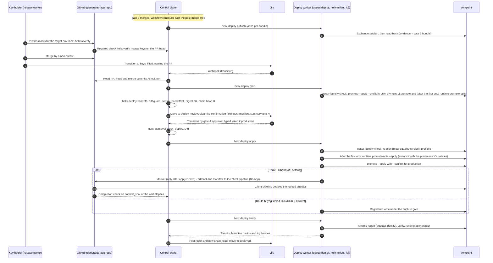

# 11 — B6: Deploy interface (sketch)

B6 is not built in this phase `[PLAN]`. This file fixes two things. First, what B1–B5 must reserve so that no B6 answer is closed off. Second, the interfaces B6 will use: Meridian's runner, assertions and security baseline, the Exchange publish, gate 4 and the hand-off. The two questions the plan leaves open are set out as options, not decided.

## 1. Purpose and scope

Sub-phase **B6**. Scope: the deploy worker class and the `helix deploy` CLI it reserves, gate 4's placement, the Exchange publish, platform objects through `meridian promote`, post-deploy assertions, the security baseline, decision 8's two routes, the key-holder step and the hand-off contract. It also covers confirming deploy-only scope names before any deploy credential exists, and the B1–B5 invariant that nothing holds a deploy-capable credential. Out of scope: anything B6 would size, schedule or operate.

**Binding part and B6 sketch** `[LLD]`. Only these parts bind B1–B5: 3.1 (what B1–B5 reserve), 3.11 (the invariant and its doctor sub-checks), section 4 (Q1 and Q2, open), the B1–B5 rows of section 5, guards 1–8, 24 and 25, and the "B1–B5 must reserve" rows of open item 8. Sections 3.2 to 3.10, the other rows of sections 5 and 6, and the "B6 sketch" rows of open item 8 are a **B6 sketch, not binding**. They exist to show that the reservations are enough. B6's own design may change any of them, and their identifiers are not proposed to owner files until then.

## 2. Traceability

| Source | What this file implements |
| --- | --- |
| Plan §0 rule 2, §5, §7 item 5 | Nothing in B1–B5 holds a deploy-capable credential; the doctor refuses one |
| Plan §3.1 | Deploy permission set; deploy-only scope names confirmed by B6 before any deploy credential exists (3.8) |
| Plan §3.4 | Exchange publish only after gate 2, outside Meridian's register, no capture proof |
| Plan §3.6 | B6 sequence; capture-store and A10 questions; whether policies are in force (the policy step, 3.6, and the baseline, 3.7) |
| Plan §4 decisions 6, 8 | Release owner signs gate 4; hand-off default vs registered CloudHub 2.0 write |
| Plan §6 parity | Every B6 step is a `helix deploy` sub-command; Meridian runs as a CLI (3.2) |
| HLD *Deploy sketch*, gate table row 4 | Order: publish, gate 4, platform objects, assertions, baseline; separate deploy worker class |
| HLD-P#1, #7, #8, #9, #10, #13, #14, #16, #17, #19 | Credential split; gate digest; head-commit evidence; key-holder step; publish identity; tenancy; egress; approvals as transitions; outcomes; long-lived host operations |
| HLD lower bullets (review items 24, 19) | Chain-head digest at gate 4; Meridian contract tests widened to the B6 surface |
| Review item 11 | DX MCP Server publish and deploy tools are certified separately before B6 uses them |

## 3. Design

### 3.1 What B1–B5 reserve

| Reserved item | Reserved as | B1–B5 behaviour | Owner file | Tag |
| --- | --- | --- | --- | --- |
| Phase and CLI | `deploy` (00 §6); `helix deploy {publish,plan,handoff,apply,deliver,verify}` plus two admin commands (3.2) | Every `helix deploy` sub-command exits 2: `helix deploy is reserved for B6`. The workflow has no deploy activity | 00, 11 | `[PLAN]` parity, `[LLD]` names |
| Gate | `gate4_deploy` (00 §6) | A signal for it is refused as a gate never reached | 08 | `[PLAN]` |
| Worker class | `helix worker --class deploy` | Exits 2: `deploy worker class is reserved for B6` | 08 | `[LLD]` |
| Task queue | 08's identifier: task queue `deploy` in the client's namespace `helix-{client_id}`; under 08's fallback (one namespace), `{client_id}.deploy` (08 §3.3) | No worker polls it; the doctor checks this (3.11 d) | 08 | `[LLD]` (08; HLD deploy sketch, review item 12) |
| Logical ticket states | `keys_filled`, `deploy_review`, `deployed` | `jira.states` may not map them. `profile validate` exits 1 naming the key (02 §3.6 exit codes): `jira.states.deploy_review` and `jira.states.deployed` under 02 L12 (a key naming deploy); `jira.states.keys_filled` under 02 L4 (unknown key) | 02 | `[LLD]` |
| Profile keys | A `deploy:` block (`deploy.scope_admins`, `deploy.handoff_wait_minutes`, `deploy.handoff_done_check`); `gates.gate4_deploy.approvers`; `jira.fields.deploy_confirmation`; `jira.fields.keyholder_pr` | Must be absent. `profile validate` exits 1 naming each one. 02 L12 refuses `gates.gate4_deploy`, the `deploy:` block and `jira.fields.deploy_confirmation`, because each names deploy (ONB-34). `jira.fields.keyholder_pr` names no deploy, so it falls to L4 (unknown key). Every key in this row and the row above is also an unknown key under L4, because 02's schema sets `additionalProperties: false` on every object (02 §3.1); L12 adds the ONB-34 attribution where the key names deploy. Proposed for 02: L12 takes an explicit list of every key in this row and the row above, so each is refused under ONB-34 by name (open item 8). No deploy reference can be stored early | 02 | `[PLAN]` refusal, `[LLD]` names |
| Vault scope | `helix/{client_id}/deploy/*` (03 §3.3 naming) | No control-plane vault role and no B1–B5 identity holds a policy on it. The control-plane adapter has no path to it | 03, 11 | `[LLD]` |
| Meridian state for deploys | `{client_id}/meridian-deploy/{role}-{tier}/`, one per deploy app that runs Meridian (3.8), each exported as `MERIDIAN_HOME` to that app's subprocesses only. Shared inputs: `meridian-deploy/inventory/` and `meridian-deploy/templates/` (Q2). It lives on a durable volume attached only to deploy-class hosts, never under `$HELIX_STATE_ROOT`, which 08 §3.2 makes a local volume of the control-plane host. Readable and writable only by the deploy worker's identity; the control plane and every B1–B5 identity have no access (storage boundary, 3.2) | Not created. No `meridian-deploy/` exists under the control-plane host's `$HELIX_STATE_ROOT` (3.11 i) | 11, proposed for 00 §7 | `[LLD]` |
| B1–B5 Meridian exports | `MERIDIAN_READ_ONLY=1` is in 00 §9's export list, and 03 §3.6.4 sets it in every credentialed child | Every credentialed Meridian CLI runs read-only | 00, 03 | `[LLD]` |
| Post-merge continuation | The ticket workflow's merge handler is one named step that B6 extends | Ends the workflow at `done` | 08 | `[LLD]` |
| Evidence B6 consumes | Gate 3's merged-head `build_report.v1` as a **baseline** for the built jar, and `design_bundle.v1`'s per-environment key and mark list, its `deployment_property_keys[]` and its `applications[]`. The artefact B6 deploys is a different build: the key-holder commit's (3.10) | The key list is recorded in `design_bundle.v1` (06 §3.13). Two fields are **proposals, not yet recorded**: (1) `build_report.v1` has no built-jar digest or Maven coordinates today; its `project.archive.sha256` is the source tarball (07 §3.10.1). Proposed for 07: `artefact {file, group_id, artifact_id, version, classifier, sha256}` on stage `head`. (2) `design_bundle.v1` `contract` has no Exchange group id or asset id (06 §3.13). Proposed for 06: `contract.exchange {group_id, asset_id}`; how `group_id` relates to the business group's organisation id is `[VERIFY]`. Both in open item 8 | 06, 07 | `[HLD-P#8]` `[HLD-P#9]`; the two fields `[LLD]` proposals |

**Why one Meridian state directory per deploy app.** Meridian caches the connected-app bearer at `<state dir>/token_cache_connected_app.json` (`meridian/platform/authn/__init__.py:250-253`). `access_token` loads that cache before anything else (`meridian/platform/authn/base.py:160-168`), and `_load_cache` never compares the client id (`base.py:183-200`). Two processes that share a state directory therefore share a bearer, whichever app minted it. That holds between B1–B5 and B6. It holds equally between deploy apps: a `read` verify could run under a cached `objects` bearer, and a non-production apply under a cached production one. So each deploy app (role and tier, 3.8) gets its own directory. The deploy worker also deletes the cache file around every Meridian subprocess and checks the identity (3.2). Captures live in the state directory too (`OVERRIDES_PATH = STATE_DIR / "endpoints.json"`, `meridian/platform/endpoints.py:92`). The `objects-{tier}` directories need them, because `promote --apply` and `runtime promote-apis --apply` (3.6) write through the register. On route R, `app-{tier}/` needs them too, because the application write is a registered CloudHub 2.0 write under the capture gate (3.9). The `read-{tier}` directories need none. `[LLD]`

**Why `MERIDIAN_READ_ONLY=1`.** When it is set, `PromotionRunner.preflight` records `read_only: true` and puts the refusal of any `--apply` first in its report, whatever the other flags say (`meridian/runner.py:218-226`; `meridian/settings.py:541-548`). A full run then raises `PreflightError` before the first write (`runner.py:570-574`). That is a refusal built into the code, not just a matter of which flags a caller passes. `[LLD]`

Temporal mechanics B6 relies on are `[VERIFY]`: an activity scheduled onto a named task queue from the ticket workflow, and workflow versioning (`workflow.patched`) so in-flight B5 workflows can gain B6 steps.

**Sections 3.2 to 3.10 are the B6 sketch, not binding** (section 1).

### 3.2 Deploy worker class and the `helix deploy` CLI — B6 sketch, not binding

| Property | Design | Tag |
| --- | --- | --- |
| Runs | The `helix deploy` sub-commands marked *deploy worker* below, as Temporal activities on task queue `deploy` in namespace `helix-{client_id}` (08 §3.3); a terminal runs the same commands | `[PLAN]` parity, `[LLD]` |
| Never runs | An Agent SDK session, an agent sandbox, or any agent's tools | `[LLD]` |
| Queue | Task queue `deploy` in namespace `helix-{client_id}`, or `{client_id}.deploy` under 08's fallback (08 §3.3); one client per worker, never switched | `[HLD-P#13]` |
| Lifetime | Ephemeral or long-lived; set by question Q1 (section 4) | open |
| Holds | The deploy connected apps (3.8), the B6 GitHub App on route H and the read-only repository identity on route R (3.9), read through the `deploy` vault role; each secret is exported only to the one subprocess that needs it | `[HLD-P#1]` |
| Vault role | `deploy`, its own workload identity (auth method `[VERIFY]`, as 03 §3.3). Read on `helix/{client_id}/deploy/*`; write on `helix/{client_id}/deploy/client-apps/*` only. It is not the control-plane adapter of 03 §3.3, which has no write API and no path to this scope | `[LLD]` |
| Meridian environment, per subprocess (Q2 A and the Note) | Built from scratch: nothing is inherited, as 03 §3.6.4 does for B1–B5. Exactly these variables: `MERIDIAN_HOME` = that app's directory (3.1). `MERIDIAN_INVENTORY_DIR` = the per-(application, environment) inventory snapshot that `plan` and `apply` stage in the activity workdir from `meridian-deploy/inventory/` (3.10 `inventory_sha256`). `MERIDIAN_TENANT_PROFILE`, `MERIDIAN_ENVIRONMENT_MAP`, `MERIDIAN_COMPARE_CONFIG` (the profile's files, staged through the spool, Storage row). `ANYPOINT_BASE_URL` = the value of `ANYPOINT_BASE_URL` in the profile's `.env`, the one place the control plane is written (02 §3.3, §3.4), read by the control plane and passed in the brief, as 03 §3.6.4 reads it: Meridian otherwise defaults to the US control plane (`DEFAULT_CONTROL_PLANE`, `control_plane()`, `meridian/settings.py:429-442`), so an EU-plane client would authenticate against and write to the wrong host. The worker refuses, `FAILED`, to start a Meridian subprocess when the brief carries no control-plane URL or the built environment lacks `ANYPOINT_BASE_URL`. `MERIDIAN_AUTH_MODE=connected_app`. `MERIDIAN_BROWSER_SSO=0` (as 03 §3.6.4). `ANYPOINT_CLIENT_ID` and `ANYPOINT_CLIENT_SECRET` of that app. `MERIDIAN_ENV_ALLOWLIST` = the target environment only. `MERIDIAN_ASSUME_YES=1` (apply only). `PYTHON_KEYRING_BACKEND=keyring.backends.null.Keyring` `[VERIFY]`. `HOME`, `PATH`, `LANG`, `TMPDIR` activity-local. Every setting Helix relies on is exported, because a setting missing from the environment can be read from the stored-settings database in `MERIDIAN_HOME` (`meridian/settings.py:119-158`). Flags: `--repo-root /work/{phase_attempt_id}/repos/`, holding a clone of `source.repository` at `source.commit_sha` in a directory named by the integration's repository (06 `repo_name`), because Meridian writes and reads `repo_root/repo_name/<config path>` (`meridian/render.py:360`). That serves the primary application, whose `repository_name` is that name. Another application lives in a directory named by its own `repository_name` inside the integration's repository (06 §3.14), so for it `--repo-root` is the clone itself. `--template-dir` = `meridian-deploy/templates/` under Q2 A, else an empty workdir directory. The working directory is an empty workdir directory with no `.env`. Without these, Meridian defaults to `./inventory`, `./repos` and `./templates` (`meridian/settings.py:699-701`; flags `meridian/cli.py:5139-5141`) and loads no inventory. Under Q2 B no Meridian runner command runs (3.6) | `[LLD]` |
| Clone | Made by the deploy worker inside the activity workdir with a read-only repository identity, and destroyed with the workdir (00 §7). Both routes have one (3.9): on route H the B6 GitHub App's installation token; on route R a read-only installation of the B6 App, contents read and no delivery permission `[VERIFY]`. The alternative is that the control plane stages the tree at `keyholder_merge_sha` into the activity workdir; the worker then checks that `git write-tree` of the staged tree equals that commit's tree | `[LLD]` |
| Identity check, around every Meridian subprocess | Take an exclusive lock on the app's directory, so one Meridian subprocess runs there at a time. Delete `token_cache_connected_app.json`. In a subprocess with the same environment, run `meridian_bridge.deploy_identity_probe()`, which builds the provider (`meridian.platform.authn.build_provider`, `__init__.py:229`). Require `describe()["credential_source"] == "environment"` and `full_identity().label` (the bearer's client id from `/accounts/api/me`, `meridian/platform/authn/providers.py:229-270`, `:394-402`) equal to the exported `ANYPOINT_CLIENT_ID`. Run the Meridian command. Delete the cache file again. Otherwise refuse, `FAILED`. Meridian resolves credentials keyring first, then environment, then `.env` (`meridian/platform/authn/store.py:251-265`), so a keyring entry under `meridian-anypoint[-<install>]` (`store.py:41-61`) would otherwise replace the exported app silently. The probe uses `build_provider` and the provider's `describe` and `full_identity`, beyond decision 5's three names. It does so only inside `meridian_bridge` (00 §2), and the widening is recorded for decision 5's owner (open item 8) `[PLAN-DEFAULT 5]`. `meridian token` is not used instead: its status output is text, not JSON, and it resolves the stored browser token (`browser_token`, `ANYPOINT_TOKEN`), not the connected app, so it cannot report the connected app's client id or credential source (`meridian/cli.py:1379`, `:1500-1515`) | `[LLD]` |
| Why `ASSUME_YES` | `require_acknowledgement` refuses a mutating run with no person at the terminal unless `MERIDIAN_ASSUME_YES=1` (`meridian/platform/guards.py:173-207`; `meridian/cli.py:1131-1160`). Gate 4 takes its place: the manifest carries `acting_client_ids` (3.10), so the approver sees each app's client id (never the secret) before signing | `[LLD]` |
| Never holds | `MERIDIAN_SECURE_KEY_<ENV>`. Meridian takes a production key only from that variable (`meridian/secure.py:24-28`), and only the key holder sets it. So the deploy worker never supplies the runtime decryption key an application with ENCRYPT values needs; who does, per route, is in 3.9 and open item 11 | `[LLD]`, extending plan §5 ("no agent holds a key") |
| Storage | The deploy worker runs on a deploy-class host, separate from the control-plane host, and never mounts the control-plane host's `$HELIX_STATE_ROOT` (08 §3.2): neither the B1–B5 state directory `meridian/` nor `runs/`. Mounts: `meridian-deploy/` (read and write, deploy identity only) on the deploy-class volume (3.1); the activity workdir `/work/{phase_attempt_id}/`, with a tmpfs for the client-secret sink file (3.6); and its own attempt spool directory, as 08 §3.4 gives agent hosts. Run artefacts travel through the spool: the control plane stages the bundle, the publish record, the manifest, the plan and the profile's `tenant.yaml`, `environments.yaml` and `compare.yaml` into `in/` with their SHA-256 (never `.env`, never a credential); the worker writes its outputs to `out/`; the control plane checks their SHA-256 and copies them into `runs/{ticket_key}/deploy/{env}/{repo_name}/`. The control plane has no access to `meridian-deploy/`, which holds the cleartext connected-app bearer cache (`meridian/platform/authn/__init__.py:250-253`), the captures and Meridian's run logs. Enforced by volume attachment and filesystem ACLs; checked by 3.11 i | `[LLD]` |
| Egress | The profile's Anypoint control plane and Exchange hosts; the GitHub API for the clone and route H delivery; the spool export; the vault, the Temporal frontend and the Helix store (PostgreSQL) endpoints | `[HLD-P#14]` |

**`helix deploy`** (reserved; every sub-command exits 2 in B1–B5). Phase sub-commands take 00 §4's common flags (`--profile --ticket --run-dir --brief --out`) and write `phase_result.v1` with a `PhaseOutcome` (00 §5). A design bundle may hold several applications, exactly one `primary` (06 §3.13), so every environment-scoped sub-command also takes `--app REPO_NAME` and works on one (application, environment) pair. Outputs land under `runs/{ticket_key}/deploy/{env}/{repo_name}/` (00 §7 run artefacts); for deploy-worker sub-commands the control plane copies them there from the spool (Storage row above). `[PLAN]` parity, `[LLD]` names.

| Sub-command | Runs on (app) | Extra inputs | Outputs | Outcomes |
| --- | --- | --- | --- | --- |
| `publish` | Deploy worker (`publish`, one app with no tier; read-back under `read-nonprod`) | `--gate-approval ID` (the live gate-2 row) | `exchange_publish.v1`, once per bundle | `DONE`, `INCOMPLETE`, `FAILED` |
| `plan --env ENV --app REPO_NAME` | Deploy worker (`objects`) | `--source FILE` (the `source` block of 3.10) | `plan.json`: the `platform_plan` object of 3.10 and `inventory_sha256`, plus the raw preflight JSON and the dry runs' log paths. Before any Meridian call, the asset-identity check of 3.6; the preflight and dry runs pass `--secret-sink null` | `DONE`, `INCOMPLETE`, `FAILED` |
| `handoff --env ENV --app REPO_NAME` | Control plane | `--pr N` (from the `keys_filled` transition), `--plan FILE` | `deploy_handoff.v1` as `handoff.{n}.json`; ticket moved to `deploy_review` | `AWAITING_GATE`, `FAILED` |
| `apply --env ENV --app REPO_NAME` | Deploy worker (`objects`) | `--handoff FILE`, `--gate-approval ID` (gate 4), `--confirm TOKEN` for production | The asset-identity check of 3.6 again, before any write; preflight JSON; for each Meridian write command, its run id, log path and the log's last `hash`; item results | `DONE`, `INCOMPLETE`, `FAILED`, `AWAITING_GATE` (gate 4 reopened) |
| `deliver --env ENV --app REPO_NAME` | Deploy worker (B6 GitHub App on route H; `app` on route R) | `--handoff FILE`, `--gate-approval ID`. Refuses, `FAILED`, unless `apply` for the same `handoff_id` and the same manifest digest ended `DONE` | `delivery.json`: mechanism, reference, time, completion signal or elapsed wait | `DONE`, `INCOMPLETE`, `FAILED` |
| `verify --env ENV --app REPO_NAME` | Deploy worker (`read`) | `--handoff FILE`, `--publish FILE` | Verify JSON, runtime report JSON, API Manager JSON | `DONE`, `INCOMPLETE`, `FAILED` |
| `confirm-scopes` (admin) | Any host; no credential | `--file FILE` | `deploy_scope_confirmation.v1` (3.8) | exit 0 or 1 |
| `admit-app --role R [--tier T]` (admin; no `--tier` for `publish`) | A deploy-class host, run by a platform admin | Client id and secret at a no-echo prompt | `deploy_app_verification.v1` (3.8); the secret in the vault only when admitted | exit 0 admitted, 1 refused, 2 error |

### 3.3 Sequence (one pass per application and target environment) — B6 sketch, not binding



Order is `[PLAN]` §3.6 and the HLD sketch. Every platform write except the Exchange publish comes after gate 4 `[PLAN]`, and so does the hand-off delivery `[LLD]`. The plan step before gate 4 writes nothing on the platform: `--preflight-only` returns before `require_acknowledgement` and `runner.run` (`meridian/cli.py:1119-1122`), a `promote` dry run writes only its own run log, and a `runtime promote-apis` run without `--apply` prints its plan and returns before any write (`meridian/cli.py:3803-3808`). The chain-head digest is posted at gate 4 `[HLD-P lower]`.

**Target environments and order** `[LLD]`. The target list is the environments named in the design bundle's `applications[].deployed_names` (file 06), ordered by Meridian's `ENV_ORDER` (`meridian/settings.py:663`): the in-scope environments of the profile's `tenant.yaml` `environments` list, sorted by `rank` (`meridian/settings.py:645-663`; `rank` and `is_production` read in `meridian/tenant.py:683-689`). `environments.yaml` is the runtime collection map, not the source of the order (`meridian/runtime/envmap.py:3`). A pass for an environment needs a `DONE` pass for its predecessor in that list on the same `merge_commit_sha`. So production is never first. A hand-off that breaks this is refused, `FAILED`.

**Applications and order** `[LLD]`. Each application in `applications[]` gets its own pass per environment and its own manifest. Within an environment, a called application goes before its caller: `system`, then `process`, then `experience` (the bundle's `role`, 06 §3.13). A hand-off whose application's callees have no `DONE` pass in that environment in the same run is refused, `FAILED`. The contract is committed in the integration's repository, which holds every application of the integration, the primary at its root (06 §3.14), so the publish reads it there and runs once per bundle, before any application's first pass.

### 3.4 Exchange publish (unregistered platform write) — B6 sketch, not binding

Meridian registers only an Exchange read, `exchange_asset` (GET, `meridian/platform/endpoints.py:439-453`), and no Meridian command calls it. The publish is therefore outside the register and has no capture proof `[PLAN]`. Command: `anypoint-cli-v4 exchange:asset:upload` `[VERIFY flags and auth mode]`. The DX MCP Server's publish tool is used only if a B6 spike certifies it headless with a stated auth mode `[LLD]` (review item 11) `[VERIFY]`. The publish runs on the deploy worker under the `publish` app (3.8; one app, no tier, because an Exchange asset belongs to the business group, not to an environment) `[HLD-P#10]`.

**Read-back and idempotence** `[LLD]`. After the upload, the `read-nonprod` app reads the version back, by `anypoint-cli-v4 exchange:asset:describe` `[VERIFY]` or a GET on the `exchange_asset` path template. That sets `result.confirmed_by_read`. Before uploading, the same read is made. If the version already exists, its contract file is downloaded `[VERIFY command]` and compared by SHA-256. Equal gives `DONE` with `result.already_present: true` and no write. Different gives `FAILED`.

Its approval evidence is its own, recorded as `exchange_publish.v1` in the run directory and in the audit chain `[LLD]`:

| Field | Type | Constraint |
| --- | --- | --- |
| `schema` | string | `"exchange_publish.v1"` |
| `run_id`, `client_id`, `ticket_key` | string | 00 §6 formats |
| `asset` | object | `group_id`, `asset_id`, `version` (semver string). `group_id` and `asset_id` equal the bundle's proposed `contract.exchange {group_id, asset_id}` (3.1; open item 8, owner 06); `version` equals the bundle's `contract.version`. Until 06 accepts the field, the publish has no source for them and refuses, `FAILED` |
| `contract` | object | `path` (the bundle's `contract.path`, repo-relative in the integration's repository, 06 §3.14), `sha256` (64 hex) at `merge_commit_sha` |
| `approval` | object | `gate: "gate2_design"`; `gate_approval_id`; `digest` = the row's `decided_digest`, the SHA-256 of the `design_bundle.v1` file (08 §3.9); `bundle_path` = the row's `subject_ref`. The bundle at `bundle_path` must hash to `digest`, and its `contract.sha256` (06) must equal `contract.sha256` here |
| `merge_commit_sha` | string | 40 hex; gate 3's merge in the integration's repository |
| `method` | enum | `anypoint_cli`, `dx_mcp` |
| `argv_redacted` | string[] | The command, with no secret |
| `result` | object | `exit_code` (int); `confirmed_by_read` (bool: the read-back saw the version); `already_present` (bool) |
| `published_at` | string | RFC 3339 UTC |

```json
{"schema":"exchange_publish.v1","run_id":"acme-retail.ACME-123","client_id":"acme-retail","ticket_key":"ACME-123",
 "asset":{"group_id":"acme-group","asset_id":"acme-order-sapi","version":"1.0.0"},
 "contract":{"path":"src/main/resources/api/acme-order-sapi.yaml","sha256":"9f2c…e1"},
 "approval":{"gate":"gate2_design","gate_approval_id":"ga-0007","digest":"4b1a…77",
  "bundle_path":"runs/ACME-123/design/1/design-bundle.json"},
 "merge_commit_sha":"3e5d…a0","method":"anypoint_cli","argv_redacted":["exchange:asset:upload","…"],
 "result":{"exit_code":0,"confirmed_by_read":true,"already_present":false},"published_at":"2026-10-08T10:00:00Z"}
```

**Precondition** `[HLD-P#7]` `[LLD]`: the bundle check in the `approval` row above. A reviewer edit to the contract before merge is caught earlier. Proposed for file 07: stage `head` of `helix/verify` compares the head's contract with the same bundle entry and fails the required check, which reopens gate 2 (08 `invalidated_reason: design_edited`) `[HLD-P#8]`. After merge, the check can only have been bypassed. The publish is then refused, `FAILED`, and a corrected contract needs the ticket reopened (re-entry at Discover, 08 G12) or a new ticket `[LLD]`. A rejected design therefore never leaves an asset version behind `[PLAN]`.

### 3.5 Gate 4 placement and the typed confirmation — B6 sketch, not binding

| Rule | Design | Tag |
| --- | --- | --- |
| Subject | One `deploy_handoff.v1` manifest per (application, target environment), including its platform plan, inventory digest and acting client ids (3.10). The gate digest is the manifest's SHA-256 (canonical JSON: sorted keys, no whitespace, UTF-8) | `[HLD-P#7]` (gate 4 approves the artefact checksum), `[LLD]` (the manifest) |
| Channel | A Jira transition into the client's status mapped from `deploy_review`'s exit, by an actor in `gates.gate4_deploy.approvers`; never comment text | `[HLD-P#16]` |
| Typed token | When any target is production (`env_spec(e).is_production`, `meridian/runner.py:164-165`), the typed value must equal `production_confirm_token(prod_envs)`: `"APPLY-"` plus sorted upper-case keys joined by `-` (`meridian/runner.py:926-931`). Non-production: the transition alone | `[PLAN]` typed confirmation |
| Token placement | Typed into the transition's `deploy_confirmation` field (`jira.fields.deploy_confirmation`), never into a comment | `[LLD]` `[HLD-P#16]` |
| Stale token | A custom field keeps its value on the issue, so a later transition could carry the previous round's token. The control plane clears the field each time the ticket enters `deploy_review`. It accepts the token only when the gate transition's own changelog entry set the field; a value present on the issue but not set by that transition is refused | `[LLD]`; changelog read over REST `[VERIFY]` |
| Jira mechanics | A text field on a transition screen, readable over REST; clearing it by REST | `[VERIFY]` |
| Separation | The approver is not the gate-3 merger and not the requester. A waiver follows the profile's pilot rule (02 `gates.waiver`) and is recorded | `[LLD]`, extending HLD-P#7 (which states separation for gates 1–3) |
| Before any write | `deploy apply` and `deploy deliver` refuse to start without an accepted `gate_approval` row for `gate4_deploy` whose digest equals the manifest now on disk. `deploy deliver` also refuses unless `deploy apply` for the same `handoff_id` and manifest digest ended `DONE`, so an application is never delivered while its platform objects are `FAILED`, `BLOCKED` or missing (for example no API instance for autodiscovery) | `[PLAN]` before the write, `[HLD-P#7]` digest, `[LLD]` apply before deliver |
| Plan unchanged | `deploy apply` re-computes the platform plan and inventory digest (3.6). Any difference from the manifest invalidates the gate-4 row (08) and reopens gate 4, with no write | `[HLD-P#7]` `[LLD]` |
| Passed to Meridian | The typed value goes to `meridian promote --confirm`. Meridian checks it again in preflight, before the platform check (`meridian/runner.py:330-335`) | `[LLD]` |

### 3.6 Platform objects through `meridian promote` (`runner.py`) — B6 sketch, not binding

Interface: the CLI, for parity (plan §6: Meridian runs as a CLI wherever one exists; parser `meridian/cli.py:5461-5477`). `meridian promote --env ENV --app REPO_NAME [--apply] [--confirm TOKEN] [--phases ...] [--preflight-only] [--secret-sink keyring|file|null] [--secret-file PATH]`. Phases: `config`, `api_manager`, `mq`, `client_applications`, `contracts` (`meridian/runner.py:77-83`). The application deploy is not one of them: runner Phase 5 is "(external) CloudHub deployment" (`meridian/runner.py:29`).

**`meridian promote` applies no API policies.** The inventory runner creates an API instance from its Exchange asset (`meridian/platform/apimanager.py:30-37`; body `_build_create_body`, `:290-319`). The policy write `apim_apply_policy` is no longer called by anything: API Manager's Promote replaced the policy and tier replay (`meridian/platform/endpoints.py:47-54`). Only Promote copies policies, and Meridian's command for it is `meridian runtime promote-apis` (parser `meridian/cli.py:6244-6272`; `cmd_estate_promote_apis`, `cli.py:3711-3885`: "the platform copies its policies, SLA tiers and alerts"). So a newly created instance would have no security policy, and baseline condition 5 (3.7) would fail on every first deploy of a new API. The policy step below closes this for every target after the first.

**Scope: Q2 A and the Note.** The commands in this section and in 3.7 hold under Q2 A and the Note. Under Q2 B they are **not designed**: B6 code replaces `promote` and `verify`, with the consequences listed in Q2 (section 4). This section does not decide Q2.

Meridian's behaviour is cited in the second column. Helix's use of it is `[LLD]` unless tagged otherwise.

| Step | Meridian behaviour (cited) | Helix use |
| --- | --- | --- |
| Phases | `config` with `--apply` writes config files (`meridian/runner.py:640-677`). `api_manager` creates from the Exchange asset, with no policies (above). An existing instance at the same version is `SKIPPED`; one that differs is `WOULD_UPDATE` in a dry run and `BLOCKED` at apply (`meridian/platform/apimanager.py:132-200`). `--app` narrows `config`, `api_manager`, `mq` and `contracts`, but not `client_applications`: that phase reconciles every active client application of the environment, and preflight counts it the same way (`meridian/runner.py:751-789`, `:465-466`) | First target environment: `--phases api_manager mq client_applications contracts`. Every later target: `--phases mq client_applications contracts`, after the policy step, which creates the instance instead. `config` never runs with `--apply` after gate 4; it runs only as A10 or a dry run. Every runner command reads the per-(application, environment) inventory snapshot (3.10 `inventory_sha256`), never the shared inventory, so the `client_applications` phase cannot create another application's consumers under this gate |
| Asset identity, before any Meridian call | `promote` creates the instance at the inventory row's `exchange_asset_version` (`CREATE_FIELDS`, `meridian/platform/apimanager.py:76-77`; `_build_create_body`), and A2 compares with the same field (`meridian/assertions.py:223-224`) | `deploy plan`, and `deploy apply` again before any write, require the inventory `applications` row for `repo_name` to have `exchange_group_id`, `exchange_asset_id` and `exchange_asset_version` equal to `exchange_publish.v1` `asset`, and `managed_by_api_manager` true for an API asset (`meridian/models.py:97-104`). Otherwise `FAILED`, nothing written, so an instance is never created at the wrong asset version |
| Policy step (targets after the first) | `meridian runtime promote-apis --source S --target T [--api IDS] [--cache FILE] [--apply] [--confirm TOKEN]` plans offline from an API Manager collection cache (`estate-cache/apimanager-latest.json` in the state directory, or `--cache`; `meridian/estate/api_inventory.py:63-64`, `cli.py:3743-3749`). It creates each instance the source has and the target lacks with API Manager's Promote, copying the source's policies, SLA tiers and alerts (`meridian/estate/api_promote.py:1-25`; `client.apim.promote_instance`, `cli.py:3840`). A target that already has the instance is `EXISTS` and gets nothing copied. Without `--apply` it prints a text plan and exits 0, or 1 when items are unidentified or at another version (`cli.py:3803-3808`). With `--apply` it runs the write guards in order: read-only switch, allowlist, deployment window, production token (`_estate_apply_gate`, `cli.py:4070-4118`); a refusal exits 2. It writes a run log on apply and exits 1 when any item failed or was blocked (`cli.py:3885`). `--source` and `--target` resolve through `environments.yaml` (display name, Anypoint name, then suffix; `meridian/runtime/envmap.py:205-227`), and the guards map the target back to a `tenant.yaml` key by suffix (`cli.py:4089-4101`). What Promote copies beyond policies, SLA tiers and alerts is the platform's to decide; Meridian tells the operator to check each new instance's backend address (`meridian/platform/apimanager.py:270-272`; `api_promote.py:18-21`; `cli.py:3879-3881`), while the parser's help says the address is not copied (`cli.py:6251-6252`). Whether Promote copies it is `[VERIFY]` | Under `objects-{tier}` of the target. `plan` first collects `meridian runtime apimanager --environments P,ENV --cache FILE` under `read-{tier}` (3.7), with `FILE` in the activity workdir (`--cache` reads and writes the collection, `cli.py:6189-6190`), and passes the same file to the policy step as `--cache`; when P is non-production and ENV production, no single tier reads both (open item 10). It then runs `runtime promote-apis --source P --target ENV --api <asset_id>` without `--apply`, where P is ENV's predecessor in the target list (3.3); its `+` lines go into `platform_plan.policy_step.items` (text pinned by a contract test, open item 7). `apply` re-collects, repeats the dry run, refuses and reopens gate 4 if the items differ, then runs it with `--apply` (and `--confirm` for production) **before** `promote`, because contracts wait for API instances. It replaces `promote`'s `api_manager` phase for that target: run after `promote`, the instance would already exist and Promote would copy nothing. A3 catches a backend left pointing at the source's when `implementation_uri` is set. The first target has no source instance, so it gets no policy step (open item 10) |
| Preflight | Runs, in order: read-only switch; tracked-profile leak; unknown env; inventory validity; refuse no-work selection; env allowlist; deployment window (`DEPLOY_WINDOW_START/END`); typed production token; platform auth and business-group resolution; token-lifetime warning; unverified endpoints (`meridian/runner.py:202-408`). The read-only refusal, allowlist, window, token and UNVERIFIED-write refusal fire **only with `--apply`** (`runner.py:220`, `:307`, `:319`, `:330`, `:400-403`). A dry-run preflight only warns on blocking endpoints and exits 0 | `plan` and `apply` run `meridian promote --env ENV --app REPO_NAME --phases <the phases of the row above> --apply --preflight-only --secret-sink null [--confirm TOKEN]`. With `--preflight-only` the CLI prints the JSON report and returns before `require_acknowledgement` and `runner.run` (`meridian/cli.py:1119-1122`), so nothing is written. Pass: exit 0, `ok: true`, `blocking_endpoints: []`. At plan time a production preflight passes the token computed by `production_confirm_token`, since nothing can be written; at apply time only the approver's typed value is passed. A deployment-window refusal at plan time is recorded in the manifest, not blocking |
| Dry run | `promote` without `--apply` makes no platform write. Each item is a `type: item` run-log record with `resource`, `identity`, `env`, `status` (`would_create`, `would_update`, …) (`meridian/runlog.py:41-56`, `:173-174`). The CLI prints the run id and log path (`meridian/cli.py:1164-1165`). Preflight JSON carries `planned_by_env` (`runner.py:280-286`) and `platform.identity`, the configured client id (`meridian/platform/__init__.py:67-85`; `providers.py:389-392`) | `plan` runs the dry run with `--secret-sink null` and reads the log's `would_create` and `would_update` items into `platform_plan.items` (3.10). `apply` repeats the dry run and refuses, reopening gate 4, if the items or `inventory_sha256` differ from the manifest |
| Capture gate | Every write starts UNVERIFIED and is blocked until a human records a capture on that machine (`meridian/platform/endpoints.py:33-46`; `docs/endpoint-verification.md:141-143`). `blocking_endpoints` lists every registered write Meridian calls that is not ready (no capture that proves it, or one its request Helix cannot use), whatever the selected phases, plus every read whose effective confidence is UNVERIFIED (`endpoints.py:1183-1201`) `[PLAN]`. `apim_create_api` serves two bodies: the inventory runner's create-from-Exchange and Promote. A state directory holds one capture per endpoint, and the inventory runner refuses a Promote capture with the missing field named (`meridian/platform/apimanager.py:35-37`, `:290-319`) | Readiness from `meridian endpoints --json` → `promotion_steps` (`meridian/cli.py:1730-1756`), run under `objects-{tier}`. The first environment needs a create-from-Exchange capture and later environments a Promote capture; within one tier (DEV, SIT, UAT under `objects-nonprod/`) both are needed, which one directory cannot hold (open item 10) |
| Apply | `PromotionRunner.run` raises `PreflightError`, with nothing changed, unless preflight is clean (`meridian/runner.py:570-574`). Contracts wait for API instances and client apps (`meridian/runner.py:628-631`) | `apply` runs the policy step (targets after the first), then `meridian promote ... --apply --secret-sink file --secret-file PATH`, plus `--confirm` for production, after the preflight above |
| Fail-safe per item | `_guard` turns an exception into a FAILED item and `EndpointUnverifiedError` into a BLOCKED one; the run continues (`meridian/runner.py:882-903`) | Item results, the Meridian run id, its log path and the log's last `hash` go back to the control plane (below) |
| Exit | 0 clean; 1 when any item is FAILED or BLOCKED (`meridian/cli.py:1175`; `runner.py:180-181`); 2 on an uncaught exception (`cli.py:146-150`); 3 when preflight refused, or `require_acknowledgement` raised `GuardError` at apply (`cli.py:53-56`, `:1153-1159`) | Mapped in section 5 |
| Client secrets | A created client application's secret goes to the secret sink (`meridian/platform/endpoints.py:680-684`). `FileSink` writes a 0600 JSON file `{ENV: {identity: {client_id, client_secret}}}` and raises at construction when the path is inside a git working tree (`meridian/platform/consumers.py:333-366`). `NullSink` refuses to store, so a dry run can never mint a secret (`consumers.py:368-379`). The default sink is `keyring` (`meridian/cli.py:5473`) | `plan`, every preflight and every dry run pass `--secret-sink null`. The real apply passes `--secret-sink file --secret-file` on the activity's tmpfs, outside `/work/{phase_attempt_id}/repos/`. The deploy worker reads the file, writes each secret to `helix/{client_id}/deploy/client-apps/{env}/{client_app_name}` with its vault role, then removes the file. Helix never posts a secret; the consumer's owner retrieves it by the RUNBOOK procedure |

**Two chains** `[LLD]`. Meridian writes its own run log for `promote` and for `runtime promote-apis --apply` in the app's state directory (`RUN_LOG_DIR = STATE_DIR / "runs"`, `meridian/settings.py:569`). The deploy worker writes no Helix chain record: the B1–B5 state directory is not mounted on it, and the control plane, which writes the chain, has no access to `meridian-deploy/` (storage boundary, 3.2). It returns item results, each Meridian run id, its log path and the log's last `hash` (`runlog.py:114-124`) to the control plane. The control plane appends one `deploy_result` record per sub-command to the run's the Helix chain (event type proposed to file 09). In B6, `helix audit verify` also runs `meridian runs --verify` on each recorded Meridian log and compares its last `hash` with the recorded one. That part runs on the deploy class, because only it reads `meridian-deploy/`.

### 3.7 Assertions, artefact identity and the security baseline — B6 sketch, not binding

**Verify command per Q2 option** `[LLD]`. Under Q2 A: `meridian verify --env ENV --app REPO_NAME --json FILE` (A10 included; it needs the clone and the template). Under the Note: `meridian verify --env ENV --app REPO_NAME --skip-config --json FILE`. Under Q2 B: not designed. With no inventory, `Asserter` has no intended state, nothing is verified and `verify` exits 2 (`meridian/cli.py:1347-1349`), so B6 code replaces `verify`, with the consequence listed in Q2. Never `--skip-deployments`. Those are the only selection flags (`meridian/cli.py:5485-5486`). Per environment, `Asserter.run` calls every family, except A8–A9 under `--skip-deployments` and A10 under `--skip-config` (`meridian/assertions.py:171-194`).

| Id | Checks (`meridian/assertions.py:14-27`) | Source | Emitted when | B6 rule |
| --- | --- | --- | --- | --- |
| A1 | API instance exists | `:197-219` | The inventory app has `managed_by_api_manager` | Required |
| A2 | Instance at the inventory's `exchange_asset_version` | `:223-233` | A1 passed and `exchange_asset_version` is set | Required |
| A3 | Backend URI matches | `:235-245` | `implementation_uri` is set | Gating when emitted |
| A4 | MQ destinations (and DLQs) exist | `:248-297` | The inventory declares destinations | Gating when emitted |
| A5 | MQ destination properties match | `:299-311` | The destination exists | Gating when emitted |
| A6 | Client applications exist | `:313-356` | The inventory declares contracts | Gating when emitted |
| A7 | Contracts approved | `:358-385` | Same | Gating when emitted |
| A8 | Deployment exists under the deployed name | `:387-428` | Always | Required |
| A9 | RUNNING (accepts `RUNNING`, `STARTED`, `APPLIED`); replicas when the inventory states them | `:430-454` | A8 passed; replicas when set (`:441-445`) | Status required; replicas gating when emitted |
| A10 | Committed config equals the render (`remote=False`) | `:456-484` | No `--skip-config` | Required under Q2 A; absent under the Note; Q2 B not designed |

`deploy verify` parses the `--json` report (`{env, passed, failed, skipped, assertions[{id, name, app, env, status, expected, actual, message, remote}]}`, `assertions.py:49-71`, `:133-141`), not only the exit code `[LLD]`. For `repo_name` and `target_env`: every *Required* id must be present with status `pass`. Any emitted assertion with status `fail` gives `FAILED`. A *Required* id that is absent or `skip` gives `INCOMPLETE`. `meridian verify` exits 2 when nothing was verified against the platform, 1 on findings or when an environment was not reached, and 0 otherwise (`meridian/cli.py:1347-1352`). Exit 2 gives `INCOMPLETE`.

**Before verify** `[LLD]`: Meridian's A2 compares the instance with the inventory's `exchange_asset_version` (`assertions.py:223-224`), never with the publish record. So `deploy verify` repeats the asset-identity check that `deploy plan` and `deploy apply` already ran before any write (3.6): the inventory row's `exchange_group_id`, `exchange_asset_id` and `exchange_asset_version` equal `exchange_publish.v1` `asset`, and `managed_by_api_manager` is true for an API asset. Here a mismatch means the inventory changed after apply: `INCOMPLETE`, and verify does not run. `Asserter` reads intended state from the inventory (`meridian/assertions.py:164-177`), so assertions depend on Q2 too.

**Artefact identity** `[LLD]`. A8 and A9 compare only the name and status (`assertions.py:412-454`). So `deploy verify` also runs `meridian runtime report --environments ENV --business-groups BG --json --out DIR` under `read-{tier}` of ENV (parser `meridian/cli.py:6114-6142`). It never passes `--no-detail`, which skips the per-deployment read `ch2_get_deployment` (`meridian/runtime/inventory.py:1003-1030`; `meridian/platform/endpoints.py:737-750`). The deployed application's group id, artifact id and version must equal `artefact.group_id`, `artifact_id` and `version` in the manifest. Meridian reads them from `application.ref.*` and itself marks those paths VERIFY (`meridian/runtime/inventory.py:80-99`); the report's JSON field names are `[VERIFY]`. A mismatch gives `FAILED`. An unreadable record gives `INCOMPLETE`. A byte-level check needs a platform checksum; whether CloudHub 2.0 exposes one is `[VERIFY]` (open item 9).

**API security baseline** `[LLD]`. Command: `meridian runtime apimanager --environments ENV --json --out DIR` under `read-{tier}` of ENV. `estate` is the hidden legacy name (`meridian/cli.py:6052-6066`). Never `--no-policies` (`meridian/cli.py:6201-6205`). The JSON holds `summary.baseline` and `apis[]` with `cells` keyed by environment token (`meridian/estate/report.py:59-76`). Pass only when all of these hold:

| # | Condition | Source | If not |
| --- | --- | --- | --- |
| 1 | `summary.baseline.required` and `checked` are true, and `source` is named | `meridian/estate/baseline.py:309-356`; `estate/api_compare.py:286-303` | `INCOMPLETE` |
| 2 | The baseline covers ENV. In the profile's `compare.yaml`, one of: `api_policies` is absent (the shipped default, required in every environment); `api_policies.required` is absent or `true`; or `api_policies.required` is a mapping whose `environments` is empty or names ENV by display name, application suffix or platform name. `summary.baseline.required` must also be true. An environment it does not cover is skipped, not judged | `baseline.py:121-145` (`requires()`, `:140-144`), `:260-264` (absent block), `:286-299` (`required` as bool or mapping); `api_compare.py:719-722` | `INCOMPLETE` |
| 3 | The asset's row has `cells[T].present` and `cells[T].policies_read == true`, T being ENV's token (its `name_suffix`; `cells` is keyed by it). Unread policies are counted, not judged | `api_compare.py:158-172`, `:211-225`, `:719`, `:723-725` | `INCOMPLETE` |
| 4 | The asset is not in `summary.baseline.exempt[]`. An exemption in force suppresses the finding | `api_compare.py:726-735` | `INCOMPLETE`, with the exemption's reason and date posted |
| 5 | No `API_UNPROTECTED` finding for the asset in ENV. The policies come from the policy step (3.6), copied from the predecessor's instance. In the first target environment no step applies policies, so this row fails unless they were applied outside Helix (open item 10) | `api_compare.py:705-755` | `FAILED` |

### 3.8 Deploy credentials, scope confirmation and app verification — B6 sketch, not binding

One connected app per client per Anypoint-using activity `[HLD-P#10]`. Production and non-production use separate apps, so `objects`, `app` and `read` each have a `prod` and a `nonprod` tier `[LLD]`. `publish` is one app with no tier: an Exchange asset belongs to the business group, not to an environment, and `deploy publish` takes no `--env` `[LLD]`. Exact scope names are `[VERIFY]` for every row: the plan says they were never enumerated.

| Role | Used by | Permissions as the plan names them (§3.1), or reads the checks need | Routes | State directory |
| --- | --- | --- | --- | --- |
| `publish` (no tier) | `deploy publish` | Exchange Contributor | H, R | none (Anypoint CLI) |
| `objects` | `deploy plan`, `deploy apply`, including the policy step | API Manager *Manage APIs*, *Policies*, *Contracts*; Anypoint MQ *Manage Destinations*, *Clients*. Whether Promote also needs a read of the source environment's instance is `[VERIFY]` (open item 10) | H, R | `objects-{tier}/`, with captures |
| `app` | Route R application write | Runtime Manager *Create* and *Read Applications*; Design Center *Developer* for the Maven deploy | R only | `app-{tier}/`, with captures |
| `read` | `deploy verify`; the publish read-back (under `read-nonprod`); the policy step's collection | Exchange Viewer; Runtime Manager application reads; API Manager reads of instances, policies, contracts and client applications; Anypoint MQ destination reads. A1–A9, the runtime report and the baseline all read under it | H, R | `read-{tier}/` |

**Step 1, before any app exists: `deploy_scope_confirmation.v1`** `[PLAN]` (plan §3.1: confirmed "before any deploy credential exists"), record `[LLD]`. Written by `helix deploy confirm-scopes`, run by a platform admin listed in `deploy.scope_admins` (B6, reserved). It holds names only: no app and no secret exists yet.

| Field | Type | Constraint |
| --- | --- | --- |
| `schema` | string | `"deploy_scope_confirmation.v1"` |
| `confirmation_id` | string | `{client_id}.scopes.{n}`, `n` from 1 |
| `client_id` | string | 00 §6 |
| `roles[]` | object[] | `role` (`publish`, `objects`, `app`, `read`); `tier` (`prod`, `nonprod`; null for `publish`); `environments` (env keys: only production environments for `prod`; no production environment for `nonprod`; empty for `publish`); `scopes` (exact platform names, non-empty); `source` (required): a **platform read**, `{kind: "platform_read", via: "console" or "api", read_at: RFC 3339}`, meaning the scope catalogue Access Management showed to the admin's own session `[VERIFY]` where and how; `context` (optional string, for example a documentation page and its date). Documentation alone never satisfies `source` |
| `confirmed_by` | string | Actor id (`jira:{accountId}`) in `deploy.scope_admins` |
| `confirmed_at` | string | RFC 3339 UTC |

```json
{"schema":"deploy_scope_confirmation.v1","confirmation_id":"acme-retail.scopes.1","client_id":"acme-retail",
 "roles":[{"role":"read","tier":"nonprod","environments":["DEV","SIT","UAT"],
   "scopes":["acme-scope:read-applications","acme-scope:view-apis"],
   "source":{"kind":"platform_read","via":"console","read_at":"2026-10-08T08:40:00Z"},
   "context":"Access Management docs, 2026-10-01"}],
 "confirmed_by":"jira:5f…aa","confirmed_at":"2026-10-08T09:00:00Z"}
```

Scope strings in fixtures are placeholders; real names are `[VERIFY]`.

**Step 2, after the admin creates each app: `deploy_app_verification.v1`** `[LLD]`. Written by `helix deploy admit-app --role R [--tier T]` (no `--tier` for `publish`), which the admin runs on a deploy-class host. The admin types the client id and secret at a no-echo prompt. Until admission the secret exists only in the admin's Anypoint session and that process's memory: never in the Helix store, a file, a log, or any B1–B5 process. The command reads the app's granted scopes back from Access Management `[VERIFY]`, then makes each negative test. It writes the record. Only when the granted scopes equal step 1's `scopes` for that role and tier, and every negative test was refused, does it write the secret to `helix/{client_id}/deploy/apps/{role}-{tier}` (`apps/publish` for `publish`), using the admin's own vault identity `[VERIFY auth]`. Otherwise it discards the secret and exits 1.

| Field | Type | Constraint |
| --- | --- | --- |
| `schema` | string | `"deploy_app_verification.v1"` |
| `verification_id` | string | `{client_id}.app.{role}-{tier}.{n}`; `{client_id}.app.publish.{n}` for `publish` |
| `client_id`, `confirmation_id` | string | `confirmation_id` names the latest step-1 record |
| `role`, `tier` | enum | As step 1; `tier` null for `publish` |
| `app_client_id` | string | The connected app's client id; never the secret |
| `granted_scopes` | string[] | Read back from Access Management |
| `negative_tests[]` | object[] | At least one per app: `role`, `client_id`, `request` (method plus path template), `expected_status` (int[]), `observed_status` (int), `at` (RFC 3339) |
| `result` | enum | `admitted`, `refused` |
| `secret_version` | int or null | The vault version written; null when refused |
| `verified_by`, `verified_at` | string | Actor id in `deploy.scope_admins`; RFC 3339 UTC |

```json
{"schema":"deploy_app_verification.v1","verification_id":"acme-retail.app.read-nonprod.1","client_id":"acme-retail",
 "confirmation_id":"acme-retail.scopes.1","role":"read","tier":"nonprod","app_client_id":"acme-ca-0001",
 "granted_scopes":["acme-scope:read-applications","acme-scope:view-apis"],
 "negative_tests":[{"role":"read","client_id":"acme-ca-0001",
   "request":"GET /amc/application-manager/api/v2/organizations/{orgId}/environments/{envId}/deployments",
   "expected_status":[401,403],"observed_status":403,"at":"2026-10-08T09:30:00Z"}],
 "result":"admitted","secret_version":1,"verified_by":"jira:5f…aa","verified_at":"2026-10-08T09:31:00Z"}
```

The negative test shown reads production deployments under a non-production app, using Meridian's registered read `ch2_list_deployments` (`meridian/platform/endpoints.py:691-705`), as file 02's ONB-18 probe does.

**Storage and use** `[LLD]`. Both records go to append-only helix-store tables `deploy_scope_confirmation` and `deploy_app_verification`, with `client_id` row-level security (00 §7), plus one chain record each. Before reading a deploy secret, the deploy worker requires an `admitted` verification whose `secret_version` equals the vault's current version and whose `confirmation_id` is the latest step-1 record. Otherwise `FAILED`.

### 3.9 Decision 8 routes — B6 sketch, not binding

| | Route H: hand-off (default) `[PLAN-DEFAULT 8]` | Route R: registered CloudHub 2.0 write |
| --- | --- | --- |
| Who deploys the application | The client's existing pipeline | The deploy worker |
| Helix credentials | `publish`, `objects`, `read`, and the B6 GitHub App | `publish`, `objects`, `read`, `app`, and the read-only repository identity |
| Delivery identity | A B6 GitHub App, separate from the B1–B5 git writer's App, installed with only what the client's delivery mechanism needs `[VERIFY]`. Held under `helix/{client_id}/deploy/github/*`. Deploy-capable by definition (3.11) `[LLD]` | None |
| Repository read identity (the clone, 3.2) | The B6 GitHub App's installation token | A read-only installation of the B6 App: contents read, no delivery permission `[VERIFY]`. Held under `helix/{client_id}/deploy/github/*`. Or the control plane stages the tree at `keyholder_merge_sha` into the activity workdir (3.2) `[LLD]` |
| Platform objects | Through `meridian promote` and the policy step (3.6) on both routes: hand-off removes only the application deploy (review item 12) | Same |
| Meridian today | Matches runner Phase 5 "(external) CloudHub deployment" (`meridian/runner.py:29`) | Meridian registers no CloudHub write: its CloudHub entries are reads, "assertion input only -- this tool never deploys" (`meridian/platform/endpoints.py:687-750`). Route R needs a Meridian release adding a write, UNVERIFIED until captured in `app-{tier}/` (3.1, Q1) |
| Runtime decryption key (ENCRYPT values) | The client's pipeline supplies the environment's secure-properties key at deploy, as it does today `[VERIFY]` per client | The deploy worker never holds the key (3.2). Either the key holder sets it as a protected deployment property out of band `[VERIFY]` mechanism, or route R is limited to applications without ENCRYPT values (open item 11) `[LLD]` |
| Completion signal | A check run or commit status named by `deploy.handoff_done_check` (B6, reserved) on `source.commit_sha`, posted by the client pipeline and read by the control plane `[VERIFY]`. If `deploy.handoff_wait_minutes` (B6, reserved) elapses first: `INCOMPLETE`, with the elapsed minutes posted `[LLD]` | The registered write's own result |
| Confirmation | Artefact identity, assertions and the baseline (3.7), after the completion signal | Same |
| For whom | Every client with a pipeline `[PLAN-DEFAULT 8]` | Only a client with none `[PLAN-DEFAULT 8]` |

### 3.10 Key-holder step and hand-off contract: `deploy_handoff.v1` — B6 sketch, not binding

The key-holder step `[HLD-P#9]`: after merge, the release owner (decision 6) fills each `${MERIDIAN_SET_<ENV>}`, `${MERIDIAN_ENCRYPT_<ENV>}` and any `${MERIDIAN_PROPOSED_<ENV>:value}` mark (`meridian/markers.py:8-17`). B2 writes no PROPOSED marks (07 §3.4.4), but a client's own `prepare` run can. A proposal is accepted by replacing the whole placeholder (`markers.py:15`). ENCRYPT values become `![...]` ciphertext made with that environment's key, which no Helix process holds `[LLD]`, extending plan §5.

**Deployment-property keys** `[LLD]`. The bundle's `deployment_property_keys[]` (06 §3.10, §3.13: keys with `class: deployment`) are not in any file: they are supplied at deploy time. They include the environment selector and the secure-properties key that 07's global configuration reads (`{build.env_property}` and `key="${secure.key}"`, 07 §3.4.4), so the runtime decryption key of 3.9 is one of them. The manifest still carries each one, with `source: deployment_property` and no value, so the key set equals the bundle's list. Who sets them: the client pipeline on route H, the key holder on route R (as a deployment property, out of band `[VERIFY]` mechanism). They are outside the diff guard, because no file changes. The autodiscovery API id is one of them (open item 4): it exists only after the instance is created at apply. How route H confirms a key was set is `[VERIFY]` per client; until confirmed, `deploy verify` gives `INCOMPLETE` for that key.

**What the key holder changes, per Q2 option** `[LLD]`:

| Q2 option | Key holder changes | Paths allowed in the diff | `properties[].source` |
| --- | --- | --- | --- |
| B, and the Note | ENV's config and secure config files in the generated-app repository, by a PR | Config and secure config files (`naming.config_file_path(E[, secure=True])`, `meridian/naming.py:329`) of target-list environments | `file` |
| A | ENV's `config_values` rows in `meridian-deploy/inventory/config_values.csv`, secure values as `![...]` (`meridian/models.py:488-493`); then a PR committing what `meridian render --env ENV --app REPO_NAME --apply` writes (the generated banner names the CSV as the source, `meridian/render.py:52-56`). How the key holder edits the deploy inventory is open (Q2) | The rendered files of target-list environments; A10 must pass at `commit_sha` | `config_values` |

**Trigger and check** `[LLD]`:

1. The key holder opens the PR on a branch named `helix-keys/{ticket_key}/{env}` and adds the re-verify label `helix:reverify`, a fixed name with no profile key (03 §3.9.2; 02 §3.4). `helix:review-ready` is the App's to set, never a person's (03 §3.9.2). **Routing**: the receiver turns the label event into a `pr_reverify` for the ticket's workflow, as 03 §3.4.6 maps it. The control plane starts `helix verify --stage keys --env ENV` instead of 07's `--stage head` only when that workflow is in phase `deploy` (past gate 3, not yet `deployed`) and the PR's head branch matches that pattern. A re-verify label on any other branch keeps 07's routing (07 §3.8.7). `--stage keys` is B6, reserved; file 07 owns `helix verify`. It runs on the head, in a fresh container with no agent. It builds the jar (`mvn -B clean package`), applies the diff guard below, and runs `meridian report` over ENV and a neighbouring environment, because a comparison needs at least two environments (`meridian/cli.py:444-448`). It does not use 07's report verdict, which fails an owed cell that holds a value (`MARK_EXPECTED_MISSING`, 07 §3.4.4), and a filled key-holder cell is exactly that. It uses the **`keys` verdict**: in ENV, an owed cell that is filled passes, and any `MARKER_LEFT` fails (`MARKER_LEFT` is CRITICAL, `meridian/markers.py:15-17`); the neighbouring environment keeps 07's rules (its owed marks still expected); every other CRITICAL row fails, as in 07. The control plane stages the jar at `runs/{ticket_key}/deploy/{env}/{repo_name}/` with its SHA-256. Branch protection requires `helix/verify` before merge (07 GH4) `[HLD-P#8]`.
2. A non-author merges. The merge commit's tree must equal the verified head's tree (07's evidence identity) `[HLD-P#8]`.
3. The key holder moves the ticket to `keys_filled`, naming the PR in `jira.fields.keyholder_pr`. A transition by an actor outside `gates.gate4_deploy.approvers` is refused, as 08's actor check does.
4. The control plane reads the PR, its head and merge commits and the check run over the GitHub REST API `[VERIFY]`. A merged PR whose head lacks a `helix/verify` success means branch protection was bypassed: the signal is refused and the control plane posts what is missing (section 5). Otherwise it runs `deploy plan` and `deploy handoff`.

**Diff guard** `[LLD]`: `git diff --name-only merge_commit_sha..X` lists only allowed paths (table above), where `X` is the PR head in the check (step 1) and `keyholder_merge_sha` in `deploy handoff`. In each changed file, every changed line only replaces a mark: a SET mark with a value, an ENCRYPT mark with a `![...]` token, or a PROPOSED mark with its proposal or another value. ENV's files must hold no mark. Anything else gives `FAILED`, and the offending paths are posted. Paths are repo-relative; for an application other than the primary they lie under its own directory in the integration's repository (06 §3.14). The paths are recorded in `source.diff_paths[]`. Deployment-property keys are not checked here, since they live in no file.

One manifest per (application, environment) `[LLD]`:

| Field | Type | Constraint |
| --- | --- | --- |
| `schema` | string | `"deploy_handoff.v1"` |
| `handoff_id` | string | `{run_id}.handoff.{n}`, `n` from 1 |
| `run_id`, `client_id`, `ticket_key` | string | 00 §6 |
| `target_env` | string | A key in `settings.ENV_ORDER`, meaning in scope in the profile's `tenant.yaml` (3.3), and in the target list |
| `route` | enum | `handoff`, `registered_write` |
| `source` | object | `repository` (`owner/name`); `merge_commit_sha` (gate 3's merge, the diff base); `commit_sha` (the key-holder PR head that `helix/verify` verified); `keyholder_merge_sha` (its merge commit, same tree); each 40 hex. `diff_paths[]` (repo-relative) |
| `artefact` | object | `file`; `group_id`, `artifact_id`, `version`; `sha256` (64 hex); `built_by_check` (check-run id on `commit_sha`); `staged` (run-directory path); `location` {`store`: `github_release`, `exchange`, `nexus`; `ref`: asset name or coordinates} `[VERIFY]` per client. The pipeline deploys exactly these bytes |
| `runtime` | object | `mule_version` (4.9.x patch, never `4.9.0`), `java: "17"` `[PLAN]` |
| `application` | object | `repo_name` (the bundle's `repository_name`; parses under `naming.parse_any_name`), `role` (`system`, `process`, `experience`), `primary` (bool), `deployed_name` (`parsed.deployed_name_in(env)`, `meridian/assertions.py:416`). One application per manifest |
| `exchange_asset` | object | Equal to `exchange_publish.v1` `asset` |
| `properties[]` | object[] | `key`; `source` (`file`, `config_values`, `deployment_property`); `file` (repo-relative; null for `deployment_property`); `kind` (`plain`, `set`, `encrypt`, `proposed`; null for `deployment_property`); `filled` (bool; true for every `file` and `config_values` entry); `filled_by` (`client_pipeline` on route H, `key_holder` on route R; only for `deployment_property`). No value is ever carried. The key set equals the design bundle's list for this application and `target_env`, deployment-property keys included |
| `platform_plan` | object | `phases` (3.6: four for the first target, three after); `planned_by_env` (from the preflight JSON); `items[]` {`resource`, `identity`, `env`, `status`: `would_create` or `would_update`} (dry-run log); `dry_run_id` (Meridian run id); `deploy_window` (preflight text, or null); `policy_step`: null for the first target, else {`source_env`, `asset_id`, `collected_at` (the collection's time), `items[]` {`business_group`, `asset_id`, `product_version`, `asset_version`} (the dry run's `+` lines)} |
| `inventory_sha256` | string or null | SHA-256 of canonical JSON `{entity: [rows]}` of the **inventory snapshot**: the per-(application, environment) copy that `plan` and `apply` stage in the activity workdir from `meridian-deploy/inventory/` and pass as `MERIDIAN_INVENTORY_DIR` (3.2). It holds only the rows this application reads in `target_env` (rows for that environment or for all of them): its `applications` row and its `application_environments` rows; its `mq_destinations` rows; the `contracts` rows with it as `provider_repo_name`, and the `client_applications` rows of those contracts' `consumer_key`; the `config_values` rows with its `repo_name` or `scope` GLOBAL (`meridian/models.py:94-104`, `:184-191`, `:231-239`, `:348-349`, `:401-409`, `:447-456`, `:501-508`). Rows are sorted by primary key. A snapshot, not `--app` over the shared inventory, because `--app` does not narrow the `client_applications` phase (3.6 Phases row). So another ticket's rows neither change the digest nor get written under this gate, and preflight judges only the snapshot's validity (`meridian/runner.py:253-256`). Null under Q2 B |
| `acting_client_ids` | object | Role → connected-app client id, never a secret; `objects` equals the preflight's `platform.identity` |
| `key_holder` | object | `actor_id`, `pr_number`, `report_verdict` (the `keys` verdict of step 1; must be `pass`) |
| `approvals` | object | `gate2_digest`, `gate3_merge_commit_sha`, `gate3_artefact_sha256`: the proposed `build_report.v1` `artefact.sha256` of the baseline build (3.1; owner 07, open item 8). Null until 07 accepts that field |
| `chain_head` | string | 64 hex: the `hash` of the last record of the run's latest sealed the Helix segment when the manifest is written (`audit_segment.head_hash`, 09 §3.3; `meridian/runlog.py:114-117`) |
| `created_at` | string | RFC 3339 UTC |

```json
{"schema":"deploy_handoff.v1","handoff_id":"acme-retail.ACME-123.handoff.1","run_id":"acme-retail.ACME-123",
 "client_id":"acme-retail","ticket_key":"ACME-123","target_env":"UAT","route":"handoff",
 "source":{"repository":"acme-org/acme-order-sapi","merge_commit_sha":"3e5d…a0","commit_sha":"7c19…4b",
  "keyholder_merge_sha":"8d20…5c","diff_paths":["src/main/resources/config/config-uat.yaml"]},
 "artefact":{"file":"acme-order-sapi-1.0.0-mule-application.jar","group_id":"acme-group","artifact_id":"acme-order-sapi",
  "version":"1.0.0","sha256":"d04e…9a","built_by_check":"cr-5512","staged":"runs/ACME-123/deploy/UAT/acme-order-sapi/",
  "location":{"store":"github_release","ref":"acme-order-sapi-uat-handoff-1"}},
 "runtime":{"mule_version":"4.9.4","java":"17"},
 "application":{"repo_name":"acme-order-sapi","role":"system","primary":true,"deployed_name":"acme-order-sapi-uat"},
 "exchange_asset":{"group_id":"acme-group","asset_id":"acme-order-sapi","version":"1.0.0"},
 "properties":[{"key":"acme.db.host","source":"file","file":"src/main/resources/config/config-uat.yaml","kind":"set",
   "filled":true},
  {"key":"acme.api.id","source":"deployment_property","file":null,"kind":null,"filled":false,"filled_by":"client_pipeline"}],
 "platform_plan":{"phases":["mq","client_applications","contracts"],
  "planned_by_env":{"UAT":{"mq":1,"client_applications":0,"contracts":0}},
  "items":[{"resource":"mq_destination","identity":"acme-order-events/UAT","env":"UAT","status":"would_create"}],
  "dry_run_id":"run-acme-0042","deploy_window":null,
  "policy_step":{"source_env":"SIT","asset_id":"acme-order-sapi","collected_at":"2026-10-08T10:55:00Z",
   "items":[{"business_group":"acme-bg","asset_id":"acme-order-sapi","product_version":"v1","asset_version":"1.0.0"}]}},
 "inventory_sha256":"51c0…de","acting_client_ids":{"publish":"acme-ca-0003","objects":"acme-ca-0002","read":"acme-ca-0001"},
 "key_holder":{"actor_id":"jira:5f…21","pr_number":42,"report_verdict":"pass"},
 "approvals":{"gate2_digest":"4b1a…77","gate3_merge_commit_sha":"3e5d…a0","gate3_artefact_sha256":"c2a7…10"},
 "chain_head":"aa90…3c","created_at":"2026-10-08T11:00:00Z"}
```

The Mule version, classifier, file name, store and reference shown are illustrative `[VERIFY]`; the deployment-property key name is a placeholder. Delivery (`deploy deliver`, route H) happens only after gate 4, and only after `deploy apply` ended `DONE` for the same `handoff_id` and manifest digest `[LLD]`: the B6 GitHub App puts the staged jar at `artefact.location` with the manifest beside it, by a release asset, a dispatch event or a ticket attachment, per client `[VERIFY]`.

### 3.11 Invariant: no deploy-capable credential in B1–B5

Definition `[LLD]`, worded as 02's ONB-34: a deploy-capable credential is any Anypoint credential granting Runtime Manager create, deploy or write; API Manager or Anypoint MQ manage or write; Design Center Developer; or any grant in a production environment. A Runtime Manager read alone is not deploy-capable. Exchange Contributor counts too once HLD-P#10's test shows Viewer is enough. So does a production `MERIDIAN_SECURE_KEY_<ENV>` (sub-check h), including the runtime decryption key route R needs (3.9). So does any identity whose event alone starts a client pipeline's deploy; route H's B6 GitHub App is one, and it lives only in the deploy scope. Doctor check ONB-34, *No deploy-capable credential* (02 §3.8) `[PLAN]`. Sub-checks c to i extend ONB-34 beyond 02's text; they are proposed for 02 to adopt (open item 8):

| Sub-check | Refused when | Tag |
| --- | --- | --- |
| a | Any B1–B5 connected app's granted scopes, read from Access Management `[VERIFY]`, exceed the Exchange grant or name a production environment | `[PLAN]` |
| b | The profile holds any key 02 L12 refuses, including the `deploy:` block, or any other key 3.1 reserves (02 L4 today; L12 once 02 takes the explicit list) | `[PLAN]` |
| c | A B1–B5 identity or a control-plane vault role (`receiver`, `control`, `broker`, `gateway`, `mavenproxy`) can list or read `helix/{client_id}/deploy/*` `[VERIFY vault ACL query]` | `[LLD]` |
| d | A poller is attached to task queue `deploy` in namespace `helix-{client_id}`, or to `{client_id}.deploy` under 08's fallback (08 §3.3) `[VERIFY]` | `[LLD]` |
| e | Under the B1–B5 Meridian export, `meridian promote --env <non-prod> --phases config --apply --preflight-only --inventory-dir <empty temp dir>` prints JSON without `read_only: true`, or without an `errors[]` entry naming `READ_ONLY`. The exit code is not read: with an empty inventory it is 3 either way (no-work refusal, `meridian/runner.py:289-290`), and with no inventory directory the CLI exits 2 (`meridian/inventory.py:215-218`; `cli.py:146-150`). `--phases config` builds no platform client, so nothing authenticates (`cli.py:1099-1103`) | `[LLD]` |
| f | The B1–B5 Meridian state directory equals, or lies inside, `meridian-deploy/` | `[LLD]` |
| g | The client's onboarding answer says their pipeline deploys on an event a B1–B5 identity (the git writer's App, the Jira bot) can cause alone: push, tag or release | `[LLD]` |
| h | A B1–B5 process environment (control-plane services, control and agent workers, the 03 §3.6.4 child environment), as declared in the deployment's service definitions (file 01) and as the doctor's own process sees it, carries `MERIDIAN_SECURE_KEY_<E>` (`secure.key_variable`, `meridian/secure.py:49`, `:314-316`) for an environment E with `is_production: true`; or a B1–B5 host's keyring holds an entry for E under `meridian-secure-key[-<install>]` (`secure.keyring_service`, `secure.py:50-53`, `:319-327`). The variable's value is never read or printed | `[LLD]` |
| i | A `meridian-deploy/` directory exists under the control-plane host's `$HELIX_STATE_ROOT`, or one the control-plane identity can list or read is mounted on that host. The doctor, which runs there (00 §4), looks for both; the deploy-class volume must be absent from that host (3.1, 3.2 Storage) | `[LLD]` |

Exit: 1 with each refused sub-check named; every phase refuses to start on that profile (00 §5 `FAILED`).

## 4. Open questions for B6 (not decided)

**Q1. Captures: a long-lived machine, or a capture store that travels?** Meridian blocks a registered write until a human has captured it, and the capture proves the write only on that machine (`docs/endpoint-verification.md:141-143`, `:265-268`). An ephemeral worker has none, so its writes stay blocked, correctly. This applies to platform objects on both routes `[PLAN]`. Captures are needed in the `objects-{tier}` directories and, on route R, in `app-{tier}/` for the registered CloudHub 2.0 write (3.1, 3.9). Both options must also settle that one state directory holds one `apim_create_api` capture, while a tier can need both bodies (3.6 capture gate; open item 10).

| Option | Consequences |
| --- | --- |
| A. One long-lived deploy host per client; captures recorded on it | Meridian's rule as written; no Meridian change. People record captures with `MERIDIAN_HOME` set to `objects-{tier}/`, and to `app-{tier}/` on route R. One host per client to operate, back up and patch (HLD-P#19). It is a standing target holding deploy credentials, so the keyring and cache checks of 3.2 matter most here. Re-capture after platform upgrades. Breaks HLD-P#13's "ephemeral worker per workflow" for this class only |
| B. A per-client capture store, written into the ephemeral worker's `objects-{tier}/endpoints.json` (and `app-{tier}/endpoints.json` on route R) per activity | Workers stay ephemeral. It contradicts Meridian's documented "does not travel between machines, and should not", so it needs the Meridian owner's agreement or a Meridian change. A capture's proof then rests on the store's write controls. Bodies are stored as shapes (`meridian/platform/captures.py:1-21`), but each entry still carries the recorder's name (`verified_by`), the control-plane host and path templates (`captures.py:846-853`), and captures recorded before that module may hold real values (`captures.py:22-24`). So the store is client data under the profile's rules, and legacy bodies must be scrubbed before sharing |

Either way: the per-client task queue `deploy` (08 §3.3) and the separate Meridian state directories (3.1) keep both options open.

**Q2. Inventory rows from the LLD, or skip A10?** `runner.py` reconciles from inventory CSVs (`meridian/inventory.py:201-208`; entities `meridian/models.py:501-508`). It renders config from `config.yaml.j2` plus `config_values.csv` into `src/main/resources/config/config-<env>.yaml` (`meridian/render.py:17-18`, `:47-56`). A10 checks the committed file against that render `[PLAN]`.

| Option | Consequences |
| --- | --- |
| A. B4's LLD emits `applications`, `application_environments`, `mq_destinations`, `client_applications`, `contracts` and `config_values` rows; the config file is adopted as the template | `meridian promote` and `meridian verify` run unchanged, and A10 holds. B2 no longer writes per-environment config files: they are render output with the generated banner, so files 06 and 07 change. The key holder fills `config_values` rows, and secure values must be `![...]` (`meridian/models.py:488-493`); how those edits reach the deploy inventory is still to design. Deploy state gains `meridian-deploy/inventory/` (`MERIDIAN_INVENTORY_DIR`) and `meridian-deploy/templates/` (`--template-dir`); every Meridian call needs the clone at `--repo-root` (3.2) |
| B. B6 calls the platform clients directly; A10 is skipped and said | No inventory to keep. The imported Meridian surface grows beyond decision 5's three names, so the contract tests grow (review item 19). Runner preflight guards are lost unless re-implemented. `Asserter` still needs an `Inventory` (`meridian/assertions.py:164-177`), so A1–A9 need rows or a rewrite. `inventory_sha256` is null and `platform_plan` comes from B6's own code. Sections 3.6 and 3.7's Meridian commands are not designed for this option |
| Note | Emitting rows without adopting the template uses `meridian-deploy/inventory/` and the clone, runs `promote` with the phases of 3.6 and `verify --skip-config`, with A10 skipped and said. The key holder fills files by PR, as under B. This is listed as an option, not chosen |

## 5. Errors and exits (B6; `deploy` outcomes use 00 §5)

`INCOMPLETE` is kept for "a required check could not run" (00 §5). A real negative result is `FAILED` `[LLD]`; open item 5 proposes a distinct outcome.

| Failure | PhaseOutcome | Exit | Posted on the ticket |
| --- | --- | --- | --- |
| B1–B5: `helix worker --class deploy` or any `helix deploy` sub-command | `FAILED` | 2 | Nothing; CLI error |
| B1–B5: a reserved deploy key in the profile (3.1) | `profile validate` names it (L12, or L4 for keys naming no deploy); a phase CLI refuses to start, `FAILED` | Validate: 1 (02 §3.6). Phase: 2 | Nothing; the validate line names the key |
| B1–B5: an ONB-34 sub-check refused (3.11) | Doctor finding; every phase refuses to start on that profile, `FAILED` | Doctor: 1. Phase: 2 | Nothing; the doctor names each refused sub-check |
| Contract edited on the PR head before merge | `helix/verify` fails; gate 2 reopens (08 `design_edited`); `AWAITING_GATE` | 1 | Which file changed, both digests |
| Contract at `merge_commit_sha` differs from the gate-2 bundle (check bypassed) | `FAILED` | 2 | Both digests; reopen the ticket or raise a new one |
| Publish command fails | `FAILED` | 2 | Exit code, redacted command |
| Publish exit 0, but the read-back does not see the version | `FAILED` | 2 | "Not confirmed by read", the read's status |
| Read-back could not run (read app refused, Exchange unreachable) | `INCOMPLETE` | 1 | The cause |
| Version already in Exchange, contract SHA-256 equal | `DONE` | 0 | "Already published"; no write |
| Version already in Exchange, contract differs | `FAILED` | 2 | Both digests |
| `keys_filled` names a PR that is not merged, or whose head lacks a `helix/verify` success (protection bypassed) | Signal refused; workflow keeps waiting; no check is started | 1 | What is missing |
| `--stage keys`: a `MARKER_LEFT` in ENV, or any other CRITICAL row | `helix/verify` fails on the head; the PR cannot merge | 1 | The rows, by key and environment |
| Inventory `exchange_group_id`, `exchange_asset_id` or `exchange_asset_version` differs from the publish record, or the asset is not managed, at `deploy plan` or `deploy apply` | `FAILED`, nothing written | 2 | Both values of each differing field |
| Bundle has no `contract.exchange` (06 not yet extended) at `deploy publish` | `FAILED` | 2 | The missing field |
| Diff guard: a disallowed path or line in the key-holder change | `FAILED` | 2 | The offending paths |
| Predecessor environment has no `DONE` pass, or a called application has no `DONE` pass in this environment | `FAILED` | 2 | The predecessor or application and its state |
| Gate-4 transition by a non-approver, by the gate-3 merger or the requester, with the wrong token, or with a token the transition's own changelog did not set (a stale value) | Signal refused; stays `AWAITING_GATE` | 1 | The expected token's shape, never accepted from comments |
| `deploy deliver` started when `deploy apply` for the same `handoff_id` and manifest digest has not ended `DONE` | `FAILED`, nothing delivered | 2 | Apply's outcome |
| Manifest digest differs from the gate-4 digest | `AWAITING_GATE` (gate 4 reopened) | 1 | Old and new digest |
| Re-computed plan or inventory digest differs from the manifest | `AWAITING_GATE` (gate 4 reopened) | 1 | Added, removed and changed items |
| Identity check fails (keyring source, or the bearer's client id differs) | `FAILED` | 2 | Role, tier, expected and found client id |
| No admitted app verification for the secret in the vault | `FAILED` | 2 | Role and tier |
| Preflight exit 3 with only `blocking_endpoints` (plan or apply time) | `INCOMPLETE` | 1 | Unready writes by name |
| Preflight exit 3 with only the deployment window | Plan time: recorded in the manifest, plan continues. Apply time: `INCOMPLETE` | Apply time: 1 | The window text |
| Preflight exit 3 with other errors (plan or apply time), or apply-time exit 3 from `require_acknowledgement` | `FAILED` | 2 | Preflight errors (no secrets) |
| `promote` exit 2 (uncaught exception) | `FAILED` | 2 | Exception type and first line |
| `promote` exit 1 with any FAILED item | `FAILED` | 2 | Counts by status, item identities |
| `promote` exit 1 with only BLOCKED items | `INCOMPLETE` | 1 | Blocked identities and reasons |
| Policy step: `runtime promote-apis` exit 2 (no collection, nothing in the source to promote, or a write guard refused) | `FAILED` | 2 | The error line |
| Policy step: exit 1 with failed items, or with blocked items (for example the capture is a create-from-Exchange body) | As `promote` exit 1: `FAILED` with any failed item, else `INCOMPLETE` | 2 or 1 | Item identities and reasons |
| A non-first target's plan includes the `api_manager` phase, or a first target's plan includes a policy step | `FAILED`, before gate 4 | 2 | The phases planned |
| Hand-off wait elapsed without the completion signal | `INCOMPLETE` | 1 | Elapsed minutes, the check waited for |
| Deployed group id, artifact id or version differs from the manifest | `FAILED` | 2 | Expected and found coordinates |
| At verify: inventory asset identity differs from the publish record (changed after apply), or the asset is not managed | `INCOMPLETE` | 1 | Both values |
| A deployment-property key not confirmed as set | `INCOMPLETE` | 1 | The key name, never a value |
| `verify` exit 2, or a required assertion absent or skipped | `INCOMPLETE` | 1 | Missing ids, first cause |
| Any emitted assertion with status `fail` | `FAILED` | 2 | Failed assertion ids, expected and actual |
| `API_UNPROTECTED` for the asset in ENV (in the first target environment this is expected until open item 10 is decided) | `FAILED` | 2 | The finding text |
| Baseline off or not covering ENV, policies unread, or an exemption in force | `INCOMPLETE` | 1 | The baseline line; for an exemption, its reason and date |
| All pass | `DONE` | 0 | Result plus chain head; move to `deployed` |

## 6. Guards and tests

Fixtures live under `tests/fixtures/acme-deploy/`. Rows 1–8, 24 and 25 run in B1–B5 and are binding. Rows 9–23 and 26–33 are the B6 sketch's.

| # | Guard | Passing case | Failing case | Fixture |
| --- | --- | --- | --- | --- |
| 1 | Worker class and CLI reserved | `--class agent` starts | `--class deploy` and `helix deploy publish` each exit 2 | none |
| 2 | Profile reserves deploy keys | `profile-ok/` validates, exit 0 | Each exits 1 naming the key: `profile-deploy-block/` and `profile-gate4-approvers/` under L12; `profile-keyholder-field/` (`jira.fields.keyholder_pr`) under L4 | profiles |
| 3 | ONB-34 a | Fake Access Management returns Exchange-only scopes; check passes | One app also holds Runtime Manager *Create Applications*; exit 1 names the app | `scopes-exchange-only.json`, `scopes-runtime-create.json` |
| 4 | ONB-34 e: read-only B1–B5 Meridian | Under the captured B1–B5 export, sub-check e's command prints `read_only: true` and an error naming `MERIDIAN_READ_ONLY` | `launcher-writable/` omits the variable: `read_only` is absent and sub-check e fails naming it. The exit code is 3 in both cases and is not what the check reads | `launcher-readonly/`, `launcher-writable/`, `inventory-empty/` |
| 5 | ONB-34 f: separate state directories | Paths differ | Both resolve to one path; sub-check f fails | `profile-shared-state/` |
| 6 | ONB-34 d: no deploy poller | No poller on task queue `deploy` in namespace `helix-acme-retail` | A test worker polls it; sub-check d fails | fake Temporal describe |
| 7 | ONB-34 c: vault scope closed | Fake vault ACL: every control-plane role and B1–B5 identity is denied list and read on `helix/acme-retail/deploy/*` | The ACL grants `control` read on that scope; sub-check c fails naming the role | `vault-acl-closed.json`, `vault-acl-control-read.json` |
| 8 | ONB-34 g: pipeline trigger | Onboarding answer "deploys on manual approval" accepted | "Deploys on tag push", with the B1–B5 App able to push tags; refused | `onboarding-manual.yaml`, `onboarding-tag.yaml` |
| 9 | Publish only on approved contract | The bundle at `subject_ref` hashes to `decided_digest`, and its contract SHA-256 equals the merged contract; publish runs | Contract edited after gate 2: the head check fails and gate 2 reopens; the post-merge variant is `FAILED` | `contract-approved.yaml`, `contract-edited.yaml` |
| 10 | Publish idempotent and confirmed | Version absent: upload, read-back sees it, `DONE`. Version present with equal contract: `DONE`, zero writes | Version present with a different contract: `FAILED`. Upload exit 0 but read-back 404: `FAILED` | fake Exchange |
| 11 | Gate 4 before any write | Fake Anypoint records zero writes other than the Exchange upload before the gate-4 row | A `promote --apply`, a `runtime promote-apis --apply` or a delivery attempted before the row: refused, zero writes | fake Anypoint |
| 12 | Typed token and separation | A listed approver, not the merger or requester, transitions with `APPLY-PROD` in the field for PROD; accepted | `APPLY-UAT`; the right text in a comment; the gate-3 merger with the right token; a non-approver with the right token. Each refused | fake Jira |
| 13 | Capture gate on an empty worker | `objects-nonprod/endpoints.json` holds shape captures for every write Meridian calls (`apim_create_api` as create-from-Exchange) and a confidence other than UNVERIFIED for every read it calls; `promote --env DEV --app acme-order-sapi --phases api_manager mq client_applications contracts --apply --preflight-only --secret-sink null` exits 0 with `blocking_endpoints: []` | Empty state directory: the same command exits 3 with a non-empty `blocking_endpoints` (unready writes and UNVERIFIED reads); `INCOMPLETE` | `endpoints-shapes.json`, empty directory; a fake Anypoint answering the token call, `/accounts/api/me` and the organisation and environment reads; `inventory-dev/` with DEV rows for `acme-order-sapi`; `MERIDIAN_ENV_ALLOWLIST=DEV` |
| 14 | Plan bound to gate 4 | Re-plan at apply equals the manifest's items and inventory digest; apply runs. Rows for another application (`acme-stock-sapi`) added after approval, a UAT `client_applications` row for its consumer included, stay out of the snapshot: the digest is unchanged and the apply creates no client application for them | A `contracts.csv` row with `acme-order-sapi` as provider added after approval: digest differs, gate 4 reopens, zero writes | `inventory-approved/`, `inventory-other-app/`, `inventory-changed/` |
| 15 | Identity per app | A verify under `read-nonprod` after an apply under `objects-nonprod`: the probe's bearer client id equals the `read` id | A cache file minted for the `objects` id planted in `read-nonprod/`, with cache deletion disabled in the test double: the probe finds the `objects` id, refused. A keyring entry under `meridian-anypoint`: `credential_source: keyring`, refused | `cache-objects-planted.json`, fake keyring |
| 16 | Assertions complete | Inventory has `managed_by_api_manager` and `exchange_asset_version` equal to the publish version; A1, A2, A8, A9 present and `pass`; `DONE` | Empty `exchange_asset_version`: no A2, `INCOMPLETE`, never `DONE`. Expired token: exit 2, `INCOMPLETE`. A9 `fail` (status `FAILED`): `FAILED` | `verify-ok/`, `verify-no-a2/`, `verify-expired/`, `verify-a9-fail/` |
| 17 | Artefact identity | Runtime report shows the manifest's group id, artifact id and version | Version `1.0.1` deployed: `FAILED` | `runtime-match.json`, `runtime-other-version.json` |
| 18 | Baseline | Baseline on and covering UAT, policies read, `client-id-enforcement` enabled, not exempt; pass. The same with a `compare.yaml` that has no `api_policies:` block (the shipped default covers every environment): pass | No security policy: `API_UNPROTECTED`, `FAILED`. Exemption in force: `INCOMPLETE`. `required: false`: `INCOMPLETE`. `required: {environments: [PROD]}` for a UAT pass: `INCOMPLETE` | `apim-protected.json`, `apim-unprotected.json`, `apim-exempt.json`, `compare-no-block.yaml`, `compare-baseline-off.yaml`, `compare-prod-only.yaml` |
| 19 | Marks filled (`keys` verdict) | Key-holder change touches only `config-uat.yaml`; every owed UAT cell holds a value and SIT keeps its owed marks: the `keys` verdict passes, where 07's verdict would give `MARK_EXPECTED_MISSING` | One `${MERIDIAN_SET_UAT}` left: MARKER_LEFT, the check fails. A `helix:reverify` label on `helix/ACME-123` during phase `deploy`: left to 07's routing, never `--stage keys` | `config-uat-filled.yaml`, `config-uat-marked.yaml`, `config-sit-marked.yaml` |
| 20 | Diff guard | Only `config-uat.yaml` changed, each line a mark replaced | A flow XML changed in the key-holder PR: hand-off refused, `FAILED`, the path posted | `keyholder-config-only.diff`, `keyholder-flow-edit.diff` |
| 21 | Scope confirmation first | Step-1 record with a `platform_read` source exists before any app; step 2 reads equal scopes and every negative test refused; secret admitted and used | A step-1 record whose only source is a documentation page: `confirm-scopes` exits 1. No step-1 record; one extra scope; a negative test answered 200: secret not admitted. A vault version with no admitted record: deploy worker refuses | `scope-confirmation-ok.json`, `scope-confirmation-docs-only.json`, `app-verification-extra.json`, `app-verification-neg200.json` |
| 22 | Hand-off wait | Completion check on `commit_sha` arrives; verify runs | No check within `deploy.handoff_wait_minutes` (1 minute in the fixture): `INCOMPLETE`, elapsed posted | fake GitHub |
| 23 | Environment order | PROD pass after a `DONE` UAT pass on the same merge commit | PROD hand-off with no `DONE` UAT pass: refused, `FAILED` | fake store |
| 24 | ONB-34 h: no production secure key in B1–B5 | Service definitions and the doctor's environment carry no `MERIDIAN_SECURE_KEY_*` for a production environment, and the fake keyring has no `meridian-secure-key` entry for PROD; check passes | `MERIDIAN_SECURE_KEY_PROD` in the control worker's definition: sub-check h fails naming the service and the variable, never its value. A `meridian-secure-key` keyring entry for PROD: fails naming the entry | `services-clean.yaml`, `services-prod-key.yaml`, fake keyring |
| 25 | ONB-34 i: deploy state closed to the control plane | The control-plane host's `$HELIX_STATE_ROOT/acme-retail/` has no `meridian-deploy/`, and no listable `meridian-deploy/` is mounted on that host: check passes | `$HELIX_STATE_ROOT/acme-retail/meridian-deploy/` exists on the control-plane host: sub-check i fails naming the path | `deploy-state-closed/`, `deploy-state-open/` |
| 26 | Asset identity before any write | Inventory `exchange_group_id`, `exchange_asset_id` and `exchange_asset_version` equal the publish record: `deploy plan` proceeds | Inventory at `0.9.0`, publish at `1.0.0`: `deploy plan` and `deploy apply` each refuse, `FAILED`; the fake Anypoint records zero writes | `inventory-asset-1.0.0/`, `inventory-asset-0.9.0/`, fake Anypoint |
| 27 | Deliver only after apply | `deploy apply` ended `DONE` for `handoff.1` with the same digest: `deploy deliver` runs | Apply ended `FAILED` (or `INCOMPLETE` with a BLOCKED API instance): deliver refused, `FAILED`, nothing delivered | fake store, fake GitHub |
| 28 | Client secret to vault | Apply creates a client application with `--secret-sink file` on the tmpfs path: its secret lands at `helix/acme-retail/deploy/client-apps/UAT/{client_app_name}` and the sink file is gone afterwards. `plan` with `--secret-sink null` mints nothing | A sink path inside the clone (`/work/{id}/repos/acme-order-sapi/`): Meridian refuses at construction (`meridian/platform/consumers.py:341-345`), `FAILED`, nothing created | fake Anypoint, fake vault, a clone with `.git` |
| 29 | Control plane per profile | An EU-plane fixture profile: the token call, `/accounts/api/me` and every write go to the host of its `.env` `ANYPOINT_BASE_URL`; the fake US host receives no request | The environment Helix, mutated in the test to drop `ANYPOINT_BASE_URL`: the worker refuses before the Meridian subprocess starts, `FAILED`; the fake US host still receives no request | `profile-eu/`, fake EU and US hosts |
| 30 | No stale gate-4 token | The field is cleared on entering `deploy_review`; the approver's transition sets `APPLY-PROD`: accepted | The field still holds the previous round's `APPLY-PROD` and the new transition's changelog does not set it: refused | fake Jira with changelog |
| 31 | Policy step | UAT target after a `DONE` SIT pass: the plan holds a `policy_step` from SIT and `promote` phases without `api_manager`; after apply the fake API Manager shows UAT's instance with SIT's `client-id-enforcement`; baseline passes | A UAT plan whose phases include `api_manager`: refused before gate 4, `FAILED`. A create-from-Exchange capture in `objects-nonprod/`: the policy step's item is BLOCKED naming `promote.originApiId`, `INCOMPLETE` | fake API Manager with a protected SIT instance, `endpoints-promote-capture.json`, `endpoints-create-capture.json` |
| 32 | Deployment-property keys carried | Bundle lists `acme.api.id` as a deployment key: the manifest carries it with `source: deployment_property`, no value; the diff guard ignores it | Manifest without that key: key-set equality fails, hand-off `FAILED`. A value present in the entry: refused | `bundle-deploy-key.json` |
| 33 | Application order | UAT pass of the `process` application after a `DONE` UAT pass of its `system` application | `process` application's UAT hand-off with no `DONE` `system` pass: refused, `FAILED` | `bundle-two-apps.json`, fake store |

## 7. Open items

1. **Done:** 00 §9 lists `MERIDIAN_READ_ONLY=1` among B1–B5's Meridian exports (3.1), and 03 §3.6.4 sets it in every credentialed child.
2. **Owner decisions:** Q1 and Q2 (section 4); decision 8.
3. **Route R needs a Meridian release** that adds a CloudHub 2.0 write to the register. None exists today.
4. **Autodiscovery API id.** The id exists only after the instance is created: by the `api_manager` phase in the first target environment, by the policy step after it (Meridian prints the new id, `meridian/cli.py:3873-3878`). `render.resolve_values` accepts it as `extra` (`meridian/render.py:84-97`), but `runner._phase_config` does not pass it (`meridian/runner.py:675-677`). It is carried as a `deployment_property` key (3.10), so the gate-4 artefact is unchanged; the property name and how it reaches the runtime on each route are `[VERIFY]`. The alternative is to split gate 4 into objects, then artefact.
5. **Outcome for deploy findings.** B6 maps a real negative result after a write to `FAILED`: a FAILED item, a failed assertion, a different deployed artefact, `API_UNPROTECTED`. Proposed as a 00 §5 addition: a distinct outcome (for example `DEPLOY_FINDINGS`, exit 1, counted in measurement) covering all four.
6. **`[VERIFY]` items:** `exchange:asset:upload` flags and auth; `exchange:asset:describe` and contract download; how an Exchange `group_id` relates to the business group's organisation id; DX MCP publish and deploy headless (review item 11); Jira transition-screen field over REST, clearing it, and reading which transition's changelog set it; GitHub PR, check-run and delivery calls; a read-only installation of the B6 App for route R; Temporal activity task queue and `workflow.patched`; the scope catalogue Access Management shows to the admin's session, and the app scope read; vault ACL query and the admin's vault auth; Temporal poller query; deploy scope names; whether Promote needs a read of the source environment; `PYTHON_KEYRING_BACKEND` honoured by the pinned keyring; the delivery mechanism and completion signal per client; how route H confirms deployment-property keys; route R's runtime decryption key (open item 11); the runtime report's artefact fields.
7. **Contract tests** (decision 5, review item 19) widen in B6 to cover `promote`, `runtime promote-apis`, `verify`, `runtime apimanager`, `runtime report`, `endpoints --json` and `report` exit codes and output shapes, including `runtime promote-apis`'s dry-run text lines; preflight JSON keys (`read_only`, `errors`, `blocking_endpoints`, `planned_by_env`, `platform.identity`); run-log item records; `build_provider`, `describe` and `full_identity` for `meridian_bridge.deploy_identity_probe`; the `FileSink` JSON format and its git-tree refusal; the inventory CSV columns; and the `endpoints.json` format, all against the pinned version.
8. **Proposed additions to 00 and other owners.** Two groups (section 1). Only the first is proposed now.

*B1–B5 must reserve (proposed to the owners now):*

| Identifier | Target | Owner |
| --- | --- | --- |
| `helix deploy` and its sub-command names (`publish`, `plan`, `handoff`, `apply`, `deliver`, `verify`, `confirm-scopes`, `admit-app`), each exiting 2 | 00 §4 | 11 |
| `helix worker --class deploy` exits 2 (already in 08 §3.4) | 00 §4 | 08 |
| Logical states `keys_filled`, `deploy_review`, `deployed` | 00 §6 | 11 |
| `meridian-deploy/` and its storage boundary: a deploy-class volume, never under the control-plane host's `$HELIX_STATE_ROOT` (3.1, 3.2); `runs/{ticket_key}/deploy/` | 00 §7 | 11 |
| Vault scope `helix/{client_id}/deploy/*`, closed to every B1–B5 identity | 00 §9 | 11 |
| L12 takes an explicit list: `gates.gate4_deploy.approvers`, `jira.fields.deploy_confirmation`, `jira.fields.keyholder_pr`, `jira.states.keys_filled`, `jira.states.deploy_review`, `jira.states.deployed`, the `deploy:` block. ONB-34 adopts sub-checks a to i (3.11) with 3.11's definition wording | 02 | 02 |
| `build_report.v1` `artefact {file, group_id, artifact_id, version, classifier, sha256}` on stage `head`; the contract-unchanged comparison in stage `head` (3.4) | 07 | 07 |
| `design_bundle.v1` `contract.exchange {group_id, asset_id}` | 06 | 06 |

The task queue needs no proposal: 08 §3.3 already reserves `deploy` (or `{client_id}.deploy`), and this file uses 08's identifier.

*B6 sketch identifiers (not proposed until B6 is designed):*

| Identifier | Target | Owner |
| --- | --- | --- |
| `handoff_id` = `{run_id}.handoff.{n}`; branch `helix-keys/{ticket_key}/{env}`; `runs/{ticket_key}/deploy/{env}/{repo_name}/` | 00 §6, §7 | 11 |
| Schemas `exchange_publish.v1`, `deploy_handoff.v1`, `deploy_scope_confirmation.v1`, `deploy_app_verification.v1`; store tables `deploy_scope_confirmation`, `deploy_app_verification` | 00 §8 | 11 |
| Deploy apps per role and tier (`publish` without a tier), the B6 GitHub App and its read-only installation, vault role `deploy` | 00 §9 credential table | 11 |
| `helix verify --stage keys`, the `keys` verdict and its label routing | 07 | 07 |
| `gate_approval.subject_kind` value `deploy_handoff`; `invalidated_reason` `plan_changed`; the `keys_filled` signal | 08 | 08 |
| Chain event `deploy_result`; `helix audit verify` over recorded Meridian deploy logs | 09 | 09 |
| `meridian_bridge.deploy_identity_probe()` uses `build_provider` and the provider's `describe` and `full_identity`, widening decision 5's three names | Decision 5 (contract test in 01) | Owner `[PLAN-DEFAULT 5]` |

9. **One version, several builds.** Each environment's jar differs, because its config files are packaged inside it, yet all carry the same Maven coordinates. Coordinates alone cannot tell them apart after deploy. B6 must choose a per-hand-off version or classifier, or rely on a platform checksum if CloudHub 2.0 exposes one `[VERIFY]`.
10. **API instance and policies in the first target environment, and the two `apim_create_api` bodies.** The first target has no source instance, so it gets no policy step, and `meridian promote` creates the instance with no policies (3.6). Baseline row 5 then fails there. Options: the API owner applies the policies by hand before `deploy verify`, and Helix records who; or a Meridian release that applies a policy set again, which needs `apim_apply_policy` captured again (`meridian/platform/endpoints.py:47-54`). Separately, one state directory holds one `apim_create_api` capture, and the inventory runner refuses a Promote capture (`meridian/platform/apimanager.py:35-37`). Inside `objects-nonprod/` the first environment needs create-from-Exchange and the later ones Promote. Options: a second state directory for the create body, with its own lock, cache deletion and identity check (3.2); or a Meridian change that stores both bodies. Also open: Promote from a non-production predecessor into production crosses the tier split. Whether the `objects-prod` app needs a read of the source environment, and which `read` app collects both environments, is `[VERIFY]`.
11. **Runtime decryption key on route R.** The deploy worker never holds `MERIDIAN_SECURE_KEY_<ENV>` (3.2), and 3.11 counts a production key as deploy-capable. An application with ENCRYPT values needs that environment's key at runtime. Either the key holder sets it as a protected deployment property out of band, under the secure-properties key that the bundle lists among its deployment-property keys (3.10; 07 §3.4.4, whose element and attribute names are `[VERIFY]`; the mechanism is `[VERIFY]`), or route R is limited to applications without ENCRYPT values. On route H the client's pipeline supplies it, as today `[VERIFY]` per client.
